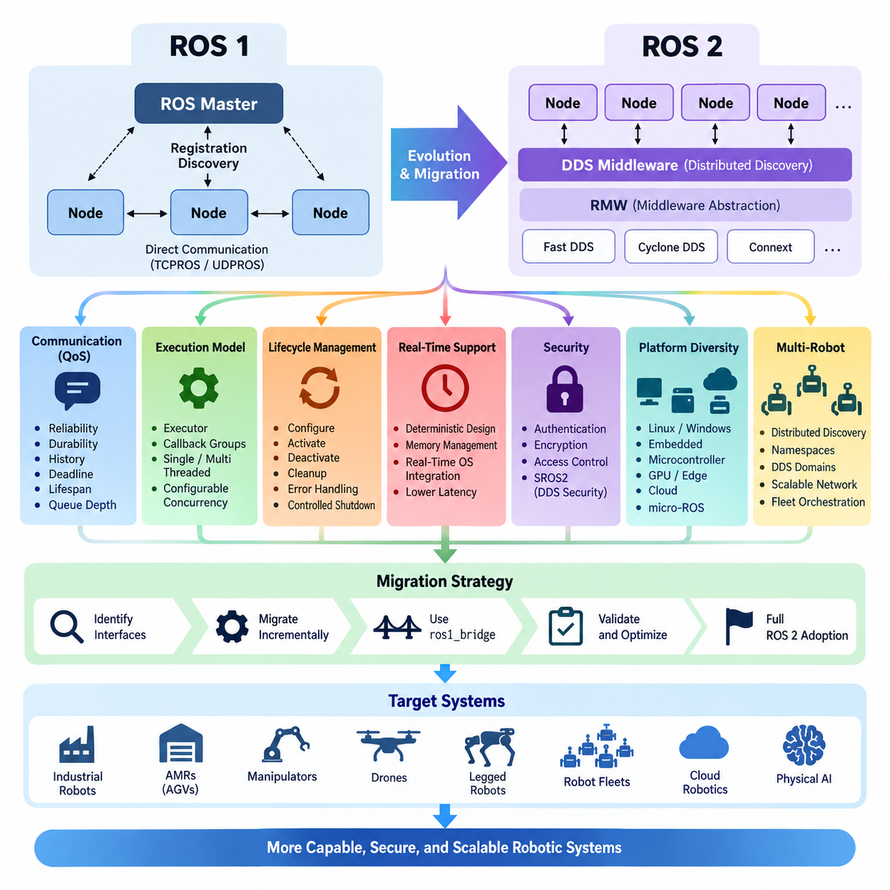
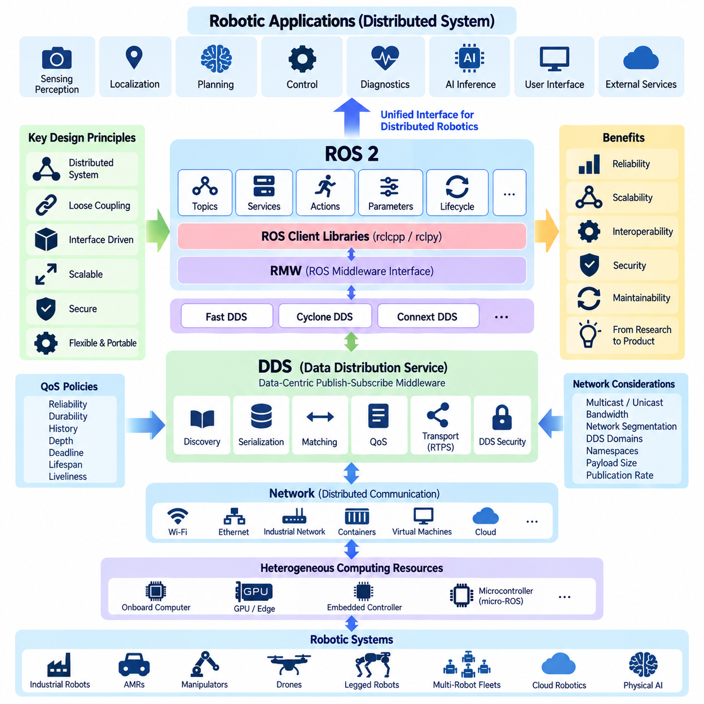
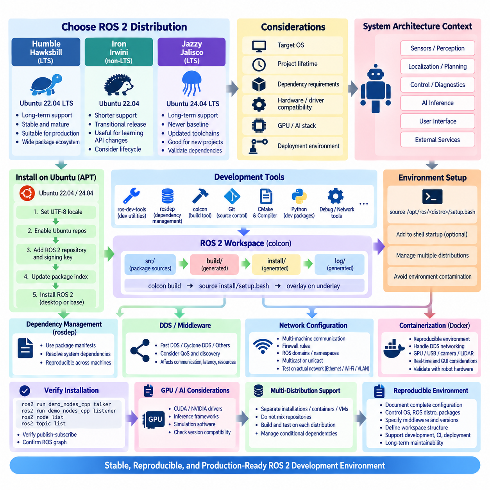
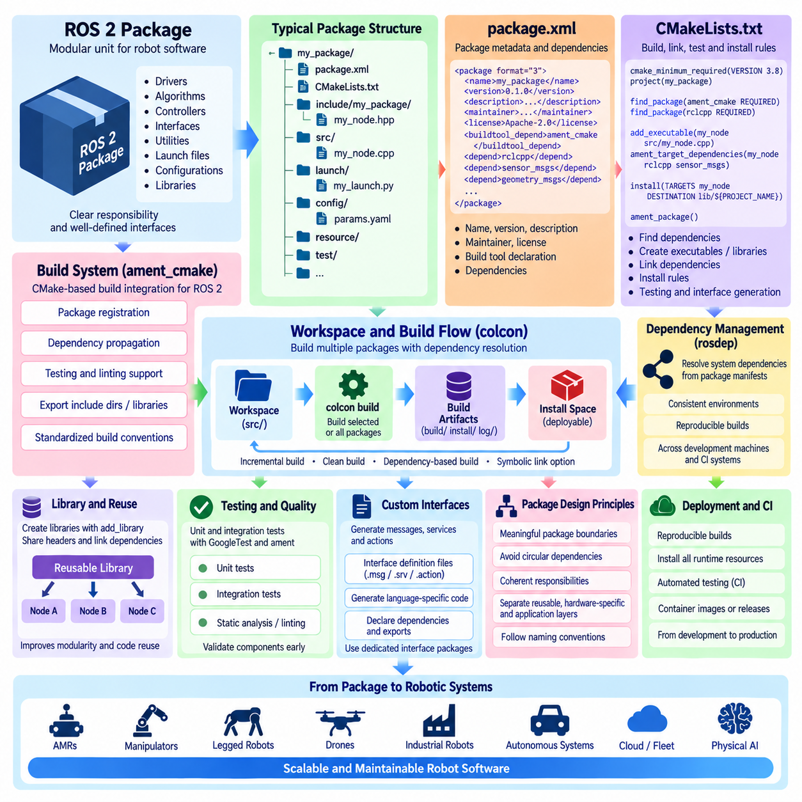
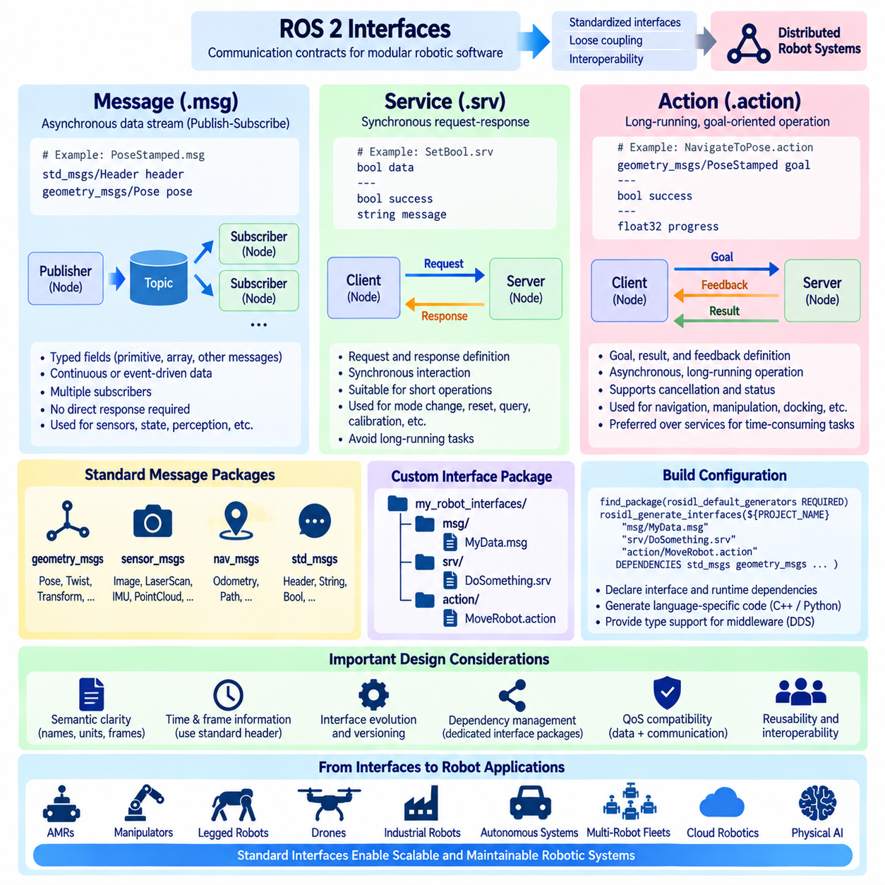
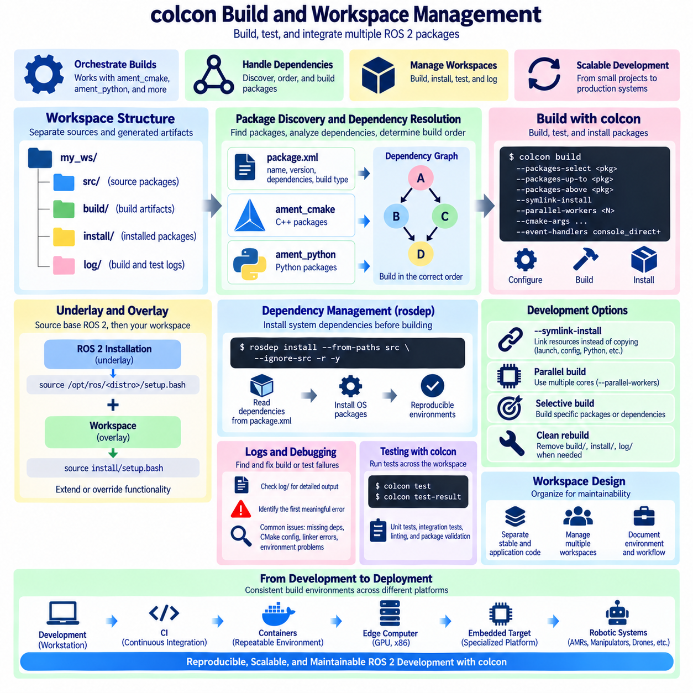
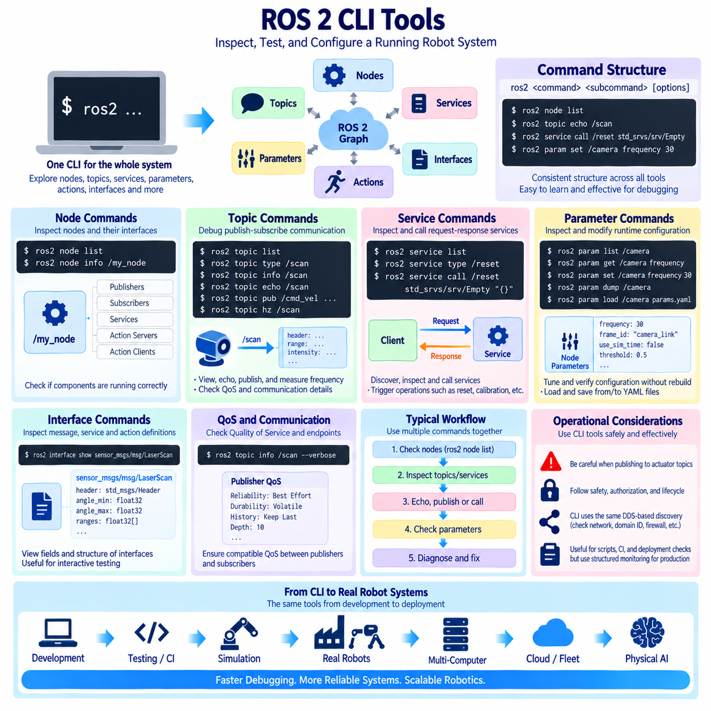
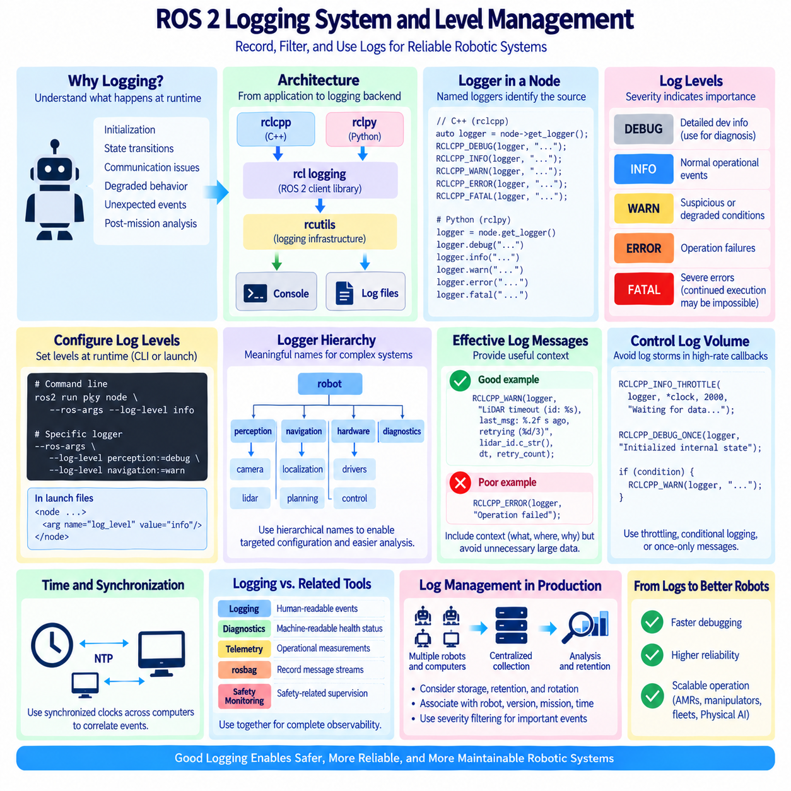
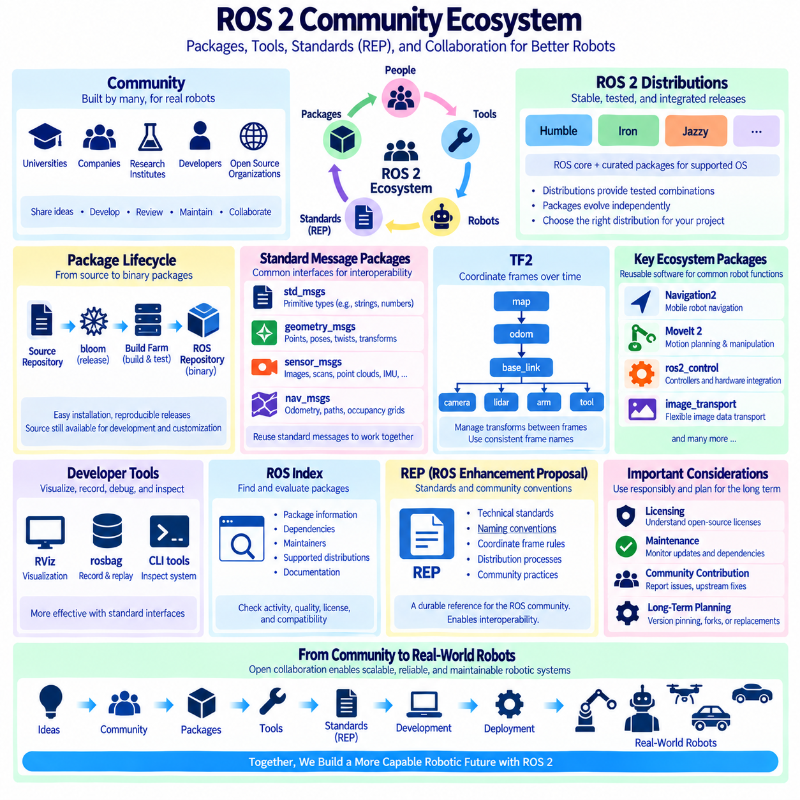
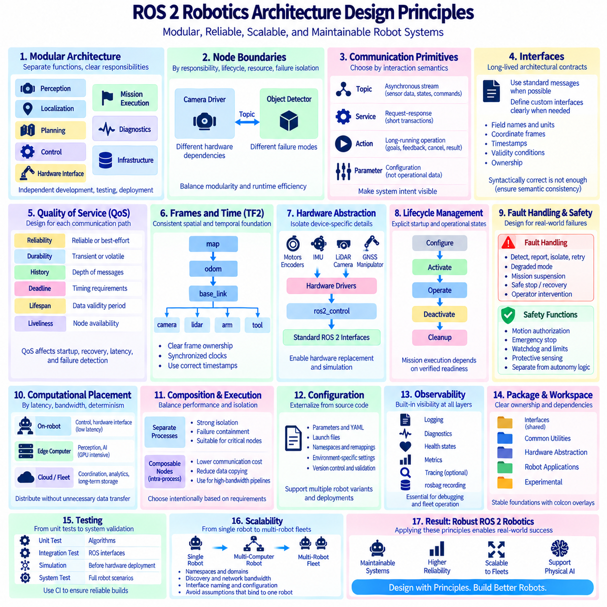

**Volume 05 Robot Middleware and ROS2**


# 01. ROS2 Fundamentals

##  

## 01.01 ROS1 vs ROS2: Architecture Changes and Migration Drivers

{width="7.268055555555556in" height="7.268055555555556in"}

The transition from ROS 1 to ROS 2 was not simply a version upgrade but a fundamental redesign of the middleware architecture for production-grade distributed robotics. ROS 1 established an influential ecosystem for modular robot software, yet its architecture was primarily optimized for research environments, relatively trusted networks, and single-robot systems. ROS 2 retained familiar concepts such as nodes, topics, services, packages, and message interfaces while rebuilding the underlying communication and execution infrastructure.

A central architectural characteristic of ROS 1 is the ROS Master, which provides name registration and discovery information so that nodes can locate publishers, subscribers, and services. Although actual topic data normally flows directly between communicating nodes rather than through the Master, the Master remains an important coordination dependency. This design is straightforward and convenient, but it becomes less attractive when robots must operate across complex networks, recover from failures, or participate in dynamically changing distributed systems.

ROS 2 replaces this master-centered discovery model with a distributed communication architecture built around the Data Distribution Service, or DDS, abstraction. Nodes can discover communication peers through middleware mechanisms without depending on a single ROS Master. ROS 2 additionally introduces the ROS Middleware interface, known as RMW, which separates the ROS client libraries from the underlying middleware implementation. This abstraction allows different DDS implementations and compatible middleware technologies to support the same ROS 2 application model.

Communication semantics represent another major migration driver. ROS 1 provides useful TCPROS and UDPROS mechanisms, but applications have relatively limited control over communication behavior. ROS 2 exposes Quality of Service policies that allow developers to specify reliability, durability, message history, queue depth, deadlines, lifespan, and related delivery characteristics. Sensor streams can therefore favor low latency and tolerate losses, while commands, state transitions, or important events can use stronger delivery guarantees according to system requirements.

The execution model was also redesigned because modern robots execute many asynchronous activities simultaneously. ROS 1 commonly relies on callback queues and spinner-based processing, whereas ROS 2 formalizes executors, callback groups, and configurable concurrency. Single-threaded and multi-threaded execution can be selected according to application requirements, and callbacks can be organized to control mutual exclusion or parallel execution. These mechanisms provide a stronger architectural basis for coordinating perception, planning, communication, diagnostics, and control workloads.

ROS 2 also expands the concept of node state management through managed lifecycle nodes. A conventional node can start and immediately begin operating, but production robots frequently require deterministic initialization and shutdown sequences. Sensors may need calibration before localization starts, localization may need valid state before navigation activates, and actuators should remain disabled until safety conditions are satisfied. Lifecycle states and transitions provide an explicit framework for configuration, activation, deactivation, cleanup, error handling, and controlled shutdown.

Real-time behavior was another important reason for redesigning ROS. ROS 1 was not originally constructed around deterministic execution requirements, making it difficult to use directly in latency-sensitive control paths without additional engineering. ROS 2 was designed with greater consideration for real-time operation, including improved middleware control, executor design, memory-management strategies, and integration with real-time operating environments. This does not make every ROS 2 application automatically real-time, but it provides mechanisms from which more deterministic systems can be engineered.

Security illustrates an equally significant architectural change. ROS 1 generally assumes a trusted environment and does not provide a comprehensive built-in security architecture for authentication, encryption, and fine-grained access control. ROS 2 can use DDS Security capabilities through SROS2 to establish identities, protect communication, and define permissions governing node interactions. These capabilities are increasingly important when robots communicate over enterprise networks, wireless infrastructure, industrial facilities, remote fleet systems, or other environments where implicit trust is unacceptable.

ROS 2 was also designed for broader platform diversity. Modern robotic products may combine Linux computers, Windows workstations, embedded processors, microcontrollers, GPU edge systems, and cloud or fleet infrastructure. The architecture therefore emphasizes portable client libraries, standardized interfaces, middleware abstraction, and support for heterogeneous computing environments. Technologies such as micro-ROS extend ROS 2 concepts toward resource-constrained microcontrollers, helping connect embedded sensing and actuation components with higher-level distributed robot software.

Multi-robot operation further exposes the limitations that motivated the architectural transition. A research robot may contain only dozens of processes on one machine, whereas an industrial fleet can contain many robots, computers, sensors, gateways, and management services. Distributed discovery, namespaces, DDS domains, configurable QoS, and network-aware middleware behavior give ROS 2 stronger foundations for these systems. Nevertheless, large fleets still require deliberate network segmentation, discovery configuration, bandwidth engineering, observability, and higher-level fleet orchestration.

Migration from ROS 1 therefore requires more than mechanically translating source code. Packages must be reconsidered in terms of dependencies, build systems, interfaces, parameter handling, launch architecture, node execution, QoS assumptions, and lifecycle behavior. ROS 1 catkin-based projects typically move toward ament and colcon workflows, while communication code moves to ROS 2 client libraries such as rclcpp or rclpy. Existing topics and services must also be examined because ROS 2 communication policies may need to reflect the actual semantics of each data flow.

A practical migration strategy can preserve operational ROS 1 components while introducing ROS 2 incrementally. Interfaces between subsystems should first be identified, followed by migration of components that benefit most from ROS 2 capabilities. During transitional periods, ros1_bridge can exchange compatible messages between ROS 1 and ROS 2 domains, reducing the need for a single disruptive conversion. However, bridging should normally be treated as a migration mechanism rather than as a permanent substitute for a coherent ROS 2 architecture.

The architectural significance of ROS 2 ultimately lies in its shift from a research-oriented robotics framework toward middleware suitable for distributed robotic products. DDS-based communication, decentralized discovery, QoS control, lifecycle management, improved security, configurable execution, and stronger real-time foundations address requirements that become increasingly important as robots move from laboratories into factories, warehouses, outdoor environments, fleets, and Physical AI systems. Within the attached volume structure, these foundations naturally lead into dedicated treatment of DDS, node architecture, communication, real-time operation, security, lifecycle management, deployment, AMRs, Physical AI, and legged robots.

ROS 1에서 ROS 2로의 전환은 단순한 버전 업그레이드가 아니라, 상용 수준의 분산 로보틱스(Distributed Robotics)를 위한 미들웨어 아키텍처(Middleware Architecture)의 근본적인 재설계이다. ROS 1은 모듈형 로봇 소프트웨어(Modular Robot Software)를 위한 영향력 있는 생태계를 구축했지만, 그 아키텍처는 주로 연구 환경, 비교적 신뢰할 수 있는 네트워크, 단일 로봇 시스템에 최적화되어 있었다. ROS 2는 노드(Node), 토픽(Topic), 서비스(Service), 패키지(Package), 메시지 인터페이스(Message Interface)와 같은 익숙한 개념은 유지하면서 기반 통신 및 실행 인프라를 새롭게 구축하였다.

ROS 1의 핵심적인 아키텍처 특성 가운데 하나는 이름 등록(Name Registration)과 탐색 정보(Discovery Information)를 제공하는 ROS 마스터(ROS Master)이다. 이를 통해 노드는 퍼블리셔(Publisher), 서브스크라이버(Subscriber), 서비스를 찾을 수 있다. 실제 토픽 데이터는 일반적으로 마스터를 통하지 않고 통신 노드 사이에서 직접 전달되지만, 마스터는 여전히 중요한 조정 의존성(Coordination Dependency)으로 존재한다. 이러한 구조는 단순하고 편리하지만 복잡한 네트워크, 장애 복구, 동적으로 변화하는 분산 시스템에서는 제약이 될 수 있다.

ROS 2는 이러한 마스터 중심 탐색 모델(Master-Centered Discovery Model)을 데이터 분산 서비스(Data Distribution Service, DDS) 추상화에 기반한 분산 통신 아키텍처(Distributed Communication Architecture)로 대체한다. 노드는 하나의 ROS 마스터에 의존하지 않고 미들웨어 탐색 메커니즘(Middleware Discovery Mechanism)을 통해 통신 상대를 발견할 수 있다. 또한 ROS 2는 ROS 클라이언트 라이브러리(Client Library)와 하위 미들웨어 구현을 분리하는 ROS 미들웨어 인터페이스(ROS Middleware Interface, RMW)를 도입하였다. 이를 통해 다양한 DDS 구현 및 호환 미들웨어를 동일한 ROS 2 응용 모델에서 사용할 수 있다.

통신 의미론(Communication Semantics) 역시 중요한 마이그레이션 동인(Migration Driver)이다. ROS 1은 유용한 TCPROS와 UDPROS 통신 메커니즘을 제공하지만, 응용 프로그램이 통신 동작을 세밀하게 제어하는 데에는 상대적으로 제한이 있다. ROS 2는 서비스 품질(Quality of Service, QoS) 정책을 제공하여 신뢰성(Reliability), 내구성(Durability), 메시지 이력(History), 큐 깊이(Queue Depth), 데드라인(Deadline), 수명(Lifespan) 등의 전달 특성을 지정할 수 있다. 따라서 센서 스트림은 낮은 지연시간을 우선하면서 일부 손실을 허용하고, 명령이나 상태 전환과 같은 중요 데이터에는 더 강한 전달 보장을 적용할 수 있다.

실행 모델(Execution Model) 역시 현대 로봇이 다수의 비동기 작업(Asynchronous Activity)을 동시에 수행한다는 요구에 맞추어 재설계되었다. ROS 1은 일반적으로 콜백 큐(Callback Queue)와 스피너(Spinner) 기반 처리를 사용하지만, ROS 2는 실행기(Executor), 콜백 그룹(Callback Group), 구성 가능한 동시성(Configurable Concurrency)을 공식적인 구조로 제공한다. 응용 요구사항에 따라 단일 스레드 실행(Single-Threaded Execution)과 다중 스레드 실행(Multi-Threaded Execution)을 선택할 수 있으며, 상호 배제(Mutual Exclusion) 또는 병렬 실행(Parallel Execution)을 제어하도록 콜백을 구성할 수 있다.

ROS 2는 관리형 수명주기 노드(Managed Lifecycle Node)를 통해 노드 상태 관리(Node State Management) 개념도 확장하였다. 일반적인 노드는 시작과 동시에 동작할 수 있지만, 상용 로봇은 결정론적인 초기화 및 종료 순서(Deterministic Initialization and Shutdown Sequence)를 요구하는 경우가 많다. 센서는 위치추정(Localization)이 시작되기 전에 보정되어야 하며, 내비게이션(Navigation)은 유효한 위치 상태가 확보된 이후 활성화되어야 한다. 또한 안전 조건이 충족되기 전까지 액추에이터(Actuator)는 비활성 상태를 유지해야 한다. 수명주기 상태(Lifecycle State)와 전환(Transition)은 이러한 과정을 명시적으로 관리하는 프레임워크를 제공한다.

실시간 동작(Real-Time Behavior)도 ROS를 재설계하게 된 중요한 이유이다. ROS 1은 본래 결정론적 실행 요구사항(Deterministic Execution Requirement)을 중심으로 설계되지 않았기 때문에 추가적인 엔지니어링 없이 지연시간에 민감한 제어 경로에 직접 적용하기 어려운 측면이 있었다. ROS 2는 미들웨어 제어, 실행기 설계, 메모리 관리 전략(Memory Management Strategy), 실시간 운영 환경(Real-Time Operating Environment)과의 통합 등을 고려하여 설계되었다. 이것이 모든 ROS 2 응용 프로그램을 자동으로 실시간 시스템으로 만들어 주는 것은 아니지만, 보다 결정론적인 시스템을 구축할 수 있는 기반을 제공한다.

보안(Security)은 또 하나의 중요한 아키텍처 변화이다. ROS 1은 일반적으로 신뢰할 수 있는 환경을 전제로 하며 인증(Authentication), 암호화(Encryption), 세분화된 접근 제어(Fine-Grained Access Control)를 위한 포괄적인 내장 보안 아키텍처를 제공하지 않는다. ROS 2는 SROS2를 통해 DDS 보안(DDS Security) 기능을 활용하여 노드의 신원(Identity)을 설정하고 통신을 보호하며 노드 간 상호작용을 제어하는 권한(Permission)을 정의할 수 있다. 이러한 기능은 기업 네트워크, 무선 인프라, 산업 시설, 원격 플릿 시스템(Fleet System) 등에서 로봇을 운용할 때 점점 더 중요해지고 있다.

ROS 2는 더욱 폭넓은 플랫폼 다양성(Platform Diversity)을 지원하도록 설계되었다. 현대의 로봇 제품은 리눅스 컴퓨터, 윈도우 워크스테이션, 임베디드 프로세서(Embedded Processor), 마이크로컨트롤러(Microcontroller), GPU 엣지 시스템(GPU Edge System), 클라우드 또는 플릿 인프라를 결합할 수 있다. 이에 따라 ROS 2 아키텍처는 이식 가능한 클라이언트 라이브러리(Portable Client Library), 표준화된 인터페이스, 미들웨어 추상화, 이기종 컴퓨팅 환경(Heterogeneous Computing Environment)의 지원을 강조한다. 마이크로 ROS(micro-ROS)와 같은 기술은 ROS 2 개념을 자원이 제한된 마이크로컨트롤러까지 확장한다.

다중 로봇 운용(Multi-Robot Operation)은 ROS 2로의 아키텍처 전환 필요성을 더욱 명확하게 보여준다. 연구용 로봇은 한 대의 컴퓨터에서 수십 개의 프로세스만 실행할 수도 있지만, 산업용 플릿(Industrial Fleet)은 많은 로봇, 컴퓨터, 센서, 게이트웨이(Gateway), 관리 서비스로 구성될 수 있다. 분산 탐색(Distributed Discovery), 네임스페이스(Namespace), DDS 도메인(DDS Domain), 구성 가능한 QoS, 네트워크 인식형 미들웨어(Network-Aware Middleware)는 이러한 시스템을 위한 보다 강력한 기반을 제공한다. 다만 대규모 플릿에서는 네트워크 분할, 탐색 설정, 대역폭 엔지니어링, 관측 가능성(Observability), 상위 수준 플릿 오케스트레이션(Fleet Orchestration)이 여전히 필요하다.

따라서 ROS 1에서 ROS 2로의 마이그레이션(Migration)은 소스 코드를 기계적으로 변환하는 작업 이상의 의미를 가진다. 패키지는 의존성(Dependency), 빌드 시스템(Build System), 인터페이스, 파라미터 처리(Parameter Handling), 런치 아키텍처(Launch Architecture), 노드 실행, QoS 가정, 수명주기 동작의 관점에서 다시 검토해야 한다. ROS 1의 catkin 기반 프로젝트는 일반적으로 ament와 colcon 기반 작업 흐름으로 이동하며, 통신 코드는 rclcpp 또는 rclpy와 같은 ROS 2 클라이언트 라이브러리로 전환된다. 기존 토픽과 서비스 역시 실제 데이터 흐름의 의미에 적합한 통신 정책을 갖도록 재검토해야 한다.

실용적인 마이그레이션 전략(Practical Migration Strategy)은 기존 ROS 1 구성요소를 유지하면서 ROS 2를 단계적으로 도입하는 방식이 될 수 있다. 먼저 서브시스템(Subsystem) 사이의 인터페이스를 식별하고, ROS 2의 기능으로부터 가장 큰 이점을 얻을 수 있는 구성요소부터 전환하는 것이 효과적이다. 전환 기간에는 ros1_bridge를 사용하여 호환 가능한 메시지를 ROS 1과 ROS 2 도메인 사이에서 교환함으로써 일시에 전체 시스템을 변경해야 하는 위험을 줄일 수 있다. 그러나 브리징(Bridging)은 일반적으로 일관된 ROS 2 아키텍처를 대신하는 영구적인 구조가 아니라 마이그레이션 수단으로 보는 것이 적절하다.

ROS 2의 아키텍처적 의미는 궁극적으로 연구 중심의 로보틱스 프레임워크(Research-Oriented Robotics Framework)에서 분산 로봇 제품에 적합한 미들웨어로의 전환에 있다. DDS 기반 통신, 분산형 탐색(Decentralized Discovery), QoS 제어, 수명주기 관리(Lifecycle Management), 향상된 보안, 구성 가능한 실행 구조, 강화된 실시간 기반은 로봇이 연구실을 넘어 공장, 물류창고, 야외 환경, 대규모 플릿, 피지컬 AI(Physical AI) 시스템으로 확장될수록 중요해지는 요구사항을 해결한다. 이러한 기반은 이후 DDS, 노드 아키텍처, 통신, 실시간 처리, 보안, 수명주기 관리, 배포, 자율이동로봇(Autonomous Mobile Robot, AMR), 피지컬 AI, 보행 로봇(Legged Robot)으로 이어지는 ROS 2 아키텍처의 출발점이 된다.

##  

## 01.02 ROS2 Design Philosophy: DDS-Based Distributed System

{width="7.268055555555556in" height="7.268055555555556in"}

ROS 2 was designed around the principle that a robot is fundamentally a distributed computing system rather than a single application executing on one computer. Modern robots integrate sensors, perception pipelines, localization, planning, control, diagnostics, AI inference, user interfaces, and external services across heterogeneous processors. ROS 2 therefore treats communication, discovery, execution, reliability, and interoperability as fundamental architectural concerns rather than secondary networking features.

At the center of this philosophy is the Data Distribution Service (DDS), an industry-standard data-centric middleware specification for distributed systems. Instead of requiring applications to explicitly manage connections between individual processes, DDS organizes communication around typed data exchanged between publishers and subscribers. ROS 2 maps its topic-oriented communication model onto this data-centric publish-subscribe architecture, allowing nodes to communicate while remaining loosely coupled in location, implementation, execution timing, and deployment configuration.

This distributed philosophy differs fundamentally from architectures that depend on a centralized broker or master for communication discovery. DDS participants can discover one another dynamically and establish communication relationships according to compatible data types and policies. Consequently, ROS 2 nodes do not require a ROS Master to maintain the communication graph. This decentralized structure improves architectural flexibility when processes start, stop, migrate between computers, or operate across multiple computing devices within a robot.

ROS 2 does not expose DDS directly as the only programming interface. Applications normally use client libraries such as rclcpp for C++ or rclpy for Python, while the ROS client library layer communicates through the ROS Middleware interface (RMW). The RMW abstraction separates ROS 2 APIs from specific middleware implementations. As a result, implementations such as Fast DDS, Cyclone DDS, or Connext DDS can provide the underlying transport and discovery mechanisms without requiring application-level ROS interfaces to be redesigned.

The resulting architecture can be understood as several cooperating abstraction layers. Application nodes use ROS 2 concepts such as topics, services, actions, parameters, and lifecycle mechanisms. Client libraries translate these operations into lower-level ROS interfaces, while RMW provides a standardized middleware boundary. Beneath RMW, the selected DDS implementation performs discovery, serialization, transport, matching, and Quality of Service enforcement. This layered structure reduces middleware dependency while preserving a consistent application programming model.

Quality of Service (QoS) is particularly important to the ROS 2 design philosophy because robotic data flows do not share identical communication requirements. A high-rate camera or LiDAR stream may prioritize freshness and low latency over retransmission of every sample, while configuration data or critical state information may require reliable delivery. DDS QoS policies allow ROS 2 systems to express these differences through reliability, durability, history, depth, deadline, lifespan, liveliness, and related communication characteristics.

The DDS-based architecture also introduces the concept of compatibility between communicating endpoints. A publisher and subscriber must not only use compatible message types but must also have QoS configurations that permit communication. This makes communication behavior part of the system architecture rather than an implicit property of the transport. Engineers must therefore design QoS profiles according to the semantics of each data path, considering sensor frequency, network bandwidth, acceptable loss, latency constraints, recovery behavior, and the operational importance of the information.

Decentralized discovery supports dynamic robotic systems in which components may appear or disappear during operation. DDS discovery mechanisms identify participants and their communication endpoints, allowing publishers and subscribers to establish relationships without manually configuring every connection. This capability is valuable when software components are distributed across an onboard computer, GPU edge processor, embedded controller, operator station, or other networked computing resources. The ROS 2 graph can consequently evolve as the deployed system changes.

Data-centric communication also encourages interface-oriented software architecture. A perception node does not need detailed knowledge of the internal implementation of a localization or planning node; it primarily needs to understand the data interface and communication contract. Components can therefore be developed, tested, replaced, and deployed with greater independence when interfaces are carefully designed. This loose coupling becomes increasingly important as robotic software grows from experimental prototypes into long-lived products maintained by multiple engineering teams.

DDS also provides transport mechanisms appropriate for distributed communication, commonly using the Real-Time Publish-Subscribe (RTPS) interoperability protocol. Depending on the middleware configuration and network environment, communication can employ multicast or unicast discovery and data exchange mechanisms. ROS 2 developers therefore need to consider the underlying network as part of system design, especially when deploying across Wi-Fi, Ethernet, segmented industrial networks, containers, virtual machines, or multi-robot infrastructures.

The ROS 2 distributed model does not imply that every software function should communicate over an external network. Components executing in the same process can use composition and intra-process communication to reduce unnecessary serialization and data copying. Components on different processes or computers can communicate through middleware transports. This allows designers to select deployment boundaries according to fault isolation, performance, maintainability, computational load, and hardware topology while retaining a common ROS 2 communication model.

Scalability is another reason for adopting this architecture, but DDS alone does not automatically guarantee unlimited scaling. As the number of nodes, topics, sensors, computers, and robots increases, discovery traffic and high-bandwidth data streams can place substantial load on the network. Engineers must manage DDS domains, namespaces, discovery behavior, QoS policies, publication rates, payload sizes, and network segmentation. Large robot fleets may additionally require gateways or higher-level fleet communication architectures rather than placing every endpoint within one unrestricted discovery domain.

The distributed architecture also influences fault tolerance. Eliminating the ROS Master removes one centralized coordination dependency, but individual nodes, middleware participants, networks, and hardware components can still fail. Robust ROS 2 systems therefore combine decentralized communication with lifecycle management, diagnostics, health monitoring, restart mechanisms, redundant components, and safe-state strategies. Distribution provides architectural flexibility, while system-level reliability must still be deliberately engineered according to the consequences of each component failure.

Security becomes inseparable from distribution because dynamically discovered nodes may communicate across network boundaries. DDS Security provides mechanisms for authentication, encryption, integrity protection, and access control, which ROS 2 can integrate through SROS2. Rather than assuming that every process on a robot network is trustworthy, production architectures can establish identities and communication permissions. This is particularly important for industrial robots, autonomous mobile robots, remote operation, multi-robot fleets, and cloud-connected robotic systems.

The DDS-based philosophy ultimately enables ROS 2 to function as a common communication fabric across heterogeneous robotic computing resources. Sensors and embedded devices can feed perception pipelines, GPU systems can execute AI inference, planning nodes can generate decisions, and control components can consume resulting commands while remaining separated by well-defined interfaces. Technologies such as micro-ROS extend this architectural concept toward resource-constrained microcontrollers, further connecting embedded devices with the broader ROS 2 computational graph.

For Physical AI and increasingly autonomous robots, this distributed foundation becomes especially significant because intelligence is no longer located in a single software module. Perception, world modeling, semantic reasoning, planning, learned policies, motion generation, safety supervision, and fleet intelligence may execute on different processors or computing tiers. ROS 2 provides the communication and integration layer connecting these capabilities, while DDS supplies the distributed data infrastructure needed to exchange information according to explicit performance and reliability requirements.

ROS 2 should therefore be understood not merely as a collection of robotics libraries but as a distributed systems architecture specialized for robotic integration. DDS, RMW abstraction, decentralized discovery, configurable QoS, heterogeneous deployment, security, and interface-driven modularity form interconnected design principles. Together they establish the foundation upon which later ROS 2 topics---including node architecture, communication patterns, real-time operation, lifecycle management, AMR integration, Physical AI, and multi-robot systems---can be systematically constructed.

ROS 2는 로봇을 하나의 컴퓨터에서 실행되는 단일 응용 프로그램이 아니라, 본질적으로 분산 컴퓨팅 시스템(Distributed Computing System)으로 바라보는 원칙을 중심으로 설계되었다. 현대 로봇은 이기종 프로세서(Heterogeneous Processor)에 분산된 센서, 인지 파이프라인(Perception Pipeline), 위치추정(Localization), 계획(Planning), 제어(Control), 진단(Diagnostics), AI 추론(AI Inference), 사용자 인터페이스(User Interface), 외부 서비스를 통합한다. 따라서 ROS 2는 통신, 탐색, 실행, 신뢰성, 상호운용성을 핵심 아키텍처 요소로 취급한다.

이러한 철학의 중심에는 분산 시스템을 위한 산업 표준 데이터 중심 미들웨어(Data-Centric Middleware) 규격인 데이터 분산 서비스(Data Distribution Service, DDS)가 있다. DDS는 응용 프로그램이 개별 프로세스 사이의 연결을 직접 관리하도록 요구하는 대신, 퍼블리셔(Publisher)와 서브스크라이버(Subscriber) 사이에서 교환되는 형식화된 데이터(Typed Data)를 중심으로 통신을 구성한다. ROS 2는 토픽 중심 통신 모델(Topic-Oriented Communication Model)을 이러한 데이터 중심 발행-구독 아키텍처(Data-Centric Publish-Subscribe Architecture)에 대응시킨다.

이러한 분산 철학(Distributed Philosophy)은 통신 탐색을 위해 중앙 집중식 브로커(Centralized Broker)나 마스터(Master)에 의존하는 아키텍처와 근본적으로 다르다. DDS 참여자(Participant)는 서로를 동적으로 탐색하고 호환되는 데이터 형식과 정책에 따라 통신 관계를 설정할 수 있다. 따라서 ROS 2 노드는 통신 그래프(Communication Graph)를 유지하기 위한 ROS 마스터(ROS Master)를 필요로 하지 않는다. 이러한 분산 구조는 프로세스가 시작·종료되거나 다른 컴퓨터로 이동하고 여러 컴퓨팅 장치에 걸쳐 동작하는 환경에서 높은 유연성을 제공한다.

ROS 2는 DDS를 유일한 프로그래밍 인터페이스로 직접 노출하지 않는다. 응용 프로그램은 일반적으로 C++용 rclcpp 또는 파이썬(Python)용 rclpy와 같은 클라이언트 라이브러리(Client Library)를 사용하며, ROS 클라이언트 라이브러리 계층은 ROS 미들웨어 인터페이스(ROS Middleware Interface, RMW)를 통해 통신한다. RMW 추상화(RMW Abstraction)는 ROS 2 API와 특정 미들웨어 구현을 분리한다. 이에 따라 Fast DDS, Cyclone DDS, Connext DDS 등의 구현이 응용 수준의 ROS 인터페이스를 변경하지 않고 하위 통신 및 탐색 기능을 제공할 수 있다.

그 결과 ROS 2 아키텍처는 여러 개의 상호 협력하는 추상화 계층(Abstraction Layer)으로 이해할 수 있다. 응용 노드는 토픽(Topic), 서비스(Service), 액션(Action), 파라미터(Parameter), 수명주기 메커니즘(Lifecycle Mechanism)과 같은 ROS 2 개념을 사용한다. 클라이언트 라이브러리는 이러한 연산을 하위 ROS 인터페이스로 변환하고, RMW는 표준화된 미들웨어 경계를 제공한다. 그 아래에서 선택된 DDS 구현은 탐색, 직렬화(Serialization), 전송(Transport), 매칭(Matching), 서비스 품질(Quality of Service, QoS) 적용을 수행한다.

서비스 품질(Quality of Service, QoS)은 로봇의 모든 데이터 흐름이 동일한 통신 요구사항을 갖지 않기 때문에 ROS 2 설계 철학에서 특히 중요하다. 고속 카메라나 라이다(LiDAR) 스트림은 모든 샘플의 재전송보다 데이터 최신성과 낮은 지연시간을 우선할 수 있지만, 설정 데이터나 중요한 상태 정보는 신뢰성 있는 전달이 필요할 수 있다. DDS QoS 정책은 신뢰성(Reliability), 내구성(Durability), 이력(History), 깊이(Depth), 데드라인(Deadline), 수명(Lifespan), 활성도(Liveliness) 등의 특성을 통해 이러한 차이를 표현할 수 있게 한다.

DDS 기반 아키텍처는 통신 끝점(Communication Endpoint) 사이의 호환성(Compatibility) 개념도 도입한다. 퍼블리셔와 서브스크라이버는 호환 가능한 메시지 형식을 사용하는 것뿐만 아니라 통신을 허용하는 QoS 구성을 가져야 한다. 따라서 통신 동작 자체가 단순한 전송 계층의 암묵적 특성이 아니라 시스템 아키텍처의 일부가 된다. 엔지니어는 센서 주파수, 네트워크 대역폭, 허용 가능한 손실, 지연시간 제약, 복구 동작, 정보의 운용 중요성을 고려하여 각 데이터 경로에 적합한 QoS 프로파일(QoS Profile)을 설계해야 한다.

분산형 탐색(Decentralized Discovery)은 운용 중 구성요소가 나타나거나 사라질 수 있는 동적 로봇 시스템(Dynamic Robotic System)을 지원한다. DDS 탐색 메커니즘은 참여자와 통신 끝점을 식별하여 퍼블리셔와 서브스크라이버가 모든 연결을 수동 설정하지 않고 관계를 형성할 수 있게 한다. 이는 소프트웨어 구성요소가 온보드 컴퓨터(Onboard Computer), GPU 엣지 프로세서(GPU Edge Processor), 임베디드 컨트롤러(Embedded Controller), 운영자 스테이션(Operator Station) 등의 네트워크 컴퓨팅 자원에 분산되는 환경에서 유용하다.

데이터 중심 통신(Data-Centric Communication)은 인터페이스 지향 소프트웨어 아키텍처(Interface-Oriented Software Architecture)를 촉진한다. 인지 노드(Perception Node)는 위치추정 또는 계획 노드의 내부 구현을 상세하게 알 필요가 없으며, 주로 데이터 인터페이스와 통신 계약(Communication Contract)을 이해하면 된다. 따라서 인터페이스가 신중하게 설계되면 구성요소를 보다 독립적으로 개발, 시험, 교체, 배포할 수 있다. 이러한 느슨한 결합(Loose Coupling)은 로봇 소프트웨어가 연구용 프로토타입에서 여러 엔지니어링 팀이 장기간 유지하는 제품으로 발전할수록 중요해진다.

DDS는 분산 통신에 적합한 전송 메커니즘도 제공하며, 일반적으로 실시간 발행-구독(Real-Time Publish-Subscribe, RTPS) 상호운용 프로토콜을 사용한다. 미들웨어 설정과 네트워크 환경에 따라 통신은 멀티캐스트(Multicast) 또는 유니캐스트(Unicast) 기반 탐색 및 데이터 교환을 사용할 수 있다. 따라서 ROS 2 개발자는 특히 Wi-Fi, 이더넷(Ethernet), 분할된 산업용 네트워크, 컨테이너(Container), 가상 머신(Virtual Machine), 다중 로봇 인프라에 배포할 때 네트워크 자체를 시스템 설계의 일부로 고려해야 한다.

ROS 2의 분산 모델이 모든 소프트웨어 기능을 외부 네트워크를 통해 통신하도록 해야 한다는 의미는 아니다. 동일한 프로세스에서 실행되는 구성요소는 컴포지션(Composition)과 프로세스 내부 통신(Intra-Process Communication)을 사용하여 불필요한 직렬화와 데이터 복사를 줄일 수 있다. 서로 다른 프로세스나 컴퓨터의 구성요소는 미들웨어 전송을 이용할 수 있다. 이를 통해 설계자는 공통 ROS 2 통신 모델을 유지하면서 장애 격리(Fault Isolation), 성능, 유지보수성, 계산 부하, 하드웨어 토폴로지에 따라 배포 경계를 결정할 수 있다.

확장성(Scalability) 역시 이러한 아키텍처를 채택하는 중요한 이유이지만, DDS 자체가 무제한 확장성을 자동으로 보장하는 것은 아니다. 노드, 토픽, 센서, 컴퓨터, 로봇의 수가 증가하면 탐색 트래픽(Discovery Traffic)과 고대역폭 데이터 스트림이 네트워크에 상당한 부하를 줄 수 있다. 엔지니어는 DDS 도메인(DDS Domain), 네임스페이스(Namespace), 탐색 동작, QoS 정책, 발행 주기, 페이로드 크기(Payload Size), 네트워크 분할(Network Segmentation)을 관리해야 한다. 대규모 로봇 플릿(Robot Fleet)에서는 게이트웨이(Gateway)나 상위 수준 플릿 통신 아키텍처가 추가로 필요할 수 있다.

분산 아키텍처(Distributed Architecture)는 결함 허용(Fault Tolerance)에도 영향을 준다. ROS 마스터를 제거하면 하나의 중앙 집중식 조정 의존성은 사라지지만, 개별 노드, 미들웨어 참여자, 네트워크, 하드웨어 구성요소는 여전히 고장날 수 있다. 따라서 견고한 ROS 2 시스템은 분산 통신과 함께 수명주기 관리(Lifecycle Management), 진단(Diagnostics), 상태 감시(Health Monitoring), 재시작 메커니즘(Restart Mechanism), 중복 구성요소(Redundant Component), 안전 상태 전략(Safe-State Strategy)을 결합해야 한다. 분산 구조는 유연성을 제공하지만 시스템 수준의 신뢰성은 의도적으로 설계되어야 한다.

보안(Security)은 동적으로 탐색된 노드가 네트워크 경계를 넘어 통신할 수 있기 때문에 분산 시스템과 분리할 수 없는 요소가 된다. DDS 보안(DDS Security)은 인증(Authentication), 암호화(Encryption), 무결성 보호(Integrity Protection), 접근 제어(Access Control) 메커니즘을 제공하며, ROS 2는 이를 SROS2를 통해 통합할 수 있다. 상용 아키텍처는 로봇 네트워크의 모든 프로세스를 신뢰한다고 가정하는 대신 각 노드의 신원과 통신 권한을 정의할 수 있다. 이는 산업용 로봇, 자율이동로봇(Autonomous Mobile Robot, AMR), 원격 운용, 다중 로봇 플릿, 클라우드 연결 시스템에서 특히 중요하다.

DDS 기반 철학은 궁극적으로 ROS 2가 이기종 로봇 컴퓨팅 자원(Heterogeneous Robotic Computing Resource)을 연결하는 공통 통신 패브릭(Common Communication Fabric)으로 기능할 수 있게 한다. 센서와 임베디드 장치는 인지 파이프라인에 데이터를 공급하고, GPU 시스템은 AI 추론을 수행하며, 계획 노드는 의사결정을 생성하고, 제어 구성요소는 결과 명령을 사용할 수 있다. 이러한 구성요소들은 명확하게 정의된 인터페이스를 통해 분리된 상태를 유지하며, 마이크로 ROS(micro-ROS)는 이 구조를 자원이 제한된 마이크로컨트롤러까지 확장한다.

피지컬 AI(Physical AI)와 고도 자율 로봇에서는 지능이 하나의 소프트웨어 모듈에 존재하지 않기 때문에 이러한 분산 기반이 더욱 중요해진다. 인지, 월드 모델링(World Modeling), 의미 추론(Semantic Reasoning), 계획, 학습 정책(Learned Policy), 모션 생성(Motion Generation), 안전 감독(Safety Supervision), 플릿 지능(Fleet Intelligence)은 서로 다른 프로세서나 컴퓨팅 계층에서 실행될 수 있다. ROS 2는 이러한 기능을 연결하는 통신 및 통합 계층을 제공하며, DDS는 명시적인 성능 및 신뢰성 요구사항에 따라 정보를 교환하기 위한 분산 데이터 인프라를 제공한다.

따라서 ROS 2는 단순한 로보틱스 라이브러리(Robotics Library)의 집합이 아니라 로봇 통합을 위해 특화된 분산 시스템 아키텍처(Distributed Systems Architecture)로 이해해야 한다. DDS, RMW 추상화, 분산형 탐색, 구성 가능한 QoS, 이기종 배포(Heterogeneous Deployment), 보안, 인터페이스 중심 모듈성(Interface-Driven Modularity)은 서로 연결된 핵심 설계 원칙이다. 이러한 기반 위에서 노드 아키텍처, 통신 패턴, 실시간 운용, 수명주기 관리, AMR 통합, 피지컬 AI, 다중 로봇 시스템(Multi-Robot System)과 같은 후속 ROS 2 기술을 체계적으로 구축할 수 있다.

##  

## 01.03 ROS2 Installation / Dev Environment: Humble, Iron, Jazzy [w/Code]

{width="7.268055555555556in" height="7.268055555555556in"}

Installing ROS 2 is not merely a matter of placing middleware packages on a computer; it establishes a complete development environment in which operating-system versions, ROS distributions, compilers, Python packages, build tools, middleware implementations, and workspace configuration must remain compatible. Humble, Iron, and Jazzy represent successive ROS 2 generations, and selecting among them should begin with the target operating system, project lifetime, dependency requirements, and expected deployment environment.

ROS 2 Humble Hawksbill is a Long Term Support release associated primarily with Ubuntu 22.04 LTS and remains important for robotic products requiring a stable software baseline. Its long support period and mature package ecosystem make it suitable for production platforms where frequent operating-system migration is undesirable. Existing AMRs, manipulators, autonomous systems, and industrial robot applications may therefore continue using Humble even when newer ROS 2 distributions become available.

ROS 2 Iron Irwini represents an intermediate generation between Humble and Jazzy and is commonly associated with Ubuntu 22.04. Unlike Humble and Jazzy, Iron is not an LTS ROS 2 distribution, so its official support period is considerably shorter. Iron is useful for understanding API and package evolution between major long-term releases, but new long-lived production projects should carefully consider lifecycle requirements before selecting a distribution whose official maintenance period has already ended.

ROS 2 Jazzy Jalisco is a Long Term Support distribution primarily associated with Ubuntu 24.04 LTS. Jazzy provides a newer baseline for ROS 2 development and benefits from updated compilers, Python versions, middleware packages, and operating-system components. For projects beginning on Ubuntu 24.04 and intended to remain active for several years, Jazzy provides a natural development foundation, provided that required robot drivers, simulation packages, AI integrations, and third-party dependencies have been validated.

Distribution selection should therefore be treated as a system architecture decision rather than an isolated developer preference. A project already standardized on Ubuntu 22.04 with verified hardware drivers may obtain greater operational value from Humble, while a new Ubuntu 24.04 platform may favor Jazzy. The newest distribution is not automatically the best choice when a robot depends on proprietary sensor SDKs, GPU software, fieldbus drivers, vendor packages, or simulation tools with specific operating-system compatibility requirements.

On Ubuntu, binary package installation through the Advanced Package Tool (APT) is generally the most convenient development approach. The system locale should support UTF-8, the appropriate Ubuntu repositories must be enabled, and the official ROS package repository and signing key must be configured. After the package index is updated, developers can install either a desktop-oriented ROS environment containing common development and visualization tools or a smaller ROS base environment suitable for minimal systems and deployment targets.

The development environment also requires supporting tools beyond the ROS runtime itself. ros-dev-tools provides commonly required development utilities, while rosdep manages system dependencies declared by ROS packages. colcon serves as the standard workspace build tool, and Git remains essential for source management. Depending on the project, additional compiler tools, CMake, Python development packages, debugging utilities, networking tools, and middleware-specific configuration packages may also become part of the standardized development workstation.

After installation, the ROS 2 environment must be sourced before ROS commands and packages become available in the active shell. A distribution installed under /opt/ros typically provides a setup script that initializes environment variables and package search paths. Developers often add the appropriate source command to their shell startup configuration, but machines containing multiple ROS distributions require additional discipline because automatically sourcing one environment can unintentionally contaminate builds or tests intended for another distribution.

A ROS 2 development workspace normally separates source code from generated build artifacts. The workspace contains a src directory for package sources, while colcon creates build, install, and log directories during compilation. Developers place or clone packages under src, resolve dependencies with rosdep, execute colcon build from the workspace root, and then source the generated install/setup script. This overlay mechanism allows locally developed packages to extend or override packages supplied by the underlying ROS installation.

Environment layering is one of the most important concepts in ROS 2 development. The installed ROS distribution acts as an underlay, while a locally built workspace becomes an overlay. Additional workspaces can be layered above it when necessary. Although this mechanism enables modular development, excessive or inconsistent overlays can cause difficult dependency and package-resolution problems. Production teams should therefore define reproducible workspace structures and clearly specify which underlay and overlay combinations are supported.

Dependency management through rosdep is essential when source packages are shared across development machines or continuous integration systems. Package manifests describe dependencies using ROS package conventions, and rosdep maps these declarations to platform-specific system packages. Rather than manually installing libraries until compilation succeeds, developers can use dependency metadata to reconstruct the required environment. This approach improves reproducibility and reduces configuration differences among workstations, build servers, simulation computers, and robot targets.

A basic installation should always be validated before a large robot software stack is introduced. ROS 2 provides demonstration publisher and subscriber nodes that can confirm whether the client libraries, DDS middleware, discovery process, and topic communication are functioning correctly. Running a talker in one terminal and a listener in another verifies the fundamental publish-subscribe path. Command-line tools such as ros2 node list and ros2 topic list can then confirm that the expected ROS graph is visible.

DDS behavior must also be considered when establishing the development environment. ROS 2 communicates through an RMW implementation backed by middleware such as Fast DDS, Cyclone DDS, or another supported implementation. The default middleware may be sufficient for initial development, but production projects should explicitly document the selected implementation and configuration. Changing middleware can affect discovery behavior, network traffic, QoS compatibility, latency, resource consumption, and communication across multiple computers.

Network configuration becomes particularly important when ROS 2 nodes operate on different machines. Hosts must have compatible network connectivity, firewall rules must permit required middleware traffic, and ROS domain configuration should prevent unintended interaction with unrelated systems. Multicast availability can influence automatic discovery depending on middleware configuration. Development teams should therefore test communication on the actual Ethernet, Wi-Fi, VLAN, container, or industrial network topology intended for deployment rather than assuming localhost behavior represents field operation.

Containerization can provide another method for maintaining reproducible ROS 2 environments. Docker images can preserve a specific Ubuntu version, ROS distribution, package set, and build configuration while isolating projects from host-system changes. However, containers introduce additional considerations for DDS discovery, multicast networking, GPU access, USB devices, cameras, LiDAR interfaces, real-time scheduling, and graphical applications. Container adoption should therefore be validated against the robot\'s hardware and network requirements rather than treated only as a software packaging decision.

Development environments for GPU-accelerated robotics require additional compatibility planning. CUDA, NVIDIA drivers, inference frameworks, simulation software, and ROS packages may each impose version constraints. A ROS distribution that works correctly at the middleware level may still be unsuitable if the required perception or simulation stack does not support its Ubuntu baseline. GPU driver and CUDA compatibility should therefore be validated together with ROS, sensor SDKs, AI frameworks, and deployment hardware before the platform baseline is frozen.

Teams supporting Humble, Iron, and Jazzy simultaneously should avoid mixing package repositories or shell environments. Separate native installations, containers, virtual machines, or clearly controlled build environments can reduce accidental cross-version dependencies. Source code intended to support multiple distributions should be continuously compiled and tested against each supported target. Conditional dependencies or API differences should be explicitly managed rather than relying on a developer workstation that happens to contain compatible packages.

A production-quality ROS 2 environment should ultimately be reproducible from documented configuration rather than from the history of one engineer\'s workstation. The Ubuntu release, ROS distribution, package repositories, middleware implementation, dependency versions, compiler environment, workspace layout, environment variables, container definitions, and hardware SDKs should all be controlled. This transforms ROS 2 installation from a one-time setup procedure into a maintainable engineering baseline supporting development, simulation, continuous integration, deployment, debugging, and long-term robot software maintenance.

ROS 2 설치는 단순히 컴퓨터에 미들웨어 패키지(Middleware Package)를 설치하는 작업이 아니라, 운영체제 버전, ROS 배포판(ROS Distribution), 컴파일러(Compiler), 파이썬 패키지(Python Package), 빌드 도구(Build Tool), 미들웨어 구현(Middleware Implementation), 워크스페이스 설정(Workspace Configuration)이 서로 호환되는 완전한 개발 환경(Development Environment)을 구축하는 과정이다. Humble, Iron, Jazzy는 연속된 ROS 2 세대를 나타내며, 배포판 선택은 대상 운영체제, 프로젝트 수명, 의존성 요구사항, 예상 배포 환경을 기준으로 시작해야 한다.

ROS 2 Humble Hawksbill은 주로 Ubuntu 22.04 LTS와 연계되는 장기 지원(Long Term Support, LTS) 배포판으로, 안정적인 소프트웨어 기준선(Software Baseline)이 필요한 로봇 제품에서 여전히 중요하다. 긴 지원 기간과 성숙한 패키지 생태계(Package Ecosystem)는 운영체제를 자주 변경하기 어려운 상용 플랫폼에 적합하다. 따라서 기존 자율이동로봇(Autonomous Mobile Robot, AMR), 매니퓰레이터(Manipulator), 자율 시스템, 산업용 로봇 응용은 더 새로운 ROS 2 배포판이 등장하더라도 Humble을 계속 사용할 수 있다.

ROS 2 Iron Irwini는 Humble과 Jazzy 사이의 중간 세대를 나타내며 일반적으로 Ubuntu 22.04와 연계된다. Humble 및 Jazzy와 달리 Iron은 장기 지원 ROS 2 배포판이 아니므로 공식 지원 기간이 상당히 짧다. Iron은 주요 장기 지원 배포판 사이에서 API와 패키지가 어떻게 발전했는지 이해하는 데 유용하지만, 장기간 운용될 새로운 상용 프로젝트에서는 공식 유지보수 기간이 이미 종료된 배포판을 선택하기 전에 제품 수명주기(Product Lifecycle) 요구사항을 신중하게 고려해야 한다.

ROS 2 Jazzy Jalisco는 주로 Ubuntu 24.04 LTS와 연계되는 장기 지원 배포판이다. Jazzy는 ROS 2 개발을 위한 보다 새로운 기준선을 제공하며 업데이트된 컴파일러, 파이썬 버전, 미들웨어 패키지, 운영체제 구성요소의 이점을 활용할 수 있다. Ubuntu 24.04에서 새롭게 시작하여 여러 해 동안 유지할 프로젝트라면 Jazzy가 자연스러운 개발 기반이 될 수 있다. 다만 필요한 로봇 드라이버, 시뮬레이션 패키지, AI 통합 요소, 서드파티 의존성(Third-Party Dependency)에 대한 사전 검증이 필요하다.

따라서 배포판 선택(Distribution Selection)은 개별 개발자의 선호가 아니라 시스템 아키텍처(System Architecture)의 의사결정으로 다루어야 한다. 이미 Ubuntu 22.04를 표준으로 사용하고 검증된 하드웨어 드라이버를 보유한 프로젝트라면 Humble이 더 높은 운영 가치를 제공할 수 있으며, 새로운 Ubuntu 24.04 플랫폼이라면 Jazzy가 적합할 수 있다. 로봇이 특정 운영체제 호환성을 요구하는 독점 센서 SDK, GPU 소프트웨어, 필드버스 드라이버(Fieldbus Driver), 제조사 패키지 또는 시뮬레이션 도구에 의존한다면 가장 최신 배포판이 항상 최선인 것은 아니다.

Ubuntu에서는 고급 패키지 도구(Advanced Package Tool, APT)를 이용한 바이너리 패키지 설치(Binary Package Installation)가 일반적으로 가장 편리한 개발 방식이다. 시스템 로케일(Locale)은 UTF-8을 지원해야 하며, 필요한 Ubuntu 저장소와 공식 ROS 패키지 저장소 및 서명 키(Signing Key)를 구성해야 한다. 패키지 인덱스를 업데이트한 후에는 일반적인 개발 및 시각화 도구를 포함하는 데스크톱 중심 ROS 환경이나 최소 시스템과 배포 대상에 적합한 소규모 ROS 기본 환경(ROS Base Environment)을 설치할 수 있다.

개발 환경에는 ROS 런타임(ROS Runtime) 이외에도 다양한 지원 도구가 필요하다. ros-dev-tools는 일반적으로 필요한 개발 유틸리티(Development Utility)를 제공하고, rosdep은 ROS 패키지에 선언된 시스템 의존성(System Dependency)을 관리한다. colcon은 표준 워크스페이스 빌드 도구로 사용되며 Git은 소스 관리에 필수적이다. 프로젝트에 따라 추가적인 컴파일러 도구, CMake, 파이썬 개발 패키지, 디버깅 유틸리티, 네트워크 도구, 미들웨어별 설정 패키지도 표준 개발 워크스테이션(Development Workstation)의 일부가 될 수 있다.

설치가 완료된 후에는 활성 셸(Active Shell)에서 ROS 명령과 패키지를 사용하기 전에 ROS 2 환경을 소싱(Sourcing)해야 한다. 일반적으로 /opt/ros 아래에 설치된 ROS 배포판은 환경 변수(Environment Variable)와 패키지 검색 경로를 초기화하는 설정 스크립트(Setup Script)를 제공한다. 개발자는 해당 소싱 명령을 셸 시작 설정에 추가하기도 하지만, 여러 ROS 배포판이 설치된 컴퓨터에서는 하나의 환경을 자동으로 소싱하면 다른 배포판을 대상으로 하는 빌드나 시험 환경이 의도하지 않게 오염될 수 있으므로 주의해야 한다.

ROS 2 개발 워크스페이스(Development Workspace)는 일반적으로 소스 코드와 생성된 빌드 결과물을 분리한다. 워크스페이스에는 패키지 소스를 저장하는 src 디렉터리가 있으며, colcon은 컴파일 과정에서 build, install, log 디렉터리를 생성한다. 개발자는 src 아래에 패키지를 배치하거나 복제(Clone)하고 rosdep으로 의존성을 해결한 후 워크스페이스 루트에서 colcon build를 실행한다. 이후 생성된 install/setup 스크립트를 소싱함으로써 로컬 개발 패키지를 기본 ROS 설치 환경 위에 추가하거나 재정의할 수 있다.

환경 계층화(Environment Layering)는 ROS 2 개발에서 가장 중요한 개념 가운데 하나이다. 설치된 ROS 배포판은 언더레이(Underlay) 역할을 하고, 로컬에서 빌드한 워크스페이스는 오버레이(Overlay)가 된다. 필요한 경우 그 위에 추가 워크스페이스를 계층적으로 구성할 수도 있다. 이러한 방식은 모듈식 개발을 가능하게 하지만 지나치게 많거나 일관성이 없는 오버레이는 복잡한 의존성 및 패키지 해석 문제를 발생시킬 수 있다. 따라서 상용 개발팀은 재현 가능한 워크스페이스 구조와 지원되는 언더레이·오버레이 조합을 명확하게 정의해야 한다.

rosdep을 통한 의존성 관리(Dependency Management)는 소스 패키지를 여러 개발 컴퓨터 또는 지속적 통합(Continuous Integration, CI) 시스템에서 공유할 때 특히 중요하다. 패키지 매니페스트(Package Manifest)는 ROS 패키지 규칙에 따라 의존성을 선언하며, rosdep은 이러한 선언을 플랫폼별 시스템 패키지로 매핑한다. 컴파일이 성공할 때까지 라이브러리를 수동으로 설치하는 대신 의존성 메타데이터(Dependency Metadata)를 사용하여 필요한 환경을 재구성할 수 있다. 이는 워크스테이션, 빌드 서버, 시뮬레이션 컴퓨터, 로봇 대상 시스템 사이의 환경 차이를 줄이고 재현성을 향상시킨다.

대규모 로봇 소프트웨어 스택을 설치하기 전에 기본 설치 상태를 반드시 검증해야 한다. ROS 2는 클라이언트 라이브러리, DDS 미들웨어, 탐색 과정, 토픽 통신이 정상적으로 동작하는지 확인할 수 있는 데모 퍼블리셔 및 서브스크라이버 노드를 제공한다. 한 터미널에서 토커(Talker)를 실행하고 다른 터미널에서 리스너(Listener)를 실행하면 기본적인 발행-구독(Publish-Subscribe) 경로를 검증할 수 있다. 이후 ros2 node list와 ros2 topic list 같은 명령줄 도구(Command-Line Tool)를 이용하여 예상한 ROS 그래프가 정상적으로 표시되는지 확인할 수 있다.

개발 환경을 구축할 때는 DDS 동작도 고려해야 한다. ROS 2는 Fast DDS, Cyclone DDS 또는 다른 지원 구현을 기반으로 하는 RMW 구현을 통해 통신한다. 초기 개발에서는 기본 미들웨어(Default Middleware)로 충분할 수 있지만 상용 프로젝트에서는 선택한 구현과 설정을 명확하게 문서화해야 한다. 미들웨어를 변경하면 탐색 동작, 네트워크 트래픽, QoS 호환성, 지연시간, 자원 소비, 여러 컴퓨터 사이의 통신 특성이 달라질 수 있기 때문이다.

ROS 2 노드가 서로 다른 컴퓨터에서 동작할 경우 네트워크 설정(Network Configuration)이 특히 중요하다. 호스트는 서로 호환되는 네트워크 연결성을 가져야 하며, 방화벽 규칙(Firewall Rule)은 필요한 미들웨어 트래픽을 허용해야 한다. 또한 ROS 도메인 설정(ROS Domain Configuration)을 통해 관련 없는 시스템과 의도하지 않은 통신이 발생하지 않도록 해야 한다. 미들웨어 설정에 따라 멀티캐스트(Multicast) 지원 여부가 자동 탐색에 영향을 줄 수 있으므로 실제 배포에 사용할 Ethernet, Wi-Fi, VLAN, 컨테이너 또는 산업용 네트워크 토폴로지에서 통신을 시험해야 한다.

컨테이너화(Containerization)는 재현 가능한 ROS 2 환경을 유지하는 또 다른 방법을 제공한다. 도커(Docker) 이미지는 특정 Ubuntu 버전, ROS 배포판, 패키지 집합, 빌드 설정을 보존하면서 프로젝트를 호스트 시스템의 변화로부터 격리할 수 있다. 그러나 컨테이너는 DDS 탐색, 멀티캐스트 네트워킹, GPU 접근, USB 장치, 카메라, LiDAR 인터페이스, 실시간 스케줄링(Real-Time Scheduling), 그래픽 응용 프로그램과 관련된 추가 고려사항을 발생시킨다. 따라서 컨테이너 도입은 단순한 소프트웨어 패키징 관점이 아니라 실제 로봇의 하드웨어 및 네트워크 요구사항을 기준으로 검증해야 한다.

GPU 가속 로보틱스(GPU-Accelerated Robotics)를 위한 개발 환경에는 추가적인 호환성 계획이 필요하다. CUDA, NVIDIA 드라이버, 추론 프레임워크(Inference Framework), 시뮬레이션 소프트웨어, ROS 패키지는 각각 특정 버전 제약을 가질 수 있다. ROS 배포판이 미들웨어 수준에서 정상적으로 동작하더라도 필요한 인지 또는 시뮬레이션 스택이 해당 Ubuntu 기준선을 지원하지 않는다면 적합하지 않을 수 있다. 따라서 플랫폼 기준선을 확정하기 전에 GPU 드라이버와 CUDA 호환성을 ROS, 센서 SDK, AI 프레임워크, 배포 하드웨어와 함께 검증해야 한다.

Humble, Iron, Jazzy를 동시에 지원하는 개발팀은 패키지 저장소나 셸 환경을 서로 혼합하지 않아야 한다. 별도의 네이티브 설치(Native Installation), 컨테이너, 가상 머신(Virtual Machine) 또는 명확하게 통제된 빌드 환경을 사용하면 의도하지 않은 교차 버전 의존성(Cross-Version Dependency)을 줄일 수 있다. 여러 배포판을 지원하는 소스 코드는 각 대상 환경에서 지속적으로 컴파일하고 시험해야 하며, 조건부 의존성이나 API 차이는 우연히 호환되는 개발자 워크스테이션에 의존하지 않고 명시적으로 관리해야 한다.

상용 수준의 ROS 2 환경은 궁극적으로 한 엔지니어의 워크스테이션에 누적된 설치 이력이 아니라 문서화된 설정으로 재현할 수 있어야 한다. Ubuntu 릴리스, ROS 배포판, 패키지 저장소, 미들웨어 구현, 의존성 버전, 컴파일러 환경, 워크스페이스 구조, 환경 변수, 컨테이너 정의(Container Definition), 하드웨어 SDK를 모두 통제해야 한다. 이를 통해 ROS 2 설치는 일회성 설정 절차가 아니라 개발, 시뮬레이션, 지속적 통합, 배포, 디버깅, 장기적인 로봇 소프트웨어 유지보수를 지원하는 관리 가능한 엔지니어링 기준선(Engineering Baseline)으로 발전한다.

##  

## 01.04 ROS2 Package Structure and CMake Build System [w/Code]

{width="7.268055555555556in" height="7.268055555555556in"}

A ROS 2 package is the fundamental unit for organizing, building, distributing, and maintaining robot software. Rather than placing an entire robotic application inside one large project, ROS 2 encourages developers to divide functionality into packages with clearly defined responsibilities and interfaces. A package may contain sensor drivers, perception algorithms, controllers, communication interfaces, utilities, configuration files, launch definitions, or reusable libraries, allowing complex robot systems to evolve as modular software components.

A typical C++ ROS 2 package follows a recognizable directory structure centered on package.xml and CMakeLists.txt. Source files are normally stored under src, public C++ headers under include/\<package_name\>, while launch, config, resource, test, and other directories can be added according to package requirements. This convention makes package contents predictable to developers and build tools while separating source code, public interfaces, runtime configuration, testing assets, and installation resources.

The package.xml file defines package-level metadata and dependencies. It normally contains the package name, version, description, maintainer information, license, build tool declaration, and dependency specifications required by the package. Dependencies such as rclcpp, sensor_msgs, geometry_msgs, or other ROS 2 packages are declared here so that tools including rosdep and the ROS package infrastructure can understand what must be available before the software is successfully built and executed.

CMakeLists.txt defines how a C++ package is configured, compiled, linked, tested, and installed. ROS 2 commonly uses ament_cmake as the CMake-based build system integration layer. The file begins by establishing the minimum CMake version and project name, then locates required packages with find_package. Executables and libraries are created from source files, dependencies are attached to targets, installation destinations are defined, and package-specific testing or interface-generation rules can be added when required.

The relationship between package.xml and CMakeLists.txt is important because they serve different but complementary purposes. package.xml describes the package to the ROS ecosystem and dependency-management tools, whereas CMakeLists.txt describes how the package\'s build targets are produced. Declaring a dependency in only one location can result in builds that work on one developer machine but fail elsewhere. Production projects should therefore maintain consistent dependency information across package metadata and build configuration.

A simple ROS 2 C++ executable typically consists of a source file containing a node implementation and corresponding CMake instructions. add_executable creates the executable target, while ament_target_dependencies associates ROS dependencies with that target. The install command places the resulting executable in the package installation space where ROS 2 tools can locate it. This explicit target-oriented structure becomes increasingly valuable as packages contain multiple nodes, reusable libraries, tests, and generated interfaces.

Reusable C++ functionality should generally be separated into libraries rather than duplicated across executable nodes. A package can create libraries with add_library, expose public headers through the include directory, link required dependencies, and install both the compiled library and its headers. Other packages can then consume the library through well-defined interfaces. This approach improves modularity, testability, code reuse, and architectural separation between algorithmic functionality and ROS-specific executable wrappers.

Installation rules are a critical part of ROS 2 package design because a successful local compilation does not automatically mean that a package can be executed after installation. Executables, libraries, headers, launch files, configuration files, URDF resources, plugins, and other runtime assets must be installed into appropriate destinations. Correct installation rules allow the generated install space to represent the deployable package rather than depending on files that happen to remain inside the source directory.

ROS 2 workspaces organize multiple packages into a common development environment. Package sources are normally placed beneath the workspace src directory, while colcon analyzes dependencies and invokes the appropriate build system for each package. Generated artifacts are separated into build, install, and log directories. This separation keeps source trees clean and allows developers to inspect compilation artifacts, installed resources, and diagnostic logs independently when troubleshooting complex builds.

colcon can build an entire workspace or selected packages according to development needs. During iterative development, rebuilding only a target package and the packages affected by its dependencies can reduce turnaround time compared with rebuilding everything. Options such as symbolic linking can also simplify development of non-compiled resources by reducing repeated copying. Nevertheless, clean builds remain important when diagnosing dependency, installation, or environment problems that may be hidden by stale generated artifacts.

The ament build ecosystem extends beyond compilation by providing conventions for package registration, testing, linting, environment setup, and dependency propagation. Calling ament_package near the end of a CMake-based package finalizes important package information for the build and installation process. Additional ament mechanisms can export include directories, libraries, dependencies, and targets when a package is intended to provide reusable components to downstream packages.

Testing should be integrated into the package structure rather than treated as an external activity performed only after integration. C++ packages can include unit tests and integration-oriented tests using frameworks such as GoogleTest together with ament testing support. Static analysis and linting can also be incorporated into the build process. Keeping tests close to package interfaces allows developers to validate individual components before they become dependencies of navigation, perception, control, or complete robot applications.

Packages that define custom ROS interfaces require additional build configuration. Message, service, and action definitions are transformed into language-specific code and middleware type support during the build process. Their package metadata and CMake configuration must therefore declare the appropriate interface-generation dependencies and runtime exports. Separating interface definitions into dedicated packages can reduce coupling when many perception, planning, control, or fleet packages need to share the same communication contracts.

Package boundaries should reflect software architecture rather than arbitrary file counts. A package that contains unrelated drivers, planning algorithms, UI components, and robot-specific configuration becomes difficult to test, reuse, version, and maintain. Conversely, excessive fragmentation creates dependency complexity. Effective ROS 2 design normally groups components that share a coherent responsibility while separating stable interfaces, reusable libraries, hardware-specific implementations, and application-level orchestration where architectural independence provides practical value.

Naming and dependency direction are equally important in large robot software stacks. Lower-level interface and utility packages should generally avoid depending on higher-level application packages, because circular or inverted dependencies make builds and reuse difficult. Hardware interfaces, perception modules, navigation components, AI inference nodes, and fleet adapters can then depend on shared definitions without creating unnecessary knowledge of each other\'s internal implementations. The package graph consequently becomes an explicit representation of software architecture.

For production robotics, package design must also support deployment and continuous integration. Every package should build reproducibly from declared dependencies, install all required runtime resources, expose only necessary interfaces, and execute tests automatically. CI systems can build changed packages, run unit and integration tests, perform static checks, and generate deployable artifacts. Container images or robot software releases can then consume the workspace installation output rather than relying directly on an engineer\'s development source tree.

ROS 2 package structure and the CMake-based build system therefore provide more than a mechanism for compiling C++ source files. Together with package.xml, ament_cmake, colcon, rosdep, installation rules, interface generation, testing, and workspace overlays, they establish a disciplined software organization model. When package boundaries and dependency relationships are designed carefully, the same structure can scale from a single experimental node to production AMRs, manipulators, legged robots, autonomous systems, and large Physical AI software platforms.

ROS 2 패키지(ROS 2 Package)는 로봇 소프트웨어를 구성하고, 빌드하며, 배포하고, 유지보수하기 위한 기본 단위이다. ROS 2는 전체 로봇 응용 프로그램을 하나의 거대한 프로젝트에 배치하기보다 기능을 명확한 책임과 인터페이스를 가진 패키지로 분리하도록 권장한다. 하나의 패키지는 센서 드라이버(Sensor Driver), 인지 알고리즘(Perception Algorithm), 제어기(Controller), 통신 인터페이스, 유틸리티, 설정 파일, 런치 정의(Launch Definition), 재사용 가능한 라이브러리 등을 포함할 수 있으며, 이를 통해 복잡한 로봇 시스템을 모듈형 소프트웨어 구성요소로 발전시킬 수 있다.

일반적인 C++ ROS 2 패키지는 package.xml과 CMakeLists.txt를 중심으로 쉽게 이해할 수 있는 디렉터리 구조(Directory Structure)를 따른다. 소스 파일은 일반적으로 src 아래에 저장되고, 공개 C++ 헤더는 include/\<package_name\> 아래에 배치된다. 패키지 요구사항에 따라 launch, config, resource, test 등의 디렉터리를 추가할 수 있다. 이러한 규칙은 개발자와 빌드 도구가 패키지 내용을 쉽게 파악하도록 하며 소스 코드, 공개 인터페이스, 런타임 설정, 시험 자원, 설치 리소스를 서로 분리한다.

package.xml 파일은 패키지 수준의 메타데이터(Metadata)와 의존성(Dependency)을 정의한다. 일반적으로 패키지 이름, 버전, 설명, 유지관리자 정보, 라이선스(License), 빌드 도구 선언, 패키지가 요구하는 의존성 명세를 포함한다. rclcpp, sensor_msgs, geometry_msgs 또는 다른 ROS 2 패키지와 같은 의존성을 여기에 선언하면 rosdep과 ROS 패키지 인프라가 해당 소프트웨어를 정상적으로 빌드하고 실행하기 위해 어떤 요소가 필요한지 파악할 수 있다.

CMakeLists.txt는 C++ 패키지가 어떻게 구성, 컴파일, 링크(Link), 시험, 설치되는지를 정의한다. ROS 2에서는 일반적으로 CMake 기반 빌드 시스템 통합 계층으로 ament_cmake를 사용한다. 이 파일은 최소 CMake 버전과 프로젝트 이름을 정의한 후 find_package를 사용하여 필요한 패키지를 찾는다. 소스 파일로부터 실행 파일과 라이브러리를 생성하고, 대상(Target)에 의존성을 연결하며, 설치 위치를 정의한다. 필요한 경우 패키지별 시험 또는 인터페이스 생성 규칙도 추가할 수 있다.

package.xml과 CMakeLists.txt의 관계는 서로 다른 동시에 상호 보완적인 역할을 수행하기 때문에 중요하다. package.xml은 ROS 생태계와 의존성 관리 도구에 패키지 정보를 설명하는 반면, CMakeLists.txt는 패키지의 빌드 대상(Build Target)을 어떻게 생성할지를 정의한다. 의존성을 한쪽에만 선언하면 특정 개발자의 컴퓨터에서는 빌드되지만 다른 환경에서는 실패하는 문제가 발생할 수 있다. 따라서 상용 프로젝트에서는 패키지 메타데이터와 빌드 설정 사이의 의존성 정보를 일관되게 유지해야 한다.

간단한 ROS 2 C++ 실행 파일(Executable)은 일반적으로 노드 구현을 포함하는 소스 파일과 이에 대응하는 CMake 명령으로 구성된다. add_executable은 실행 대상을 생성하며, ament_target_dependencies는 ROS 의존성을 해당 대상과 연결한다. install 명령은 생성된 실행 파일을 ROS 2 도구가 찾을 수 있는 패키지 설치 공간(Installation Space)에 배치한다. 이러한 명시적인 대상 중심 구조(Target-Oriented Structure)는 패키지가 여러 노드, 재사용 가능한 라이브러리, 시험 코드, 생성된 인터페이스를 포함하게 될수록 더욱 중요해진다.

재사용 가능한 C++ 기능은 여러 실행 노드에 중복시키기보다 일반적으로 라이브러리(Library)로 분리하는 것이 바람직하다. 패키지는 add_library를 사용하여 라이브러리를 생성하고 include 디렉터리를 통해 공개 헤더를 제공하며 필요한 의존성을 링크한 후 컴파일된 라이브러리와 헤더를 함께 설치할 수 있다. 다른 패키지는 명확하게 정의된 인터페이스를 통해 이 라이브러리를 사용할 수 있다. 이러한 방식은 모듈성(Modularity), 시험 가능성(Testability), 코드 재사용성, 알고리즘 기능과 ROS 실행 래퍼(Executable Wrapper) 사이의 아키텍처 분리를 향상시킨다.

설치 규칙(Installation Rule)은 ROS 2 패키지 설계에서 매우 중요하다. 로컬 환경에서 컴파일에 성공했다고 해서 설치 후 패키지가 자동으로 정상 실행되는 것은 아니다. 실행 파일, 라이브러리, 헤더, 런치 파일, 설정 파일, URDF 리소스, 플러그인(Plugin), 기타 런타임 자원을 적절한 위치에 설치해야 한다. 올바른 설치 규칙을 적용하면 생성된 설치 공간이 소스 디렉터리에 우연히 남아 있는 파일에 의존하지 않고 실제 배포 가능한 패키지를 구성할 수 있다.

ROS 2 워크스페이스(ROS 2 Workspace)는 여러 패키지를 하나의 공통 개발 환경으로 구성한다. 패키지 소스는 일반적으로 워크스페이스의 src 디렉터리 아래에 위치하며, colcon은 의존성을 분석하여 각 패키지에 적합한 빌드 시스템을 실행한다. 생성된 결과물은 build, install, log 디렉터리로 분리된다. 이러한 구조는 소스 트리를 깨끗하게 유지하면서 복잡한 빌드 문제를 해결할 때 컴파일 결과물, 설치된 리소스, 진단 로그를 독립적으로 확인할 수 있게 한다.

colcon은 개발 요구사항에 따라 전체 워크스페이스 또는 선택된 패키지만 빌드할 수 있다. 반복적인 개발 과정에서는 모든 패키지를 다시 빌드하는 대신 대상 패키지와 해당 의존성에 영향을 받는 패키지만 다시 빌드하여 개발 시간을 줄일 수 있다. 심볼릭 링크(Symbolic Link)와 관련된 옵션은 컴파일되지 않는 리소스를 반복적으로 복사하는 작업을 줄여 개발을 단순화할 수도 있다. 그러나 오래된 빌드 결과물로 인해 숨겨진 의존성, 설치, 환경 문제를 진단할 때에는 클린 빌드(Clean Build)가 여전히 중요하다.

ament 빌드 생태계(ament Build Ecosystem)는 컴파일뿐만 아니라 패키지 등록, 시험, 린팅(Linting), 환경 설정, 의존성 전달을 위한 규칙을 제공한다. CMake 기반 패키지의 마지막 부분에서 ament_package를 호출하면 빌드 및 설치 과정에 필요한 주요 패키지 정보가 최종적으로 구성된다. 다른 패키지가 재사용할 구성요소를 제공해야 하는 경우 추가적인 ament 메커니즘을 사용하여 인클루드 디렉터리(Include Directory), 라이브러리, 의존성, 빌드 대상을 외부로 공개할 수 있다.

시험(Testing)은 통합이 끝난 후 외부에서 수행하는 별도의 활동이 아니라 패키지 구조에 포함되어야 한다. C++ 패키지는 구글 테스트(GoogleTest)와 ament 시험 지원 기능을 이용하여 단위 시험(Unit Test)과 통합 중심 시험(Integration-Oriented Test)을 포함할 수 있다. 정적 분석(Static Analysis)과 린팅 역시 빌드 과정에 통합할 수 있다. 시험을 패키지 인터페이스와 가까운 위치에 유지하면 내비게이션, 인지, 제어 또는 전체 로봇 응용 프로그램의 의존성이 되기 전에 개별 구성요소를 검증할 수 있다.

사용자 정의 ROS 인터페이스(Custom ROS Interface)를 정의하는 패키지는 추가적인 빌드 설정을 필요로 한다. 메시지(Message), 서비스(Service), 액션(Action) 정의는 빌드 과정에서 언어별 코드와 미들웨어 타입 지원(Middleware Type Support)으로 변환된다. 따라서 패키지 메타데이터와 CMake 설정에서 적절한 인터페이스 생성 의존성과 런타임 내보내기(Runtime Export)를 선언해야 한다. 여러 인지, 계획, 제어 또는 플릿 패키지가 동일한 통신 계약을 공유한다면 인터페이스 정의를 전용 패키지로 분리하여 결합도(Coupling)를 낮출 수 있다.

패키지 경계(Package Boundary)는 임의의 파일 개수가 아니라 소프트웨어 아키텍처를 반영해야 한다. 서로 관련이 없는 드라이버, 계획 알고리즘, 사용자 인터페이스 구성요소, 로봇별 설정을 하나의 패키지에 포함하면 시험, 재사용, 버전 관리, 유지보수가 어려워진다. 반대로 지나치게 세분화하면 의존성 복잡성이 증가한다. 효과적인 ROS 2 설계에서는 공통 책임을 가진 구성요소를 하나로 묶으면서 안정적인 인터페이스, 재사용 가능한 라이브러리, 하드웨어별 구현, 응용 수준 오케스트레이션(Application-Level Orchestration)을 필요에 따라 분리한다.

대규모 로봇 소프트웨어 스택에서는 명명 규칙(Naming Convention)과 의존성 방향(Dependency Direction)도 중요하다. 하위 수준의 인터페이스 및 유틸리티 패키지는 일반적으로 상위 수준 응용 패키지에 의존하지 않아야 한다. 순환 의존성(Circular Dependency)이나 역방향 의존성(Inverted Dependency)은 빌드와 재사용을 어렵게 만들기 때문이다. 하드웨어 인터페이스, 인지 모듈, 내비게이션 구성요소, AI 추론 노드, 플릿 어댑터(Fleet Adapter)는 서로의 내부 구현을 불필요하게 알지 않고 공통 정의에 의존하도록 설계할 수 있다. 결과적으로 패키지 그래프(Package Graph)는 소프트웨어 아키텍처를 명시적으로 표현하게 된다.

상용 로보틱스(Production Robotics)에서는 패키지 설계가 배포(Deployment)와 지속적 통합(Continuous Integration, CI)까지 지원해야 한다. 각 패키지는 선언된 의존성만으로 재현 가능하게 빌드되고, 필요한 모든 런타임 자원을 설치하며, 필요한 인터페이스만 외부에 공개하고, 시험을 자동으로 실행할 수 있어야 한다. CI 시스템은 변경된 패키지를 빌드하고 단위 및 통합 시험, 정적 검사 등을 수행하여 배포 가능한 결과물을 생성할 수 있다. 이후 컨테이너 이미지나 로봇 소프트웨어 릴리스는 개발자의 소스 트리에 직접 의존하지 않고 워크스페이스 설치 결과물을 사용할 수 있다.

따라서 ROS 2 패키지 구조와 CMake 기반 빌드 시스템(CMake-Based Build System)은 단순히 C++ 소스 파일을 컴파일하는 메커니즘 이상의 의미를 가진다. package.xml, ament_cmake, colcon, rosdep, 설치 규칙, 인터페이스 생성, 시험, 워크스페이스 오버레이(Workspace Overlay)가 결합되어 체계적인 소프트웨어 구성 모델을 형성한다. 패키지 경계와 의존성 관계를 신중하게 설계하면 동일한 구조를 하나의 실험용 노드에서부터 상용 AMR, 매니퓰레이터, 보행 로봇(Legged Robot), 자율 시스템, 대규모 피지컬 AI(Physical AI) 소프트웨어 플랫폼까지 확장할 수 있다.

##  

## 01.05 ROS2 Interface: msg, srv, action Definition [w/Code]

{width="7.268055555555556in" height="7.268055555555556in"}

ROS 2 interfaces define the communication contracts that allow independently developed software components to exchange structured information. Instead of coupling nodes through implementation-specific function calls, ROS 2 describes data and interaction semantics through standardized interface definitions. The three fundamental interface forms are messages (.msg), services (.srv), and actions (.action), each corresponding to a different communication pattern and providing a foundation for modular distributed robotic software.

A message definition describes the structured data exchanged through ROS 2 topics using the publish-subscribe model. A .msg file contains typed fields that represent the information carried by each message instance. Fields may use primitive types such as integers, floating-point values, strings, and booleans, as well as arrays, bounded sequences, and other ROS message types. The interface definition therefore acts as a language-independent data contract between publishers and subscribers.

Messages are particularly appropriate for continuous or event-driven data streams where a publisher does not require a direct response from each receiver. Cameras, LiDARs, IMUs, joint-state sensors, localization systems, diagnostic modules, and perception algorithms commonly publish messages at their own rates. Multiple subscribers can independently consume the same topic, allowing visualization, logging, planning, monitoring, and control components to use identical information without creating direct dependencies between their implementations.

Standard message packages provide reusable interfaces for common robotic concepts. geometry_msgs defines structures for positions, orientations, poses, twists, transforms, and related geometric quantities, while sensor_msgs represents data from cameras, laser scanners, IMUs, point clouds, batteries, and other sensors. nav_msgs provides navigation-oriented information such as odometry and paths. Reusing standardized interfaces improves interoperability because different packages can exchange information without inventing incompatible representations for common data.

A service definition represents a synchronous request-response interaction. A .srv file contains a request section and a response section separated by three hyphens. The client sends a request containing input parameters, and the service server processes it and returns the defined response. This pattern is suitable when one component needs a specific operation to be performed and expects a corresponding result, rather than continuously receiving a stream of data through a topic.

Services are commonly used for operations such as resetting a subsystem, querying a state, changing a mode, triggering calibration, clearing stored data, or requesting a short computation. Because the client normally waits for completion or handles the returned future asynchronously, service callbacks should generally perform bounded operations rather than extremely long tasks. A long-running operation implemented as a service can complicate cancellation, progress reporting, timeout management, and system responsiveness.

Actions address this limitation by defining communication for long-running, goal-oriented operations. An .action interface consists of goal, result, and feedback sections separated by three hyphens. An action client sends a goal to an action server, which can accept or reject it and then execute the requested behavior. During execution, the server can publish feedback describing progress, and after completion it returns a result representing the final outcome of the operation.

Action communication is particularly useful for robotic behaviors whose execution takes meaningful time. Navigation to a target pose, following a trajectory, manipulating an object, docking an AMR, performing an inspection sequence, or executing a complex autonomous task may require seconds or minutes. During this period, the application may need progress feedback, goal status, cancellation, or replacement of the active goal. Actions provide these semantics directly instead of requiring developers to construct them manually from unrelated topics and services.

The distinction among messages, services, and actions should therefore be based on interaction semantics rather than convenience. Topics are suitable for asynchronous streams and state distribution, services for relatively short request-response operations, and actions for longer goal-oriented activities requiring feedback and cancellation. Selecting the wrong communication mechanism can create unnecessary coupling or timing problems. Interface design should begin by asking how information behaves over time and how participating components need to interact.

Custom interfaces are required when standard ROS 2 packages cannot adequately represent application-specific information. Developers typically place message definitions under msg, service definitions under srv, and action definitions under action directories. These definitions are processed during the build to generate language-specific interfaces and middleware type support. C++ and Python nodes can consequently exchange the same custom data even though their application implementations use different programming languages.

Custom interface generation requires explicit package configuration. The package metadata must declare the required interface-generation and runtime dependencies, while CMakeLists.txt configures rosidl_default_generators and invokes rosidl_generate_interfaces for the interface files. Dependencies on message packages referenced inside custom definitions must also be declared. Correct configuration ensures that generated code, type support, and runtime interface information become available to packages that depend on the custom interface package.

For larger systems, placing shared interface definitions in dedicated interface packages is often preferable to embedding them inside algorithm or hardware packages. A package such as robot_interfaces can define stable communication contracts that are consumed by perception, planning, control, fleet, and user-interface components. This prevents higher-level software from depending on an implementation package merely to obtain message definitions and helps preserve a clean dependency direction throughout the software architecture.

Interface definitions should be designed for semantic clarity rather than simply mirroring internal C++ structures. Field names, units, coordinate frames, timestamps, valid ranges, identifiers, and state meanings should be explicit and consistent. For example, a velocity field is ambiguous unless its units and reference frame are understood. Standard ROS conventions and existing message types should be reused whenever possible because semantic consistency is essential when independently developed nodes exchange data across a distributed system.

Time and coordinate-frame information are particularly important in robotic interfaces. Sensor observations and robot states often need timestamps so that perception, localization, transformation, and control algorithms can correlate data correctly. Spatial data may also require an associated coordinate frame. Standard header structures are therefore frequently included in ROS messages to carry timing and frame information. Omitting these semantics can make otherwise syntactically valid messages difficult to integrate reliably.

Interface evolution must be managed carefully because changing a message, service, or action definition affects every package that generates or consumes the corresponding type. Renaming fields, changing types, removing information, or altering semantic meaning can break source compatibility or communication assumptions. Stable interfaces should therefore be treated similarly to public APIs. Significant changes may require coordinated package updates, explicit versioning strategies, conversion components, or temporary compatibility mechanisms during migration.

The generated interface code connects application-level definitions to the ROS 2 middleware architecture. ROS Interface Definition Language mechanisms transform .msg, .srv, and .action specifications into language-specific representations and type-support structures. The selected RMW and DDS implementation can then serialize and transport the resulting data between endpoints. Developers normally work with familiar C++ or Python objects while the generated infrastructure handles the lower-level representation required for distributed communication.

Quality of Service remains relevant even when the message type itself is correctly defined. A topic interface determines the structure and meaning of the exchanged data, while QoS determines important delivery behavior such as reliability, durability, history, and queue depth. Two nodes can therefore agree completely on a message definition yet fail to communicate as intended if their QoS policies are incompatible. Data semantics and communication semantics must both be considered when defining a robust ROS 2 interface contract.

At the system level, messages, services, and actions form complementary communication primitives. Sensor and state information can flow continuously through topics, configuration and short commands can be handled through services, and navigation or manipulation objectives can execute through actions. Together, these interfaces allow perception, localization, planning, control, diagnostics, hardware drivers, fleet management, and AI components to remain modular while participating in coordinated robot behavior.

Well-designed ROS 2 interfaces ultimately become architectural boundaries between software components, teams, computing devices, and even different generations of a robotic product. Their value extends beyond serialization syntax: they define what information is shared, what operations are available, and how long-running behaviors are controlled. Careful use of .msg, .srv, and .action definitions therefore provides a stable communication foundation for AMRs, manipulators, legged robots, autonomous systems, multi-robot fleets, and increasingly complex Physical AI platforms.

ROS 2 인터페이스(ROS 2 Interface)는 서로 독립적으로 개발된 소프트웨어 구성요소가 구조화된 정보를 교환할 수 있도록 하는 통신 계약(Communication Contract)을 정의한다. ROS 2는 노드를 구현별 함수 호출로 직접 결합하는 대신 표준화된 인터페이스 정의를 통해 데이터와 상호작용 의미론(Interaction Semantics)을 기술한다. 세 가지 기본 인터페이스 형태는 메시지(Message, .msg), 서비스(Service, .srv), 액션(Action, .action)이며, 각각 서로 다른 통신 패턴에 대응하면서 모듈형 분산 로봇 소프트웨어의 기반을 제공한다.

메시지 정의(Message Definition)는 발행-구독 모델(Publish-Subscribe Model)을 사용하는 ROS 2 토픽(Topic)을 통해 교환되는 구조화된 데이터를 기술한다. .msg 파일은 각 메시지 인스턴스가 전달하는 정보를 나타내는 형식화된 필드(Typed Field)를 포함한다. 필드는 정수, 부동소수점 값, 문자열, 불리언(Boolean)과 같은 기본 자료형뿐만 아니라 배열(Array), 제한된 시퀀스(Bounded Sequence), 다른 ROS 메시지 형식도 사용할 수 있다. 따라서 인터페이스 정의는 퍼블리셔(Publisher)와 서브스크라이버(Subscriber) 사이의 언어 독립적인 데이터 계약으로 동작한다.

메시지는 퍼블리셔가 각각의 수신자로부터 직접적인 응답을 필요로 하지 않는 연속적 또는 이벤트 기반 데이터 스트림(Event-Driven Data Stream)에 특히 적합하다. 카메라, 라이다(LiDAR), 관성 측정 장치(Inertial Measurement Unit, IMU), 조인트 상태 센서(Joint-State Sensor), 위치추정 시스템(Localization System), 진단 모듈(Diagnostic Module), 인지 알고리즘(Perception Algorithm)은 일반적으로 자체 주기로 메시지를 발행한다. 여러 서브스크라이버가 동일한 토픽을 독립적으로 사용할 수 있으므로 시각화, 로깅, 계획, 감시, 제어 구성요소가 구현상의 직접적인 의존성 없이 동일한 정보를 사용할 수 있다.

표준 메시지 패키지(Standard Message Package)는 일반적인 로봇 개념을 위한 재사용 가능한 인터페이스를 제공한다. geometry_msgs는 위치, 방향, 자세(Pose), 트위스트(Twist), 변환(Transform) 등의 기하학적 정보를 정의하고, sensor_msgs는 카메라, 레이저 스캐너, IMU, 포인트 클라우드(Point Cloud), 배터리 등의 센서 데이터를 표현한다. nav_msgs는 오도메트리(Odometry)와 경로(Path) 같은 내비게이션 정보를 제공한다. 표준 인터페이스를 재사용하면 공통 데이터를 서로 다른 방식으로 표현하는 문제를 줄여 상호운용성(Interoperability)을 향상시킬 수 있다.

서비스 정의(Service Definition)는 동기식 요청-응답 상호작용(Synchronous Request-Response Interaction)을 표현한다. .srv 파일은 세 개의 하이픈으로 구분된 요청(Request) 영역과 응답(Response) 영역을 포함한다. 클라이언트(Client)는 입력 파라미터를 포함한 요청을 전송하고, 서비스 서버(Service Server)는 이를 처리한 후 정의된 응답을 반환한다. 이러한 패턴은 토픽을 통해 지속적으로 데이터를 수신하기보다 특정 구성요소에 특정 작업을 요청하고 그 결과를 받아야 할 때 적합하다.

서비스는 서브시스템 초기화, 상태 조회, 모드 변경, 보정(Calibration) 실행, 저장 데이터 삭제 또는 짧은 계산 요청과 같은 작업에 일반적으로 사용된다. 클라이언트는 보통 작업 완료를 기다리거나 반환되는 퓨처(Future)를 비동기적으로 처리하므로 서비스 콜백(Service Callback)은 일반적으로 실행 시간이 제한된 작업을 수행하는 것이 적절하다. 장시간 수행되는 작업을 서비스로 구현하면 취소(Cancellation), 진행 상태 보고, 타임아웃 관리(Timeout Management), 시스템 응답성 측면에서 복잡성이 증가할 수 있다.

액션(Action)은 장시간 수행되는 목표 지향 작업(Goal-Oriented Operation)을 위한 통신을 정의함으로써 서비스의 이러한 한계를 해결한다. .action 인터페이스는 세 개의 하이픈으로 구분된 목표(Goal), 결과(Result), 피드백(Feedback) 영역으로 구성된다. 액션 클라이언트(Action Client)는 액션 서버(Action Server)에 목표를 전송하며 서버는 이를 수락하거나 거부한 후 요청된 동작을 실행할 수 있다. 실행 중에는 서버가 진행 상황을 나타내는 피드백을 발행할 수 있고, 작업 완료 후에는 최종 결과를 반환한다.

액션 통신(Action Communication)은 실행에 의미 있는 시간이 필요한 로봇 동작에 특히 유용하다. 목표 자세로 이동하기, 궤적 추종(Trajectory Following), 물체 조작, 자율이동로봇(Autonomous Mobile Robot, AMR) 도킹, 검사 시퀀스(Inspection Sequence), 복잡한 자율 작업 수행에는 수초에서 수분이 필요할 수 있다. 이 과정에서 응용 프로그램은 진행 상태, 목표 상태, 취소 또는 현재 목표의 교체가 필요할 수 있다. 액션은 이러한 의미론을 토픽과 서비스를 조합하여 별도로 구현하지 않고 직접 제공한다.

따라서 메시지, 서비스, 액션의 구분은 단순한 구현 편의성이 아니라 상호작용 의미론을 기준으로 결정해야 한다. 토픽은 비동기 데이터 스트림과 상태 배포에 적합하고, 서비스는 비교적 짧은 요청-응답 작업에 적합하며, 액션은 피드백과 취소가 필요한 장시간 목표 지향 작업에 적합하다. 잘못된 통신 메커니즘을 선택하면 불필요한 결합도나 타이밍 문제가 발생할 수 있다. 따라서 인터페이스 설계는 정보가 시간에 따라 어떻게 변화하고 구성요소들이 어떻게 상호작용해야 하는지를 분석하는 것에서 시작해야 한다.

표준 ROS 2 패키지가 응용 프로그램에 특화된 정보를 충분히 표현하지 못할 경우 사용자 정의 인터페이스(Custom Interface)가 필요하다. 개발자는 일반적으로 메시지 정의를 msg, 서비스 정의를 srv, 액션 정의를 action 디렉터리에 배치한다. 이러한 정의는 빌드 과정에서 처리되어 언어별 인터페이스(Language-Specific Interface)와 미들웨어 타입 지원(Middleware Type Support)을 생성한다. 따라서 C++과 Python 노드는 서로 다른 프로그래밍 언어로 구현되더라도 동일한 사용자 정의 데이터를 교환할 수 있다.

사용자 정의 인터페이스 생성(Custom Interface Generation)에는 명시적인 패키지 설정이 필요하다. 패키지 메타데이터에는 필요한 인터페이스 생성 및 런타임 의존성을 선언해야 하며, CMakeLists.txt에서는 rosidl_default_generators를 설정하고 인터페이스 파일에 대해 rosidl_generate_interfaces를 호출한다. 사용자 정의 정의 내부에서 참조하는 메시지 패키지의 의존성도 함께 선언해야 한다. 올바른 설정을 통해 생성된 코드, 타입 지원(Type Support), 런타임 인터페이스 정보가 사용자 정의 인터페이스 패키지에 의존하는 다른 패키지에서 사용 가능해진다.

대규모 시스템에서는 공유 인터페이스 정의를 알고리즘 또는 하드웨어 패키지 내부에 포함하기보다 전용 인터페이스 패키지(Dedicated Interface Package)에 배치하는 것이 효과적이다. 예를 들어 robot_interfaces와 같은 패키지는 인지, 계획, 제어, 플릿(Fleet), 사용자 인터페이스 구성요소가 공통으로 사용하는 안정적인 통신 계약을 정의할 수 있다. 이를 통해 상위 수준 소프트웨어가 단순히 메시지 정의를 얻기 위해 특정 구현 패키지에 의존하는 것을 방지하고 전체 소프트웨어 아키텍처에서 명확한 의존성 방향을 유지할 수 있다.

인터페이스 정의는 내부 C++ 구조를 그대로 반영하기보다 의미적 명확성(Semantic Clarity)을 중심으로 설계해야 한다. 필드 이름, 단위(Unit), 좌표계(Coordinate Frame), 타임스탬프(Timestamp), 유효 범위, 식별자(Identifier), 상태 의미를 명확하고 일관되게 정의해야 한다. 예를 들어 속도 필드는 단위와 기준 좌표계를 알 수 없다면 의미가 모호하다. 독립적으로 개발된 노드가 분산 시스템에서 데이터를 교환하려면 의미적 일관성이 중요하므로 가능한 경우 표준 ROS 규칙과 기존 메시지 형식을 재사용해야 한다.

시간(Time)과 좌표계 정보는 로봇 인터페이스에서 특히 중요하다. 센서 관측값과 로봇 상태에는 인지, 위치추정, 좌표 변환, 제어 알고리즘이 데이터를 정확하게 연관시킬 수 있도록 타임스탬프가 필요한 경우가 많다. 공간 데이터에는 관련 좌표계가 함께 필요할 수도 있다. 따라서 ROS 메시지에서는 시간 및 프레임 정보를 전달하기 위해 표준 헤더 구조(Standard Header Structure)를 자주 사용한다. 이러한 의미 정보를 생략하면 문법적으로 올바른 메시지라 하더라도 시스템 통합 과정에서 안정적으로 사용하기 어려울 수 있다.

인터페이스 진화(Interface Evolution)는 메시지, 서비스 또는 액션 정의의 변경이 해당 형식을 생성하거나 사용하는 모든 패키지에 영향을 주기 때문에 신중하게 관리해야 한다. 필드 이름 변경, 자료형 변경, 정보 삭제 또는 의미 변경은 소스 호환성(Source Compatibility)이나 통신 가정을 손상시킬 수 있다. 따라서 안정적인 인터페이스는 공개 API(Public API)와 유사하게 관리해야 한다. 중요한 변경에는 패키지의 동시 업데이트, 명시적인 버전 관리 전략, 변환 구성요소 또는 마이그레이션 기간 동안의 임시 호환 메커니즘이 필요할 수 있다.

생성된 인터페이스 코드(Generated Interface Code)는 응용 수준의 정의를 ROS 2 미들웨어 아키텍처와 연결한다. ROS 인터페이스 정의 언어(ROS Interface Definition Language) 메커니즘은 .msg, .srv, .action 명세를 언어별 표현과 타입 지원 구조로 변환한다. 이후 선택된 ROS 미들웨어 인터페이스(ROS Middleware Interface, RMW)와 DDS 구현이 생성된 데이터를 직렬화(Serialization)하고 통신 끝점 사이에서 전송할 수 있다. 개발자는 익숙한 C++ 또는 Python 객체를 사용하며, 생성된 인프라가 분산 통신에 필요한 하위 수준 표현을 처리한다.

서비스 품질(Quality of Service, QoS)은 메시지 형식 자체가 올바르게 정의된 경우에도 중요하다. 토픽 인터페이스는 교환되는 데이터의 구조와 의미를 정의하지만 QoS는 신뢰성(Reliability), 내구성(Durability), 이력(History), 큐 깊이(Queue Depth)와 같은 중요한 전달 동작을 결정한다. 따라서 두 노드가 동일한 메시지 정의를 완전히 공유하더라도 QoS 정책이 호환되지 않으면 의도한 방식으로 통신하지 못할 수 있다. 견고한 ROS 2 인터페이스 계약을 설계하려면 데이터 의미론과 통신 의미론을 함께 고려해야 한다.

시스템 수준에서 메시지, 서비스, 액션은 서로 보완적인 통신 기본 요소(Communication Primitive)를 형성한다. 센서와 상태 정보는 토픽을 통해 지속적으로 흐를 수 있고, 설정 및 짧은 명령은 서비스를 통해 처리할 수 있으며, 내비게이션이나 조작 목표는 액션을 통해 실행할 수 있다. 이러한 인터페이스를 함께 사용하면 인지, 위치추정, 계획, 제어, 진단, 하드웨어 드라이버, 플릿 관리, AI 구성요소가 모듈성을 유지하면서도 서로 협력하여 로봇 동작을 수행할 수 있다.

잘 설계된 ROS 2 인터페이스는 궁극적으로 소프트웨어 구성요소, 개발팀, 컴퓨팅 장치, 그리고 서로 다른 세대의 로봇 제품 사이를 구분하고 연결하는 아키텍처 경계(Architectural Boundary)가 된다. 그 가치는 단순한 직렬화 문법을 넘어 어떤 정보를 공유하고, 어떤 작업을 제공하며, 장시간 동작을 어떻게 제어할 것인지를 정의하는 데 있다. 따라서 .msg, .srv, .action 정의를 신중하게 설계하면 AMR, 매니퓰레이터, 보행 로봇(Legged Robot), 자율 시스템, 다중 로봇 플릿(Multi-Robot Fleet), 복잡한 피지컬 AI(Physical AI) 플랫폼을 위한 안정적인 통신 기반을 구축할 수 있다.

##  

## 01.06 colcon Build and Workspace Management [w/Code]

{width="7.268055555555556in" height="7.268055555555556in"}

colcon is the primary command-line build tool used to coordinate the compilation of ROS 2 workspaces containing multiple packages. Unlike a package-specific compiler or build system, colcon operates above individual build technologies and determines how packages should be discovered, ordered, built, tested, and installed. In a ROS 2 C++ environment, it commonly orchestrates packages based on ament_cmake while maintaining dependency relationships across the complete workspace.

A conventional ROS 2 workspace separates package sources from generated artifacts. The workspace root normally contains a src directory where source packages are stored. After a build, colcon creates build, install, and log directories alongside src. The build directory contains intermediate compilation artifacts, install contains the usable outputs of successfully built packages, and log records detailed information that can be examined when compilation, configuration, or testing fails.

Package discovery begins when colcon examines the workspace and identifies packages from their metadata and supported build types. ROS 2 packages commonly declare ament_cmake or ament_python as their build type, although colcon itself can coordinate a broader range of package technologies. Once packages have been discovered, their declared dependencies are analyzed so that prerequisite packages are processed before downstream packages that depend on their headers, libraries, interfaces, or exported configuration.

The basic \`colcon build\` command builds the packages available in the workspace according to this dependency graph. Each package is configured and processed using its declared build system, and successful results are installed into the workspace installation space. This means colcon does not replace CMake, ament_cmake, or Python packaging mechanisms. Instead, it acts as an orchestration layer that coordinates those mechanisms across a potentially large collection of interdependent software components.

Before building a workspace, developers normally source the required ROS 2 installation so that its packages become the workspace underlay. After compilation completes, the generated install setup file is sourced to make newly built packages available in the current shell. The workspace then acts as an overlay above the underlying ROS distribution. This underlay-overlay relationship is fundamental to ROS 2 development because locally developed packages can extend or override functionality supplied by the base installation.

Overlay management requires discipline because the environment from which a workspace is built affects package discovery and dependency resolution. Building a workspace while an unintended overlay is already sourced can introduce hidden dependencies on another development environment. The resulting software may compile successfully on one machine but fail in a clean environment. Reproducible projects therefore define exactly which ROS distribution and prerequisite workspaces must be sourced before each build.

colcon provides package-selection mechanisms that make iterative development more efficient. Developers can build only a specific package, select several packages, or include packages required by or dependent on a target package. This becomes important in large workspaces where rebuilding every driver, interface, perception module, controller, and application after a small modification would waste significant time. Selective builds reduce development latency while preserving dependency-aware execution.

One commonly useful development option is \`\--symlink-install\`. Instead of copying certain installed resources into the install space, symbolic links can be created where supported. This is especially convenient for Python files, launch descriptions, configuration resources, and other content that does not require recompilation after every edit. Developers must nevertheless understand which artifacts still require rebuilding, particularly compiled C++ code, generated interfaces, and build-system changes.

Build parallelism is another important colcon capability. Independent packages can be processed concurrently when their dependency relationships permit it, reducing total build time on multicore development computers. However, unrestricted parallel compilation can consume substantial CPU capacity and memory, particularly when large C++ packages or generated interfaces are involved. Build concurrency should therefore be adjusted according to workstation resources and the size of the software stack rather than simply maximized.

Workspace dependency installation is typically handled with rosdep before compilation. rosdep examines dependency declarations from package metadata and maps them to required system packages for the current platform. This separates operating-system dependency installation from source compilation. A newly prepared workstation, continuous integration runner, or robot build environment can therefore reconstruct dependencies systematically instead of relying on libraries that were manually installed during previous development.

When builds fail, the build and log directories provide essential diagnostic information. Failures may originate from missing dependencies, incorrect CMake configuration, incompatible APIs, absent headers, linker errors, generated-interface problems, or environment contamination. Developers should identify the first meaningful failure rather than focusing only on later packages that were aborted because their dependencies failed. Dependency-aware diagnosis is especially important when many packages are built together.

Clean rebuilding is sometimes necessary because generated artifacts can preserve obsolete configuration from previous builds. Removing build, install, and log directories forces colcon and the underlying build systems to reconstruct the workspace state. However, deleting all generated directories after every minor problem is inefficient and can hide the actual cause of environment errors. Selective cleaning or rebuilding should be preferred when the affected package and dependency relationship are understood.

The install space represents an important boundary between development sources and executable software. ROS 2 tools normally locate installed executables, libraries, interfaces, launch files, configuration data, and other resources after the workspace setup file has been sourced. Packages should therefore install every runtime dependency they own correctly rather than accessing resources through hard-coded paths into src. A package that works only from its source tree is not yet properly prepared for deployment.

Multiple workspaces can be layered when a system needs to separate stable platform software from frequently changing application code. For example, a lower workspace may contain hardware drivers and common interfaces, while an upper workspace contains robot-specific perception, planning, or application packages. This can accelerate development and clarify ownership boundaries, but each additional overlay increases environment complexity. Teams should use layering deliberately and document the required sourcing order.

Workspace organization should reflect software architecture and lifecycle. Stable interface packages, shared libraries, hardware abstraction components, application packages, and experimental modules may have different release and testing requirements. They do not necessarily need to reside in one enormous workspace. Separating repositories or workspaces can improve modularity, but excessive fragmentation can make dependency synchronization difficult. The correct structure balances independent development with manageable integration.

colcon also integrates with testing workflows. After packages have been built, tests can be executed across the workspace and their results summarized through colcon commands. Unit tests, integration tests, linting, and package-specific validation can therefore become part of a consistent developer and continuous integration workflow. A successful compilation should not be considered sufficient evidence of software correctness, particularly for components used in perception, navigation, control, or safety-related robot functions.

Continuous integration systems can reproduce the same workspace procedure used by developers: prepare the ROS underlay, obtain package sources, install declared dependencies, build with colcon, execute tests, and preserve logs or artifacts. Automating these steps exposes undeclared dependencies and environment assumptions early. A package that builds only on one engineer\'s workstation but fails in a clean CI environment usually indicates that the workspace or package dependency model is incomplete.

Large robotic projects benefit from controlling not only source revisions but also the complete build context. The ROS distribution, operating-system version, compiler, dependency repositories, middleware implementation, environment variables, package versions, and build options can all influence the result. Containers and scripted setup procedures can complement colcon by creating repeatable environments. colcon then provides the consistent orchestration mechanism inside those controlled development and deployment contexts.

For heterogeneous robotic systems, separate workspaces may also target different computing platforms. An x86 workstation can host simulation and visualization packages, an NVIDIA edge computer can build GPU-accelerated perception software, and embedded targets may use specialized ROS 2 integrations. Although their package sets and toolchains differ, common interface packages can preserve communication compatibility. Workspace management consequently becomes part of system-level deployment architecture rather than merely a developer convenience.

Effective colcon usage ultimately depends on treating the workspace as a reproducible software integration environment. Package discovery, dependency ordering, underlays, overlays, selective builds, installation, testing, logging, and environment sourcing all contribute to predictable behavior. When these practices are standardized, colcon can scale from building a few educational ROS 2 nodes to coordinating the software foundations of AMRs, manipulators, autonomous robots, multi-computer systems, and complex Physical AI platforms.

colcon은 여러 패키지로 구성된 ROS 2 워크스페이스(ROS 2 Workspace)의 컴파일을 조정하는 데 사용되는 주요 명령줄 빌드 도구(Command-Line Build Tool)이다. 패키지별 컴파일러나 빌드 시스템과 달리 colcon은 개별 빌드 기술의 상위 계층에서 동작하며 패키지를 어떻게 탐색하고, 순서를 결정하며, 빌드하고, 시험하고, 설치할지를 관리한다. ROS 2 C++ 환경에서는 일반적으로 ament_cmake 기반 패키지를 조정하면서 전체 워크스페이스의 의존성 관계(Dependency Relationship)를 유지한다.

일반적인 ROS 2 워크스페이스는 패키지 소스와 생성된 결과물(Generated Artifact)을 분리한다. 워크스페이스 루트에는 일반적으로 소스 패키지가 저장되는 src 디렉터리가 존재한다. 빌드가 수행되면 colcon은 src와 함께 build, install, log 디렉터리를 생성한다. build에는 중간 컴파일 결과물이 저장되고, install에는 성공적으로 빌드된 패키지의 실제 사용 가능한 결과물이 저장되며, log에는 컴파일, 설정 또는 시험 실패를 분석할 수 있는 상세 정보가 기록된다.

패키지 탐색(Package Discovery)은 colcon이 워크스페이스를 조사하여 메타데이터와 지원되는 빌드 유형(Build Type)을 기반으로 패키지를 식별하면서 시작된다. ROS 2 패키지는 일반적으로 ament_cmake 또는 ament_python을 빌드 유형으로 선언하지만, colcon 자체는 더 다양한 패키지 기술을 조정할 수 있다. 패키지가 탐색되면 선언된 의존성을 분석하여 선행 패키지가 해당 헤더, 라이브러리, 인터페이스 또는 내보낸 설정에 의존하는 후속 패키지보다 먼저 처리되도록 한다.

기본적인 \`colcon build\` 명령은 이러한 의존성 그래프(Dependency Graph)에 따라 워크스페이스에서 사용 가능한 패키지를 빌드한다. 각 패키지는 선언된 빌드 시스템을 사용하여 설정되고 처리되며, 성공한 결과는 워크스페이스 설치 공간(Installation Space)에 설치된다. 즉, colcon은 CMake, ament_cmake 또는 Python 패키징 메커니즘을 대체하지 않는다. 대신 서로 의존하는 다수의 소프트웨어 구성요소에서 이러한 메커니즘을 조정하는 오케스트레이션 계층(Orchestration Layer)으로 동작한다.

워크스페이스를 빌드하기 전에 개발자는 일반적으로 필요한 ROS 2 설치 환경을 소싱(Sourcing)하여 해당 패키지가 워크스페이스의 언더레이(Underlay)가 되도록 한다. 컴파일이 완료된 후에는 생성된 install 설정 파일을 소싱하여 새롭게 빌드된 패키지를 현재 셸에서 사용할 수 있도록 한다. 이후 워크스페이스는 기본 ROS 배포판 위의 오버레이(Overlay)로 동작한다. 이러한 언더레이-오버레이 관계는 로컬 개발 패키지가 기본 설치에서 제공되는 기능을 확장하거나 재정의할 수 있게 하는 ROS 2 개발의 핵심 개념이다.

오버레이 관리(Overlay Management)에는 주의가 필요하다. 워크스페이스가 빌드되는 시점의 환경이 패키지 탐색과 의존성 해석(Dependency Resolution)에 영향을 주기 때문이다. 의도하지 않은 다른 오버레이가 이미 소싱된 상태에서 워크스페이스를 빌드하면 다른 개발 환경에 대한 숨겨진 의존성(Hidden Dependency)이 생성될 수 있다. 그 결과 한 컴퓨터에서는 정상적으로 컴파일되지만 깨끗한 환경에서는 실패할 수 있다. 따라서 재현 가능한 프로젝트에서는 각 빌드 전에 어떤 ROS 배포판과 선행 워크스페이스를 소싱해야 하는지 명확하게 정의해야 한다.

colcon은 반복적인 개발을 더욱 효율적으로 만드는 패키지 선택 메커니즘(Package Selection Mechanism)을 제공한다. 개발자는 특정 패키지만 빌드하거나 여러 패키지를 선택할 수 있으며, 대상 패키지가 필요로 하는 패키지 또는 대상 패키지에 의존하는 패키지까지 포함하여 빌드할 수 있다. 이는 작은 수정 이후 모든 드라이버, 인터페이스, 인지 모듈, 제어기, 응용 프로그램을 다시 빌드하는 것이 비효율적인 대규모 워크스페이스에서 중요하다. 선택적 빌드(Selective Build)는 의존성을 고려한 실행을 유지하면서 개발 시간을 단축한다.

개발 과정에서 유용하게 사용되는 대표적인 옵션 가운데 하나가 \`\--symlink-install\`이다. 이 옵션을 사용하면 지원되는 경우 특정 설치 리소스를 install 공간으로 복사하는 대신 심볼릭 링크(Symbolic Link)를 생성할 수 있다. 이는 Python 파일, 런치 정의(Launch Description), 설정 리소스 등 수정할 때마다 재컴파일할 필요가 없는 콘텐츠에 특히 편리하다. 그러나 컴파일된 C++ 코드, 생성된 인터페이스, 빌드 시스템 변경 사항과 같이 여전히 재빌드가 필요한 결과물이 무엇인지 개발자가 명확하게 이해해야 한다.

빌드 병렬화(Build Parallelism)는 colcon의 또 다른 중요한 기능이다. 의존성 관계가 허용하는 경우 서로 독립적인 패키지를 동시에 처리하여 멀티코어 개발 컴퓨터에서 전체 빌드 시간을 줄일 수 있다. 그러나 제한 없이 병렬 컴파일을 수행하면 상당한 CPU와 메모리를 사용할 수 있으며, 특히 대규모 C++ 패키지나 생성 인터페이스가 포함된 경우 자원 사용량이 크게 증가할 수 있다. 따라서 빌드 동시성(Build Concurrency)은 단순히 최대화하기보다 워크스테이션 자원과 소프트웨어 스택의 규모에 맞게 조정해야 한다.

워크스페이스 의존성 설치(Workspace Dependency Installation)는 일반적으로 컴파일 전에 rosdep을 통해 처리한다. rosdep은 패키지 메타데이터에 선언된 의존성을 조사하고 이를 현재 플랫폼에서 필요한 시스템 패키지로 매핑한다. 이를 통해 운영체제 의존성 설치와 소스 컴파일을 분리할 수 있다. 새롭게 준비된 워크스테이션, 지속적 통합 실행기(Continuous Integration Runner), 로봇 빌드 환경에서도 이전 개발 과정에서 수동 설치된 라이브러리에 의존하지 않고 필요한 의존성을 체계적으로 재구성할 수 있다.

빌드가 실패할 경우 build와 log 디렉터리는 핵심적인 진단 정보(Diagnostic Information)를 제공한다. 실패 원인은 누락된 의존성, 잘못된 CMake 설정, 호환되지 않는 API, 누락된 헤더, 링커 오류(Linker Error), 생성 인터페이스 문제 또는 환경 오염(Environment Contamination) 등에서 발생할 수 있다. 개발자는 의존성 실패로 인해 이후 패키지들이 중단되었다는 메시지에만 집중하기보다 최초로 발생한 의미 있는 오류를 식별해야 한다. 여러 패키지를 동시에 빌드할 때에는 이러한 의존성 기반 진단이 특히 중요하다.

이전 빌드에서 생성된 결과물이 오래된 설정을 유지할 수 있기 때문에 경우에 따라 클린 재빌드(Clean Rebuild)가 필요하다. build, install, log 디렉터리를 제거하면 colcon과 하위 빌드 시스템이 워크스페이스 상태를 처음부터 다시 구성하도록 할 수 있다. 그러나 작은 문제가 발생할 때마다 모든 생성 디렉터리를 삭제하는 것은 비효율적이며 실제 환경 오류의 원인을 숨길 수도 있다. 영향을 받는 패키지와 의존성 관계를 알고 있다면 선택적 정리(Selective Cleaning) 또는 재빌드를 우선하는 것이 적절하다.

install 공간은 개발 소스와 실행 가능한 소프트웨어 사이의 중요한 경계 역할을 한다. ROS 2 도구는 일반적으로 워크스페이스 설정 파일이 소싱된 이후 install 공간에서 실행 파일, 라이브러리, 인터페이스, 런치 파일, 설정 데이터 및 기타 리소스를 찾는다. 따라서 패키지는 src 내부의 하드코딩된 경로(Hard-Coded Path)를 통해 리소스에 접근하는 대신 자신이 소유하는 모든 런타임 리소스를 올바르게 설치해야 한다. 소스 트리에서만 정상적으로 동작하는 패키지는 아직 배포를 위한 준비가 완전하지 않은 상태이다.

시스템에서 안정적인 플랫폼 소프트웨어와 자주 변경되는 응용 코드를 분리해야 할 경우 여러 워크스페이스를 계층적으로 구성할 수 있다. 예를 들어 하위 워크스페이스에는 하드웨어 드라이버와 공통 인터페이스를 배치하고, 상위 워크스페이스에는 로봇별 인지, 계획 또는 응용 패키지를 배치할 수 있다. 이는 개발 속도를 높이고 소프트웨어 소유 경계를 명확하게 할 수 있지만, 추가되는 오버레이마다 환경 복잡성이 증가한다. 따라서 개발팀은 계층화를 의도적으로 사용하고 필요한 소싱 순서(Sourcing Order)를 문서화해야 한다.

워크스페이스 구성(Workspace Organization)은 소프트웨어 아키텍처와 수명주기(Lifecycle)를 반영해야 한다. 안정적인 인터페이스 패키지, 공유 라이브러리, 하드웨어 추상화 구성요소(Hardware Abstraction Component), 응용 패키지, 실험용 모듈은 서로 다른 릴리스 및 시험 요구사항을 가질 수 있다. 반드시 하나의 거대한 워크스페이스에 모두 포함할 필요는 없다. 저장소나 워크스페이스를 분리하면 모듈성을 높일 수 있지만 지나친 분할은 의존성 동기화를 어렵게 한다. 적절한 구조는 독립적인 개발과 관리 가능한 통합 사이에서 균형을 유지해야 한다.

colcon은 시험 작업 흐름(Testing Workflow)과도 통합된다. 패키지를 빌드한 후 워크스페이스 전체에서 시험을 실행하고 colcon 명령을 통해 결과를 요약할 수 있다. 따라서 단위 시험(Unit Test), 통합 시험(Integration Test), 린팅(Linting), 패키지별 검증을 일관된 개발 및 지속적 통합 작업 흐름에 포함할 수 있다. 특히 인지, 내비게이션, 제어 또는 안전 관련 로봇 기능에 사용되는 구성요소에서는 컴파일 성공만으로 소프트웨어의 정확성이 검증되었다고 판단해서는 안 된다.

지속적 통합(Continuous Integration, CI) 시스템은 개발자가 사용하는 것과 동일한 워크스페이스 절차를 재현할 수 있다. ROS 언더레이를 준비하고, 패키지 소스를 확보하며, 선언된 의존성을 설치하고, colcon으로 빌드한 다음 시험을 실행하고 로그 또는 결과물을 보존한다. 이러한 과정을 자동화하면 선언되지 않은 의존성과 환경 가정을 조기에 발견할 수 있다. 한 개발자의 워크스테이션에서만 빌드되고 깨끗한 CI 환경에서는 실패하는 패키지는 일반적으로 워크스페이스 또는 패키지 의존성 모델이 불완전하다는 것을 의미한다.

대규모 로봇 프로젝트에서는 소스 리비전(Source Revision)뿐만 아니라 전체 빌드 컨텍스트(Build Context)를 통제하는 것이 중요하다. ROS 배포판, 운영체제 버전, 컴파일러, 의존성 저장소, 미들웨어 구현, 환경 변수, 패키지 버전, 빌드 옵션은 모두 결과에 영향을 줄 수 있다. 컨테이너(Container)와 스크립트 기반 설정 절차는 재현 가능한 환경을 구축함으로써 colcon을 보완할 수 있다. colcon은 이렇게 통제된 개발 및 배포 환경 내부에서 일관된 빌드 오케스트레이션 메커니즘을 제공한다.

이기종 로봇 시스템(Heterogeneous Robotic System)에서는 서로 다른 컴퓨팅 플랫폼을 대상으로 별도의 워크스페이스를 사용할 수도 있다. x86 워크스테이션은 시뮬레이션과 시각화 패키지를 실행하고, NVIDIA 엣지 컴퓨터는 GPU 가속 인지 소프트웨어를 빌드하며, 임베디드 대상은 특화된 ROS 2 통합 환경을 사용할 수 있다. 각 시스템의 패키지 집합과 툴체인(Toolchain)이 다르더라도 공통 인터페이스 패키지를 사용하면 통신 호환성을 유지할 수 있다. 따라서 워크스페이스 관리는 단순한 개발 편의 기능을 넘어 시스템 수준의 배포 아키텍처 일부가 된다.

효과적인 colcon 사용은 궁극적으로 워크스페이스를 재현 가능한 소프트웨어 통합 환경(Reproducible Software Integration Environment)으로 관리하는 데 달려 있다. 패키지 탐색, 의존성 순서, 언더레이, 오버레이, 선택적 빌드, 설치, 시험, 로깅, 환경 소싱이 모두 예측 가능한 동작에 기여한다. 이러한 방식을 표준화하면 colcon은 몇 개의 교육용 ROS 2 노드를 빌드하는 수준에서부터 AMR, 매니퓰레이터, 자율 로봇, 다중 컴퓨터 시스템, 복잡한 피지컬 AI(Physical AI) 플랫폼의 소프트웨어 기반을 통합하고 관리하는 수준까지 확장될 수 있다.

##  

## 01.07 ros2 CLI Tools: topic, service, param [w/Code]

{width="7.268055555555556in" height="7.268055555555556in"}

The \`ros2\` command-line interface (CLI) is one of the most important tools for interacting with a running ROS 2 system. It provides a unified entry point for inspecting nodes, topics, services, parameters, actions, interfaces, packages, and other elements of the ROS graph. Instead of writing diagnostic programs for routine tasks, developers can use CLI commands directly from a terminal to observe communication, test interfaces, modify configuration, and investigate system behavior.

The CLI follows a hierarchical command structure beginning with \`ros2\`, followed by a functional command group and a specific operation. Commands such as \`ros2 node\`, \`ros2 topic\`, \`ros2 service\`, and \`ros2 param\` expose different portions of the running system. Most groups provide subcommands such as \`list\`, \`info\`, \`echo\`, \`get\`, or \`set\`. This consistent structure makes the CLI useful both during initial development and when diagnosing complex distributed robot systems.

Node inspection provides a basic view of the ROS 2 computational graph. The \`ros2 node list\` command displays currently discovered nodes, while \`ros2 node info \<node_name\>\` reports communication interfaces associated with a selected node. Developers can inspect publishers, subscribers, services, action servers, and action clients to determine whether a component has started correctly and whether its expected interfaces are visible to other participants.

Topic commands are central to debugging publish-subscribe communication. \`ros2 topic list\` displays discovered topics, and the type associated with a topic can be examined using \`ros2 topic type\`. More detailed endpoint information can be obtained with \`ros2 topic info\`. These commands allow engineers to verify whether sensor streams, robot states, localization outputs, perception results, or control commands exist in the ROS graph before investigating higher-level application behavior.

The \`ros2 topic echo\` command subscribes to a selected topic and prints received messages to the terminal. It is particularly useful when checking whether a sensor or algorithm is producing meaningful data. Developers can observe fields such as timestamps, positions, velocities, identifiers, or status values without creating a dedicated subscriber. For high-rate or large messages, however, unrestricted terminal output can become expensive and should be used carefully during performance-sensitive operation.

ROS 2 CLI tools can also publish messages manually. \`ros2 topic pub\` creates a publisher from the terminal and sends data using a specified message type and YAML-style field representation. This allows developers to stimulate subscribers, test controllers, inject simple commands, or validate state transitions without implementing a temporary test node. Publication can be performed once or repeatedly depending on the selected options and the behavior being tested.

Topic frequency and bandwidth are important diagnostic characteristics for robotic data streams. Commands such as \`ros2 topic hz\` can estimate the observed message publication rate, while bandwidth-related inspection can help identify unexpectedly expensive communication paths where supported. A camera, LiDAR, IMU, odometry source, or controller that operates at an incorrect rate may produce downstream timing problems even though its topic remains visible and syntactically valid.

Quality of Service (QoS) must also be considered during topic inspection. A publisher and subscriber may use the same message type and topic name but still fail to exchange data if their QoS policies are incompatible. Detailed topic information can expose endpoint QoS characteristics such as reliability and durability. This is particularly valuable when diagnosing sensor drivers or distributed applications where one component uses best-effort communication while another expects reliable delivery.

Service CLI commands provide tools for inspecting request-response interfaces. \`ros2 service list\` displays currently available services, while \`ros2 service type\` identifies the interface associated with a selected service. Developers can then inspect the corresponding service definition and determine the fields required in its request and response. This workflow is useful when exploring an unfamiliar node or validating whether a service server has been correctly registered.

The \`ros2 service call\` command allows a service request to be issued directly from the terminal. The developer specifies the service name, service type, and request values using the expected field structure. This capability is useful for triggering calibration, resetting state, enabling functionality, changing operating modes, or testing short command-response operations. The returned response can immediately reveal whether the server accepted and processed the request as expected.

Interface inspection complements topic and service commands because developers frequently need to determine the exact structure of exchanged data. \`ros2 interface show\` displays the fields of a message, service, or action definition. Other interface-related commands can list available definitions and package interfaces. This removes the need to search manually through source directories whenever the required field names or nested message types are unknown during interactive testing.

Parameters provide runtime configuration associated with ROS 2 nodes. Unlike topics, which primarily exchange continuously changing data, parameters generally represent configuration values such as thresholds, frame names, algorithm options, update frequencies, or feature switches. A node declares the parameters it supports and can read or react to their values. The CLI provides a direct mechanism for discovering and manipulating these settings while the system is operating.

The \`ros2 param list\` command identifies parameters associated with discovered nodes, while \`ros2 param get\` retrieves the current value of a selected parameter. \`ros2 param set\` requests a runtime change when the node permits modification. These operations are useful when tuning algorithms or verifying configuration without rebuilding software. However, whether a parameter change is accepted and whether it immediately affects behavior depend on how the node implements parameter handling.

Parameter values can also be stored in YAML configuration files and loaded as part of a reproducible deployment. CLI commands remain useful for inspecting whether the values actually applied to a running node match the intended configuration. Parameters can also be dumped and loaded through appropriate ROS 2 parameter commands. This provides a bridge between interactive experimentation and controlled configuration management for larger robot applications.

The CLI is especially effective when several command groups are used together. A developer can first use \`ros2 node list\` to confirm that a component exists, inspect it with \`ros2 node info\`, identify its topics or services, examine their types, and then use \`echo\`, \`pub\`, or \`service call\` to test communication. Parameters can subsequently be inspected to determine whether incorrect configuration explains unexpected behavior. This creates a systematic diagnostic path through the ROS graph.

Command-line discovery depends on the same DDS-based distributed mechanisms used by application nodes. Therefore, a CLI command that cannot see a remote node may indicate a network or middleware problem rather than an application failure. ROS domain identifiers, middleware selection, multicast behavior, firewall configuration, container networking, and QoS settings can all influence what becomes visible. CLI tools consequently provide a practical way to diagnose both application-level and distributed communication problems.

CLI inspection should nevertheless be used with operational awareness. Publishing commands to actuator-related topics, calling state-changing services, or modifying parameters can directly alter robot behavior. On physical systems, especially mobile robots and manipulators, engineers should distinguish passive inspection commands from active commands that inject data or modify state. Diagnostic convenience must not bypass motion-control, authorization, lifecycle, or safety procedures established by the system architecture.

For automated workflows, many ROS 2 CLI operations can also be incorporated into shell scripts, deployment checks, integration tests, and commissioning procedures. Scripts can verify that expected nodes and interfaces are present, inspect configuration, or exercise selected services after startup. However, robust production monitoring should not depend solely on parsing human-oriented terminal output; dedicated diagnostics, lifecycle supervision, health interfaces, and structured telemetry are more appropriate for persistent runtime observability.

The ROS 2 CLI therefore acts as an interactive window into the distributed robotic system. Topic commands reveal asynchronous data flow, service commands exercise request-response operations, parameter commands expose runtime configuration, and node and interface commands provide the surrounding structural context. Used systematically, these tools shorten the path from observing an unexpected robot behavior to identifying whether the underlying cause lies in node execution, communication, configuration, QoS, interfaces, or the network.

\`ros2\` 명령줄 인터페이스(Command-Line Interface, CLI)는 실행 중인 ROS 2 시스템과 상호작용하기 위한 가장 중요한 도구 가운데 하나이다. 노드(Node), 토픽(Topic), 서비스(Service), 파라미터(Parameter), 액션(Action), 인터페이스(Interface), 패키지(Package), ROS 그래프(ROS Graph)의 다양한 요소를 점검하기 위한 통합 진입점을 제공한다. 개발자는 일상적인 진단 작업을 위해 별도의 프로그램을 작성하는 대신 터미널에서 CLI 명령을 직접 사용하여 통신 상태를 관찰하고, 인터페이스를 시험하며, 설정을 변경하고, 시스템 동작을 분석할 수 있다.

CLI는 \`ros2\`로 시작하여 기능별 명령 그룹(Command Group)과 구체적인 작업 명령으로 이어지는 계층적 명령 구조(Hierarchical Command Structure)를 사용한다. \`ros2 node\`, \`ros2 topic\`, \`ros2 service\`, \`ros2 param\`과 같은 명령은 실행 중인 시스템의 서로 다른 영역을 제공한다. 대부분의 명령 그룹은 \`list\`, \`info\`, \`echo\`, \`get\`, \`set\` 등의 하위 명령(Subcommand)을 제공한다. 이러한 일관된 구조 덕분에 CLI는 초기 개발뿐만 아니라 복잡한 분산 로봇 시스템의 문제를 진단할 때에도 유용하다.

노드 점검(Node Inspection)은 ROS 2 계산 그래프(Computational Graph)를 파악하기 위한 기본적인 방법을 제공한다. \`ros2 node list\` 명령은 현재 탐색된 노드를 표시Create a only SINGLE integrated concept diagram.

ALL contents must be merged into only ONE image only.

위의 내용을 개념도를, 그림으로 그려 주세요. 영어만 간단히 사용, 흰색바탕, 테두리 없음, 정 사각형으로 그려주세요.하고, \`ros2 node info \<node_name\>\`은 선택한 노드와 연결된 통신 인터페이스 정보를 보여준다. 개발자는 퍼블리셔(Publisher), 서브스크라이버(Subscriber), 서비스, 액션 서버(Action Server), 액션 클라이언트(Action Client)를 확인하여 구성요소가 정상적으로 시작되었는지, 그리고 예상한 인터페이스가 다른 참여자에게 표시되는지를 판단할 수 있다.

토픽 명령(Topic Command)은 발행-구독 통신(Publish-Subscribe Communication)을 디버깅하는 핵심 수단이다. \`ros2 topic list\`는 탐색된 토픽을 표시하고, \`ros2 topic type\`을 사용하면 특정 토픽과 연결된 메시지 형식을 확인할 수 있다. \`ros2 topic info\`를 통해 더욱 상세한 통신 끝점(Endpoint) 정보를 얻을 수도 있다. 이를 통해 엔지니어는 상위 응용 프로그램의 동작을 조사하기 전에 센서 스트림, 로봇 상태, 위치추정 결과, 인지 결과 또는 제어 명령이 ROS 그래프에 실제로 존재하는지를 검증할 수 있다.

\`ros2 topic echo\` 명령은 선택한 토픽을 구독하고 수신된 메시지를 터미널에 출력한다. 센서나 알고리즘이 의미 있는 데이터를 실제로 생성하는지 확인할 때 특히 유용하다. 개발자는 전용 서브스크라이버를 별도로 구현하지 않고도 타임스탬프(Timestamp), 위치, 속도, 식별자(Identifier), 상태 값 등의 필드를 관찰할 수 있다. 그러나 고주파 또는 대용량 메시지의 경우 제한 없이 터미널에 출력하면 상당한 처리 부하가 발생할 수 있으므로 성능에 민감한 운용 환경에서는 주의해서 사용해야 한다.

ROS 2 CLI 도구는 메시지를 수동으로 발행할 수도 있다. \`ros2 topic pub\`은 터미널에서 퍼블리셔를 생성하고 지정된 메시지 형식과 YAML 스타일 필드 표현을 사용하여 데이터를 전송한다. 이를 통해 임시 시험 노드를 구현하지 않고도 서브스크라이버를 자극하거나, 제어기를 시험하고, 간단한 명령을 주입하거나, 상태 전환을 검증할 수 있다. 선택한 옵션과 시험하려는 동작에 따라 메시지를 한 번만 발행하거나 반복적으로 발행할 수 있다.

토픽 주파수(Topic Frequency)와 대역폭(Bandwidth)은 로봇 데이터 스트림을 진단하는 중요한 특성이다. \`ros2 topic hz\`와 같은 명령을 사용하면 관찰된 메시지 발행 주기를 추정할 수 있으며, 지원되는 경우 대역폭 관련 점검을 통해 예상보다 많은 통신 자원을 사용하는 데이터 경로를 확인할 수 있다. 카메라, LiDAR, IMU, 오도메트리(Odometry), 제어기가 잘못된 주기로 동작하면 토픽이 정상적으로 표시되고 문법적으로 올바른 메시지를 생성하더라도 후속 처리 과정에서 타이밍 문제가 발생할 수 있다.

토픽을 점검할 때는 서비스 품질(Quality of Service, QoS)도 고려해야 한다. 퍼블리셔와 서브스크라이버가 동일한 메시지 형식과 토픽 이름을 사용하더라도 QoS 정책이 호환되지 않으면 데이터를 교환하지 못할 수 있다. 상세한 토픽 정보는 신뢰성(Reliability), 내구성(Durability)과 같은 통신 끝점의 QoS 특성을 확인하는 데 도움을 준다. 특히 하나의 구성요소가 최선형(Best-Effort) 통신을 사용하고 다른 구성요소가 신뢰성 있는 전달(Reliable Delivery)을 기대하는 센서 드라이버나 분산 응용 프로그램의 문제를 진단할 때 유용하다.

서비스 CLI 명령(Service CLI Command)은 요청-응답 인터페이스(Request-Response Interface)를 점검하기 위한 도구를 제공한다. \`ros2 service list\`는 현재 사용 가능한 서비스를 표시하고, \`ros2 service type\`은 선택한 서비스와 연결된 인터페이스 형식을 확인한다. 이후 개발자는 해당 서비스 정의를 살펴보고 요청과 응답에 필요한 필드를 파악할 수 있다. 이러한 작업 흐름은 익숙하지 않은 노드를 분석하거나 서비스 서버가 정상적으로 등록되었는지를 검증할 때 유용하다.

\`ros2 service call\` 명령을 사용하면 터미널에서 직접 서비스 요청을 전송할 수 있다. 개발자는 서비스 이름, 서비스 형식, 예상된 필드 구조에 따른 요청 값을 지정한다. 이 기능은 보정(Calibration)을 실행하거나, 상태를 초기화하고, 기능을 활성화하며, 운용 모드를 변경하거나, 짧은 명령-응답 작업을 시험할 때 유용하다. 반환된 응답을 통해 서버가 요청을 정상적으로 수락하고 처리했는지를 즉시 확인할 수 있다.

인터페이스 점검(Interface Inspection)은 개발자가 교환되는 데이터의 정확한 구조를 파악해야 하는 경우가 많기 때문에 토픽 및 서비스 명령을 보완한다. \`ros2 interface show\`는 메시지, 서비스 또는 액션 정의의 필드를 표시한다. 다른 인터페이스 관련 명령을 사용하면 사용 가능한 정의와 패키지 인터페이스를 확인할 수 있다. 따라서 대화형 시험(Interactive Testing) 과정에서 필요한 필드 이름이나 중첩 메시지 형식(Nested Message Type)을 알지 못하더라도 소스 디렉터리를 직접 검색할 필요 없이 구조를 확인할 수 있다.

파라미터(Parameter)는 ROS 2 노드와 연결된 런타임 설정(Runtime Configuration)을 제공한다. 토픽이 주로 지속적으로 변화하는 데이터를 교환하는 것과 달리 파라미터는 일반적으로 임계값(Threshold), 프레임 이름(Frame Name), 알고리즘 옵션, 업데이트 주기, 기능 활성화 여부와 같은 설정 값을 표현한다. 노드는 자신이 지원하는 파라미터를 선언하고 해당 값을 읽거나 값의 변화에 반응할 수 있다. CLI는 시스템이 동작하는 동안 이러한 설정을 탐색하고 조작할 수 있는 직접적인 방법을 제공한다.

\`ros2 param list\` 명령은 탐색된 노드와 연결된 파라미터를 확인하며, \`ros2 param get\`은 선택한 파라미터의 현재 값을 조회한다. \`ros2 param set\`은 노드가 변경을 허용하는 경우 런타임에서 새로운 값을 설정하도록 요청한다. 이러한 기능은 소프트웨어를 다시 빌드하지 않고 알고리즘을 튜닝하거나 설정을 검증할 때 유용하다. 그러나 파라미터 변경이 허용되는지, 그리고 변경된 값이 즉시 동작에 반영되는지는 해당 노드가 파라미터 처리를 어떻게 구현했는지에 따라 달라진다.

파라미터 값은 YAML 설정 파일(YAML Configuration File)에 저장하고 재현 가능한 배포 과정의 일부로 불러올 수도 있다. CLI 명령은 실제 실행 중인 노드에 적용된 값이 의도한 설정과 일치하는지를 확인하는 데 계속 유용하게 사용할 수 있다. 또한 적절한 ROS 2 파라미터 명령을 사용하여 파라미터를 덤프(Dump)하거나 로드(Load)할 수 있다. 이를 통해 대화형 실험과 대규모 로봇 응용 프로그램을 위한 통제된 설정 관리(Configuration Management)를 연결할 수 있다.

CLI는 여러 명령 그룹을 함께 사용할 때 특히 효과적이다. 개발자는 먼저 \`ros2 node list\`를 사용하여 구성요소의 존재 여부를 확인하고, \`ros2 node info\`로 세부 정보를 조사한 다음 해당 토픽이나 서비스를 식별하고 형식을 확인할 수 있다. 이후 \`echo\`, \`pub\`, \`service call\`을 사용하여 통신을 시험할 수 있다. 그 다음 파라미터를 점검하여 잘못된 설정이 예상하지 못한 동작의 원인인지를 판단할 수 있다. 이러한 과정은 ROS 그래프를 따라가는 체계적인 진단 경로(Systematic Diagnostic Path)를 제공한다.

명령줄 탐색(Command-Line Discovery)은 응용 노드가 사용하는 것과 동일한 DDS 기반 분산 메커니즘(DDS-Based Distributed Mechanism)에 의존한다. 따라서 CLI 명령에서 원격 노드를 확인할 수 없다면 응용 프로그램 자체의 고장보다 네트워크 또는 미들웨어 문제일 가능성도 고려해야 한다. ROS 도메인 식별자(ROS Domain Identifier), 미들웨어 선택, 멀티캐스트(Multicast) 동작, 방화벽 설정, 컨테이너 네트워킹(Container Networking), QoS 설정은 모두 노드의 가시성에 영향을 줄 수 있다. 따라서 CLI 도구는 응용 수준 문제와 분산 통신 문제를 모두 진단하는 실용적인 수단이 된다.

그러나 CLI를 사용할 때에는 운용상의 주의(Operational Awareness)가 필요하다. 액추에이터 관련 토픽에 명령을 발행하거나 상태를 변경하는 서비스를 호출하고 파라미터를 수정하면 실제 로봇의 동작이 직접 변경될 수 있다. 특히 이동 로봇이나 매니퓰레이터와 같은 물리 시스템에서는 수동적인 점검 명령과 데이터를 주입하거나 상태를 변경하는 능동 명령을 구분해야 한다. 진단의 편의성을 이유로 시스템 아키텍처에 정의된 모션 제어(Motion Control), 권한 관리(Authorization), 수명주기(Lifecycle), 안전 절차(Safety Procedure)를 우회해서는 안 된다.

자동화된 작업 흐름(Automated Workflow)을 위해 다양한 ROS 2 CLI 작업을 셸 스크립트(Shell Script), 배포 점검, 통합 시험, 시운전 절차(Commissioning Procedure)에 포함할 수도 있다. 스크립트는 예상한 노드와 인터페이스가 존재하는지 확인하고, 설정을 검사하거나, 시작 이후 특정 서비스를 시험할 수 있다. 그러나 견고한 상용 모니터링은 사람이 읽기 위한 터미널 출력을 분석하는 방식에만 의존해서는 안 된다. 지속적인 런타임 관측성(Runtime Observability)을 위해서는 전용 진단, 수명주기 감독(Lifecycle Supervision), 상태 인터페이스(Health Interface), 구조화된 텔레메트리(Structured Telemetry)가 더 적합하다.

따라서 ROS 2 CLI는 분산 로봇 시스템 내부를 대화형으로 관찰할 수 있는 창 역할을 한다. 토픽 명령은 비동기 데이터 흐름(Asynchronous Data Flow)을 보여주고, 서비스 명령은 요청-응답 작업을 시험하며, 파라미터 명령은 런타임 설정을 노출하고, 노드 및 인터페이스 명령은 이를 둘러싼 구조적 맥락을 제공한다. 이러한 도구를 체계적으로 사용하면 예상하지 못한 로봇 동작을 관찰한 시점부터 그 원인이 노드 실행, 통신, 설정, QoS, 인터페이스 또는 네트워크 중 어디에 있는지를 식별하기까지의 과정을 크게 단축할 수 있다.

##  

## 01.08 ROS2 Logging System and Level Management [w/Code]

{width="7.268055555555556in" height="7.268055555555556in"}

ROS 2 provides a structured logging system for recording runtime information from nodes, libraries, and distributed robotic applications. Logging is more than printing text to a terminal because each record can carry severity, logger identity, timestamp, and execution context. A well-designed logging strategy allows developers and operators to understand initialization, state transitions, communication failures, degraded behavior, and unexpected events without attaching a debugger to every running component.

The ROS 2 logging architecture is exposed to application code through client libraries such as rclcpp and rclpy. These libraries connect application-level logging calls to the underlying ROS logging infrastructure, commonly referred to through rcutils and rcl logging components. This layered design allows C++ and Python nodes to use consistent logging concepts while the lower layers manage formatting, output destinations, severity filtering, and integration with the broader ROS 2 runtime environment.

A logger is normally associated with a node or a named software component. In C++, a node can obtain its logger and use macros such as \`RCLCPP_DEBUG\`, \`RCLCPP_INFO\`, \`RCLCPP_WARN\`, \`RCLCPP_ERROR\`, and \`RCLCPP_FATAL\`. Python provides corresponding logger methods through rclpy. Named loggers make it possible to identify which subsystem generated a message, which becomes essential when dozens or hundreds of ROS 2 nodes execute simultaneously across several computers.

ROS 2 organizes log messages into severity levels that indicate the importance of an event. DEBUG is intended for detailed development information, INFO describes normal operational events, WARN indicates suspicious or degraded conditions, ERROR represents failures that prevent some operation from completing correctly, and FATAL identifies severe conditions that may prevent continued execution. Consistent interpretation of these levels is necessary if logs are to remain useful across a large software organization.

DEBUG messages should contain detailed information useful for diagnosing algorithms, data flow, state machines, or communication behavior. They may report intermediate values, decision paths, callback execution, or internal state that would be excessive during normal robot operation. Because high-volume DEBUG output can increase CPU, storage, and terminal overhead, production systems commonly suppress it by default and enable it selectively when investigating a particular component or failure.

INFO should describe meaningful normal behavior rather than every iteration of a control or sensor loop. Appropriate examples include successful initialization, connection establishment, lifecycle transitions, configuration loading, mission start, mode changes, or orderly shutdown. Excessive INFO logging at high frequency makes important events difficult to locate and can generate unnecessarily large files. Good logging therefore emphasizes operational significance rather than simply recording that code is executing.

WARN is appropriate when the system can continue operating but encounters a condition requiring attention. Examples include delayed sensor data, temporary communication loss, fallback operation, repeated retries, reduced localization quality, or approaching resource limits. A warning should communicate enough context to explain the degraded condition and, when possible, indicate whether automatic recovery is occurring. Repeated warnings should be controlled so that one persistent problem does not overwhelm the logging system.

ERROR should be used when an operation fails or an important function cannot produce its expected result. Examples include failure to initialize a required device, invalid configuration that blocks an algorithm, unsuccessful service execution, corrupted input, or loss of a critical dependency. An error message should identify what failed and provide useful context for diagnosis. It should not automatically imply complete process termination, because a node may isolate the failure or enter a recovery state.

FATAL represents the highest severity and should be reserved for conditions where continued execution is impossible, unsafe, or fundamentally invalid for the affected process. Examples may include failure of an indispensable initialization step or detection of an unrecoverable internal state. FATAL logging itself does not substitute for explicit shutdown, lifecycle transition, emergency handling, or safety mechanisms. Software must still implement the required response after reporting the condition.

Logger severity thresholds determine which records are emitted. If a logger is configured at INFO, DEBUG messages are normally filtered while INFO and more severe records remain visible. Raising the threshold to WARN reduces routine output, whereas lowering it to DEBUG exposes detailed diagnostic information. This mechanism allows the same software binary to support quiet production operation and detailed troubleshooting without inserting or removing temporary print statements throughout the source code.

Logging levels can be configured when ROS 2 nodes are launched or executed. Command-line ROS arguments can specify logger levels, including settings for particular named loggers where supported. Launch configurations can also establish verbosity appropriate to a deployment or diagnostic session. This is especially useful in distributed systems because engineers can increase logging for a problematic perception, navigation, or hardware component without enabling verbose output for every node in the robot.

Logger hierarchy and naming should follow the software architecture. A complex node may use child or component-specific logger names for subsystems such as localization, planning, hardware communication, or diagnostics. Meaningful naming enables targeted severity configuration and makes large log collections easier to search. Poorly chosen or inconsistent logger names reduce this advantage because operators cannot reliably associate messages with the software component, robot function, or failure domain that produced them.

ROS 2 logs can be presented through console output and may also be written to log files depending on runtime configuration. Console logs are convenient during interactive development, while persistent files are important when failures must be analyzed after a robot has completed a mission or restarted. File-based logging should consider storage capacity, retention periods, rotation, collection, and transfer policies because autonomous systems can generate substantial volumes of diagnostic data during continuous operation.

Time information is critical when logs from multiple nodes must be correlated. Events such as sensor loss, localization degradation, planner failure, controller response, and safety intervention may occur within milliseconds of one another. Reliable timestamps allow engineers to reconstruct the sequence of events across distributed processes. In multi-computer robots, system clock synchronization therefore becomes an important companion to logging because inconsistent clocks can make otherwise correct records difficult to correlate.

Logging statements should provide actionable context while avoiding unnecessary data. Messages such as "operation failed" are usually insufficient because they do not identify the operation, relevant resource, state, or reason. More useful records include identifiers, expected and observed states, retry counts, device names, or error codes. At the same time, high-rate sensor payloads and large binary data should not be copied indiscriminately into textual logs; dedicated recording mechanisms are more appropriate for such data.

Repeated logging inside high-frequency callbacks requires special attention. A controller operating at hundreds of hertz or a sensor callback processing many frames per second can produce thousands of identical messages within a short interval. ROS 2 logging facilities and application logic can use throttling, conditional logging, or once-only reporting patterns to limit repetition. These techniques preserve evidence of abnormal behavior while preventing log storms from consuming CPU, disk bandwidth, storage, or network resources.

Logging should be distinguished from diagnostics, telemetry, rosbag recording, and safety monitoring. Logs primarily explain software events for humans and post-event analysis, whereas structured diagnostics communicate machine-readable health states, telemetry reports operational measurements, and rosbag captures ROS message streams for replay and analysis. Mature robotic systems use these mechanisms together instead of attempting to encode every operational requirement as textual log messages.

In production robots, log management becomes a system-level architectural function. Logs from navigation, perception, control, hardware drivers, mission management, and infrastructure may need to be collected from several computers and associated with a specific robot, software version, mission, and time interval. Centralized collection and retention policies make fleet-level investigation possible, while severity filtering prevents routine information from obscuring failures that require engineering or operational attention.

A disciplined ROS 2 logging strategy therefore combines meaningful severity levels, consistent logger naming, runtime level control, useful contextual information, rate management, persistent storage, and synchronized timestamps. When these practices are integrated with diagnostics and telemetry, logging evolves from simple debugging output into an observability foundation for AMRs, manipulators, autonomous vehicles, multi-robot fleets, and complex Physical AI systems operating across distributed computing platforms.

ROS 2는 노드(Node), 라이브러리(Library), 분산 로봇 응용 프로그램(Distributed Robotic Application)의 런타임 정보를 기록하기 위한 구조화된 로깅 시스템(Structured Logging System)을 제공한다. 로깅(Logging)은 단순히 터미널에 텍스트를 출력하는 것 이상으로, 각 기록에는 심각도(Severity), 로거 식별자(Logger Identity), 타임스탬프(Timestamp), 실행 컨텍스트(Execution Context)가 포함될 수 있다. 잘 설계된 로깅 전략을 사용하면 모든 실행 구성요소에 디버거를 연결하지 않고도 초기화, 상태 전환, 통신 장애, 성능 저하, 예상하지 못한 이벤트를 파악할 수 있다.

ROS 2 로깅 아키텍처(Logging Architecture)는 rclcpp와 rclpy 같은 클라이언트 라이브러리(Client Library)를 통해 응용 코드에 제공된다. 이러한 라이브러리는 응용 프로그램 수준의 로깅 호출을 rcutils 및 rcl 로깅 구성요소를 통해 제공되는 기본 ROS 로깅 인프라(Logging Infrastructure)와 연결한다. 이러한 계층 구조를 통해 C++ 및 Python 노드는 일관된 로깅 개념을 사용할 수 있으며, 하위 계층에서는 형식 지정, 출력 대상, 심각도 필터링(Severity Filtering), ROS 2 런타임 환경과의 통합을 관리한다.

로거(Logger)는 일반적으로 노드 또는 이름이 지정된 소프트웨어 구성요소와 연결된다. C++에서는 노드가 자신의 로거를 얻은 다음 \`RCLCPP_DEBUG\`, \`RCLCPP_INFO\`, \`RCLCPP_WARN\`, \`RCLCPP_ERROR\`, \`RCLCPP_FATAL\`과 같은 매크로(Macro)를 사용할 수 있다. Python에서는 rclpy를 통해 이에 대응하는 로거 메서드(Logger Method)를 제공한다. 명명된 로거(Named Logger)를 사용하면 여러 컴퓨터에서 수십 개 또는 수백 개의 ROS 2 노드가 동시에 실행될 때 어떤 하위 시스템에서 메시지가 생성되었는지를 식별할 수 있다.

ROS 2는 이벤트의 중요도를 나타내는 심각도 레벨(Severity Level)에 따라 로그 메시지를 구성한다. DEBUG는 상세한 개발 정보를 위해 사용하고, INFO는 정상적인 운용 이벤트를 설명하며, WARN은 의심스러운 상태나 성능 저하 상태를 나타낸다. ERROR는 특정 작업이 정상적으로 완료되지 못하게 하는 실패를 나타내고, FATAL은 지속적인 실행이 불가능할 수 있는 심각한 상태를 나타낸다. 대규모 소프트웨어 조직에서 로그를 유용하게 유지하려면 이러한 레벨의 의미를 일관되게 적용해야 한다.

DEBUG 메시지는 알고리즘, 데이터 흐름(Data Flow), 상태 머신(State Machine), 통신 동작을 진단하는 데 필요한 상세 정보를 포함해야 한다. 중간 값, 의사결정 경로, 콜백 실행, 내부 상태처럼 정상적인 로봇 운용 중에는 지나치게 상세한 정보를 기록할 수 있다. 많은 양의 DEBUG 출력은 CPU, 저장장치, 터미널 처리 부하를 증가시킬 수 있으므로 상용 시스템에서는 일반적으로 기본적으로 억제하고 특정 구성요소나 장애를 분석할 때 선택적으로 활성화한다.

INFO는 제어 루프나 센서 루프의 모든 반복을 기록하기보다 의미 있는 정상 동작을 설명해야 한다. 적절한 예로는 성공적인 초기화, 연결 설정, 수명주기 전환(Lifecycle Transition), 설정 로딩(Configuration Loading), 미션 시작, 모드 변경, 정상 종료 등이 있다. 높은 빈도의 과도한 INFO 로깅은 중요한 이벤트를 찾기 어렵게 만들고 불필요하게 큰 로그 파일을 생성할 수 있다. 따라서 좋은 로깅은 단순히 코드가 실행되고 있다는 사실보다 운용상 의미(Operational Significance)를 중심으로 구성해야 한다.

WARN은 시스템이 계속 동작할 수 있지만 주의가 필요한 상태가 발생했을 때 적절하다. 예를 들어 센서 데이터 지연, 일시적인 통신 손실, 대체 동작(Fallback Operation), 반복적인 재시도, 위치추정 품질 저하, 자원 한계 접근 등이 있다. 경고 메시지는 성능 저하 상태를 설명할 수 있을 정도의 컨텍스트를 제공하고 가능하면 자동 복구가 수행되고 있는지도 알려야 한다. 하나의 지속적인 문제가 전체 로깅 시스템을 압도하지 않도록 반복되는 경고를 적절하게 제어해야 한다.

ERROR는 작업이 실패하거나 중요한 기능이 예상한 결과를 생성하지 못했을 때 사용해야 한다. 필요한 장치 초기화 실패, 알고리즘 실행을 차단하는 잘못된 설정, 서비스 실행 실패, 손상된 입력, 핵심 의존성(Critical Dependency)의 손실 등이 이에 해당한다. 오류 메시지는 무엇이 실패했는지를 식별하고 진단에 필요한 컨텍스트를 제공해야 한다. 노드가 해당 실패를 격리하거나 복구 상태(Recovery State)로 전환할 수도 있으므로 ERROR가 반드시 전체 프로세스의 종료를 의미하는 것은 아니다.

FATAL은 가장 높은 심각도를 나타내며, 해당 프로세스의 지속적인 실행이 불가능하거나 안전하지 않거나 근본적으로 유효하지 않은 상태에서만 사용해야 한다. 필수적인 초기화 단계의 실패나 복구할 수 없는 내부 상태(Unrecoverable Internal State)의 검출 등이 이에 해당할 수 있다. FATAL 로깅 자체는 명시적인 종료, 수명주기 전환, 비상 처리(Emergency Handling), 안전 메커니즘(Safety Mechanism)을 대신하지 않는다. 소프트웨어는 해당 상태를 기록한 이후에도 필요한 대응 동작을 명시적으로 구현해야 한다.

로거 심각도 임계값(Logger Severity Threshold)은 어떤 기록이 출력되는지를 결정한다. 로거가 INFO로 설정되어 있으면 일반적으로 DEBUG 메시지는 필터링되고 INFO 이상의 심각도를 가진 기록만 표시된다. 임계값을 WARN으로 높이면 일반적인 출력이 감소하며, DEBUG로 낮추면 상세한 진단 정보를 확인할 수 있다. 이러한 메커니즘을 통해 소스 코드 전체에 임시 출력문을 추가하거나 제거하지 않고도 동일한 소프트웨어 바이너리(Binary)를 조용한 상용 운용과 상세한 장애 분석에 모두 사용할 수 있다.

로깅 레벨(Logging Level)은 ROS 2 노드를 실행하거나 런치(Launch)할 때 설정할 수 있다. 명령줄 ROS 인자(Command-Line ROS Argument)를 사용하여 로거 레벨을 지정할 수 있으며, 지원되는 경우 특정 이름의 로거에 개별 설정을 적용할 수도 있다. 런치 설정에서도 배포 또는 진단 세션에 적합한 상세도를 지정할 수 있다. 분산 시스템에서는 문제가 있는 인지, 내비게이션, 하드웨어 구성요소의 로깅만 증가시키고 로봇의 모든 노드에 상세 출력을 활성화하지 않아도 되므로 특히 유용하다.

로거 계층(Logger Hierarchy)과 명명 방식은 소프트웨어 아키텍처를 따라야 한다. 복잡한 노드는 위치추정, 계획, 하드웨어 통신, 진단 등 하위 시스템을 위한 자식 로거(Child Logger) 또는 구성요소별 로거 이름을 사용할 수 있다. 의미 있는 이름을 사용하면 심각도 설정을 선택적으로 적용하고 대규모 로그 집합을 더욱 쉽게 검색할 수 있다. 반대로 일관성이 없거나 의미가 불명확한 로거 이름은 운영자가 메시지를 생성한 소프트웨어 구성요소, 로봇 기능 또는 장애 영역(Failure Domain)을 정확하게 연결하기 어렵게 만든다.

ROS 2 로그는 콘솔 출력(Console Output)을 통해 표시할 수 있으며 런타임 설정에 따라 로그 파일(Log File)로 기록할 수도 있다. 콘솔 로그는 대화형 개발 과정에서 편리하고, 지속적으로 보존되는 파일은 로봇이 미션을 완료하거나 재시작한 이후 장애를 분석해야 할 때 중요하다. 파일 기반 로깅(File-Based Logging)에서는 저장 용량, 보존 기간(Retention Period), 로그 순환(Log Rotation), 수집, 전송 정책을 고려해야 한다. 자율 시스템은 지속적인 운용 과정에서 상당한 양의 진단 데이터를 생성할 수 있기 때문이다.

여러 노드의 로그를 서로 연관시켜 분석하려면 시간 정보(Time Information)가 중요하다. 센서 손실, 위치추정 성능 저하, 경로 계획기 실패, 제어기 반응, 안전 개입(Safety Intervention) 등의 이벤트는 수 밀리초 이내에 연속적으로 발생할 수 있다. 신뢰할 수 있는 타임스탬프를 사용하면 분산 프로세스에서 발생한 이벤트의 순서를 재구성할 수 있다. 따라서 다중 컴퓨터 로봇(Multi-Computer Robot)에서는 시스템 시계 동기화(System Clock Synchronization)가 로깅과 함께 중요한 요소가 되며, 시계가 일치하지 않으면 올바르게 기록된 로그도 서로 연관시키기 어려워질 수 있다.

로깅 문장은 불필요한 데이터를 피하면서도 실제 조치에 도움이 되는 컨텍스트(Actionable Context)를 제공해야 한다. "작업 실패"와 같은 메시지는 어떤 작업이 실패했는지, 관련 리소스나 상태 또는 원인이 무엇인지 알려주지 않기 때문에 일반적으로 충분하지 않다. 더 유용한 기록에는 식별자, 예상 상태와 관찰된 상태, 재시도 횟수, 장치 이름, 오류 코드 등이 포함될 수 있다. 동시에 고주파 센서 페이로드나 대용량 바이너리 데이터(Binary Data)를 텍스트 로그에 무분별하게 복사해서는 안 되며, 이러한 데이터에는 전용 기록 메커니즘을 사용하는 것이 적절하다.

고주파 콜백(High-Frequency Callback) 내부에서 반복적으로 로깅하는 경우에는 특별한 주의가 필요하다. 수백 Hz로 동작하는 제어기나 초당 많은 프레임을 처리하는 센서 콜백은 짧은 시간에 수천 개의 동일한 메시지를 생성할 수 있다. ROS 2 로깅 기능과 응용 로직에서는 스로틀링(Throttling), 조건부 로깅(Conditional Logging), 일회성 보고(Once-Only Reporting) 방식을 사용하여 반복 출력을 제한할 수 있다. 이러한 기법은 비정상 동작의 증거를 보존하면서 로그 폭주(Log Storm)가 CPU, 디스크 대역폭, 저장 공간 또는 네트워크 자원을 소모하는 것을 방지한다.

로깅은 진단(Diagnostics), 텔레메트리(Telemetry), rosbag 기록, 안전 모니터링(Safety Monitoring)과 구분해야 한다. 로그는 주로 사람이 소프트웨어 이벤트를 이해하고 사후 분석(Post-Event Analysis)을 수행하도록 지원하는 반면, 구조화된 진단은 기계가 읽을 수 있는 상태 정보를 전달하고, 텔레메트리는 운용 측정값을 보고하며, rosbag은 ROS 메시지 스트림을 재생 및 분석하기 위해 기록한다. 성숙한 로봇 시스템은 모든 운용 요구사항을 텍스트 로그에 표현하려 하지 않고 이러한 메커니즘을 상호 보완적으로 사용한다.

상용 로봇(Production Robot)에서는 로그 관리(Log Management)가 시스템 수준의 아키텍처 기능으로 발전한다. 내비게이션, 인지, 제어, 하드웨어 드라이버, 미션 관리, 인프라에서 생성되는 로그를 여러 컴퓨터에서 수집하고 특정 로봇, 소프트웨어 버전, 미션, 시간 구간과 연결해야 할 수 있다. 중앙 집중식 수집(Centralized Collection)과 보존 정책을 적용하면 플릿 수준(Fleet-Level)의 장애 분석이 가능하며, 심각도 필터링을 통해 일상적인 정보가 엔지니어링 또는 운영 대응이 필요한 장애를 가리는 것을 방지할 수 있다.

체계적인 ROS 2 로깅 전략은 의미 있는 심각도 레벨, 일관된 로거 명명, 런타임 레벨 제어, 유용한 컨텍스트 정보, 출력 빈도 관리, 지속적 저장(Persistent Storage), 동기화된 타임스탬프를 결합한다. 이러한 방식을 진단 및 텔레메트리와 통합하면 로깅은 단순한 디버깅 출력을 넘어 분산 컴퓨팅 플랫폼에서 동작하는 AMR, 매니퓰레이터, 자율주행 시스템, 다중 로봇 플릿(Multi-Robot Fleet), 복잡한 피지컬 AI(Physical AI) 시스템을 위한 관측성 기반(Observability Foundation)으로 발전할 수 있다.

##  

## 01.09 ROS2 Community Ecosystem: Standard Packages / REP

{width="7.268055555555556in" height="7.268055555555556in"}

The ROS 2 ecosystem extends far beyond the core middleware and client libraries. It includes community-maintained packages, reusable robot software, development tools, interface definitions, hardware integrations, documentation, and design standards. This ecosystem allows developers to construct sophisticated robotic systems by combining established components rather than implementing every capability independently, while still preserving the modular and distributed architecture of ROS 2.

The ROS community plays a central role in developing, reviewing, maintaining, and distributing this software. Contributions come from universities, robotics companies, research institutes, independent developers, and open-source organizations. Because packages originate from many different groups, ROS 2 combines decentralized innovation with common conventions for package structure, interfaces, coordinate frames, quality practices, and distribution, enabling independently developed components to work together more effectively.

ROS 2 distributions provide stable integration points for the ecosystem. A distribution such as Humble, Iron, or Jazzy contains a coordinated collection of ROS 2 core software and released packages that have been built and tested for supported operating systems. Developers should distinguish the ROS distribution from individual package versions because packages evolve independently while distribution repositories provide a tested combination intended to reduce compatibility problems during installation and deployment.

Package distribution commonly follows a source-to-binary release process. Developers maintain source repositories, while release infrastructure converts approved package versions into artifacts that can be built and distributed through ROS repositories. Tools such as bloom and the ROS build farm support this process. Binary packages make installation convenient for users, while source repositories remain available when modification, debugging, platform adaptation, or development against unreleased functionality is required.

The ROS Index and package documentation help developers discover reusable components and understand their status, dependencies, maintainers, repositories, and supported distributions. Package discovery should not be based only on whether a repository exists. For production robotics, teams should also consider maintenance activity, documentation quality, release history, compatibility, test coverage, licensing, and dependency stability before adopting an external package as a long-term architectural dependency.

Standard message packages form an important interoperability layer. Packages such as \`std_msgs\`, \`geometry_msgs\`, \`sensor_msgs\`, and \`nav_msgs\` define commonly understood data structures for primitive values, geometric quantities, sensor measurements, and navigation information. Reusing standard interfaces reduces unnecessary custom message definitions and allows visualization, recording, navigation, perception, and diagnostic tools to consume data from different robots with fewer adaptations.

\`geometry_msgs\` provides widely used representations for points, vectors, poses, twists, transforms, and related geometric information. These interfaces appear throughout mobile robotics, manipulation, localization, and control. Their usefulness depends not only on field types but also on correct interpretation of coordinate frames and units. A valid message containing a pose or velocity can still be semantically incorrect if the producer and consumer assume different reference frames or conventions.

\`sensor_msgs\` defines interfaces for common sensing modalities such as images, camera information, laser scans, point clouds, joint states, IMU measurements, and satellite navigation data. Hardware drivers that publish standard sensor interfaces can connect more easily to perception, localization, visualization, and recording packages. This separation between hardware-specific implementation and standardized data representation is one of the mechanisms that enables ROS 2 systems to replace sensors without redesigning every downstream component.

\`nav_msgs\` provides data structures frequently used by navigation systems, including odometry, paths, and occupancy grids. These messages allow localization, mapping, planning, control, and visualization components to exchange navigation-related information using shared conventions. Standard interfaces do not eliminate the need for architectural design; developers must still define frame relationships, timestamps, covariance interpretation, update rates, and QoS behavior so that information remains meaningful across the complete navigation pipeline.

The TF2 ecosystem provides another fundamental standard mechanism by maintaining spatial relationships between coordinate frames over time. Robots often contain frames associated with maps, odometry, bases, sensors, manipulators, and tools. TF2 allows components to query transformations instead of embedding coordinate conversion logic independently. Consistent frame naming and transform ownership are therefore architectural concerns, because duplicated or contradictory transforms can make otherwise correct perception and navigation data unusable.

Higher-level ROS 2 ecosystems build upon these foundations. Navigation2 provides reusable components for mobile robot navigation, while MoveIt 2 supports motion planning and manipulation workflows. ros2_control provides a framework for integrating controllers with robot hardware, and image_transport supports flexible transport of image data. These frameworks demonstrate how standardized messages, plugins, lifecycle concepts, parameters, actions, and TF relationships can be composed into larger reusable robotic capabilities.

Visualization and debugging tools are also part of the ecosystem. RViz allows developers to inspect sensor data, transforms, robot models, maps, trajectories, and planning results in a spatial context. rosbag-related tools record and replay ROS data streams, while command-line utilities expose the runtime graph. These tools become significantly more valuable when application packages follow standard interfaces and conventions because generic tools can then interpret system data without robot-specific modifications.

ROS Enhancement Proposals, commonly called REPs, document important conventions, recommendations, processes, and architectural decisions used throughout the ROS community. A REP may define technical practices, standard representations, naming conventions, distribution procedures, or other ecosystem-wide agreements. REPs provide a durable reference for decisions that should not depend on informal discussion alone and help independent teams implement software according to shared expectations.

REPs should be understood as different from ordinary tutorials or package documentation. Package documentation explains how a particular component is used, while a REP addresses a convention or process intended to have broader significance within ROS. Some REPs describe established standards, while others document development or community processes. Engineers should therefore examine the scope and status of a relevant REP rather than assuming that every proposal represents an identical level of normative requirement.

REP conventions influence practical interoperability. Coordinate-frame conventions, package metadata expectations, platform targets, interface practices, and distribution policies can affect whether software developed by different organizations integrates cleanly. Following established conventions reduces the number of undocumented assumptions that must be resolved during system integration. When a project intentionally deviates from a convention, the reason and resulting interface implications should be explicitly documented.

Open-source reuse also introduces software lifecycle responsibilities. A package that works during an early prototype may later become unmaintained, incompatible with a newer ROS distribution, or dependent on obsolete libraries. Robotics teams should therefore maintain an inventory of important external dependencies and monitor upstream changes. Critical packages may require version pinning, internal validation, maintained forks, or replacement strategies so that the product roadmap is not controlled entirely by external repository activity.

Licensing must also be considered when incorporating community packages into commercial or research systems. ROS 2 packages may use different open-source licenses, and dependencies can impose different obligations for redistribution, modification, notices, or source availability. Technical suitability alone is therefore insufficient for package adoption. Organizations should record package origins and licenses as part of software configuration management and review them before software is incorporated into deliverable products.

Community participation can reduce long-term maintenance cost. When organizations report reproducible issues, contribute fixes, improve documentation, or upstream generally useful functionality, they reduce the need to maintain private patches indefinitely. Upstream contribution also exposes changes to broader review and testing. However, product-specific behavior, proprietary algorithms, and deployment customizations may appropriately remain internal while interoperating with community components through stable ROS 2 interfaces.

A mature ROS 2 architecture therefore treats the ecosystem as a managed engineering resource rather than an unlimited collection of packages. Standard interfaces should be reused where their semantics match the application, external packages should be evaluated before becoming dependencies, REPs should guide applicable conventions, and distribution compatibility should be planned across the product lifecycle. This approach enables AMRs, manipulators, autonomous platforms, fleets, and Physical AI systems to benefit from open collaboration without sacrificing architectural control.

ROS 2 생태계(Ecosystem)는 핵심 미들웨어(Core Middleware)와 클라이언트 라이브러리(Client Library)의 범위를 훨씬 넘어선다. 여기에는 커뮤니티가 유지관리하는 패키지, 재사용 가능한 로봇 소프트웨어, 개발 도구, 인터페이스 정의, 하드웨어 통합, 문서, 설계 표준 등이 포함된다. 이러한 생태계를 통해 개발자는 모든 기능을 독립적으로 구현하지 않고 검증된 구성요소를 조합하여 정교한 로봇 시스템을 구축하면서도 ROS 2의 모듈형 분산 아키텍처(Modular Distributed Architecture)를 유지할 수 있다.

ROS 커뮤니티(ROS Community)는 이러한 소프트웨어를 개발하고, 검토하고, 유지관리하며, 배포하는 데 중심적인 역할을 한다. 대학, 로봇 기업, 연구기관, 독립 개발자, 오픈소스 조직 등 다양한 주체가 기여한다. 패키지는 여러 그룹에서 개발되므로 ROS 2는 분산된 혁신(Decentralized Innovation)과 패키지 구조, 인터페이스, 좌표 프레임(Coordinate Frame), 품질 관리 방식, 배포에 관한 공통 규칙을 결합하여 독립적으로 개발된 구성요소들이 더욱 효과적으로 함께 동작할 수 있도록 한다.

ROS 2 배포판(ROS 2 Distribution)은 생태계를 위한 안정적인 통합 지점(Integration Point)을 제공한다. Humble, Iron, Jazzy와 같은 배포판에는 지원되는 운영체제를 대상으로 빌드되고 시험된 ROS 2 핵심 소프트웨어와 릴리스 패키지의 조정된 집합이 포함된다. 개발자는 ROS 배포판과 개별 패키지 버전을 구분해야 한다. 패키지는 독립적으로 발전하지만 배포판 저장소는 설치와 배포 과정의 호환성 문제를 줄이기 위해 시험된 조합을 제공하기 때문이다.

패키지 배포(Package Distribution)는 일반적으로 소스에서 바이너리로 이어지는 릴리스 과정(Source-to-Binary Release Process)을 따른다. 개발자는 소스 저장소(Source Repository)를 유지관리하고, 릴리스 인프라는 승인된 패키지 버전을 ROS 저장소를 통해 빌드하고 배포할 수 있는 결과물로 변환한다. bloom과 ROS 빌드 팜(ROS Build Farm) 같은 도구가 이 과정을 지원한다. 바이너리 패키지는 사용자에게 편리한 설치 환경을 제공하며, 수정, 디버깅, 플랫폼 적용 또는 아직 릴리스되지 않은 기능을 이용한 개발이 필요한 경우에는 소스 저장소를 사용할 수 있다.

ROS 인덱스(ROS Index)와 패키지 문서는 개발자가 재사용 가능한 구성요소를 탐색하고 상태, 의존성, 유지관리자, 저장소, 지원 배포판을 이해하는 데 도움을 준다. 패키지 선택은 단순히 저장소가 존재하는지만을 기준으로 해서는 안 된다. 상용 로봇 시스템에서는 외부 패키지를 장기적인 아키텍처 의존성(Architectural Dependency)으로 채택하기 전에 유지관리 활동, 문서 품질, 릴리스 이력, 호환성, 시험 범위(Test Coverage), 라이선스, 의존성 안정성도 함께 고려해야 한다.

표준 메시지 패키지(Standard Message Package)는 중요한 상호운용성 계층(Interoperability Layer)을 형성한다. \`std_msgs\`, \`geometry_msgs\`, \`sensor_msgs\`, \`nav_msgs\`와 같은 패키지는 기본 값, 기하학적 수량, 센서 측정값, 내비게이션 정보를 위한 공통 데이터 구조를 정의한다. 표준 인터페이스를 재사용하면 불필요한 사용자 정의 메시지를 줄일 수 있으며, 시각화, 기록, 내비게이션, 인지, 진단 도구가 서로 다른 로봇의 데이터를 적은 수정만으로 사용할 수 있다.

\`geometry_msgs\`는 점(Point), 벡터(Vector), 자세(Pose), 트위스트(Twist), 변환(Transform) 및 관련 기하학 정보를 위한 널리 사용되는 표현을 제공한다. 이러한 인터페이스는 이동 로봇, 매니퓰레이션(Manipulation), 위치추정(Localization), 제어 전반에서 사용된다. 그 유용성은 필드 형식뿐만 아니라 좌표 프레임과 단위(Unit)를 올바르게 해석하는 데 달려 있다. 자세나 속도를 포함한 메시지가 형식적으로 유효하더라도 생성자와 소비자가 서로 다른 기준 프레임이나 규칙을 가정하면 의미적으로 잘못된 데이터가 될 수 있다.

\`sensor_msgs\`는 이미지, 카메라 정보, 레이저 스캔(Laser Scan), 포인트 클라우드(Point Cloud), 조인트 상태(Joint State), IMU 측정값, 위성항법 데이터 등 일반적인 센싱 방식(Sensing Modality)을 위한 인터페이스를 정의한다. 표준 센서 인터페이스를 발행하는 하드웨어 드라이버는 인지, 위치추정, 시각화, 기록 패키지와 더욱 쉽게 연결될 수 있다. 하드웨어별 구현과 표준화된 데이터 표현을 분리하는 것은 모든 후속 구성요소를 재설계하지 않고 센서를 교체할 수 있게 하는 ROS 2의 중요한 메커니즘이다.

\`nav_msgs\`는 오도메트리(Odometry), 경로(Path), 점유 격자(Occupancy Grid)를 포함하여 내비게이션 시스템에서 자주 사용되는 데이터 구조를 제공한다. 이러한 메시지를 통해 위치추정, 매핑(Mapping), 계획, 제어, 시각화 구성요소는 공통 규칙을 사용하여 내비게이션 정보를 교환할 수 있다. 그러나 표준 인터페이스가 아키텍처 설계의 필요성을 제거하는 것은 아니다. 개발자는 전체 내비게이션 파이프라인에서 정보가 의미를 유지하도록 프레임 관계, 타임스탬프, 공분산(Covariance) 해석, 업데이트 주기, QoS 동작을 정의해야 한다.

TF2 생태계(TF2 Ecosystem)는 시간에 따라 좌표 프레임 사이의 공간적 관계(Spatial Relationship)를 관리하는 또 하나의 핵심 표준 메커니즘이다. 로봇에는 지도, 오도메트리, 베이스, 센서, 매니퓰레이터, 도구와 연결된 다양한 프레임이 존재한다. TF2를 사용하면 각 구성요소가 좌표 변환 로직을 독립적으로 구현하지 않고 필요한 변환을 조회할 수 있다. 따라서 일관된 프레임 명명(Frame Naming)과 변환 소유권(Transform Ownership)은 중요한 아키텍처 요소이며, 중복되거나 서로 모순되는 변환은 정상적인 인지 및 내비게이션 데이터도 사용할 수 없게 만들 수 있다.

상위 수준의 ROS 2 생태계는 이러한 기반 위에서 구축된다. Navigation2는 이동 로봇 내비게이션을 위한 재사용 가능한 구성요소를 제공하고, MoveIt 2는 모션 계획(Motion Planning)과 매니퓰레이션 작업 흐름을 지원한다. ros2_control은 제어기와 로봇 하드웨어를 통합하기 위한 프레임워크를 제공하며, image_transport는 이미지 데이터를 유연하게 전송할 수 있도록 지원한다. 이러한 프레임워크는 표준 메시지, 플러그인(Plugin), 수명주기(Lifecycle), 파라미터(Parameter), 액션(Action), TF 관계를 조합하여 더 큰 규모의 재사용 가능한 로봇 기능을 구성하는 방법을 보여준다.

시각화 및 디버깅 도구(Visualization and Debugging Tool)도 ROS 2 생태계의 일부이다. RViz는 센서 데이터, 변환, 로봇 모델, 지도, 궤적, 계획 결과를 공간적 맥락에서 확인할 수 있도록 한다. rosbag 관련 도구는 ROS 데이터 스트림을 기록하고 재생하며, 명령줄 도구는 런타임 그래프(Runtime Graph)를 확인할 수 있게 한다. 응용 패키지가 표준 인터페이스와 규칙을 준수하면 일반적인 도구가 로봇별 수정 없이 시스템 데이터를 해석할 수 있으므로 이러한 도구의 활용 가치가 크게 높아진다.

ROS 개선 제안(ROS Enhancement Proposal, REP)은 ROS 커뮤니티 전반에서 사용되는 중요한 규칙, 권고사항, 프로세스, 아키텍처 결정을 문서화한다. REP는 기술적 관행, 표준 표현, 명명 규칙(Naming Convention), 배포 절차 또는 생태계 전체에 적용되는 다른 합의사항을 정의할 수 있다. REP는 단순한 비공식 논의에 의존해서는 안 되는 결정에 지속적인 참조 기준을 제공하며, 서로 독립적인 개발팀이 공통된 기대사항에 따라 소프트웨어를 구현할 수 있도록 지원한다.

REP는 일반적인 튜토리얼(Tutorial)이나 패키지 문서와 구분하여 이해해야 한다. 패키지 문서는 특정 구성요소를 사용하는 방법을 설명하지만, REP는 ROS 전반에서 보다 광범위한 의미를 갖는 규칙이나 프로세스를 다룬다. 일부 REP는 확립된 표준을 설명하고, 다른 REP는 개발 또는 커뮤니티 프로세스를 문서화한다. 따라서 엔지니어는 모든 제안이 동일한 수준의 규범적 요구사항(Normative Requirement)을 나타낸다고 가정하기보다 관련 REP의 범위와 상태를 확인해야 한다.

REP 규칙은 실제 상호운용성(Interoperability)에 영향을 준다. 좌표 프레임 규칙, 패키지 메타데이터 요구사항, 플랫폼 대상, 인터페이스 관행, 배포 정책은 서로 다른 조직에서 개발한 소프트웨어가 원활하게 통합될 수 있는지를 좌우할 수 있다. 확립된 규칙을 따르면 시스템 통합 과정에서 해결해야 하는 문서화되지 않은 가정(Undocumented Assumption)을 줄일 수 있다. 프로젝트에서 의도적으로 기존 규칙을 벗어나는 경우에는 그 이유와 인터페이스에 미치는 영향을 명확하게 문서화해야 한다.

오픈소스 재사용(Open-Source Reuse)은 소프트웨어 수명주기 관리 책임도 함께 가져온다. 초기 프로토타입에서 정상적으로 동작한 패키지가 이후 유지관리되지 않거나 새로운 ROS 배포판과 호환되지 않거나 오래된 라이브러리에 의존하게 될 수 있다. 따라서 로봇 개발팀은 중요한 외부 의존성 목록을 유지하고 업스트림 변경(Upstream Change)을 모니터링해야 한다. 핵심 패키지에는 버전 고정(Version Pinning), 내부 검증, 유지관리되는 포크(Fork), 대체 전략 등이 필요할 수 있으며 이를 통해 제품 로드맵이 외부 저장소의 활동에만 좌우되지 않도록 해야 한다.

커뮤니티 패키지를 상용 또는 연구 시스템에 통합할 때에는 라이선스(Licensing)도 고려해야 한다. ROS 2 패키지는 서로 다른 오픈소스 라이선스를 사용할 수 있으며, 의존성에 따라 재배포, 수정, 고지(Notice), 소스 공개 등에 관한 서로 다른 의무가 발생할 수 있다. 따라서 기술적 적합성만으로 패키지 채택을 결정해서는 안 된다. 조직은 소프트웨어 형상 관리(Software Configuration Management)의 일부로 패키지 출처와 라이선스를 기록하고, 실제 제품에 포함하기 전에 이를 검토해야 한다.

커뮤니티 참여(Community Participation)는 장기적인 유지관리 비용을 줄이는 데 기여할 수 있다. 조직이 재현 가능한 문제를 보고하고, 수정 사항을 기여하며, 문서를 개선하거나, 일반적으로 활용 가능한 기능을 업스트림에 제공하면 사설 패치(Private Patch)를 장기간 유지해야 하는 부담을 줄일 수 있다. 업스트림 기여는 더 광범위한 검토와 시험의 기회도 제공한다. 반면 제품별 동작, 독점 알고리즘(Proprietary Algorithm), 배포 사용자 정의 기능은 안정적인 ROS 2 인터페이스를 통해 커뮤니티 구성요소와 연동하면서 내부에 유지할 수 있다.

성숙한 ROS 2 아키텍처는 생태계를 무제한적인 패키지 모음이 아니라 관리되는 엔지니어링 자원(Managed Engineering Resource)으로 취급한다. 의미가 응용 목적과 일치하는 경우 표준 인터페이스를 재사용하고, 외부 패키지가 핵심 의존성이 되기 전에 평가하며, 관련 REP를 적용 가능한 규칙의 기준으로 활용하고, 제품 수명주기 전체에 걸쳐 배포판 호환성을 계획해야 한다. 이러한 접근을 통해 AMR, 매니퓰레이터, 자율 플랫폼, 로봇 플릿(Robot Fleet), 피지컬 AI(Physical AI) 시스템은 아키텍처에 대한 통제력을 유지하면서도 개방형 협업(Open Collaboration)의 장점을 활용할 수 있다.

##  

## 01.10 Robotics ROS2-Based Architecture Design Principles

{width="7.268055555555556in" height="7.268055555555556in"}

A ROS 2-based robotics architecture should begin by separating robot capabilities into components with clear responsibilities and explicit communication boundaries. Perception, localization, planning, control, hardware interfaces, mission execution, diagnostics, and infrastructure should not become one monolithic process. The objective is not to maximize the number of nodes, but to create modules that can evolve, fail, restart, test, and deploy independently while preserving predictable system behavior.

Node boundaries should follow functional responsibility, lifecycle, computational demand, and failure isolation. A camera driver and object detector may exchange closely related data, yet they have different hardware dependencies and failure modes and therefore often deserve separate architectural boundaries. Conversely, dividing a tightly coupled algorithm into many small nodes can introduce unnecessary serialization, scheduling, and communication overhead. Decomposition should balance modularity against runtime efficiency.

Communication primitives should be selected according to interaction semantics rather than developer convenience. Topics are appropriate for asynchronous streams such as sensor measurements, localization states, and commands. Services suit short request-response transactions, while actions support long-running operations requiring goals, feedback, cancellation, and results. Parameters represent configuration rather than operational data. Correct primitive selection makes system intent visible and reduces ambiguous dependencies between components.

Interfaces should be treated as long-lived architectural contracts. Standard ROS 2 messages should be reused when their semantics match the application, while custom interfaces should describe domain-specific information clearly. Field names, units, coordinate frames, timestamps, validity conditions, and ownership must be defined consistently. A syntactically correct message is insufficient if different nodes interpret its meaning differently, because semantic inconsistency becomes a distributed software defect.

Quality of Service should be designed for each communication path according to data characteristics and operational requirements. High-rate sensor streams may favor best-effort delivery and shallow histories, while critical state information may require reliable communication. Durability, deadline, lifespan, liveliness, and history policies can affect startup, recovery, latency, and failure detection. QoS should therefore be part of interface design rather than an implementation detail selected after integration problems appear.

Coordinate frames and time form shared foundations across perception, localization, navigation, and control. TF2 should maintain explicit spatial relationships among map, odometry, robot base, sensors, manipulators, and tools. Frame ownership must be unambiguous so that multiple components do not publish contradictory transforms. Timestamps should represent the actual measurement or state time whenever possible, and distributed computers should maintain synchronized clocks for reliable temporal correlation.

Hardware abstraction should isolate device-specific details from robot-level behavior. Motor controllers, encoders, IMUs, LiDARs, cameras, GNSS receivers, manipulators, and other devices may use different buses, protocols, and vendor APIs, but upper software layers should interact through stable ROS 2 interfaces. Frameworks such as ros2_control can reinforce this separation for actuators and controllers, making hardware replacement or simulation substitution possible without redesigning the complete application.

Lifecycle management should be explicit for components whose startup order and operational state matter. Hardware drivers, localization systems, planners, and safety-related support processes may require configuration, activation, deactivation, cleanup, and controlled restart. Lifecycle-aware architecture prevents a robot from assuming that every discovered node is automatically ready for operation. Mission execution should depend on verified component readiness rather than only on process existence.

Fault handling should be designed as part of normal system behavior. Distributed robots inevitably encounter missing sensor data, communication interruption, hardware faults, invalid localization, resource exhaustion, and process crashes. Components should define how failures are detected, reported, isolated, retried, or escalated. Restarting a node is only one recovery mechanism; the architecture may also require degraded modes, mission suspension, safe stopping, hardware reset, or operator intervention.

Safety functions should remain distinguishable from ordinary autonomy logic. ROS 2 can transport status information and commands related to safety, but software communication alone should not be assumed to replace independent safety mechanisms required by the robot or application. Motion authorization, emergency stopping, watchdogs, speed limits, protective sensing, and fault responses should be assigned explicit ownership. Autonomous decisions must operate inside these defined safety constraints.

Computational placement should reflect latency, bandwidth, determinism, hardware acceleration, and failure containment. Fast control and hardware interaction should remain close to the physical platform, while GPU-intensive perception or AI components may execute on dedicated edge computers. Fleet coordination, analytics, and long-term storage may reside on external infrastructure. ROS 2 communication boundaries should support this distribution without forcing every function onto one computer or unnecessarily moving high-bandwidth data across networks.

Composition and intra-process communication can be used when modular software boundaries are desirable but inter-process overhead is excessive. Multiple ROS 2 components may execute within a shared process to reduce copying and communication cost, especially for high-bandwidth perception pipelines. However, composition also reduces process-level fault isolation. Architects should therefore decide deliberately which components share an execution context and which remain independent processes based on performance and reliability requirements.

Executors, callbacks, and concurrency require architectural attention because ROS 2 nodes do not execute communication logic in isolation. Long-running callbacks can delay other work, and uncontrolled multithreading can create race conditions or unpredictable timing. Callback groups, executor selection, thread ownership, and synchronization should reflect the timing characteristics of sensing, planning, control, and service operations. Real-time-sensitive functions should avoid unnecessary blocking, allocation, and contention.

Configuration should be externalized from source code wherever practical. Parameters, YAML files, launch descriptions, namespaces, remappings, and environment-specific settings allow the same software components to support different robot variants and deployment environments. Configuration must nevertheless be version-controlled and validated because uncontrolled parameter changes can alter system behavior as significantly as source-code changes. Robot identity, calibration, hardware variants, and mission settings should have clearly separated ownership.

Observability should be built into every architectural layer. Structured logging, diagnostics, health states, metrics, traces where appropriate, and rosbag recording should provide complementary views of system behavior. A fleet robot may fail far from the developer who implemented its software, making post-event evidence essential. Logs should explain events, diagnostics should expose machine-readable health, and recorded data should support reconstruction of sensor and communication behavior without relying on terminal access.

Package and workspace organization should reflect architectural ownership. Shared interfaces, common utilities, hardware abstraction, robot-specific applications, and experimental software should have understandable dependency directions. Lower-level packages should not depend arbitrarily on high-level mission applications. Stable interfaces can be placed in dedicated packages so that multiple repositories or workspaces can share them. colcon overlays can then separate stable platform foundations from frequently changing application development.

Testing should occur at multiple architectural boundaries. Individual algorithms require unit tests, ROS interfaces require component and integration tests, and complete robots require scenario and system-level validation. Simulation can verify many interactions before hardware deployment, while recorded datasets and rosbag playback can reproduce difficult conditions. Continuous integration should build clean workspaces and expose undeclared dependencies so that software reliability does not depend on one developer\'s workstation configuration.

Scalability should be considered from a single robot to multi-computer robots and eventually multi-robot fleets. Namespaces, domain organization, discovery behavior, network bandwidth, interface naming, configuration distribution, and robot identity become increasingly important as the system grows. A design that functions with one robot on a laboratory network may not remain manageable with dozens of robots. Architecture should therefore avoid assumptions that unnecessarily bind software to one machine, one sensor, or one robot instance.

A mature ROS 2 robotics architecture ultimately combines modular decomposition, semantic interfaces, intentional QoS, explicit lifecycle management, hardware abstraction, controlled concurrency, fault handling, observability, testing, and disciplined deployment. ROS 2 supplies mechanisms for implementing these principles, but the mechanisms do not automatically create a good architecture. Their value emerges when they are applied consistently to build maintainable AMRs, manipulators, autonomous platforms, distributed robot fleets, and increasingly complex Physical AI systems.

ROS 2 기반 로보틱스 아키텍처(Robotics Architecture)는 로봇의 기능을 명확한 책임과 명시적인 통신 경계(Communication Boundary)를 가진 구성요소로 분리하는 것에서 시작해야 한다. 인지(Perception), 위치추정(Localization), 계획(Planning), 제어(Control), 하드웨어 인터페이스(Hardware Interface), 미션 실행(Mission Execution), 진단(Diagnostics), 인프라(Infrastructure)가 하나의 거대한 프로세스로 결합되어서는 안 된다. 목표는 노드 수를 최대화하는 것이 아니라 예측 가능한 시스템 동작을 유지하면서 각 모듈을 독립적으로 발전시키고, 장애를 격리하고, 재시작하고, 시험하고, 배포할 수 있도록 하는 것이다.

노드 경계(Node Boundary)는 기능적 책임, 수명주기(Lifecycle), 연산 요구량, 장애 격리(Failure Isolation)를 기준으로 결정해야 한다. 카메라 드라이버와 객체 검출기는 서로 밀접한 데이터를 교환하지만 하드웨어 의존성과 장애 모드(Failure Mode)가 다르기 때문에 별도의 아키텍처 경계를 갖는 것이 일반적으로 적절하다. 반대로 긴밀하게 결합된 하나의 알고리즘을 지나치게 많은 작은 노드로 분할하면 불필요한 직렬화(Serialization), 스케줄링, 통신 부하가 발생할 수 있다. 따라서 분해(Decomposition)는 모듈성과 런타임 효율성(Runtime Efficiency) 사이의 균형을 고려해야 한다.

통신 기본 구조(Communication Primitive)는 개발 편의성이 아니라 상호작용 의미론(Interaction Semantics)에 따라 선택해야 한다. 토픽(Topic)은 센서 측정값, 위치추정 상태, 명령과 같은 비동기 스트림(Asynchronous Stream)에 적합하다. 서비스(Service)는 짧은 요청-응답 트랜잭션(Request-Response Transaction)에 적합하며, 액션(Action)은 목표, 피드백, 취소, 결과가 필요한 장시간 작업을 지원한다. 파라미터(Parameter)는 운용 데이터가 아니라 설정을 표현한다. 적절한 통신 구조를 선택하면 시스템의 의도가 명확하게 드러나고 구성요소 사이의 모호한 의존성을 줄일 수 있다.

인터페이스(Interface)는 장기간 유지되는 아키텍처 계약(Architectural Contract)으로 취급해야 한다. 의미가 응용 목적과 일치하는 경우 표준 ROS 2 메시지를 재사용하고, 사용자 정의 인터페이스(Custom Interface)는 도메인 특화 정보를 명확하게 표현해야 한다. 필드 이름, 단위(Unit), 좌표 프레임(Coordinate Frame), 타임스탬프(Timestamp), 유효 조건(Validity Condition), 소유권(Ownership)을 일관되게 정의해야 한다. 메시지가 문법적으로 정확하더라도 서로 다른 노드가 그 의미를 다르게 해석한다면 의미적 불일치(Semantic Inconsistency)가 분산 소프트웨어 결함으로 발전할 수 있다.

서비스 품질(Quality of Service, QoS)은 데이터 특성과 운용 요구사항에 따라 각각의 통신 경로에 맞게 설계해야 한다. 고주파 센서 스트림은 최선형(Best-Effort) 전달과 짧은 히스토리(History)를 사용할 수 있는 반면, 중요한 상태 정보에는 신뢰성 있는 통신(Reliable Communication)이 필요할 수 있다. 내구성(Durability), 데드라인(Deadline), 수명(Lifespan), 활성 상태(Liveliness), 히스토리 정책은 시작, 복구, 지연시간, 장애 검출에 영향을 줄 수 있다. 따라서 QoS는 통합 문제가 발생한 이후 선택하는 구현 세부사항이 아니라 인터페이스 설계의 일부가 되어야 한다.

좌표 프레임과 시간(Time)은 인지, 위치추정, 내비게이션, 제어 전반에서 공유되는 기반을 형성한다. TF2는 지도, 오도메트리(Odometry), 로봇 베이스, 센서, 매니퓰레이터, 도구 사이의 공간적 관계(Spatial Relationship)를 명시적으로 관리해야 한다. 여러 구성요소가 서로 모순되는 변환을 발행하지 않도록 프레임 소유권(Frame Ownership)을 명확하게 정의해야 한다. 타임스탬프는 가능한 한 실제 측정 또는 상태 발생 시간을 나타내야 하며, 분산 컴퓨터에서는 신뢰성 있는 시간적 상관관계를 위해 시계를 동기화해야 한다.

하드웨어 추상화(Hardware Abstraction)는 장치별 세부사항을 로봇 수준 동작으로부터 격리해야 한다. 모터 제어기, 인코더, IMU, LiDAR, 카메라, GNSS 수신기, 매니퓰레이터 및 기타 장치는 서로 다른 버스, 프로토콜, 제조사 API를 사용할 수 있지만 상위 소프트웨어 계층은 안정적인 ROS 2 인터페이스를 통해 상호작용해야 한다. ros2_control과 같은 프레임워크는 액추에이터와 제어기에서 이러한 분리를 강화하며, 전체 응용 프로그램을 재설계하지 않고도 하드웨어 교체 또는 시뮬레이션 대체가 가능하도록 한다.

시작 순서와 운용 상태가 중요한 구성요소에는 수명주기 관리(Lifecycle Management)를 명시적으로 적용해야 한다. 하드웨어 드라이버, 위치추정 시스템, 경로 계획기, 안전 관련 지원 프로세스는 설정(Configuration), 활성화(Activation), 비활성화(Deactivation), 정리(Cleanup), 제어된 재시작이 필요할 수 있다. 수명주기를 고려한 아키텍처는 탐색된 모든 노드가 자동으로 운용 준비 상태라고 가정하는 것을 방지한다. 미션 실행은 단순한 프로세스 존재 여부가 아니라 검증된 구성요소 준비 상태(Component Readiness)를 기반으로 해야 한다.

장애 처리(Fault Handling)는 정상적인 시스템 동작의 일부로 설계해야 한다. 분산 로봇에서는 센서 데이터 누락, 통신 중단, 하드웨어 장애, 유효하지 않은 위치추정, 자원 고갈(Resource Exhaustion), 프로세스 충돌이 필연적으로 발생할 수 있다. 구성요소는 장애를 어떻게 검출하고, 보고하고, 격리하고, 재시도하거나 상위 단계로 전달할지를 정의해야 한다. 노드 재시작은 하나의 복구 방법일 뿐이며, 아키텍처에는 성능 저하 모드(Degraded Mode), 미션 중단, 안전 정지, 하드웨어 재설정 또는 운영자 개입이 필요할 수도 있다.

안전 기능(Safety Function)은 일반적인 자율 동작 로직(Autonomy Logic)과 명확하게 구분되어야 한다. ROS 2는 안전과 관련된 상태 정보와 명령을 전달할 수 있지만 소프트웨어 통신만으로 로봇이나 응용 분야에서 요구하는 독립적인 안전 메커니즘을 대체할 수 있다고 가정해서는 안 된다. 모션 권한(Motion Authorization), 비상 정지(Emergency Stop), 워치독(Watchdog), 속도 제한, 보호 센싱(Protective Sensing), 장애 대응에는 명확한 소유권을 부여해야 한다. 자율 의사결정은 이렇게 정의된 안전 제약(Safety Constraint) 내부에서 동작해야 한다.

연산 배치(Computational Placement)는 지연시간(Latency), 대역폭(Bandwidth), 결정성(Determinism), 하드웨어 가속(Hardware Acceleration), 장애 격리를 고려해야 한다. 빠른 제어 및 하드웨어 상호작용은 물리 플랫폼 가까이에 유지하고, GPU 집약적인 인지 또는 AI 구성요소는 전용 엣지 컴퓨터(Edge Computer)에서 실행할 수 있다. 플릿 조정(Fleet Coordination), 분석, 장기 저장은 외부 인프라에 배치할 수 있다. ROS 2 통신 경계는 모든 기능을 하나의 컴퓨터에 강제로 배치하거나 고대역폭 데이터를 불필요하게 네트워크로 이동시키지 않으면서 이러한 분산 구조를 지원해야 한다.

모듈형 소프트웨어 경계는 필요하지만 프로세스 간 통신 부하(Inter-Process Communication Overhead)가 지나치게 큰 경우 컴포지션(Composition)과 프로세스 내부 통신(Intra-Process Communication)을 사용할 수 있다. 여러 ROS 2 구성요소를 하나의 프로세스에서 실행하면 특히 고대역폭 인지 파이프라인에서 데이터 복사와 통신 비용을 줄일 수 있다. 그러나 컴포지션은 프로세스 수준의 장애 격리를 감소시킨다. 따라서 아키텍트는 성능 및 신뢰성 요구사항에 따라 어떤 구성요소가 실행 컨텍스트(Execution Context)를 공유하고 어떤 구성요소가 독립적인 프로세스로 유지될지를 의도적으로 결정해야 한다.

실행기(Executor), 콜백(Callback), 동시성(Concurrency)은 ROS 2 노드가 통신 로직을 독립적으로 실행하지 않기 때문에 아키텍처 차원의 고려가 필요하다. 장시간 실행되는 콜백은 다른 작업을 지연시킬 수 있으며 통제되지 않은 멀티스레딩(Multithreading)은 경쟁 상태(Race Condition)나 예측하기 어려운 타이밍을 발생시킬 수 있다. 콜백 그룹(Callback Group), 실행기 선택, 스레드 소유권(Thread Ownership), 동기화는 센싱, 계획, 제어, 서비스 작업의 타이밍 특성을 반영해야 한다. 실시간 민감 기능(Real-Time-Sensitive Function)에서는 불필요한 블로킹, 메모리 할당, 자원 경합을 피해야 한다.

가능한 경우 설정(Configuration)은 소스 코드 외부로 분리해야 한다. 파라미터, YAML 파일, 런치 정의(Launch Description), 네임스페이스(Namespace), 리매핑(Remapping), 환경별 설정을 사용하면 동일한 소프트웨어 구성요소를 서로 다른 로봇 변형과 배포 환경에서 사용할 수 있다. 그러나 통제되지 않은 파라미터 변경은 소스 코드 변경만큼 시스템 동작에 큰 영향을 줄 수 있으므로 설정 역시 버전 관리(Version Control)되고 검증되어야 한다. 로봇 식별 정보, 보정(Calibration), 하드웨어 변형, 미션 설정에는 명확하게 분리된 소유권을 부여해야 한다.

관측성(Observability)은 모든 아키텍처 계층에 포함되어야 한다. 구조화된 로깅(Structured Logging), 진단, 상태 정보(Health State), 메트릭(Metric), 필요한 경우 추적(Trace), rosbag 기록은 시스템 동작을 서로 다른 관점에서 제공해야 한다. 플릿 로봇은 소프트웨어 개발자로부터 멀리 떨어진 장소에서 장애가 발생할 수 있으므로 사후 분석 증거(Post-Event Evidence)가 중요하다. 로그는 이벤트를 설명하고, 진단은 기계가 읽을 수 있는 상태를 제공하며, 기록 데이터는 터미널 접근 없이 센서와 통신 동작을 재구성할 수 있어야 한다.

패키지와 워크스페이스 구성(Package and Workspace Organization)은 아키텍처 소유권을 반영해야 한다. 공유 인터페이스, 공통 유틸리티, 하드웨어 추상화, 로봇별 응용 프로그램, 실험용 소프트웨어에는 이해하기 쉬운 의존성 방향(Dependency Direction)이 필요하다. 하위 수준 패키지가 상위 수준 미션 응용 프로그램에 임의로 의존해서는 안 된다. 안정적인 인터페이스를 전용 패키지에 배치하면 여러 저장소나 워크스페이스가 이를 공유할 수 있다. 이후 colcon 오버레이(Overlay)를 이용하여 안정적인 플랫폼 기반과 자주 변경되는 응용 개발 영역을 분리할 수 있다.

시험(Testing)은 여러 아키텍처 경계에서 수행되어야 한다. 개별 알고리즘에는 단위 시험(Unit Test)이 필요하고, ROS 인터페이스에는 구성요소 및 통합 시험(Integration Test)이 필요하며, 완전한 로봇에는 시나리오 및 시스템 수준 검증(System-Level Validation)이 필요하다. 시뮬레이션은 하드웨어 배포 전에 다양한 상호작용을 검증할 수 있으며, 기록된 데이터셋과 rosbag 재생을 이용하면 재현하기 어려운 조건을 반복할 수 있다. 지속적 통합(Continuous Integration)은 깨끗한 워크스페이스를 빌드하고 선언되지 않은 의존성을 발견하여 소프트웨어 신뢰성이 특정 개발자의 워크스테이션 환경에 의존하지 않도록 해야 한다.

확장성(Scalability)은 단일 로봇에서 다중 컴퓨터 로봇, 궁극적으로 다중 로봇 플릿(Multi-Robot Fleet)까지 고려해야 한다. 시스템 규모가 증가할수록 네임스페이스, 도메인 구성, 탐색 동작(Discovery Behavior), 네트워크 대역폭, 인터페이스 명명, 설정 배포, 로봇 식별 정보가 더욱 중요해진다. 실험실 네트워크에서 한 대의 로봇으로 정상 동작하는 설계가 수십 대의 로봇에서도 관리 가능한 구조를 유지한다는 보장은 없다. 따라서 아키텍처는 소프트웨어를 하나의 컴퓨터, 하나의 센서 또는 하나의 로봇 인스턴스에 불필요하게 종속시키는 가정을 피해야 한다.

성숙한 ROS 2 로보틱스 아키텍처는 궁극적으로 모듈형 분해(Modular Decomposition), 의미적으로 명확한 인터페이스, 의도적으로 설계된 QoS, 명시적인 수명주기 관리, 하드웨어 추상화, 통제된 동시성, 장애 처리, 관측성, 시험, 체계적인 배포를 결합한다. ROS 2는 이러한 원칙을 구현하기 위한 다양한 메커니즘을 제공하지만 그 메커니즘 자체가 자동으로 좋은 아키텍처를 만들어 주는 것은 아니다. 이러한 원칙을 일관되게 적용할 때 유지관리 가능한 AMR, 매니퓰레이터, 자율 플랫폼, 분산 로봇 플릿, 그리고 더욱 복잡해지는 피지컬 AI(Physical AI) 시스템을 구축할 수 있다.
