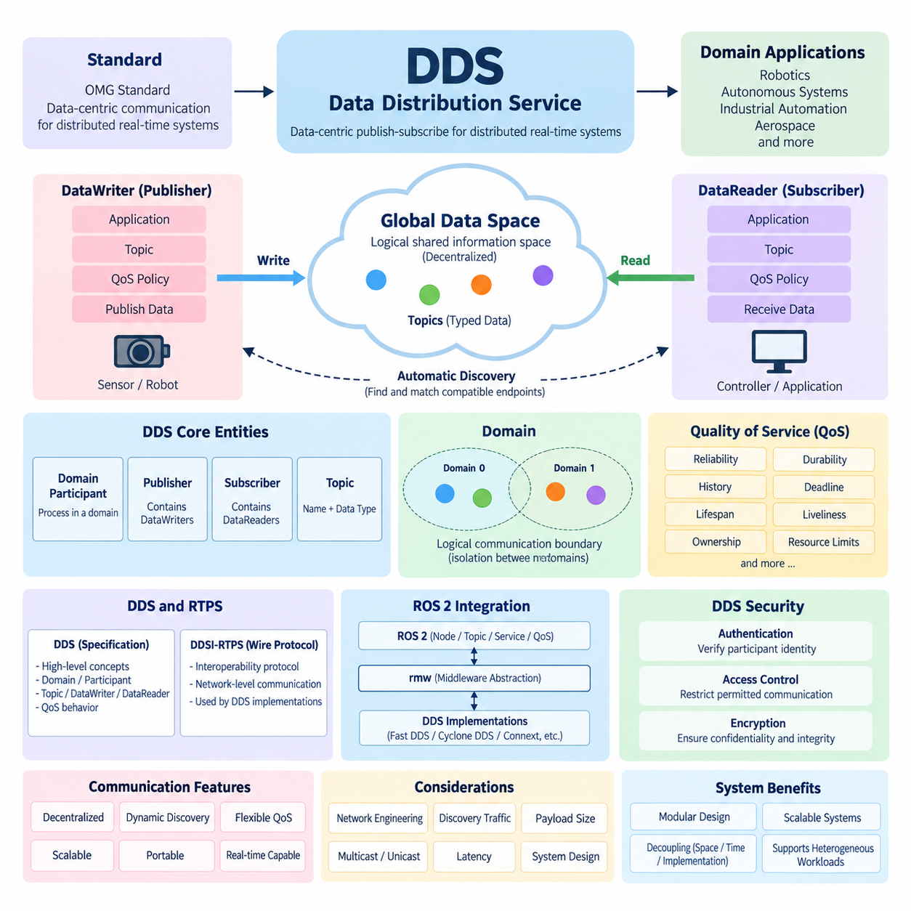
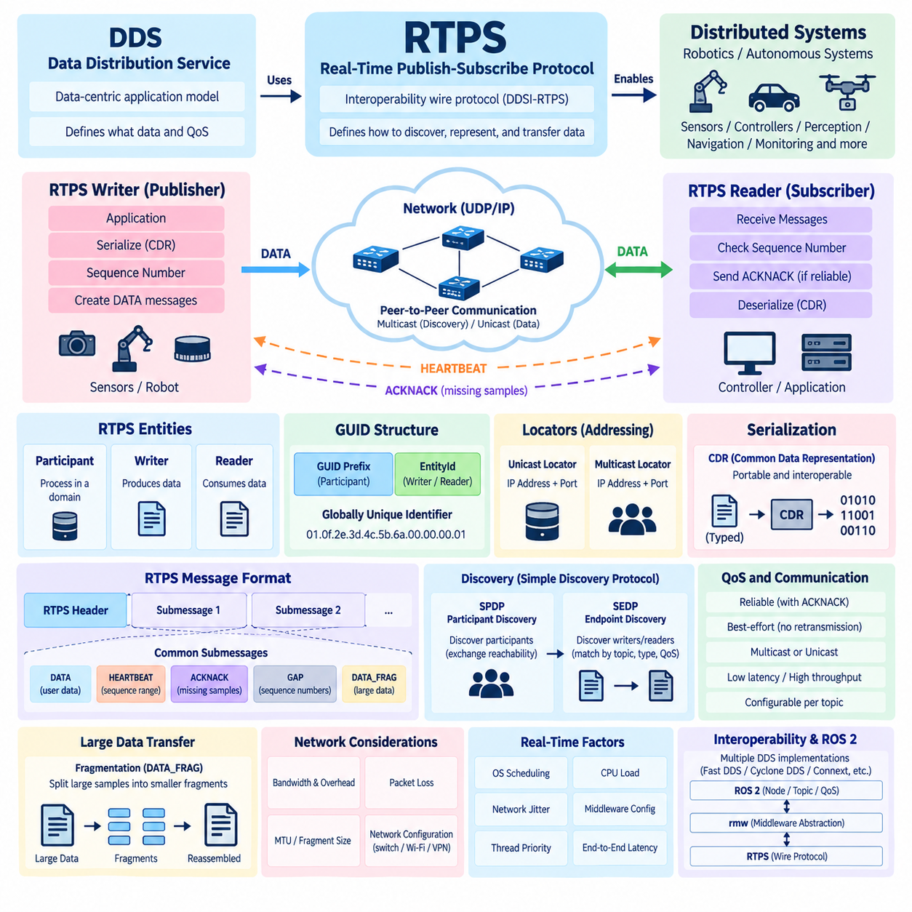
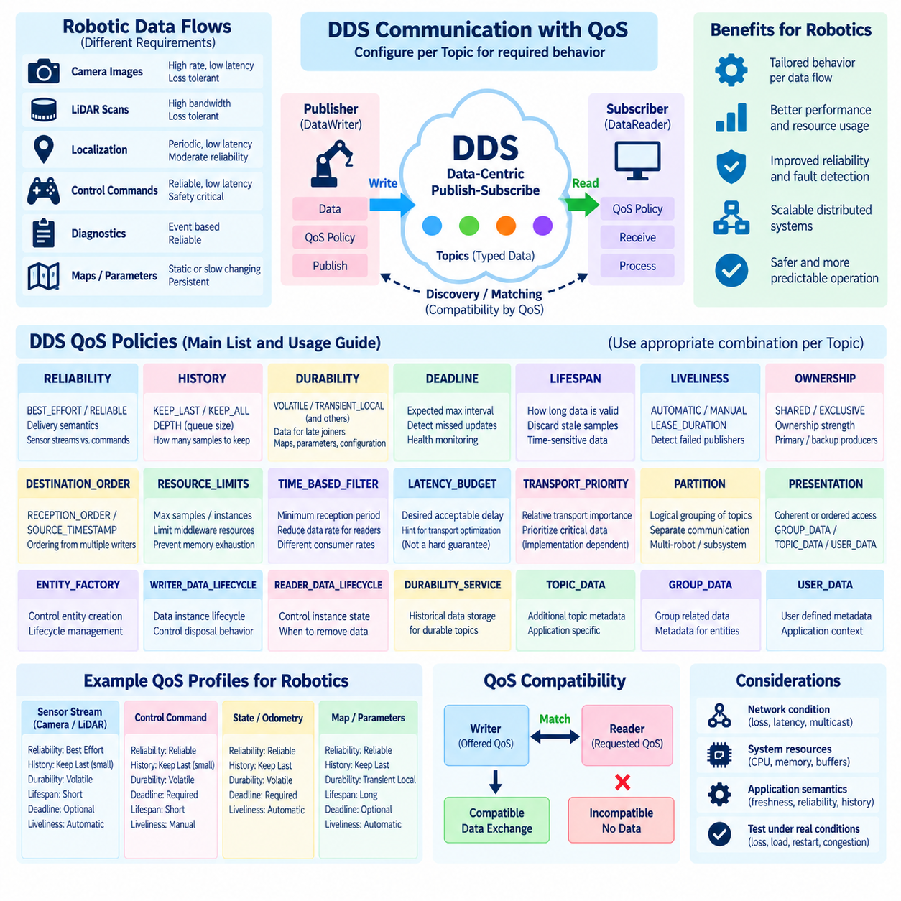
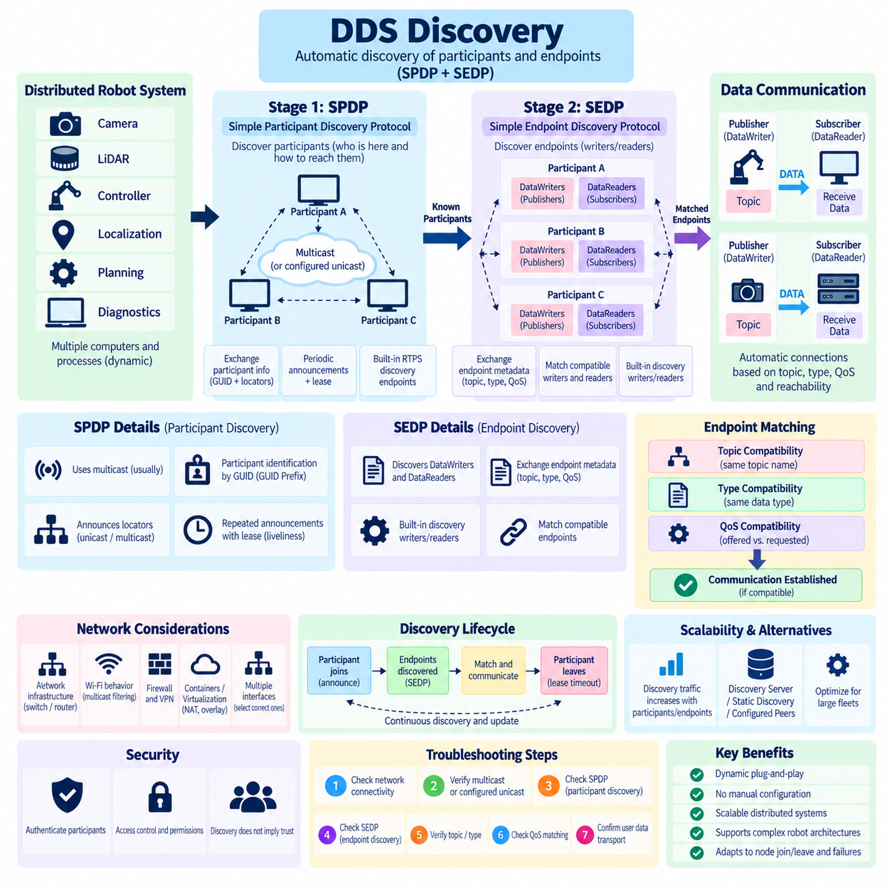
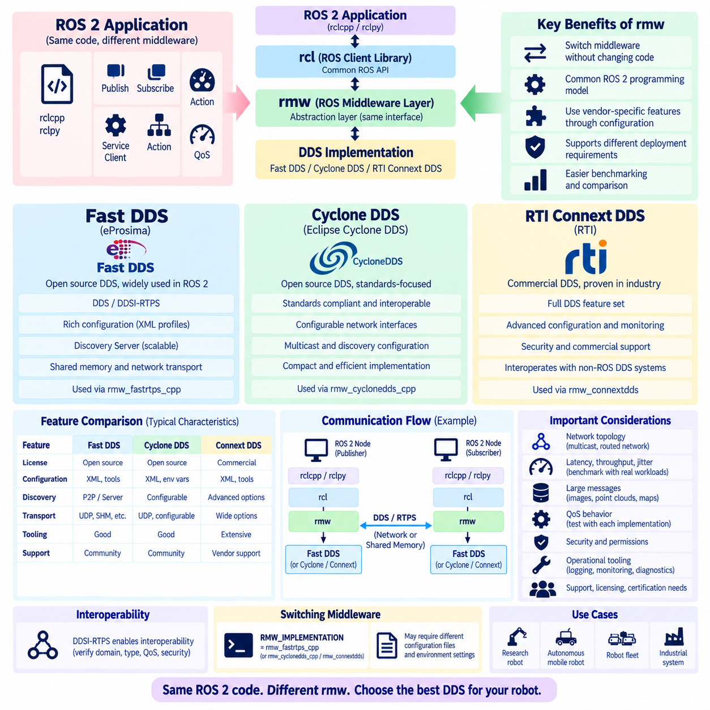
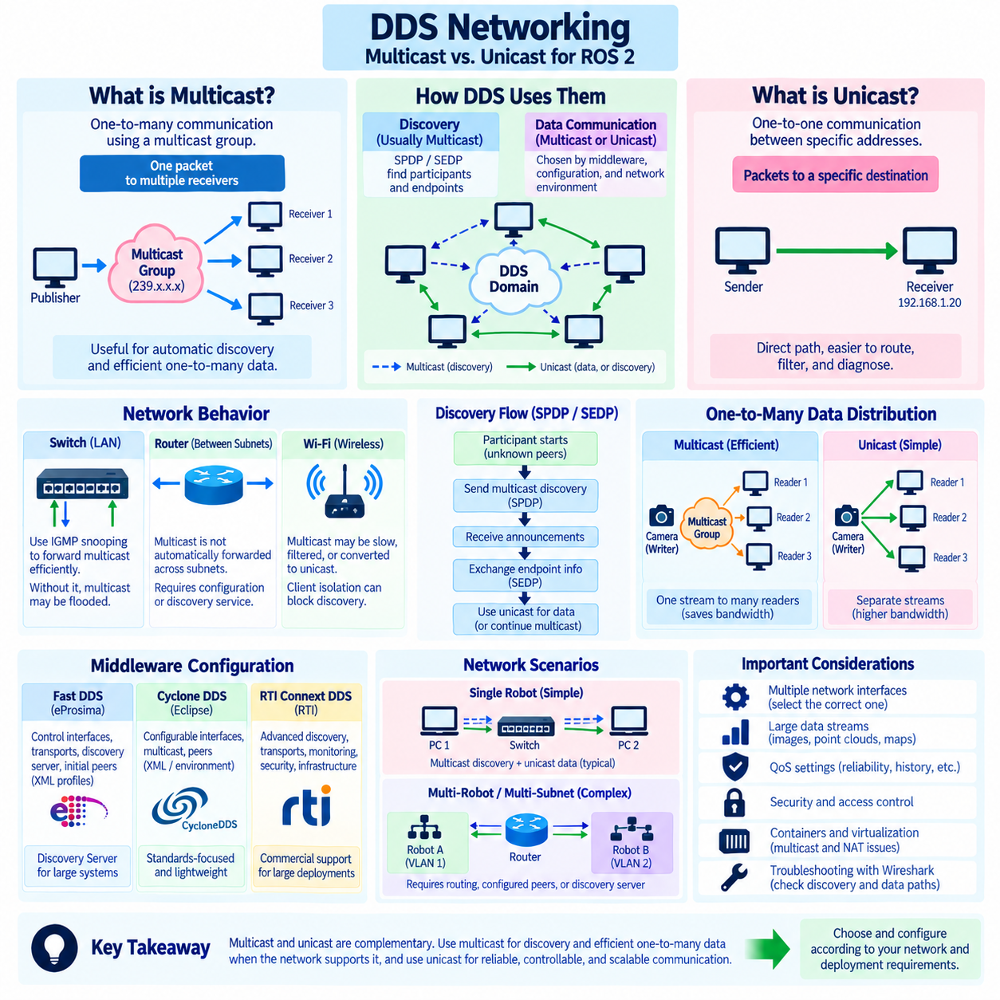
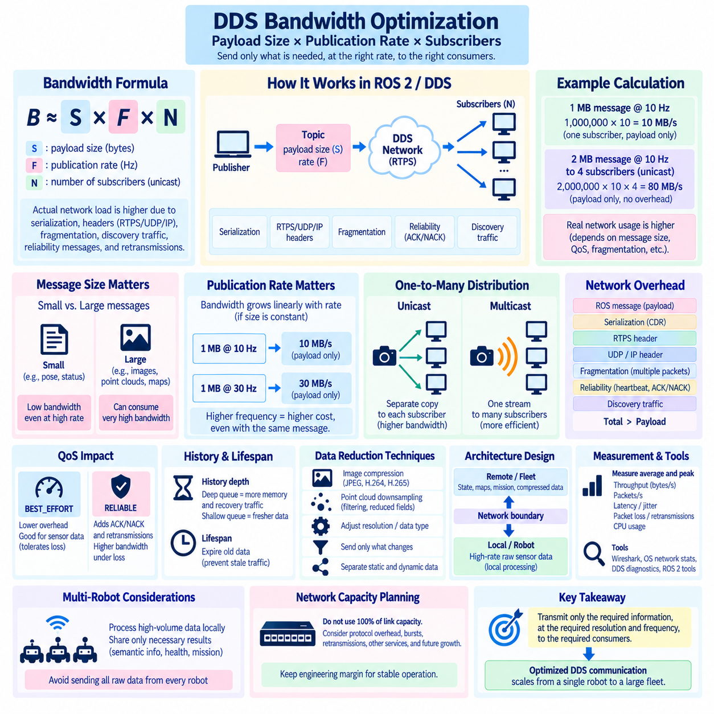
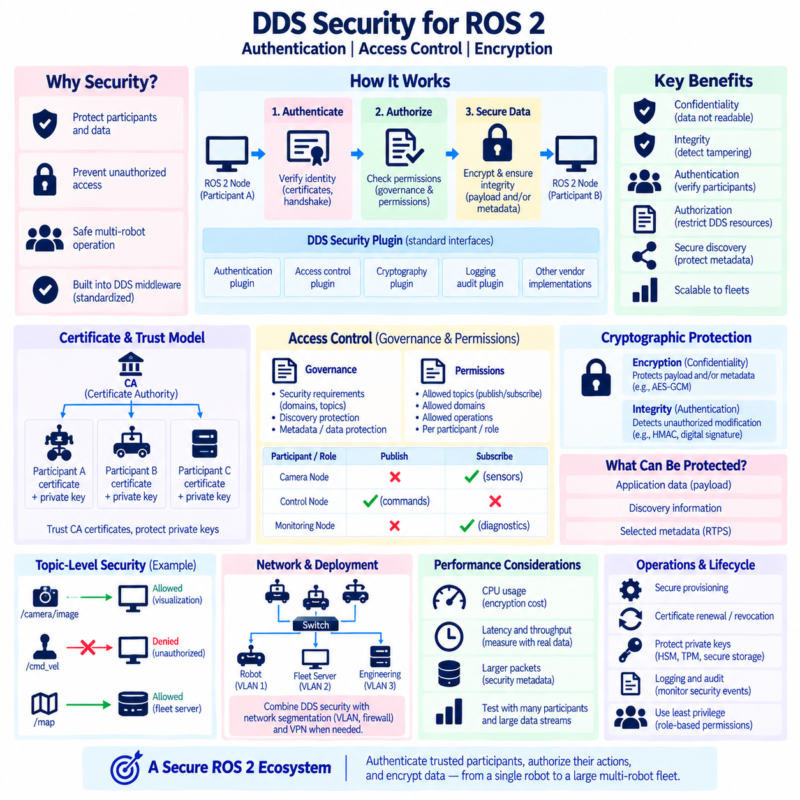
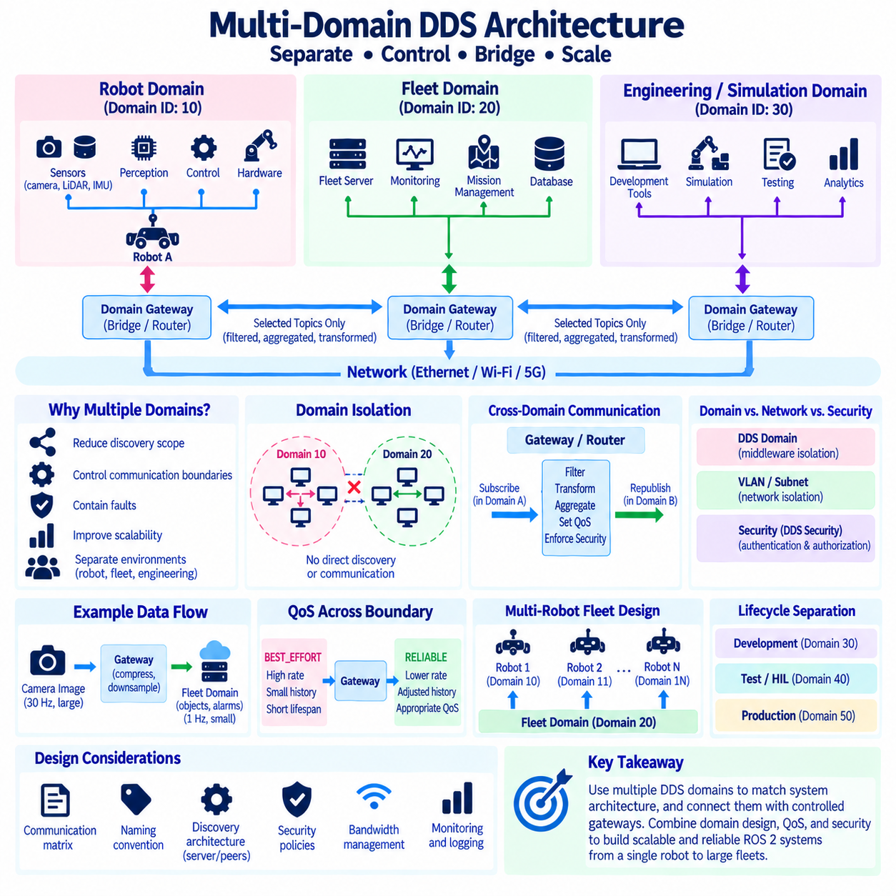
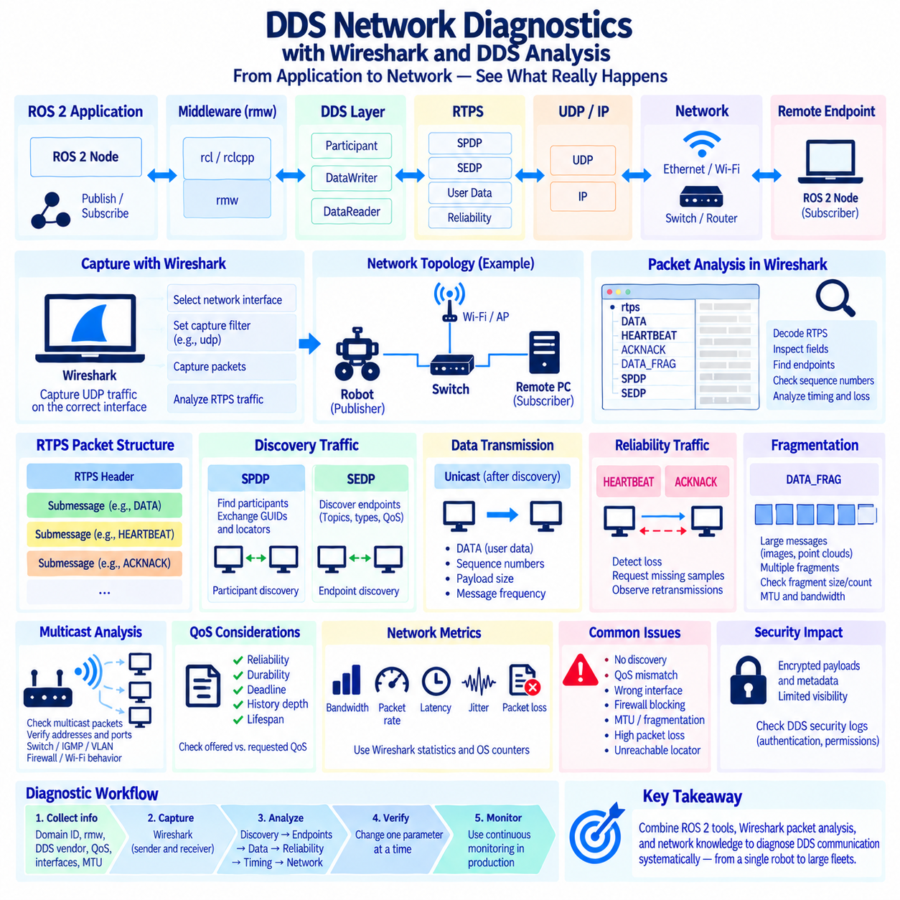

**Volume 05 Robot Middleware and ROS2**

# 02. DDS Middleware

## 02.01 DDS (Data Distribution Service) Standard Overview

{width="7.268055555555556in" height="7.268055555555556in"}

The Data Distribution Service (DDS) is an Object Management Group standard for data-centric communication in distributed real-time systems. Rather than requiring applications to exchange messages through a centralized broker, DDS enables publishers and subscribers to communicate through a logically shared data space. This architecture is particularly suitable for robotics, autonomous systems, industrial automation, aerospace, and other environments in which distributed components must exchange information with predictable behavior.

DDS follows a data-centric publish-subscribe model. A DataWriter publishes typed data samples associated with a Topic, while a DataReader subscribes to the information represented by that Topic. Applications therefore interact primarily with data and its communication requirements rather than explicitly managing individual network connections. Publishers and subscribers can be added, removed, restarted, or relocated without redesigning every communication path, supporting modular and dynamically changing distributed systems.

A fundamental DDS abstraction is the Global Data Space, which represents the logical information environment shared by communicating participants. The global data space is not a physical database or central server. Instead, DDS middleware distributed across participating computers cooperatively maintains communication relationships and delivers relevant samples. This decentralized model reduces dependence on central infrastructure and supports peer-to-peer communication among robot computers, sensors, controllers, edge processors, and monitoring systems.

DDS organizes communication through several core entities. A DomainParticipant represents an application or process participating within a DDS domain. Publishers contain DataWriters, while Subscribers contain DataReaders. Topics connect the logical data model with a defined data type and topic name. A DataWriter and DataReader can communicate when their topic definitions, data types, domains, and communication policies are compatible, allowing the middleware to establish communication relationships automatically.

The DDS Domain provides a logical communication boundary. DomainParticipants belonging to the same domain can discover compatible communication endpoints, while participants assigned to different domains are normally isolated. This mechanism is useful when multiple robots, test environments, simulation systems, or production networks coexist on shared infrastructure. Domain separation can therefore become an important architectural tool for controlling communication scope and reducing unintended interaction between independent distributed systems.

Automatic discovery is another major DDS capability. Participants and endpoints can discover each other dynamically instead of depending on manually configured addresses for every publisher and subscriber. When a compatible DataWriter and DataReader become visible, the middleware evaluates their communication characteristics and establishes an appropriate relationship. This capability allows distributed robotic software to tolerate changes in process location, node startup order, network topology, and system composition more naturally.

Quality of Service, commonly abbreviated QoS, distinguishes DDS from simple publish-subscribe messaging systems. QoS policies describe how information should be delivered and retained rather than merely identifying what data is exchanged. Reliability, durability, history, deadline, lifespan, liveliness, ownership, resource limits, and related policies allow communication behavior to be adapted to application requirements. Different Topics can consequently use different delivery semantics within the same distributed system.

For example, high-rate camera or LiDAR streams may prioritize low latency and tolerate occasional sample loss, whereas configuration commands or important state transitions may require reliable delivery. A localization estimate may need only the newest sample, while diagnostic information can require a defined history depth. DDS allows these requirements to be expressed through QoS instead of forcing every application developer to implement separate transport, buffering, retry, and state-management mechanisms.

DDS separates the application-level data model from many details of network transport. Applications operate with strongly typed data structures, while the middleware handles discovery, serialization, endpoint matching, transmission, and delivery according to configured policies. This separation improves portability because distributed software components can preserve their logical interfaces while underlying middleware implementations and network configurations evolve. It also encourages interface-first design across large robotic software architectures.

The DDS specification should be distinguished from RTPS, the Real-Time Publish-Subscribe protocol. DDS defines higher-level concepts such as domains, participants, Topics, DataWriters, DataReaders, and QoS behavior, whereas DDSI-RTPS defines an interoperability-oriented wire protocol used by DDS implementations. This distinction is important because the application programming model and the network-level protocol solve different architectural problems, even though they are closely connected in practical DDS deployments.

DDS is especially relevant to ROS 2 because ROS 2 adopts a middleware abstraction in which DDS implementations can provide the underlying distributed communication capabilities. ROS 2 concepts such as nodes, topics, publishers, subscriptions, services, and communication QoS are exposed through ROS-oriented APIs, while the lower middleware layers perform discovery and data transport. The ROS Middleware, or rmw, abstraction enables ROS 2 to support multiple middleware implementations rather than binding the framework to one DDS vendor.

This relationship means that understanding DDS helps explain many observable ROS 2 behaviors. Discovery delays, reliability compatibility, history depth, multicast traffic, participant configuration, communication latency, and network segmentation frequently originate below the normal ROS 2 application layer. Developers working only with ROS 2 APIs can build functional applications, but engineers responsible for production robots benefit from understanding how DDS entities and policies influence the resulting distributed system.

In robotic systems, DDS can connect heterogeneous workloads ranging from sensor acquisition and localization to perception, navigation, manipulation, diagnostics, and fleet interfaces. These workloads differ greatly in payload size, update frequency, latency tolerance, reliability requirements, and computational cost. A single communication mechanism with configurable QoS therefore provides an architectural advantage: communication semantics can be tailored per data flow while preserving a consistent publish-subscribe programming model across the robot.

DDS also supports scalability through decentralized communication, although scalability is not automatic. Large systems may contain many participants, endpoints, Topics, high-bandwidth sensors, and network interfaces. Discovery traffic, serialization overhead, multicast configuration, QoS choices, payload size, and publication frequency can significantly affect performance. Consequently, production DDS architecture requires deliberate network engineering rather than assuming that the middleware alone will guarantee deterministic behavior under every operating condition.

Real-time capability in DDS should similarly be interpreted carefully. DDS provides mechanisms designed for predictable and configurable data distribution, but end-to-end timing depends on the complete system, including operating-system scheduling, middleware implementation, network hardware, transport configuration, serialization, application execution, and resource contention. DDS therefore forms an important part of a real-time communication architecture, while deterministic robot control still requires coordinated design across the entire software and hardware stack.

DDS also provides a foundation for secure distributed communication through standardized security mechanisms. Authentication can establish participant identity, access control can restrict permitted communication, and cryptographic protection can preserve confidentiality and integrity. These capabilities become increasingly important when robotic systems extend beyond a single isolated computer toward distributed edge computers, wireless networks, multi-robot fleets, industrial infrastructure, and remotely managed autonomous platforms.

From a software-architecture perspective, the most important contribution of DDS is the decoupling of distributed components in space, time, and implementation. Publishers do not need intimate knowledge of every subscriber, and subscribers can consume information according to their own requirements. Combined with typed Topics, dynamic discovery, configurable QoS, decentralized communication, and interoperable protocols, this model provides a strong middleware foundation for modular and scalable robotic systems.

Within the broader ROS 2 architecture, DDS should therefore be understood not merely as a transport library but as a distributed data-management and communication framework beneath application-level robotics software. Its concepts establish the foundation for later topics including RTPS, discovery, QoS policy design, middleware implementation comparison, multicast and unicast configuration, bandwidth optimization, DDS Security, multi-domain architecture, and network diagnostics, which together form the DDS middleware layer of a production ROS 2 system.

## 02.02 RTPS (Real-Time Publish-Subscribe) Protocol Deep Dive

{width="7.268055555555556in" height="7.268055555555556in"}

The Real-Time Publish-Subscribe Protocol (RTPS) is the interoperability wire protocol commonly used by Data Distribution Service implementations to exchange data across networks. Standardized as DDSI-RTPS by the Object Management Group, it defines how distributed endpoints discover one another, represent communication entities, serialize protocol information, and transfer user data. DDS provides the data-centric application model, while RTPS specifies much of the network-level behavior that enables independent implementations to communicate.

RTPS follows the same decentralized philosophy that characterizes DDS. Communication does not fundamentally depend on a central message broker that receives and redistributes every sample. Instead, RTPS participants communicate directly using network transports such as UDP/IP. This peer-oriented architecture is valuable for robotics because sensors, controllers, perception computers, navigation processes, and monitoring systems can exchange information without introducing a mandatory centralized communication component or single communication bottleneck.

At the RTPS level, communication is modeled using Participants, Writers, and Readers. An RTPS Participant represents a communicating process or middleware instance within a domain. Writers produce data, while Readers consume it. These entities correspond conceptually to higher-level DDS entities, although RTPS operates closer to the transport layer. Each endpoint is identified through protocol-defined identifiers so that distributed participants can distinguish data sources, destinations, and communication relationships across the network.

A fundamental RTPS identifier is the Globally Unique Identifier, or GUID. A GUID combines a GUID Prefix, normally identifying the participant, with an EntityId identifying a specific entity within that participant. Writers, Readers, and built-in discovery endpoints therefore receive distinct identities. This addressing scheme allows RTPS implementations to track communication endpoints without relying solely on IP addresses and ports, which is important because multiple DDS entities may coexist inside the same process or host.

RTPS communication is carried through protocol messages composed of a message header followed by one or more Submessages. The header identifies information such as the RTPS protocol and originating participant, while Submessages describe individual protocol operations. Important Submessage types include DATA for carrying samples, HEARTBEAT for announcing available sequence ranges, ACKNACK for reporting received or missing samples, and GAP for indicating sequence numbers that a Writer no longer expects a Reader to receive.

The DATA Submessage is central to normal information exchange because it transports serialized user data or information associated with a sample. Each change produced by a reliable Writer is associated with a sequence number, enabling Readers to determine whether samples arrived in the expected order and whether any samples are missing. This sequence-based mechanism provides the foundation for reliability behavior without requiring RTPS to use a connection-oriented transport such as TCP for every communication flow.

Reliable RTPS communication relies heavily on the interaction between HEARTBEAT and ACKNACK messages. A Writer periodically sends HEARTBEAT information describing the sequence-number range associated with available data. A Reader compares this information with samples it has received and can return an ACKNACK identifying missing sequence numbers. The Writer can then retransmit required samples. Reliability is therefore implemented at the RTPS protocol level and can operate over UDP while retaining DDS-oriented reliability semantics.

Best-effort communication behaves differently. A best-effort Reader normally accepts available samples without requesting retransmission of missing data. This reduces protocol traffic and can lower latency when losing occasional samples is acceptable. Such behavior is useful for high-frequency robotic streams in which a newer sample quickly supersedes an older one. Reliable delivery, by contrast, is more appropriate when losing commands, configuration information, important events, or required state updates would be unacceptable.

RTPS discovery allows communication relationships to form dynamically. The Simple Discovery Protocol is commonly divided into Simple Participant Discovery Protocol (SPDP) and Simple Endpoint Discovery Protocol (SEDP). SPDP allows DDS participants to discover other participants and exchange basic reachability information. Once participants are known, SEDP communicates information about Writers and Readers so that compatible endpoints can be identified and matched according to their topics, types, and relevant communication policies.

Discovery frequently uses multicast because one announcement can reach multiple potential participants without prior knowledge of their individual addresses. After discovery, user-data traffic may use multicast or unicast depending on middleware implementation, configuration, QoS, network topology, and deployment requirements. This distinction becomes important in robot networks because multicast can simplify dynamic discovery but may behave poorly on incorrectly configured switches, Wi-Fi networks, VPNs, containers, or segmented industrial networks.

RTPS uses locators to describe where communication entities can be reached. A locator represents transport-related addressing information such as an IP address and port. Participants can advertise unicast and multicast locators during discovery, allowing remote endpoints to determine suitable communication paths. Consequently, DDS communication problems that appear at the ROS 2 level may actually originate from locator selection, routing, firewall rules, multiple network interfaces, multicast filtering, or incorrect middleware transport configuration.

Serialization is another essential component of RTPS communication. DDS data structures must be converted into a representation suitable for transmission between potentially different machines and implementations. DDS systems commonly use the Common Data Representation family and related extensible serialization mechanisms. Correct serialization ensures that typed information can cross process and machine boundaries while preserving the data model, byte ordering, field representation, and interoperability requirements expected by communicating DDS implementations.

Fragmentation becomes significant when transmitting large robotic payloads such as images, point clouds, occupancy information, maps, or AI-related tensors. RTPS provides mechanisms such as DATA_FRAG to divide large serialized samples into smaller fragments that can be transported and reconstructed by the receiving side. Large-message performance therefore depends not only on nominal network bandwidth but also on fragment size, packet loss, retransmission behavior, socket buffers, middleware configuration, and the underlying network maximum transmission unit.

RTPS traffic contains protocol metadata in addition to application payloads. Discovery announcements, HEARTBEAT messages, ACKNACK responses, endpoint information, retransmissions, and fragmentation metadata all consume network capacity. For a small robot this overhead may be modest, but systems containing many Topics, participants, cameras, LiDARs, and distributed computers can generate substantial aggregate traffic. Network design must therefore consider protocol overhead together with payload size and publication frequency when estimating DDS bandwidth requirements.

The protocol does not independently guarantee deterministic end-to-end real-time performance. RTPS provides mechanisms suitable for real-time distributed communication, but actual latency and jitter depend on middleware implementation, operating-system scheduling, serialization cost, socket behavior, network interfaces, switches, wireless conditions, CPU load, and application execution. A real-time ROS 2 architecture must therefore coordinate RTPS configuration with PREEMPT_RT, thread priorities, CPU affinity, memory management, network engineering, and application-level timing requirements.

RTPS interoperability is one of its most important architectural purposes. DDS products from different implementations can potentially communicate because DDSI-RTPS defines common network-level representations and behaviors. Nevertheless, practical interoperability still requires compatible data types, topics, QoS policies, discovery settings, transport configurations, security configuration, and supported specification features. Compliance with the same protocol therefore provides an interoperability foundation rather than guaranteeing that every independently configured DDS system will automatically communicate correctly.

Within ROS 2, application developers normally do not manipulate RTPS packets directly. ROS 2 nodes interact through publishers, subscriptions, services, actions, and QoS settings, while the ROS Middleware abstraction, or rmw, connects these APIs to middleware implementations such as Fast DDS, Cyclone DDS, or Connext DDS. Beneath those layers, RTPS may perform endpoint discovery and network data exchange, making packet-level behavior visible when engineers investigate latency, discovery, reliability, or network connectivity problems.

Understanding this layered relationship is essential for diagnostics. A ROS 2 Topic may appear to be a simple publisher-to-subscriber connection, but network capture can reveal SPDP discovery announcements, SEDP endpoint exchanges, DATA packets, HEARTBEAT messages, ACKNACK responses, fragmentation, and retransmissions. Tools such as Wireshark can therefore expose communication behavior that is hidden by ROS 2 APIs, helping engineers determine whether a problem originates in the application, QoS configuration, DDS middleware, RTPS protocol behavior, or physical network.

For production robotics, RTPS should ultimately be viewed as the network-level mechanism that converts the abstract DDS data-centric model into distributed communication. Participants and GUIDs provide identity, SPDP and SEDP establish discovery, DATA and DATA_FRAG transport samples, HEARTBEAT and ACKNACK support reliability, and locators establish network reachability. Together these mechanisms form the protocol foundation beneath DDS-based ROS 2 communication and provide the basis for deeper analysis of discovery, QoS, multicast, bandwidth optimization, security, and network diagnostics.

## 02.03 DDS QoS Policy Full List and Robot Application Guide [w/Code]

{width="7.268055555555556in" height="7.268055555555556in"}

Quality of Service (QoS) is the mechanism that allows DDS to define how individual data flows behave instead of treating every Topic with identical communication semantics. In robotic systems, this capability is essential because camera images, LiDAR scans, localization states, control commands, diagnostics, maps, and configuration parameters have very different timing and reliability requirements. QoS policies allow these requirements to become explicit properties of the communication architecture.

The RELIABILITY policy determines whether data delivery follows BEST_EFFORT or RELIABLE semantics. BEST_EFFORT minimizes recovery overhead and is appropriate when newer samples rapidly replace older information, such as high-rate camera, LiDAR, or telemetry streams. RELIABLE communication detects missing samples and supports retransmission, making it more appropriate for commands, configuration updates, important state transitions, and other information whose loss may affect system behavior.

The HISTORY policy specifies how many samples an endpoint retains. KEEP_LAST maintains only a configured number of recent samples, while KEEP_ALL attempts to retain every relevant sample subject to resource constraints. DEPTH defines the queue depth for KEEP_LAST. Robot sensor pipelines commonly use a shallow history because old perception data quickly loses value, whereas event processing, command queues, or asynchronous consumers may require deeper histories to tolerate temporary processing delays.

DURABILITY determines whether previously published information remains available to DataReaders that join after publication. VOLATILE provides only data generated while endpoints are actively communicating, whereas TRANSIENT_LOCAL allows a Writer to retain samples for later-joining Readers. More persistent durability models also exist in DDS implementations and specifications. Robot configuration, maps, calibration state, or slowly changing system information can benefit from retained data, while continuously refreshed sensor streams usually use volatile behavior.

DEADLINE expresses the expected maximum interval between successive data updates. If data is not produced or received within the configured period, DDS can report a deadline violation. This makes DEADLINE useful as a communication-level health indicator for periodic robot information. Wheel odometry, localization state, IMU updates, actuator feedback, or safety-related status can use deadline monitoring to detect stalled publishers, overloaded processes, communication failures, or unexpectedly slow processing pipelines.

LIFESPAN defines how long a published sample remains valid. Once the configured lifetime expires, outdated data can be discarded rather than delivered as if it were current. This is particularly valuable for robotics because many observations are time-sensitive. Obstacle detections, velocity commands, perception outputs, and local planning information may become dangerous or meaningless after a short interval, whereas static configuration and semantic map information can remain useful much longer.

LIVELINESS describes how DDS determines whether a publishing entity is still operational. AUTOMATIC liveliness allows the middleware to maintain liveliness automatically, while MANUAL modes require explicit assertions at different scopes. Combined with LEASE_DURATION, liveliness provides a mechanism for detecting endpoints that have stopped operating even when ordinary application data is absent. Robot supervisors can use this information to detect failed controllers, sensor processes, mission components, or distributed computing nodes.

The OWNERSHIP policy controls which Writer supplies authoritative data when multiple Writers publish compatible instances. SHARED ownership allows multiple Writers to contribute, whereas EXCLUSIVE ownership permits one Writer to become the effective owner according to ownership strength and related rules. This mechanism can support redundant robotic architectures in which primary and backup producers exist, although failover behavior must be designed carefully together with application state, safety logic, and timing requirements.

DESTINATION_ORDER determines how samples from multiple Writers are ordered, typically according to reception order or source timestamps depending on the supported configuration. This policy matters when distributed producers generate related information and ordering influences interpretation. In robotics, timestamp synchronization, sensor clocks, network delay, and application-level sequence information must still be considered because DDS ordering policies alone cannot correct inaccurate clocks or establish complete causal ordering across a distributed system.

RESOURCE_LIMITS constrains middleware resources such as the maximum number of stored samples, instances, or samples per instance. This policy is important because aggressive reliability, deep history, or large payloads can consume substantial memory. A robot carrying multiple cameras and LiDARs can quickly exhaust middleware buffers if resource limits are poorly configured. Production systems should therefore coordinate QoS history settings with expected payload sizes, publication rates, subscriber delays, and available memory.

TIME_BASED_FILTER allows a DataReader to limit how frequently it receives changes, even when a Writer publishes at a higher rate. A high-frequency source can therefore serve consumers with different temporal requirements without requiring every subscriber to process every sample. For example, a monitoring interface may need only several updates per second while the underlying localization or telemetry pipeline operates much faster, reducing unnecessary processing and communication load for slower consumers.

LATENCY_BUDGET communicates the desired acceptable delay associated with data delivery and can provide middleware implementations with information for transport optimization. TRANSPORT_PRIORITY can express relative transport importance where supported. These policies should not be interpreted as hard guarantees of network latency or deterministic scheduling. Robot architects must combine them with operating-system priorities, network configuration, middleware behavior, CPU allocation, and application timing analysis when strict latency requirements exist.

The PARTITION policy provides logical grouping of communication within Publisher and Subscriber contexts. It can separate communication flows without necessarily creating different DDS domains. In multi-robot or subsystem architectures, partitions can help organize traffic by robot, function, test environment, or operational group. However, ROS 2 namespace design, DDS domain separation, network segmentation, security policies, and middleware-specific behavior must also be considered before using partitions as the primary isolation mechanism.

PRESENTATION controls how coherent or ordered groups of changes are presented to subscribing applications. GROUP_DATA, TOPIC_DATA, and USER_DATA provide additional metadata associated with DDS entities and can support middleware-level identification or application-specific context. These policies are less visible in typical ROS 2 programming than RELIABILITY, DURABILITY, HISTORY, and DEADLINE, but they remain part of the broader DDS QoS model and can matter in specialized native DDS deployments.

DDS also defines policies related to endpoint and entity behavior, including ENTITY_FACTORY, WRITER_DATA_LIFECYCLE, READER_DATA_LIFECYCLE, and DURABILITY_SERVICE. Lifecycle policies influence how data instances are retained or removed when Writers and Readers change state, while durability service settings govern historical-data storage behavior for applicable durability modes. These capabilities become important in state-oriented distributed applications where creation, disposal, ownership changes, and historical information carry semantic meaning.

QoS compatibility between Writers and Readers is fundamental to successful DDS communication. DDS generally evaluates offered QoS from a Writer against requested QoS from a Reader. If policies that participate in compatibility checking cannot satisfy the requested relationship, endpoints may discover each other but fail to match for data exchange. In ROS 2 this can appear as a Topic that exists while messages are not received, making QoS compatibility one of the first items to inspect during communication troubleshooting.

Sensor-data QoS should generally emphasize freshness and bounded resource consumption rather than unconditional delivery of every historical sample. Camera frames, point clouds, radar detections, and rapidly changing telemetry often favor BEST_EFFORT, VOLATILE durability, and shallow KEEP_LAST history. The exact configuration depends on the network and application: reliable delivery can be useful for some sensor paths, but retransmitting stale high-bandwidth samples may increase congestion and latency instead of improving robot behavior.

Control and state communication requires a different balance. Critical commands and discrete state transitions often favor RELIABLE delivery, while command history should remain limited so obsolete commands do not accumulate. DEADLINE, LIFESPAN, and LIVELINESS can complement application-level watchdogs by exposing timing failures and stale information. Safety-critical motion control, however, should never depend on QoS alone; command validation, timeout handling, safe-state transitions, and deterministic local control remain necessary.

Static or slowly changing information such as maps, calibration parameters, robot descriptions, or configuration state can benefit from RELIABLE communication combined with retained durability such as TRANSIENT_LOCAL. A newly started component can then receive relevant state without waiting for the publisher to regenerate it. This pattern differs fundamentally from streaming sensor communication and demonstrates why applying one universal ROS 2 QoS profile to every Topic is usually inappropriate for a production robot.

QoS engineering should therefore begin with the semantics of each data flow: whether every sample matters, how quickly information becomes stale, how much loss is acceptable, how late subscribers should behave, and what resource limits exist. These answers can then be mapped to RELIABILITY, HISTORY, DURABILITY, DEADLINE, LIFESPAN, LIVELINESS, and supporting policies. The resulting profiles should be validated under packet loss, CPU overload, delayed subscribers, endpoint restart, and realistic network congestion.

For a production ROS 2 robot, DDS QoS should ultimately be treated as part of system architecture rather than as a collection of middleware tuning parameters. Perception streams, navigation state, commands, diagnostics, configuration, and fleet communication each deserve profiles based on their operational semantics. Carefully designed QoS reduces unnecessary traffic, prevents stale information from propagating, improves fault detection, controls memory consumption, and makes distributed robot communication more predictable as the system scales.

## 02.04 DDS Discovery Mechanism: SPDP / SEDP

{width="7.268055555555556in" height="7.268055555555556in"}

DDS discovery is the mechanism that allows distributed participants, publishers, subscribers, DataWriters, and DataReaders to locate compatible communication peers without manually configuring every network connection. In DDSI-RTPS systems, discovery is commonly organized into two coordinated stages: the Simple Participant Discovery Protocol (SPDP) discovers DDS participants, while the Simple Endpoint Discovery Protocol (SEDP) discovers the communication endpoints contained within those participants.

Discovery is fundamental to the dynamic nature of DDS. A robot computer can start its localization process before a perception computer, restart a sensor driver during operation, or introduce another processing node without rebuilding fixed communication routes. DDS middleware continuously maintains knowledge about available participants and endpoints. When compatible entities appear, communication relationships can be established automatically according to domain membership, Topic information, data types, QoS compatibility, and network reachability.

The first discovery stage is SPDP, which operates at the participant level. Its purpose is to answer a basic distributed-system question: which DDS participants currently exist and how can they be reached? Each participant periodically announces information describing its identity and communication locators. Other participants receiving these announcements create or update records representing the discovered remote participant, establishing the foundation required for subsequent endpoint-level discovery.

SPDP relies on predefined built-in RTPS discovery entities rather than ordinary application Topics. Participant discovery information is exchanged using protocol-defined built-in endpoints and standardized discovery data. This allows two DDS implementations to begin discovery even though they have never communicated previously. The discovery process therefore bootstraps itself using rules defined by DDSI-RTPS, avoiding the requirement for every application to know the addresses and identities of all other participants beforehand.

A participant is primarily identified through its Globally Unique Identifier (GUID), whose GUID Prefix identifies the participant context. SPDP announcements also provide locator information that indicates how the participant can be contacted. Depending on the implementation and configuration, these locators can describe unicast and multicast communication paths. The receiving middleware can therefore associate a globally meaningful participant identity with concrete network addresses used for subsequent RTPS exchanges.

Multicast is commonly used during SPDP because it allows a newly started participant to announce its presence to multiple existing participants without knowing their addresses individually. Existing participants can similarly advertise themselves so the newcomer discovers them. This produces decentralized plug-and-play behavior on suitable local networks. However, multicast availability depends heavily on switches, routers, Wi-Fi access points, VPNs, containers, firewalls, and network segmentation policies.

Participant discovery is not instantaneous or permanent. SPDP announcements are repeated according to discovery timing rules, and discovered participants are associated with lease information. If announcements or other expected indications disappear for sufficiently long, the remote participant can be considered no longer alive and its discovery state can be removed. This enables DDS systems to adapt when computers disconnect, processes terminate, network paths fail, or robot subsystems are intentionally restarted.

After SPDP establishes participant-level awareness, SEDP performs endpoint discovery. SEDP communicates information about DataWriters and DataReaders belonging to discovered participants. The middleware can then determine which endpoints represent publishers and subscribers for compatible data. This two-stage design separates the discovery of network participants from the discovery of application communication relationships, allowing DDS to manage complex systems containing many Topics and endpoints.

SEDP uses built-in discovery Writers and Readers to distribute endpoint metadata. This metadata includes information required to characterize a Writer or Reader, such as endpoint identity, Topic name, data type information, and relevant QoS properties. When another participant receives this information, its middleware evaluates whether a local endpoint and the discovered remote endpoint can form a valid communication relationship. If the requirements are compatible, the endpoints can be matched.

Topic and type compatibility are therefore central to SEDP. A DataWriter publishing localization information should not automatically communicate with a DataReader expecting an unrelated camera data structure merely because both participants are reachable. Discovery metadata allows the middleware to associate endpoints with the correct logical data interface. Type consistency and middleware-specific type representation must also be considered, especially when independently developed applications or different DDS implementations communicate.

QoS compatibility is evaluated as part of endpoint matching. DDS commonly follows an offered-versus-requested model in which a DataWriter offers communication capabilities and a DataReader requests particular behavior. Policies participating in compatibility checks must satisfy the required relationship. Consequently, SPDP and SEDP may successfully discover the participants and endpoints while application data still does not flow because the Writer and Reader QoS configurations are incompatible.

This distinction is critical when troubleshooting ROS 2. Seeing a remote computer on the network does not prove participant discovery succeeded, and seeing a ROS 2 Topic name does not necessarily prove that every publisher and subscription has formed a compatible data path. Problems can occur independently at network reachability, SPDP participant discovery, SEDP endpoint discovery, QoS matching, or user-data transport. Effective diagnostics therefore examine the communication stack progressively instead of treating discovery as a single event.

Discovery also creates network overhead. Every participant must advertise itself, exchange endpoint information, maintain discovery state, and react when entities join or leave. A small robot with a few ROS 2 processes may generate modest discovery traffic, but a fleet or distributed computing architecture containing many participants and hundreds of endpoints can produce significant discovery activity. The number of DDS participants can therefore matter as much as the number of application Topics when evaluating scalability.

ROS 2 process architecture influences this behavior because middleware entities are created beneath ROS 2 nodes through the rmw layer and the selected DDS implementation. The exact mapping between ROS concepts and DDS entities can vary with middleware design and ROS 2 implementation details. Engineers should therefore avoid assuming that every ROS 2 node always corresponds directly to one independent network-level participant. Packet captures and middleware diagnostics provide a more reliable view of actual discovery behavior.

Multiple network interfaces introduce another common discovery challenge. A robot computer may simultaneously contain Ethernet, Wi-Fi, virtual Docker interfaces, VPN adapters, and loopback interfaces. Middleware may advertise or select locators associated with interfaces that remote participants cannot actually reach. The result can be partial discovery, asymmetric communication, or endpoints that appear but fail to exchange user data. Explicit interface selection and transport configuration are often necessary in production systems.

Containerized and virtualized deployments require similar attention. Docker bridge networks, host networking, Kubernetes overlays, virtual machines, NAT, and cloud networking can alter multicast propagation and locator reachability. DDS discovery that works immediately between two native processes on one Ethernet LAN may therefore fail when the same applications are moved into containers. Network architecture must preserve the discovery and data paths required by the selected DDS configuration.

Wireless networks present additional complications because multicast and broadcast-like traffic may be handled differently from ordinary unicast traffic. Access points can reduce multicast rates, filter multicast packets, isolate wireless clients, or transform multicast behavior for efficiency. A ROS 2 system that performs well over wired Ethernet can consequently show slow discovery or unstable communication over Wi-Fi even when nominal bandwidth appears sufficient. Discovery testing must therefore reflect the actual deployment network.

Large distributed systems may use alternatives or extensions to unrestricted multicast-based discovery. DDS implementations can provide mechanisms such as configured peer lists, discovery servers, static discovery, or implementation-specific discovery optimization. These approaches can reduce multicast dependence and discovery traffic, particularly across routed networks or large fleets. They should be regarded as deployment architecture choices rather than replacements for understanding the underlying participant and endpoint discovery model.

DDS Security can also interact with discovery. Discovering the existence of a participant is not equivalent to authorizing unrestricted communication with it. Secure DDS deployments can authenticate participants, enforce permissions, and protect discovery or user-data exchanges according to configured security mechanisms. This becomes important when autonomous robots operate on shared industrial networks where dynamic discovery must not imply that every visible participant is trusted or permitted to access every Topic.

Wireshark and middleware logging are valuable tools for analyzing discovery. Packet inspection can reveal SPDP participant announcements and subsequent SEDP endpoint exchanges, allowing engineers to determine whether discovery packets leave one host and reach another. Combined with interface inspection, multicast testing, firewall verification, ROS 2 command-line tools, and DDS-specific logs, packet analysis can distinguish network transport failures from endpoint matching or QoS problems.

A practical diagnostic sequence therefore follows the discovery hierarchy. Engineers first verify physical and IP connectivity, then confirm that required multicast or configured unicast discovery paths are available. SPDP participant discovery is checked next, followed by SEDP endpoint exchange, Topic and type compatibility, QoS matching, and finally user-data transport. This layered method prevents application-level symptoms from obscuring failures occurring much earlier in the communication establishment process.

For production robotics, SPDP and SEDP should ultimately be understood as the mechanisms that transform a changing network of computers into a dynamically connected DDS data space. SPDP answers who is present and where participants can be reached, while SEDP determines what Writers and Readers they contain and whether those endpoints can communicate. Together with GUIDs, locators, QoS matching, lease management, and RTPS transport, they provide the discovery foundation beneath scalable ROS 2 communication.

## 02.05 rmw Layer Comparison: FastDDS, CycloneDDS, Connext

{width="7.268055555555556in" height="7.268055555555556in"}

The ROS Middleware (rmw) layer is the abstraction boundary that separates ROS 2 application APIs from the underlying communication middleware. ROS 2 nodes interact with publishers, subscriptions, services, clients, and QoS through common ROS interfaces, while rmw translates these operations into middleware-specific mechanisms. This architecture allows ROS 2 software to use different DDS implementations without requiring application code to directly depend on a particular vendor API.

The rmw architecture is typically positioned beneath the ROS Client Library interface and above the selected DDS or middleware implementation. Application code written with rclcpp or rclpy ultimately invokes functionality through the ROS client-library stack, which reaches the rmw interface. Implementations such as rmw_fastrtps_cpp, rmw_cyclonedds_cpp, and rmw_connextdds connect this common interface to Fast DDS, Cyclone DDS, and RTI Connext DDS respectively.

This abstraction is important because DDS implementations share standardized concepts but differ in implementation architecture, configuration mechanisms, discovery behavior, memory management, transport capabilities, diagnostic tooling, and performance characteristics. The rmw layer allows ROS 2 to expose a relatively consistent programming model while preserving the ability to select middleware according to deployment requirements. Middleware selection therefore becomes an architectural choice rather than an application-level rewrite.

Fast DDS, developed by eProsima, is a widely used open-source DDS implementation in the ROS 2 ecosystem. It implements DDS and DDSI-RTPS communication mechanisms and provides extensive configuration options for discovery, transport, QoS, memory behavior, and participant management. Through rmw_fastrtps_cpp, ROS 2 applications can use Fast DDS while continuing to access standard ROS 2 publishers, subscriptions, services, actions, and QoS abstractions.

One important Fast DDS capability is its broad range of deployment configuration mechanisms. XML profiles can define participants, transports, discovery settings, QoS, and other middleware behavior without embedding every parameter directly into application code. Fast DDS also provides mechanisms such as Discovery Server architectures that can reduce unrestricted peer-to-peer discovery traffic. These features can be useful for distributed robots, large ROS 2 networks, and systems operating across network environments where multicast discovery is undesirable.

Fast DDS supports shared-memory and network-oriented transport mechanisms depending on configuration and platform capabilities. In systems where large data such as camera images or point clouds moves between processes on the same computer, avoiding unnecessary network-stack operations and data copies can substantially affect performance. However, actual behavior depends on ROS 2 distribution, middleware version, message path, configuration, and whether advanced data-sharing or loaned-message capabilities are supported throughout the complete software stack.

Cyclone DDS is an open-source DDS implementation originally developed with a strong emphasis on standards compliance, interoperability, predictable behavior, and efficient implementation. ROS 2 accesses it through rmw_cyclonedds_cpp. Cyclone DDS is commonly attractive for robot systems requiring a relatively compact DDS implementation with configurable network-interface selection, discovery behavior, multicast operation, and transport parameters while retaining the standard ROS 2 application programming model.

Cyclone DDS configuration is commonly expressed through XML-based settings and environment-controlled configuration. Engineers can specify network interfaces, multicast behavior, participant discovery parameters, address selection, and other communication characteristics. Explicit interface configuration is particularly valuable on robot computers containing Ethernet, Wi-Fi, Docker bridges, VPN adapters, and multiple physical interfaces because automatic interface selection can otherwise advertise communication paths that remote machines cannot reach.

Cyclone DDS also participates in the same DDS QoS and RTPS concepts described at the ROS 2 abstraction level, including reliability, durability, history, endpoint discovery, and typed data exchange. Its internal algorithms and configuration syntax are not identical to Fast DDS, however. Consequently, changing rmw implementations should not be treated as merely renaming a library. Discovery timing, memory consumption, network traffic, latency distribution, and behavior under packet loss can differ between implementations.

RTI Connext DDS is a commercial DDS implementation with a long history in distributed real-time and mission-oriented systems. ROS 2 integration is provided through rmw_connextdds where supported by the ROS 2 environment and installed Connext components. Connext offers extensive DDS functionality, configuration facilities, monitoring capabilities, security options, and commercial support, making it relevant when robotics deployments require vendor-backed middleware and integration with broader industrial DDS infrastructures.

Connext is particularly significant when ROS 2 systems must coexist with non-ROS DDS applications. Because DDS defines a data-centric communication architecture independently of ROS 2, industrial controllers, simulation systems, aerospace applications, or distributed monitoring software may use native DDS directly. A Connext-based environment can therefore participate in architectures where ROS 2 represents only one portion of a larger DDS system, although type mapping, QoS, naming, and interoperability configuration must be aligned carefully.

The three middleware choices should not be reduced to a universal ranking. Fast DDS provides extensive ROS 2 adoption and configurable discovery and transport capabilities. Cyclone DDS provides a compact standards-oriented implementation with strong network configurability. Connext DDS provides a commercially supported DDS platform with mature tooling and broad industrial capabilities. Which characteristics matter most depends on the robot architecture, network topology, certification needs, support requirements, and operational environment.

Discovery behavior is one of the most important areas to compare experimentally. Fast DDS and Cyclone DDS both support DDS/RTPS participant and endpoint discovery, but configuration options and optimization mechanisms differ. Connext similarly provides DDS discovery capabilities with its own implementation-specific configuration ecosystem. A system containing dozens of computers or hundreds of endpoints should therefore evaluate discovery convergence time, multicast dependence, restart behavior, traffic volume, and behavior across routed or segmented networks.

Latency and throughput comparisons require controlled benchmarking rather than assumptions based solely on middleware names. Small control messages, high-frequency state data, large camera frames, and multi-megabyte point clouds exercise very different communication paths. Measurements should include median and tail latency, jitter, throughput, CPU utilization, memory consumption, packet loss behavior, and recovery after congestion. The same middleware may perform differently when QoS, payload size, subscriber count, transport, or host topology changes.

Intra-process and inter-process communication must also be distinguished. ROS 2 can optimize communication between components in the same process through mechanisms above or alongside the DDS network path, while communication between separate processes can involve middleware serialization, shared memory, or network transport. Therefore, benchmarking Fast DDS, Cyclone DDS, and Connext should explicitly state whether endpoints reside in one process, separate processes on one host, or separate computers connected through a physical network.

Large-message communication is especially relevant for Physical AI and autonomous robots. Cameras, depth images, LiDAR point clouds, maps, occupancy grids, and learned perception outputs can dominate network traffic. Fragmentation, socket buffers, shared-memory capabilities, serialization overhead, reliability retransmissions, and network MTU all influence performance. Middleware comparison should therefore include realistic sensor payloads rather than relying exclusively on small synthetic ping-pong messages that do not represent production workloads.

QoS semantics remain conceptually consistent across rmw implementations, but supported details and runtime behavior can vary. RELIABLE versus BEST_EFFORT, VOLATILE versus TRANSIENT_LOCAL, HISTORY depth, DEADLINE, LIVELINESS, and other policies must be validated against the selected ROS 2 distribution and middleware version. A configuration that operates correctly with one implementation should be tested again after switching middleware, particularly when advanced or less commonly used DDS policies are involved.

Switching the ROS 2 middleware implementation is normally controlled through the RMW_IMPLEMENTATION environment variable when multiple compatible implementations are installed. This makes comparative testing practical because much of the application code can remain unchanged while the underlying middleware changes. Nevertheless, configuration files, environment variables, discovery services, transport settings, security artifacts, and middleware-specific tuning may also need to change, so production migration requires more than changing a single variable.

Interoperability between different DDS implementations is enabled by DDSI-RTPS but should be verified rather than assumed. Compatible RTPS communication provides a foundation, yet ROS 2 systems must still align domain configuration, Topic and type representation, QoS, discovery, security, and supported protocol features. Mixed-vendor deployments deserve explicit integration testing, especially when software versions differ or when middleware-specific optimization features modify the normal communication path.

Operational tooling can be as important as raw performance. A middleware that performs well in a laboratory but provides insufficient observability for a large field deployment can increase maintenance difficulty. Engineers should evaluate logging, discovery diagnostics, network tracing, statistics, configuration management, security administration, and vendor or community support. Wireshark remains valuable for RTPS-level analysis, while implementation-specific tools can expose information that is difficult to infer from packets alone.

For production robot selection, the rmw implementation should therefore be evaluated against the complete deployment architecture. A single-computer research robot, an outdoor autonomous mobile robot with multiple edge computers, a Wi-Fi-connected fleet, and an industrial inspection system can have fundamentally different middleware priorities. Network topology, data volume, fault recovery, security, deterministic behavior, maintainability, licensing, and integration requirements should define the comparison criteria.

The architectural value of rmw is ultimately that ROS 2 application logic can remain largely independent of these middleware decisions. Fast DDS, Cyclone DDS, and Connext DDS provide different implementations beneath a common ROS-facing abstraction, while DDS and RTPS supply the standardized communication concepts underneath. Understanding this separation allows robotics engineers to benchmark and tune the communication layer systematically without unnecessarily coupling perception, navigation, control, and mission software to one middleware product.

## 02.06 DDS Multicast vs Unicast Configuration [w/Code]

{width="7.268055555555556in" height="7.268055555555556in"}

DDS communication can use both multicast and unicast networking, and understanding the distinction is essential when designing ROS 2 systems that span multiple computers, robots, containers, or network segments. Multicast allows one packet to reach multiple interested receivers through a multicast group, whereas unicast establishes traffic between specific network addresses. DDS implementations may use both mechanisms simultaneously, with different choices for discovery and application data.

Multicast is especially useful for automatic discovery because a newly started DDS participant usually does not know the addresses of existing participants. By sending discovery information to a predefined multicast group, the participant can announce its presence to multiple peers at once. Other participants listening to the same group receive the announcement and can respond or exchange additional discovery information, enabling decentralized communication without maintaining a central registry of every endpoint.

In DDSI-RTPS, participant discovery through SPDP commonly relies on multicast in conventional local-area-network configurations. Once participants discover one another, SEDP exchanges information describing DataWriters, DataReaders, Topics, types, QoS policies, and locators. Depending on the middleware and configuration, later discovery exchanges and user-data communication can increasingly use unicast paths. Multicast discovery and unicast data transport therefore commonly coexist within the same DDS deployment.

Unicast communication sends packets toward a specific destination rather than a group. Once a DDS participant knows the locator of another participant or endpoint, unicast can provide a direct communication path between them. This approach is often easier to reason about across controlled network infrastructures because routing, firewall rules, bandwidth accounting, and packet traces correspond to explicit source and destination addresses rather than dynamically joined multicast groups.

For one-to-many data distribution, multicast can theoretically provide significant bandwidth efficiency. A Writer publishing the same large sample to ten Readers could transmit one multicast stream rather than ten separate unicast copies. However, the practical benefit depends on middleware support, QoS, transport configuration, switch behavior, receiver capabilities, and network topology. Many DDS deployments therefore use multicast primarily for discovery while application data is delivered through unicast.

Ethernet switches strongly influence multicast behavior. Without appropriate multicast management, multicast packets may be flooded to many switch ports, creating unnecessary traffic. Internet Group Management Protocol snooping, commonly called IGMP snooping, allows compatible switches to learn which ports contain multicast group members and forward traffic more selectively. In larger robot networks, correct switch configuration can therefore substantially affect discovery efficiency and overall network stability.

Routers create another important boundary because multicast traffic is not automatically forwarded between IP subnets in the same manner as ordinary unicast traffic. A ROS 2 system may communicate successfully when all computers reside on one Layer-2 network but lose automatic discovery after devices are separated into different VLANs or routed subnets. Cross-subnet DDS communication consequently requires deliberate discovery architecture, routing support, configured peers, discovery services, or middleware-specific mechanisms.

Wi-Fi deserves special consideration because multicast traffic can behave substantially differently from unicast traffic. Wireless access points may transmit multicast at conservative data rates, buffer it differently, suppress it, or apply multicast-to-unicast conversion. Client isolation can prevent devices from communicating even when they share the same access point. Consequently, successful wired DDS testing does not guarantee equivalent discovery latency, packet loss, or stability when a robot moves to wireless networking.

Multicast configuration also interacts with computers containing multiple network interfaces. A robot may simultaneously expose Ethernet, Wi-Fi, VPN, Docker, virtual-machine, and loopback interfaces. If DDS automatically selects an inappropriate interface, multicast announcements may leave through the wrong network or advertised locators may be unreachable by peers. Production configurations often explicitly constrain allowed interfaces so that discovery and user traffic use the intended physical robot network.

Unicast-based discovery can reduce dependence on multicast by configuring known peers or infrastructure that introduces participants to one another. This is useful when multicast is blocked, inefficient, or operationally undesirable. The tradeoff is that some knowledge of network topology must be supplied through configuration or a discovery service. The system becomes less dependent on unrestricted multicast but more dependent on correct addressing, service availability, and configuration management.

Fast DDS provides configuration mechanisms for controlling interfaces, transports, discovery behavior, initial peers, and architectures such as Discovery Server. A Discovery Server can reduce the all-to-all discovery pattern by allowing participants to obtain discovery information through designated servers. This can be valuable in large ROS 2 systems where unrestricted multicast discovery would generate excessive traffic or where the underlying infrastructure does not conveniently support multicast across all required communication boundaries.

Cyclone DDS similarly provides network configuration controls that can influence interface selection, multicast use, peer discovery, and addressing. Explicit peer configuration can be useful when multicast cannot traverse the deployment network. Because configuration syntax and exact capabilities vary with middleware versions, engineers should validate settings against the selected ROS 2 and Cyclone DDS releases rather than assuming that Fast DDS configuration concepts or parameters map directly to Cyclone DDS.

RTI Connext DDS also supports configurable discovery and transport architectures suitable for systems ranging from local networks to larger distributed deployments. Its configuration ecosystem provides mechanisms for controlling participant discovery, interfaces, transports, and infrastructure-assisted communication. As with other DDS implementations, the architectural decision should begin with deployment requirements rather than assuming that either multicast or unicast is universally preferable for every robot network.

QoS affects the consequences of the selected transport behavior. BEST_EFFORT sensor traffic can tolerate packet loss without retransmission, while RELIABLE communication may generate acknowledgment, negative acknowledgment, heartbeat, and retransmission traffic. When many Readers receive high-bandwidth reliable data, recovery behavior can become significant. Therefore, multicast-versus-unicast decisions should be evaluated together with RELIABILITY, HISTORY, payload size, publication rate, and subscriber count.

Large robotic data streams make this analysis particularly important. Multiple cameras, depth sensors, LiDARs, occupancy grids, and maps can consume hundreds of megabits per second before protocol overhead and retransmissions are considered. Sending identical streams independently through unicast to many consumers can multiply bandwidth usage, while poorly controlled multicast can burden unrelated devices. Network design should therefore map each major Topic to its expected producers, consumers, rate, payload, QoS, and transport path.

Security policies may also constrain multicast and unicast architecture. Shared industrial networks should not assume that every host capable of receiving discovery traffic is trusted. DDS Security can provide participant authentication, access control, and cryptographic protection, while network segmentation and firewall rules can restrict communication paths at lower layers. Discovery convenience should therefore be balanced with explicit trust boundaries when robots operate alongside production equipment or external systems.

Containers complicate both approaches. Docker bridge networks and orchestration overlays may not propagate multicast in the same way as the host LAN, while NAT can make advertised unicast locators unreachable. Host networking can simplify some DDS deployments but changes isolation assumptions. Engineers should inspect the actual interfaces and addresses visible inside containers rather than assuming that a ROS 2 process running in a container experiences the same network topology as a native host process.

Diagnostics should distinguish multicast discovery problems from unicast user-data problems. Engineers can first verify IP connectivity and interface configuration, then test whether multicast packets reach expected hosts. Wireshark can reveal SPDP announcements, destination multicast addresses, SEDP exchanges, advertised locators, and subsequent RTPS data packets. If discovery succeeds but user data fails, attention can shift toward endpoint matching, QoS, routing, firewall rules, or advertised unicast paths.

Network design for a single robot is usually simpler than design for a fleet. Several computers connected through one managed Ethernet switch may operate effectively with conventional multicast discovery and unicast application traffic. As the architecture expands to dozens of robots, wireless links, VLANs, edge servers, and fleet-management systems, unrestricted discovery becomes increasingly difficult to control. Hierarchical segmentation and infrastructure-assisted discovery can then provide more predictable scaling.

A practical production architecture can separate communication scopes instead of allowing every DDS participant to discover every other participant. Local sensors and controllers may communicate inside a robot-local network, while selected navigation, mission, diagnostics, and fleet interfaces cross defined network boundaries. DDS domains, configured discovery mechanisms, VLANs, routing policies, and security controls can cooperate to enforce this architecture while reducing unnecessary discovery and data traffic.

Multicast and unicast should therefore be viewed as complementary networking mechanisms rather than competing universal solutions. Multicast is highly effective for decentralized discovery and can support efficient one-to-many distribution when the network is engineered for it. Unicast provides explicit peer-to-peer paths that are often easier to route, filter, diagnose, and control. DDS middleware combines these mechanisms according to discovery strategy, transport configuration, QoS, and deployment topology.

For production ROS 2 robotics, the correct configuration is determined by the physical network and communication graph. Engineers should validate wired and wireless behavior, multicast support, interface selection, routing boundaries, firewall policies, subscriber counts, data rates, and failure recovery under realistic loads. Deliberately combining multicast discovery, controlled unicast communication, and scalable discovery infrastructure can provide predictable DDS networking from a single autonomous robot to a distributed multi-robot fleet.

## 02.07 DDS Bandwidth Optimization: Payload Size / Pub Rate [w/Code]

{width="7.268055555555556in" height="7.268055555555556in"}

DDS bandwidth optimization begins with a simple relationship between payload size, publication rate, and the number of receiving endpoints. A Topic carrying a payload of S bytes at a publication frequency of F hertz generates an application-level data rate of approximately S × F bytes per second for one stream. The actual network load is higher because serialization, RTPS headers, UDP/IP headers, fragmentation, discovery traffic, reliability control messages, and retransmissions add communication overhead.

Payload size is often the dominant factor for perception-oriented robot communication. Small messages such as poses, joint states, temperatures, or mode indicators may consume little bandwidth even at relatively high publication rates. In contrast, RGB images, depth images, point clouds, occupancy grids, and learned feature tensors can contain hundreds of kilobytes or several megabytes per sample, causing a single Topic to consume substantial network capacity even at moderate frequencies.

Publication rate is equally important because bandwidth grows approximately linearly with message frequency when payload size remains constant. A 1 MB message published at 10 Hz represents roughly 10 MB/s of application payload, while the same message at 30 Hz represents about 30 MB/s before protocol overhead. Increasing a sensor or processing pipeline from 10 Hz to 30 Hz therefore has a direct communication cost even when the message representation itself does not change.

A useful first-stage bandwidth model can be expressed as Bpayload = S × F × N for independent unicast delivery to N subscribers. This approximation intentionally ignores lower-level overhead but immediately exposes architectural scaling problems. If a 2 MB point cloud is published at 10 Hz to four remote consumers through separate unicast streams, the theoretical payload traffic can approach 80 MB/s from the publishing side before RTPS and network overhead are considered.

Actual wire bandwidth should therefore be measured rather than inferred only from ROS message definitions. DDS serializes application data into a representation suitable for transport, and RTPS adds protocol structures around that serialized information. UDP, IP, and Ethernet add further headers. Large messages can also be fragmented into multiple RTPS or network packets. Consequently, packet count and protocol overhead increase as payloads become larger and more fragmented.

Fragmentation becomes especially significant for camera images, point clouds, maps, and other large robotic messages. Ethernet commonly operates with an MTU near 1500 bytes unless jumbo-frame configurations are deliberately deployed. DDS/RTPS implementations may fragment large serialized samples into many transport units. Losing one fragment can affect recovery of a larger sample, particularly under RELIABLE QoS, so large-message performance depends not only on total bandwidth but also on packet loss and retransmission behavior.

Publication rates should be derived from the information needs of downstream algorithms rather than simply matching the maximum sensor rate. A camera capable of 60 frames per second does not automatically require every consumer to receive 60 FPS. Mapping may require one rate, object detection another, visualization a lower rate, and logging a different policy. Separating acquisition frequency from distribution frequency can significantly reduce unnecessary DDS traffic without reducing sensor capability.

The same principle applies to high-rate state information. An IMU may generate measurements at hundreds of hertz because a local estimator requires them, while a fleet monitor may need only a few updates per second. Sending the complete high-frequency stream across every network boundary wastes bandwidth and processing resources. Local processing nodes can consume the full-rate signal and publish lower-rate derived state, diagnostics, or summaries to remote systems.

ROS 2 and DDS architectures should therefore distinguish local real-time data from distributed operational data. High-rate raw sensor information can remain inside the robot or even inside one compute host, while localization, object tracks, health state, mission status, and selected perception products cross external network links. This hierarchical data-flow design is often more effective than attempting to optimize every Topic after an unrestricted communication graph has already been created.

QoS selection directly influences bandwidth consumption. BEST_EFFORT communication avoids reliability recovery traffic and is often appropriate for rapidly refreshed sensor streams where losing an occasional sample is preferable to retransmitting obsolete data. RELIABLE communication introduces heartbeat, acknowledgment, negative acknowledgment, and retransmission mechanisms. These costs may be modest on a clean network but can increase considerably when packet loss, congestion, or many subscribers are present.

History depth can indirectly affect network and memory behavior. A deep KEEP_LAST queue allows more samples to remain available while subscribers fall behind, but old high-bandwidth sensor data may have little operational value. Large histories combined with RELIABLE communication can increase memory pressure and recovery activity. For real-time perception streams, shallow queues often preserve freshness more effectively, whereas commands, events, or state transitions may justify different history and reliability settings.

LIFESPAN provides another mechanism for preventing stale information from consuming resources. If an obstacle detection, velocity command, or local perception result is useful only for a limited period, assigning an appropriate lifetime prevents expired samples from remaining relevant to communication. Application-level timestamps and freshness checks should still be maintained, but DDS lifespan semantics can complement them by explicitly representing the temporal validity of distributed data.

Subscriber count must be considered when estimating network scaling. With unicast transport, adding Readers can multiply outgoing traffic because similar samples may be transmitted independently to multiple destinations. A Topic that is inexpensive with one subscriber may become significant with ten or twenty subscribers. Multicast-capable data distribution can reduce duplication for suitable one-to-many patterns, although practical efficiency depends on DDS implementation, network infrastructure, QoS, and receiver behavior.

Image compression can provide major bandwidth reductions when the additional computation and latency are acceptable. Raw RGB images require width × height × bytes-per-pixel storage for each frame, so resolution and frame rate rapidly increase traffic. JPEG, H.264, H.265, or application-specific compressed representations can reduce transmitted size substantially, but compression introduces processing delay, computational load, quality loss, and additional failure modes that must be considered.

Point-cloud optimization requires similar architectural decisions. Raw XYZ or XYZRGB representations can become extremely large when hundreds of thousands or millions of points are transmitted repeatedly. Voxel downsampling, region-of-interest filtering, range filtering, reduced precision, removal of unused fields, or conversion to higher-level geometric representations can decrease payload size. The correct strategy depends on whether downstream consumers require raw measurements or only information extracted from them.

Message design itself can create unnecessary traffic. Repeatedly publishing large structures when only a small portion changes wastes bandwidth. Static configuration, calibration, map metadata, or robot descriptions should not be transmitted at high rates simply because they are convenient to include in another message. Separating static, slowly changing, and high-frequency dynamic information into appropriate Topics allows each data class to use a publication rate and QoS profile matching its actual semantics.

Serialization efficiency should also be considered for frequently transmitted structures. Field alignment, variable-length arrays, strings, nested messages, and large collections affect serialized representation and processing cost. However, reducing a few bytes from a small control message usually provides little benefit compared with reducing image resolution or point-cloud density. Optimization effort should therefore focus first on the Topics responsible for the largest bandwidth-volume product.

Shared-memory transport can substantially reduce network-stack overhead when large messages are exchanged between processes on the same computer. Depending on the DDS implementation, ROS 2 distribution, and configuration, data-sharing or shared-memory mechanisms may avoid some serialization, copying, or socket operations. Intra-process communication can reduce overhead further when compatible components execute within one process. These optimizations should be benchmarked because the exact data path depends on the software stack.

Network capacity should never be planned at the nominal link rate alone. A 1 Gbit/s Ethernet link does not imply that robotics applications should continuously schedule exactly 1 Gbit/s of DDS traffic. Protocol overhead, traffic bursts, reliability recovery, operating-system scheduling, switch buffering, competing services, and future expansion require engineering margin. Sustained utilization near physical capacity can cause queue buildup, packet loss, latency spikes, and unstable recovery behavior.

Bandwidth measurements should therefore include both average and peak behavior. Average throughput can appear acceptable while synchronized cameras or periodic map updates create short bursts that overflow buffers. Engineers should record bytes per second, packets per second, latency, jitter, dropped packets, retransmissions, CPU utilization, and queue behavior. Wireshark, operating-system network statistics, DDS diagnostics, and ROS 2 Topic measurements can provide complementary views of the communication path.

Optimization should proceed from the largest contributors downward. Engineers can inventory each Topic, estimate serialized payload size, measure publication frequency, identify subscriber count, and record QoS and network boundaries. Multiplying payload size by rate immediately highlights high-volume streams. These Topics can then be examined for reduced resolution, lower frequency, filtering, compression, local processing, shared memory, multicast distribution, or architectural separation.

For multi-robot fleets, bandwidth optimization must extend beyond individual Topics to communication scope. Raw camera and LiDAR streams generally should not be distributed from every robot to every fleet computer unless an application explicitly requires them. Robots can process high-volume data locally and publish compact semantic results, trajectories, health information, and mission state. Selected raw data can be transmitted on demand for debugging, teleoperation, or incident analysis.

A production DDS bandwidth budget should finally include normal operation, degraded-network operation, and failure recovery. The system must remain stable when packet loss triggers retransmissions, a subscriber temporarily stalls, several components restart, or multiple high-volume Topics become active simultaneously. Payload size and publication rate are therefore not merely performance parameters; together with QoS, subscriber topology, transport, and processing placement, they define the communication architecture.

Effective DDS optimization ultimately follows a semantic principle: transmit only the information required, at the resolution and frequency required, to the consumers that require it. Payload reduction, rate control, QoS tuning, local processing, compression, shared memory, and network segmentation are complementary techniques. Applied systematically, they transform ROS 2 communication from an uncontrolled collection of Topics into an engineered data-flow system capable of scaling from one robot computer to a distributed Physical AI fleet.

## 02.08 DDS Security Plugin: Auth, Encryption, Access Control [w/Code]

{width="7.268055555555556in" height="7.268055555555556in"}

DDS Security extends the Data Distribution Service communication model with standardized mechanisms for protecting distributed participants, discovery information, and application data. Rather than treating security as an external network feature, DDS integrates security controls into the middleware architecture. The principal security functions are authentication, access control, and cryptographic protection, allowing distributed robotic systems to verify participants, restrict communication permissions, and protect exchanged information.

The DDS Security architecture is based on a plugin-oriented model. Security functions are separated into standardized plugin interfaces so implementations can provide authentication, access control, cryptographic operations, logging, and related capabilities while maintaining common DDS security semantics. This modular design separates application communication logic from security implementation details and allows middleware vendors to integrate security mechanisms without requiring ROS 2 applications to implement their own protection protocol.

Authentication answers the fundamental question of whether a remote DDS participant has an acceptable identity. Before protected communication is established, participants can exchange authentication information and perform a handshake using configured credentials. Certificate-based mechanisms are commonly used, with identities represented through digital certificates and corresponding private keys. Successful authentication establishes confidence that the communicating participant possesses credentials associated with an approved identity.

A certificate-based deployment normally relies on a trust model involving identity certificates, private keys, and trusted certificate authorities. Each DDS participant can be provisioned with credentials representing its identity, while trusted CA certificates provide the basis for validating remote certificates. Private keys must remain protected because possession of a participant certificate without the associated private key should not be sufficient to impersonate that participant during cryptographic authentication.

Authentication alone does not determine what an authenticated participant is allowed to do. Access control provides authorization by defining which DDS resources and operations a participant may use. Permissions can restrict participation in domains and control whether an authenticated entity may publish or subscribe to particular Topics. This distinction follows a basic security principle: authentication establishes who a participant is, while authorization determines which communication activities that identity is permitted to perform.

DDS Security commonly uses governance and permissions information to express security policy. Governance rules describe security requirements associated with domains, Topics, discovery protection, metadata, and data protection. Permissions rules define what particular authenticated identities are allowed to publish, subscribe, or otherwise access. Together, these policy artifacts transform a dynamically discovered DDS network from an implicitly open communication environment into one governed by explicit trust and authorization rules.

Topic-level access control is particularly valuable in robotics because not every computer should be permitted to access every data stream. A visualization workstation may need sensor and diagnostic Topics but should not necessarily publish actuator commands. A fleet server may require mission state and health information without receiving every raw camera stream. Safety-related command Topics can therefore be protected with stricter permissions than general monitoring or noncritical telemetry.

Cryptographic protection provides confidentiality and integrity for DDS communication. Confidentiality prevents unauthorized observers from reading protected information, while integrity mechanisms allow receivers to detect unauthorized modification. Depending on the configured DDS Security policies, protection can be applied to different portions of communication, including application payloads and selected protocol metadata. The exact protection level should be chosen according to threat model, performance requirements, and interoperability constraints.

Encryption introduces computational and communication costs that must be considered in real-time robotic systems. Cryptographic processing consumes CPU resources and may add latency, while additional security metadata increases packet size. The effect can be small for low-rate command messages but more significant for high-bandwidth camera or LiDAR streams. Security performance should therefore be measured using realistic payload sizes, publication frequencies, subscriber counts, and target computing hardware.

Discovery requires special attention because DDS normally discovers participants and endpoints dynamically. An unsecured discovery mechanism can expose information about available participants, Topics, addresses, and communication relationships even when application payloads are protected separately. DDS Security provides mechanisms for protecting appropriate discovery and metadata exchanges, but the chosen governance configuration determines which information requires protection and how security interacts with the discovery process.

Secure participant discovery also changes the sequence required before ordinary data communication becomes possible. Participants must first discover sufficient information to initiate security processing, authenticate each other, evaluate permissions, establish cryptographic material where required, and then create authorized communication relationships. Consequently, secure startup can involve additional message exchanges and processing compared with an unsecured DDS deployment, which should be considered when measuring discovery convergence and restart behavior.

Access-control policies should follow the principle of least privilege. Each robot component should receive only the permissions required for its operational role. A camera process should not automatically receive permission to publish motion commands simply because both functions run on the same computer. Similarly, diagnostic tools should not gain unrestricted write access to mission or control Topics. Fine-grained permissions reduce the impact of compromised or incorrectly configured components.

Security architecture should also consider DDS domains. Domain separation can reduce accidental communication between systems, but a domain identifier is not itself a strong security boundary. An unauthorized participant capable of reaching the network should not be considered trusted merely because it knows the correct domain configuration. Authentication, access control, network segmentation, firewall policy, and credential management should complement domain organization when meaningful security isolation is required.

Network encryption and DDS-level security solve different problems. Technologies such as VPNs can protect traffic across network links, but they do not necessarily provide Topic-level authorization between individual DDS participants inside the protected network. DDS Security operates with knowledge of DDS identities, domains, Topics, and communication roles. A production architecture may therefore combine network-layer protection with middleware-level authentication and access control rather than treating them as interchangeable mechanisms.

Credential lifecycle management is as important as initial security configuration. Certificates and private keys must be provisioned securely, stored appropriately, renewed before expiration, and revoked or replaced when devices are retired or compromised. A fleet containing many robots can quickly turn manual credential handling into an operational problem. Automated provisioning, secure device identity, controlled certificate rotation, auditability, and recovery procedures should therefore be considered from the beginning.

Private-key protection deserves particular attention on mobile robots because physical access to deployed hardware may be possible. Storing long-lived private keys as unrestricted plaintext files weakens the security architecture even when DDS Security is correctly configured. Depending on the platform and threat model, protected key stores, hardware security modules, trusted platform modules, restricted file permissions, secure boot, and disk protection can strengthen the credential boundary surrounding DDS participants.

ROS 2 exposes DDS security capabilities through its middleware architecture rather than requiring ordinary nodes to perform cryptographic operations directly. Security behavior depends on the selected rmw implementation, DDS implementation, ROS 2 distribution, and security configuration. Fast DDS, Cyclone DDS, and Connext DDS may differ in supported features, configuration procedures, tooling, and operational details, so security deployments must be validated against the exact middleware stack being used.

ROS 2 security configuration is commonly associated with secure enclaves and security artifacts that identify communication contexts and provide credentials and policies. Nodes operating within protected environments must possess the appropriate artifacts and permissions before communication succeeds. This enables a ROS 2 system to organize security according to functional roles rather than assuming that every process launched on a robot has equivalent authority throughout the distributed communication graph.

Interoperability becomes more demanding when security is enabled. Two DDS implementations may exchange ordinary RTPS traffic successfully but still fail to establish secure communication if authentication mechanisms, certificates, governance rules, permissions, cryptographic algorithms, or supported security features are incompatible. Mixed-vendor secure deployments should therefore be tested explicitly rather than assuming that unsecured DDSI-RTPS interoperability automatically guarantees security interoperability.

Security failures can resemble ordinary communication failures. A publisher and subscriber may appear correctly configured at the ROS 2 level but fail to exchange data because authentication is rejected or permissions deny the Topic. Engineers should distinguish network reachability, DDS discovery, identity validation, authorization, endpoint matching, and protected data transport during diagnosis. Middleware security logs are especially valuable because packet traces alone may not reveal the reason an authenticated relationship was rejected.

Logging and audit information are important operational components of secure DDS systems. Authentication failures, denied publication attempts, rejected subscriptions, expired credentials, and policy violations should be observable without exposing sensitive key material. Centralized monitoring can help fleet operators detect repeated unauthorized attempts or configuration errors. Security logging must itself be designed carefully so that diagnostic information does not unintentionally reveal credentials or excessive details about protected system architecture.

Performance testing should include both normal and adverse conditions. Engineers should measure secure discovery time, message latency, throughput, CPU utilization, memory consumption, and restart recovery while encryption and authentication are enabled. Large encrypted sensor streams, many secure participants, simultaneous reconnects, and certificate validation can expose bottlenecks that do not appear in small laboratory tests. Security should therefore be benchmarked as part of the complete communication architecture.

For multi-robot fleets, security policy should reflect communication scope. Robot-local controllers may require tightly restricted command paths, while fleet services may access only mission, localization, diagnostics, or selected perception information. Credentials can identify individual robots or functional roles, and permissions can constrain cross-robot communication. Combined with VLANs, firewalls, DDS domains, and controlled discovery infrastructure, this creates multiple complementary layers of protection.

DDS Security should ultimately be treated as a lifecycle architecture rather than a final encryption switch added before deployment. Authentication establishes trusted participant identities, access control limits their authorized DDS operations, and cryptographic protection preserves confidentiality and integrity. Credential management, least-privilege policy, secure storage, monitoring, interoperability testing, and performance validation complete the design needed for secure ROS 2 communication from a single robot to a distributed Physical AI fleet.

## 02.09 Multi-Domain DDS Architecture Design

{width="7.268055555555556in" height="7.268055555555556in"}

Multi-domain DDS architecture separates a distributed robotic system into multiple logical communication spaces rather than placing every participant, Topic, and data stream inside one DDS domain. A DDS Domain represents an isolated data-sharing environment identified by a Domain ID. Participants operating in different domains normally do not discover or communicate with each other directly, allowing system architects to control communication scope, discovery traffic, fault propagation, and organizational boundaries.

A single DDS domain is often sufficient for a small robot containing only a few computers and ROS 2 processes. As the system grows, however, hundreds of Topics, many participants, multiple sensors, edge computers, fleet servers, simulation systems, and engineering tools can share the same discovery space. This increases discovery complexity and makes it easier for unrelated components to observe each other. Multi-domain design introduces explicit boundaries before the communication graph becomes unnecessarily large.

Domain separation should follow system architecture rather than arbitrary numerical grouping. A robot-local domain can contain perception, localization, navigation, control, and hardware interfaces that must communicate at high frequency. A fleet domain can contain mission status, robot health, task assignments, and selected localization information. Engineering or simulation domains can be separated further so development tools do not automatically participate in production robot communication.

The Domain ID provides the logical identifier used to associate DDS participants with a communication domain. Participants configured with different Domain IDs normally belong to separate discovery spaces. In ROS 2, ROS_DOMAIN_ID is commonly used to select the domain in which ROS 2 communication occurs. This provides a convenient deployment mechanism for separating groups of ROS 2 processes without requiring every Topic name or application interface to be redesigned.

Domain separation reduces discovery scope because participants do not need to discover every endpoint in the complete distributed system. If thirty robots each contain many local DDS endpoints, placing all robots in one unrestricted domain can create a much larger discovery graph than necessary. Assigning communication scopes deliberately can keep high-frequency robot-internal entities local while exposing only selected information to infrastructure that actually requires cross-robot visibility.

Multi-domain architecture is therefore especially relevant to robot fleets. Each robot can maintain a local communication environment for sensors and control while a separate fleet-level communication space carries lower-bandwidth operational information. Raw cameras, LiDAR point clouds, IMU streams, and actuator feedback usually do not need to be visible throughout the fleet. Mission state, position, health, alarms, and task status are more appropriate candidates for cross-domain distribution.

Domains should not be confused with network subnets or VLANs. A DDS domain is a middleware-level communication scope, whereas VLANs and IP subnets divide communication at lower network layers. Multiple DDS domains can operate on the same physical Ethernet network, and one DDS domain can potentially span multiple network segments when discovery and routing architecture permit it. Production systems often combine both DDS-level and network-level segmentation.

A Domain ID is also not a security credential. Separating participants by domain can prevent accidental discovery and reduce unnecessary communication, but an entity capable of accessing the network and selecting the same Domain ID should not automatically be trusted. Authentication, DDS Security permissions, firewalls, VLAN policies, and secure credential management are required when the domain boundary must also represent a meaningful security or trust boundary.

Cross-domain communication must be introduced deliberately because participants in separate domains do not normally exchange application data directly. A bridge, router, gateway, or application-level relay can subscribe to selected data in one domain and republish or route it into another. This creates an architectural control point where engineers can decide which Topics cross the boundary, at what rate, with which QoS, and under which security policy.

A DDS Router or similar routing component can connect otherwise isolated DDS communication spaces while preserving controlled data exchange. Rather than merging every participant into one discovery domain, the router exposes selected information between domains. Depending on the implementation, routing rules can filter Topics, transform communication paths, connect different networks, or bridge remote sites. This enables communication boundaries to remain explicit while still supporting system-level integration.

ROS 2 applications can also implement gateway nodes when application semantics require more than transparent routing. A gateway may subscribe to high-rate robot-local data, perform filtering or aggregation, and publish a compact representation into another domain. For example, a local perception system can process camera and LiDAR streams internally and export only tracked objects, free-space information, or alarms to the fleet domain, reducing both bandwidth and architectural coupling.

QoS must be considered when data crosses domain boundaries. A local BEST_EFFORT sensor stream should not automatically become a fleet-wide high-rate reliable stream simply because a gateway republishes it. The gateway can intentionally assign QoS appropriate to the destination communication scope. Reliability, durability, history depth, lifespan, deadline, and publication frequency should reflect the semantics and network characteristics of each side of the boundary.

Bandwidth control is one of the strongest reasons for using domain gateways. Robot-local Ethernet may support high-rate perception traffic, while a shared Wi-Fi or 5G connection between robots and fleet infrastructure has much more constrained and variable capacity. A gateway can downsample, compress, filter, aggregate, or event-trigger data before crossing this link. Multi-domain architecture therefore complements DDS bandwidth optimization by making data-flow boundaries explicit.

Fault containment is another architectural benefit. If development tools, experimental algorithms, or simulation participants operate in separate domains, unexpected endpoint creation or discovery storms are less likely to affect production communication directly. Similarly, restarting a large set of participants in one communication scope does not necessarily require every participant in another isolated domain to process the same discovery changes. Domain boundaries can therefore improve operational predictability.

Multi-domain architecture also supports lifecycle separation between development, integration, test, and production environments. Simulation systems can use dedicated domains while hardware-in-the-loop systems use another communication scope. Engineers can run diagnostic or experimental ROS 2 graphs without automatically connecting them to production robots. Domain numbering conventions should be documented centrally so teams do not accidentally assign overlapping IDs to environments that are expected to remain separate.

Large robots may benefit from multiple domains even before fleet integration is considered. A complex autonomous platform can contain safety-related control, high-bandwidth perception, mission computing, payload systems, and external interfaces. These subsystems have different communication requirements and trust relationships. Separating them into architectural communication zones can reduce unnecessary coupling, although excessive domain fragmentation can increase gateway complexity and should therefore be justified by clear system boundaries.

Domain design should be accompanied by a communication matrix. For each domain, architects should identify participants, major Topics, expected payload sizes, publication rates, QoS, network interfaces, and permitted cross-domain flows. The matrix should also identify which gateway owns each boundary and whether information is passed transparently, filtered, aggregated, transformed, or blocked. This converts domain assignment from an informal configuration choice into a controlled system architecture.

Naming conventions remain important even when domains provide isolation. Two domains can contain Topics with identical names without communicating directly, which can be useful for repeated robot-local architectures. For example, each robot may internally use consistent sensor and control Topic names. Gateways can then map selected robot information into fleet-level namespaces or identifiers so the fleet system can distinguish data originating from Robot A, Robot B, and other platforms.

Multi-robot systems must carefully decide whether each robot receives a unique domain or whether groups of robots share domains. A unique domain per robot provides strong communication isolation but increases routing and configuration requirements. Shared robot domains simplify direct peer communication but expand discovery scope. The appropriate model depends on fleet size, robot-to-robot communication requirements, network topology, discovery infrastructure, and the amount of data that genuinely needs shared visibility.

Discovery architecture and domain architecture should therefore be designed together. Dividing a system into domains reduces discovery scope, while Discovery Servers, configured peers, or other middleware-specific mechanisms can further control how participants find one another inside each domain. Domains determine who belongs to the same logical data space, while discovery configuration determines how those participants establish awareness across the physical network.

Monitoring becomes more complex in a multi-domain system because no single participant automatically sees the complete DDS graph. Operational observability should therefore be designed explicitly. Monitoring services can connect through controlled gateways, deploy domain-specific agents, or collect metrics outside the normal application data path. Logs should identify Domain IDs, participant identities, gateway routes, and network interfaces so communication failures can be localized to the correct architectural boundary.

Troubleshooting should follow the same boundaries. Engineers first verify that communicating endpoints are intentionally located in the same domain or connected through an approved gateway. They then inspect discovery, Topic and type compatibility, QoS, routing rules, network reachability, and security policy. A missing Topic in a multi-domain architecture may be correct behavior rather than a fault if that Topic was intentionally prevented from crossing the domain boundary.

Security policies should align with domain architecture without relying on domains alone. Robot-control domains can use restrictive DDS permissions, while fleet domains can authorize only designated services to issue mission commands. Engineering domains may receive read-only telemetry through gateways while being denied control paths. Combining domain isolation, least-privilege DDS Security, network segmentation, and explicit routing creates defense in depth across the distributed robotic system.

For Physical AI architectures, domain boundaries can also reflect computing hierarchy. Edge computers may exchange high-rate sensor and control data within robot-local domains, on-premise systems may receive selected semantic and operational information, and cloud systems may receive further aggregated data for analytics, model management, or long-term learning. Gateways between these levels become policy enforcement points for bandwidth, security, data ownership, and operational authority.

A scalable design should avoid both extremes: one unrestricted domain for the entire organization and excessive fragmentation into many domains with complicated routing dependencies. The objective is to create a small number of meaningful communication zones aligned with physical systems, operational responsibilities, network constraints, and trust boundaries. Each additional domain should provide a clear benefit in scalability, isolation, bandwidth control, lifecycle management, or security architecture.

Multi-domain DDS architecture ultimately transforms domain configuration from a simple numeric setting into a system-level design mechanism. Domains define communication scope, gateways define controlled information exchange, QoS defines delivery behavior, and security defines authorized participation. When these elements are designed together, ROS 2 and DDS can scale from a single autonomous robot to distributed fleets, edge infrastructure, simulation environments, and larger Physical AI systems without exposing every participant to every data stream.

## 02.10 DDS Network Diagnostics: Wireshark DDS Analysis [w/Code]

{width="7.268055555555556in" height="7.268055555555556in"}

DDS network diagnostics should begin by separating application symptoms from middleware and network behavior. A ROS 2 node may report missing data, delayed messages, unstable discovery, or intermittent communication, but these symptoms do not immediately identify the failing layer. Effective diagnosis follows the communication path from ROS 2 application behavior through rmw, DDS, RTPS, UDP/IP, Ethernet or wireless transport, and finally the receiving endpoint.

Wireshark is particularly useful because DDS implementations commonly exchange data using the DDSI-RTPS wire protocol over UDP. Packet capture allows engineers to observe discovery messages, user-data traffic, reliability control messages, fragmentation, retransmissions, multicast behavior, and network addressing independently of the ROS 2 application. It therefore provides a direct view of what is actually transmitted across the network rather than what software components assume was transmitted.

Before capturing packets, engineers should identify the relevant network interface and communication topology. A robot computer may contain Ethernet, Wi-Fi, VPN, container bridges, virtual interfaces, and multiple physical NICs. Capturing the wrong interface can misleadingly suggest that DDS traffic does not exist. Interface addresses, routing tables, DDS transport configuration, Domain ID, and expected remote endpoints should therefore be recorded before detailed packet analysis begins.

RTPS packets provide important structural information for DDS analysis. An RTPS message contains a protocol header followed by one or more submessages. Wireshark can decode many standard RTPS structures and expose fields such as protocol version, vendor information, GUID Prefix, EntityId, sequence numbers, locators, and submessage types. These fields help identify which DDS participant generated traffic and what role a particular packet performs.

Discovery analysis normally begins with SPDP traffic. The Simple Participant Discovery Protocol allows DDS participants to announce their existence and exchange participant-level information such as GUIDs and network locators. If two ROS 2 systems cannot discover one another, engineers should first determine whether SPDP announcements are actually transmitted, whether they reach the remote network, and whether return discovery traffic is visible in the opposite direction.

SEDP analysis follows participant discovery and focuses on endpoint information. The Simple Endpoint Discovery Protocol communicates information about DataWriters and DataReaders, including Topics, types, QoS characteristics, and endpoint identifiers. Successful SPDP without successful application communication can therefore indicate that participant discovery works while endpoint discovery or matching does not. Inspecting SEDP traffic helps narrow the failure to the correct stage.

Multicast behavior is an important diagnostic target because DDS discovery frequently relies on multicast in default configurations. Wireshark can reveal whether multicast packets leave the sender, which multicast addresses and UDP ports are used, and whether remote hosts receive them. Missing multicast traffic may indicate switch configuration, IGMP snooping, VLAN boundaries, Wi-Fi behavior, firewall rules, DDS configuration, or incorrect network-interface selection rather than a ROS 2 node failure.

Unicast traffic should then be examined after discovery establishes participant locators. DDS implementations commonly use unicast for endpoint communication and reliability exchanges. Engineers should verify source and destination IP addresses, UDP ports, packet direction, and interface selection. A participant advertising an unreachable locator because of multiple NICs, containers, VPN interfaces, or incorrect routing can appear discoverable while application data still fails to reach the intended receiver.

RTPS DATA submessages represent an important part of application-data analysis. Engineers can examine Writer and Reader identifiers, sequence numbers, payload size, timestamps where available, and packet frequency. Comparing observed packet frequency with the expected ROS 2 publication rate can reveal whether data is being generated consistently. Missing sequence numbers or irregular packet intervals can indicate loss, scheduling delays, congestion, or middleware-level behavior requiring further investigation.

Reliable DDS communication introduces additional diagnostic signals. HEARTBEAT messages inform Readers about Writer sequence-number state, while ACKNACK messages allow Readers to acknowledge reception or request missing samples. Repeated ACKNACK activity, frequent negative acknowledgments, or retransmitted DATA packets can indicate packet loss or receiver pressure. Reliability traffic is therefore valuable evidence when diagnosing networks that appear functional but exhibit unstable latency or throughput.

BEST_EFFORT communication behaves differently because lost samples are normally not recovered through reliability retransmission. Packet capture may show sequence-number gaps without subsequent recovery traffic. For rapidly refreshed sensor streams this can be expected behavior rather than a protocol failure. Engineers must therefore know the QoS profile of the Topic being analyzed before interpreting missing packets, retransmissions, or the absence of acknowledgment traffic.

Large ROS 2 messages require special attention because DDS/RTPS may fragment serialized samples. Camera images, point clouds, occupancy maps, and other large payloads can generate DATA_FRAG traffic containing fragments of a single logical sample. Wireshark can help identify fragment size, fragment count, packet loss, and repeated fragment transmission. Problems affecting only large Topics frequently indicate fragmentation, MTU, buffering, bandwidth, or reliability issues rather than discovery failure.

Packet size should be compared with the network maximum transmission unit(MTU) and DDS fragmentation configuration. Ethernet commonly uses an MTU around 1500 bytes, although larger jumbo frames may be configured in controlled networks. IP fragmentation and RTPS-level fragmentation are different mechanisms and should not be confused. Consistent MTU settings across computers, switches, virtual networks, and middleware transports help prevent difficult large-message communication failures.

Bandwidth analysis should consider both bytes per second and packets per second. A network may have sufficient nominal bit rate but still experience excessive packet-processing load when large numbers of small packets are generated. Conversely, high-resolution sensor streams may consume link capacity through very large aggregate payload volume. Wireshark statistics and operating-system counters can help identify dominant conversations, traffic bursts, and periods approaching network capacity.

Timing analysis is necessary when communication exists but latency is unacceptable. Capture timestamps can be used to study packet spacing, bursts, retransmission delays, and communication pauses. However, one-way latency cannot be accurately derived from independent packet captures unless the participating computers have sufficiently synchronized clocks. PTP, NTP, hardware timestamping, or another validated synchronization method is therefore important for rigorous distributed latency measurements.

Jitter should be evaluated separately from average latency. A control or perception pipeline may tolerate a stable 10 ms communication delay better than a path that usually delivers in 3 ms but occasionally requires 100 ms. Packet captures can reveal burst formation, delayed acknowledgments, retransmission episodes, or scheduling gaps associated with these outliers. Percentile latency and maximum observed delay are therefore often more informative than a single average value.

Packet loss can occur at multiple locations and packet capture must be interpreted carefully. A missing packet in a capture does not automatically prove that the physical network dropped it because capture buffers, operating-system scheduling, or overloaded monitoring systems can themselves lose packets. Comparing captures at both sender and receiver is a stronger method: packets visible at the sender but consistently absent at the receiver provide better evidence of loss along the network path.

DDS port behavior can also assist troubleshooting. RTPS commonly derives UDP port usage from standardized port-mapping rules influenced by parameters such as Domain ID and participant-related values, although implementation configuration can modify practical behavior. Firewalls that permit only selected UDP ranges may therefore block discovery or user traffic unexpectedly. Packet capture shows the actual ports in use and should be preferred over assumptions based solely on default formulas.

ROS 2 command-line diagnostics complement Wireshark rather than replacing it. Commands that inspect nodes, Topics, publishers, subscribers, rates, and bandwidth provide an application-level view of the ROS graph. DDS logs and middleware-specific diagnostic tools expose another layer, while Wireshark observes wire behavior. Comparing these perspectives allows engineers to determine whether a failure originates above DDS, inside DDS discovery or QoS matching, or below the middleware in the network.

QoS incompatibility is a common case where network packets may be present even though ROS 2 data does not flow. Participants can discover one another while offered and requested QoS policies prevent compatible endpoint matching. Reliability, durability, deadline, and other policies should therefore be checked alongside packet traces. Wireshark evidence of discovery combined with absent expected data can direct attention toward endpoint compatibility instead of basic network connectivity.

DDS Security changes packet analysis because protected communication may hide application payloads or selected metadata from passive inspection. Wireshark can still provide useful information about addresses, packet timing, sizes, and some protocol exchanges, but encrypted fields cannot be interpreted without appropriate access and tooling. Authentication or access-control failures should therefore be correlated with DDS security logs rather than diagnosed exclusively from packet contents.

Multi-domain DDS systems require diagnostics to respect architectural boundaries. Participants in different Domain IDs are not expected to discover each other directly unless a router, bridge, or gateway intentionally connects their communication spaces. Packet analysis should identify the domain, interface, gateway, and expected route before declaring missing discovery a fault. Traffic should also be captured on both sides of a gateway when diagnosing cross-domain forwarding problems.

A repeatable diagnostic workflow should collect evidence before configuration is changed. Engineers should record ROS_DOMAIN_ID, rmw implementation, DDS vendor, QoS profile, network interfaces, IP addresses, MTU, routing information, firewall state, and packet captures. Changing several parameters simultaneously may temporarily restore communication while destroying evidence about the original failure. Controlled experiments make DDS network problems reproducible and substantially easier to isolate.

Production monitoring should extend beyond occasional Wireshark captures. DDS-based robots benefit from continuous measurements of discovery health, message rate, bandwidth, packet loss, retransmissions, latency, jitter, CPU load, and interface errors. Baseline values recorded during normal operation provide a reference for detecting degradation. Packet capture can then be activated selectively when monitoring indicates abnormal behavior, reducing the need to inspect large volumes of normal traffic.

Effective DDS network diagnosis ultimately requires correlation across layers. ROS 2 graph information explains intended communication, DDS and RTPS reveal discovery and delivery mechanisms, UDP/IP and Ethernet expose transport behavior, and Wireshark provides packet-level evidence connecting these layers. By analyzing discovery first, then endpoint matching, data flow, reliability, fragmentation, timing, and network conditions, engineers can isolate communication failures systematically instead of relying on trial-and-error configuration changes.
