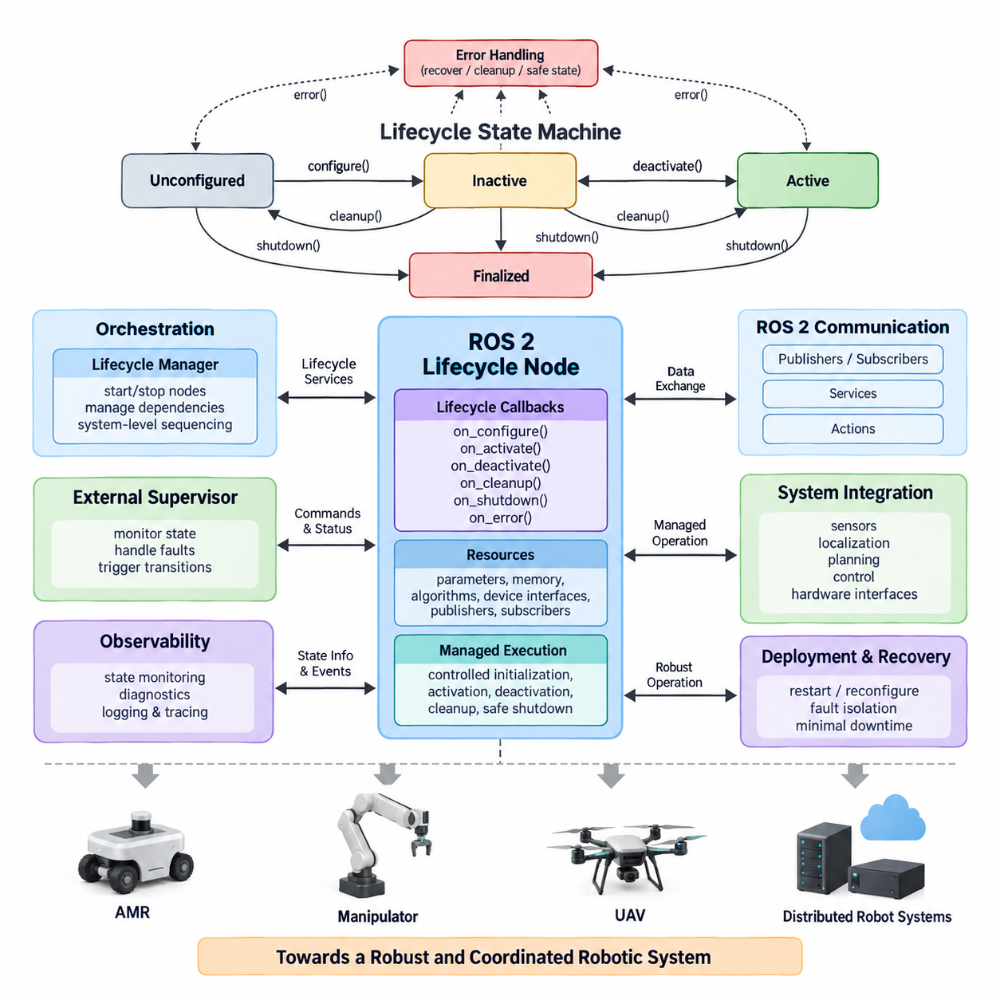
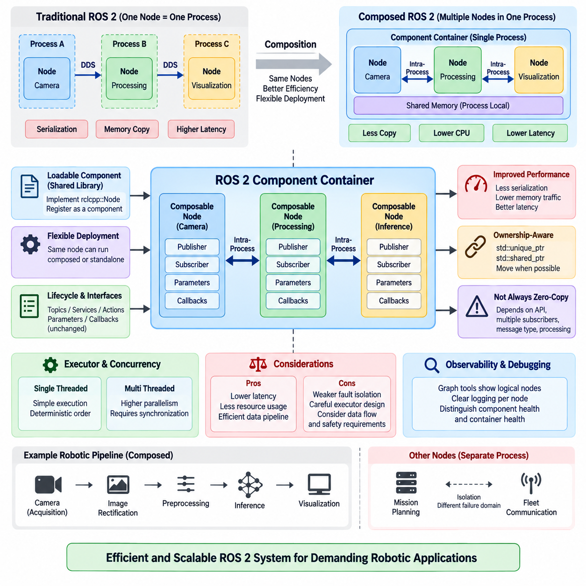
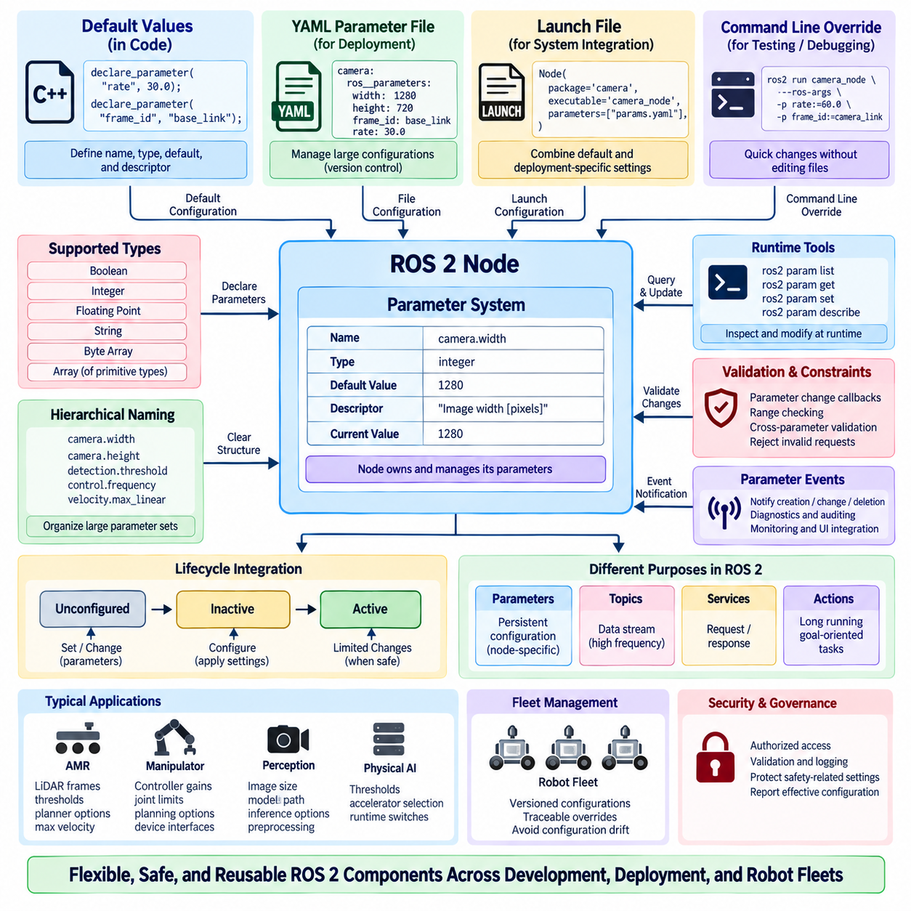
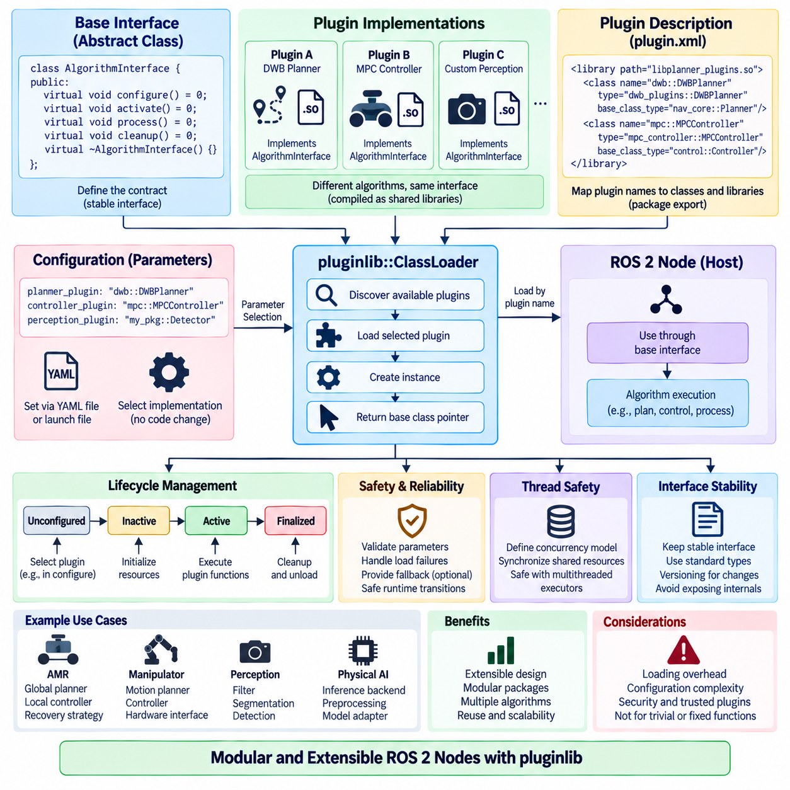
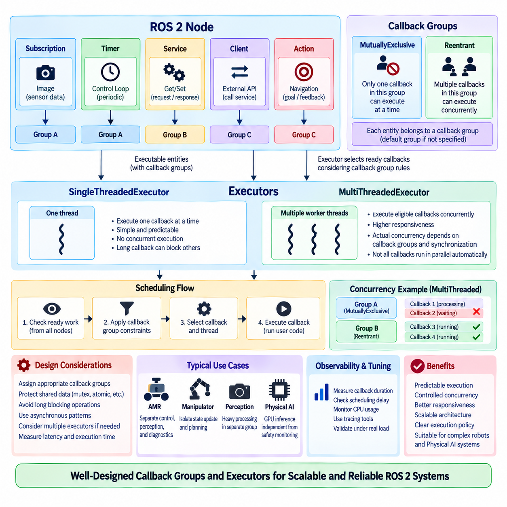
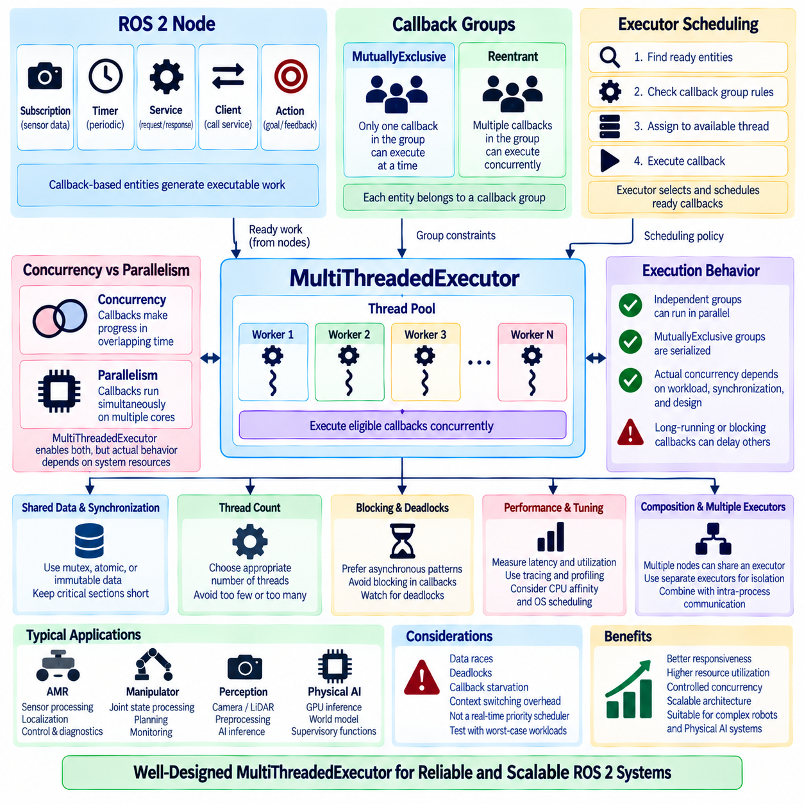
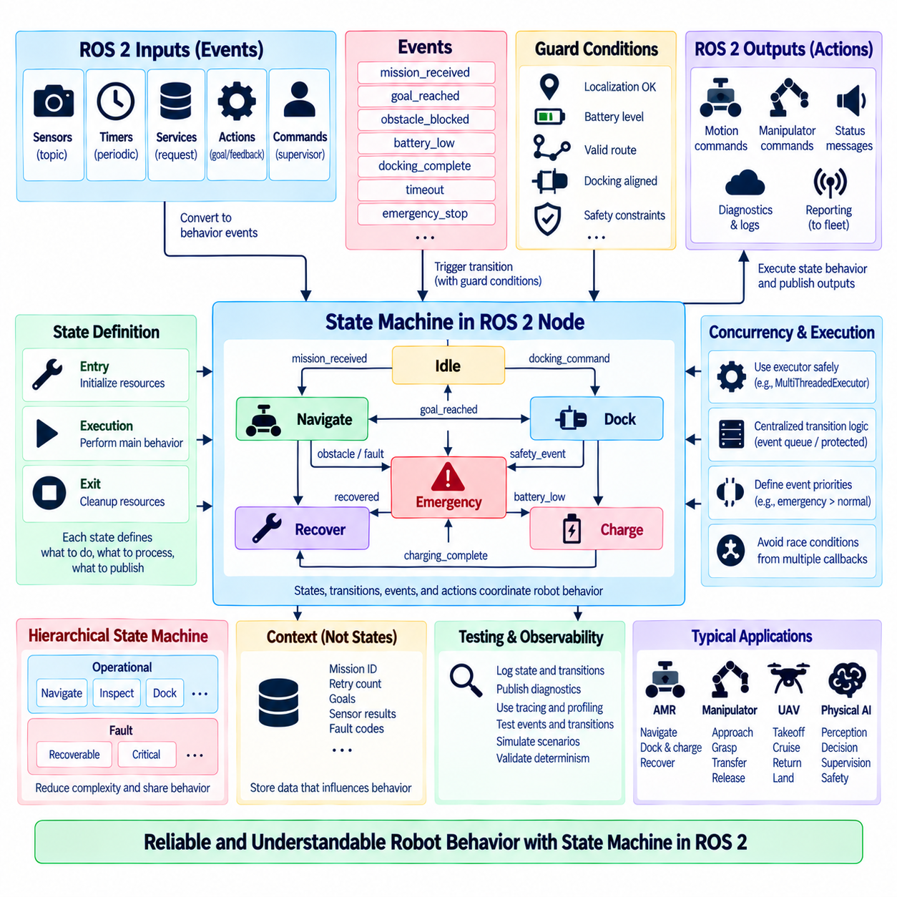
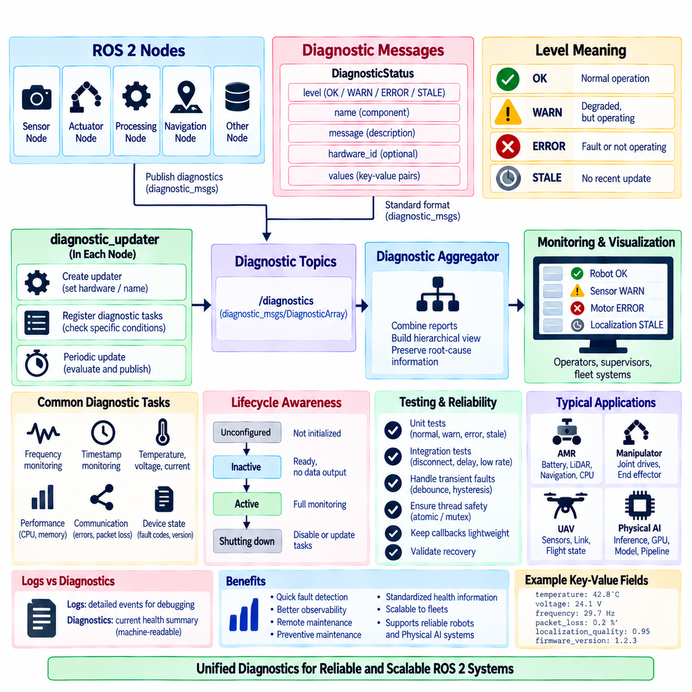
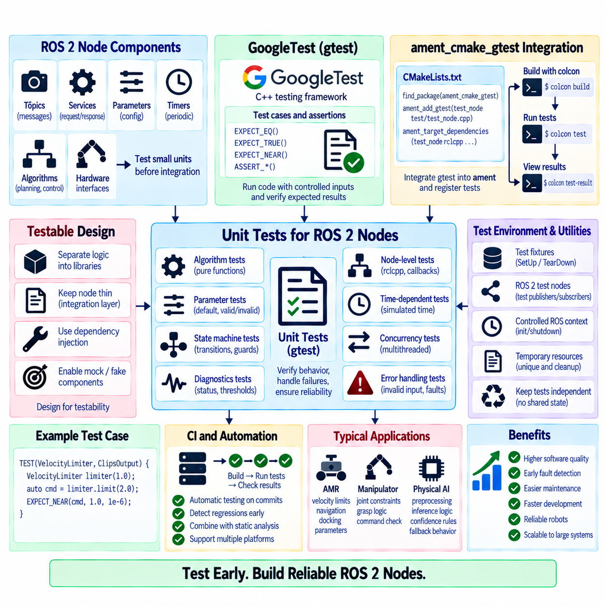
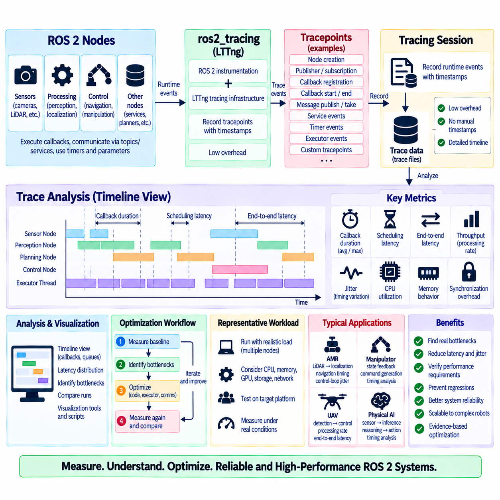

**Volume 05 Robot Middleware and ROS2**

# 03. ROS2 Node Architecture

## 03.01 ROS2 Lifecycle Node State Machine [w/Code]

{width="7.268055555555556in" height="7.268055555555556in"}

A ROS 2 Lifecycle Node is a managed node whose operational behavior is controlled through a standardized state machine rather than beginning full execution immediately after process creation. This architecture separates node construction, resource configuration, activation, deactivation, cleanup, and shutdown into explicit stages. It enables a robotic system to determine not only whether a process exists, but whether the node is actually prepared and authorized to perform its intended function.

The lifecycle mechanism is especially valuable in complex robotic systems containing perception, localization, planning, control, diagnostics, and hardware-interface nodes. Ordinary ROS 2 nodes usually initialize their resources and begin operation according to application-specific logic. Lifecycle nodes instead expose predictable management interfaces, allowing an external supervisor or orchestration layer to coordinate startup and shutdown sequences across many interdependent components.

The state machine distinguishes primary states from transitions between those states. The principal stable states are Unconfigured, Inactive, Active, and Finalized. When a lifecycle node is first instantiated, it normally enters the Unconfigured state. At this stage, the ROS 2 node object exists, but application-specific resources required for normal operation have not yet been fully initialized, making the node available for controlled configuration without allowing mission execution.

A Configure transition moves the node from Unconfigured toward Inactive and invokes the configuration callback. During this operation, the node can load parameters, allocate memory, initialize algorithms, establish device interfaces, prepare publishers and subscribers, or create other required resources. Successful completion places the node in Inactive. If configuration fails, the lifecycle framework can redirect execution through defined failure handling rather than silently leaving the component in an uncertain operational condition.

The Inactive state represents a configured but non-operational condition. Resources may already exist, communication interfaces may be prepared, and internal data structures may be initialized, yet the node should not perform its primary mission behavior. This distinction is important for coordinated systems because multiple nodes can be prepared before any of them begin producing operational outputs. A supervisor can therefore establish a deterministic readiness boundary before activating the complete processing chain.

Activation moves a lifecycle node from Inactive to Active through the activation callback. The node is now permitted to perform its normal operational role, such as publishing sensor data, generating localization estimates, producing trajectories, or participating in autonomous control. Lifecycle-aware publishers can be activated specifically during this transition, preventing meaningful output from being transmitted before the component has reached its intended operational state.

Deactivation provides the reverse controlled transition from Active to Inactive. Instead of destroying the node, the system temporarily suspends its operational behavior while preserving configured resources that may be needed again. This capability is useful during mission pauses, mode changes, sensor reconfiguration, subsystem isolation, or controlled recovery procedures. A node can later be reactivated without repeating every initialization operation, reducing restart latency and unnecessary resource reconstruction.

The Cleanup transition normally moves a node from Inactive back to Unconfigured. During cleanup, resources acquired during configuration can be released, device sessions can be closed, dynamically allocated structures can be discarded, and configuration-dependent state can be reset. The node process can remain alive while returning to a condition suitable for a new configuration cycle, which supports controlled reinitialization without requiring complete process termination and recreation.

Shutdown transitions move the lifecycle toward the Finalized state. Shutdown can be requested from several stable states because a system may need to terminate a component regardless of whether it is currently unconfigured, inactive, or active. Finalized represents the end of managed operation. This explicit terminal state allows supervisors, diagnostics systems, and launch infrastructure to distinguish intentional lifecycle termination from uncontrolled disappearance caused by process crashes or communication failures.

Lifecycle transitions are implemented through callbacks such as on_configure(), on_activate(), on_deactivate(), on_cleanup(), on_shutdown(), and on_error(). Each callback should perform only the work appropriate to its transition and return a result describing success, failure, or error. Keeping responsibilities aligned with lifecycle boundaries improves architectural clarity because resource ownership, operational permission, recovery behavior, and termination logic become visible parts of the node design rather than hidden application conventions.

Error handling is an essential part of the lifecycle state machine. A failure during configuration, activation, deactivation, cleanup, or runtime operation should not automatically be treated as equivalent to process termination. The lifecycle model provides structured paths through which an error callback can attempt recovery, release resources, report diagnostic information, or move the node toward a safe state. The exact recovery policy remains application dependent and must be designed according to subsystem criticality.

A lifecycle manager can control multiple managed nodes through ROS 2 lifecycle services and coordinate their transitions according to dependency relationships. For example, a hardware driver may need to reach Active before a perception node begins processing its data, while localization may need valid sensor streams before navigation is activated. Coordinated transitions therefore transform node startup from an arbitrary timing problem into an explicit system-level sequencing problem with observable state and controllable progression.

This approach becomes particularly important in autonomous mobile robots, manipulators, UAVs, and distributed Physical AI systems. Consider an AMR in which motor interfaces, LiDAR drivers, localization, obstacle perception, path planning, and motion control form a dependency chain. Activating motion control before localization and safety perception are ready could create unsafe behavior. Lifecycle management allows the architecture to configure components first, verify readiness, and activate them according to defined dependencies.

Lifecycle nodes also improve maintenance and fault recovery because individual subsystems can be restarted or reconfigured without necessarily restarting the entire ROS 2 graph. A malfunctioning sensor-processing node may be deactivated, cleaned up, configured again, and reactivated while unrelated services continue operating. This controlled restart pattern can reduce downtime and supports resilient architectures in which faults are isolated at component boundaries instead of propagating immediately into system-wide restarts.

The lifecycle state should not be confused with application-level mission state. Active indicates that a node is operationally enabled, but it does not necessarily mean that a robot is driving, manipulating an object, or executing a mission. Mission states such as Idle, Navigate, Inspect, Dock, Charge, or Emergency Stop belong to higher-level behavioral logic. Separating node lifecycle management from mission behavior prevents infrastructure state and robot task state from becoming tightly coupled.

Similarly, lifecycle management does not replace functional safety mechanisms. An Active controller may still require independent emergency-stop circuits, watchdogs, command validity checks, communication timeout handling, actuator limits, and safety-rated hardware. Lifecycle state provides software orchestration and operational readiness management, while safety functions must be implemented according to the hazards, safety requirements, and applicable standards of the physical system.

In distributed ROS 2 deployments, lifecycle information can also support observability. Supervisors can query node states, monitor transition results, correlate lifecycle changes with diagnostics, and record state histories in system logs. When a robot fails during deployment, engineers can determine whether a component failed to configure, never reached Active, unexpectedly returned to Inactive, or entered an error path. Such information substantially improves debugging compared with merely knowing whether a process was running.

A robust lifecycle architecture therefore treats transitions as contracts. Configuration should establish resources and prerequisites, activation should enable operational behavior, deactivation should suspend that behavior predictably, cleanup should release configuration-dependent resources, and shutdown should terminate managed operation safely. Transition callbacks should be bounded, observable, and designed to avoid leaving hardware or software resources in ambiguous intermediate conditions when operations fail.

At the system level, the ROS 2 Lifecycle Node State Machine provides a foundation for deterministic orchestration. It converts component readiness from an implicit assumption into an explicit state that other software can inspect and control. Combined with dependency management, diagnostics, watchdogs, fault recovery, and mission-level supervision, lifecycle nodes help transform a collection of independently executing ROS 2 processes into a coordinated robotic software architecture suitable for increasingly complex autonomous systems.

## 03.02 Composition Node: Intraprocess Communication [w/Code]

{width="7.268055555555556in" height="7.268055555555556in"}

ROS 2 composition allows multiple nodes to execute within a single process instead of launching every node as an independent operating-system process. These composable nodes are implemented as loadable components and hosted by a component container. The approach preserves the logical separation of ROS 2 nodes while reducing process-management overhead and enabling communication optimizations that are particularly valuable for high-bandwidth robotic data pipelines.

A conventional ROS 2 deployment often maps one node to one process, providing strong isolation and straightforward fault boundaries. However, data exchanged between separate processes must normally pass through middleware transport mechanisms involving serialization, memory copying, and operating-system networking facilities. For large camera images, point clouds, tensors, or other high-rate sensor messages, these operations can consume significant CPU time and memory bandwidth.

Composition changes the deployment boundary without requiring the software architecture to abandon node modularity. Perception, preprocessing, filtering, localization, or control components can remain distinct ROS 2 nodes with their own publishers, subscribers, parameters, and callbacks while sharing one executable process. The component container dynamically loads these node implementations and manages their execution through ROS 2 component infrastructure.

A composable node is commonly implemented as a class derived from rclcpp::Node and registered as a component so that it can be discovered and loaded at runtime. Instead of defining an independent main() function for every executable, the node implementation is packaged as a shared library. A container process then instantiates one or more components, allowing deployment topology to be changed without fundamentally rewriting the node algorithms.

ROS 2 component containers provide an important separation between software implementation and runtime deployment. The same functional node can potentially run in a dedicated process when isolation is important or share a process with related components when communication efficiency is the priority. This flexibility allows architects to optimize deployment according to message size, communication frequency, latency requirements, resource constraints, and failure-isolation requirements.

Intra-process communication is one of the major performance advantages associated with composition. When compatible publishers and subscribers reside in the same process and intra-process communication is enabled, ROS 2 can avoid portions of the conventional middleware communication path. Messages can be transferred through process-local mechanisms rather than being serialized, transmitted through DDS, deserialized, and copied in the same manner as inter-process communication.

The optimization is especially important for large messages. Consider a camera node publishing high-resolution image frames to preprocessing, neural-network inference, and visualization nodes. Repeated serialization and copying of every image can generate substantial memory traffic. Placing tightly coupled stages in one process and using intra-process communication can reduce unnecessary copies, decrease CPU utilization, and improve end-to-end processing latency.

ROS 2 uses ownership-aware message passing to support efficient intra-process communication. C++ publishers and subscribers can work with smart-pointer-based message ownership, including std::unique_ptr and std::shared_ptr patterns depending on the communication configuration. Where ownership conditions permit, a message can be transferred rather than repeatedly duplicated, allowing large payloads to move between callbacks with substantially lower copying overhead.

The term zero-copy should nevertheless be used carefully. Intra-process communication can eliminate important serialization and copying operations, but it does not guarantee that every message travels through the complete application with absolutely no memory copy. Message ownership, subscriber count, API usage, middleware behavior, message type, and downstream processing can introduce additional copies. Performance should therefore be verified through measurement rather than assumed from architecture alone.

A single publisher may also communicate with multiple subscribers, which complicates exclusive message ownership. A unique message cannot simply be transferred independently to several consumers without considering how each subscriber accesses the data. ROS 2 communication mechanisms must preserve valid ownership and lifetime semantics, and some topologies may consequently require shared ownership or copying. Architecture decisions should therefore consider the complete publisher-subscriber graph rather than an isolated connection.

Composition and intra-process communication are related but distinct concepts. Composition means that multiple ROS 2 nodes share a process, whereas intra-process communication describes an optimized communication path available between compatible endpoints inside that process. Loading nodes into one container creates the opportunity for process-local optimization, but the relevant communication options and publisher-subscriber design must still support the intended intra-process behavior.

The component container also determines how callbacks are scheduled. Multiple composed nodes may share executor resources, meaning that computationally expensive callbacks can influence other components if execution is not designed carefully. A long-running perception callback, for example, may delay time-sensitive callbacks when inappropriate executor or callback-group configurations are used. Communication optimization must therefore be considered together with concurrency and executor architecture.

Single-threaded containers provide relatively simple execution behavior and can be useful when deterministic callback ordering or reduced concurrency complexity is desired. Multi-threaded execution can increase parallelism for independent callbacks but introduces synchronization requirements and possible contention for shared resources. The appropriate choice depends on workload characteristics, callback duration, thread safety, latency requirements, and available CPU cores rather than composition alone.

Process sharing also changes fault-isolation characteristics. Separate ROS 2 processes provide natural operating-system boundaries, so the failure of one process does not necessarily terminate unrelated nodes. When several nodes are composed into one container, a fatal error affecting the process can potentially remove all components hosted within it. Architects must balance communication performance against fault containment when deciding which nodes should share a container.

For this reason, composition boundaries should normally follow functional coupling and data-flow characteristics. Nodes exchanging large, high-frequency messages are strong candidates for composition, particularly when they form a tightly connected processing pipeline. Components with different safety criticality, unstable third-party libraries, independent restart requirements, or limited communication volume may be better deployed in separate processes even if composition is technically possible.

A typical perception pipeline may compose camera acquisition, image rectification, preprocessing, and inference nodes because large image messages flow continuously among them. Higher-level mission planning or fleet communication nodes may remain in separate processes because their messages are smaller and their failure domains differ. Such hybrid deployment combines efficient local data movement with intentional isolation between major robotic subsystems.

Composition can also reduce deployment overhead on resource-constrained edge computers. Fewer operating-system processes can mean fewer duplicated runtime structures, reduced process startup overhead, and more efficient sharing of computational resources. These benefits are relevant to embedded robotic computers and GPU-equipped edge platforms where perception, localization, planning, and AI inference must coexist under constrained CPU, memory, power, and thermal budgets.

Performance evaluation should include more than average message latency. Engineers should examine CPU utilization, memory consumption, memory bandwidth, callback latency, message throughput, jitter, and worst-case behavior under realistic workloads. Comparisons between separate-process communication and composed intra-process communication are particularly useful for image and PointCloud2 pipelines because payload size and publication frequency can strongly influence the benefit obtained.

Observability and debugging remain important when multiple nodes occupy one process. ROS 2 graph tools still represent the logical nodes separately, but process-level monitoring may show several components under a common container. Logging should therefore preserve clear node identities, and diagnostics should distinguish component-level health from container-level health. This distinction becomes essential when identifying whether a failure originates from one algorithm or from shared execution infrastructure.

Composition also supports configurable robot software products because deployment can be adjusted without changing the logical interface architecture. A development system may launch components independently for debugging, while a production robot may compose performance-sensitive nodes into optimized containers. The topic, service, action, and parameter interfaces can remain largely consistent, allowing deployment optimization to occur independently from higher-level functional integration.

In a scalable ROS 2 architecture, composition should therefore be treated as a deployment and performance design mechanism rather than simply a method for reducing the number of processes. Intra-process communication provides its greatest value when data locality, ownership semantics, executor behavior, and fault boundaries are considered together. Properly applied, these mechanisms preserve ROS 2 modularity while enabling efficient high-bandwidth communication for demanding robotic and Physical AI workloads.

## 03.03 Node Parameter System Usage [w/Code]

{width="7.268055555555556in" height="7.268055555555556in"}

The ROS 2 parameter system provides a standardized mechanism for configuring node behavior without embedding every operational value directly in source code. Parameters belong to individual nodes and represent configurable values such as sensor rates, thresholds, frame identifiers, algorithm options, controller gains, or feature switches. This node-centric model makes configuration explicit while preserving clear ownership of runtime settings.

Unlike a global configuration database, ROS 2 parameters are associated with specific node instances. Each node declares the parameters it supports and can define their names, types, default values, and optional descriptors. This architecture prevents unrelated components from implicitly sharing configuration state and allows developers to understand which node owns a particular setting, an important property in large distributed robotic software systems.

Parameter declaration establishes the configuration contract of a node. In rclcpp, a node can use declare_parameter() to introduce a parameter and provide an initial value or expected type. Declaring parameters before accessing them improves interface clarity because supported configuration options become part of the node design. Undeclared parameter behavior can be controlled through node options, but explicit declaration is generally preferable for predictable production systems.

ROS 2 parameters support fundamental scalar and array data types suitable for most runtime configuration requirements. Typical values include Boolean flags, integers, floating-point numbers, strings, byte arrays, and arrays of primitive types. Complex application structures are normally represented through logically grouped parameter names or external configuration structures rather than treating the parameter mechanism as a general-purpose database for arbitrary application data.

Hierarchical naming conventions make large parameter sets easier to organize. A perception node might use names such as camera.width, camera.height, detection.threshold, and inference.device, while a controller could expose control.frequency, velocity.max_linear, and velocity.max_angular. The dot-separated notation provides a logical namespace-like structure even though parameters ultimately remain individually named values owned by the node.

Default values are important because they define how a node behaves when no external configuration is supplied. A well-designed default should permit safe and understandable initialization whenever practical, while deployment-specific values can override it. Critical hardware identifiers, calibration values, or safety-related limits should not be assigned arbitrary defaults merely for convenience, because an apparently valid configuration can be more dangerous than an explicit configuration failure.

Parameters can be supplied from the command line when a node is launched. This is convenient for testing, debugging, and temporary experiments because individual settings can be changed without editing source files or maintaining another configuration artifact. Command-line overrides are less suitable for large production configurations, however, because long parameter lists become difficult to review, reproduce, version, and maintain consistently across multiple robots.

YAML parameter files provide a practical method for managing larger configurations. A YAML file can associate node names with ros__parameters and define many values in a structured form. Configuration files can be stored with robot software, tracked through version control, reviewed during integration, and selected for different hardware variants or deployment environments. This makes parameter management part of repeatable system configuration rather than an informal runtime procedure.

Launch files can connect parameter definitions to deployment architecture. A ROS 2 launch description may provide parameter files, direct parameter dictionaries, or combinations of default and deployment-specific settings when creating nodes. This allows one software package to support multiple robot variants while keeping algorithm implementation unchanged. Hardware model, sensor configuration, operating environment, and mission profile can therefore influence runtime behavior through deployment configuration.

Parameters can also be inspected and modified through ROS 2 command-line tools. Engineers can list parameters exposed by a node, retrieve current values, examine descriptors, and request runtime changes. These capabilities are useful during commissioning and debugging because the active configuration can be observed directly from the running system instead of being inferred only from source files or expected launch arguments.

Runtime parameter changes introduce additional design responsibilities. A node should not accept a new value merely because its type is syntactically valid. Changing a control frequency, detection threshold, coordinate frame, device identifier, or resource allocation parameter may require validation or may be unsafe while the component is operating. Parameter mutability should therefore be designed according to the operational meaning of each setting.

ROS 2 provides parameter-change callbacks that allow a node to validate requested updates before accepting them. A callback can check numerical ranges, combinations of related values, operating-state restrictions, or hardware constraints and reject invalid requests. This validation layer converts the parameter interface from simple writable storage into a controlled configuration boundary, helping prevent runtime changes from creating inconsistent internal state.

Validation should consider relationships among parameters rather than checking values independently when necessary. For example, a minimum range should remain below a maximum range, image dimensions may need to match a supported camera mode, and controller limits may depend on the physical platform. A request containing several parameter updates should be evaluated as a coherent configuration change when their meanings are interdependent.

Parameter descriptors can provide metadata describing the intended meaning and constraints of a parameter. Descriptions, read-only properties, integer ranges, and floating-point ranges can make configuration interfaces easier to understand and support tooling that presents parameter information to users. Descriptors do not eliminate the need for application-level validation, but they improve self-documentation and reduce ambiguity in reusable robotic software components.

Parameter events provide visibility into configuration changes across the ROS 2 system. When parameters are created, modified, or deleted, parameter-related events can be observed by interested components. Monitoring these events can support diagnostics, configuration auditing, user interfaces, and system supervision. In production robots, recording important parameter changes together with timestamps can be valuable when investigating behavior that changed during operation.

Parameters should be distinguished from topics, services, and actions according to semantic purpose. Parameters represent relatively persistent configuration associated with a node, whereas topics are designed for streams of data, services for request-response interactions, and actions for longer-running goal-oriented operations. Using parameters for high-frequency state exchange or sensor data would misuse the configuration mechanism and create an unsuitable communication architecture.

The parameter system also interacts with node lifecycle management. A lifecycle node may declare parameters during construction but apply resource-dependent configuration during its configuration transition. Some settings may be allowed to change only while the node is Unconfigured or Inactive, while others can safely change during Active operation. Connecting parameter mutability to lifecycle state creates clearer operational rules for reconfiguration.

In an AMR, parameters may configure LiDAR frame names, localization thresholds, planner behavior, maximum velocity, obstacle margins, or diagnostic intervals. In a manipulator, they may define controller gains, joint limits, planning options, and device interfaces. Physical AI nodes may expose inference thresholds, model paths, accelerator selection, preprocessing dimensions, or runtime feature switches, allowing common software components to adapt to different deployment targets.

Large robot fleets require disciplined parameter governance because uncontrolled per-robot modifications can gradually create configuration drift. Parameter files should be versioned, deployment variants should be identifiable, and important runtime overrides should be traceable. A robot should ideally report not only its software version but also the effective configuration used by critical nodes, enabling field behavior to be reproduced during testing and failure analysis.

Security must also be considered because runtime parameter modification can alter robot behavior. A parameter controlling speed limits, perception thresholds, communication endpoints, or safety-related operating conditions should not be treated as harmless configuration. Access to parameter services should follow the security architecture of the ROS 2 deployment, and critical changes may require additional authorization, validation, logging, or higher-level supervisory control.

A robust ROS 2 parameter architecture therefore combines explicit declaration, meaningful defaults, structured YAML configuration, launch-time overrides, runtime inspection, controlled mutation, validation, observability, and configuration versioning. Used correctly, the parameter system separates software logic from deployment-specific settings while maintaining clear node ownership. This enables reusable ROS 2 components to operate predictably across development, simulation, production robots, and scalable Physical AI systems.

## 03.04 Pluginlib-Based Extensible Node Design [w/Code]

{width="7.268055555555556in" height="7.268055555555556in"}

ROS 2 pluginlib provides a runtime plugin mechanism that allows software components to select and load implementations without statically binding every implementation into the application architecture. A node can depend on an abstract interface while concrete algorithms are supplied as dynamically loadable plugins. This pattern separates stable application logic from replaceable functionality and enables extensible robotic software that can evolve without repeatedly modifying the core node.

The architectural foundation of pluginlib is interface-based design. A developer first defines a base class representing the contract that every plugin implementation must satisfy. The interface normally contains virtual methods describing required behavior while avoiding implementation-specific assumptions. Navigation algorithms, planners, controllers, filters, cost functions, perception processors, or hardware strategies can therefore share one common interface while providing substantially different internal algorithms.

Concrete plugin classes derive from the common base interface and implement its required functions. The host node does not need detailed knowledge of these classes during its normal control flow. Instead, it interacts with objects through pointers or references to the base interface. This use of polymorphism reduces coupling because application logic depends on an abstraction rather than directly depending on each algorithm implementation.

Plugins are commonly compiled into shared libraries that can be discovered and loaded at runtime. The plugin implementation is exported using pluginlib-compatible registration mechanisms so that the framework can associate a plugin class with its base type. The host application can then request a particular implementation by its registered identifier instead of constructing the concrete class directly in source code.

Plugin description files provide metadata connecting symbolic plugin names to their implementation classes and shared libraries. These descriptions allow pluginlib to determine which library contains a requested class and which base interface the implementation supports. Package metadata exports the plugin description so that other ROS 2 packages can discover available implementations through the ROS package environment without hard-coded absolute library paths.

The plugin loader, typically represented by pluginlib::ClassLoader in C++, forms the runtime bridge between the host node and dynamically loaded implementations. It is configured with the package and base-class type associated with a plugin family. The application can query declared classes and instantiate a selected implementation. The resulting object is accessed through the common interface, keeping plugin-specific construction details outside the main algorithmic logic.

Configuration and plugin selection are often connected through ROS 2 parameters. A node may expose a parameter such as planner_plugin, controller_plugin, filter_type, or perception_backend whose value identifies the implementation to load. YAML configuration or launch files can then select different plugins for different robots or operating environments while the executable and high-level node logic remain unchanged.

This architecture is particularly useful when several algorithms provide the same functional role. A navigation system may support multiple global planners or local controllers, while a perception pipeline may offer alternative filtering, segmentation, or detection strategies. Instead of implementing a large conditional structure inside one node, each strategy can be encapsulated as an independent plugin implementing the same interface contract.

Plugin-based design also improves package modularity. A core package can contain interfaces and common infrastructure while separate packages provide concrete implementations. New algorithms can therefore be added as additional packages without requiring direct modification of the host package. This separation supports independent development, testing, versioning, and distribution, which becomes increasingly valuable as a robotic software ecosystem grows.

Runtime extensibility does not necessarily imply unrestricted hot swapping during active robot operation. Loading a new implementation may require resource initialization, parameter validation, memory allocation, hardware access, or reconstruction of algorithm state. If plugins must be replaced while the system is running, the architecture should define controlled transitions that prevent callbacks from accessing objects while they are being destroyed or replaced.

Lifecycle nodes can provide a useful structure for controlled plugin management. A plugin may be selected and instantiated during the Configure transition, activated when the node enters Active, suspended during Deactivate, and released during Cleanup. This approach aligns plugin resource ownership with explicit node states and makes reconfiguration behavior easier to reason about than replacing active algorithm objects at arbitrary execution points.

Thread safety becomes important when plugin methods are invoked from callbacks managed by ROS 2 executors. A plugin object may be accessed by subscriptions, timers, services, or actions executing concurrently, particularly under a MultiThreadedExecutor. The plugin interface and implementation must clearly define whether concurrent invocation is permitted and which internal resources require synchronization to prevent races or inconsistent state.

Failure handling must also be designed at the plugin boundary. A requested plugin may not exist, its shared library may fail to load, construction may fail, or initialization may reject the current configuration. The host node should detect these conditions and produce useful diagnostic information rather than continuing with an invalid object. Critical systems may define fallback implementations, but fallback behavior should be explicit and validated rather than silently changing algorithms.

Interface stability is one of the most important requirements for a sustainable plugin architecture. When the base interface changes, existing plugin implementations may require modification and rebuilding. Interfaces should therefore capture stable functional contracts and avoid exposing unnecessary implementation details. Versioning strategies become necessary when major interface changes cannot remain backward compatible across independently maintained plugin packages.

Plugin interfaces should also define ownership and lifetime expectations for exchanged data. Passing raw implementation-specific structures across the abstraction boundary can tightly couple plugins to the host application. Preferable interfaces use stable ROS messages, standard C++ types, clearly defined domain structures, or carefully designed abstract data contracts. This allows implementations to evolve internally without forcing corresponding changes throughout the surrounding node architecture.

Testing benefits from the separation created by pluginlib. Individual plugin implementations can be unit-tested against the base interface, while the host node can be tested using simple mock or test plugins. Integration tests can verify plugin discovery, library loading, configuration, initialization, and execution. This separation makes it easier to determine whether a failure originates from core node orchestration or from a specific algorithm implementation.

Performance considerations remain relevant because abstraction does not eliminate computational cost. Virtual function dispatch and plugin loading usually represent small overhead compared with perception, planning, or control algorithms, but initialization time, memory allocation, and library dependencies can affect startup behavior. Performance-sensitive applications should measure complete execution paths and avoid assuming that either static integration or plugin-based integration is inherently faster.

Security and deployment governance are also important in production systems. Dynamically loading arbitrary libraries can create significant risk if plugin selection or installed packages are not controlled. Production robots should load only trusted and validated plugin implementations from managed software distributions. Plugin configuration, package versions, and library integrity should be included in deployment and software update policies.

A practical AMR architecture might define common interfaces for global planning, local control, docking behavior, obstacle processing, or recovery strategies. Different robot models can then select implementations according to drivetrain geometry, sensor configuration, operating environment, or mission requirements. The same host architecture can support indoor logistics robots, outdoor AMRs, or specialized inspection platforms without embedding every platform-specific algorithm into one monolithic node.

Physical AI systems can apply the same pattern to inference backends, preprocessing strategies, model adapters, semantic reasoning modules, or action-generation components. A common interface may allow one deployment to use a lightweight edge inference implementation while another uses a larger GPU-accelerated model. Plugin selection can therefore become a controlled mechanism for adapting a common ROS 2 software architecture to different compute capabilities.

The plugin pattern should not be applied indiscriminately. Functions that are permanently fixed, extremely simple, or tightly coupled to core invariants may gain little from dynamic extensibility. Excessive plugin boundaries can increase configuration complexity and make dependencies harder to understand. Pluginlib is most effective where multiple interchangeable implementations genuinely exist or where future extension is an explicit architectural requirement.

A robust pluginlib-based ROS 2 architecture therefore combines stable abstract interfaces, independently packaged implementations, runtime discovery, configuration-driven selection, controlled lifecycle management, explicit failure handling, thread-safe execution, testing, and deployment governance. Applied to appropriate extension points, pluginlib transforms algorithm variability from hard-coded branching into a modular architectural capability, enabling ROS 2 nodes to remain reusable as robotic platforms and Physical AI functions evolve.

## 03.05 Node Callback Groups and Executor Design [w/Code]

{width="7.268055555555556in" height="7.268055555555556in"}

ROS 2 callback groups and executors define how callbacks are scheduled and allowed to execute relative to one another. A node may contain subscriptions, timers, services, clients, and actions that generate executable callbacks, but their timing behavior is not determined by the node abstraction alone. Executors select ready work, while callback groups express concurrency constraints among callbacks, providing an architectural mechanism for controlling execution behavior.

An executor connects ROS 2 communication events to application callback execution. It monitors entities associated with one or more nodes and determines which ready callback should execute. Rather than creating a dedicated application thread for every subscription or timer, ROS 2 centralizes callback scheduling through executors. This model allows developers to control threading and concurrency independently from the logical communication interfaces exposed by individual nodes.

The SingleThreadedExecutor executes callbacks using one execution thread. Only one callback handled by that executor can execute at a time, which simplifies reasoning about shared state and eliminates many forms of simultaneous access. This model is useful for relatively simple nodes or systems where callback execution times are short, but a long-running callback can delay every other callback waiting on the same executor.

The MultiThreadedExecutor provides multiple worker threads that can execute eligible callbacks concurrently. This can improve responsiveness and computational utilization when callbacks are independent or frequently wait for external operations. However, adding executor threads does not automatically make every callback parallel. Actual concurrency depends on callback-group configuration, available ready work, synchronization, and whether application code can safely execute simultaneously.

Callback groups define concurrency relationships within nodes. ROS 2 provides two principal group types: MutuallyExclusive and Reentrant. Entities such as subscriptions, timers, service servers, clients, and action-related callbacks are associated with callback groups. The executor considers these group semantics when selecting work, allowing developers to express which callbacks must avoid overlapping execution and which callbacks may execute concurrently.

A MutuallyExclusive callback group permits only one callback belonging to that group to execute at a time. Even when a MultiThreadedExecutor has several available worker threads, callbacks in the same mutually exclusive group are serialized relative to one another. This behavior is useful when callbacks share state that should not be accessed concurrently or when an algorithm requires a predictable sequence of operations without explicit fine-grained locking.

A Reentrant callback group permits multiple callbacks from the group to execute concurrently when executor resources are available. This can include different callbacks and potentially multiple invocations of the same callback. Reentrant groups are therefore appropriate only when the corresponding application logic is designed for concurrent execution. Shared mutable state must be protected, eliminated, or structured so that overlapping callback execution cannot produce races.

Every callback-capable entity belongs to a callback group, either one explicitly assigned by the developer or a default group associated with the node. This detail is important because using a MultiThreadedExecutor alone may provide little expected concurrency if all relevant callbacks remain in one mutually exclusive default group. Effective executor design therefore requires intentional callback-group assignment rather than simply increasing the number of executor threads.

Consider a node containing a high-rate sensor subscription, a periodic control timer, and a diagnostic service. If all callbacks share one mutually exclusive group, expensive sensor processing may delay the control timer and service response. Separating them into appropriate groups can allow independent execution under a MultiThreadedExecutor, provided that shared data is synchronized and the underlying algorithms support concurrent access.

Callback groups can therefore represent architectural execution domains. A control-related group may serialize state estimation and command generation, while a diagnostic group executes independently. A computational perception callback may be placed in another group so that it does not unnecessarily block lightweight communication callbacks. This organization makes concurrency policy visible in the node structure rather than scattering thread-management decisions throughout application code.

Concurrency introduces race conditions when callbacks access shared mutable data without correct synchronization. A subscriber may update a state estimate while a timer reads it, or a service may modify configuration while another callback uses the same object. Mutexes, atomics, immutable data, ownership transfer, message passing, or carefully designed state snapshots can be used depending on the access pattern and required timing behavior.

Synchronization itself can introduce latency and contention. Protecting a large shared structure with one coarse mutex may prevent data corruption but serialize callbacks that were intended to run concurrently. Fine-grained locking can increase parallelism but also increases implementation complexity and deadlock risk. Executor architecture should therefore be designed together with data ownership rather than treating callback groups and synchronization as unrelated concerns.

Blocking operations require particular attention. A callback that waits synchronously for a service response, action result, device operation, or other event may occupy an executor thread for an extended period. If completion requires another callback that cannot execute because of callback-group restrictions or exhausted executor threads, the system can deadlock or suffer severe latency. Asynchronous interaction patterns are often preferable inside callback-driven architectures.

Deadlocks can occur even when several executor threads exist. For example, a callback may make a synchronous request and wait for a completion callback associated with the same MutuallyExclusive group. Because the waiting callback still occupies the group\'s execution permission, the completion callback cannot run. Understanding callback-group relationships is therefore essential when using synchronous service or action operations from within callbacks.

Executor design also affects latency, jitter, and responsiveness. A high-priority conceptual function does not automatically receive operating-system real-time priority merely because it is placed in a separate callback group. Callback groups control eligibility for concurrent execution, while thread scheduling is governed by the executor implementation and operating system. Systems with strict real-time requirements may require specialized executors, thread configuration, CPU affinity, and real-time operating-system policies.

Long-running computation should be evaluated carefully before placing it directly inside a callback. Neural-network inference, large point-cloud processing, optimization, or planning may consume enough time to interfere with communication and control callbacks. Such workloads can be separated into dedicated execution contexts, worker threads, processes, or specialized pipelines while ROS 2 callbacks perform bounded data transfer and coordination.

Composition further increases the importance of executor design because multiple nodes can share one process and potentially one executor. A composed perception pipeline may contain camera, preprocessing, inference, and visualization nodes whose callbacks compete for the same worker threads. Efficient intra-process communication can reduce data-transfer overhead, but poor callback scheduling can still create latency, starvation, or contention within the shared process.

Multiple executors can be used when stronger execution separation is required. Different nodes or callback groups may be assigned to separate executor contexts so that control, perception, diagnostics, and background processing do not all compete within one scheduling domain. This approach can provide clearer resource boundaries, although additional executors and threads increase system complexity and must still be coordinated with shared resources.

Observability is essential when tuning callback execution. Engineers should measure callback duration, scheduling delay, execution frequency, queueing behavior, CPU utilization, and end-to-end latency under realistic load. Tracing tools can reveal whether a callback is delayed because another callback is executing, because no executor thread is available, or because synchronization blocks progress. Executor configuration should be validated empirically rather than selected only from theoretical expectations.

For an AMR, callback architecture might isolate motion-control timers from computationally intensive LiDAR or camera processing while allowing diagnostics and fleet communication to proceed independently. Manipulators may separate high-rate state updates from planning services, while Physical AI systems may isolate GPU inference coordination from safety monitoring. The exact grouping should reflect timing dependencies, shared state, computational load, and failure consequences.

A robust ROS 2 execution architecture therefore combines intentional callback-group assignment, appropriate executor selection, explicit data ownership, bounded callback behavior, careful synchronization, and performance measurement. Single-threaded execution offers simplicity, while multi-threaded execution provides controlled concurrency when the software is designed to support it. Together, callback groups and executors transform callback scheduling into an explicit architectural decision for scalable robotic and Physical AI systems.

## 03.06 Multi-Thread Executor and Callback Concurrency [w/Code]

{width="7.268055555555556in" height="7.268055555555556in"}

The ROS 2 MultiThreadedExecutor enables multiple eligible callbacks to execute concurrently through a pool of worker threads. It is designed for nodes and composed systems in which subscriptions, timers, services, actions, and other callback-driven operations may need to progress simultaneously. Unlike single-threaded execution, it introduces controlled parallel execution, but actual concurrency depends on callback groups, available work, synchronization, and application design.

The executor continuously identifies executable entities whose conditions are ready, such as a subscription with available data or a timer whose period has expired. Ready work is assigned to available worker threads according to executor scheduling behavior and callback-group constraints. The number of threads therefore defines potential execution capacity, while the callback architecture determines whether that capacity can actually be used.

A MultiThreadedExecutor does not automatically execute every callback in parallel. If callbacks belong to the same MutuallyExclusive callback group, only one of them may execute at a time even when several worker threads are idle. Conversely, callbacks assigned to compatible groups or a Reentrant group can execute simultaneously when resources are available. Callback-group design is therefore a fundamental part of multi-threaded execution.

MutuallyExclusive groups are useful when callbacks access common state that should be processed sequentially. For example, a localization update and a control-state modification may share data structures whose consistency is easier to guarantee through serialized execution. Placing these callbacks in one mutually exclusive group creates a logical critical execution region without requiring every relationship to be expressed through explicit application-level locks.

Reentrant callback groups permit concurrent callback execution and are appropriate for operations that are thread-safe by design. Multiple sensor-processing requests, independent service operations, or stateless transformations may benefit from this model. Reentrancy must be a property of the implementation rather than merely a configuration choice, because simultaneous invocation can corrupt internal state when an algorithm assumes exclusive access.

Concurrency and parallelism should also be distinguished. Concurrency means that multiple callback operations can make progress during overlapping periods, while true parallelism requires execution on multiple CPU cores or other processing resources at the same time. A MultiThreadedExecutor creates the opportunity for both, but operating-system scheduling, processor availability, callback behavior, and synchronization determine the actual execution pattern.

Thread count is an important design parameter but should not simply be maximized. Too few worker threads can leave independent callbacks waiting unnecessarily, while excessive threads may increase context switching, cache interference, memory pressure, and synchronization overhead. The appropriate number depends on available CPU cores, callback workload, blocking behavior, computational intensity, and whether other processes require guaranteed computing resources.

CPU-bound and I/O-bound callbacks behave differently under multi-threaded execution. CPU-intensive perception, planning, or numerical processing can consume entire cores for significant periods, whereas callbacks waiting for device communication or external services may leave processing resources underutilized. Understanding this distinction helps determine whether additional executor threads improve throughput or merely create more scheduling competition.

Shared mutable data is the primary source of concurrency hazards. Two callbacks may read and modify robot state, maps, command buffers, configuration objects, or algorithm state simultaneously. Without appropriate protection, operations can interleave unpredictably and create data races, corrupted values, inconsistent decisions, or intermittent failures that are difficult to reproduce. Multi-threaded executor design must therefore include an explicit shared-state strategy.

Mutexes provide a common mechanism for protecting shared resources, but their scope and duration directly influence performance. Holding a mutex during expensive computation or blocking communication can prevent other callbacks from progressing and eliminate the benefit of concurrency. Critical sections should therefore be kept as short as practical, and expensive work should preferably operate on local or immutable snapshots when the application architecture permits.

Deadlocks arise when callbacks or threads wait indefinitely for resources or events that cannot become available. Multiple mutexes acquired in inconsistent order are a traditional source of deadlock, but ROS 2 callback interactions can create additional cases. A callback that performs a synchronous request and waits for another callback whose execution is prevented by group restrictions can block the system even when a MultiThreadedExecutor is being used.

Asynchronous communication is often better suited to concurrent callback architectures. Instead of occupying a worker thread while waiting synchronously for a service or action result, a node can initiate the request and process completion through another callback. This approach allows executor threads to continue handling other ready work, although callback groups and object lifetimes must still be designed so that completion processing can execute safely.

Long-running callbacks can create scheduling latency even when no explicit synchronization problem exists. If all executor threads become occupied by expensive perception or planning tasks, short control, diagnostic, or communication callbacks may wait for a worker to become available. Multi-threading reduces some blocking effects but does not guarantee bounded response time. Computational workloads must therefore be separated according to their timing requirements.

Callback starvation is another possible concern. Frequently ready or computationally expensive callbacks may consume execution opportunities while lower-frequency work experiences excessive delay. The standard executor should not be interpreted as a general real-time priority scheduler. Systems requiring strict temporal guarantees may need dedicated execution contexts, specialized executors, operating-system scheduling policies, or separation of critical functions into independent processes.

Multi-threaded execution becomes especially important in composed ROS 2 systems. Several nodes loaded into one component container may share an executor while using efficient intra-process communication. Camera acquisition, preprocessing, inference, localization, and visualization can then execute with lower communication overhead, but they also compete for shared executor threads. Composition and executor configuration must consequently be designed as one integrated performance problem.

A useful architecture can separate callback groups according to timing and data dependencies. High-rate control callbacks may occupy a mutually exclusive group, sensor ingestion may use another group, and independent diagnostics may use a reentrant or separate group. Computationally expensive AI inference can be isolated so that its execution does not unnecessarily serialize lightweight callbacks. The exact arrangement should reflect measured workload rather than generic grouping rules.

Multiple executors may be preferable when callback groups alone do not provide sufficient isolation. A robot can place time-sensitive control nodes on one executor and computational perception nodes on another, potentially assigning their threads to different processor resources. This creates stronger scheduling boundaries, although communication, shared-memory access, and operating-system scheduling must still be considered when evaluating end-to-end behavior.

CPU affinity can further control where executor threads run by restricting selected threads or processes to particular processor cores. In systems with demanding control and perception workloads, affinity can reduce interference and improve repeatability by preventing unrelated computation from migrating across critical cores. Affinity alone does not guarantee real-time behavior, but it can become part of a broader deterministic execution strategy.

Priority management requires similar caution. ROS 2 callback groups do not inherently assign operating-system thread priorities to individual callbacks. If safety monitoring or motion control requires stronger scheduling guarantees than background perception, the architecture may need separate threads, executors, or processes configured with appropriate operating-system policies. Logical callback importance and actual CPU scheduling priority are different concepts.

Tracing and profiling are essential for understanding real callback concurrency. Measurements should capture callback start and completion times, scheduling delay, executor utilization, thread activity, synchronization waits, and end-to-end message latency. These observations reveal whether additional threads improve throughput, whether mutex contention dominates execution, or whether computational callbacks are delaying time-sensitive work.

Testing should include worst-case concurrent workloads rather than only isolated node operation. A system may behave correctly when perception, control, services, and diagnostics are tested separately but fail when all callbacks become active simultaneously. Stress tests should exercise high sensor rates, service requests, parameter updates, planning activity, and fault conditions together to expose races, starvation, excessive jitter, or hidden blocking dependencies.

In an AMR, a MultiThreadedExecutor can allow LiDAR processing, camera ingestion, localization updates, control timers, and diagnostics to progress concurrently while callback groups protect critical shared state. Manipulators can separate high-rate joint-state processing from planning and monitoring. Physical AI platforms can coordinate GPU inference, sensor pipelines, world-model updates, and supervisory functions without forcing every activity through a single sequential callback path.

A robust MultiThreadedExecutor architecture therefore requires more than selecting a larger thread count. It combines intentional callback grouping, thread-safe algorithms, controlled data ownership, minimal blocking, careful synchronization, workload isolation, tracing, and realistic stress testing. When these elements are designed together, callback concurrency can improve responsiveness and resource utilization while preserving predictable behavior in scalable ROS 2 robotic and Physical AI systems.

## 03.07 Node State Machine-Based Behavior Management [w/Code]

{width="7.268055555555556in" height="7.268055555555556in"}

State-machine-based behavior management organizes robot behavior as a set of explicit states, transitions, events, and transition conditions rather than distributing behavioral decisions across loosely connected callbacks. In a ROS 2 node, the state machine can coordinate perception, planning, control, communication, and recovery activities according to the robot's current operational context. This makes behavior flow visible, testable, and easier to reason about as system complexity grows.

A state represents a meaningful behavioral condition in which the node performs a defined set of activities. An AMR might use Idle, Navigate, Dock, Charge, Recover, and Emergency states, while a manipulator could use Standby, Approach, Grasp, Transfer, and Release. Each state should describe what the node is permitted to do, what inputs it processes, what outputs it produces, and which events can cause it to leave that state.

Transitions define the permitted movement between states. Instead of allowing arbitrary behavioral changes from any callback, the state machine specifies valid source and destination relationships. A navigation robot may transition from Idle to Navigate after receiving a valid mission, from Navigate to Dock after reaching a target region, or from any operational state to Emergency when a safety event occurs. Explicit transitions prevent undefined behavioral sequences.

Events provide the stimuli that request or trigger transitions. They may originate from ROS 2 subscriptions, timers, services, actions, sensor conditions, internal algorithms, or supervisory commands. Examples include mission_received, goal_reached, obstacle_blocked, battery_low, docking_complete, timeout, and emergency_stop. Converting heterogeneous inputs into clearly defined behavioral events separates communication mechanisms from higher-level decision logic.

A transition usually requires more than the presence of an event. Guard conditions can determine whether the requested transition is currently valid by checking robot state, sensor quality, resource availability, mission context, or safety constraints. A Navigate transition might require localization confidence above a threshold and an available route, while charging behavior may require confirmed docking alignment before electrical power transfer is enabled.

States can define entry, execution, and exit behavior. Entry logic performs initialization required when entering a state, such as resetting counters, configuring planners, or starting a device. Execution logic performs the ongoing behavior associated with the state, while exit logic releases resources or terminates activities before transition. Separating these responsibilities reduces duplicated initialization and cleanup code across behavioral paths.

State-machine execution should remain coordinated with ROS 2 callback processing. Subscriptions and services may generate events asynchronously, but state transitions should occur through a controlled mechanism rather than allowing multiple callbacks to modify behavioral state independently. Event queues, protected transition functions, serialized callback groups, or dedicated behavior-management callbacks can prevent race conditions when several events arrive nearly simultaneously.

Concurrency requires special attention when the node uses a MultiThreadedExecutor. A sensor callback may report an obstacle while a mission callback requests a new goal and a timer detects a timeout. If each callback can directly change the active state, the resulting transition may depend on thread timing. Centralizing transition decisions allows the state machine to define deterministic precedence and synchronization rules for competing events.

Event priority becomes important in safety-related robotic behavior. An emergency-stop event should normally override routine mission progression, while a low-battery event may take precedence over accepting a new noncritical mission. Priority does not need to be implemented as a single global numerical ranking, but the architecture should clearly define how conflicting events are resolved so behavior remains understandable under abnormal conditions.

Hierarchical state machines can reduce complexity when a robot contains many related behaviors. A high-level Operational state may contain Navigate, Inspect, and Dock substates, while a separate Fault state contains Recoverable and Critical conditions. Shared behavior can then be defined at the parent level instead of repeated in every child state. Hierarchy helps preserve conceptual structure as mission logic expands.

History and contextual information may also influence behavior without becoming states themselves. Mission identifiers, retry counts, navigation goals, battery measurements, fault codes, or perception results are better represented as state-machine context when they describe data rather than distinct modes of operation. Excessive conversion of every variable into a state can create a combinatorial state explosion and make the behavior model difficult to maintain.

Behavioral state machines should be distinguished from ROS 2 managed-node lifecycle states. Lifecycle states such as Unconfigured, Inactive, and Active describe the operational readiness and resource-management condition of a node. Behavioral states such as Navigate, Dock, Inspect, or Recover describe what the robot is doing while the node is operational. A node can therefore be lifecycle Active while its internal behavior state changes repeatedly during a mission.

The state machine can integrate naturally with ROS 2 actions for long-running behaviors. Entering a Navigate state may initiate a navigation action, while action feedback updates contextual information and the final result generates goal_reached or navigation_failed events. Cancellation can be issued when the state machine transitions away from Navigate. This separates action transport and feedback handling from the behavioral decision about what should happen next.

Services and topics serve complementary roles in this architecture. Topics are suitable for continuous observations and asynchronous events, while services can expose explicit management operations such as requesting a reset or querying state. The state machine should avoid becoming dependent on transport-specific details. Communication callbacks ideally translate ROS 2 inputs into internal events and translate behavioral outputs into appropriate ROS 2 messages or commands.

Failure and recovery behavior should be modeled explicitly rather than embedded as scattered exception paths. A Recover state can stop unsafe motion, inspect fault information, clear temporary conditions, retry limited operations, or request supervisory assistance. Recovery attempts should have defined limits and exit criteria so repeated failures cannot create endless loops. Unrecoverable conditions should transition toward a safe fault or emergency behavior.

Timeouts are particularly useful for detecting behaviors that fail to make progress. A docking state may require completion within a defined interval, while a navigation state can monitor progress rather than waiting indefinitely for a result. Timer-generated events allow the state machine to distinguish normal execution from stalled behavior and select recovery actions. Timeout values should reflect physical system dynamics and measured operational performance.

Observability improves significantly when the current behavioral state and transition history are exposed through ROS 2 diagnostics, topics, logs, or tracing. Operators can determine not only that a robot stopped but whether it was waiting, recovering, docking, or responding to a safety condition. Recording transition timestamps, triggering events, source states, destination states, and failure reasons provides valuable evidence for debugging and fleet-level analysis.

Testing can be structured around states and transitions instead of requiring complete physical missions for every scenario. Unit tests can inject events and verify expected transitions, guard behavior, entry actions, and invalid-transition rejection. Integration tests can connect actual ROS 2 communication interfaces and confirm that sensor messages, action results, timeouts, and service requests generate the intended behavioral events and resulting outputs.

Determinism is improved when identical state, context, and event conditions produce the same transition decision. External sensor timing can still be nondeterministic, but the decision logic itself should avoid hidden dependencies on callback ordering wherever possible. Explicit event handling, transition tables, guard conditions, and controlled shared-state access make behavior reproducible enough for systematic debugging and safety validation.

An AMR can use this architecture to coordinate mission acceptance, autonomous navigation, obstacle handling, docking, charging, and recovery. A manipulator can manage approach, grasp, verification, transfer, and release, while a UAV can represent takeoff, cruise, mission execution, return, landing, and emergency behavior. Physical AI systems can similarly coordinate perception-driven decisions while preserving deterministic supervisory boundaries around learned components.

A robust state-machine-based ROS 2 behavior architecture therefore combines explicit states, controlled transitions, well-defined events, guard conditions, contextual data, failure handling, concurrency control, observability, and systematic testing. The state machine becomes the behavioral coordination layer rather than a replacement for perception, planning, or control algorithms. This separation allows increasingly intelligent robot functions to operate within understandable and governable execution logic.

## 03.08 Node Diagnostics: ros2.diagnostics Integration [w/Code]

{width="7.268055555555556in" height="7.268055555555556in"}

Diagnostics in ROS 2 provide a structured mechanism for reporting the operational health of nodes, sensors, actuators, communication interfaces, and higher-level robot functions. Instead of relying only on console logs, a node can publish machine-readable diagnostic information describing whether a component is operating normally, approaching an abnormal condition, or experiencing a fault. This creates a common health-monitoring layer that can be consumed by operators, supervisors, and fleet systems.

The ROS diagnostics architecture commonly uses diagnostic_msgs messages together with utilities provided by diagnostic_updater and related diagnostic packages. Individual nodes generate diagnostic status information, while aggregation components can combine many reports into a hierarchical system view. This separates local health evaluation from centralized presentation and allows each component to describe its own condition using a standardized communication format.

A DiagnosticStatus represents the health of a particular component or function. It contains a diagnostic level, descriptive message, component name, hardware identifier, and optional key-value information. The conventional levels indicate OK, WARN, ERROR, or STALE conditions. These levels provide a compact summary, while the associated message and values explain the measured condition that caused the status.

The distinction between WARN and ERROR should reflect operational consequences rather than arbitrary numerical thresholds. A temperature approaching its recommended limit may generate WARN while the device continues operating, whereas communication loss with a safety-critical actuator may require ERROR. STALE indicates that expected diagnostic information is no longer current, which is particularly useful for identifying nodes, sensors, or communication paths that have stopped reporting.

Key-value fields allow diagnostic messages to include measurements and contextual information such as temperature, voltage, current, packet loss, sensor frequency, localization quality, memory utilization, error counters, or firmware versions. These values make the diagnostic status useful for engineering analysis rather than merely displaying a colored health indicator. Names and units should remain consistent so automated monitoring tools can interpret them reliably.

The diagnostic_updater package helps ROS nodes publish diagnostic information in a repeatable manner. A node can create an updater, identify its hardware or logical component, and register diagnostic tasks that evaluate specific health conditions. The updater periodically invokes these tasks and publishes their resulting status. This approach keeps diagnostic evaluation organized and avoids manually constructing complete diagnostic messages throughout application code.

Diagnostic tasks should evaluate conditions that have meaningful operational significance. A camera node may report image frequency, frame drops, device temperature, and connection state, while a motor controller node may monitor voltage, current, temperature, communication errors, and controller fault codes. A localization node can expose update rate, covariance, map availability, or confidence indicators relevant to determining whether navigation can continue safely.

Frequency monitoring is particularly useful for periodic sensors and data pipelines. A camera expected to publish at 30 Hz may still appear connected even when its effective rate falls substantially because of hardware, network, or processing problems. Diagnostic utilities can compare observed frequency against an acceptable range and produce warning or error states when message timing violates expected behavior.

Timestamp monitoring complements frequency checking by detecting delayed or incorrectly timestamped data. Sensor messages may continue arriving at an expected rate while their timestamps indicate excessive latency or synchronization problems. For perception and sensor-fusion systems, stale measurements can be as harmful as missing measurements. Diagnostics should therefore consider freshness, delay, and clock consistency where temporal accuracy affects robot behavior.

Diagnostics should distinguish raw measurements from evaluated health. Publishing CPU temperature or battery voltage alone does not state whether the value is acceptable. A diagnostic task interprets measurements according to defined operating limits and reports an appropriate status. Thresholds should come from hardware specifications, system requirements, validated operational data, or safety analysis rather than being selected only for convenient visualization.

A node can also use diagnostic information internally without allowing diagnostics to become an uncontrolled safety mechanism. For example, persistent localization degradation may inform a supervisory state machine that navigation should enter a recovery state. The behavioral controller should make the transition according to defined policies, while diagnostics provide structured evidence about the underlying condition. This preserves separation between health reporting and behavioral authority.

Lifecycle nodes can coordinate diagnostic reporting with their operational state. An Unconfigured node may report that hardware has not yet been initialized, an Inactive node may report readiness without active data production, and an Active node can perform full runtime monitoring. During cleanup or shutdown, diagnostic tasks can be disabled or updated so operators do not mistake an intentionally inactive component for an unexpected failure.

Diagnostic aggregation becomes valuable as robot complexity increases. A mobile robot may contain dozens of nodes reporting sensor, compute, network, power, localization, navigation, and actuator health. An aggregator can organize these reports into logical categories and summarize lower-level conditions. Operators can then inspect an overall robot status and progressively drill down toward the component responsible for a warning or error.

Aggregation should preserve root-cause information rather than hiding detailed failures behind one overall status. If navigation is degraded because localization quality is poor, and localization is degraded because LiDAR messages are stale, the diagnostic hierarchy should make that dependency understandable. Clear naming and consistent grouping help operators distinguish primary faults from secondary symptoms generated by dependent software components.

Diagnostic reporting must also account for transient faults. A single dropped packet or brief scheduling delay may not justify escalating an entire robot to an error state. Debouncing, persistence timers, moving statistics, hysteresis, or consecutive-failure counters can prevent unstable status changes. At the same time, excessive filtering can hide rapidly developing faults, so persistence policies should reflect the dynamics and consequences of each monitored condition.

Diagnostics and logging serve different but complementary purposes. Logs provide detailed event records useful for software debugging, while diagnostics summarize the current operational health in a structured format. A diagnostic ERROR may be accompanied by detailed logs explaining the failure sequence, but operators should not need to search large log files simply to determine whether a sensor or actuator is healthy at the present moment.

Tracing and performance monitoring can complement diagnostics when the health problem involves timing rather than explicit component failure. Callback latency, executor starvation, CPU saturation, or communication congestion may cause a node to miss expected deadlines even though no hardware error exists. Diagnostic tasks can expose summarized performance indicators, while tracing tools provide deeper evidence for identifying the scheduling or execution mechanism responsible.

Diagnostic callbacks should remain lightweight and should not create significant interference with the function they monitor. Expensive hardware queries, blocking network operations, or large computations performed inside diagnostic updates can introduce latency into normal node execution. Measurements can instead be collected during normal operation and stored in thread-safe state, allowing diagnostic tasks to evaluate recent values efficiently when the updater requests a report.

Thread safety becomes important when diagnostic tasks read data updated by subscriptions, timers, device threads, or control callbacks. Shared measurements should be protected with suitable synchronization or represented through atomic values and immutable snapshots. Diagnostic code must not introduce data races merely because it is considered secondary functionality. The monitoring path should follow the same concurrency discipline as the operational path.

Testing should verify diagnostic behavior as deliberately as functional behavior. Unit tests can inject nominal, warning, failure, stale, and boundary conditions and verify the expected diagnostic levels and messages. Integration tests can disconnect devices, delay messages, reduce publication rates, or inject simulated fault codes. This confirms that the diagnostic system detects realistic failures and recovers correctly when normal operation returns.

For an AMR, diagnostics can combine battery health, motor-controller state, wheel feedback, LiDAR frequency, camera availability, GNSS or localization quality, network connectivity, CPU/GPU temperature, navigation status, and emergency-system information. Manipulators can monitor joint drives and end effectors, while Physical AI systems can add inference latency, accelerator utilization, model availability, and perception-pipeline freshness.

At fleet scale, standardized diagnostics provide a foundation for remote maintenance and operational analytics. A fleet manager can identify recurring sensor failures, thermal problems, communication degradation, or robots that repeatedly enter warning states. Historical diagnostic records can support preventive maintenance and reliability analysis, provided that component names, severity definitions, timestamps, units, and software versions remain sufficiently consistent across deployed platforms.

A robust ROS 2 diagnostics architecture therefore combines standardized diagnostic messages, diagnostic_updater tasks, meaningful health thresholds, frequency and timestamp monitoring, hierarchical aggregation, lifecycle awareness, concurrency safety, logging, tracing, and systematic fault testing. When integrated into each node as an intentional design responsibility, diagnostics transform scattered runtime symptoms into observable system health that can support reliable robots, maintenance workflows, and scalable Physical AI operations.

## 03.09 Node Unit Testing: gtest / ament.cmake.gtest [w/Code]

{width="7.268055555555556in" height="7.268055555555556in"}

Unit testing in ROS 2 verifies small software units independently before they are combined into complete robotic behaviors. A node may interact with topics, services, parameters, timers, algorithms, and hardware interfaces, making failures difficult to isolate after full integration. GoogleTest, together with ament_cmake_gtest, provides a standard C++ testing workflow for validating node logic, utility classes, interfaces, and failure handling during normal package builds.

GoogleTest, commonly called gtest, is a C++ testing framework that organizes verification around test cases and assertions. Tests execute application code with controlled inputs and compare observed behavior against expected results. Assertions such as EXPECT_EQ, EXPECT_TRUE, EXPECT_NEAR, and ASSERT_\* allow developers to express precise conditions. Failed expectations identify the location and nature of incorrect behavior without requiring an entire robot application to run.

ROS 2 integrates GoogleTest into the ament build system through ament_cmake_gtest. This package simplifies declaring gtest executables in CMake and registering them with the ROS 2 testing infrastructure. Tests can then be built with colcon and executed as part of the package test process. The integration allows unit testing to follow the same dependency, package, and workspace conventions used by the production ROS 2 software.

A typical CMakeLists.txt enables testing and locates ament_cmake_gtest before registering a test target with ament_add_gtest. The test source is compiled into an executable and linked against the libraries or components being tested. Required ROS 2 dependencies are attached to the test target in the same manner as other package targets. This makes test compilation an effective check that public interfaces and dependency declarations remain valid.

Package design strongly affects testability. If all planning, validation, state management, and communication logic is implemented directly inside one large node class, tests may require extensive ROS initialization and asynchronous communication. Separating algorithmic logic into ordinary C++ classes or libraries allows most behavior to be tested without spinning a complete node. The ROS 2 node can then remain a relatively thin integration layer around independently verified functionality.

Pure functions and deterministic components are particularly suitable for unit tests. Coordinate conversions, command limits, parameter validation, state transitions, trajectory checks, filtering rules, and message interpretation can be exercised using fixed input data. Tests should include nominal cases as well as boundaries and invalid inputs. Deterministic tests provide fast feedback and make failures easier to reproduce than scenarios dependent on physical sensors or timing.

Node-level unit tests can initialize an rclcpp context and construct the node directly when ROS-specific behavior must be examined. The test can inspect declared parameters, create messages, invoke accessible interfaces, or execute callbacks through controlled communication. ROS initialization and shutdown should be managed consistently so multiple tests do not interfere with one another through residual global state or incorrectly shared contexts.

Test fixtures are useful when several tests require the same initialization. A GoogleTest fixture derives from testing::Test and provides SetUp and TearDown operations for constructing reusable objects, initializing state, or releasing resources. For ROS 2 tests, fixtures can manage nodes, executors, test publishers, temporary configuration, and contexts. Centralizing this setup reduces duplication and ensures that each test begins from a known condition.

Assertions should verify externally meaningful behavior rather than internal implementation details whenever possible. A test for velocity limiting should verify the resulting command, not the exact sequence of private helper calls used to produce it. Tests that depend heavily on implementation structure become fragile during refactoring even when observable behavior remains correct. Stable tests are based on functional contracts and public interfaces.

Parameter behavior is an important target for node testing. Tests can verify default values, valid overrides, rejection of invalid ranges, and relationships among parameters. If a node uses parameter callbacks, tests should confirm that accepted updates modify configuration correctly while invalid updates preserve the previous valid state. Boundary conditions are particularly important because many field failures occur near configured operational limits.

State-machine-based nodes can be tested by injecting events and verifying state transitions without executing a complete physical mission. Tests can confirm valid transitions, rejected transitions, guard conditions, recovery paths, timeouts, and emergency behavior. When transition logic is separated from ROS transport, the same behavioral model can be tested quickly with ordinary C++ calls while separate integration tests verify topic, service, or action connections.

Mocks, fakes, and test doubles help isolate a unit from dependencies that are expensive, nondeterministic, or unavailable during automated testing. A planner can be tested with a fake map provider, or a behavior manager can use a mock motion interface. Interfaces designed for dependency injection make such substitutions easier. The goal is not to reproduce the entire robot but to control the environment around the specific behavior being verified.

Time-dependent code requires careful design because tests based on real sleep intervals are slow and can become unreliable under different computing loads. Whenever practical, timing logic should depend on controllable clocks, explicit timestamps, or injectable time sources. Tests can then simulate timeout boundaries and delayed events deterministically. ROS time, system time, and simulated time should not be mixed implicitly within logic that requires repeatable verification.

Concurrency also requires dedicated testing. Nodes using MultiThreadedExecutor, Reentrant callback groups, shared state, or worker threads may behave correctly under simple unit tests but fail when operations overlap. Unit tests can validate synchronization primitives and thread-safe data structures, while stress and integration tests should exercise concurrent callbacks repeatedly. Race detection tools can provide additional evidence beyond functional assertions.

Error paths deserve the same attention as normal operation. Tests should deliberately provide malformed input, unavailable resources, invalid parameters, failed plugin creation, communication loss indications, and algorithm errors where applicable. The expected response may be rejection, a diagnostic status, a recovery transition, or a safe output. Explicit failure tests prevent error handling from becoming code that exists syntactically but is rarely exercised.

Diagnostics can also be verified through unit tests. A diagnostic task can be supplied with nominal measurements, warning thresholds, error conditions, and stale timestamps, and the resulting status can be checked. This ensures that operational monitoring follows the same engineering discipline as primary functionality. Changes to thresholds or diagnostic logic can then be reviewed through reproducible test results rather than manual observation.

Test independence is essential for reliable automated execution. One test should not depend on another test having run first or on files, parameters, ports, topics, and global objects left behind by previous tests. Temporary resources should be uniquely created and cleaned up. Tests that pass individually but fail when executed as a suite often indicate hidden shared state, timing assumptions, or incomplete teardown behavior.

The standard ROS 2 workflow uses colcon test to execute registered tests across selected packages or a workspace. Test results can then be summarized with colcon test-result, making failures visible during local development and continuous integration. Developers should run relevant tests after code changes, while CI pipelines can rebuild packages and execute the test suite automatically for commits, merge requests, or release candidates.

Continuous integration turns unit testing from an occasional developer activity into a persistent quality gate. A build server can compile the package on supported environments, execute gtests, inspect failures, and reject changes that violate verified behavior. Combined with static analysis, formatting checks, integration tests, and system tests, unit tests provide the fast inner layer of a broader verification strategy rather than replacing higher-level validation.

Coverage measurements can help identify logic that is rarely exercised, but coverage percentage should not be treated as proof of correctness. Executing a line does not guarantee that meaningful conditions were checked. High-value tests focus on requirements, boundaries, failure modes, state transitions, and safety-relevant decisions. Coverage is most useful as evidence for discovering untested regions and guiding additional engineering review.

For an AMR, unit tests can verify velocity limits, mission validation, navigation-state transitions, docking conditions, parameter ranges, and diagnostic thresholds. Manipulator software can test joint constraints, grasp-state logic, and command validation, while Physical AI nodes can test preprocessing, inference-result interpretation, confidence rules, and fallback decisions without requiring every test to execute a complete learned model.

A robust ROS 2 testing architecture therefore combines testable package structure, GoogleTest assertions and fixtures, ament_cmake_gtest integration, deterministic logic, dependency injection, controlled ROS contexts, failure testing, concurrency verification, and automated execution with colcon and CI. By making unit tests part of node design rather than an activity added after implementation, developers can detect regressions early and evolve complex robotic and Physical AI software with greater confidence.

## 03.10 Node Performance Profiling: ros2.tracing [w/Code]

{width="7.268055555555556in" height="7.268055555555556in"}

Performance profiling in ROS 2 examines how node execution consumes time and computing resources under realistic workloads. A robot may function correctly while still suffering from excessive callback latency, scheduling jitter, communication delay, or CPU contention. Profiling converts these timing problems into measurable evidence, allowing engineers to identify where execution time is spent and whether software behavior satisfies the latency and throughput requirements of the robotic system.

Traditional logging is useful for recording events but is limited for detailed timing analysis because adding many log statements can disturb execution and still provide only partial ordering information. ROS 2 tracing provides instrumentation designed to capture runtime events with relatively low overhead. Trace data can reconstruct callback execution, message flow, executor activity, and other middleware-related behavior without requiring developers to manually insert timestamps throughout application code.

The ros2_tracing ecosystem integrates ROS 2 instrumentation with tracing infrastructure such as the Linux Trace Toolkit next generation, commonly known as LTTng. Instrumented ROS 2 layers emit tracepoints when significant events occur. A tracing session records these events with timestamps and contextual information, producing a timeline that can later be analyzed without continuously printing diagnostic information to the console during robot operation.

Tracepoints are predefined instrumentation locations representing events of interest. They can describe node creation, publisher and subscription initialization, callback registration, callback execution, message publication, or other runtime activities depending on the available instrumentation. Because tracepoints are associated with specific events, engineers can reconstruct relationships between ROS entities and execution behavior rather than observing only aggregate CPU utilization.

Callback duration is one of the most useful measurements obtained from tracing. By observing callback start and end events, engineers can determine how long sensor processing, timers, services, or other callbacks occupy execution resources. A callback that occasionally takes much longer than its normal duration may produce control jitter or queue buildup even when its average execution time appears acceptable. Distribution and worst-case behavior are therefore important.

Scheduling latency should be distinguished from callback execution time. A message may become available at one time but its callback may not start until later because an executor thread is busy or another callback prevents execution. Measuring only the callback body would miss this waiting period. Tracing can help identify whether excessive latency originates from the algorithm itself or from executor scheduling, callback-group restrictions, synchronization, or resource contention.

Executor configuration strongly influences observed timing. A SingleThreadedExecutor can create predictable serialization but allows one long callback to delay all other ready work. A MultiThreadedExecutor can reduce some waiting by executing eligible callbacks concurrently, yet mutex contention or MutuallyExclusive callback groups may still serialize important operations. Trace timelines make these relationships visible and help verify whether additional threads actually improve execution.

End-to-end latency is often more meaningful than the execution time of one node. A perception pipeline may pass data through acquisition, preprocessing, inference, filtering, and decision nodes before producing an actuator command. Each stage can contribute computation, communication, queueing, and scheduling delay. Tracing allows engineers to correlate events across components and analyze the complete path from sensor input to resulting system response.

Throughput is another important metric, especially for high-rate cameras, LiDAR, point clouds, and Physical AI pipelines. A node may process individual messages quickly but still fail to sustain the incoming rate when downstream stages or shared resources become saturated. Profiling should compare input rate, processing rate, queue behavior, and dropped or delayed data so bottlenecks can be identified before they cause unstable real-time behavior.

Jitter describes variation in timing rather than simply large average latency. Control timers, localization updates, or sensor-processing callbacks may execute with an acceptable mean period while individual intervals vary significantly. Excessive jitter can degrade control quality, synchronization, and sensor fusion. Trace analysis should therefore examine timing distributions, minimum and maximum intervals, percentiles, and outliers instead of relying only on average values.

CPU utilization provides useful context but does not directly explain ROS 2 execution behavior. High CPU usage may indicate legitimate computation, inefficient algorithms, excessive copying, or too many active threads. Conversely, low overall CPU utilization can coexist with severe callback delays if a critical executor thread is blocked. Profiling should combine system-level resource measurements with ROS-aware tracing rather than interpreting processor utilization in isolation.

Memory behavior can also affect timing performance. Frequent dynamic allocation, large message copies, cache misses, and memory pressure may introduce unpredictable delays. Intra-process communication and appropriate ownership strategies can reduce copying for large data such as images and point clouds, but their benefits should be measured under the actual architecture. Profiling provides evidence for deciding whether communication optimization materially improves end-to-end performance.

Synchronization overhead becomes visible when multi-threaded nodes spend significant time waiting for locks or shared resources. A coarse mutex protecting a large state object may serialize callbacks despite multiple executor threads. Shortening critical sections, using immutable snapshots, separating ownership, or restructuring data flow can reduce contention. Optimization should target measured waiting relationships rather than adding concurrency mechanisms without evidence.

Tracing should be performed under representative system load. A node tested alone on a development computer may show excellent latency but behave differently when perception, navigation, diagnostics, visualization, recording, and networking operate simultaneously. CPU frequency behavior, memory pressure, GPU activity, storage I/O, and competing processes can all influence timing. Representative workload testing is therefore essential for meaningful performance conclusions.

Profiling should begin with a defined performance question rather than collecting traces without a purpose. Engineers may ask why a control timer misses its expected period, why camera-to-command latency increases during inference, or why navigation becomes unstable under high sensor load. A focused question determines which events, nodes, callbacks, and time intervals should be examined and prevents large trace datasets from becoming difficult to interpret.

A useful optimization workflow measures a baseline before changing the implementation. After identifying a bottleneck, engineers can modify callback structure, executor configuration, message ownership, algorithm design, synchronization, or deployment boundaries and then repeat the same measurement. Comparing traces before and after the change demonstrates whether the optimization improved the intended metric or merely shifted latency elsewhere in the system.

Tracing overhead must also be considered. Instrumentation is intended to minimize disturbance, but collecting events still consumes processing, memory, and storage resources. Very high event rates or long recording sessions can produce large datasets and may influence constrained platforms. Engineers should select appropriate tracing duration and event scope, and performance claims should account for the measurement configuration used during data collection.

Custom tracepoints can extend analysis when built-in ROS 2 events do not expose enough application-specific information. A developer may instrument the start and completion of perception stages, planner phases, model inference, or command-generation steps. Application tracepoints can then be correlated with ROS 2 executor and communication events, creating a unified timeline from middleware activity to domain-specific computation.

Visualization and post-processing transform raw trace events into useful engineering information. Timelines can reveal overlapping callbacks, idle periods, delayed execution, and long-running operations, while scripts can calculate latency distributions and callback statistics. The objective is not simply to collect trace files but to derive repeatable measurements that can be compared across software versions, configurations, hardware platforms, and workloads.

Performance regression testing can incorporate selected profiling metrics into continuous engineering workflows. A software change that preserves functional tests may still increase callback duration or end-to-end latency. Repeating controlled benchmarks and comparing timing metrics can detect these regressions before deployment. Performance thresholds should be based on system requirements and realistic variability rather than overly rigid values derived from a single test run.

For an AMR, tracing can analyze LiDAR-to-localization latency, navigation callback timing, control-loop jitter, and executor contention during mapping or obstacle avoidance. Manipulators can profile state feedback and command generation, while Physical AI systems can correlate sensor arrival, preprocessing, GPU inference, reasoning, and action output. These measurements reveal whether intelligent functions fit within the timing budget of physical interaction.

A robust ROS 2 performance-profiling architecture therefore combines ros2_tracing instrumentation, executor-aware timing analysis, end-to-end latency measurement, throughput and jitter evaluation, system-resource monitoring, representative workloads, and repeatable baseline comparisons. Profiling turns performance optimization from intuition into evidence, enabling complex robotic and Physical AI nodes to evolve while maintaining observable and measurable execution behavior.
