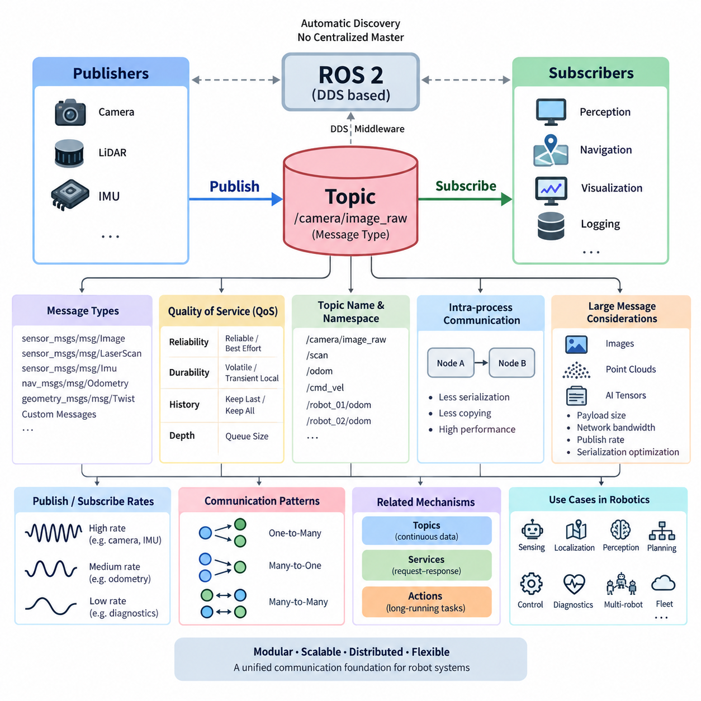
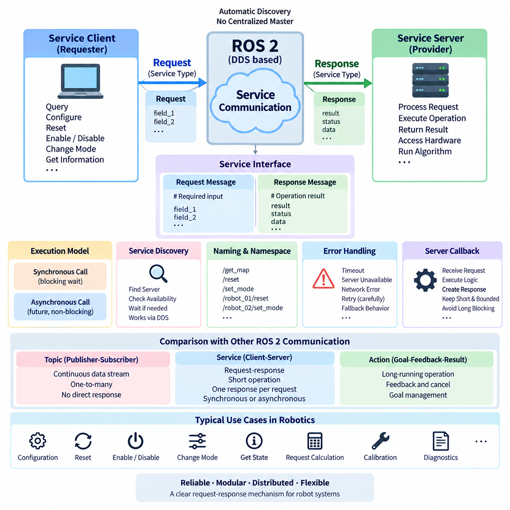
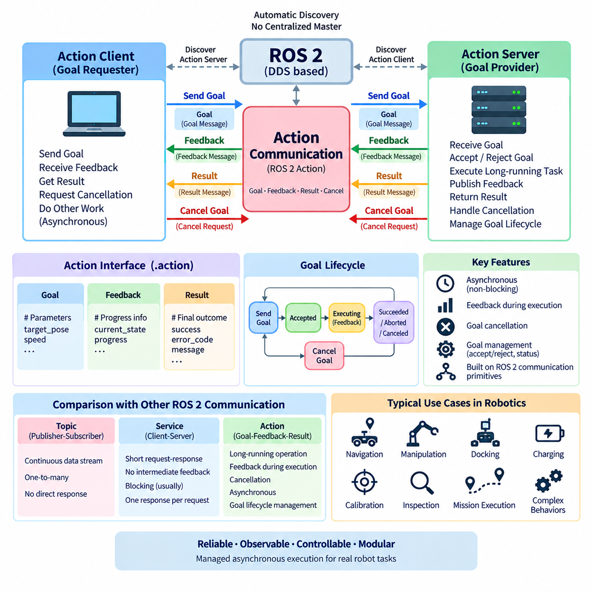
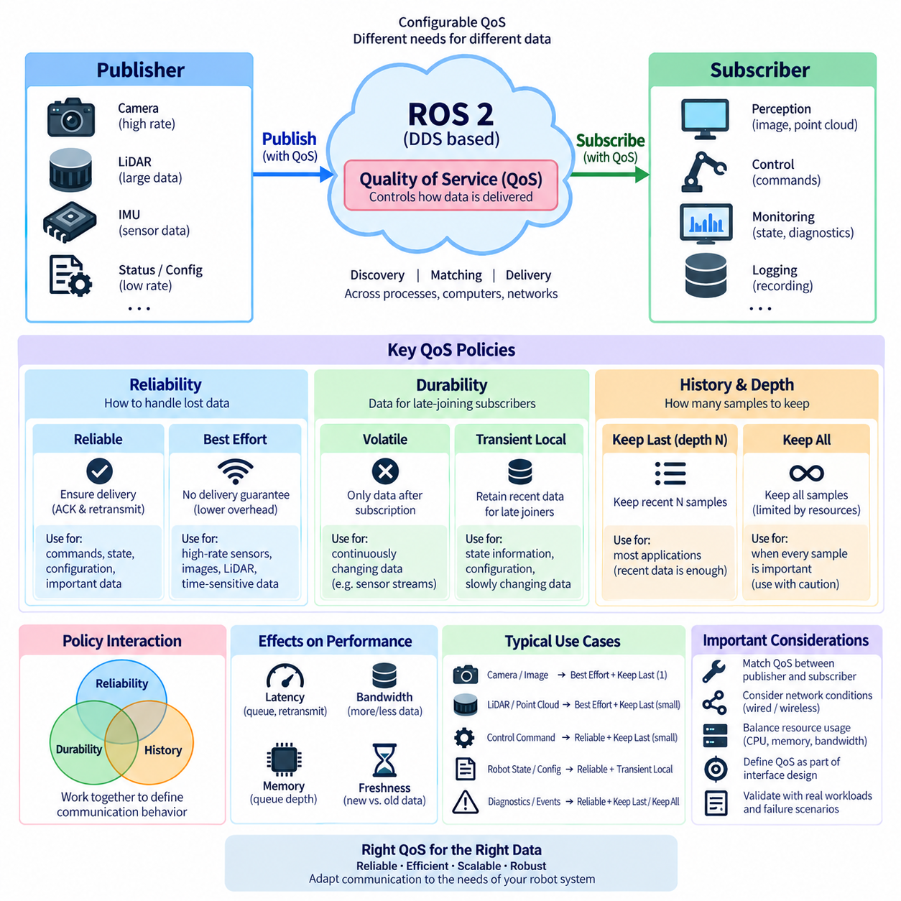
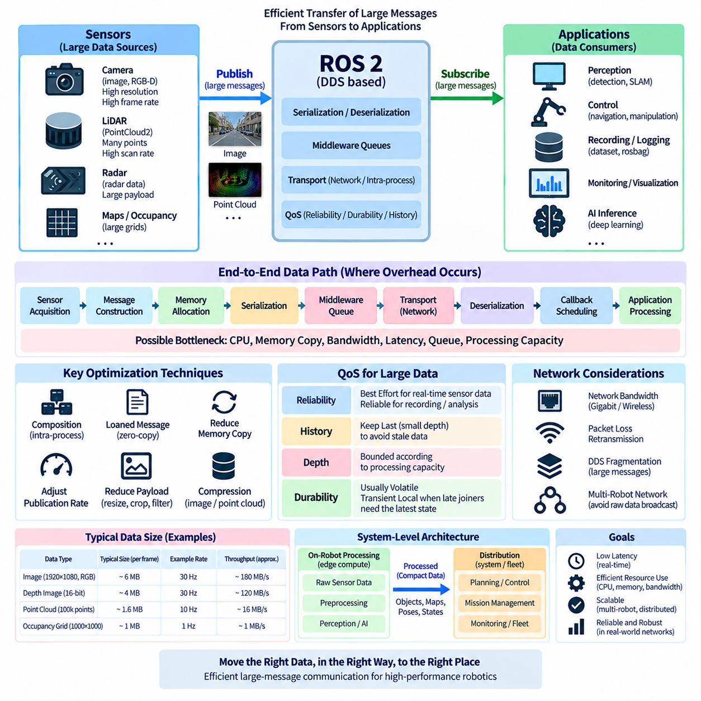
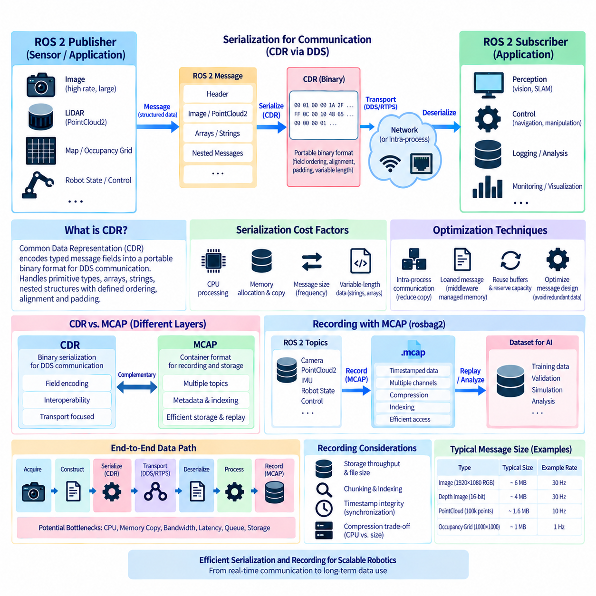
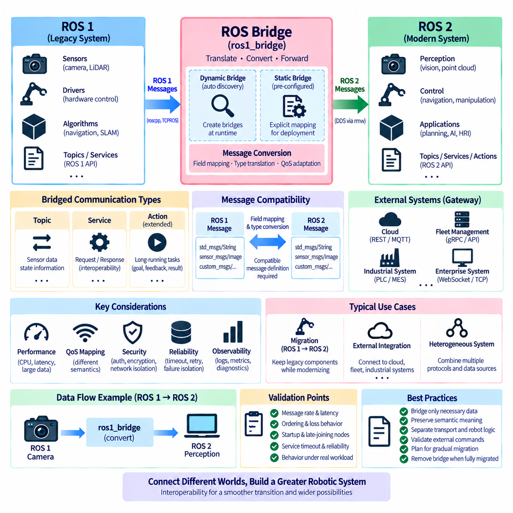
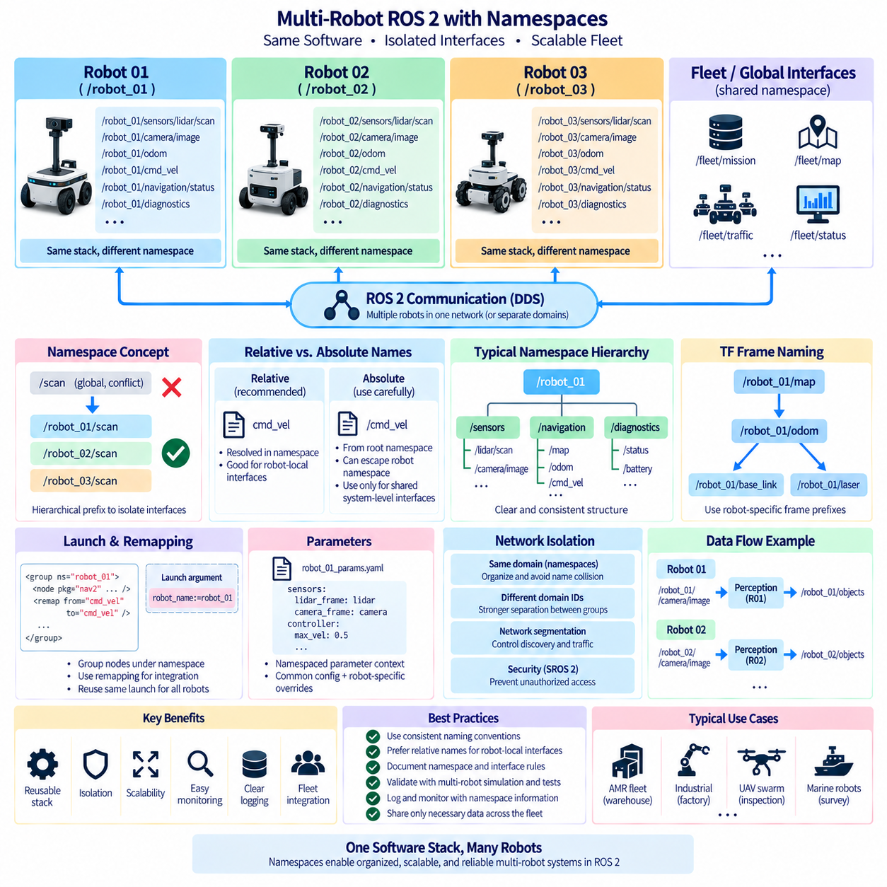
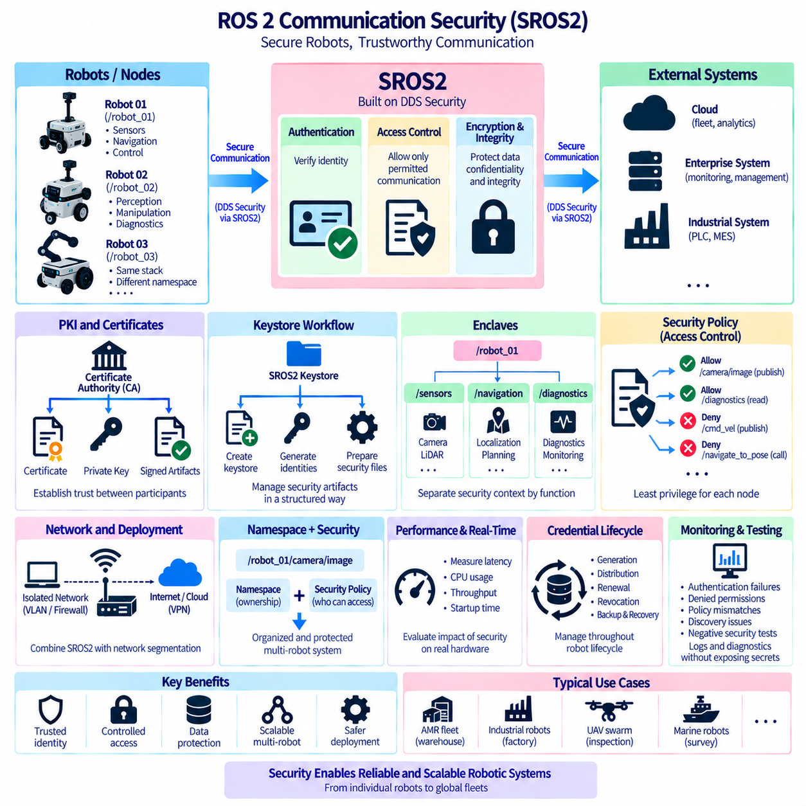
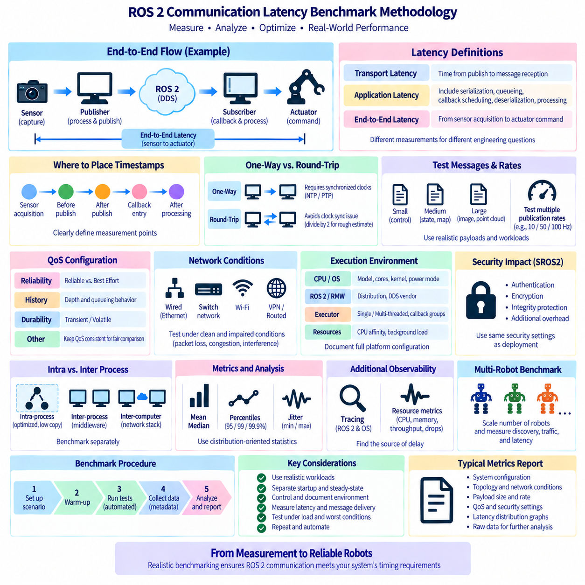

**Volume 05 Robot Middleware and ROS2**

# 04. ROS2 Communication

## 04.01 Topic Communication: Publisher / Subscriber Pattern [w/Code]

{width="7.268055555555556in" height="7.268055555555556in"}

ROS 2 topic communication is the primary mechanism for continuously exchanging data between distributed nodes. It follows the publisher--subscriber pattern, in which a publisher produces typed messages on a named topic while one or more subscribers independently receive them. This loose coupling allows sensing, perception, planning, control, diagnostics, and visualization components to evolve without direct dependencies between individual nodes.

Unlike a direct function call, topic communication does not require the publisher to know which nodes consume its data. A camera driver may publish image frames while perception, recording, visualization, and monitoring nodes subscribe simultaneously. The publisher continues operating even when subscribers are added or removed, making the pattern particularly suitable for modular robot architectures whose software components may be deployed across different processes or computers.

Every ROS 2 topic is associated with a defined message type that establishes the data contract between publishers and subscribers. Standard interfaces include messages such as \`sensor_msgs/msg/Image\`, \`sensor_msgs/msg/LaserScan\`, \`sensor_msgs/msg/Imu\`, \`nav_msgs/msg/Odometry\`, and \`geometry_msgs/msg/Twist\`. Applications can also define custom message types when domain-specific information must be exchanged, allowing interfaces to remain explicit and strongly structured.

A publisher is created by a ROS 2 node with a topic name, message type, and Quality of Service configuration. During execution, the node constructs a message, populates its fields, and invokes the publish operation. Publishing is conceptually asynchronous: the application does not normally wait for subscribers to finish processing the message. This property enables sensor and control pipelines to continue producing data according to their own execution schedules.

A subscriber registers a callback associated with the same topic and compatible message type. When incoming data becomes available, the ROS 2 executor schedules the corresponding callback according to the node\'s execution configuration. The callback can then perform filtering, state estimation, perception, visualization, logging, or other processing. Consequently, communication behavior is closely related to executor design, callback groups, and concurrency mechanisms discussed in node architecture.

ROS 2 topic communication is implemented through the ROS middleware abstraction layer and commonly uses DDS-based publish--subscribe communication underneath. ROS 2 therefore avoids requiring a centralized ROS master for ordinary topic discovery and data exchange. Participating endpoints discover compatible publishers and subscribers through middleware mechanisms, after which communication can occur locally or across a network according to the selected middleware implementation and configuration.

Quality of Service, or QoS, is fundamental to the publisher--subscriber relationship because communication compatibility involves more than matching topic names and message types. Reliability determines whether delivery is attempted reliably or on a best-effort basis, while durability influences whether previously published data can be available to later subscribers. History and depth determine how samples are retained when producers and consumers operate at different rates.

The correct QoS configuration depends strongly on the semantics of the data. High-rate camera, LiDAR, or other sensor streams may favor best-effort delivery because receiving the newest sample can be more valuable than retransmitting an obsolete one. Configuration or state information may instead require reliable delivery and appropriate durability. ROS 2 therefore allows communication behavior to be adapted to different robotic workloads without changing the fundamental topic abstraction.

Topic frequency is another important architectural property. A mobile robot may publish camera images at tens of frames per second, IMU measurements at hundreds of hertz, localization estimates at a lower rate, and diagnostic information much less frequently. Publishers should avoid transmitting unnecessary data because serialization, middleware processing, network transfer, deserialization, callback execution, and memory operations collectively consume CPU, memory bandwidth, and network capacity.

Topic names provide a logical addressing mechanism for robot data flows. Names such as \`/camera/image_raw\`, \`/scan\`, \`/odom\`, or \`/cmd_vel\` express the role of each communication channel independently of the physical location of its publishers and subscribers. Namespaces and remapping extend this mechanism, enabling reusable nodes to be instantiated for different robots, sensors, or subsystems without modifying their source code.

This abstraction becomes especially important in multi-robot systems. Instead of allowing every robot to publish indistinguishable global topic names, namespaces can organize communication into structures such as \`/robot_01/odom\` and \`/robot_02/odom\`. Fleet-level software can selectively subscribe to relevant information while robot-local components operate within their own namespace. The volume structure therefore treats multi-robot namespace design as a dedicated communication topic later in the chapter.

ROS 2 also supports communication between nodes running in the same process. When composition and intra-process communication are enabled appropriately, message transfer can avoid some serialization and copying operations that would otherwise occur through conventional inter-process middleware paths. This is valuable for high-bandwidth perception pipelines in which large images, point clouds, or AI inference tensors pass rapidly between tightly connected processing stages.

Large messages require particular attention because communication cost grows with payload size and publication rate. Image streams and three-dimensional point clouds can quickly dominate network bandwidth and memory traffic. Robot architects therefore need to consider message representation, transport topology, publication frequency, QoS, intra-process communication, and unnecessary data duplication. The chapter structure consequently separates large-message transfer and serialization optimization into dedicated sections.

Publisher and subscriber rates do not have to be identical. A publisher can produce data faster than a subscriber processes it, causing queued samples to accumulate or older samples to be discarded according to the configured history and depth policies. Conversely, a subscriber may spend much of its time waiting when data arrives slowly. Designing a stable ROS 2 system therefore requires understanding both communication frequency and callback processing capacity.

The publisher--subscriber model naturally supports one-to-many, many-to-one, and many-to-many data flows. A single localization publisher can feed navigation, visualization, monitoring, and logging nodes, while multiple distributed sensors can publish information consumed by fusion components. This scalability is one reason topics are well suited to continuous state and sensor streams, whereas services and actions address different interaction semantics elsewhere in the ROS 2 communication architecture.

Topics should not be treated as a universal replacement for every software interaction. They are most appropriate when data represents an ongoing stream or asynchronously changing state and when the producer does not require an immediate response from a specific consumer. Request--response operations are better represented by services, while long-running tasks requiring feedback, progress monitoring, and cancellation are generally represented by actions. These mechanisms complement rather than replace topics.

Operational debugging begins by observing the ROS graph and topic behavior. ROS 2 command-line tools can list available topics, inspect message types, display published messages, measure publication frequency, and examine communication characteristics. These observations help identify incorrect topic names, missing publishers, incompatible message types, unexpected rates, QoS mismatches, and overloaded processing pipelines before deeper middleware or network diagnostics become necessary.

In production robots, topic design becomes an architectural contract rather than merely a programming convenience. Stable message definitions, predictable naming conventions, appropriate QoS profiles, controlled publication rates, clear ownership, and measurable latency make distributed components easier to integrate and maintain. Poorly designed topics can instead create hidden coupling, excessive bandwidth consumption, stale data processing, and difficult-to-diagnose behavior across the robot software stack.

For autonomous mobile robots and Physical AI systems, topic communication forms the continuous information fabric connecting sensors, localization, perception, world representation, AI inference, planning, control, diagnostics, and fleet interfaces. A well-designed publisher--subscriber architecture allows these components to remain independently deployable while participating in a coherent distributed system, providing the communication foundation on which more advanced ROS 2 services, actions, security, and real-time mechanisms can be built.

## 04.02 Service Communication: Client / Server Sync Call [w/Code]

{width="7.268055555555556in" height="7.268055555555556in"}

ROS 2 service communication provides a request--response mechanism for interactions in which one node asks another node to perform a specific operation and return a defined result. The client sends a typed request to a named service, while the server processes that request and produces a typed response. This model is appropriate for discrete operations rather than the continuous data streams handled by topic-based publisher--subscriber communication.

A service interface defines both sides of the communication contract. Unlike a topic message, which represents a single data structure, a service definition contains a request section and a response section. The request specifies the information required to perform an operation, while the response represents its result, status, or returned data. This explicit interface allows independently implemented ROS 2 nodes to interact through a predictable and strongly typed software boundary.

The client represents the requesting side of the service pattern. It creates a request object according to the service type, populates the required fields, and sends the request to the service server. Conceptually, the client expects one response for each request. Typical robot operations include querying configuration information, resetting internal state, enabling a subsystem, requesting a calculation, changing an operating mode, or initiating a short deterministic operation.

The server represents the processing side and advertises a named service within the ROS 2 graph. When a request arrives, the server\'s callback receives the request data, executes the required logic, populates a response object, and returns the result. Separating the caller from the implementation allows the service provider to change its internal algorithms or hardware interaction while maintaining the same externally visible service interface.

Synchronous service calls express the familiar blocking request--response concept: the calling logic sends a request and waits until the corresponding response becomes available. This programming model can be straightforward because subsequent processing begins only after the requested result has been obtained. However, blocking must be used carefully in distributed robot software because communication, scheduling, server processing, or network delays can extend the waiting period unexpectedly.

ROS 2 execution architecture makes callback context especially important when synchronous behavior is required. A node waiting for a service result may depend on an executor to process the callback that completes that same request. Poor executor, callback-group, or threading design can therefore cause excessive blocking or deadlock-like behavior. Service communication must consequently be designed together with the callback groups, executors, and concurrency mechanisms introduced in the node architecture chapter.

For this reason, asynchronous service APIs are frequently useful even when the application logically requires synchronous sequencing. A client can issue a request and obtain a future representing the eventual response, allowing the executor to continue processing other callbacks. Application logic can later examine or wait for that future under controlled conditions. This separates the semantic requirement for a response from unnecessary blocking of the node\'s overall execution path.

Service discovery is handled through the ROS 2 middleware architecture. A client must locate a compatible server associated with the requested service name and type before useful communication can occur. Applications commonly check or wait for service availability before sending requests. This is important during robot startup because different nodes, hardware interfaces, containers, or distributed computers may become operational at different times.

Service names provide logical addressing in a manner similar to topic names. Namespaces and remapping can therefore be applied to service interfaces so that reusable components can operate within different robots or subsystems. A service such as a reset or mode-control interface can be instantiated independently under robot-specific namespaces. This becomes increasingly important when identical software components are deployed across multiple AMRs, manipulators, or other robotic platforms.

Services differ fundamentally from topics in communication semantics. Topics emphasize decoupled streaming and can naturally distribute the same data to many subscribers. Services establish a request--response transaction between a client and a server for a specific operation. A sensor measurement stream therefore belongs naturally on a topic, whereas requesting a map reset, querying a configuration value, or commanding a short configuration change can be more naturally represented by a service.

Services must also be distinguished from ROS 2 actions. A service is best suited to operations that can normally return a result within a reasonably short period and do not require continuous progress feedback. Actions are designed for long-running operations in which the requester may need intermediate feedback, goal management, or cancellation. Navigation to a distant pose, for example, generally fits the action model better than a blocking service transaction.

Request and response message design strongly affects maintainability. A service should expose the minimum information necessary to express the operation while returning enough information for the client to determine the outcome. Responses commonly include result data together with success, failure, or diagnostic information when appropriate. Clear semantics prevent clients from depending on undocumented server behavior and allow service implementations to evolve without unnecessary coupling.

Failure handling is essential because a distributed service invocation is not equivalent to an ordinary local function call. The server may not yet be available, a process may terminate, network communication may be interrupted, middleware discovery may be incomplete, or processing may take longer than expected. Client logic should therefore account for availability, timeout behavior, error reporting, retries where appropriate, and safe fallback behavior rather than assuming that every request succeeds.

Retry policies require particular care in robotic systems. Repeating a read-only query may be harmless, but automatically repeating a request that changes hardware state can execute an operation more than once. Service semantics should therefore make it clear whether an operation is idempotent, state-changing, or unsafe to repeat. When physical actuators are involved, communication recovery must never be designed independently of system state and safety requirements.

Service callback execution time also influences the responsiveness of the ROS 2 node. A callback that performs lengthy computation, waits indefinitely for hardware, or invokes another blocking dependency can occupy executor resources and delay unrelated callbacks. Short and bounded service processing is generally easier to integrate into responsive distributed systems. Longer operations should be reconsidered as asynchronous workflows, actions, state machines, or independently scheduled tasks.

The ROS 2 command-line interface provides practical mechanisms for inspecting service communication. Developers can discover available services, examine their interface types, inspect service definitions, and manually issue requests during integration and debugging. These capabilities help determine whether a server is visible, whether the expected service type is being used, and whether request and response behavior agrees with the intended software interface.

In a production robot, services often form a management and command layer around continuously operating topic pipelines. Perception and localization nodes may exchange runtime data through topics while exposing services for reset, configuration, calibration, or state queries. This combination preserves the efficiency and loose coupling of streaming communication while providing explicit transactional interfaces for operations that require a definite request and corresponding result.

Service interfaces should nevertheless remain separate from hard real-time control paths whenever blocking or nondeterministic communication could compromise timing guarantees. A motor-control loop operating at hundreds of hertz should not depend on an unpredictable network service transaction for each control cycle. Services are better suited to supervisory operations, configuration changes, initialization, diagnostics, and other interactions whose timing requirements are compatible with distributed middleware behavior.

For autonomous robots and Physical AI systems, client--server services complement topic communication by providing explicit transactional boundaries between distributed components. When service types, namespaces, executor behavior, timeout handling, failure semantics, and operation duration are designed consistently, ROS 2 services provide a clean mechanism for coordinating short request--response interactions while leaving continuous data exchange and long-running tasks to topics and actions respectively.

## 04.03 Action Communication: Long-Running Async Tasks [w/Code]

{width="7.268055555555556in" height="7.268055555555556in"}

ROS 2 action communication is designed for long-running operations that cannot be represented effectively as a continuous topic stream or a short request--response service transaction. An action allows a client to submit a goal to an action server, receive intermediate feedback while the operation is executing, obtain a final result, and request cancellation when necessary. This makes actions particularly suitable for navigation, manipulation, docking, calibration, and complex robot behaviors.

The action communication model is organized around three fundamental data elements: goal, feedback, and result. The goal describes what the client wants the server to accomplish, feedback reports intermediate execution information, and the result describes the final outcome. Together, these elements provide a structured asynchronous interaction model in which the requester can observe and influence an operation throughout its execution rather than simply waiting for completion.

An action interface defines these communication elements as a single software contract. The goal section contains parameters required to initiate the task, the result section contains information returned when execution finishes, and the feedback section defines data periodically reported during execution. This explicit structure allows independently developed nodes to agree on task semantics while keeping implementation details hidden behind a stable ROS 2 interface.

The action client represents the component requesting execution of a task. It constructs a goal according to the action type and sends that goal to an action server. Instead of blocking until the entire operation completes, the client can continue processing other events while monitoring goal acceptance, feedback, completion, or cancellation. This asynchronous behavior is essential when robot tasks may require seconds, minutes, or potentially much longer execution periods.

The action server receives goals and determines whether they should be accepted or rejected. An accepted goal becomes an active operation whose execution is managed by the server. During execution, the server can periodically publish feedback describing progress or current state. When processing finishes, it produces a result and terminates the goal with an appropriate status, allowing the client to distinguish successful completion from cancellation, abortion, or other outcomes.

Goal management is a major difference between actions and ordinary service communication. A service request represents a comparatively short transaction, whereas an action goal has a lifecycle that persists during execution. The system must therefore track goal identity, acceptance, execution state, cancellation requests, and terminal status. This lifecycle enables distributed robot components to coordinate tasks whose progress cannot be represented adequately by a single request followed immediately by a response.

Feedback provides visibility into the internal progress of a long-running task without exposing the server\'s complete implementation. A navigation action can report remaining distance or other progress information, while a manipulator action may report execution state or trajectory progress. Feedback allows supervisory software, user interfaces, behavior managers, and other nodes to monitor execution and react to changing conditions before the final result becomes available.

Cancellation is another defining capability of the action model. A client may determine that an active goal is no longer required because the mission has changed, an obstacle has appeared, a higher-priority command has arrived, or a safety condition requires interruption. The client can request cancellation, after which the server determines how to terminate the operation safely. Cancellation therefore requires application-level handling rather than simply terminating a callback or process.

Actions are asynchronous by nature because long-running robot behavior should not prevent a node from processing unrelated communication. Goal submission, feedback reception, cancellation, and result processing are commonly integrated with ROS 2 executors and callbacks. Correct executor and callback-group design remains important because computationally expensive execution or blocking callbacks can delay feedback, cancellation handling, sensor processing, or other communication occurring within the same process.

The action server should normally separate communication handling from the actual long-running workload. If a goal callback directly performs a lengthy operation while monopolizing an executor thread, responsiveness can deteriorate significantly. A more scalable architecture accepts the goal, establishes execution state, and performs the workload through an appropriate asynchronous execution path while allowing ROS 2 callbacks to continue processing communication and lifecycle events.

Action communication is built on ROS 2 communication primitives rather than existing as an entirely separate transport mechanism. At the application level, developers work with goal, feedback, result, and cancellation semantics, while ROS 2 manages the underlying communication required to coordinate them. This abstraction provides a task-oriented interface without requiring application code to manually construct multiple independent communication channels for every long-running operation.

Action names, like topic and service names, participate in the ROS 2 naming and namespace system. A navigation action may therefore exist under robot-specific namespaces in a multi-robot deployment. Namespaces allow identical action server implementations to run on multiple AMRs, manipulators, quadrupeds, or humanoids while remaining logically separated. Fleet or mission-level software can then address the appropriate robot and submit goals without modifying the underlying action implementation.

Actions should be selected according to interaction semantics rather than simply because an operation is computationally complex. Topics are appropriate for continuous asynchronous data streams, and services are appropriate for relatively short request--response interactions. Actions are appropriate when an operation has meaningful duration and benefits from explicit goal management, progress feedback, final results, or cancellation. Maintaining this distinction produces clearer and more predictable ROS 2 interfaces.

Navigation is one of the most representative uses of ROS 2 actions. A client can submit a destination pose as a goal, while the navigation system performs localization-aware path planning, obstacle avoidance, trajectory execution, and recovery behavior over an extended period. During execution, feedback can expose progress, and the goal can be canceled or replaced when mission requirements change. The final result then communicates the terminal outcome to the requesting component.

Manipulator control provides another important use case. A higher-level node may request execution of a trajectory, movement to a target pose, or completion of a manipulation behavior. Such operations take measurable time and may need to be interrupted if perception changes or a safety condition occurs. An action interface allows motion execution to remain encapsulated while exposing the control points needed by planning, supervision, and mission-management software.

Autonomous mobile robots also use actions for docking, charging, inspection, and mission-level behaviors. A docking operation may include searching for the station, alignment, approach, contact verification, and charging confirmation. Representing the entire procedure as a blocking service would provide little visibility during execution. An action can instead maintain a persistent goal while reporting intermediate progress and supporting controlled cancellation or failure recovery.

Failure handling must account for the distributed and stateful nature of action execution. A goal may be rejected before execution, aborted after execution begins, canceled by the client, or interrupted by failures in hardware, communication, perception, or planning. The final status and result should communicate enough information for higher-level software to determine the next step. Mission logic can then retry, select an alternative behavior, enter a safe state, or escalate the failure.

Multiple goals require explicit policy decisions. Depending on the application, an action server may allow concurrent goals, reject new goals while one is active, or replace a previous goal with a newer one. The correct strategy depends on resource ownership and task semantics. A mobile base, for example, generally cannot execute independent conflicting navigation commands simultaneously, whereas other servers may safely process multiple logically independent operations.

Action interfaces also create useful boundaries between mission-level intelligence and lower-level execution. A behavior planner, task manager, or Physical AI agent can express an intended goal without controlling every intermediate actuator command. The action server translates that goal into an execution procedure and continuously reports progress. This separation supports hierarchical robot architectures in which high-level reasoning and low-level execution operate at different timescales.

For production robotics, action design should define goal semantics, acceptance rules, feedback content, cancellation behavior, terminal states, timeout expectations, and resource ownership clearly. Ambiguous action behavior can create difficult integration failures because long-running tasks interact with changing robot state over time. Well-defined action contracts allow navigation, manipulation, docking, inspection, and autonomous behaviors to remain modular while still being observable and controllable.

In autonomous robots and Physical AI systems, ROS 2 actions complete the communication model formed by topics and services. Topics provide continuous data distribution, services provide short transactional request--response operations, and actions provide managed asynchronous execution for long-running tasks. Together, these mechanisms allow distributed robot software to separate streaming information, immediate transactions, and persistent goal-oriented behavior into communication patterns suited to their actual operational semantics.

## 04.04 QoS Deep Dive: Reliability, Durability, History [w/Code]

{width="7.268055555555556in" height="7.268055555555556in"}

ROS 2 Quality of Service, or QoS, defines how data is delivered between publishers and subscribers rather than merely what data is exchanged. QoS policies allow communication behavior to be adapted to sensor streams, control commands, state information, diagnostics, and distributed robot workloads. Among these policies, reliability, durability, and history are especially important because they directly determine delivery guarantees, retained samples, and queue behavior.

QoS exists because robotic communication channels have very different requirements. A camera publishing high-rate images may prioritize fresh data and low latency, while a configuration or system-state publisher may require stronger delivery guarantees. Applying the same communication policy everywhere can waste bandwidth, increase latency, or cause unnecessary retransmission. ROS 2 therefore exposes middleware communication characteristics through configurable QoS profiles.

Reliability determines how ROS 2 handles message delivery when packets are lost or communication conditions deteriorate. The two principal reliability policies are Reliable and Best Effort. Reliable communication attempts to ensure that samples reach compatible subscribers, potentially using acknowledgment and retransmission mechanisms provided by the underlying middleware. Best Effort sends data without requiring the same delivery guarantee, favoring lower communication overhead and timely transmission.

Reliable QoS is appropriate when losing information may affect application correctness. Commands, important state transitions, configuration information, or low-rate data that must be processed consistently can benefit from reliable delivery. However, reliability does not make a distributed system failure-proof. Network interruption, process termination, exhausted resources, or incompatible QoS configurations can still prevent communication, so application-level fault handling remains necessary.

Best Effort QoS is particularly useful for high-frequency sensor streams where the newest sample is more valuable than an older sample that was lost in transit. Camera images, LiDAR scans, or rapidly changing measurements may become obsolete quickly. Retransmitting stale data can increase congestion and latency without improving robot behavior. Best Effort communication therefore often provides a practical balance for perception pipelines operating over constrained or variable networks.

The choice between Reliable and Best Effort should consider publication frequency, payload size, network quality, acceptable loss, and the semantic value of individual samples. A low-rate command channel and a high-bandwidth image stream may require completely different policies even though both use ROS 2 topics. QoS should therefore be treated as part of interface design rather than as a middleware setting selected only after software integration.

Durability determines whether data should remain available for subscribers that join after publication. Volatile durability provides only data generated while communication endpoints are participating in the current exchange. A late-joining subscriber does not automatically receive earlier samples. This behavior is suitable for continuously changing information where historical values have little value once newer data becomes available.

Transient Local durability allows a publisher to retain samples so that compatible subscribers joining later can receive previously published information according to the configured history and resource limits. This behavior is useful for information representing persistent or slowly changing state. A subscriber starting after initialization may need the latest relevant state rather than waiting indefinitely for the publisher to generate another identical update.

Durability should not be confused with permanent database storage. Transient Local behavior is associated with middleware communication and the lifetime and resources of participating entities; it is not a substitute for persistent logging, databases, rosbag recording, or fault-tolerant storage. Robot architects should distinguish communication-level sample retention from long-term data persistence when designing state recovery and system restart behavior.

History controls how samples are retained when publishers and subscribers operate at different rates. Keep Last stores a limited number of recent samples, while Keep All attempts to preserve all samples subject to middleware resource limits. Keep Last is commonly paired with a depth value that specifies the size of the retained queue. Together, history and depth determine how much temporary backlog can accumulate.

A Keep Last depth of one emphasizes the newest state because an older queued value can be replaced by a newer one before processing. Larger depths provide additional buffering when callbacks temporarily fall behind publication. However, increasing depth is not automatically beneficial. Deep queues consume memory and may cause subscribers to process stale information long after it has lost operational value, particularly in fast perception and control pipelines.

Keep All can be appropriate when every sample has semantic importance, but it requires careful resource management. If a producer generates data faster than the consumer can process it, retained samples can grow until middleware limits are reached. In a robot system with bounded CPU and memory, an apparently lossless queue can therefore create latency or resource pressure. Communication requirements must be balanced against processing capacity.

Reliability, durability, and history interact rather than operating as completely independent choices. A Reliable publisher with deep history may preserve and retransmit more information but can consume greater bandwidth and memory. A Best Effort publisher with shallow Keep Last history can prioritize freshness and bounded resource usage. A Transient Local publisher combines retained state with late-joining subscriber behavior, making history configuration especially significant.

QoS compatibility between publishers and subscribers is essential. Matching a topic name and message type does not guarantee successful communication when requested and offered QoS policies are incompatible. A publisher offers communication characteristics, while a subscriber requests characteristics it can accept. ROS 2 and the underlying DDS middleware evaluate these policies when establishing communication between endpoints, making QoS mismatch an important source of integration failures.

This compatibility model becomes particularly important when integrating independently developed ROS 2 packages. A sensor driver may use a QoS profile optimized for streaming measurements while a custom subscriber may be created with assumptions appropriate to reliable application data. Both nodes can appear in the ROS graph yet fail to exchange samples as expected. Developers should therefore inspect endpoint QoS settings during communication debugging.

ROS 2 provides predefined QoS profiles and configurable policy combinations for common communication patterns. Sensor-oriented communication generally favors freshness and bounded queues, while other interfaces may emphasize reliability or retained state. These profiles provide useful starting points, but production systems should validate them against actual message rates, payload sizes, processing delays, network topology, and failure conditions rather than assuming one profile is universally appropriate.

Network characteristics strongly influence practical QoS behavior. On a stable wired network, Reliable communication may impose acceptable overhead, while wireless links with packet loss or variable latency can cause retransmissions and queue buildup. Large camera images or point clouds amplify these effects. QoS selection must therefore consider not only ROS 2 software architecture but also Ethernet, Wi-Fi, shared bandwidth, middleware configuration, and deployment topology.

QoS also influences end-to-end latency. A deep history queue can preserve data while simultaneously increasing the age of information processed by a slow subscriber. Reliable retransmission can improve delivery completeness while increasing latency under packet loss. Best Effort can reduce retransmission pressure but permit missing samples. For autonomous robots, the correct optimization target is often useful and timely information rather than maximum delivery completeness alone.

Diagnostics should examine both message transport and application behavior. Topic frequency, bandwidth, callback processing time, dropped samples, queue depth, and endpoint QoS configuration provide complementary evidence. When a subscriber receives no data or experiences unexpected delays, developers should check topic and message compatibility together with reliability, durability, history, depth, network conditions, and executor behavior before attributing the problem to a single layer.

QoS design becomes more complex in multi-robot and distributed Physical AI systems because communication may cross processes, computers, network segments, wireless links, and fleet infrastructure. High-bandwidth perception data may remain local to a robot while compact state information is distributed more broadly. Selecting QoS according to data semantics and communication scope helps prevent unnecessary network traffic while preserving information required for coordination and supervision.

Production ROS 2 systems should define QoS as part of each interface contract. Documentation should identify why a channel uses Reliable or Best Effort delivery, whether late-joining subscribers require retained samples, and how much history is operationally meaningful. Explicit QoS contracts reduce integration ambiguity and make performance testing reproducible across sensors, compute platforms, middleware implementations, and network configurations.

Reliability, durability, and history ultimately represent different dimensions of communication intent. Reliability asks how strongly delivery should be attempted, durability asks whether earlier information should remain available to later participants, and history asks how many samples should be retained while communication proceeds. Understanding these distinctions allows ROS 2 architects to design communication channels according to the actual temporal and operational meaning of robot data.

## 04.05 Large Message Transfer: Image / PointCloud Optimization [w/Code]

{width="7.268055555555556in" height="7.268055555555556in"}

Large-message transfer is a major performance concern in ROS 2 because robotics applications frequently exchange images, depth maps, point clouds, radar data, occupancy grids, and AI-related tensors whose payloads are much larger than ordinary control or state messages. The communication architecture must therefore consider not only message correctness but also serialization cost, memory copying, bandwidth consumption, latency, and receiver processing capacity.

A camera illustrates the scale of the problem. An uncompressed image contains width × height × channels × bytes-per-channel data, and the resulting payload is multiplied by the frame rate. Multiple cameras can therefore generate hundreds of megabytes per second before protocol overhead is considered. High-resolution RGB-D systems further increase traffic because color images and depth measurements may be transmitted simultaneously through separate ROS 2 topics.

Three-dimensional LiDAR creates a different but similarly demanding workload. A \`sensor_msgs/msg/PointCloud2\` message can contain large numbers of points with coordinates, intensity, timestamps, ring identifiers, semantic labels, or additional application-specific fields. Higher sensor resolution and scan frequency increase both message size and publication rate. When several perception nodes subscribe independently, memory movement and serialization overhead can become as important as raw network bandwidth.

Large-message performance should be analyzed as an end-to-end data path rather than only as network transmission. A typical path includes sensor acquisition, message construction, memory allocation, serialization, middleware queues, transport, deserialization, callback scheduling, and application processing. Any stage can become the dominant bottleneck. Optimizing Ethernet bandwidth alone may therefore provide little improvement when repeated memory copies or slow subscribers dominate total latency.

Serialization converts ROS 2 message structures into a representation suitable for middleware transport, while deserialization reconstructs them at the receiver. For small messages this cost may be negligible, but large images and point clouds can make serialization a significant CPU and memory-bandwidth workload. The cost becomes more visible when one large message must be independently serialized, copied, or delivered to several consumers at high frequency.

Memory copying is particularly important in perception pipelines. A camera frame may move from a device driver buffer into a ROS message, through middleware storage, into a subscriber buffer, and finally into an image-processing or AI inference framework. Repeated copies increase memory bandwidth consumption and latency while producing no additional information. Large-message optimization therefore attempts to reduce unnecessary ownership transitions and data duplication wherever the architecture permits.

ROS 2 composition can reduce this overhead when communicating nodes can execute inside the same process. Components placed in a shared process can use intra-process communication mechanisms that avoid portions of the conventional inter-process data path. When message ownership and API usage permit, data can be passed with fewer copies. This is especially valuable for tightly coupled pipelines such as camera acquisition, preprocessing, perception, and local visualization.

Loaned-message and zero-copy-oriented mechanisms can further reduce memory movement when supported by the selected ROS 2 middleware, message path, and platform. Instead of repeatedly allocating and copying a large payload, middleware-managed memory can potentially be used more directly. However, zero-copy behavior should never be assumed merely because an API exposes related concepts. Actual benefits depend on RMW implementation, DDS capabilities, transport configuration, and deployment topology.

Communication across processes or computers introduces different constraints. Intra-process optimizations cannot eliminate network transfer when publishers and subscribers execute on separate machines. The architecture must then consider physical link capacity, protocol overhead, packet loss, middleware fragmentation, retransmission behavior, operating-system buffers, and competing traffic. Gigabit Ethernet can become a practical limitation surprisingly quickly when multiple high-resolution sensors publish simultaneously.

DDS and RTPS may fragment payloads that exceed practical transport packet sizes. Large ROS 2 messages can therefore become many lower-level fragments whose delivery and reconstruction create additional processing and buffering requirements. Packet loss can be particularly expensive with reliable communication because missing information may trigger recovery or retransmission behavior. Large payloads consequently make QoS and network quality closely coupled to observed application latency.

QoS selection should reflect the temporal value of large sensor data. A camera subscriber performing real-time perception may prefer a shallow queue and Best Effort reliability because processing the newest image is more valuable than receiving an old frame after retransmission. A recording or analysis pipeline may have different requirements and prioritize completeness. The same underlying sensor data can therefore require different communication strategies according to the consumer\'s purpose.

History depth must also remain bounded according to realistic processing capacity. If a camera publishes faster than a perception node can process, a deep queue does not solve the computational deficit; it merely stores increasingly stale frames. For real-time robotic perception, keeping only a small number of recent samples often provides more useful behavior. Queue depth should be chosen according to acceptable data age, callback execution time, and temporary processing jitter.

Reducing publication rate is one of the simplest optimization techniques when downstream components do not require every sensor sample. A camera operating at 60 frames per second does not imply that every consumer needs 60 Hz data. Mapping, visualization, monitoring, AI inference, and logging may operate at different effective rates. Separating these requirements prevents high-rate raw streams from propagating unnecessarily through the complete robot software architecture.

Payload reduction provides another optimization dimension. Images may be resized, cropped to a region of interest, converted to a lower-cost representation, or compressed when the resulting processing and quality trade-offs are acceptable. Point clouds can be filtered, downsampled, cropped spatially, or transformed into more task-specific representations. Such optimization is most effective when unnecessary information is removed near the source rather than after expensive transport.

Compression reduces communication bandwidth at the cost of additional computation and often additional latency. Compressed image transport can be useful across constrained networks, but local GPU perception pipelines may prefer uncompressed or hardware-friendly formats to avoid encode-decode overhead. Point-cloud compression presents similar trade-offs. The correct choice depends on whether the limiting resource is network bandwidth, CPU/GPU processing, memory bandwidth, storage capacity, or latency.

Robot architectures should distinguish local high-bandwidth data from information that genuinely needs system-wide distribution. Raw camera and LiDAR streams may remain within an edge-compute perception domain, while derived objects, tracks, occupancy information, localization states, or compact semantic representations are distributed to planning and fleet systems. This hierarchical approach prevents expensive sensor payloads from becoming global communication dependencies.

Multi-robot systems amplify the importance of this separation. Broadcasting raw sensor streams from every robot across a shared wireless network can consume available capacity rapidly and degrade communication needed for coordination or safety-related state exchange. Robot-local perception should therefore process large data close to its source whenever possible, while fleet communication carries compact mission, state, diagnostic, and coordination information appropriate to the wider network scope.

Subscriber architecture also affects performance because every consumer adds processing demand. Visualization, recording, diagnostics, perception, and debugging tools can unintentionally compete for the same CPU, memory, and network resources. A system that performs well with one subscriber may behave differently when several tools are attached. Performance validation should therefore reproduce realistic production subscriber counts rather than measuring only an isolated publisher-to-subscriber pair.

Monitoring must include message size, publication frequency, effective bandwidth, end-to-end latency, CPU utilization, memory consumption, queue behavior, dropped samples, and subscriber processing time. These measurements help distinguish transport bottlenecks from application bottlenecks. ROS 2 topic inspection, tracing, middleware diagnostics, operating-system monitoring, and network analysis can be combined to identify where large-message latency is actually introduced.

Optimization should be validated under realistic failure and congestion conditions rather than only on an idle laboratory network. Wireless degradation, packet loss, simultaneous sensor activity, recording workloads, AI inference, and multiple subscribers can expose behavior that is invisible in simple tests. Reliable communication may accumulate retransmission pressure, queues may grow, and processing latency may increase even though average bandwidth appears acceptable during nominal operation.

Large-message transfer is ultimately an architectural problem rather than a single ROS 2 parameter to tune. Efficient systems combine appropriate message representations, bounded QoS queues, suitable reliability, composition, intra-process communication, reduced copying, controlled publication rates, payload reduction, and network-aware deployment. These techniques allow images and point clouds to remain useful inputs to high-performance perception without overwhelming the communication infrastructure.

For autonomous robots and Physical AI systems, the preferred architecture keeps high-volume raw perception data close to the computation that consumes it and distributes increasingly compact information toward planning, control, mission management, and fleet layers. Treating bandwidth, memory movement, serialization, latency, and data freshness as a unified design problem enables ROS 2 communication to scale from individual sensors to complex multi-computer and multi-robot systems.

## 04.06 Serialization Optimization: CDR / MCAP [w/Code]

{width="7.268055555555556in" height="7.268055555555556in"}

ROS 2 serialization is the process of converting structured message data into a byte representation that can be transported, stored, or reconstructed by another communication endpoint. Although serialization is largely hidden behind ROS 2 APIs, its cost becomes important for high-frequency and large-payload workloads. Images, point clouds, maps, and recorded sensor streams can make serialization, memory allocation, copying, and storage throughput significant parts of total system latency.

ROS 2 commonly operates through DDS-based middleware, where message data is represented for transport using the Common Data Representation, or CDR, serialization model. CDR defines how typed fields such as integers, floating-point values, arrays, strings, and nested structures are encoded into a portable binary representation. This allows distributed endpoints with compatible interfaces to reconstruct equivalent message structures while hiding machine-specific memory layouts.

CDR serialization must consider field ordering, alignment, padding, variable-length data, and nested message structures. Primitive values can often be encoded efficiently, while strings, sequences, and dynamically sized arrays introduce additional processing and memory-management requirements. Consequently, two ROS 2 messages containing similar amounts of useful information can exhibit different serialization costs depending on how their interfaces and variable-length fields are structured.

For small control messages, serialization overhead is generally minor compared with application processing and communication latency. The situation changes with \`sensor_msgs/msg/Image\`, \`sensor_msgs/msg/PointCloud2\`, occupancy grids, and other data-intensive interfaces. Repeated serialization of megabyte-scale messages at tens of hertz can consume measurable CPU time and memory bandwidth, particularly when the same data is delivered to multiple subscribers or crosses process boundaries.

Serialization cost is only one component of the complete data path. A message may first require allocation and construction, followed by serialization into middleware buffers, transport, deserialization, additional copying, and conversion into application-specific representations. Optimizing only the serializer can therefore leave the dominant bottleneck untouched. Performance engineering should measure the complete publisher-to-consumer path and identify where time and memory traffic are actually spent.

Message design can reduce serialization overhead by avoiding unnecessary data and excessive dynamic allocation. Large structures should contain information that consumers genuinely require, while redundant fields and repeated conversions should be minimized. Fixed or bounded representations can provide more predictable resource behavior when appropriate. However, interface optimization should preserve semantic clarity rather than producing obscure message formats solely to reduce a small amount of serialization work.

Memory allocation frequently interacts with serialization performance. Repeatedly allocating large buffers for every image or point cloud can increase CPU overhead, memory fragmentation, and latency variability. Reusing buffers, reserving capacity where APIs permit, and avoiding unnecessary intermediate representations can improve predictability. These techniques are particularly valuable in sustained sensor pipelines where essentially the same message structure is processed thousands of times during operation.

Intra-process communication can bypass portions of conventional serialization when compatible ROS 2 components execute within the same process. Rather than converting a message into a transport representation and immediately reconstructing it for another local component, ownership-aware transfer can reduce copying and serialization work. This makes composition especially useful for tightly coupled high-bandwidth pipelines such as camera acquisition, preprocessing, AI inference, and perception.

Loaned messages provide another optimization mechanism when supported by the ROS middleware implementation and transport path. Middleware-managed memory can allow publishers to populate buffers without creating as many intermediate copies, while compatible subscriber paths may further reduce movement of large payloads. The achievable benefit depends on RMW and DDS implementation details, message characteristics, operating system support, and whether communication remains local or crosses a network.

Zero-copy should therefore be treated as a deployment-dependent optimization rather than a universal ROS 2 guarantee. A pipeline described as zero-copy at one layer may still contain copies in a sensor driver, middleware boundary, network stack, accelerator interface, or application framework. Verification requires measurement of the actual deployed data path. Architectural documentation should distinguish theoretical zero-copy capability from demonstrated end-to-end copy reduction.

Serialization requirements change when communication crosses computer boundaries. Data must ultimately be represented in a form suitable for network transport, and large serialized payloads may be fragmented by the middleware and transport protocols. At this point, CPU serialization cost interacts with network bandwidth, packetization, QoS reliability, retransmission, and buffering. Optimizing message representation can therefore improve both processor utilization and network efficiency.

Recording introduces another serialization-related path because ROS 2 messages may also be written to persistent storage for debugging, validation, dataset construction, and later replay. High-rate cameras, LiDARs, IMUs, and robot-state topics can generate large recording workloads. Storage format, indexing strategy, compression, disk throughput, and metadata organization then become part of communication performance rather than merely offline data-management concerns.

MCAP is a container format designed for storing timestamped multimodal data and is widely applicable to robotics logging workflows. It can organize multiple channels and message schemas within a single recording while supporting metadata and indexing needed for efficient access. In ROS 2 environments, MCAP can serve as a rosbag2 storage format, allowing heterogeneous topic streams to be recorded in a structured container for later inspection, replay, conversion, or analysis.

CDR and MCAP address different layers and should not be treated as competing serialization technologies. CDR primarily concerns the binary representation used to encode typed message data for middleware-oriented communication, while MCAP is a container format for organizing recorded messages, schemas, channels, timestamps, and related metadata. An MCAP recording can therefore contain ROS 2 message data whose serialized representation is associated with ROS middleware conventions.

This distinction is important when optimizing a recording pipeline. Changing the container format does not automatically eliminate the computational cost of creating serialized message data, and optimizing CDR transport does not solve storage indexing or disk-throughput limitations. A complete logging architecture should separately consider message serialization, transfer into the recording subsystem, container organization, compression, file writing, indexing, and subsequent replay requirements.

Compression can substantially reduce MCAP or rosbag storage requirements when recorded data contains compressible information, but compression consumes processing resources. The optimal strategy depends on whether the system is constrained primarily by CPU capacity, disk bandwidth, storage capacity, or replay speed. A robot performing intensive AI inference may prefer lower recording CPU overhead, while a long-duration data-collection platform may prioritize reducing storage consumption.

Chunking and indexing influence how recorded data is written and later accessed. Grouping messages into chunks can improve storage efficiency and enable compression over useful blocks of data, while indexes allow tools to locate messages without scanning an entire recording sequentially. These features become particularly important for multi-hour robotics datasets containing synchronized camera, LiDAR, localization, control, and diagnostic streams.

Timestamp integrity is equally important in recorded multimodal systems. Efficient serialization and storage have limited value if sensor streams cannot later be aligned correctly. Recording architectures should preserve the timing information needed to correlate images, point clouds, IMU measurements, robot poses, control commands, and AI outputs. This requirement connects serialization and storage design with the broader ROS 2 topics of synchronization, clock management, and multi-sensor data fusion.

Recording throughput should be validated under the same workload used during actual robot operation. A storage system that handles one camera during development may fail when several cameras, point clouds, and diagnostics are recorded simultaneously while perception and control are active. Monitoring CPU usage, write throughput, queue growth, dropped messages, file size, and latency helps determine whether the bottleneck lies in serialization, compression, storage, or application processing.

For Physical AI dataset collection, MCAP-based recording can provide a practical boundary between online robot execution and offline learning pipelines. Raw sensor observations, robot states, commands, perception outputs, and mission events can be captured together and later transformed into training-specific formats. Maintaining clear schemas and timestamps preserves traceability between what the robot observed, what its software inferred, and what actions were executed.

A scalable ROS 2 architecture therefore separates optimization goals according to the data path. Online communication focuses on latency, bounded queues, reduced copying, appropriate CDR handling, and efficient middleware transport. Recording focuses on sustained throughput, storage organization, indexing, compression, timestamp integrity, and reliable replay. Some optimizations benefit both paths, but each must be measured according to its own operational requirements.

Serialization optimization ultimately requires reducing unnecessary transformations rather than simply making every individual conversion faster. Well-designed systems minimize redundant message fields, avoid repeated allocation and copying, exploit intra-process and loaned-message capabilities where verified, and keep high-bandwidth data close to its consumers. For recorded workloads, efficient MCAP organization complements these techniques by providing structured storage for large, synchronized ROS 2 datasets.

In autonomous robots and Physical AI systems, CDR and MCAP occupy complementary positions in the information lifecycle. CDR supports interoperable typed data representation within ROS 2 middleware communication, while MCAP supports structured preservation of timestamped multimodal streams for replay and analysis. Understanding where serialization, copying, transport, recording, compression, and indexing occur enables engineers to optimize the complete path from live sensor acquisition to long-term robotic data use.

## 04.07 ROS2 Bridge: ros1.bridge / External System [w/Code]

{width="7.268055555555556in" height="7.268055555555556in"}

ROS 2 bridge architecture provides an interoperability layer between ROS 2 and software environments that do not communicate through the same middleware model. A bridge receives information from one communication domain, translates its interface and transport representation, and republishes or forwards it into another domain. This mechanism is particularly important during migration from ROS 1, integration of legacy robot software, and connection to external industrial or cloud systems.

The \`ros1_bridge\` package is the best-known bridge mechanism for connecting ROS 1 and ROS 2 systems. ROS 1 primarily relies on its own communication infrastructure and message transport conventions, whereas ROS 2 is built around an abstraction layer that commonly uses DDS middleware. The bridge allows nodes from both generations to exchange compatible information without requiring the complete ROS 1 software stack to be rewritten immediately.

Conceptually, the bridge operates as an adapter between two communication graphs. On the ROS 1 side, it participates in ROS 1 topic, service, and message mechanisms. On the ROS 2 side, it creates corresponding ROS 2 communication entities. Incoming data is interpreted according to the source interface, converted into the compatible destination representation, and then published or returned through the communication mechanism expected by the receiving environment.

Message compatibility is therefore central to bridge operation. A bridge cannot safely translate arbitrary data merely because two topics have similar names. It must understand how fields in the ROS 1 message correspond to fields in the ROS 2 message. Standard interfaces with known mappings are relatively straightforward, while custom messages require compatible definitions and appropriate build-time support so that conversion rules can be generated or made available.

The dynamic bridge can create communication bridges according to interfaces discovered at runtime when the required message mappings are available. This is useful in development and migration environments because developers do not have to manually instantiate every topic connection. As ROS 1 and ROS 2 endpoints appear, the bridge can establish the necessary forwarding paths according to the supported interfaces and discovered communication graph.

A static bridge represents a more explicitly configured approach in which required bridge connections are determined in advance. This can reduce unnecessary runtime flexibility and make deployment behavior easier to reason about in controlled production systems. The choice between dynamic and static bridging should reflect the deployment environment, interface stability, debugging requirements, resource constraints, and the degree of runtime discovery required by the robot system.

Topic bridging is particularly common because sensors and robot state information are frequently exchanged during migration. A legacy ROS 1 camera driver, LiDAR driver, or localization component may continue publishing data while newly developed perception or planning components operate in ROS 2. The bridge converts compatible messages between the two environments, allowing modernization to proceed subsystem by subsystem rather than requiring a single disruptive platform replacement.

Service bridging extends interoperability to request--response interactions. A ROS 2 component may need to invoke functionality that still resides in a ROS 1 subsystem, or a legacy ROS 1 application may need access to a capability implemented in ROS 2. The bridge translates compatible service requests and responses across the middleware boundary, although developers must still consider timeout behavior, availability, failure propagation, and semantic differences between the connected systems.

Bridging introduces computational and communication overhead because messages may require conversion, serialization, deserialization, memory allocation, and copying. The impact is often modest for small state messages but can become significant for images, point clouds, maps, and other high-bandwidth data. A migration architecture should therefore avoid routing every data stream through a bridge without evaluating message size, publication frequency, CPU utilization, memory bandwidth, and end-to-end latency.

QoS creates another important boundary because ROS 1 and ROS 2 do not expose identical communication semantics. ROS 2 provides explicit DDS-oriented policies for reliability, durability, history, and other delivery behavior, whereas ROS 1 communication follows different mechanisms. A bridge must map communication behavior as appropriately as possible, but developers should not assume that every ROS 2 QoS property has an exact ROS 1 equivalent across the boundary.

For this reason, bridge validation should examine operational semantics rather than only confirming that messages appear on both sides. Engineers should verify message frequency, ordering, latency, loss behavior, startup behavior, late-joining nodes, and failure recovery under realistic network conditions. A bridge that works during a simple command-line test may behave differently when multiple sensors, high data rates, and distributed computers operate simultaneously.

The \`ros1_bridge\` is most valuable as a migration mechanism rather than as a permanent excuse to preserve unnecessary architectural complexity. During a staged ROS 1-to-ROS 2 transition, legacy drivers or mature algorithms can remain operational while surrounding software moves to ROS 2. Over time, components can be replaced or ported until the bridge carries fewer interfaces and can eventually be removed if the complete platform becomes ROS 2 native.

Bridging is not limited conceptually to ROS 1. Modern robots frequently communicate with external systems that use REST APIs, WebSocket, MQTT, gRPC, industrial protocols, proprietary TCP/UDP interfaces, or fleet-management standards. In these cases, a gateway node or adapter performs a role similar to a bridge: it converts ROS 2 topics, services, actions, or internal state into the data model and transport expected by the external environment.

An external-system bridge should separate transport conversion from robot-domain semantics whenever practical. A ROS 2 node may receive internal localization, mission, battery, or diagnostic information and translate it into an external API representation. In the opposite direction, external commands can be validated and converted into ROS 2 interfaces. This separation prevents cloud, enterprise, or vendor-specific protocols from becoming deeply embedded inside navigation, perception, or control nodes.

Fleet management is a representative example. Individual robots may use ROS 2 internally while a fleet manager communicates through a different protocol or standardized interface. A gateway can translate mission requests into robot-level commands and convert robot state into fleet-level status information. The bridge becomes an architectural boundary between high-frequency robot-local communication and lower-frequency coordination information exchanged across the facility or enterprise network.

Industrial integration often requires similar adapters. Programmable logic controllers, manufacturing execution systems, warehouse management systems, inspection equipment, and proprietary machines may not participate directly in the ROS 2 graph. A bridge or gateway can expose selected robot capabilities through protocols appropriate to those systems while keeping ROS 2 as the internal robotics middleware. This approach reduces coupling between robot software and external automation infrastructure.

Data-model translation is usually more difficult than transport translation. An external system may represent a robot mission, pose, status, timestamp, coordinate frame, or error code differently from ROS 2. Simply copying fields is therefore insufficient. A robust bridge defines explicit semantic mappings, unit conversions, coordinate conventions, identifier rules, timestamps, validation requirements, and error behavior so that information retains the same operational meaning across the boundary.

Command bridges require particularly careful validation because external messages may ultimately affect physical motion. Incoming commands should be checked for validity, authorization, current robot state, supported operating mode, and appropriate limits before being forwarded to execution components. Communication interoperability should not bypass the safety state machine, mission arbitration, motion constraints, or hardware protection mechanisms already established inside the robot architecture.

Failure isolation is another important responsibility. If an external cloud service, ROS 1 process, network connection, or enterprise application becomes unavailable, the bridge should prevent that failure from propagating uncontrollably into core robot functions. Robot-local navigation, perception, and safety functions should remain operational when their architecture permits. Reconnection, timeout, buffering, retry, and degraded-mode policies should be explicitly defined according to the importance of each interface.

Security boundaries become increasingly important when a bridge connects the ROS 2 domain to external networks. The gateway may become an entry point between trusted robot-local communication and less trusted enterprise, wireless, or cloud infrastructure. Authentication, authorization, encryption, network segmentation, input validation, logging, and rate limiting should therefore be considered part of bridge architecture rather than optional features added after integration.

Observability is essential because bridge failures can otherwise appear as failures of the systems on either side. Useful diagnostics include connection state, mapped interfaces, message rates, conversion failures, queue utilization, dropped messages, latency, reconnect attempts, and protocol errors. Logging these metrics allows engineers to determine whether a problem originates in ROS 1, ROS 2, the bridge itself, the external protocol, or the underlying network.

A scalable bridge should expose only the information that actually needs to cross a system boundary. Raw camera and LiDAR streams should not automatically be forwarded to fleet or cloud infrastructure merely because they exist in the ROS 2 graph. Local processing can transform high-bandwidth sensor data into compact objects, events, health information, or mission state before bridging. This reduces bandwidth, conversion overhead, security exposure, and external-system dependencies.

For autonomous robots and Physical AI systems, bridging is ultimately an architectural technique for controlled interoperability. \`ros1_bridge\` supports staged coexistence between ROS 1 and ROS 2, while external gateways connect ROS 2 to fleet, cloud, industrial, and enterprise ecosystems. Well-designed bridges preserve interface semantics, isolate failures, control data flow, validate commands, and make heterogeneous systems cooperate without allowing transport differences to contaminate the robot\'s core software architecture.

## 04.08 ROS2 Multi-Robot Namespace Design [w/Code]

{width="7.268055555555556in" height="7.268055555555556in"}

Multi-robot ROS 2 systems require a naming architecture that allows many robots to execute similar software without allowing their communication interfaces to collide. A single robot may contain hundreds of topics, services, actions, parameters, and transform frames. When identical software stacks are replicated across a fleet, these names must remain predictable and isolated. ROS 2 namespaces provide the primary mechanism for creating this separation while preserving reusable node and interface definitions.

A namespace is a hierarchical prefix applied to ROS 2 names. Instead of every robot publishing a generic \`/scan\`, \`/camera/image\`, or \`/cmd_vel\` interface at the global level, each robot can operate beneath a unique namespace such as \`/robot_01\`, \`/robot_02\`, or \`/robot_03\`. The resulting interfaces become \`/robot_01/scan\` and \`/robot_02/scan\`, allowing identical sensor and navigation software to operate simultaneously without confusing one robot\'s data with another\'s.

This design is particularly effective when the robot software stack is treated as a reusable template. Nodes, launch files, parameters, and communication interfaces can be defined using relative names rather than embedding a specific robot identifier in source code. At deployment time, the complete stack is placed within the selected namespace. The same executable and configuration structure can then be instantiated repeatedly for different robots with minimal modification.

Relative and absolute ROS 2 names must therefore be used deliberately. An absolute name beginning with \`/\` is resolved from the root namespace and can unintentionally escape a robot-specific namespace. A relative name is resolved within the namespace assigned to the node. Multi-robot software generally benefits from relative naming for robot-local interfaces, while absolute names should be reserved for intentionally shared system-level resources whose scope is clearly defined.

Node names also require consistency. Multiple robots may each execute nodes called \`camera_driver\`, \`localization\`, \`planner\`, and \`controller\` because their namespaces make the fully qualified node names unique. For example, \`/robot_01/localization\` and \`/robot_02/localization\` represent separate entities even though the local node name is identical. This preserves common software configurations while allowing monitoring tools to identify the owning robot from the hierarchical name.

A useful namespace hierarchy reflects operational ownership rather than implementation accidents. The first level can identify the robot, while lower levels can identify subsystems such as sensors, perception, navigation, manipulation, or diagnostics. Interfaces such as \`/robot_01/sensors/lidar/scan\` or \`/robot_01/navigation/status\` communicate both ownership and function. Excessively deep hierarchies should still be avoided because long names increase configuration complexity without necessarily improving semantic clarity.

Launch files are an important mechanism for applying namespaces consistently. A robot launch description can group related nodes under a namespace and pass the robot identifier as a launch argument. This prevents developers from manually editing every topic or node name when another robot is added. A fleet deployment can instantiate the same launch structure several times, each with a different namespace and parameter set corresponding to a particular physical robot.

Remapping complements namespaces when a component\'s generic interface must connect to a deployment-specific name. A reusable controller might subscribe to \`cmd_vel\`, while the launch configuration places the node under \`/robot_03\` or remaps the interface to another local command path. Remapping should be used to adapt reusable components at integration boundaries rather than compensating for an inconsistent naming architecture throughout the entire software system.

Parameters should follow the same ownership principle. Two robots running identical nodes may require different sensor calibrations, controller gains, network addresses, or mechanical dimensions. Namespaced nodes naturally provide separate parameter contexts, allowing common parameter files to be combined with robot-specific overrides. Configuration management should make it clear which values belong to the software type and which values describe an individual physical robot.

Topics within a robot namespace usually represent robot-local data. Camera images, LiDAR scans, odometry, joint states, local maps, velocity commands, battery state, and diagnostic information normally belong to one robot. Keeping these interfaces namespaced reduces accidental cross-connections and makes tools such as topic inspection, visualization, logging, and debugging easier to interpret when several robots are active on the same ROS 2 network.

Some information, however, genuinely belongs to the fleet rather than to an individual robot. Mission assignments, shared traffic information, fleet status, infrastructure state, or coordination events may use explicitly designed fleet-level interfaces. These should not emerge accidentally because a node escaped its namespace. A clear architecture distinguishes robot-local communication from shared coordination communication and defines the data contract at the boundary between the two scopes.

Namespaces alone do not provide network isolation. ROS 2 discovery may still allow participants within the same DDS communication environment to discover endpoints belonging to other robots. The namespace prevents name collisions and organizes the graph, but it does not automatically prevent traffic, discovery load, or unauthorized access. Large fleets may therefore require additional DDS configuration, domain separation, discovery control, network segmentation, or security mechanisms.

ROS domain identifiers can provide a broader communication boundary when groups of robots should not participate in the same DDS domain. Robots in separate test areas, laboratories, customers, or operational zones can be assigned different domain IDs when complete discovery separation is appropriate. However, placing every robot in a different domain can complicate fleet-level communication, so domain design and namespace design should be treated as complementary architectural mechanisms rather than interchangeable solutions.

Transform data requires special attention because TF frame identifiers are not automatically solved merely by placing ROS nodes in namespaces. If several robots publish frames named \`base_link\`, \`odom\`, \`map\`, or \`laser\`, a shared transform environment can contain ambiguous frame identities. Multi-robot architectures therefore need a deliberate TF naming strategy, such as robot-specific frame prefixes or separated transform scopes, consistent with localization, visualization, mapping, and planning requirements.

The global \`map\` concept also requires an explicit design decision. Each robot may maintain its own local map and localization frame, or several robots may operate within a common facility coordinate system. In a shared-map architecture, robot poses must be distinguishable while remaining expressible in the common reference frame. Namespace and TF conventions should therefore be designed together rather than independently after navigation software has already been integrated.

Services and actions need the same namespace discipline as topics. A command such as navigation to a pose, docking, calibration, reset, or inspection must clearly target the intended robot. Names such as \`/robot_02/navigate_to_pose\` or \`/robot_04/dock\` make ownership explicit. This becomes especially important for actions because long-running goals, feedback, cancellation, and results must remain associated with the correct robot throughout their lifecycle.

Multi-robot monitoring becomes much easier when naming conventions are deterministic. Operators and software tools can filter interfaces by robot namespace, aggregate the same diagnostic signal across the fleet, or compare equivalent nodes between robots. A predictable pattern also supports automated logging and observability because dashboards can derive robot identity and subsystem ownership directly from names instead of relying on manually maintained mappings.

Logging architecture should preserve namespace information because identical topic names from different robots otherwise become difficult to distinguish during offline analysis. Recorded datasets should retain robot identity together with timestamps and message schemas. This is particularly important when data from several robots is combined for fleet analytics, failure investigation, mapping, or Physical AI training, where the origin of each observation and action must remain traceable.

Scalability requires controlling what is shared across the fleet. A namespace makes \`/robot_01/camera/image\` different from \`/robot_02/camera/image\`, but publishing both high-bandwidth streams across the same wireless infrastructure may still overload the network. Robot-local perception should therefore process raw data locally where practical, while fleet interfaces distribute compact poses, objects, mission states, health information, and coordination events.

A multi-robot system should also avoid hard-coded assumptions about fleet size. Software that explicitly expects \`robot_01\`, \`robot_02\`, and \`robot_03\` becomes difficult to extend when robots are added, removed, or replaced. Robot identity should be supplied through configuration, launch arguments, discovery, or fleet-management information. The architecture can then instantiate the same software pattern for a changing population without modifying application source code.

Naming conventions should be documented as part of the ROS 2 interface contract. The document should define robot identifiers, namespace hierarchy, node naming, topic and service conventions, action ownership, TF frame strategy, shared fleet interfaces, and rules for absolute names. Consistent rules prevent different teams from independently creating incompatible naming patterns that become difficult to correct after the system has grown.

Testing should include several robot instances rather than validating each stack only in isolation. Engineers should verify that duplicate software instances launch successfully, interfaces remain separated, commands reach only their intended robot, TF trees remain unambiguous, parameter configurations do not leak between instances, and shared fleet interfaces behave correctly. Tests should also evaluate discovery behavior and network load as the number of active robots increases.

Simulation provides an effective environment for validating namespace design before deploying a physical fleet. Multiple simulated robots can run identical ROS 2 stacks with different namespaces, poses, sensor configurations, and missions. Problems involving remapping, TF frames, duplicated names, shared topics, or launch configuration can then be discovered early. The same namespace strategy should transfer to physical deployment so that simulation and real robots preserve equivalent interface structures.

For autonomous fleets and Physical AI systems, namespace design is ultimately a mechanism for expressing ownership, scope, and repeatability within the ROS 2 communication graph. A strong architecture combines robot-specific namespaces, relative interfaces, consistent launch configuration, deliberate TF naming, clearly separated fleet-level communication, and appropriate DDS network boundaries. This allows one reusable robot software stack to scale into many cooperating robots without sacrificing traceability, isolation, or maintainability.

## 04.09 ROS2 Communication Security: SROS2 Config [w/Code]

{width="7.268055555555556in" height="7.268055555555556in"}

ROS 2 communication security addresses the risk that distributed robot nodes may exchange commands, sensor data, state information, and configuration across networks that cannot always be assumed to be trusted. A robot may communicate over wired Ethernet, Wi-Fi, industrial networks, or multi-robot infrastructure, creating opportunities for unauthorized discovery, message interception, modification, or command injection. SROS2 provides ROS 2 mechanisms for applying security capabilities to this distributed communication environment.

SROS2 builds on security capabilities provided through DDS Security and exposes supporting tools and workflows for ROS 2 deployments. Rather than creating an independent encryption protocol above ROS topics, it uses middleware-level security mechanisms associated with DDS communication. This approach allows authentication, access control, and cryptographic protection to operate close to the communication layer while remaining compatible with the ROS 2 node and interface model.

Authentication establishes whether a communication participant has an approved identity. Without authentication, an unauthorized process could potentially appear on a reachable ROS 2 network and attempt to participate in discovery or communication. A secured deployment associates participants with cryptographic identity material, allowing middleware security mechanisms to verify identities before protected communication relationships are established.

Public-key infrastructure is therefore an important foundation of SROS2 configuration. Certificates, private keys, certificate authorities, and signed security artifacts establish trust relationships between ROS 2 participants. The private key represents sensitive identity material and must be protected carefully, while certificates allow identities to be verified against a trusted authority. Security depends not only on cryptographic algorithms but also on how these credentials are generated, distributed, stored, renewed, and revoked.

SROS2 uses a keystore-oriented workflow to organize security artifacts for a ROS 2 deployment. A keystore can contain the certificate authority information and security material required for individual node identities or enclaves. Tools can be used to create the keystore, generate identities, and prepare the files required by DDS Security. This provides a repeatable structure for managing credentials instead of manually placing unrelated certificate and policy files throughout a robot computer.

An enclave provides a security context that can be associated with one or more ROS 2 processes or nodes according to the deployment design. Enclaves help separate security identity from assumptions based only on executable or node names. A system can organize security artifacts according to functional boundaries such as navigation, perception, fleet integration, or diagnostics, allowing deployment security to evolve without embedding cryptographic details directly into application source code.

Authentication alone is insufficient because a valid participant should not automatically be allowed to access every interface. Authorization and access control determine which communication operations an authenticated participant may perform. A camera process may be permitted to publish image topics but should not necessarily publish velocity commands. A monitoring node may read diagnostic information while being prohibited from issuing navigation or actuator commands.

Security policies therefore express permitted communication behavior. Permissions can constrain which topics, services, actions, or underlying DDS entities a participant may use according to the generated policy and middleware capabilities. The objective is to implement least privilege: each software component receives only the communication permissions required for its assigned function. Limiting privileges reduces the potential impact of compromised, defective, or incorrectly configured components.

Policy generation should begin from a known communication architecture rather than from unrestricted access. Engineers need to understand which nodes publish, subscribe, provide services, invoke services, and participate in actions. Security configuration then becomes an extension of the ROS 2 interface contract. When the communication graph changes, the security policy should be reviewed together with the software interface instead of being treated as unrelated deployment metadata.

Confidentiality protects information from unauthorized observation while it is communicated between secured participants. Encryption can be important when robot data travels over wireless or shared infrastructure, particularly when messages contain operational information, maps, images, mission details, or proprietary data. However, encryption introduces computational and operational costs, so its impact should be evaluated on the actual edge computer and middleware configuration used by the robot.

Integrity protection addresses unauthorized modification of communication. For robotic systems, integrity may be even more operationally important than secrecy for certain interfaces because modified velocity commands, mission requests, localization information, or safety-related state could alter physical behavior. Cryptographic protection helps receivers detect communication that does not satisfy the expected security guarantees, but application-level validation is still required before safety-critical commands are executed.

Secure discovery is also important because ROS 2 relies heavily on distributed participant and endpoint discovery. An unsecured discovery environment can reveal system structure or permit unwanted participants to interact with the graph. DDS Security mechanisms can protect relevant discovery and communication relationships according to the selected implementation and configuration. Engineers should validate discovery behavior explicitly because security failures may appear as ordinary ROS 2 connectivity problems.

SROS2 security is commonly enabled through ROS 2 security configuration and environment settings that identify the keystore, security strategy, and enclave context used when nodes start. Deployment scripts and launch systems should apply these settings consistently rather than relying on developers to configure terminals manually. Reproducible startup configuration is essential because a robot that silently starts without its intended security context can create a dangerous difference between tested and deployed behavior.

A strict security strategy should fail closed when required security artifacts or permissions are unavailable. Allowing a process to fall back silently to unsecured communication can defeat the purpose of the security architecture. Production systems should define whether startup must stop, enter a degraded state, or isolate affected functionality when credentials are missing, expired, corrupted, or inconsistent with policy.

Security configuration interacts with namespaces and multi-robot architecture. A fleet may contain many instances of the same software stack, but each physical robot may require its own identity and trust relationships. Namespaces organize ROS interfaces, whereas cryptographic identities and permissions establish who is allowed to participate. The two mechanisms complement one another: a unique topic name distinguishes ownership semantically, while security policy controls authorized access to that communication.

External bridges and gateways deserve special attention because they connect the ROS 2 domain to cloud, enterprise, fleet, or legacy systems. A gateway may legitimately access interfaces that ordinary nodes cannot, making it a high-value security boundary. Its permissions should be narrowly defined, external input should be validated, and authentication between the gateway and external infrastructure should be handled independently from assumptions about trust inside the ROS 2 network.

Network segmentation remains useful even when SROS2 is enabled. Security should not rely on a single protective mechanism. Separating robot control networks from guest, enterprise, or public networks reduces unnecessary exposure and discovery traffic. Firewalls, VLANs, wireless security, VPNs, DDS configuration, and SROS2 can form complementary layers, with each mechanism reducing the consequences if another layer is incorrectly configured or compromised.

Security also has a performance cost that should be measured rather than assumed. Authentication affects connection establishment, while encryption and integrity protection add processing and message overhead. The impact may be negligible for low-rate control information but more noticeable for high-bandwidth images or point clouds. Benchmarks should measure latency, CPU utilization, throughput, and startup behavior with the same security settings intended for production deployment.

Real-time and safety-sensitive paths require particular care. Cryptographic processing should not introduce uncontrolled latency or resource contention into timing-critical control loops. At the same time, bypassing security for convenience may expose highly consequential interfaces. A robust architecture separates hard real-time motor control from broader distributed communication where appropriate and applies security at boundaries consistent with both timing requirements and the system threat model.

Credential lifecycle management is as important as initial configuration. Certificates and keys may need expiration policies, renewal, replacement, revocation, secure backup, and recovery procedures. A fleet containing tens or hundreds of robots cannot depend on manually generated credentials that remain unchanged indefinitely. Identity provisioning should therefore become part of manufacturing, commissioning, maintenance, software update, and decommissioning processes.

Private keys and security artifacts should be protected at rest as well as during communication. File permissions provide a basic protection layer, while production platforms may use stronger mechanisms such as hardware-backed key storage or trusted security devices when justified by the threat model. Backups must also be protected because copying a credential store without adequate controls can undermine otherwise strong communication security.

Observability is necessary for operating a secured ROS 2 system. Authentication failures, denied permissions, certificate problems, policy mismatches, enclave configuration errors, and secure discovery failures should generate diagnostics that can be distinguished from ordinary network faults. Logs must provide enough information for troubleshooting without exposing private keys, secrets, or other sensitive security material.

Testing should include negative security cases, not only successful communication. Engineers should verify that authorized publishers and subscribers communicate correctly while unauthorized participants are rejected. Tests should examine invalid credentials, forbidden topics, expired or missing security artifacts, incorrect enclave configuration, restart behavior, and network interruption. Demonstrating that prohibited communication fails is an essential part of validating the security architecture.

For autonomous robots and Physical AI systems, SROS2 configuration should be treated as part of system architecture rather than a final deployment option. Authentication establishes trusted identities, access control limits communication privileges, cryptographic protection supports confidentiality and integrity, and disciplined credential management preserves these properties throughout the robot lifecycle. Combined with network segmentation, command validation, monitoring, and least-privilege design, SROS2 helps transform an open ROS 2 communication graph into a controlled distributed robotic system.

## 04.10 ROS2 Communication Latency Benchmark Methodology [w/Code]

{width="7.268055555555556in" height="7.268055555555556in"}

Communication latency in ROS 2 is the elapsed time required for information to travel from a producing component to the point where a receiving component can use it. Although a simple publisher-to-subscriber test can produce a latency number, meaningful benchmarking requires a controlled methodology. Message size, publication rate, QoS, middleware, executor behavior, CPU load, network conditions, and timestamp placement can all change the result substantially.

A benchmark must first define exactly what latency is being measured. Transport latency may describe the interval between publication and message reception, while application-level latency can include message construction, serialization, queueing, callback scheduling, deserialization, and processing. End-to-end robotic latency may extend further from sensor acquisition to actuator command generation. These measurements answer different engineering questions and should not be reported as if they were equivalent.

Timestamp placement determines the boundaries of the measurement. A timestamp inserted before message construction measures a different path from one inserted immediately before publication. Similarly, measuring at subscriber callback entry differs from measuring after application processing finishes. Benchmark documentation should identify every measurement point explicitly so another engineer can reproduce the test and understand which parts of the ROS 2 pipeline are included.

One-way latency measurement requires synchronized clocks when publisher and subscriber execute on different computers. Without adequate synchronization, clock offset and drift can be mistaken for communication delay. Protocols such as NTP may be sufficient for some general tests, while higher-precision experiments may require PTP or hardware-supported synchronization. The required clock accuracy should be significantly better than the latency differences the benchmark is intended to distinguish.

Round-trip latency avoids some cross-machine clock synchronization problems by sending a message to another endpoint and returning a response to the original computer. The originating process measures the complete elapsed time using one clock. Dividing the round-trip time by two may provide a rough estimate under symmetric conditions, but it should not automatically be interpreted as exact one-way latency because forward and reverse processing or network paths may differ.

Benchmark messages should represent the workloads expected in the actual robot. Testing only a tiny integer message provides limited information about systems that transmit images, point clouds, maps, trajectories, or large AI outputs. A useful benchmark evaluates several payload classes, ranging from small control and state messages to medium structured data and large sensor payloads. This reveals where serialization, copying, fragmentation, and bandwidth begin to dominate latency.

Publication rate is equally important. A communication path that performs well at 10 Hz may behave very differently at 100 Hz or when several sensors publish simultaneously. Increasing the rate can create queue buildup, CPU contention, network congestion, and subscriber backlog. Benchmarks should therefore test realistic nominal rates and selected stress conditions rather than reporting the best latency observed under an artificially light communication workload.

QoS configuration must be recorded as part of every result. Reliable and Best Effort communication can produce different behavior, especially under packet loss or congestion. History depth, durability, and other relevant policies can influence queueing and startup behavior. Comparing middleware implementations or network configurations while silently changing QoS makes the benchmark difficult to interpret because the communication contract itself has changed.

Reliable communication should be evaluated under both clean and impaired network conditions when the deployment uses distributed computers. On an idle wired network, retransmission behavior may rarely appear. Under packet loss, wireless interference, or congestion, reliability can increase tail latency while attempting to recover missing data. Best Effort may lose samples instead. A meaningful benchmark therefore reports both latency and message-delivery behavior rather than treating them as unrelated metrics.

Average latency alone is insufficient for robotic communication. A system with a low mean value can still experience occasional delays large enough to disrupt perception, planning, or control. Measurements should include distribution-oriented statistics such as median, percentiles, minimum, maximum, and jitter. High-percentile values such as the 95th, 99th, or 99.9th percentile are particularly useful for exposing rare delays hidden by an average.

Jitter describes variation in timing and is often as important as nominal latency. Predictable communication at a slightly higher latency may be easier to engineer around than communication that is usually fast but occasionally stalls. Executor scheduling, operating-system activity, memory allocation, background processes, thermal throttling, network contention, and retransmission can all introduce jitter. Benchmarking should therefore collect enough samples to characterize variability rather than relying on a few message exchanges.

A warm-up period should normally precede measurement. Initial discovery, memory allocation, cache population, dynamic library activity, and connection establishment can distort early samples. Startup latency may be an important metric in its own right, but it should be measured separately from steady-state communication latency. Clearly separating startup and steady-state behavior prevents transient initialization effects from contaminating long-duration performance statistics.

The execution environment should be controlled and documented. CPU model, core count, operating system, ROS 2 distribution, RMW implementation, DDS vendor, network interface, link speed, and relevant middleware settings can affect results. CPU frequency scaling, power modes, containerization, virtualization, and real-time kernel configuration may also matter. Benchmark numbers without platform context are difficult to reproduce or compare.

Executor configuration can strongly influence callback latency. A message may already be available in middleware while the subscriber callback waits because another callback is executing. Single-threaded and multi-threaded executors, callback groups, callback duration, and competing timers can therefore alter observed application latency without changing network transport. Tests should distinguish middleware transport behavior from executor-induced scheduling delay whenever possible.

CPU affinity and background workload should be considered when deterministic behavior is important. Pinning critical benchmark processes to selected cores can reduce scheduler migration and interference, while uncontrolled logging, visualization, recording, AI inference, or system services may increase variability. Both isolated and realistic-load tests are valuable: isolated tests characterize the communication mechanism, whereas loaded tests indicate whether the robot can maintain performance during actual operation.

Intra-process and inter-process communication should be benchmarked separately because their data paths differ substantially. Components within the same process may benefit from ROS 2 intra-process optimization and reduced copying, while separate processes require additional middleware operations. Communication between computers introduces the network stack and physical link. Reporting these configurations independently reveals where architectural boundaries add latency.

Large-message benchmarks should monitor more than elapsed time. CPU utilization, memory bandwidth, network throughput, allocation behavior, dropped samples, queue depth, and subscriber processing rate can explain why latency changes as payload size increases. A sudden increase may indicate fragmentation, serialization overhead, network saturation, or a consumer that cannot keep pace. Supporting resource metrics make latency measurements diagnostically useful rather than merely descriptive.

Tracing provides deeper visibility when simple timestamps cannot identify the source of delay. ROS 2 tracing and operating-system instrumentation can expose callback execution, executor scheduling, publication events, and other relevant transitions. Combined with middleware and network observations, tracing helps decompose end-to-end latency into software stages. This is particularly useful when an occasional long-tail delay cannot be reproduced from application timestamps alone.

Network benchmarks should describe topology and traffic conditions. Direct Ethernet, switched Ethernet, Wi-Fi, VPN, and routed networks have different delay and jitter characteristics. Link speed alone does not describe the environment. Competing traffic, switch behavior, wireless signal quality, packet loss, and multicast discovery traffic can influence ROS 2 performance. Production validation should therefore reproduce the network architecture intended for deployment.

Security configuration must also remain consistent during comparison. SROS2 authentication, encryption, and integrity protection can add processing and communication overhead. Measuring an unsecured development system and assuming identical production latency after security is enabled can produce misleading conclusions. When security is required operationally, final latency benchmarks should use the same security configuration, certificates, middleware settings, and network boundaries as the deployed robot.

Multi-robot benchmarking introduces another dimension because discovery and traffic increase as the fleet grows. A single robot may show excellent communication performance while dozens of participants on the same network increase discovery activity and bandwidth contention. Tests can progressively increase robot or participant count while measuring latency, jitter, packet loss, CPU utilization, and discovery behavior to identify practical scaling limits.

Benchmark experiments should be automated whenever possible. Scripts can establish configurations, launch publishers and subscribers, apply known message sizes and rates, collect measurements, and save environment metadata. Repeated runs reduce the risk that a single favorable or unfavorable execution determines the conclusion. Automated testing also allows communication performance to become part of regression testing when ROS 2, middleware, kernel, or application software changes.

Results should be reported with sufficient context to support engineering decisions. A useful report identifies hardware and software configuration, topology, payload, rate, QoS, sample count, clock method, system load, and statistical metrics. Graphs of latency distributions or latency versus payload and rate can reveal behavior that a single number cannot. Raw measurements should be retained when practical so alternative statistical analysis can be performed later.

For autonomous robots and Physical AI systems, the most valuable benchmark is one that represents the real information path and operational workload. Communication should be measured with realistic sensor rates, perception load, security, network conditions, and multiple active components rather than in an empty demonstration environment. A disciplined methodology transforms ROS 2 latency from an isolated benchmark number into evidence that the complete robotic architecture can satisfy its timing requirements.
