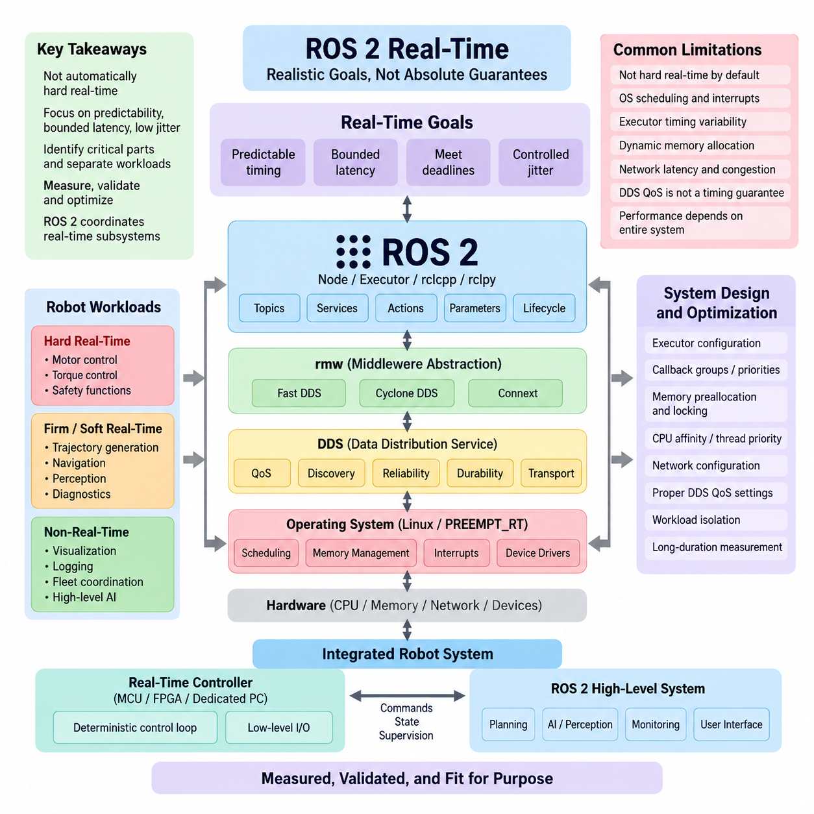
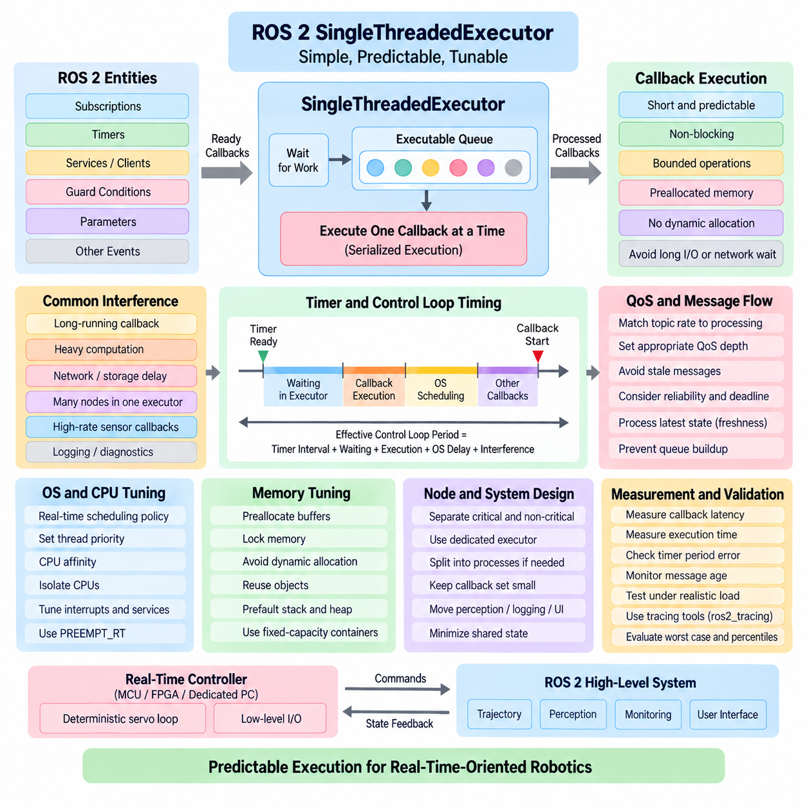
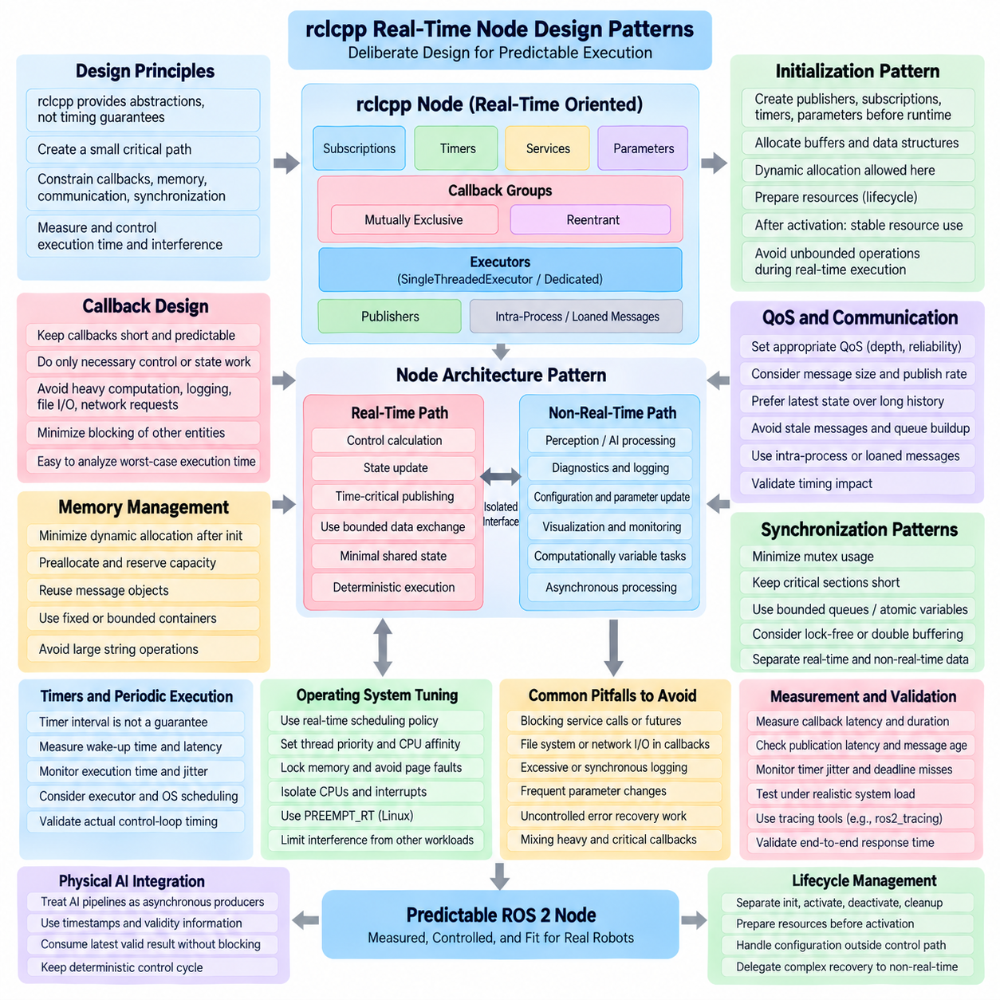
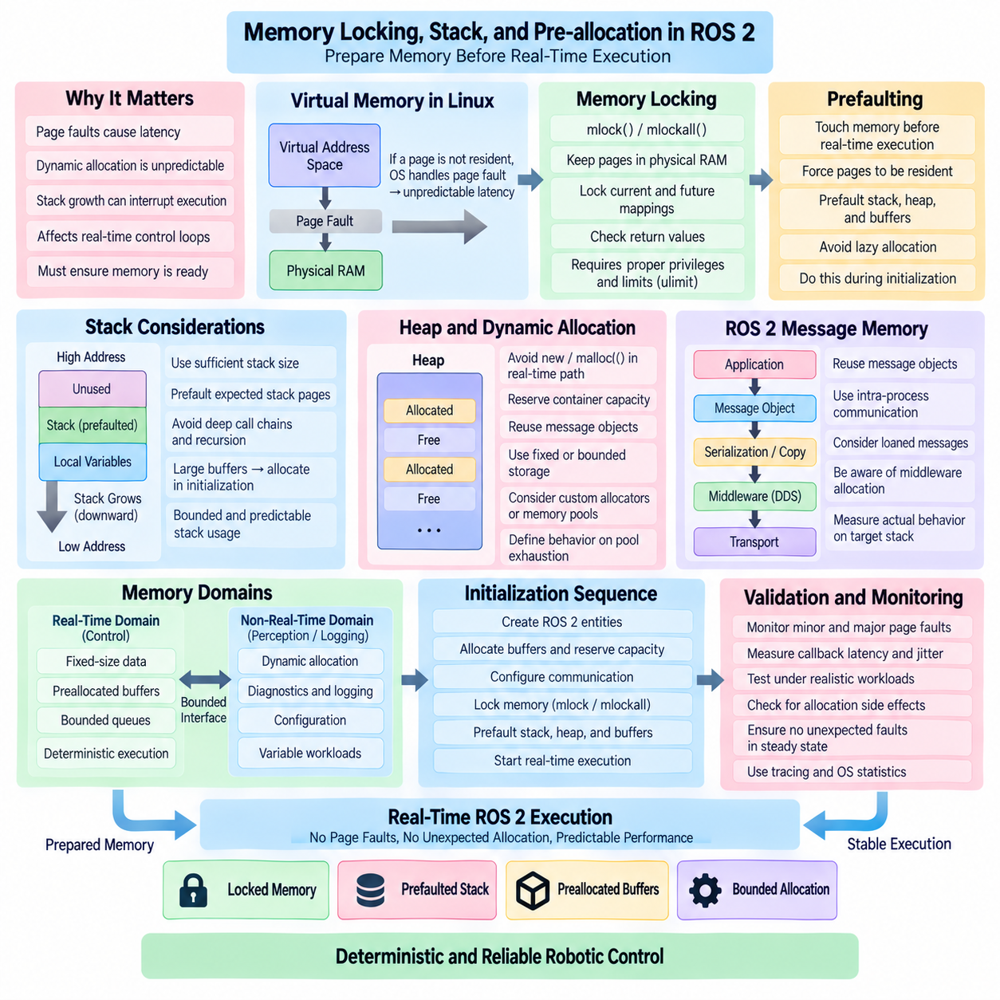
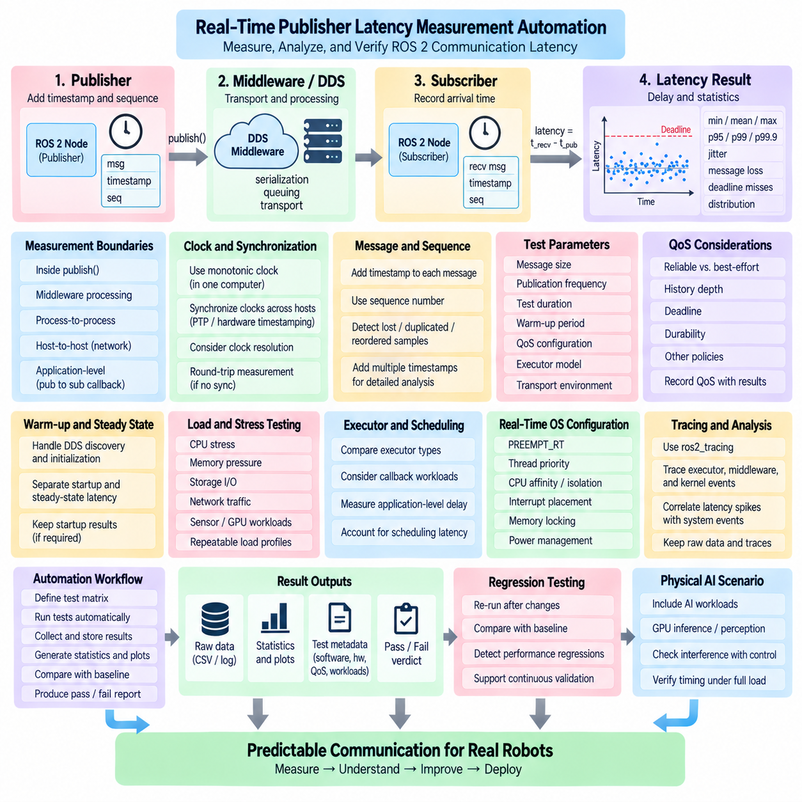
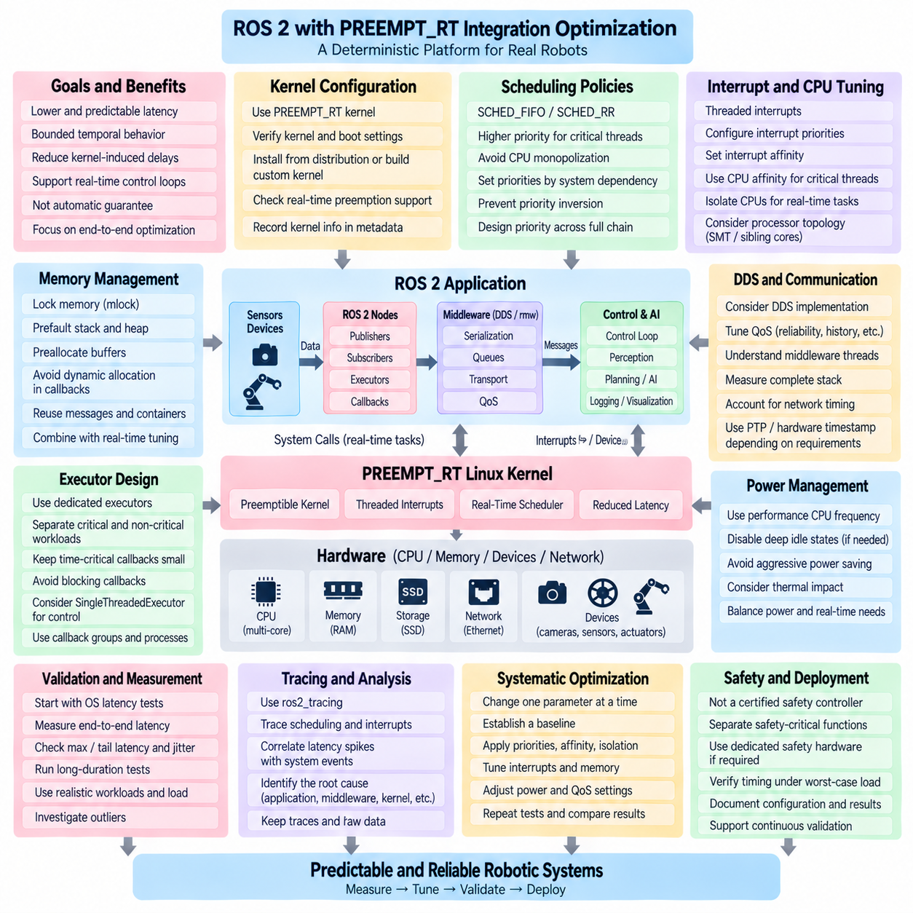
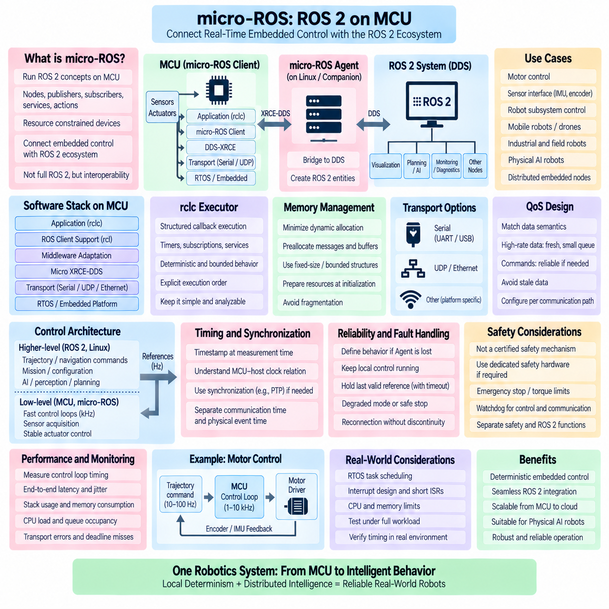
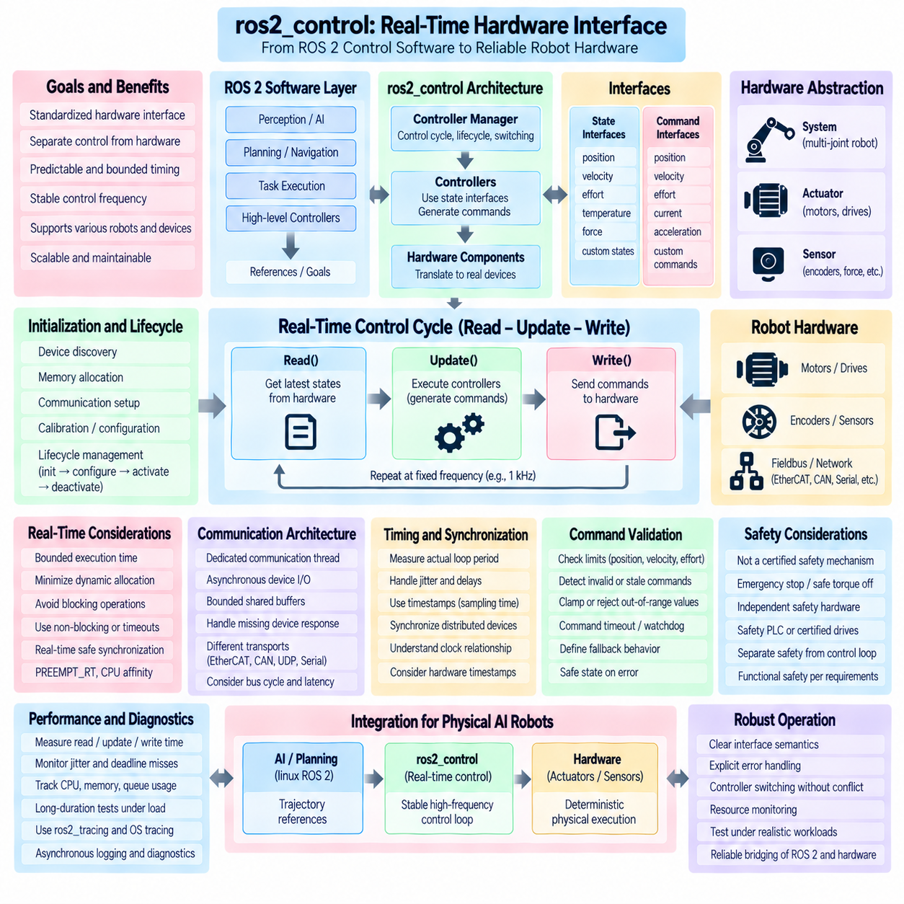
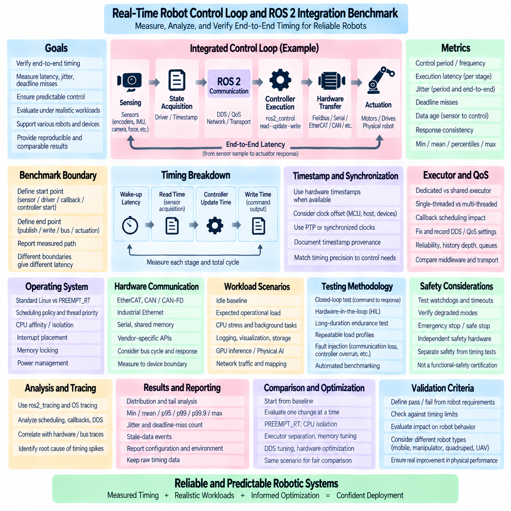
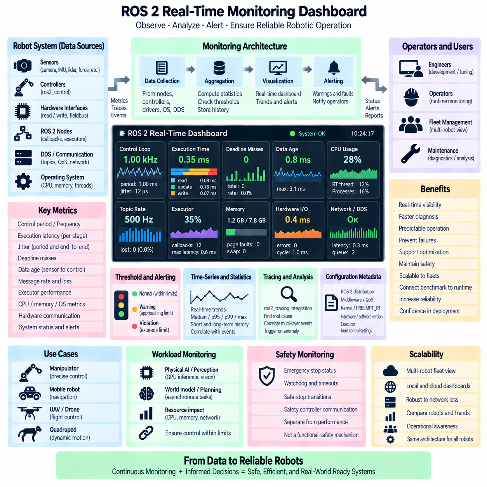

**Volume 05 Robot Middleware and ROS2**

# 05. ROS2 Real-Time

## 05.01 ROS2 Real-Time Limitations and Realistic Goals

{width="7.268055555555556in" height="7.268055555555556in"}

ROS 2는 실시간 로보틱스(Real-Time Robotics)에 적합한 시스템으로 자주 설명되지만, 이러한 표현은 신중하게 해석해야 한다. ROS 2는 결정론적 실행(Deterministic Execution)을 지원할 수 있는 아키텍처 메커니즘을 제공하지만, 범용 리눅스(General-Purpose Linux)에서 실행되는 일반적인 ROS 2 애플리케이션이 자동으로 하드 실시간 시스템(Hard Real-Time System)이 되는 것은 아니다. 따라서 실질적인 목표는 로봇의 어떤 부분에 제한된 시간 동작(Bounded Timing)이 필요한지를 식별하고, 가변 지연(Variable Latency)을 허용할 수 있는 기능과 분리하여 설계하는 것이다.

실시간 동작(Real-Time Behavior)은 단순히 높은 계산 속도를 달성하는 것과 근본적으로 다르다. 시스템이 평균적으로 수백 마이크로초 이내에 제어 연산을 수행하더라도, 간헐적인 지연이 수 밀리초까지 증가한다면 중요한 제어 루프(Critical Control Loop)에 적합하지 않을 수 있다. 실시간 엔지니어링(Real-Time Engineering)은 평균 처리량(Average Throughput)보다 예측 가능성(Predictability), 제한된 최악 지연(Bounded Worst-Case Latency), 데드라인 충족(Deadline Satisfaction), 그리고 제어된 지터(Controlled Jitter)에 초점을 둔다. 이러한 차이가 ROS 2 시스템에서 올바른 성능 목표를 설정하는 출발점이다.

여러 소프트웨어 계층(Software Layer)이 동시에 ROS 2의 타이밍(Timing)에 영향을 준다. 애플리케이션 콜백(Application Callback)은 rclcpp 또는 rclpy, ROS 클라이언트 라이브러리(ROS Client Library), rmw 추상화 계층(rmw Abstraction), DDS 구현(DDS Implementation), 운영체제 스케줄링(OS Scheduling), 메모리 관리(Memory Management), 장치 드라이버(Device Driver), 그리고 경우에 따라 네트워크 스택(Network Stack)을 통과한다. 각 계층은 스케줄링 지연(Scheduling Delay)이나 자원 경합(Resource Contention)을 발생시킬 수 있으므로 DDS QoS 설정 변경이나 프로세서 성능 향상만으로 종단간 결정론적 동작(End-to-End Deterministic Behavior)을 보장할 수 없다.

ROS 2 실행기(Executor)는 타이밍 변동성(Timing Variability)의 중요한 원인 중 하나이다. 실행기는 구독(Subscription), 타이머(Timer), 서비스(Service), 기타 콜백이 언제 실행 가능한 상태가 되고 실제 CPU 시간을 언제 할당받는지를 결정한다. 여러 콜백이 하나의 실행기를 공유하면 장시간 실행되는 콜백이 시간에 민감한 콜백(Time-Sensitive Callback)을 지연시킬 수 있다. 멀티스레딩(Multi-Threading)은 동시성을 향상시킬 수 있지만, 콜백 그룹(Callback Group)과 우선순위(Priority)를 신중하게 설계하지 않으면 경합(Contention), 동기화 오버헤드(Synchronization Overhead), 캐시 간섭(Cache Interference), 예측하기 어려운 스케줄링을 발생시킬 수 있다.

동적 메모리 할당(Dynamic Memory Allocation) 역시 결정론적 실행(Deterministic Execution)을 방해하는 요소이다. 힙 할당(Heap Allocation), 메시지 생성(Message Construction), 컨테이너 크기 변경(Container Resizing), 직렬화 버퍼(Serialization Buffer), 객체 소멸(Object Destruction)과 같은 작업은 실행 시간이 일정하지 않을 수 있다. 메모리 페이지가 예상하지 못한 시점에 접근되면 페이지 폴트(Page Fault)가 훨씬 큰 지연을 발생시킬 수 있다. 따라서 실시간 지향 ROS 2 소프트웨어는 자주 사용하는 객체를 사전 할당(Preallocation)하고, 버퍼를 재사용하며, 필요한 메모리를 잠그고(Memory Locking), 중요 실행 경로(Critical Execution Path)에서 불필요한 메모리 할당을 제거하려고 한다.

운영체제(Operating System)는 달성 가능한 결정론성(Determinism)의 또 다른 경계를 형성한다. 표준 리눅스(Standard Linux)는 엄격한 지연 시간 제한보다 처리량(Throughput), 공정성(Fairness), 광범위한 애플리케이션 호환성(Application Compatibility)에 최적화되어 있다. 커널 동작(Kernel Activity), 인터럽트(Interrupt), 백그라운드 서비스(Background Service), 스케줄러 결정(Scheduler Decision), 전력 관리 상태 전환(Power-Management Transition), 장치 드라이버가 로봇 작업을 중단시킬 수 있다. PREEMPT_RT는 리눅스의 스케줄링 특성을 크게 개선하지만, 실제 시스템 부하(Representative System Load)에서 성능을 측정하고 검증해야 하는 기반 기술(Enabling Technology)로 이해해야 한다.

DDS 역시 실시간 지향 통신 기능(Real-Time-Oriented Communication Capability)을 제공하지만, DDS 서비스 품질 정책(QoS Policy)을 하드 타이밍 보장(Hard Timing Guarantee)과 동일하게 간주해서는 안 된다. 신뢰성(Reliability), 이력 깊이(History Depth), 지속성(Durability), 데드라인(Deadline), 수명(Lifespan), 전송 설정(Transport Configuration)은 통신 동작, 자원 사용량, 장애 처리에 영향을 준다. 부적절한 신뢰성 설정은 블로킹(Blocking)이나 재전송(Retransmission)을 증가시킬 수 있으며, 지나치게 깊은 큐(Queue)는 오래된 데이터를 보존할 수 있다. 따라서 QoS는 각 데이터 흐름(Data Flow)의 의미적 요구사항과 시간적 요구사항을 반영해야 한다.

네트워크 통신(Network Communication)은 엄격한 결정론성을 훨씬 어렵게 만든다. 이더넷 혼잡(Ethernet Congestion), 스위치 버퍼링(Switch Buffering), 재전송(Retransmission), 패킷 단편화(Packet Fragmentation), 경쟁 트래픽(Competing Traffic), 클록 차이(Clock Difference)는 모두 종단간 지연(End-to-End Latency)에 영향을 줄 수 있다. 하나의 컴퓨터에서 결정론적으로 보이는 ROS 2 토픽(Topic)도 여러 컴퓨터 사이에서는 다르게 동작할 수 있다. 따라서 현실적인 검증은 개별 API 동작만 벤치마킹하는 것이 아니라 데이터 생성부터 미들웨어(Middleware), 네트워크, 수신 콜백(Consuming Callback)에 이르는 전체 경로를 측정해야 한다.

로봇 아키텍처(Robot Architecture)는 하드 실시간(Hard Real-Time), 펌 또는 소프트 실시간(Firm or Soft Real-Time), 비실시간(Non-Real-Time) 워크로드를 구분해야 한다. 모터 전류 제어(Motor Current Regulation), 토크 제어(Torque Control), 일부 안전 기능(Safety Function)은 엄격하게 제한된 실행 시간을 요구하므로 전용 제어기(Dedicated Controller), MCU, FPGA 또는 특수 실시간 환경에 배치되는 경우가 많다. 반면 상위 수준 궤적 생성(Trajectory Generation), 내비게이션(Navigation), 인지(Perception), 진단(Diagnostics), 시각화(Visualization), 플릿 조정(Fleet Coordination)은 점진적으로 더 큰 시간 변동을 허용할 수 있으므로 일반적인 ROS 2 실행 환경에 더 적합하다.

이러한 분리는 실용적인 아키텍처 원칙(Architectural Principle)으로 이어진다. ROS 2는 모든 저수준 실시간 메커니즘(Low-Level Real-Time Mechanism)을 대체하기보다 실시간 서브시스템(Real-Time Subsystem)을 조정하는 역할을 수행하는 것이 적절한 경우가 많다. 서보 제어기(Servo Controller)는 로컬에서 결정론적인 내부 루프(Deterministic Inner Loop)를 실행하고, ROS 2는 목표값(Target), 궤적(Trajectory), 설정(Configuration), 상태 보고(State Reporting), 감독 명령(Supervisory Command)을 제공할 수 있다. ros2_control과 마이크로 ROS(micro-ROS)는 이러한 계층형 접근(Layered Approach)의 다양한 구성을 지원한다.

따라서 ROS 2의 현실적인 목표는 전체 소프트웨어 그래프(Software Graph)에 보편적인 하드 실시간 동작을 제공하는 것이 아니라, 선택된 중요 경로(Critical Path)에 대해 제한되고 측정 가능한 지연(Bounded and Measurable Latency)을 달성하는 것이다. 엔지니어는 개별 기능의 데드라인(Deadline), 허용 가능한 지터(Acceptable Jitter), 최대 콜백 실행 시간(Maximum Callback Execution Time), 메시지 수명 제한(Message Age Limit), 과부하 동작(Overload Behavior)을 정의해야 한다. 이러한 요구사항은 모든 서브시스템에 임의의 "1 ms 실시간" 목표를 적용하는 대신 로봇 동역학(Robot Dynamics)과 안전 요구사항(Safety Requirement)에서 도출되어야 한다.

평균 지연 시간(Average Latency)만으로 이러한 요구사항을 검증하기에는 충분하지 않다. 측정에는 관찰된 최악 지연(Worst Observed Latency), 높은 백분위 지연(High-Percentile Latency), 지터 분포(Jitter Distribution), 데드라인 미스(Deadline Miss), 스케줄링 지연(Scheduling Delay), CPU·메모리·디스크·GPU·네트워크 스트레스 상황에서의 동작이 포함되어야 한다. 특히 드물게 발생하는 지연 스파이크(Latency Spike)는 짧은 벤치마크에서 발견되지 않을 수 있으므로 장시간 시험(Long-Duration Test)이 중요하다. 추적 기능(Tracing)을 이용하면 비정상적인 타이밍과 실행기 활동, 콜백 실행, DDS 통신, 운영체제 스케줄링 사이의 관계를 분석할 수 있다.

CPU 친화성(CPU Affinity), 스레드 우선순위(Thread Priority), 인터럽트 배치(Interrupt Placement), 메모리 잠금(Memory Locking), 사전 할당(Preallocation), 실행기 설정(Executor Configuration), 중요 워크로드 격리(Critical Workload Isolation)는 예측 가능성을 단계적으로 향상시킬 수 있다. 그러나 이러한 기술은 독립적인 튜닝 기법으로 적용하기보다 측정 기반 최적화 과정(Measured Optimization Process)의 일부로 적용해야 한다. CPU 격리, 네트워킹, 장치 인터럽트, 애플리케이션 동시성이 전체 시스템 수준에서 상호작용하기 때문에 하나의 벤치마크를 개선하는 설정이 다른 환경에서는 성능을 저하시킬 수도 있다.

현대 피지컬 AI 로봇(Physical AI Robot)에서는 이러한 구분이 더욱 중요하다. 비전(Vision), 파운데이션 모델(Foundation Model), 월드 모델(World Model), 학습 기반 정책(Learned Policy)을 위한 GPU 추론(GPU Inference)은 수십 또는 수백 밀리초가 필요하고 워크로드에 따라 지연 시간이 달라질 수 있다. 반면 안정화 제어(Stabilization)나 액추에이터 루프(Actuator Loop)는 수백 또는 수천 헤르츠로 동작할 수 있다. 이러한 기능을 하나의 타이밍 모델(Timing Model) 아래에 배치하는 것은 현실적이지 않으며, 비동기 지능(Asynchronous Intelligence)과 결정론적 제어(Deterministic Control)를 명확하게 정의된 인터페이스를 통해 연결해야 한다.

안전 요구사항(Safety Requirement) 역시 ROS 2의 타이밍 성능에 대한 가정과 독립적으로 유지되어야 한다. 비상 정지(Emergency Stop), 토크 제한(Torque Limitation), 보호 감시(Protective Monitoring), 기타 안전 관련 메커니즘은 높은 우선순위의 ROS 2 스레드만으로 대체할 수 없는 인증된 하드웨어(Certified Hardware) 또는 안전 제어기(Safety Controller)를 요구할 수 있다. ROS 2는 이러한 시스템과 상태 및 감독 정보를 교환할 수 있지만, 아키텍처 경계(Architectural Boundary)는 요구되는 독립성과 장애 대응(Failure Response)을 유지해야 한다.

ROS 2 실시간 엔지니어링(ROS 2 Real-Time Engineering)의 실질적인 목표는 지터를 완전히 제거하거나 모든 주기에서 동일한 실행 시간을 만드는 것이 아니다. 핵심은 제어된 시간적 동작(Controlled Temporal Behavior)을 달성하는 것이다. 중요한 데드라인을 식별하고, 지연 원인(Latency Source)을 이해하며, 필요한 경우 실행 경로를 격리하고, 데드라인 위반을 감지하여 안전하게 처리할 수 있어야 한다. 따라서 결정론성은 단순히 ROS 2를 선택함으로써 얻어지는 기능이 아니라 아키텍처, 설정, 측정, 검증을 통해 입증되는 공학적 특성(Engineering Property)이다.

보다 광범위한 로봇 소프트웨어 아키텍처(Robot Software Architecture)에서 ROS 2의 실시간 기능은 일반적인 분산 미들웨어(Distributed Middleware)와 전용 결정론적 제어(Dedicated Deterministic Control) 사이의 연속적인 영역으로 이해해야 한다. 이러한 위치는 별도의 실시간 운영체제(Real-Time Operating System) 및 제어 소프트웨어(Control Software) 계층을 보완하면서 ROS 2가 이들 사이에서 표준화된 통신과 통합 기능을 제공하도록 한다. 따라서 효과적인 시스템은 각 워크로드를 물리적 영향(Physical Consequence)에 적합한 타이밍 도메인(Timing Domain)에 배치한다.

성숙한 ROS 2 실시간 설계(ROS 2 Real-Time Design)는 궁극적으로 현실적인 기대에서 시작한다. ROS 2는 적절한 운영체제, 미들웨어 설정, 실행기 설계, 메모리 관리 원칙(Memory Discipline), 하드웨어 분할(Hardware Partitioning), 체계적인 벤치마킹(Systematic Benchmarking)을 결합하면 높은 수준의 로봇 제어 요구를 지원할 수 있다. 그러나 임의의 리눅스 애플리케이션을 자동으로 하드 실시간 소프트웨어로 변환한다고 기대해서는 안 된다. 이러한 경계를 명확히 정의하는 것이 이후 ROS 2 실행기, 메모리 동작, PREEMPT_RT 통합, 제어 루프 성능(Control-Loop Performance)을 최적화하기 위한 기반이 된다.

## 05.02 SingleThreadedExecutor Real-Time Tuning [w/Code]

{width="7.268055555555556in" height="7.268055555555556in"}

ROS 2의 단일 스레드 실행기(SingleThreadedExecutor)는 콜백 스케줄링(Callback Scheduling)을 이해하고 제어하기 위한 가장 단순한 실행 모델(Execution Model) 중 하나를 제공한다. 하나의 실행 스레드(Execution Thread)를 통해 실행 가능한 엔티티(Executable Entity)를 처리하므로 해당 실행기에 할당된 콜백들이 동시에 실행되는 것을 방지한다. 실시간 지향 시스템(Real-Time-Oriented System)에서는 이러한 단순성이 동시 실행에서 발생하는 여러 동기화 및 스레드 경합 효과를 제거하기 때문에 유용하지만, 그 자체로 결정론적 타이밍(Deterministic Timing)을 보장하지는 않는다.

실행 중에 실행기(Executor)는 노드와 연결된 구독(Subscription), 타이머(Timer), 서비스(Service), 클라이언트(Client), 가드 조건(Guard Condition), 기타 엔티티를 감시한다. 처리할 작업이 준비되면 실행기는 실행 가능한 콜백을 선택하여 실행하고, 완료된 후 다음 콜백으로 이동한다. 한 번에 하나의 콜백만 실행되기 때문에 콜백 실행은 직렬화(Serialization)된다. 이러한 특성은 타이밍 상호작용을 분석하기 쉽게 하지만, 장시간 실행되는 하나의 콜백이 동일한 실행기에서 대기하는 다른 모든 콜백을 직접 지연시킬 수 있다.

따라서 가장 중요한 튜닝 원칙(Tuning Principle)은 콜백을 짧고 예측 가능하며 비차단형(Non-Blocking)으로 유지하는 것이다. 장시간 계산을 수행하거나 네트워크 통신을 기다리고, 느린 저장장치에 접근하거나 실행 시간이 예측하기 어려운 외부 라이브러리를 호출하는 콜백은 실행기 스레드(Executor Thread)를 지나치게 오래 점유할 수 있다. 시간 중요 콜백(Time-Critical Callback)은 제한된 연산(Bounded Operation)만 수행하고, 필요한 경우 중요하지 않은 처리를 별도의 실행 컨텍스트(Execution Context)로 이동시켜 주 실행기의 응답성을 유지해야 한다.

타이머 기반 제어 루프(Timer-Driven Control Loop)는 특히 주의해야 한다. 타이머가 준비 상태(Ready State)가 되었다고 해서 즉시 실행된다는 의미는 아니기 때문이다. 다른 콜백이 이미 실행 중일 때 타이머가 준비되면 타이머 콜백이 시작되기 전까지 스케줄링 지연(Scheduling Latency)이 발생한다. 따라서 실질적인 제어 루프 주기(Control-Loop Period)는 설정된 타이머 간격뿐만 아니라 실행기 대기 시간, 콜백 실행 시간, 운영체제 스케줄링 지연, 동일 실행기가 처리하는 다른 엔티티의 간섭까지 포함한다.

콜백 실행 시간(Callback Execution Time)은 타이밍 예산(Timing Budget)의 일부로 취급해야 한다. 예를 들어 1 kHz 제어 루프가 명목상 1 ms의 주기를 가진다면, 동일한 실행 경로를 공유하는 모든 연산은 스케줄링 및 미들웨어 오버헤드를 위한 여유를 남기면서 제한된 시간 예산 안에서 완료되어야 한다. 콜백 실행 시간이 사용 가능한 주기에 가까워지면 작은 외란만으로도 데드라인 미스(Deadline Miss)가 발생할 수 있다. 따라서 실시간 튜닝은 평균 실행 시간만을 기반으로 하는 최적화보다 최악 조건 지향 측정(Worst-Case-Oriented Measurement)을 요구한다.

노드 구성(Node Composition)도 단일 스레드 실행기(SingleThreadedExecutor)의 동작에 영향을 준다. 많은 노드를 하나의 실행기에 배치하면 배포는 단순해지지만 동일한 실행 스레드를 두고 경쟁하는 콜백 수가 증가한다. 진단 구독(Diagnostic Subscription), 파라미터 콜백(Parameter Callback), 로깅 작업(Logging Operation), 고대역폭 센서 콜백(High-Bandwidth Sensor Callback)이 제어 타이머에 예상하지 못한 간섭을 줄 수 있다. 따라서 편의를 위해 모든 ROS 2 노드를 하나의 실행 컨텍스트에 배치하기보다 타이밍 요구사항에 따라 중요 기능과 비중요 기능을 분리해야 한다.

유용한 아키텍처는 소수의 밀접하게 연관된 실시간 지향 콜백(Real-Time-Oriented Callback)에 전용 단일 스레드 실행기를 할당하고, 인지(Perception), 로깅(Logging), 시각화(Visualization), 진단(Diagnostics), 기타 가변 지연 기능(Variable-Latency Function)을 다른 실행 영역으로 이동시키는 것이다. 전체 로봇 소프트웨어 스택(Robot Software Stack)이 동일한 실행기 모델을 사용할 필요는 없다. 워크로드 특성에 따라 서로 다른 프로세스(Process) 또는 실행 컨텍스트를 할당함으로써 중요 경로(Critical Path)는 단순하게 유지하면서 상위 소프트웨어에는 더 높은 동시성을 제공할 수 있다.

콜백 내부의 메모리 동작(Memory Behavior) 역시 제어해야 한다. 동적 메모리 할당(Dynamic Memory Allocation), 컨테이너 크기 변경(Container Resizing), 메시지 복사(Message Copying), 문자열 처리(String Manipulation), 임시 객체 생성(Temporary Object Creation)은 가변적인 실행 시간을 발생시킬 수 있다. 자주 사용하는 버퍼와 메시지는 가능한 경우 중요 실행 단계(Critical Execution Phase)에 들어가기 전에 할당해야 한다. 객체 재사용(Object Reuse)과 고정 용량 데이터 구조(Fixed-Capacity Data Structure)는 할당기 동작을 줄이고 지속적인 운용 상황에서도 콜백 실행 시간을 더욱 안정적으로 유지할 수 있도록 한다.

차단형 동기화 기본 요소(Blocking Synchronization Primitive)는 중요 실행기 스레드에서 최소화해야 한다. 뮤텍스(Mutex), 조건 변수(Condition Variable), 서비스 응답(Service Response), 파일 작업(File Operation), 다른 스레드를 기다리는 동작은 직렬화된 실행의 타이밍 장점을 무너뜨릴 수 있다. 뮤텍스를 일반적인 상황에서 즉시 획득할 수 있더라도 비정상적인 부하에서 경합이 발생하면 상당한 지연이 생길 수 있다. 따라서 실시간 지향 콜백 경로는 공유 가변 상태(Shared Mutable State)를 최소화하고 완료 시간을 제한할 수 없는 의존성을 피해야 한다.

ROS 2 통신 설정(Communication Configuration)도 실행기 동작에 간접적으로 영향을 준다. 콜백이 처리할 수 있는 속도보다 빠르게 데이터를 수신하는 구독은 서비스 품질 이력 설정(QoS History Configuration)에 따라 대기 작업을 누적할 수 있다. 신뢰성 통신(Reliable Communication)은 추가적인 전송 동작을 발생시킬 수 있고, 불필요하게 깊은 큐(Queue)는 오래된 메시지가 처리 대기 상태로 남게 만들 수 있다. 따라서 QoS 깊이(QoS Depth), 신뢰성(Reliability), 데드라인(Deadline), 메시지 전송률(Message Rate)은 실행기의 처리 능력과 함께 결정해야 한다.

센서 및 제어 애플리케이션에서는 모든 과거 샘플을 처리하는 것보다 가장 최신의 의미 있는 상태(Newest Meaningful State)를 처리하는 것이 더 중요할 수 있다. 고속 센서 스트림(High-Rate Sensor Stream)이 단일 스레드 실행기의 처리 능력을 초과하면 개별 콜백이 특별히 느리지 않더라도 데이터 수명(Data Age)이 계속 증가할 수 있다. 시스템 설계자는 절대로 손실되어서는 안 되는 정보와 완전성보다 최신성(Freshness)이 중요한 상태 데이터를 구분하고 이에 적합한 통신 및 처리 정책을 구성해야 한다.

애플리케이션 수준의 변동 원인을 줄이고 나면 운영체제 스케줄링(Operating-System Scheduling)이 더욱 중요해진다. 실시간 동작을 지원하도록 구성된 시스템에서는 실행기 스레드에 적절한 실시간 스케줄링 정책(Real-Time Scheduling Policy)과 우선순위(Priority)를 할당할 수 있다. CPU 친화성(CPU Affinity)을 이용하여 특정 프로세서 코어에서만 스레드가 실행되도록 제한할 수 있으며, 격리 전략(Isolation Strategy)을 통해 관련 없는 워크로드의 간섭을 줄일 수 있다. 리눅스 기반의 고성능 제어 애플리케이션에서는 PREEMPT_RT를 통해 커널 스케줄링 지연(Kernel Scheduling Latency)을 추가로 줄일 수 있다.

CPU 친화성(CPU Affinity)만으로 완전한 격리(Isolation)가 이루어지는 것은 아니다. 인터럽트(Interrupt), 커널 스레드(Kernel Thread), 장치 활동(Device Activity), 다른 프로세스가 동일한 프로세서에서 여전히 실행될 수 있기 때문이다. 효과적인 튜닝에서는 인터럽트 친화성(Interrupt Affinity), 백그라운드 서비스, 전력 관리 동작(Power-Management Behavior), 주파수 스케일링(Frequency Scaling), 경쟁하는 실시간 스레드를 포함한 전체 CPU 환경을 고려한다. 이러한 상호작용을 이해하지 않은 상태에서 ROS 2 실행기에 가장 높은 우선순위만 부여하면 결정론성 향상보다 기아 상태(Starvation)나 시스템 수준 불안정성을 초래할 수 있다.

운영체제가 지원하는 경우 메모리 잠금(Memory Locking)도 중요한 기법이다. 프로세스 메모리를 잠그면 중요 실행 중 페이지 폴트(Page Fault)가 발생할 가능성을 줄일 수 있으며, 스택(Stack)과 힙(Heap) 영역을 사전에 페이지 적재(Prefaulting)하면 실시간 동작이 시작되기 전에 필요한 페이지를 물리 메모리에 상주시킬 수 있다. 이러한 기법은 사전 할당(Preallocation)과 함께 사용할 때 가장 효과적이다. 메모리를 잠그는 것만으로는 동적 할당이나 애플리케이션 수준의 자원 경합에서 발생하는 예측 불가능한 동작을 제거할 수 없기 때문이다.

실행기 튜닝(Executor Tuning)은 관찰된 타이밍 동작에 기반해야 하므로 계측(Instrumentation)이 필수적이다. 유용한 측정 항목에는 콜백 시작 지연(Callback Start Latency), 콜백 실행 시간(Callback Execution Duration), 타이머 주기 오차(Timer Period Error), 메시지 수명(Message Age), 데드라인 미스, 데이터 생성에서 제어 출력까지의 종단간 지연(End-to-End Latency)이 포함된다. ros2_tracing과 운영체제 추적 도구(OS Tracing Tool)를 활용하면 지연의 원인이 콜백 실행, 실행기 스케줄링, 미들웨어 처리, 커널 스케줄링 또는 다른 서브시스템에서 발생했는지를 구분할 수 있다.

시험은 유휴 상태의 개발용 컴퓨터가 아니라 현실적인 최악 조건(Realistic Worst-Case Condition)을 재현해야 한다. CPU 집약적 인지(CPU-Intensive Perception), GPU 추론(GPU Inference), 네트워크 트래픽(Network Traffic), 센서 스트림, 로깅, 저장장치 작업, 백그라운드 서비스는 단순한 시험에서는 나타나지 않는 간섭을 노출시킬 수 있다. 특히 드문 스케줄링 외란(Scheduling Disturbance)은 수백만 번의 콜백 주기가 지난 후에만 발생할 수 있으므로 장시간 측정(Long-Duration Measurement)이 중요하다. 평균값뿐만 아니라 백분위 분포(Percentile Distribution)와 최대 관찰 지연(Maximum Observed Latency)을 함께 평가해야 한다.

단일 스레드 실행기(SingleThreadedExecutor)는 최대 처리량(Maximum Throughput)보다 실행 순서의 단순성(Execution-Order Simplicity)과 콜백 동시 실행의 제거가 중요한 경우 특히 유용하다. 반대로 계산량이 큰 여러 콜백을 동시에 실행해야 하거나 제거할 수 없는 차단 작업(Blocking Operation)이 존재하는 경우에는 적합성이 떨어진다. 이러한 상황에서는 단순히 제한 없는 멀티스레드 실행(Unrestricted Multithreaded Execution)으로 변경하기보다 워크로드를 여러 프로세스 또는 실행기로 분리하는 것이 더 나은 타이밍 격리(Timing Isolation)를 제공할 수 있다.

로봇 제어(Robot Control)에서는 전용 ROS 2 실행기와 저수준 결정론적 제어기(Low-Level Deterministic Controller)를 결합하는 실용적인 설계가 자주 사용된다. ROS 2 실행기는 명령 교환(Command Exchange), 상태 업데이트(State Update), 궤적 참조값(Trajectory Reference), 감독 로직(Supervisory Logic)을 처리하고, MCU나 전용 제어기(Dedicated Controller) 또는 엄격하게 관리되는 실시간 스레드가 가장 빠른 서보 루프(Servo Loop)를 실행할 수 있다. 이러한 분리는 더 강력한 시간 보장을 요구하는 제어 기능에서 미들웨어 스케줄링이 유일한 타이밍 메커니즘이 되는 것을 방지한다.

따라서 실시간 튜닝(Real-Time Tuning)은 개별적인 파라미터 변경에서 시작하기보다 아키텍처에서 측정으로 이어지는 과정으로 진행해야 한다. 먼저 중요 콜백 집합(Critical Callback Set)을 최소화하고, 차단 작업과 불필요한 메모리 할당을 제거한 다음, 적절한 QoS와 메시지 전송률을 설정해야 한다. 이후 운영체제 스케줄링과 CPU 자원을 구성하고 마지막으로 스트레스 조건에서 전체 경로를 검증해야 한다. 각각의 최적화는 지연(Latency), 지터(Jitter), 데드라인 동작(Deadline Behavior)의 측정 가능한 개선을 통해 정당화되어야 한다.

단일 스레드 실행기 튜닝(SingleThreadedExecutor Tuning)의 현실적인 목표는 모든 ROS 2 콜백을 완전히 동일한 시점에 실행하도록 만드는 것이 아니다. 의도적으로 작고 통제된 콜백 집합을 구성하면 추론하고 프로파일링하며 검증하기 쉬운 실행 모델을 만들 수 있다는 것이 핵심적인 장점이다. 체계적인 콜백 설계, 메모리 제어, PREEMPT_RT, CPU 격리(CPU Isolation), 체계적인 벤치마킹(Systematic Benchmarking)을 함께 적용하면 다양한 실시간 지향 로봇 워크로드를 위한 예측 가능한 ROS 2 실행 계층(Predictable ROS 2 Execution Layer)을 구성할 수 있다.

## 05.03 rclcpp Real-Time Node Design Patterns [w/Code]

{width="7.268055555555556in" height="7.268055555555556in"}

실시간 지향 ROS 2 노드(Real-Time-Oriented ROS 2 Node)의 설계는 rclcpp가 통신 및 실행 추상화(Communication and Execution Abstraction)를 제공하지만 자동적인 타이밍 보장(Timing Guarantee)을 제공하지 않는다는 점을 인식하는 것에서 시작한다. 노드는 콜백(Callback), 메모리 동작(Memory Behavior), 통신 경로(Communication Path), 동기화 메커니즘(Synchronization Mechanism), 실행 환경(Execution Environment)을 의도적으로 제한할 때 비로소 예측 가능한 동작을 갖게 된다. 목표는 실행 시간과 간섭 원인을 측정하고 제어할 수 있는 작고 명확한 중요 경로(Critical Path)를 만드는 것이다.

유용한 rclcpp 설계 패턴(Design Pattern)은 초기화(Initialization)와 실시간 실행(Real-Time Execution)을 분리하는 것이다. 퍼블리셔(Publisher), 서브스크립션(Subscription), 타이머(Timer), 파라미터(Parameter), 버퍼(Buffer), 내부 데이터 구조(Internal Data Structure)는 중요 운용 단계가 시작되기 전에 생성하는 것이 바람직하다. 초기화 단계에서는 타이밍 중요 경로 밖에서 수행되므로 동적 할당(Dynamic Allocation)과 설정 작업을 수행할 수 있다. 실시간 실행이 시작되면 노드는 안정적인 자원 사용 상태로 전환하고 실행 시간을 제한하기 어려운 작업을 피해야 한다.

콜백 설계(Callback Design)는 실시간 노드 아키텍처(Real-Time Node Architecture)의 중심이다. 중요 콜백(Critical Callback)은 입력을 다음 제어 출력 또는 상태 출력으로 변환하는 데 필요한 연산만 수행해야 한다. 비용이 큰 인지(Perception), 로깅(Logging), 파일 접근(File Access), 네트워크 요청(Network Request), 파라미터 재설정(Parameter Reconfiguration), 기타 실행 시간이 가변적인 작업은 동일한 콜백 경로에 포함하지 않는 것이 좋다. 짧은 콜백은 다른 엔티티의 차단을 줄이고 최악 실행 시간(Worst-Case Execution Time)을 분석하기 쉽게 한다.

초기화가 완료된 이후에는 동적 메모리 할당(Dynamic Memory Allocation)을 최소화해야 한다. 임시 벡터(Temporary Vector)를 생성하거나 컨테이너 크기를 변경하고, 메시지를 반복적으로 생성하거나 큰 문자열을 처리하며, 고주파 콜백 내부에서 새로운 객체를 할당하면 할당기 의존 지연(Allocator-Dependent Latency)이 발생할 수 있다. 더 적합한 패턴은 고정 또는 제한된 버퍼를 사전에 할당하고, 컨테이너 용량을 미리 확보하며, 메시지 객체를 재사용하고, 실시간 운용 기간 동안 안정적인 데이터 구조를 유지하는 것이다.

메시지 소유권(Message Ownership)과 복사(Copying) 역시 타이밍에 영향을 준다. 대용량 센서 또는 상태 메시지는 콜백과 퍼블리셔 사이에서 반복적으로 복사될 경우 상당한 오버헤드를 발생시킬 수 있다. 따라서 rclcpp 애플리케이션은 메시지 재사용(Message Reuse), 이동 의미론(Move Semantics), 지원되는 경우 대여 메시지(Loaned Message), 그리고 컴포넌트가 동일한 프로세스에서 실행될 때 프로세스 내부 통신(Intra-Process Communication)을 고려할 수 있다. 적절한 방식은 미들웨어와 메시지 특성에 따라 달라지므로 타이밍 개선 효과는 가정하지 말고 실제로 검증해야 한다.

콜백 사이의 동기화(Synchronization)는 특히 엄격하게 설계해야 한다. 공유 상태를 보호하는 뮤텍스(Mutex)는 정상 운용에서는 비용이 작아 보일 수 있지만, 다른 스레드가 잠금을 보유하면 획득 시간이 예측하기 어려워진다. 중요 데이터 교환에서는 공유 가변 상태(Shared Mutable State)를 최소화하고 보호 구간(Critical Section)을 매우 짧게 유지해야 한다. 상황에 따라 제한된 큐(Bounded Queue), 원자 변수(Atomic Variable), 이중 버퍼링(Double-Buffering), 신중하게 설계된 잠금 없는 통신(Lock-Free Communication)을 사용하여 실시간 및 비실시간 실행 영역 사이의 차단을 줄일 수 있다.

일반적인 패턴 중 하나는 노드 또는 시스템을 실시간 경로(Real-Time Path)와 비실시간 경로(Non-Real-Time Path)로 분리하는 것이다. 실시간 측에서는 제어 계산(Control Calculation), 상태 업데이트(State Update), 시간 중요 발행(Time-Critical Publication)을 수행하고, 비실시간 측에서는 진단(Diagnostics), 로깅, 설정(Configuration), 시각화(Visualization), 계산 시간이 가변적인 작업을 처리한다. 이 경계를 통과하는 데이터는 느린 보조 기능이 중요 경로에 필요한 자원을 차단하거나 획득하지 못하도록 명시적으로 설계된 인터페이스를 사용해야 한다.

타이머(Timer)는 rclcpp에서 주기적 동작을 구현하는 데 자주 사용되지만, 타이머 간격(Timer Interval)을 보장된 실행 주기(Guaranteed Execution Period)로 해석해서는 안 된다. 타이머는 작업이 준비되었음을 나타낼 뿐이며 실제 콜백 시작 시점은 실행기(Executor)와 운영체제(Operating System)가 결정한다. 따라서 주기적 노드는 설정된 주기가 물리적인 제어 루프 타이밍을 직접 나타낸다고 가정하지 말고 실제 기상 시점(Actual Wake-Up Time), 콜백 시작 지연(Callback Start Latency), 실행 시간(Execution Duration), 주기 간 지터(Cycle-to-Cycle Jitter)를 측정해야 한다.

콜백 그룹(Callback Group)은 실행 관계를 제어하기 위한 아키텍처 메커니즘을 제공한다. 상호 배타적 그룹(Mutually Exclusive Group)은 선택된 콜백이 동시에 실행되는 것을 방지하고, 재진입 그룹(Reentrant Group)은 실행기가 여러 스레드를 제공할 경우 동시 실행을 허용한다. 실시간 지향 노드에서는 콜백 그룹 할당이 단순히 소프트웨어 기능 구분을 따르기보다 의도적인 타이밍 및 동기화 관계를 표현해야 한다. 중요 콜백이 예측하기 어려운 작업과 실행 자원을 우연히 공유해서는 안 된다.

실행기(Executor)는 노드 설계와 함께 선택해야 한다. 신중하게 구성된 rclcpp 노드라도 관련 없는 장시간 실행 엔티티가 많은 실행기에 콜백이 배치되면 예측 가능한 동작을 달성하기 어렵다. 전용 단일 스레드 실행기(SingleThreadedExecutor)는 소규모 중요 콜백 집합에 단순한 직렬 실행 모델(Serialized Execution Model)을 제공할 수 있으며, 별도의 실행기나 프로세스가 가변적인 워크로드를 처리할 수 있다. 따라서 실행 토폴로지(Execution Topology)는 단순한 배포 세부사항이 아니라 노드 아키텍처의 일부이다.

퍼블리셔 동작(Publisher Behavior) 역시 제한된 자원 사용(Bounded Resource Usage)을 중심으로 설계해야 한다. 고주파로 발행하는 제어 콜백은 직렬화(Serialization), 미들웨어(Middleware), 전송(Transport), 큐 관련 오버헤드를 경험할 수 있다. 메시지 크기(Message Size)와 발행 주기(Publication Rate)는 서브시스템의 물리적 요구사항에 맞아야 한다. 대용량 진단 정보는 타이밍 특성과 우선순위가 근본적으로 다른 소형 제어 상태 데이터와 동일한 중요 통신 경로를 공유하지 않는 것이 바람직하다.

서브스크립션 설계(Subscription Design)는 신뢰성(Reliability)뿐만 아니라 데이터 최신성(Data Freshness)도 고려해야 한다. 콜백이 처리할 수 있는 속도보다 메시지가 빠르게 도착하면 기술적으로 메시지가 손실되지 않더라도 큐에 저장된 데이터가 오래될 수 있다. 상태 추정(State Estimation)과 제어(Control)에서는 긴 이력을 보존하는 것보다 가장 최신 상태를 처리하는 것이 더 중요할 수 있다. 따라서 QoS 이력 깊이(History Depth), 신뢰성, 데드라인(Deadline), 발행 주기는 데이터의 시간적 의미(Temporal Meaning)를 반영해야 한다.

서비스(Service)와 동기식 상호작용(Synchronous Interaction)은 다른 실행 컨텍스트의 응답을 기다리는 의존성을 발생시키므로 실시간 노드에서 주의해야 한다. 중요 콜백은 일반적으로 동기식 서비스 호출(Synchronous Service Call), 차단 퓨처(Blocking Future), 파일 시스템 작업(Filesystem Operation), 외부 프로세스 통신(External Process Communication)을 피해야 한다. 설정 및 감독 명령(Supervisory Command)은 주기적인 제어 경로 외부에서 처리하여 비동기 이벤트가 시간 중요 실행을 중단하지 않고 준비된 상태를 변경하도록 구성할 수 있다.

로깅(Logging) 역시 쉽게 간과되는 타이밍 변동(Timing Variation)의 원인이다. 문자열 포맷팅(String Formatting), 내부 잠금 획득(Internal Lock Acquisition), 콘솔 출력(Console Output), 저장장치로 로그를 전달하는 작업은 예측하기 어려운 지연을 발생시킬 수 있다. 상세 로깅은 개발 과정에서 유용하지만 고주파 중요 콜백에서는 동기식 로깅(Synchronous Logging)을 최소화해야 한다. 대신 경량 추적(Lightweight Tracing), 카운터(Counter), 사전 할당된 텔레메트리(Preallocated Telemetry)를 통해 타이밍 정보를 수집하고 실시간 실행 영역 외부에서 처리할 수 있다.

파라미터 업데이트(Parameter Update) 역시 결정론적 계산(Deterministic Computation)과 분리해야 한다. 런타임 파라미터(Runtime Parameter)는 로봇 설정에 유용하지만 임의의 파라미터 변경은 검증(Validation), 메모리 업데이트, 내부 자원 재구성을 요구할 수 있다. 견고한 노드(Robust Node)는 비중요 콜백에서 설정 변경을 수신하고 이를 검증한 뒤 필요한 상태를 미리 구성하여 제한된 전달 메커니즘(Bounded Handoff Mechanism)을 통해 준비된 설정을 실시간 경로에 제공할 수 있다.

오류 처리(Error Handling)는 중요 콜백 내부에 통제되지 않는 복구 작업을 발생시키지 않도록 설계해야 한다. 예외(Exception), 자원 재구성(Resource Reconstruction), 반복적인 메모리 할당, 네트워크 재연결(Network Reconnection), 대규모 진단 정보 생성은 큰 지연 변동을 일으킬 수 있다. 실시간 경로는 이상 상태를 빠르게 감지하고 간결한 장애 정보(Fault Information)를 기록한 다음 정의된 안전 상태(Safe State) 또는 성능 저하 상태(Degraded State)로 전환하며, 복잡한 복구 작업은 감독용 비실시간 컴포넌트(Supervisory Non-Real-Time Component)에 위임하는 것이 바람직하다.

수명주기 개념(Lifecycle Concept)은 초기화, 활성화(Activation), 비활성화(Deactivation), 정리(Cleanup), 복구(Recovery)를 정상적인 주기 실행과 분리할 수 있으므로 이러한 패턴을 보완한다. 중요 콜백에 필요한 자원은 활성화 전에 준비할 수 있으며, 실행이 중지된 이후 정리와 재설정을 수행할 수 있다. 이러한 분리는 노드가 시간에 민감한 로봇 기능을 수행하는 동안 발생해야 하는 예측하기 어려운 자원 관리(Resource Management)의 양을 줄인다.

운영체제 경계(Operating-System Boundary)에서는 중요 rclcpp 콜백을 실행하는 스레드에 적절한 스케줄링 우선순위(Scheduling Priority), CPU 친화성(CPU Affinity), 메모리 잠금(Memory Locking), 관련 없는 워크로드로부터의 보호가 필요할 수 있다. PREEMPT_RT는 리눅스 스케줄링 지연(Linux Scheduling Latency)을 줄일 수 있지만 애플리케이션 설계는 여전히 핵심적이다. 차단 작업과 동적 메모리 할당을 포함하는 부적절한 구조의 노드는 실시간 지원 커널(Real-Time-Enabled Kernel)에서 실행한다고 해서 자동으로 결정론적으로 변하지 않는다.

실시간 노드 검증(Real-Time Node Validation)은 콜백 계산 시간만이 아니라 전체 동작을 측정해야 한다. 중요한 관찰 항목에는 콜백 릴리스-시작 지연(Callback Release-to-Start Latency), 실행 시간, 발행 지연(Publication Latency), 메시지 수명(Message Age), 타이머 지터(Timer Jitter), 데드라인 미스(Deadline Miss), 종단간 응답 시간(End-to-End Response Time)이 포함된다. 통합 로봇 시스템에 부하가 가해질 때 간섭이 나타나는 경우가 많으므로 실제 CPU, 네트워크, 센서, 저장장치, 가속기(Accelerator) 워크로드 조건에서 측정해야 한다.

피지컬 AI 시스템(Physical AI System)에서 rclcpp 노드는 결정론적 제어(Deterministic Control)와 계산 시간이 가변적인 AI 파이프라인(AI Pipeline)을 연결하는 경우가 많다. GPU 추론(GPU Inference), 월드 모델(World Model), 인지 네트워크(Perception Network), 학습 기반 정책(Learned Policy)은 일반적으로 타임스탬프(Timestamp)와 유효성 정보(Validity Information)를 포함하는 출력을 생성하는 비동기 생산자(Asynchronous Producer)로 취급하는 것이 적절하다. 제어 경로는 모든 AI 추론이 완료될 때까지 차단되는 대신 자체적인 결정론적 주기를 유지하면서 가장 최신의 유효한 결과를 사용할 수 있다.

결과적으로 설계 패턴은 중요 실행을 의도적으로 작고 제한적이며 격리된 상태로 유지하고 그 주변에 유연한 ROS 2 기능을 배치하는 계층형 rclcpp 노드 아키텍처(Layered rclcpp Node Architecture)가 된다. 사전 할당 메모리(Preallocated Memory), 짧은 콜백, 통제된 동기화(Controlled Synchronization), 적절한 QoS, 의도적인 실행기 배치(Executor Placement), 측정된 운영체제 동작이 함께 예측 가능성을 결정한다. 따라서 실시간 성능은 하나의 rclcpp API 기능이 아니라 전체 노드 설계에서 나타나는 시스템적 특성(Emergent Property)이다.

성숙한 rclcpp 실시간 노드(rclcpp Real-Time Node)는 엔지니어가 중요 경로에서 수행되는 모든 연산을 식별하고 각 의존성이 타이밍에 미치는 영향을 설명할 수 있을 정도로 이해 가능한 구조를 유지해야 한다. 실행 경계(Execution Boundary), 자원 소유권(Resource Ownership), 통신 의미론(Communication Semantics), 장애 동작(Failure Behavior)이 명확하면 노드를 프로파일링(Profiling)하고 검증하기가 훨씬 쉬워진다. 이러한 체계적인 설계는 미들웨어의 유연성(Middleware Flexibility)을 하드 실시간 보장(Hard Real-Time Guarantee)과 혼동하지 않으면서 ROS 2 통신을 고성능 로봇 제어와 통합하기 위한 기반을 제공한다.

## 05.04 Memory Locking / Stack Pre-allocation in ROS2 [w/Code]

{width="7.268055555555556in" height="7.268055555555556in"}

메모리 동작(Memory Behavior)은 실시간 지향 ROS 2 시스템(Real-Time-Oriented ROS 2 System)에서 지연 변동(Latency Variation)을 발생시키는 가장 중요한 원인 중 하나이다. 콜백 계산이 빠르더라도 페이지 폴트(Page Fault), 힙 할당(Heap Allocation), 메모리 회수(Memory Reclamation), 예상하지 못한 스택 증가(Stack Growth)는 실행을 예측하기 어려운 시간 동안 중단시킬 수 있다. 따라서 메모리 잠금(Memory Locking)과 사전 할당(Pre-allocation)은 결정론적 실행이 시작되기 전에 중요 ROS 2 콜백에 필요한 메모리가 이미 물리 메모리에 상주하고 할당되어 접근 가능한 상태가 되도록 하는 것을 목표로 한다.

가상 메모리(Virtual Memory)를 사용하면 리눅스(Linux) 프로세스는 물리 메모리에 직접 매핑된 공간보다 크고 유연한 주소 공간(Address Space)을 사용할 수 있다. 그러나 실시간 스레드(Real-Time Thread)가 가상 페이지(Virtual Page)에 접근할 때 해당 페이지가 RAM에 상주하지 않을 수 있다. 그러면 운영체제는 실행을 계속하기 전에 페이지 폴트를 처리하고 필요한 메모리 관리 작업을 수행해야 한다. 이러한 동작은 일반적인 애플리케이션에서는 허용되지만, 고주파 로봇 제어 루프(High-Frequency Robot Control Loop)에서는 예상하지 못한 페이지 폴트가 허용하기 어려운 지연을 발생시킬 수 있다.

메모리 잠금(Memory Locking)은 중요 실행 중 선택된 프로세스 메모리가 페이지 아웃(Page-Out)되거나 사용할 수 없는 상태가 되는 것을 방지한다. 리눅스에서는 mlock() 및 mlockall()과 같은 메커니즘을 사용하여 메모리가 물리 RAM에 계속 상주하도록 요청할 수 있다. 실시간 ROS 2 프로세스는 일반적으로 중요 운용 단계에 진입하기 전에 현재 및 향후 메모리 매핑(Current and Future Mapping)을 잠금으로써 콜백 실행이 메이저 또는 마이너 페이지 폴트(Major or Minor Page Fault) 처리로 중단될 가능성을 줄인다.

메모리 잠금 함수(Memory-Locking Function)를 호출하는 것만으로는 충분하지 않다. 메모리 페이지가 여전히 지연 할당(Lazy Allocation)될 수 있기 때문이다. 운영체제는 가상 주소 범위를 매핑하더라도 필요한 모든 물리 페이지를 즉시 설정하지 않는 경우가 많다. 따라서 실시간 프로세스는 중요 실행 전에 메모리 영역을 의도적으로 접근하여 사전 페이지 적재(Prefaulting)를 수행해야 한다. 초기화 중 스택(Stack), 힙(Heap), 사전 할당된 버퍼를 실제로 접근하면 시간에 민감한 콜백이 시작되기 전에 필요한 페이지를 물리 메모리에 상주시킬 수 있다.

스택 사전 페이지 적재(Stack Prefaulting)는 스레드 스택이 함수 호출과 지역 변수 생성에 따라 증가할 수 있기 때문에 특히 중요하다. 실시간 콜백이 이전에 한 번도 접근하지 않은 스택 페이지에 도달하면 운영체제가 실행 중 해당 페이지를 매핑해야 할 수 있다. 일반적인 전략은 충분한 스택 크기(Stack Size)를 확보한 후 실시간 루프에 진입하기 전에 예상되는 스택 메모리를 미리 접근하여 필요한 스택 페이지가 사전에 할당되도록 하는 것이다.

스택 크기는 충분한 안전 여유(Safety Margin)를 가지고 선택해야 하지만 무제한 자원으로 간주해서는 안 된다. 깊은 함수 호출 체인(Deep Call Chain), 재귀(Recursion), 대용량 지역 배열(Large Local Array), 복잡한 라이브러리 함수는 예상하지 못하게 스택 사용량을 증가시킬 수 있다. 실시간 지향 ROS 2 코드는 제한된 호출 깊이(Bounded Call Depth)와 예측 가능한 지역 저장공간을 선호해야 한다. 대용량 버퍼는 고주파 콜백 내부에서 큰 자동 변수로 생성하기보다 초기화 단계에서 명시적으로 할당하는 것이 일반적으로 더 적합하다.

힙 할당(Heap Allocation)은 다른 종류의 타이밍 변동성을 발생시킨다. new, malloc(), 컨테이너 증가(Container Growth), 공유 포인터 생성(Shared-Pointer Construction), 메시지 할당(Message Allocation), 내부 라이브러리 작업은 이전의 메모리 할당 이력과 동기화 상태에 따라 실행 시간이 달라지는 메모리 할당기(Memory Allocator)와 상호작용할 수 있다. 따라서 특히 콜백 데드라인이 짧거나 실행 주파수가 높은 경우 실시간 경로에서 반복적인 메모리 할당과 해제를 가능한 한 피해야 한다.

사전 할당(Pre-allocation)은 이러한 작업을 초기화 단계(Initialization Phase)로 이동시킨다. 벡터(Vector)는 예상되는 최대 용량을 미리 예약하고, 메시지 버퍼(Message Buffer)를 사전에 생성하며, 큐(Queue)는 고정 또는 제한된 저장공간을 사용할 수 있다. 알고리즘에 필요한 작업 메모리(Working Memory) 역시 활성화 전에 할당할 수 있다. 노드가 실시간 운용에 진입한 이후에는 새로운 메모리를 요청하는 대신 기존 자원을 사용함으로써 메모리 사용을 이벤트 기반 동작(Event-Driven Behavior)에서 계획된 자원 모델(Planned Resource Model)로 전환할 수 있다.

ROS 2 메시지(Message)는 단순해 보이는 발행(Publish) 및 구독(Subscribe) 작업에서도 메시지 생성, 직렬화(Serialization), 복사(Copying), 미들웨어 버퍼(Middleware Buffer), 전송 자원(Transport Resource)이 필요할 수 있으므로 특별한 주의가 필요하다. 메시지 객체 재사용(Message Object Reuse)은 애플리케이션 수준의 할당을 줄일 수 있으며, 프로세스 내부 통신(Intra-Process Communication)과 대여 메시지(Loaned Message)는 적절한 구성에서 복사를 줄일 수 있다. 그러나 실제 동작은 rclcpp, rmw, DDS 및 전송 구현에 따라 달라지므로 배포된 스택에서 할당 동작을 직접 측정해야 한다.

표준 C++ 컨테이너(Standard C++ Container)는 ROS 2 소프트웨어에서 유용하지만 중요 경로에서는 규칙적인 사용이 필요하다. std::vector는 용량을 초과하면 재할당(Reallocation)될 수 있고, std::string은 내용이 증가하면서 메모리를 할당할 수 있으며, 연관 컨테이너(Associative Container)는 노드를 동적으로 할당할 수 있다. 용량을 미리 예약하거나 무제한 구조를 고정 용량 대안(Fixed-Capacity Alternative)으로 교체하면 예측 가능성을 향상시킬 수 있다. 핵심은 런타임 데이터가 초기화 단계에서 설정한 저장공간 가정을 예상하지 못하게 초과하지 않도록 하는 것이다.

표준 메모리 할당 동작만으로 충분하지 않은 경우 사용자 정의 할당기(Custom Allocator)를 통해 추가적인 제어가 가능하다. rclcpp와 C++ 인터페이스는 일부 영역에서 할당기 인식 설계(Allocator-Aware Design)를 지원하여 애플리케이션이 사전 할당 풀(Preallocated Pool)이나 결정론적 할당 전략(Deterministic Allocation Strategy)을 사용할 수 있도록 한다. 그러나 사용자 정의 할당기를 도입한다고 자동으로 실시간 동작이 만들어지는 것은 아니다. 미들웨어, 로깅, 동기화, 애플리케이션 라이브러리가 여전히 메모리를 할당할 수 있으므로 전체 실행 경로를 조사해야 한다.

메모리 풀(Memory Pool)은 운용 중 객체를 획득하고 반환해야 하지만 최대 객체 수를 제한할 수 있을 때 유용하다. 애플리케이션은 임의의 힙 메모리를 요청하는 대신 초기화 과정에서 고정된 수의 객체를 확보하고 런타임에서 이를 재사용한다. 메모리 풀이 고갈되었을 때의 동작(Pool Exhaustion Behavior)은 명확하게 정의해야 한다. 동적 할당으로 자동 전환하면 결정론적 설계의 목적이 사라지므로 고갈 상태를 감지하고 시스템 요구사항에 따라 처리해야 한다.

실시간 및 비실시간 메모리 영역(Real-Time and Non-Real-Time Memory Domain)을 아키텍처적으로 분리할 수도 있다. 제어 콜백은 고정 크기 상태 구조(Fixed-Size State Structure)와 제한된 버퍼만 사용하고, 인지(Perception), 진단(Diagnostics), 설정(Configuration), 로깅은 중요 경로 외부에서 일반적인 동적 메모리를 사용할 수 있다. 두 영역 사이의 데이터는 사전 할당 큐(Preallocated Queue), 이중 버퍼(Double Buffer), 제한된 공유 구조(Bounded Shared Structure)를 통해 교환하여 유연한 상위 소프트웨어가 결정론적 제어 메모리 동작을 방해하지 않도록 할 수 있다.

메모리 잠금은 운영체제 자원 제한(Operating-System Resource Limit)과 상호작용한다. 리눅스는 일반적으로 프로세스가 잠글 수 있는 메모리 양을 제한하며, 권한이나 설정이 충분하지 않으면 메모리 잠금 작업이 실패할 수 있다. 실제 운용 ROS 2 애플리케이션은 메모리 잠금이 성공했다고 가정하지 말고 반환값(Return Value)을 확인해야 한다. 따라서 시스템 설정(System Configuration), 프로세스 제한(Process Limit), 권한(Capability), 배포 설정(Deployment Setting)도 실시간 소프트웨어 아키텍처의 일부로 다루어야 한다.

지나치게 많은 메모리를 잠그는 것도 전체 시스템에 악영향을 줄 수 있다. 프로세스가 필요 이상의 물리 메모리를 고정하면 다른 애플리케이션과 커널 작업(Kernel Activity)이 메모리 압박(Memory Pressure)을 받을 수 있다. 따라서 실시간 엔지니어링(Real-Time Engineering)에서는 중요 실행에 필요한 작업 집합(Working Set)을 식별하고 충분한 물리 RAM을 확보해야 한다. 메모리 잠금은 자원 관리 기법(Resource-Management Technique)이지 로봇 컴퓨터의 모든 메모리 영역을 무조건 잠그기 위한 방법이 아니다.

작업 순서(Operation Sequence)도 중요하다. 일반적으로 노드는 필요한 ROS 2 엔티티를 생성하고, 버퍼를 할당하고, 컨테이너 용량을 예약하며, 통신 자원을 설정한 후 메모리 잠금과 필요한 페이지의 사전 적재를 수행하고 중요 주기 실행(Critical Periodic Execution)을 시작한다. 이 단계로 전환한 이후 실시간 경로에서는 새로운 메모리 매핑이나 예측하기 어려운 할당을 발생시키는 작업을 피해야 한다. 수명주기 기반 초기화(Lifecycle-Based Initialization)는 이러한 준비 작업을 구분하는 편리한 아키텍처 경계를 제공할 수 있다.

스레드 생성(Thread Creation)도 고려해야 한다. 모든 실시간 스레드는 자체적인 스택과 스케줄링 컨텍스트(Scheduling Context)를 가지기 때문이다. 메모리 준비가 끝난 이후 새로운 스레드를 생성하면 이전에 사전 페이지 적재되지 않은 새로운 스택과 자원이 만들어질 수 있다. 따라서 중요 작업 스레드(Critical Worker Thread)는 결정론적 실행 단계 전에 생성하고 적절한 스택 크기를 설정한 뒤, 높은 우선순위의 운용을 시작하기 전에 필요한 메모리 페이지가 실제로 준비되도록 충분히 실행해야 한다.

페이지 폴트 모니터링(Page-Fault Monitoring)은 메모리 준비가 효과적으로 수행되었는지를 직접적으로 확인할 수 있는 방법이다. 실시간 검증(Real-Time Validation)에서는 중요 실행 전후의 마이너 및 메이저 페이지 폴트 수를 기록하면서 콜백 지연과 지터를 동시에 측정할 수 있다. 이상적인 정상 상태 중요 실행 단계(Steady-State Critical Phase)에서는 실시간 스레드와 관련된 예상하지 못한 페이지 폴트가 발생하지 않아야 한다. 추적 도구(Tracing Tool)와 운영체제 통계를 이용하면 지연 스파이크(Latency Spike)와 메모리 관리 활동 사이의 관계를 분석할 수 있다.

통합 워크로드에서 메모리 할당 동작이 달라질 수 있으므로 스트레스 시험(Stress Testing)은 여전히 필요하다. 고주파 센서 트래픽, DDS 통신, GPU 파이프라인(GPU Pipeline), 로깅, 진단 작업은 제어 콜백 자체가 메모리를 할당하지 않더라도 메모리 압박을 증가시킬 수 있다. 따라서 시험은 현실적인 로봇 워크로드를 재현하고 드물게 발생하는 이벤트를 발견할 수 있을 정도로 충분히 오랫동안 수행해야 한다. 메모리 안정성(Memory Stability)은 하나의 콜백만 검사하는 것이 아니라 전체 시스템 특성(System Property)으로 검증해야 한다.

피지컬 AI 시스템(Physical AI System)에서는 메모리 영역 분리(Memory-Domain Separation)가 특히 유용하다. AI 추론 파이프라인(AI Inference Pipeline)은 대용량 CPU 및 GPU 버퍼를 할당하고, 텐서 형태(Tensor Shape)를 변경하거나 모델을 로딩하며 비동기 전송(Asynchronous Transfer)을 수행할 수 있는 반면, 저수준 제어(Low-Level Control)는 안정적인 타이밍을 요구한다. 이러한 워크로드가 동일한 메모리 요구사항을 가진다고 가정해서는 안 된다. 결정론적 제어 메모리는 고정되고 상주된 상태를 유지하면서 AI 컴포넌트는 명확하게 제어된 인터페이스를 통해 더 크고 유연한 메모리 영역을 사용할 수 있다.

메모리 잠금과 사전 할당은 궁극적으로 상호 보완적인 기술(Complementary Technique)로 이해해야 한다. 메모리 잠금은 필요한 페이지를 물리 메모리에 계속 상주시켜 주고, 사전 페이지 적재는 해당 페이지가 사용 전에 실제로 설정되도록 하며, 사전 할당은 중요 경로가 새로운 저장공간을 반복적으로 요청하지 않도록 한다. 이러한 기법 중 어느 하나만으로 실시간 성능을 보장할 수는 없지만 함께 사용하면 적절하게 설계된 ROS 2 실행 경로에서 주요 메모리 관련 지연 변동 원인을 제거할 수 있다.

성숙한 ROS 2 실시간 메모리 설계(ROS 2 Real-Time Memory Design)는 유연한 초기화(Flexible Initialization)에서 통제된 실행(Controlled Execution)으로 전환되는 명확한 경계를 설정한다. 필요한 메모리는 중요 콜백이 시작되기 전에 할당되고 크기가 결정되며, 잠금되고 실제 접근을 통해 준비된 후 검증되어야 한다. 런타임 데이터 구조는 제한되고 재사용 가능한 상태를 유지해야 한다. 이러한 접근을 체계적인 rclcpp 노드 설계, 실행기 격리(Executor Isolation), PREEMPT_RT, 지연 측정(Latency Measurement)과 결합하면 높은 성능을 요구하는 로봇 제어 워크로드를 위한 훨씬 더 예측 가능한 메모리 환경을 구성할 수 있다.

## 05.05 Real-Time Publisher Latency Measurement Automation [w/Code]

{width="7.268055555555556in" height="7.268055555555556in"}

ROS 2의 실시간 퍼블리셔 지연 측정(Real-Time Publisher Latency Measurement)은 정의된 발행 이벤트(Publication Event)에서 대응하는 관측 지점(Observation Point)까지 정보가 전달되는 데 걸리는 시간과 그 지연이 얼마나 일관되게 제한된 범위에 유지되는지를 확인하기 위한 것이다. 유용한 측정 시스템은 평균 지연(Average Latency)만 측정해서는 안 된다. 일반적인 성능이 우수하더라도 제어 동작에 영향을 줄 수 있는 지터(Jitter), 백분위 분포(Percentile Distribution), 최대 관측 지연(Maximum Observed Delay), 데드라인 위반(Deadline Violation), 드문 지연 스파이크(Latency Spike)를 확인할 수 있어야 한다.

첫 번째 요구사항은 측정 경계(Measurement Boundary)를 정확하게 정의하는 것이다. 퍼블리셔 지연(Publisher Latency)은 publish() 내부에서 소비되는 시간, 미들웨어 처리 시간(Middleware Processing Time), 프로세스 간 전달(Process-to-Process Delivery), 호스트 간 전송(Host-to-Host Transport), 또는 메시지 생성부터 서브스크라이버 콜백(Subscriber Callback) 실행까지의 전체 애플리케이션 수준 지연(Application-Level Latency)을 의미할 수 있다. 이들은 서로 다른 현상을 나타내므로 자동화 벤치마크(Automated Benchmark)는 명확한 측정 지점을 기록해야 서로 다른 구성의 결과를 의미 있게 비교할 수 있다.

일반적인 애플리케이션 수준 측정 방법(Application-Level Measurement Method)은 발행 직전에 각 시험 메시지(Test Message)에 타임스탬프(Timestamp)와 시퀀스 식별자(Sequence Identifier)를 기록하는 것이다. 서브스크라이버는 해당 메시지가 선택된 관측 지점에 도달했을 때 또 다른 타임스탬프를 기록한다. 두 값의 차이는 정의된 경로의 지연을 나타내며, 시퀀스 번호(Sequence Number)를 이용하면 손실, 중복, 순서 변경, 지연된 샘플을 감지할 수 있다. 더 깊은 분석이 필요한 경우 추가 타임스탬프를 사용하여 퍼블리셔 측 처리, 미들웨어 전송, 콜백 스케줄링의 영향을 분리할 수 있다.

클록 선택(Clock Selection)은 매우 중요하다. 측정 정확도는 시간 소스(Time Source)의 품질을 넘어설 수 없기 때문이다. 하나의 컴퓨터 내부 통신에서는 일반적으로 단조 클록(Monotonic Clock)이 적합하다. 이는 벽시계 시간 보정(Wall-Clock Correction)의 영향을 받지 않기 때문이다. 서로 다른 컴퓨터 사이에서 지연을 측정하려면 요구되는 측정 해상도에 충분하도록 클록을 동기화해야 한다. 마이크로초 수준의 네트워크 측정을 요구한다면 PTP, 하드웨어 타임스탬핑(Hardware Timestamping) 또는 기타 동기화 메커니즘이 필요할 수 있다.

동기화된 클록을 사용할 수 없는 경우 왕복 측정(Round-Trip Measurement)을 대안으로 사용할 수 있다. 퍼블리셔가 타임스탬프가 포함된 메시지를 응답 노드(Responder)로 전송하고 응답 노드가 이를 원래 프로세스로 반환하면 하나의 로컬 클록(Local Clock)을 사용하여 왕복 시간(Round-Trip Time)을 계산할 수 있다. 이 방법은 직접적인 클록 오프셋(Clock Offset) 오류를 피할 수 있지만 두 개의 통신 경로와 응답 처리 시간을 함께 측정한다. 순방향과 역방향 지연이 반드시 대칭적이지 않기 때문에 왕복 시간을 단순히 2로 나누는 것은 근사값에 불과하다.

측정 계측(Measurement Instrumentation)은 측정 대상 시스템에 가능한 한 적은 영향을 주어야 한다. 모든 샘플을 콘솔에 출력하거나 결과 객체를 동적으로 할당하고, 각 측정값을 즉시 디스크에 기록하거나 서브스크라이버 콜백 내부에서 복잡한 통계를 계산하면 측정하려는 지연 자체가 변경될 수 있다. 더 적합한 패턴은 시험 중에 사전 할당 메모리(Preallocated Memory)에 간결한 타임스탬프와 시퀀스 데이터를 저장하고 측정 구간이 끝난 후 집계(Aggregation), 포맷팅(Formatting), 시각화(Visualization), 파일 내보내기(File Export)를 수행하는 것이다.

벤치마크 자동화(Benchmark Automation)를 위해서는 메시지 크기(Message Size), 발행 주파수(Publication Frequency), 시험 시간(Test Duration), 워밍업 구간(Warm-Up Period), QoS 설정, 실행기 모델(Executor Model), 전송 환경(Transport Environment)을 재현 가능하게 제어해야 한다. 시험 제어기(Test Controller)는 구성 조합(Configuration Matrix)을 생성하고 각 조건을 반복 실행할 수 있다. 결과를 이후 정확하게 해석할 수 있도록 ROS 2 배포판(ROS 2 Distribution), rmw 구현, DDS 설정, 운영체제 커널, CPU 구성, 네트워크 토폴로지(Network Topology), 관련 실시간 설정을 메타데이터(Metadata)로 기록해야 한다.

워밍업 단계(Warm-Up Phase)는 시작 시점의 동작이 정상 상태 실행(Steady-State Operation)과 크게 다를 수 있기 때문에 중요하다. DDS 디스커버리(Discovery), 엔드포인트 매칭(Endpoint Matching), 메모리 할당, 캐시 채우기(Cache Population), 스레드 초기화(Thread Initialization), 네트워크 설정이 일시적인 지연을 발생시킬 수 있다. 따라서 자동화 시험은 초기화 지연(Initialization Latency)과 정상 상태 지연(Steady-State Latency)을 구분해야 한다. 다만 시스템 활성화 시간(System Activation Time) 자체가 엔지니어링 요구사항이라면 시작 단계의 측정 결과도 별도로 보존해야 한다.

시스템이 포화 상태(Saturation)에 가까워지면 지연이 달라지는 경우가 많으므로 발행 주파수는 체계적으로 변화시켜야 한다. 10 Hz로 동작하는 퍼블리셔는 완벽하게 결정론적으로 보일 수 있지만 동일한 통신 경로를 초당 수백 또는 수천 개의 메시지로 운용하면 큐 누적(Queue Buildup)과 메시지 수명(Message Age) 증가가 발생할 수 있다. 발행률 스윕 자동화(Rate-Sweep Automation)를 이용하면 처리량이 안정적으로 유지되는 영역과 지연, 손실, 데드라인 미스가 급격하게 증가하기 시작하는 지점을 식별할 수 있다.

메시지 크기도 필수적인 시험 차원(Test Dimension)이다. 작은 제어 상태 메시지(Control-State Message)는 카메라 프레임(Camera Frame), 포인트 클라우드(Point Cloud), 텐서(Tensor), 기타 대용량 페이로드(Large Payload)와는 다른 방식으로 스케줄링 및 미들웨어 오버헤드의 영향을 받는다. 따라서 자동화 시험은 하나의 메시지 유형에서 얻은 결과를 다른 메시지에 그대로 적용하기보다 대표적인 페이로드 크기를 변화시키며 시험해야 한다. 대용량 메시지는 소형 메시지 벤치마크에서는 거의 나타나지 않는 직렬화 비용, 단편화(Fragmentation), 메모리 복사, 전송 버퍼링(Transport Buffering), 네트워크 혼잡을 발생시킬 수 있다.

QoS 설정도 실험 정의(Experiment Definition)에 포함해야 한다. 신뢰성 통신(Reliable Communication)과 최선형 통신(Best-Effort Communication)은 네트워크 혼잡이나 패킷 손실 상황에서 서로 다른 지연 특성을 나타낼 수 있으며, 이력 깊이(History Depth)는 큐 누적에 영향을 준다. 데드라인(Deadline), 지속성(Durability), 기타 정책도 자원 사용량에 영향을 줄 수 있다. 따라서 벤치마크 자동화에서는 각 결과와 함께 QoS 구성을 보존하여 지연 값이 해당 값을 측정한 통신 의미론(Communication Semantics)과 분리되지 않도록 해야 한다.

실행기 설정(Executor Configuration)은 서브스크라이버에서 관찰되는 지연에 큰 영향을 줄 수 있다. 메시지가 이미 미들웨어에 도착했더라도 해당 콜백이 다른 실행 가능한 엔티티 뒤에서 기다릴 수 있다. 따라서 애플리케이션 수준 응답 시간(Application-Level Response Time)이 중요하다면 관련 실행기 구성과 콜백 워크로드를 비교해야 한다. 네트워크 또는 DDS 전송 지연만 측정하면 실제 로봇 제어 애플리케이션의 동작을 지배하는 스케줄링 지연(Scheduling Delay)이 숨겨질 수 있다.

실시간 운영체제 설정(Real-Time Operating-System Configuration)도 명시적인 벤치마크 변수로 취급해야 한다. PREEMPT_RT, 스케줄링 정책(Scheduling Policy), 스레드 우선순위(Thread Priority), CPU 친화성(CPU Affinity), CPU 격리(CPU Isolation), 인터럽트 배치(Interrupt Placement), 메모리 잠금(Memory Locking), 전력 관리 설정(Power-Management Setting)은 각각 지연 분포에 영향을 줄 수 있다. 자동화를 이용하면 동일한 메시지 워크로드와 통계 분석을 유지하면서 기본 리눅스 환경과 단계적으로 튜닝된 구성을 비교할 수 있다.

유휴 시스템에서 수행한 측정은 실제 운용 동작에 대한 제한적인 증거만 제공하므로 백그라운드 부하(Background Load)를 의도적으로 발생시켜야 한다. CPU 스트레스(CPU Stress), 메모리 압박(Memory Pressure), 저장장치 입출력(Storage I/O), 네트워크 트래픽, 센서 처리, 로깅, GPU 워크로드는 통합 로봇에서 발생하는 간섭을 재현할 수 있다. 각 부하 프로파일(Load Profile)은 정의되고 반복 가능해야 하며, 이를 통해 시험 실행 간의 통제되지 않은 차이가 아니라 알려진 운용 조건에 의해 발생한 지연 저하를 분석할 수 있다.

지연 통계(Latency Statistics)는 평균값만 보고하는 대신 전체 분포를 보존해야 한다. 유용한 결과에는 최소값(Minimum), 중앙값(Median), 평균값(Mean), 표준편차(Standard Deviation), p95·p99·p99.9와 같은 높은 백분위(High Percentile), 최대 관측 지연, 지터, 메시지 손실(Message Loss), 데드라인 미스 횟수가 포함된다. 실시간 지향 시스템에서는 수백만 개의 다른 샘플이 정상적으로 동작하더라도 소수의 극단적인 지연이 제어 데드라인을 위반할 수 있으므로 꼬리 지연 특성(Tail Behavior)이 특히 중요하다.

이상치(Outlier)는 벤치마크가 발견하려는 바로 그 동작일 수 있으므로 자동으로 제거해서는 안 된다. 지연 스파이크는 스케줄링, 페이지 폴트(Page Fault), 인터럽트 폭주(Interrupt Storm), DDS 재전송(DDS Retransmission), 네트워크 혼잡, 경쟁 콜백(Competing Callback)에서 발생할 수 있다. 자동화 분석에서는 비정상 샘플을 보존하고 추적 정보(Tracing) 또는 운영체제 이벤트와 연관시켜야 한다. 별도의 기술적 분석을 위해 통계적 필터링을 사용할 수는 있지만 원시 타이밍 증거(Raw Timing Evidence)는 유지되어야 한다.

드물게 발생하는 이벤트를 특성화하려면 장시간 시험(Long-Duration Testing)이 필요하다. 몇 초 동안 수행하는 벤치마크는 높은 주파수에서 많은 샘플을 수집하더라도 몇 분 또는 몇 시간에 한 번 발생하는 외란을 놓칠 수 있다. 자동화는 수동 개입 없이 장시간 시험을 가능하게 하며, 결과를 시간 구간(Time Window)별로 분할하여 드리프트(Drift), 주기적인 외란, 열적 영향(Thermal Effect), 워크로드 의존 지연 변화를 감지할 수 있다.

추적(Tracing)은 타임스탬프 기반 측정을 보완하여 지연이 발생한 위치를 설명할 수 있다. ros2_tracing과 운영체제 추적(OS Tracing)은 콜백 스케줄링, 실행기 활동(Executor Activity), 미들웨어 이벤트, 커널 스케줄링 동작을 확인할 수 있다. 실용적인 자동화 프레임워크(Automated Framework)는 먼저 경량 계측(Lightweight Instrumentation)으로 비정상 지연 샘플을 탐지한 뒤, 대상 실험에서 상세 추적을 사용하여 관찰된 지연을 발생시킨 메커니즘을 식별할 수 있다.

회귀 시험(Regression Testing)은 지연 측정을 일회성 실험에서 지속적인 엔지니어링 프로세스(Engineering Process)로 전환한다. 알려진 벤치마크 구성을 ROS 2 패키지, DDS 버전, 커널 설정, 하드웨어 또는 애플리케이션 코드가 변경된 이후 반복 실행할 수 있다. 결과를 저장된 기준선(Baseline) 및 사전에 정의된 제한값과 비교하면 성능 회귀(Performance Regression)를 실제 로봇 통합 시험 단계에서 발견하기 전에 배포 이전 단계에서 탐지할 수 있다.

통과 및 실패 기준(Pass and Fail Criteria)은 임의의 벤치마크 숫자가 아니라 애플리케이션 타이밍 요구사항(Application Timing Requirement)에서 도출해야 한다. 시스템은 최대 허용 지연(Maximum Acceptable Latency), 백분위 임계값(Percentile Threshold), 지터 제한(Jitter Limit), 허용 메시지 손실률(Permitted Message-Loss Rate), 특정 시험 시간 동안 허용되는 최대 데드라인 미스 횟수를 정의할 수 있다. 자동화 평가는 측정 결과와 이러한 요구사항을 비교하고 전체 통계적 근거와 함께 기계 판독 가능한 판정(Machine-Readable Verdict)을 생성할 수 있다.

최종 프레임워크는 원시 측정값(Raw Measurement), 요약 통계(Summarized Statistics), 구성 메타데이터(Configuration Metadata), 시험 식별자(Test Identifier)를 하나의 재현 가능한 실험 기록(Reproducible Experiment Record)으로 유지해야 한다. CSV, 구조화 로그(Structured Log), 기타 분석 친화적 형식은 이후의 비교와 시각화를 지원할 수 있다. 명명 규칙(Naming Convention)과 타임스탬프를 이용하여 모든 그래프나 보고서를 해당 결과를 생성한 정확한 소프트웨어, 하드웨어, QoS, 워크로드 및 실시간 구성으로 추적할 수 있어야 한다.

피지컬 AI 로봇(Physical AI Robot)의 퍼블리셔 지연 시험에서는 결정론적 제어(Deterministic Control)와 가변적인 AI 워크로드 사이의 상호작용도 포함해야 한다. GPU 추론(GPU Inference), 인지 파이프라인(Perception Pipeline), 월드 모델(World Model), 학습 기반 정책(Learned Policy)은 비동기로 실행되더라도 CPU, 메모리, 통신 간섭을 발생시킬 수 있다. 자동화된 부하 시나리오(Automated Load Scenario)를 통해 전체 AI 워크로드가 동작하는 동안에도 제어 상태 통신(Control-State Communication)이 정의된 타이밍 제한 내에 유지되는지를 확인할 수 있다.

따라서 실시간 퍼블리셔 지연 자동화(Real-Time Publisher Latency Automation)는 정확한 타임스탬핑(Precise Timestamping), 통제된 실험 생성(Controlled Experiment Generation), 워크로드 재현(Workload Reproduction), 통계 분석(Statistical Analysis), 추적, 회귀 기준(Regression Criteria)을 반복 가능한 검증 파이프라인(Repeatable Validation Pipeline)으로 결합하는 것이다. 목적은 단순히 가장 작은 지연 값을 만드는 것이 아니라 현실적인 조건에서 ROS 2 통신이 예측 가능하게 유지되는지를 입증하고, 그 타이밍 동작을 결정하는 설정과 간섭 원인을 식별하는 것이다.

## 05.06 ROS2 with PREEMPT RT: Integration Optimization [w/Code]

{width="7.268055555555556in" height="7.268055555555556in"}

PREEMPT_RT는 더 많은 커널 동작(Kernel Activity)을 선점 가능(Preemptible)하게 만들고 낮은 우선순위 작업으로 인해 높은 우선순위 스레드가 지연되는 시간을 줄임으로써 리눅스(Linux)를 보다 결정론적인 실행 환경(Deterministic Execution Environment)으로 변화시킨다. ROS 2에서 이것이 자동으로 실시간 보장(Real-Time Guarantee)을 제공하는 것은 아니지만, 신중하게 설계된 실행기(Executor), 콜백(Callback), 통신 경로(Communication Path), 제어 루프(Control Loop)가 훨씬 낮고 예측 가능한 스케줄링 지연(Scheduling Latency)을 달성할 수 있는 운영체제 기반을 제공한다.

ROS 2와 PREEMPT_RT 통합의 핵심 목표는 최대 계산 처리량(Maximum Computational Throughput)이 아니라 제한된 시간적 동작(Bounded Temporal Behavior)을 확보하는 것이다. 로봇의 CPU 성능이 충분하더라도 간헐적인 스케줄링 지연으로 인해 제어 데드라인(Control Deadline)이 위반될 수 있다. PREEMPT_RT는 주요 커널 유발 지연(Kernel-Induced Latency)을 줄여 엔지니어가 애플리케이션 수준 간섭(Application-Level Interference), 실행기 스케줄링, 메모리 동작, 미들웨어 통신(Middleware Communication), 장치 관련 타이밍(Device-Related Timing)에 보다 효과적으로 집중할 수 있도록 한다.

애플리케이션 최적화를 시작하기 전에 커널 설정(Kernel Configuration)을 검증해야 한다. 엔지니어는 현재 실행 중인 커널이 필요한 실시간 선점 지원(Real-Time Preemption Support)을 실제로 포함하고 있으며 시스템이 의도한 커널로 부팅되었는지를 확인해야 한다. 배포판 패키지(Distribution Package)는 설치를 단순화할 수 있고 사용자 정의 커널(Custom Kernel)은 더 높은 설정 제어 능력을 제공한다. 설치 방식과 관계없이 커널 식별 정보와 설정은 ROS 2 배포 및 벤치마크 메타데이터(Benchmark Metadata)의 일부로 기록해야 한다.

PREEMPT_RT는 더 많은 커널 동작이 실시간 우선순위(Real-Time Priority)에 따라 스케줄링될 수 있도록 인터럽트(Interrupt)와 잠금(Locking) 동작을 변경한다. 많은 인터럽트 핸들러(Interrupt Handler)가 스레드형 인터럽트(Threaded Interrupt)로 전환되어 애플리케이션 스레드와의 스케줄링 관계를 보다 명확하게 제어할 수 있다. 이는 지연 제어를 향상시키지만 동시에 설정 책임을 증가시킨다. 인터럽트 우선순위나 CPU 배치를 잘못 설정하면 높은 우선순위의 ROS 2 제어 스레드를 여전히 방해할 수 있다.

SCHED_FIFO와 SCHED_RR 같은 실시간 스케줄링 정책(Real-Time Scheduling Policy)을 사용하면 중요 ROS 2 스레드가 일반적인 SCHED_OTHER 작업보다 강한 스케줄링 우선순위를 가질 수 있다. SCHED_FIFO는 실행 가능한 높은 우선순위 스레드가 낮은 우선순위 작업을 선점할 수 있기 때문에 결정론적 제어(Deterministic Control)에 자주 고려된다. 그러나 잘못 설정된 높은 우선순위 스레드는 CPU 자원을 독점할 수 있으므로 모든 중요 컴포넌트에 최대 우선순위를 부여하기보다 시스템의 타이밍 의존성(Timing Dependency)을 반영하여 우선순위를 설정해야 한다.

스레드 우선순위(Thread Priority)는 전체 제어 체인(Control Chain)을 고려하여 설계해야 한다. 높은 우선순위 실행기 스레드라도 필요한 데이터가 즉시 실행되지 못하는 낮은 우선순위 통신 또는 장치 스레드에 의존한다면 효과가 제한적이다. 반대로 미들웨어, 인터럽트, 애플리케이션 스레드가 일관된 우선순위 모델(Priority Model) 없이 설정되면 우선순위 역전(Priority Inversion)이나 기아 상태(Starvation)가 발생할 수 있다. 따라서 우선순위 할당은 실제 생산자-소비자 관계(Producer-Consumer Relationship)와 로봇 제어 의존성을 반영해야 한다.

CPU 친화성(CPU Affinity)은 중요 스레드를 선택된 프로세서 코어에 고정함으로써 CPU 이동(Migration)과 간섭을 줄일 수 있다. 시간에 민감한 제어 경로를 담당하는 ROS 2 실행기는 전용 CPU에 고정하고, 인지(Perception), 로깅(Logging), 시각화(Visualization), 백그라운드 처리는 다른 코어에서 실행할 수 있다. 이는 캐시 지역성(Cache Locality)과 스케줄링 예측 가능성을 향상시킬 수 있지만 CPU 친화성만으로 인터럽트, 커널 스레드, 관련 없는 프로세스가 동일한 CPU에서 실행되는 것을 방지할 수는 없다.

CPU 격리(CPU Isolation)는 선택된 코어에서 범용 스케줄러 활동(General-Purpose Scheduler Activity)을 줄여 이러한 개념을 확장한다. 커널 부팅 파라미터(Kernel Boot Parameter)와 시스템 설정을 이용하여 중요 워크로드에 CPU를 예약하고, 하우스키핑 작업(Housekeeping Task)은 다른 프로세서에서 실행하도록 할 수 있다. 효과적인 격리를 위해서는 타이머, 인터럽트, 작업 큐(Work Queue), 운영체제 서비스가 여전히 간섭을 발생시킬 수 있다는 점을 포함한 시스템 수준의 관점이 필요하다. 목표는 단순히 스레드를 특정 코어에 고정하는 것이 아니라 통제된 CPU 영역(Controlled CPU Domain)을 구성하는 것이다.

인터럽트 친화성(Interrupt Affinity)은 네트워크 및 센서 기반 ROS 2 시스템에서 특히 중요하다. 네트워크 인터페이스 컨트롤러(Network Interface Controller), 저장장치, 카메라, 기타 하드웨어는 제어 스레드와 경쟁할 수 있는 인터럽트를 발생시킨다. 엔지니어는 고부하 장치가 격리된 제어 코어를 방해하지 않도록 인터럽트를 여러 CPU에 분산할 수 있다. 반면 지연에 민감한 장치의 인터럽트는 통신 및 스케줄링 오버헤드를 최소화하기 위해 데이터를 사용하는 스레드와의 관계를 고려하여 의도적으로 배치해야 할 수 있다.

메모리 잠금(Memory Locking)은 커널 스케줄링 지연을 줄이는 것만으로 페이지 폴트(Page Fault)가 제거되지 않기 때문에 PREEMPT_RT를 보완한다. 중요 ROS 2 프로세스는 결정론적 실행에 진입하기 전에 필요한 메모리를 잠그고, 스택 및 힙 페이지(Stack and Heap Page)를 사전 적재(Prefaulting)하며, 버퍼를 사전 할당(Preallocation)할 수 있다. 이러한 조치가 없다면 높은 우선순위 스레드도 예측하기 어려운 메모리 관리 지연을 경험할 수 있다. 따라서 실시간 커널 튜닝과 실시간 메모리 설계(Real-Time Memory Design)는 하나의 실행 전략으로 다루어야 한다.

PREEMPT_RT를 사용하더라도 중요 콜백 내부의 동적 할당(Dynamic Allocation)은 제한해야 한다. 메시지를 생성하거나 컨테이너 크기를 변경하고, 문자열을 포맷팅하거나 임시 객체를 반복적으로 할당하면 커널 선점과 무관한 가변 지연이 발생할 수 있다. ROS 2 노드는 버퍼와 메시지를 재사용하고, 컨테이너 용량을 사전에 확보하며, 유연한 초기화(Flexible Initialization)와 통제된 실행(Controlled Execution)을 분리해야 한다. PREEMPT_RT는 운영체제 계층을 개선하지만 제한되지 않은 애플리케이션 실행 경로를 보상할 수는 없다.

실행기 아키텍처(Executor Architecture)도 동일하게 중요하다. 높은 우선순위의 단일 스레드 실행기(SingleThreadedExecutor)는 제한된 소수의 콜백만 포함할 경우 예측 가능한 직렬 실행(Serialized Execution)을 제공할 수 있다. 동일한 실행기가 고비용 인지, 진단, 로깅, 제어 기능을 함께 처리한다면 PREEMPT_RT도 하나의 애플리케이션 콜백이 다른 콜백을 차단하는 것을 방지할 수 없다. 따라서 중요 및 비중요 ROS 2 워크로드는 전용 실행기, 프로세스 또는 신중하게 설계된 콜백 그룹(Callback Group)을 통해 분리해야 한다.

DDS와 rmw 동작도 고려해야 한다. 통신에는 즉각적인 애플리케이션 콜백 외부에서 실행되는 스레드, 큐(Queue), 직렬화(Serialization), 메모리 작업, 네트워크 활동이 포함되기 때문이다. 서로 다른 DDS 구현(DDS Implementation)과 전송 설정(Transport Configuration)은 서로 다른 스케줄링 특성을 나타낼 수 있다. 신뢰성(Reliability), 이력 깊이(History Depth) 등의 QoS 설정도 큐 동작에 영향을 줄 수 있다. 따라서 PREEMPT_RT 최적화에서는 실행기 스레드만 분석하기보다 전체 ROS 2 통신 스택을 측정해야 한다.

전력 관리(Power Management)는 상당한 지연 변동을 발생시킬 수 있다. 동적 주파수 스케일링(Dynamic Frequency Scaling), 깊은 CPU 유휴 상태(Deep CPU Idle State), 적극적인 절전 정책(Energy-Saving Policy)은 중요 스레드가 실행 가능 상태가 되었을 때 기상 지연(Wake-Up Latency)이나 실행 지연을 증가시킬 수 있다. 엄격한 타이밍을 요구하는 시스템에서는 성능 지향 CPU 주파수 정책(Performance-Oriented CPU-Frequency Policy)을 사용하고 특정 유휴 상태를 제한할 수 있다. 이러한 설정은 전력 소비와 열 부하(Thermal Load)를 증가시키므로 모든 시스템에 일괄 적용하기보다 측정된 타이밍 요구사항에 따라 적용해야 한다.

동시 멀티스레딩(Simultaneous Multithreading)도 논리 CPU가 동일한 물리 코어의 실행 자원을 공유할 수 있기 때문에 예측 가능성에 영향을 줄 수 있다. 격리되었다고 판단한 실시간 스레드도 동일한 물리 코어에 속한 형제 논리 프로세서(Sibling Logical Processor)가 계산 집약적 워크로드를 실행하면 간섭을 받을 수 있다. 따라서 중요 시스템에서는 프로세서 토폴로지(Processor Topology)를 이해하고 필요한 경우 동일 물리 코어의 형제 스레드에 관련 없는 워크로드를 배치하지 않아야 한다.

ROS 2 통신이 여러 컴퓨터에 걸쳐 이루어질 경우 네트워크 타이밍(Network Timing)에 추가적인 주의가 필요하다. PREEMPT_RT는 호스트 스케줄링 지연(Host Scheduling Latency)을 줄일 수 있지만 스위치 큐(Switch Queue), 이더넷 혼잡(Ethernet Congestion), 패킷 재전송(Packet Retransmission), 클록 오프셋(Clock Offset)을 독립적으로 제어할 수는 없다. 정확한 단방향 지연(One-Way Latency) 측정에는 PTP 또는 관련 동기화 메커니즘이 필요할 수 있으며, 트래픽 엔지니어링(Traffic Engineering)과 하드웨어 타임스탬핑(Hardware Timestamping)은 네트워크 타이밍 분석을 향상시킬 수 있다. 따라서 호스트 실시간 튜닝은 분산 결정론성(Distributed Determinism)의 한 부분에 불과하다.

전체 ROS 2 애플리케이션을 평가하기 전에 운영체제 지연 시험(Operating-System Latency Test)부터 검증을 시작하는 것이 바람직하다. 스케줄링 지연을 측정하도록 설계된 도구를 이용하여 CPU, 메모리, 입출력, 인터럽트 스트레스 조건에서 PREEMPT_RT 플랫폼 자체가 허용 가능한 동작을 하는지 확인할 수 있다. 이후 ROS 2 퍼블리셔-서브스크라이버(Publisher-Subscriber) 및 제어 루프 벤치마크를 통해 실행기, 미들웨어, 애플리케이션 콜백, 통신 경로가 추가하는 지연을 평가할 수 있다.

측정에서는 평균값만이 아니라 최대 지연(Maximum Latency)과 꼬리 지연(Tail Latency)을 중요하게 평가해야 한다. PREEMPT_RT 최적화의 성공은 단순히 평균 지연을 개선하는 것이 아니라 드물게 발생하는 스케줄링 외란을 애플리케이션 데드라인을 충족할 수 있을 정도로 줄이는 것이다. 장시간 시험(Long-Duration Test)에서는 높은 백분위(High Percentile), 최대 관측 지연(Worst Observed Latency), 지터(Jitter), 데드라인 미스(Deadline Miss), 시스템 부하를 기록해야 한다. 드문 이상치(Outlier)는 자동으로 제거하기보다 원인을 분석해야 한다.

지연 스파이크(Latency Spike)의 원인이 명확하지 않을 때 추적(Tracing)은 매우 유용하다. ros2_tracing을 사용하면 실행기 및 콜백 활동을 확인할 수 있고, 리눅스 추적 메커니즘(Linux Tracing Mechanism)을 통해 스케줄링 전환(Scheduling Transition), 인터럽트, 기상(Wake-Up), 커널 실행 동작을 분석할 수 있다. 이러한 정보를 연계하면 데드라인 미스가 ROS 2 애플리케이션, DDS 미들웨어, 커널 스케줄러(Kernel Scheduler), 장치 인터럽트 활동 또는 CPU 자원을 경쟁하는 다른 워크로드 중 어디에서 발생했는지 판단할 수 있다.

재현 가능한 최적화 과정(Reproducible Optimization Process)에서는 한 번에 하나의 통제된 파라미터 그룹만 변경하는 것이 바람직하다. 기본 설정에서 기준선(Baseline)을 설정한 후 PREEMPT_RT를 활성화하고, 스케줄링 우선순위를 적용하고, CPU 친화성 및 격리를 도입하고, 인터럽트를 튜닝하며, 메모리를 잠그고, 전력 관리를 조정하면서 동일한 워크로드를 반복 실행할 수 있다. 이러한 단계적 접근은 실제로 어떤 변경이 지연을 개선했는지를 식별하고 관련 없는 설정 변경으로 인한 효과를 잘못 해석하는 것을 방지한다.

안전 중요 기능(Safety-Critical Function)에서는 향상된 리눅스 실시간 동작과 인증된 결정론적 안전 제어(Certified Deterministic Safety Control)를 아키텍처적으로 구분해야 한다. PREEMPT_RT는 높은 성능을 요구하는 로봇 제어 워크로드를 지원할 수 있지만 그 자체로 ROS 2와 리눅스를 인증된 안전 제어기(Certified Safety Controller)로 변환하지는 않는다. 비상 정지(Emergency Stop), 구동 안전(Drive Safety), 보호 감시(Protective Monitoring), 기타 안전 기능에는 ROS 2 스케줄링과 독립된 전용 안전 하드웨어 또는 인증된 제어 환경이 필요할 수 있다.

피지컬 AI 로봇(Physical AI Robot)은 특히 워크로드 분리(Workload Separation)의 이점을 얻을 수 있다. GPU 추론(GPU Inference), 월드 모델(World Model), 인지 네트워크(Perception Network), 매핑(Mapping), 학습 기반 정책(Learned Policy)은 상당한 CPU, 메모리, PCIe, 네트워크 활동을 발생시킬 수 있다. 필요한 경우 중요 ROS 2 제어 실행을 이러한 가변 워크로드에서 격리해야 한다. PREEMPT_RT, CPU 분할(CPU Partitioning), 제한된 통신(Bounded Communication), 비동기 AI 인터페이스(Asynchronous AI Interface)를 결합하면 계산 집약적인 지능 기능과 결정론적 제어가 공존할 수 있다.

따라서 최적화된 아키텍처(Optimized Architecture)는 하나의 커널 옵션에 의존하지 않고 여러 계층을 결합한다. PREEMPT_RT는 운영체제 스케줄링 지연을 줄이고, CPU 및 인터럽트 배치(CPU and Interrupt Placement)는 간섭을 감소시키며, 메모리 잠금과 사전 할당은 메모리 관련 외란을 줄인다. 실행기 및 콜백 설계는 애플리케이션 스케줄링을 제어하고 DDS 설정은 통신 동작을 관리한다. 결정론성은 이러한 모든 계층이 조정되어 동작할 때 나타나는 시스템 특성(System Property)이다.

성공적인 ROS 2와 PREEMPT_RT 통합은 궁극적으로 측정 기반 엔지니어링(Measurement-Driven Engineering)을 요구한다. 목표는 리눅스를 이론적으로 지연이 전혀 없는 시스템으로 만드는 것이 아니라 대표적인 최악 조건 워크로드(Representative Worst-Case Workload)에서도 중요 로봇 기능이 정의된 타이밍 요구사항을 충족한다는 것을 입증하는 것이다. 커널 설정, 스케줄링, CPU 토폴로지, 메모리, 미들웨어, 실행기, 애플리케이션 설계를 함께 튜닝하고 검증하면 ROS 2는 높은 실시간 성능을 요구하는 로봇 제어를 위한 훨씬 더 예측 가능한 플랫폼을 제공할 수 있다.

## 05.07 micro.ROS: ROS2 on MCU [w/Code]

{width="7.268055555555556in" height="7.268055555555556in"}

micro-ROS는 완전한 리눅스 기반 ROS 2 스택(Full Linux-Based ROS 2 Stack)을 실행하기 어려운 마이크로컨트롤러(Microcontroller)와 임베디드 장치(Embedded Device)까지 ROS 2 통신 모델(Communication Model)을 확장한다. 이를 통해 자원이 제한된 제어기도 노드(Node), 퍼블리셔(Publisher), 서브스크립션(Subscription), 서비스(Service), 액션(Action)과 같은 익숙한 개념을 사용하여 ROS 2 시스템에 참여할 수 있다. 목적은 데스크톱 ROS 2의 모든 기능을 MCU에서 재현하는 것이 아니라 결정론적 임베디드 제어(Deterministic Embedded Control)를 상위 수준의 분산 로봇 소프트웨어와 연결하는 것이다.

일반적인 micro-ROS 아키텍처는 micro-ROS 에이전트(micro-ROS Agent)를 통해 마이크로컨트롤러 애플리케이션을 기존 ROS 2 네트워크와 분리한다. MCU에서는 micro-ROS 클라이언트(micro-ROS Client)가 실행되고, 에이전트는 일반적으로 리눅스 컴퓨터, 임베디드 프로세서(Embedded Processor), 컴패니언 컴퓨터(Companion Computer)에서 실행된다. 에이전트는 MCU 측 미들웨어와 DDS 기반 ROS 2 도메인 사이의 통신을 연결하여 임베디드 장치가 더 넓은 ROS 2 계산 그래프(Computational Graph)의 참여자로 동작하도록 한다.

미들웨어 계층(Middleware Layer)에서 micro-ROS는 일반적으로 자원이 제한된 장치를 위해 설계된 DDS-XRCE 모델을 사용한다. 마이크로컨트롤러에서 완전한 DDS 구현을 실행하도록 요구하는 대신 클라이언트가 DDS 환경 내에서 해당 엔티티(Entity)를 대신 표현하는 에이전트와 통신한다. 이 아키텍처는 MCU에서 요구되는 메모리, 처리 능력, 네트워크 자원을 크게 줄이면서 더 높은 성능의 컴퓨터에서 실행되는 ROS 2 애플리케이션과의 상호운용성(Interoperability)을 유지한다.

micro-ROS 소프트웨어 스택(Software Stack)은 ROS 2의 계층화 철학(Layered Philosophy)을 따르면서 임베디드 환경의 제약에 맞게 조정된다. 애플리케이션 코드는 마이크로컨트롤러와 실시간 애플리케이션에 적합한 C 기반 API를 제공하는 rclc 인터페이스를 사용할 수 있다. 그 아래에는 ROS 클라이언트 지원(Client Support), 미들웨어 적응 계층(Middleware Adaptation), Micro XRCE-DDS 통신, 전송 메커니즘(Transport Mechanism), 기반 RTOS 또는 임베디드 플랫폼이 위치한다. 각 계층은 MCU의 가용 메모리, 타이밍 요구사항, 통신 자원에 따라 설정해야 한다.

rclc 실행기(rclc Executor)는 콜백 실행(Callback Execution)을 구조적으로 제어할 수 있기 때문에 실시간 지향 micro-ROS 애플리케이션에서 특히 중요하다. 임베디드 개발에서는 제한 없는 동시성(Unrestricted Concurrency)보다 명확한 실행 순서와 제한된 동작(Bounded Behavior)이 필요한 경우가 많다. 타이머(Timer), 서브스크립션, 기타 콜백을 장치의 제어 요구사항에 맞추어 구성할 수 있다. 실행 모델은 센서 획득, 상태 처리, 통신, 액추에이터 명령이 언제 수행되는지를 엔지니어가 분석할 수 있을 정도로 단순하게 유지해야 한다.

마이크로컨트롤러는 일반적으로 리눅스 기반 ROS 2 컴퓨터보다 훨씬 적은 메모리로 동작하므로 메모리 규율(Memory Discipline)이 핵심적이다. 중요 실행 중의 동적 할당(Dynamic Allocation)은 가능한 경우 최소화하거나 제거해야 한다. 메시지 저장공간, 통신 버퍼, 실행기 자원, 애플리케이션 상태는 초기화 과정에서 준비해야 한다. 최대 자원 요구량을 사전에 결정할 수 있다면 고정 크기 또는 제한된 구조(Fixed-Size or Bounded Structure)를 사용하는 것이 바람직하며, 이를 통해 런타임 할당의 불확실성과 메모리 단편화(Memory Fragmentation)를 줄일 수 있다.

이러한 초기화 중심 설계(Initialization-Oriented Design)는 유연한 설정 단계와 통제된 런타임 실행(Controlled Runtime Execution) 사이에 명확한 전환점을 제공한다. MCU는 운용 제어 상태(Operational Control State)에 진입하기 전에 전송 계층을 초기화하고, ROS 엔티티를 생성하며, 퍼블리셔와 서브스크립션을 설정하고, 필요한 자원을 할당하며, 에이전트와 통신을 확립할 수 있다. 활성화 이후에는 미리 준비된 자원을 재사용하고 고주파 운용 중 통신 엔티티의 불필요한 생성과 제거를 피해야 한다.

전송 방식 선택(Transport Selection)은 로봇 아키텍처에 크게 의존한다. micro-ROS는 플랫폼 지원과 배포 요구사항에 따라 직렬 링크(Serial Link)와 UDP 기반 네트워크 등 임베디드 시스템에 적합한 전송 방식을 사용할 수 있다. 직접 연결된 MCU는 직렬 인터페이스를 통해 컴패니언 컴퓨터와 통신할 수 있고, 분산 제어기(Distributed Controller)는 이더넷 또는 다른 네트워크 경로를 사용할 수 있다. 대역폭(Bandwidth), 지연(Latency), 신뢰성(Reliability), 전기적 환경(Electrical Environment), 장애 동작(Failure Behavior)을 고려하여 전송 방식을 선택해야 한다.

에이전트와의 통신은 중요한 아키텍처 경계(Architectural Boundary)를 형성한다. MCU가 매우 결정론적인 로컬 제어 루프(Local Control Loop)를 실행하더라도 에이전트와 더 넓은 ROS 2 네트워크를 통한 통신에는 가변적인 지연이 발생할 수 있다. 따라서 엄격한 주기별 타이밍(Cycle-by-Cycle Timing)을 요구하는 제어 기능은 모든 제어 반복마다 새로운 ROS 2 메시지를 수신하는 것에 의존해서는 안 된다. 상위 수준 통신이 일시적으로 지연되더라도 임베디드 제어기는 필수적인 로컬 제어 동작을 유지해야 한다.

이 원칙은 자연스럽게 계층적 제어 아키텍처(Hierarchical Control Architecture)를 형성한다. 빠른 모터 전류, 토크, 속도 또는 안정화 루프(Stabilization Loop)는 MCU에 유지하고, 리눅스 ROS 2 컴퓨터는 궤적 기준(Trajectory Reference), 내비게이션 명령, 미션 목표(Mission Objective), 설정, 감독 기능을 제공할 수 있다. MCU는 즉각적인 물리적 상호작용을 담당하고 ROS 2는 더 느리지만 계산량이 많은 기능을 조정한다. 이러한 분리는 각 작업의 제어 주파수(Control Frequency)를 가장 적합한 계산 플랫폼과 대응시킨다.

예를 들어 MCU는 킬로헤르츠(kHz) 주파수로 모터 제어 루프를 실행하면서 훨씬 낮은 주파수로 ROS 2에서 속도 또는 궤적 기준을 수신할 수 있다. 로컬 제어기는 자체적인 결정론적 타이밍에 따라 이러한 기준을 보간(Interpolation), 제한(Limiting), 검증(Validation), 적용한다. 즉각적인 안정화에 필요한 센서 피드백은 로컬에 유지하고, 선택된 상태 정보는 상태 추정(State Estimation), 모니터링, 계획(Planning), 진단(Diagnostics)을 위해 상위 시스템으로 발행할 수 있다.

MCU 센서 데이터가 상태 추정이나 동기화된 인지(Synchronized Perception)에 사용되는 경우 타임스탬핑(Timestamping)이 중요하다. 타임스탬프는 단순히 메시지가 ROS 2 서브스크라이버에 최종 도착한 시간이 아니라 아키텍처가 요구하는 정확도 수준에서 실제 물리 측정(Physical Measurement)과 관련된 시간을 나타내야 한다. 따라서 MCU와 호스트 사이의 클록 관계(Clock Relationship)를 이해해야 한다. 정밀한 시간 정렬(Temporal Alignment)이 필요한 시스템에서는 명시적인 동기화 또는 하드웨어 지원 타이밍(Hardware-Assisted Timing)이 필요할 수 있다.

통신 시간(Communication Time)과 물리 이벤트 시간(Physical Event Time)의 구분은 분산 로봇에서 특히 중요하다. 엔코더 측정값, IMU 샘플, 액추에이터 상태, 트리거 이벤트는 호스트에 도달하기 전에 여러 소프트웨어 및 전송 계층을 통과할 수 있다. 타임스탬프가 너무 늦게 할당되면 통신 지터(Communication Jitter)가 센서 타이밍과 혼합된다. 견고한 설계는 타임스탬프 출처(Timestamp Provenance)를 보존하여 상위 ROS 2 컴포넌트가 실제 물리 이벤트가 발생한 시점을 올바르게 판단할 수 있도록 한다.

서비스 품질(Quality of Service, QoS)은 모든 통신에 동일하게 선택하기보다 임베디드 데이터의 의미론(Semantics)을 반영해야 한다. 고주파 상태 데이터는 최신성(Freshness)과 제한된 큐 깊이(Bounded Queue Depth)를 우선할 수 있고, 설정 또는 중요한 명령 정보는 더 강한 전달 특성을 요구할 수 있다. 지나치게 깊은 큐는 유효 시점을 지난 임베디드 데이터가 늦게 도착하도록 만들 수 있다. 반대로 처리 확인이 필요한 명령에 부적절한 손실 허용 정책을 사용하면 위험할 수 있다. 따라서 QoS는 통신 경로별로 설계해야 한다.

에이전트 가용성(Agent Availability)도 가정이 아니라 런타임 조건(Runtime Condition)으로 취급해야 한다. MCU는 micro-ROS 에이전트와의 통신이 중단되거나 지연되거나 다시 복구될 때 어떻게 동작할지를 정의해야 한다. 로봇에 따라 임베디드 제어기는 로컬 안정화를 계속하거나, 제한된 시간 동안 마지막 유효 기준값(Last Valid Reference)을 유지하거나, 사전에 정의된 성능 저하 모드(Degraded Mode)로 전환하거나, 안전 정지(Safe Stop)를 시작할 수 있다. 재연결 과정에서 제어되지 않은 명령 불연속(Command Discontinuity)이 발생하거나 로컬 안전 로직이 무효화되어서는 안 된다.

안전 관련 동작(Safety-Related Behavior)은 일반적인 ROS 2 통신과 아키텍처적으로 구분해야 한다. micro-ROS는 명령, 상태 정보, 진단 데이터를 전달할 수 있지만 통신 가용성 자체를 인증된 안전 메커니즘(Certified Safety Mechanism)으로 취급해서는 안 된다. 비상 정지(Emergency Stop), 구동 활성화(Drive Enable), 토크 제한(Torque Limit), 워치독(Watchdog), 기타 안전 기능에는 시스템 안전 요구사항에 따라 전용 하드웨어, 안전 등급 제어기(Safety-Rated Controller), 독립적인 통신 경로가 필요할 수 있다.

워치독(Watchdog)은 MCU 경계에서 특히 유용하다. 로컬 워치독은 제어 실행, 명령 최신성(Command Freshness), 통신 상태, 내부 소프트웨어 상태를 감시할 수 있다. 예상된 기준 명령이 더 이상 도착하지 않으면 MCU는 호스트와 독립적으로 사전에 정의된 폴백(Fallback)을 적용할 수 있다. 마찬가지로 호스트는 MCU의 하트비트(Heartbeat) 또는 상태 정보를 감시할 수 있다. 이러한 양방향 감독(Bidirectional Supervision)은 어느 한쪽이 상대 컴포넌트가 계속 정상 상태라고 무기한 가정하는 것을 방지한다.

실시간 운영체제(Real-Time Operating System, RTOS)는 많은 micro-ROS 대상 플랫폼에 자연스러운 실행 환경을 제공한다. RTOS는 센서 획득, 제어, 통신, 진단 작업을 정의된 우선순위와 주기에 따라 스케줄링할 수 있다. 그러나 RTOS를 추가한다고 전체 micro-ROS 애플리케이션이 자동으로 결정론적이 되는 것은 아니다. 공유 자원(Shared Resource), 통신 스택, 인터럽트 처리, 콜백 실행, 애플리케이션 알고리즘을 함께 분석하여 중요 작업이 데드라인을 만족하는지 확인해야 한다.

임베디드 제어는 하드웨어 타이머, 엔코더, ADC, 통신 주변장치(Communication Peripheral), 센서 인터럽트에 자주 의존하기 때문에 인터럽트 설계(Interrupt Design)에 특별한 주의가 필요하다. 매우 높은 주파수의 제어에서 인터럽트 컨텍스트(Interrupt Context)에 ROS 통신 처리를 과도하게 포함해서는 안 된다. 더 적절한 아키텍처는 일반적으로 인터럽트 서비스 루틴(Interrupt Service Routine)을 짧게 유지하고 필요한 데이터를 캡처하거나 태스크에 신호를 전달한 후 적절하게 스케줄링된 실행 컨텍스트에서 제한된 제어 또는 통신 작업을 수행한다.

성능 측정(Performance Measurement)에는 로컬 MCU 타이밍과 종단 간 ROS 2 통신(End-to-End ROS 2 Communication)을 모두 포함해야 한다. 로컬 측정에서는 제어 루프 주기, 실행 시간, 인터럽트 지연, 콜백 타이밍, 데드라인 미스를 특성화할 수 있다. 종단 간 측정에서는 물리적 샘플링 또는 명령 생성에서 시작하여 MCU, 전송 계층, 에이전트, DDS, 호스트 실행기, 목적지 애플리케이션까지의 경로를 분석할 수 있다. 이러한 측정을 분리하면 실제 타이밍 변동의 발생 위치를 식별하는 데 도움이 된다.

임베디드 시스템은 고정된 자원 한계에 가깝게 동작하기 때문에 자원 모니터링(Resource Monitoring)도 동일하게 중요하다. 스택 최고 사용량(Stack High-Water Mark), 정적 및 동적 메모리 소비, 통신 버퍼 사용률, CPU 부하, 큐 점유율(Queue Occupancy), 전송 오류, 데드라인 미스를 실제 운용을 대표하는 조건에서 측정해야 한다. 최소 기능 데모만 시험하면 센서, 액추에이터, 진단, 통신 워크로드가 동시에 실행될 때 나타나는 자원 고갈(Resource Exhaustion)을 발견하지 못할 수 있다.

피지컬 AI 로봇(Physical AI Robot)에서 micro-ROS는 빠른 물리 제어(Fast Physical Control)와 계산 집약적인 지능(Computationally Intensive Intelligence) 사이에 유용한 경계를 제공한다. AI 인지(AI Perception), 월드 모델(World Model), 계획, 학습 기반 정책(Learned Policy)은 Jetson, GPU 또는 온프레미스 컴퓨팅(On-Premise Computing) 자원에서 실행할 수 있고 MCU는 결정론적인 액추에이터 및 센서 상호작용을 유지할 수 있다. 상위 지능은 모든 마이크로초 단위 하드웨어 동작을 직접 담당하기보다 제한된 기준값(Bounded Reference)이나 목표를 전달한다.

이 아키텍처는 점진적 성능 저하(Graceful Degradation)도 지원한다. AI 추론이 일시적으로 느려지거나 네트워크 트래픽이 증가하거나 ROS 2 호스트가 재시작되더라도 MCU는 로컬에 정의된 규칙에 따라 필수 제어 동작을 유지할 수 있다. 따라서 물리 시스템이 AI 파이프라인의 모든 타이밍 변동을 그대로 물려받을 필요가 없다. 명시적인 명령 유효성(Command Validity), 타임아웃 정책(Timeout Policy), 로컬 제한(Local Limit), 상태 머신(State Machine)은 비동기 지능(Asynchronous Intelligence)과 결정론적 물리 실행 사이에 통제된 경계를 형성한다.

성숙한 micro-ROS 설계에서는 MCU를 축소된 리눅스 ROS 2 컴퓨터로 취급하지 않고 더 큰 로봇 아키텍처에 참여하는 특화된 실시간 구성요소(Specialized Real-Time Participant)로 다룬다. MCU는 제한된 저수준 동작(Bounded Low-Level Behavior)을 담당하고, micro-ROS 에이전트는 DDS 도메인과의 통합을 제공하며, 일반적인 ROS 2 노드는 상위 수준 계산과 조정을 수행한다. 명확한 타이밍, 메모리, 전송, 동기화, 장애 경계를 설정하면 연결성(Connectivity)과 결정론적 제어를 혼동하지 않으면서 각 계층이 협력할 수 있다.

따라서 micro-ROS의 실질적인 목표는 각 컴퓨팅 영역의 아키텍처적 장점을 유지하면서 ROS 2 개념을 자원이 제한된 임베디드 제어기까지 확장하는 것이다. 필요한 영역에서 로컬 제어가 자율성을 유지하고, 자원이 제한된 범위로 관리되며, 통신이 명시적으로 설계되고, 장애가 로컬에서 처리되며, 종단 간 타이밍이 측정된다면 micro-ROS는 결정론적 MCU 제어와 분산 ROS 2 지능(Distributed ROS 2 Intelligence)을 연결하는 강력한 가교가 될 수 있다.

## 05.08 ros2.control Real-Time Hardware Interface [w/Code]

{width="7.268055555555556in" height="7.268055555555556in"}

ros2_control은 제어기 알고리즘(Controller Algorithm)과 장치별 구현(Device-Specific Implementation)을 분리하면서 ROS 2 소프트웨어를 로봇 하드웨어에 연결하기 위한 표준화된 프레임워크(Standardized Framework)를 제공한다. 실시간 하드웨어 인터페이스(Real-Time Hardware Interface)는 조인트 명령(Joint Command), 센서 상태(Sensor State), 액추에이터 피드백(Actuator Feedback), 물리 장치가 제어 아키텍처로 진입하는 경계이다. 목표는 하드웨어 접근을 예측 가능하고 제한된 형태로 유지하여 제어기가 상위 ROS 2 처리에서 발생하는 불필요한 지연을 물려받지 않고 안정적인 주파수로 실행되도록 하는 것이다.

ros2_control의 핵심 아키텍처는 컨트롤러 매니저(Controller Manager), 제어기(Controller), 하드웨어 컴포넌트(Hardware Component), 그리고 외부로 제공되는 명령 및 상태 인터페이스(Command and State Interface)를 중심으로 구성된다. 컨트롤러 매니저는 제어 주기(Control Cycle)를 조정하고 제어기의 수명주기(Lifecycle)와 전환(Switching)을 관리한다. 제어기는 상태 인터페이스를 사용하여 명령 값을 생성하고, 하드웨어 컴포넌트는 이러한 추상 인터페이스를 모터, 드라이브, 엔코더, 힘 센서 등의 실제 장치 통신으로 변환한다. 이러한 분리를 통해 제어 로직을 하드웨어 프로토콜 세부사항과 대부분 독립적으로 유지할 수 있다.

일반적인 실시간 제어 주기(Real-Time Control Cycle)는 읽기-갱신-쓰기(Read-Update-Write) 순서를 따른다. read() 동안 하드웨어 인터페이스는 최신 액추에이터 및 센서 상태를 획득하여 제어기에 제공한다. 이후 컨트롤러 매니저가 해당 상태를 사용하여 제어기의 update() 함수를 실행하고 새로운 명령 값을 생성한다. 마지막으로 write()가 명령을 실제 하드웨어로 전달한다. 세 단계 중 어느 하나라도 과도하게 지연되면 전체 제어 루프 주기가 증가하므로 모든 단계에서 제한된 실행 시간(Bounded Execution Time)을 유지하는 것이 중요하다.

하드웨어 추상화(Hardware Abstraction)는 물리 장치 아키텍처에 따라 일반적으로 시스템(System), 액추에이터(Actuator), 센서(Sensor) 컴포넌트로 표현된다. 시스템 인터페이스(System Interface)는 다중 조인트 로봇이나 통합 구동 서브시스템을 나타낼 수 있고, 액추에이터 인터페이스는 개별 제어 장치를 모델링하며, 센서 인터페이스는 측정 전용 하드웨어를 나타낸다. 선택되는 추상화는 단순히 로봇의 기계적 구조를 그대로 반영하기보다 통신 자원의 소유권과 동기화 요구사항(Synchronization Requirement)을 반영해야 한다.

상태 인터페이스(State Interface)는 위치(Position), 속도(Velocity), 힘 또는 토크(Effort), 온도(Temperature), 힘(Force), 장치별 피드백과 같은 측정값을 제어기에 제공한다. 명령 인터페이스(Command Interface)는 목표 위치, 속도, 힘 또는 토크 등 제어기가 요청할 수 있는 값을 나타낸다. 이러한 인터페이스는 제어기와 하드웨어 구현 사이의 계약(Contract)을 형성한다. 실시간 제어 경로가 모호한 해석에 의존하지 않도록 의미론(Semantics), 단위, 갱신 타이밍, 유효 범위, 장애 동작을 명확하게 정의해야 한다.

하드웨어 초기화(Hardware Initialization)는 주기적인 실시간 실행(Cyclic Real-Time Execution)과 분리해야 한다. 장치 검색(Device Discovery), 메모리 할당, 통신 설정, 보정 데이터 로딩(Calibration Loading), 구성 파싱(Configuration Parsing), 진단 초기화는 예측하기 어려운 작업을 포함할 수 있으므로 일반적으로 활성 제어 루프가 시작되기 전에 수행해야 한다. 활성화 이후 하드웨어 인터페이스는 준비된 자원과 확립된 통신 채널을 사용하여 동작하고, read()와 write() 내부에서 객체를 반복 생성하거나 동적으로 재설정하는 것을 피해야 한다.

수명주기 관리(Lifecycle Management)는 이러한 전환을 제어하는 유용한 메커니즘을 제공한다. 하드웨어 컴포넌트는 초기화(Initialization), 구성(Configuration), 활성화(Activation), 비활성화(Deactivation), 정리(Cleanup) 상태를 거치면서 명령 실행이 가능해지기 전에 필요한 자원을 준비할 수 있다. 활성화 단계에서는 장치가 주기적 운용 준비 상태인지 검증해야 하며, 비활성화 단계에서는 출력을 적절하게 통제된 상태로 전환해야 한다. 가능하면 수명주기 전환 자체는 고주파 결정론적 경로(High-Frequency Deterministic Path) 외부에서 수행해야 한다.

실시간 하드웨어 경로에서는 동적 메모리 할당(Dynamic Memory Allocation)을 최소화해야 한다. 반복적인 벡터 크기 변경, 메시지 생성, 문자열 처리, 컨테이너 확장, 임시 버퍼 할당은 가변적인 실행 시간과 메모리 단편화(Memory Fragmentation)를 발생시킬 수 있다. 장치 통신용 버퍼, 조인트 상태 저장공간, 명령 데이터는 초기화 과정에서 미리 할당하고 재사용하는 것이 바람직하다. 최대 조인트 수와 통신 프레임 수를 알고 있다면 고정 크기 또는 제한된 데이터 구조(Fixed-Size or Bounded Data Structure)가 특히 유용하다.

블로킹 연산(Blocking Operation)도 예측 가능한 제어를 위협하는 주요 요인이다. 네트워크 패킷을 무기한 기다리는 read() 호출이나 느린 장치가 응답할 때까지 차단되는 write() 연산은 동일한 갱신 루프를 공유하는 모든 제어기를 정지시킬 수 있다. 따라서 하드웨어 통신은 상황에 따라 제한된 타임아웃(Bounded Timeout), 논블로킹 메커니즘(Non-Blocking Mechanism), 비동기 버퍼링(Asynchronous Buffering), 결정론적 필드버스(Deterministic Fieldbus)를 사용해야 한다. 장치 응답이 없으면 무제한 대기가 아니라 명시적인 오류 상태가 되어야 한다.

많은 로봇 장치는 제어 루프가 주기적으로 실행되는 동안 비동기적으로 통신한다. 이러한 경우 전용 통신 스레드(Dedicated Communication Thread)가 제어 루프와 독립적으로 장치 데이터를 수신하고 가장 최신의 완전한 상태를 제한된 공유 버퍼(Bounded Shared Buffer)에 저장할 수 있다. 그러면 실시간 read() 함수는 물리 전송을 기다리지 않고 최신 유효 스냅샷(Valid Snapshot)을 사용할 수 있다. 동기식 장치 접근이 허용할 수 없는 지연을 발생시킨다면 명령 역시 실시간 안전 교환 메커니즘(Real-Time-Safe Exchange Mechanism)을 통해 제어 루프에서 통신 스레드로 전달할 수 있다.

실시간 스레드와 비실시간 스레드 사이의 동기화(Synchronization)는 신중하게 설계해야 한다. 일반적인 뮤텍스(Mutex)는 낮은 우선순위 스레드가 제어 루프에 필요한 자원을 보유할 경우 우선순위 역전(Priority Inversion)이나 제한되지 않은 대기를 발생시킬 수 있다. 짧고 제한된 임계 구역(Bounded Critical Section), 이중 버퍼링(Double Buffering), 원자적 상태 교환(Atomic State Exchange), 실시간 버퍼(Real-Time Buffer), 적절하게 설계된 락프리 구조(Lock-Free Structure)를 사용하면 이러한 위험을 줄일 수 있다. 선택된 방식은 제어 스레드를 예측하기 어려운 백그라운드 실행에 종속시키지 않으면서 데이터 일관성을 유지해야 한다.

컨트롤러 매니저 갱신 주기(Controller Manager Update Rate)는 중요한 타이밍 목표를 정의하지만 그 자체로 실제 루프 주기를 보장하지는 않는다. 스케줄러 지연, 제어기 실행 시간, 하드웨어 통신, 페이지 폴트(Page Fault), 인터럽트, 기타 워크로드로 인해 지터(Jitter)가 발생할 수 있다. 따라서 실제 실행 주기(Execution Period)를 직접 측정해야 한다. 제어기는 제공되는 타이밍 정보를 올바르게 사용해야 하며 모든 갱신이 이상적인 수학적 간격으로 발생한다고 가정해서는 안 된다.

PREEMPT_RT는 리눅스 스케줄링 지연(Linux Scheduling Latency)을 줄이고 높은 우선순위 실행을 더욱 예측 가능하게 만들어 ros2_control의 타이밍을 개선할 수 있다. 제어 스레드에는 적절한 실시간 스케줄링 정책(Real-Time Scheduling Policy)과 우선순위를 적용하고 필요하면 CPU 친화성(CPU Affinity)이나 CPU 격리(CPU Isolation)를 결합할 수 있다. 그러나 이러한 운영체제 기술은 블로킹 하드웨어 드라이버, 과도한 제어기 연산, 동적 할당, 잘못 구성된 통신을 보완할 수 없다. 결정론성(Determinism)은 전체 읽기-갱신-쓰기 경로에서 유지되어야 한다.

하드웨어 통신 기술(Hardware Communication Technology)은 달성 가능한 타이밍에 큰 영향을 준다. EtherCAT, CAN/CAN-FD, 직렬 프로토콜(Serial Protocol), 산업용 이더넷(Industrial Ethernet), 공유 메모리(Shared Memory), PCIe 장치, 제조사 전용 API는 서로 다른 지연과 동기화 특성을 가진다. 실시간 하드웨어 인터페이스는 버스 주기 타이밍(Bus Cycle Timing), 패킷 스케줄링, 드라이버 동작, 버퍼링, 장치 응답 특성을 고려해야 한다. ROS 2 추상화가 안전하고 안정적인 제어에 필수적인 타이밍 특성을 숨겨서는 안 된다.

분산 드라이브(Distributed Drive)에서는 통신 지연만큼 동기화된 샘플링(Synchronized Sampling)과 명령 적용(Command Application)이 중요할 수 있다. 조정된 동작(Coordinated Motion)이 여러 조인트 상태에 의존한다면 각 상태는 가능한 한 일관된 물리 시간(Coherent Physical Time)을 나타내야 한다. 하드웨어 클록, 분산 클록(Distributed Clock), 트리거 신호(Trigger Signal), 동기화된 필드버스 주기(Synchronized Fieldbus Cycle)는 소프트웨어 도착 타임스탬프보다 강력한 시간 정렬을 제공할 수 있다. 타임스탬프 출처(Timestamp Provenance)는 시간이 실제 물리 샘플링, 드라이버 수신, ROS 측 처리 중 어느 시점을 나타내는지 명확히 해야 한다.

명령 검증(Command Validation)은 값이 실제 액추에이터에 도달하기 전에 수행되어야 한다. 로봇 설계와 제어기 아키텍처에 따라 위치, 속도, 힘 또는 토크, 전류(Current), 가속도(Acceleration), 기타 제한을 적용할 수 있다. 유효하지 않은 수치, 오래된 명령(Stale Command), 불연속적인 명령, 지원되는 운용 범위를 벗어난 명령을 예측 가능한 방식으로 탐지해야 한다. 대응 방식은 하드웨어 및 안전 요구사항에 따라 제한(Clamping), 거부(Rejection), 성능 저하 운용(Degraded Operation), 안전 상태로의 전환 등이 될 수 있다.

상위 컴포넌트가 비동기적으로 기준값(Reference)을 생성하는 경우 명령 최신성(Command Freshness)은 특히 중요하다. 하드웨어 계층 또는 제어기 아키텍처는 명령이 여전히 유효한지 판단하고 갱신이 중단되었을 때 어떻게 동작할지를 알고 있어야 한다. 모바일 베이스나 매니퓰레이터에서 마지막 명령을 무기한 유지하는 것은 적절하지 않을 수 있다. 타임아웃(Timeout), 워치독(Watchdog), 기준값 유효 기간(Reference Validity Period), 정의된 폴백 동작(Fallback Behavior)을 통해 통신 장애가 제어되지 않은 물리적 동작으로 이어지는 것을 방지할 수 있다.

하드웨어 오류(Hardware Error)는 실시간 주기 내부에서 복잡한 복구 작업을 수행하지 않고 전파되어야 한다. read() 또는 write()는 통신 손실, 유효하지 않은 상태, 장치 고장, 하드웨어 사용 불가 상태를 탐지하고 적절한 상태를 보고할 수 있다. 복잡한 재연결(Reconnection), 로깅, 장치 재설정, 운영자 상호작용은 일반적으로 중요 제어 루프 외부에서 수행해야 한다. 실시간 경로의 즉각적인 책임은 오류를 신속하게 탐지하고 시스템을 정의된 통제 상태로 이동시키는 것이다.

제어기 전환(Controller Switching) 역시 여러 제어기가 중첩되는 명령 인터페이스를 점유할 수 있기 때문에 타이밍을 고려해야 한다. 컨트롤러 매니저는 활성화와 비활성화를 조정하여 하드웨어 자원의 소유권이 일관되게 유지되도록 한다. 전환 과정에서 서로 충돌하는 제어기가 동일한 액추에이터에 명령을 보내거나 필요한 인터페이스를 어떤 유효한 제어기도 소유하지 않는 구간이 발생하지 않아야 한다. 높은 성능을 요구하는 로봇에서는 전환 동작과 그 결과 발생하는 액추에이터 명령을 실제 운동 상태에서 명시적으로 시험해야 한다.

진단(Diagnostics)과 로깅(Logging)은 제어 경로를 방해해서는 안 된다. read(), update(), write() 내부에서 고주파 로깅, 문자열 포맷팅, 파일 접근, 동기식 진단 발행을 수행하면 상당한 지터가 발생할 수 있다. 실시간 측에서는 간결한 상태 값이나 카운터를 제한된 저장공간에 기록하고, 비실시간 스레드가 진단 정보와 상세 로그를 비동기적으로 발행하도록 구성하는 것이 바람직하다. 이를 통해 결정론적 실행 체인에 직접 모니터링 오버헤드를 추가하지 않으면서 관측 가능성(Observability)을 유지할 수 있다.

성능 검증(Performance Validation)에서는 읽기 시간(Read Time), 제어기 갱신 시간(Controller Update Time), 쓰기 시간(Write Time), 전체 주기 시간(Total Cycle Duration)을 각각 측정해야 한다. 유용한 지표에는 최소값, 평균값, 높은 백분위(High Percentile), 최대 실행 시간, 주기 지터(Period Jitter), 데드라인 미스(Deadline Miss), 통신 오류, 오래된 상태 발생(Stale-State Occurrence)이 포함된다. 짧은 무부하 데모에서는 드문 간섭이 나타나지 않을 수 있으므로 CPU, 네트워크, 센서, 저장장치, AI 워크로드가 존재하는 상태에서 장시간 시험해야 한다.

추적(Tracing)은 제어 주기 누락(Missed Cycle)의 원인을 찾는 데 도움이 된다. ros2_tracing과 운영체제 추적(OS Tracing)을 사용하면 제어기 실행, 스케줄링 지연, 미들웨어 활동, 인터럽트, 경쟁 스레드를 확인할 수 있다. 하드웨어별 타임스탬프(Hardware-Specific Timestamp)를 추가하면 버스 또는 장치 지연도 분석할 수 있다. 이러한 계층의 정보를 연계하면 느린 제어 알고리즘과 지연된 하드웨어 응답, 커널 스케줄링 이벤트, 통신 중단, 비실시간 소프트웨어 간섭을 구분할 수 있다.

안전 기능(Safety Function)은 일반적인 ros2_control의 타이밍 보장과 명확하게 분리해야 한다. ros2_control은 운용 제한(Operational Limit)을 적용하고 통제된 동작을 조정할 수 있지만 자동으로 인증된 기능 안전 메커니즘(Certified Functional-Safety Mechanism)으로 간주해서는 안 된다. 비상 정지(Emergency Stop), 안전 토크 차단(Safe Torque Off), 보호 제한(Protective Limit), 안전 등급 모니터링에는 로봇이 요구하는 안전 아키텍처에 따라 독립적인 하드웨어, 안전 PLC(Safety PLC), 인증된 드라이브(Certified Drive), 안전 통신(Safety Communication)이 필요할 수 있다.

피지컬 AI 로봇(Physical AI Robot)에서 ros2_control은 인지(Perception), 월드 모델(World Model), 계획(Planning), 학습 기반 정책(Learned Policy) 아래에 위치하는 중요한 결정론적 경계(Deterministic Boundary)를 형성한다. AI 컴포넌트는 궤적, 기준값 또는 목표를 비동기적으로 생성할 수 있고, 제어기와 하드웨어 인터페이스는 안정적인 고주파 물리 제어 루프를 유지할 수 있다. 이를 통해 가변적인 GPU 추론이나 네트워크 타이밍이 모든 액추에이터 주기를 직접 제어하는 것을 방지하고 지능적 동작과 제한된 저수준 실행을 공존시킬 수 있다.

성숙한 실시간 ros2_control 하드웨어 인터페이스는 명확한 인터페이스 의미론, 초기화 단계의 자원 준비, 제한된 읽기-갱신-쓰기 실행, 실시간 안전 동기화(Real-Time-Safe Synchronization), 결정론적 하드웨어 통신, 명시적인 장애 처리, 측정 기반 검증(Measurement-Based Validation)을 결합한다. 이러한 원칙을 PREEMPT_RT, 적절한 CPU 스케줄링, 동기화된 장치, 독립적인 안전 메커니즘과 함께 조정하면 ros2_control은 ROS 2 소프트웨어 지능과 예측 가능한 물리 로봇 구동을 연결하는 견고한 가교가 될 수 있다.

## 05.09 Real-Time Robot Control Loop and ROS2 Integration Benchmark

{width="7.268055555555556in" height="7.268055555555556in"}

실시간 로봇 제어 루프 벤치마크(Real-Time Robot Control-Loop Benchmark)는 전체 센싱(Sensing), 연산(Computation), 통신(Communication), 구동(Actuation) 체인이 정의된 타이밍 요구사항(Timing Requirement)을 반복적으로 충족할 수 있는지를 평가해야 한다. 목적은 ROS 2 메시지 속도나 제어기 실행 시간만을 독립적으로 측정하는 것이 아니라 종단 간 시간적 동작(End-to-End Temporal Behavior)을 특성화하는 것이다. 따라서 유용한 벤치마크는 제어 주기(Control Period), 실행 지연(Execution Latency), 지터(Jitter), 데드라인 미스(Deadline Miss), 데이터 경과 시간(Data Age), 응답 일관성을 실제 운용 조건에서 측정해야 한다.

측정을 시작하기 전에 벤치마크 경계(Benchmark Boundary)를 정의해야 한다. 제어 루프는 센서가 물리적으로 샘플을 획득하는 순간, 드라이버가 해당 샘플을 제공하는 순간, ROS 2 콜백이 데이터를 수신하는 순간 또는 제어기가 연산을 시작하는 순간부터 정의할 수 있다. 마찬가지로 종료 지점은 명령 발행(Command Publication), 하드웨어 인터페이스의 write(), 필드버스 전송(Fieldbus Transmission), 실제 액추에이터 명령 적용이 될 수 있다. 경계에 따라 지연 값이 달라지므로 모든 결과에는 측정된 경로를 명확하게 표시해야 한다.

대표적인 통합 루프(Integrated Loop)는 센싱, 상태 획득(State Acquisition), ROS 2 통신, 제어기 실행, 명령 생성, 하드웨어 전송, 구동 순서로 표현할 수 있다. ros2_control 시스템에서는 일반적으로 읽기-갱신-쓰기(Read-Update-Write) 순서에 대응하며, 분산 아키텍처에서는 DDS, 네트워크 전송, micro-ROS 또는 외부 드라이브 통신이 추가될 수 있다. 전체 지연을 이후 의미 있는 구성요소로 분해할 수 있도록 벤치마크에서도 이러한 아키텍처 단계를 유지해야 한다.

제어 루프 주기(Control-Loop Period)는 주요 측정 항목 중 하나이다. 제어기가 1 kHz로 설정되었다면 명목 주기(Nominal Period)는 1 ms이지만 실제 활성화 간격은 스케줄러 활동, 인터럽트, 통신 지연, 경쟁 워크로드로 인해 달라질 수 있다. 벤치마크는 연속적인 제어 주기 활성화 시점을 타임스탬프하고 실제 주기 분포를 계산해야 한다. 평균 주파수만으로는 타이밍 불안정성을 숨길 수 있으므로 최소값, 최대값, 백분위 값(Percentile Value), 주기 지터(Period Jitter)도 함께 보존해야 한다.

실행 시간(Execution Time)은 루프 주기와 구분해야 한다. 제어 알고리즘 자체는 100마이크로초 만에 실행되더라도 운영체제 스케줄링이나 실행기 간섭(Executor Interference)으로 인해 늦게 활성화될 수 있다. 반대로 활성화 시점은 정확하지만 제어기 계산이 간헐적으로 사용 가능한 시간 예산(Time Budget)을 초과할 수도 있다. 기상 지연(Wake-Up Latency), 읽기 시간(Read Time), 제어기 갱신 시간(Controller Update Time), 쓰기 시간(Write Time), 전체 주기 실행 시간을 개별적으로 측정하면 어느 부분이 타이밍 여유를 소비하는지 식별할 수 있다.

데드라인 분석(Deadline Analysis)은 원시 타이밍 측정값을 제어 관점에서 의미 있는 근거로 변환한다. 1 ms 제어 주기의 경우 센싱, 통신, 연산, 명령 전달이 해당 시간 중 얼마를 사용할 수 있는지 아키텍처에서 정의해야 한다. 필요한 동작이 정의된 타이밍 경계 내에 완료되지 않으면 데드라인 미스가 발생한다. 벤치마크는 데드라인 미스 횟수뿐 아니라 초과 정도를 보존하고, 고립된 극단적 이벤트(Isolated Extreme Event) 또는 지속적인 과부하(Sustained Overload) 중 무엇이 원인인지 식별해야 한다.

지터(Jitter)는 절대적인 지연보다 타이밍의 변동을 나타내며 피드백 제어(Feedback Control)에서 특히 중요하다. 평균 지연이 허용 가능한 수준이라도 불규칙한 샘플링과 명령 간격은 상태 추정, 필터링, 궤적 추종(Trajectory Tracking), 안정성에 영향을 줄 수 있다. 따라서 벤치마크에서는 주기 지터와 종단 간 지연 지터(End-to-End Latency Jitter)를 모두 측정해야 한다. 제어 루프가 안정적인 활성화 주기를 유지하면서도 매우 가변적인 경과 시간을 가진 센서 데이터를 수신할 수 있으므로 두 지표를 하나로 결합해서는 안 된다.

데이터 경과 시간(Data Age)은 ROS 2 통합에서 또 다른 핵심 지표이다. 제어기가 정확한 일정에 따라 실행되더라도 큐(Queue)나 통신 계층에서 상당한 시간을 소비한 센서 샘플을 사용할 수 있다. 따라서 가능한 경우 각 측정값은 실제 물리적 또는 획득 타임스탬프(Acquisition Timestamp)를 보존하고 데이터가 사용되는 시점과 비교해야 한다. 이를 통해 일반적인 콜백 실행 시간 측정만으로는 완전히 놓칠 수 있는 오래된 데이터(Stale Data) 문제를 발견할 수 있다.

타임스탬프 출처(Timestamp Provenance)도 문서화해야 한다. 드라이버 처리 이후에 생성된 소프트웨어 타임스탬프(Software Timestamp)는 센서 획득 시점에 생성된 하드웨어 타임스탬프(Hardware Timestamp)와 동일한 물리 이벤트를 의미하지 않는다. 분산 시스템에는 MCU, 호스트, 센서, 드라이브 컴퓨터 사이의 클록 오프셋(Clock Offset)도 존재할 수 있다. 정확한 단방향 지연 분석에는 PTP, 동기화된 장치 클록, 하드웨어 타임스탬핑 또는 명시적인 클록 오프셋 특성화가 필요할 수 있다. 타이밍 정밀도는 평가 대상 제어 시스템의 요구사항에 부합해야 한다.

ROS 2 실행기 동작(Executor Behavior)은 콜백 스케줄링이 제어 타이밍에 직접 영향을 줄 수 있으므로 벤치마크에 포함해야 한다. 중요 콜백만 포함하는 전용 실행기(Dedicated Executor)를 인지, 진단, 서비스, 기타 워크로드를 공유하는 실행기와 비교할 수 있다. 단일 스레드 및 다중 스레드 구성(Single-Threaded and Multi-Threaded Configuration)은 서로 다른 지연 분포를 나타낼 수 있다. 목적은 특정 실행기가 항상 우수하다고 판단하는 것이 아니라 선택된 실행 아키텍처가 대상 제어 워크로드에서 어떻게 동작하는지를 확인하는 것이다.

DDS 및 QoS 설정은 각 벤치마크 조건에서 고정하고 기록해야 한다. 신뢰성(Reliability), 이력 깊이(History Depth), 큐 동작, 전송 방식, 미들웨어 구현은 지연과 데이터 최신성(Data Freshness)을 변화시킬 수 있다. 신뢰성 전달(Reliable Delivery)은 네트워크 장애 상황에서 재전송 관련 지연을 발생시킬 수 있으며, 깊은 이력은 오래된 샘플의 누적을 허용할 수 있다. 각 측정과 관련된 통신 의미론(Communication Semantics)이 함께 보존되어야 벤치마크 결과에 의미가 있다.

운영체제 설정(Operating-System Configuration)도 실험 정의의 일부가 되어야 한다. 동일한 제어 워크로드를 사용하여 표준 리눅스(Standard Linux)와 PREEMPT_RT를 비교하고, 스케줄링 정책, 스레드 우선순위(Thread Priority), CPU 친화성(CPU Affinity), CPU 격리(CPU Isolation), 인터럽트 배치(Interrupt Placement), 메모리 잠금(Memory Locking), 전력 관리를 단계적으로 제어할 수 있다. 이를 통해 측정 가능한 최적화 경로를 만들고 고도로 튜닝된 플랫폼에서 얻은 결과를 ROS 2의 일반적인 특성으로 잘못 해석하는 것을 방지할 수 있다.

하드웨어 통신(Hardware Communication)은 실제 환경을 반영해야 한다. EtherCAT, CAN/CAN-FD, 산업용 이더넷(Industrial Ethernet), 직렬 링크(Serial Link), 공유 메모리(Shared Memory), 제조사 API는 서로 다른 버스 주기와 응답 특성을 가진다. 벤치마크가 ROS 2 퍼블리셔 또는 하드웨어 인터페이스의 write() 호출에서 종료된다면 실제 물리 응답 지연의 중요한 부분이 제외될 수 있다. 가능한 경우 측정을 장치 경계(Device Boundary)까지 확장하여 액추에이터가 명령을 실제로 수신하거나 적용하는 시점을 확인해야 한다.

폐루프 벤치마크(Closed-Loop Benchmark)는 독립적인 통신 시험보다 강력한 근거를 제공한다. 알려진 기준값(Reference)을 제어기에 입력하고 그 결과 발생하는 액추에이터 상태를 측정하여 센싱 경로를 통해 다시 반환할 수 있다. 이를 통해 명령-응답(Command-to-Response)과 센서-명령(Sensor-to-Command) 타이밍을 함께 특성화할 수 있다. 하드웨어 인 더 루프(Hardware-in-the-Loop) 또는 통제된 실제 물리 시험은 소프트웨어 기반 퍼블리셔-서브스크라이버 벤치마크만으로는 재현하기 어려운 동기화, 드라이버, 장치 동작을 확인할 수 있다.

백그라운드 워크로드(Background Workload)는 유휴 상태의 실험실 컴퓨터가 아니라 실제 통합 로봇을 대표해야 한다. CPU 스트레스, 네트워크 트래픽, 저장장치 활동, 센서 처리, 로깅, 시각화, GPU 추론(GPU Inference), 매핑(Mapping), 인지 처리는 모두 제어 실행을 방해할 수 있다. 유휴 기준선(Idle Baseline), 예상 운용 부하(Expected Operational Load), 의도적인 고강도 스트레스(Severe Stress)에 이르는 여러 재현 가능한 부하 프로파일(Load Profile)을 정의하면 타이밍 성능 저하를 측정 가능한 시스템 간섭과 연관시킬 수 있다.

피지컬 AI 워크로드(Physical AI Workload)는 기존의 주기적 제어와 다른 타이밍 특성을 가지므로 명시적인 벤치마크 시나리오에 포함해야 한다. GPU 추론, 학습 기반 정책(Learned Policy), 월드 모델(World Model), 대규모 인지 파이프라인은 비동기적으로 실행되면서 CPU, 메모리 대역폭, PCIe, 네트워크 자원을 사용할 수 있다. 제어 벤치마크는 AI와 제어를 독립적으로 평가하기보다 이러한 워크로드가 동시에 실행되는 동안 결정론적 경로(Deterministic Path)가 타이밍 제한 내에 유지되는지를 검증해야 한다.

드물게 발생하는 타이밍 장애는 짧은 시험에서 나타나지 않을 수 있으므로 장시간 시험(Long-Duration Testing)이 필요하다. 10초 동안 정상적으로 동작하는 시스템도 수 시간 운용 중 스케줄러 정지, 열적 영향(Thermal Effect), 네트워크 재전송, 메모리 외란, 주기적 백그라운드 활동을 경험할 수 있다. 따라서 자동화된 시험은 높은 샘플링 속도의 단기 특성화와 장시간 내구 시험(Endurance Run)을 모두 지원하고 모든 데드라인 미스와 중요한 지연 이상치(Latency Outlier)를 보존해야 한다.

통계 보고(Statistical Reporting)는 하나의 평균값보다 전체 분포와 꼬리 영역(Tail)을 강조해야 한다. 최소값, 중앙값(Median), 평균값, 표준편차(Standard Deviation), p95, p99, p99.9, 최대 지연, 지터, 데드라인 미스 횟수, 오래된 데이터 이벤트는 보다 완전한 특성을 제공한다. 실시간 지향 제어에서는 드문 이상치가 물리적 제어 요구사항을 위반할 수 있으므로 평균 실행 시간의 작은 개선보다 최대 관측 동작(Worst Observed Behavior)과 높은 백분위가 더 중요할 수 있다.

추적(Tracing)은 비정상적인 벤치마크 샘플의 원인을 조사하는 데 사용해야 한다. ros2_tracing은 실행기와 콜백 활동을 보여줄 수 있고, 리눅스 추적(Linux Tracing)은 스케줄링 전환, 기상(Wake-Up), 인터럽트, 커널 지연을 확인할 수 있다. 하드웨어 또는 필드버스 추적(Fieldbus Trace)은 장치 수준의 근거를 추가할 수 있다. 이러한 타임라인을 연계하면 제어 루프 지연 스파이크의 원인을 애플리케이션 연산, ROS 2 스케줄링, DDS 통신, 커널 동작, 하드웨어 전송 또는 경쟁 워크로드로 구분할 수 있다.

벤치마크 자동화(Benchmark Automation)는 설정, 워크로드, 실행 시간, 반복 횟수, 결과 수집을 제어하여 재현성(Reproducibility)을 향상시킨다. 각 실행에서는 소프트웨어 버전, ROS 2 배포판(ROS 2 Distribution), 미들웨어 구현, 커널 설정, CPU 토폴로지(CPU Topology), 스케줄링 파라미터, QoS, 제어 주파수, 하드웨어 설정, 부하 프로파일을 보존해야 한다. 이후 분석에서 결론을 검증하고 예상하지 못한 동작을 조사할 수 있도록 원시 타이밍 샘플(Raw Timing Sample)을 요약 통계와 함께 유지해야 한다.

통과 및 실패 기준(Pass and Fail Criteria)은 임의의 벤치마크 순위가 아니라 로봇 요구사항에서 도출해야 한다. 모바일 로봇, 매니퓰레이터, 4족 보행 로봇(Quadruped), 무인항공기(UAV)는 허용 가능한 제어 주기, 최대 지연, 지터, 장애 대응에서 매우 다른 요구사항을 가질 수 있다. 벤치마크는 측정된 동작을 명확하게 정의된 제한값과 비교하고 위반 횟수와 심각도를 보고해야 한다. 특정 구성의 적합성은 시험 대상 기능의 타이밍 요구사항과 관련해서만 판단할 수 있다.

안전 동작(Safety Behavior)은 일반적인 성능과 별도로 시험해야 한다. 통신 손실, 오래된 명령, 지연된 센서 데이터, 제어기 실행 초과(Controller Overrun), 하드웨어 오류를 의도적으로 발생시켜 워치독, 명령 타임아웃(Command Timeout), 성능 저하 모드(Degraded Mode), 안전 전환(Safe Transition)을 검증할 수 있다. 그러나 성공적인 ROS 2 타이밍 시험이 기능 안전 인증(Functional-Safety Certification)을 의미하지는 않는다. 안전 등급 정지(Safety-Rated Stop)와 보호 기능에는 여전히 독립적인 하드웨어와 인증된 제어 메커니즘이 필요할 수 있다.

유용한 비교 방법론(Comparison Methodology)은 기준선(Baseline)에서 시작하여 변경사항을 체계적으로 적용한다. PREEMPT_RT, CPU 격리, 실행기 분리(Executor Separation), 메모리 잠금, DDS 튜닝, 하드웨어 인터페이스 최적화, 워크로드 분할(Workload Partitioning)을 동일한 기준 시나리오를 사용하여 각각 평가할 수 있다. 이를 통해 각 최적화의 효과를 명확하게 확인하고 여러 변수를 동시에 변경한 구성으로부터 잘못된 결론을 도출하는 것을 방지할 수 있다.

최종 벤치마크는 타이밍 측정값을 로봇 수준의 동작(Robot-Level Behavior)과 연결해야 한다. 제어 루프 지터는 궤적 오차(Trajectory Error), 안정화(Stabilization), 액추에이터 동작의 부드러움(Actuator Smoothness), 상태 추정 품질에 영향을 줄 수 있기 때문에 중요하다. 통신 지연은 의사결정에 사용되는 정보의 경과 시간을 증가시키기 때문에 중요하다. 소프트웨어 타이밍과 실제 물리 성능을 연계하면 측정된 지연 개선이 실제 로봇 시스템에서 의미 있는 개선으로 이어지는지를 판단할 수 있다.

성숙한 ROS 2 실시간 통합 벤치마크(Real-Time Integration Benchmark)는 제어 루프 타이밍, 종단 간 통신, 하드웨어 응답, 동기화된 타임스탬프, 실제적인 워크로드, 통계적 꼬리 분석(Statistical Tail Analysis), 추적, 장애 주입(Fault Injection), 재현 가능한 설정 관리를 결합한다. 목적은 전체 로봇 제어 아키텍처가 정의된 시간적 제한 내에서 예측 가능하게 유지됨을 입증하고, ROS 2, 실시간 리눅스(Real-Time Linux), 제어기, 미들웨어, 물리 하드웨어가 하나의 조정된 시스템(Coordinated System)으로 동작한다는 측정 가능한 근거를 제공하는 것이다.

## 05.10 ROS2 Real-Time Monitoring Dashboard [w/Code]

{width="7.268055555555556in" height="7.268055555555556in"}

ROS 2 실시간 모니터링 대시보드(Real-Time Monitoring Dashboard)는 실제 운용 중 중요 로봇 소프트웨어가 타이밍 요구사항(Timing Requirement)을 충족하고 있는지를 지속적으로 확인할 수 있어야 한다. 목적은 단순히 CPU 사용률이나 메시지 주파수를 표시하는 것이 아니라 전체 제어 아키텍처의 시간적 건전성(Temporal Health)을 가시화하는 것이다. 대시보드는 제어 루프 주기(Control-Loop Period), 실행 지연(Execution Latency), 지터(Jitter), 데드라인 미스(Deadline Miss), 데이터 경과 시간(Data Age), 통신 상태, 자원 사용률을 엔지니어가 신속하게 해석할 수 있는 하나의 운용 화면으로 통합해야 한다.

모니터링은 명확하게 정의된 타이밍 신호(Timing Signal)에서 시작한다. 중요 노드, 실행기(Executor), 제어기(Controller), 하드웨어 인터페이스(Hardware Interface), 통신 경로는 임의의 소프트웨어 활동이 아니라 의미 있는 이벤트를 나타내는 측정값을 제공해야 한다. 예를 들어 제어 루프 활성화, 콜백 시작과 완료, 센서 획득, 명령 생성, 하드웨어 읽기와 쓰기, 액추에이터 갱신 등이 포함된다. 일관된 이벤트 정의를 사용하면 대시보드 지표를 로봇의 실시간 아키텍처와 직접 대응시킬 수 있다.

제어 루프 모니터링(Control-Loop Monitoring)은 요구된 주기와 실제 측정된 주기를 모두 표시해야 한다. 예를 들어 명목상 1 kHz로 설정된 제어기는 실제 제어 주기가 예상된 1 ms 간격에 가깝게 유지되는지를 보고해야 한다. 현재 주기, 평균 주기, 최대 주기, 높은 백분위 값(High-Percentile Value), 지터를 함께 표시할 수 있다. 평균 1 kHz를 유지하더라도 개별 제어 주기가 요구되는 타이밍 경계를 크게 위반할 수 있으므로 주파수 표시만으로는 충분하지 않다.

실행 시간 모니터링(Execution-Time Monitoring)은 가능한 경우 중요 제어 주기를 세부 단계로 분해해야 한다. ros2_control에서는 read(), 제어기 update(), write(), 전체 주기 시간을 각각 측정하여 타이밍 예산(Timing Budget)이 어느 부분에서 소비되는지를 확인할 수 있다. 일반적인 ROS 2 노드에서는 콜백 실행, 실행기 대기(Executor Waiting), 미들웨어 전송(Middleware Transfer), 애플리케이션 처리를 별도로 모니터링할 수 있다. 이러한 분해를 통해 연산 과부하와 통신 또는 스케줄링 지연을 구분할 수 있다.

데드라인 모니터링(Deadline Monitoring)은 타이밍 정보를 즉시 이해할 수 있는 운용 상태로 변환한다. 각 중요 작업 또는 통신 경로에는 최대 허용 완료 시간(Maximum Acceptable Completion Time)을 정의할 수 있으며, 이를 초과하면 데드라인 미스로 기록한다. 대시보드는 최근 데드라인 미스, 누적 횟수, 미스 비율(Miss Rate), 심각도를 표시해야 한다. 반복적인 작은 위반과 하나의 극단적인 위반은 서로 다른 엔지니어링 의미를 가질 수 있으므로 위반의 크기와 시간적 분포도 확인할 수 있어야 한다.

지터(Jitter)는 하나의 값만으로 표시하기보다 분포(Distribution)로 시각화해야 한다. 주기 지터(Period Jitter), 콜백 지연 지터(Callback Latency Jitter), 종단 간 통신 지터(End-to-End Communication Jitter)는 서로 다른 특성을 나타내므로 구분해야 한다. 추세 그래프(Trend Plot)를 통해 부하 증가에 따른 변동성 증가를 확인할 수 있고, 백분위와 최대값 지표를 통해 꼬리 동작(Tail Behavior)을 파악할 수 있다. 피드백 제어 시스템에서는 평균 실행 시간에 뚜렷한 문제가 나타나기 전에 타이밍 변동의 증가가 중요한 이상 징후가 될 수 있다.

데이터 경과 시간 모니터링(Data-Age Monitoring)은 적시에 실행되는 것이 반드시 최신 정보를 사용하는 것을 의미하지 않기 때문에 중요하다. 제어기가 정확한 일정에 따라 실행되더라도 미들웨어나 큐에서 너무 오래 머문 센서 데이터를 사용할 수 있다. 따라서 가능한 경우 대시보드는 획득 타임스탬프(Acquisition Timestamp)와 사용 타임스탬프(Consumption Timestamp)를 비교하여 현재 및 최대 데이터 경과 시간을 보고해야 한다. 오래된 데이터 카운터(Stale-Data Counter) 또는 경과 시간 임계값을 사용하면 통신은 유지되지만 정보가 더 이상 충분히 최신 상태가 아닌 상황을 직접 확인할 수 있다.

여러 클록이 사용되는 경우 타임스탬프 출처(Timestamp Provenance)를 타이밍 지표와 함께 관리해야 한다. 센서 하드웨어, MCU 펌웨어, 리눅스 호스트, ROS 2 노드, 분산 드라이브에서 생성된 측정값은 서로 다른 클록 도메인(Clock Domain)을 나타낼 수 있다. 모니터링 아키텍처는 타임스탬프가 하드웨어 샘플링, 드라이버 수신, ROS 콜백 실행 또는 다른 단계에서 생성되었는지를 식별해야 한다. 정밀한 분산 타이밍이 요구되는 경우 PTP 동기화 상태와 클록 오프셋(Clock Offset) 정보도 모니터링할 수 있다.

ROS 2 통신 건전성(Communication Health)에는 토픽 전송률(Topic Rate), 메시지 손실(Message Loss), 큐 동작, DDS 상태, QoS 관련 이벤트가 포함되어야 한다. 대시보드는 예상 발행률과 실제 관측된 발행률을 비교하면서 지연되거나 누락된 샘플을 추적할 수 있다. 신뢰성 통신(Reliable)과 최선형 통신(Best-Effort)은 서로 다르게 해석해야 할 수 있다. 특히 큐 깊이(Queue Depth) 또는 오래된 메시지 지표는 통신 채널이 처리량을 유지하면서도 전달된 데이터를 운용상 사용할 수 없을 정도로 지연시키는 상황을 탐지하는 데 유용하다.

실행기 모니터링(Executor Monitoring)은 ROS 2 프로세스 내부의 스케줄링 간섭(Scheduling Interference)을 파악하는 데 도움이 된다. 중요 콜백의 활성화 지연, 실행 시간, 대기 시간을 모니터링하고 실행기 사용률(Executor Utilization)을 통해 콜백 처리가 얼마나 높은 부하를 받고 있는지 확인할 수 있다. 중요 콜백과 비중요 콜백이 하나의 실행기를 공유하는 경우 서로 연관된 지연 스파이크를 통해 간섭을 확인할 수 있다. 전용 실시간 실행기(Dedicated Real-Time Executor) 역시 실제로 예상한 타이밍 분리 효과를 제공하는지 관찰해야 한다.

운영체제 지표(Operating-System Metric)는 애플리케이션 수준 타이밍을 해석하기 위한 배경 정보를 제공한다. CPU 사용률, 코어별 부하(Per-Core Load), 스케줄링 지연, 실시간 스레드 상태, 컨텍스트 스위치(Context Switch), 인터럽트 활동, 메모리 폴트(Memory Fault), CPU 주파수는 비정상적인 제어 동작의 원인을 설명하는 데 도움이 된다. PREEMPT_RT 시스템에서는 실시간 스레드 우선순위와 CPU 친화성(CPU Affinity)도 추적할 수 있다. 이러한 측정값은 기본 화면을 지나치게 복잡하게 만들지 않으면서 상세 진단을 지원해야 한다.

메모리 모니터링(Memory Monitoring)은 결정론적 동작을 위협할 수 있는 이벤트에 초점을 맞추어야 한다. 페이지 폴트(Page Fault), 예상하지 못한 메모리 할당 증가, 스왑 활동(Swap Activity), 메모리 압박(Memory Pressure), 버퍼 고갈(Buffer Exhaustion)은 평균 메모리 사용량이 정상적으로 보이더라도 지연 스파이크를 발생시킬 수 있다. 메모리 잠금(Memory Locking)이나 사전 할당(Preallocation)을 사용하는 실시간 애플리케이션에서는 필요한 자원이 계속 사용 가능한지를 확인하는 상태 지표를 제공할 수 있다. 목적은 단순한 전체 RAM 사용량이 아니라 타이밍을 변화시키는 메모리 동작을 탐지하는 것이다.

하드웨어 인터페이스 모니터링(Hardware-Interface Monitoring)은 관측 가능성(Observability)을 실제 물리 장치 경계까지 확장해야 한다. ros2_control의 읽기 및 쓰기 타이밍, 필드버스 주기(Fieldbus Cycle Duration), 통신 오류, 장치 응답 지연, 오래된 액추에이터 상태(Stale Actuator State), 누락된 하드웨어 갱신을 제어기 지표와 함께 표시할 수 있다. EtherCAT, CAN/CAN-FD, 직렬 통신 또는 제조사 전용 인터페이스에는 서로 다른 측정값이 필요할 수 있지만, 대시보드는 소프트웨어 타이밍과 물리 통신 타이밍을 공통적으로 구분해야 한다.

대시보드는 실시간 중요 신호(Real-Time Critical Signal)와 일반 진단(General Diagnostics)을 구분해야 한다. 제어 루프 데드라인 상태, 최대 지연, 지터, 데이터 최신성(Data Freshness), 하드웨어 통신, 명령 유효성(Command Validity)과 같은 소수의 핵심 지표를 통해 제어 건전성을 나타낼 수 있다. 보조 화면에서는 CPU, DDS, 실행기, 메모리, 네트워크, 추적 세부정보를 제공할 수 있다. 이러한 계층화는 수많은 진단 값이 로봇이 타이밍 허용 범위(Timing Envelope) 내에서 동작하는지를 결정하는 핵심 상태를 가리는 것을 방지한다.

임계값(Threshold)은 임의의 대시보드 규칙이 아니라 시스템 요구사항에서 도출해야 한다. 1 ms 제한이 어떤 제어 루프에서는 매우 중요하지만 10 Hz로 실행되는 다른 프로세스에서는 의미가 없을 수 있다. 따라서 경고 및 오류 임계값은 특정 기능, 주파수, 타이밍 예산과 연계해야 한다. 대시보드는 정상(Normal), 경고(Warning), 위반(Violation) 상태를 표현할 수 있지만 수치 제한값은 설정 가능해야 하며 해당 엔지니어링 요구사항으로 추적 가능해야 한다.

많은 실시간 문제는 점진적으로 발전하기 때문에 추세 시각화(Trend Visualization)가 중요하다. 최대 지연 증가, 데이터 경과 시간 증가, 큐 점유율(Queue Occupancy) 상승, 반복적인 데드라인 미스는 완전한 장애가 발생하기 전에 시스템이 포화 상태에 접근하고 있음을 나타낼 수 있다. 시계열 화면(Time-Series View)을 통해 이러한 변화를 가속, 매핑, 센서 활성화, 로깅 또는 AI 추론과 같은 로봇 활동과 연계할 수 있다. 과거 맥락(Historical Context)은 개별 알람을 해석 가능한 시스템 동작으로 변환한다.

통계 구간(Statistical Window)은 단기 운용과 장기 특성화를 모두 지원해야 한다. 이동 구간(Rolling Window)은 최근 샘플을 대상으로 중앙값(Median), 평균값, p95, p99, p99.9, 최대 지연을 계산할 수 있고, 누적 통계(Cumulative Statistics)는 장시간 운용에서 드물게 발생한 이벤트를 보존할 수 있다. 초기화 가능한 실험 구간(Resettable Experiment Window)은 튜닝과 벤치마킹에 유용하다. 대시보드는 표시된 통계가 최근 몇 초, 전체 미션 또는 전체 실행 시간을 나타내는지를 명확히 해야 한다.

경보(Alerting)는 실제 대응 가능한 타이밍 조건(Actionable Timing Condition)에 집중해야 한다. 반복적인 데드라인 미스, 과도한 데이터 경과 시간, 통신 손실, 제어기 오버런(Controller Overrun), 클록 동기화 실패, 하드웨어 타임아웃, 지속적인 CPU 포화 등이 대표적인 예이다. 경보에는 영향을 받은 컴포넌트와 타이밍 요구사항을 식별할 수 있는 충분한 정보가 포함되어야 한다. 과도한 알람 발생(Alarm Flooding)은 실제 로봇 운용 중 중요한 실시간 장애를 식별하기 어렵게 만들 수 있으므로 피해야 한다.

모니터링 자체가 실시간 간섭(Real-Time Interference)의 원인이 되어서는 안 된다. 중요 스레드에서는 동기식 대시보드 갱신, 무거운 직렬화(Serialization), 데이터베이스 기록, 고주파 로깅을 피해야 한다. 대신 실시간 코드는 제한된 버퍼(Bounded Buffer)를 통해 간결한 카운터, 타임스탬프 또는 스냅샷을 전달하고, 비실시간 모니터링 스레드가 집계와 시각화를 수행할 수 있다. 관측 가능성을 확보하는 과정에서 관측 대상 시스템의 동작을 실질적으로 변경하지 않도록 샘플링 주기를 설정해야 한다.

실용적인 모니터링 아키텍처(Monitoring Architecture)는 데이터 획득(Data Acquisition)과 대시보드 표현(Dashboard Presentation)을 분리한다. 계측된 ROS 2 노드, 제어기, 하드웨어 인터페이스, 운영체제 프로브(OS Probe), DDS 진단 정보는 모니터링 수집기(Monitoring Collector)로 전달될 수 있다. 수집기는 지표를 집계하고 통계를 계산하며 임계값을 평가하고 선택된 이력을 저장한다. 이후 시각화 계층(Visualization Layer)이 현재 상태와 추세를 표현한다. 이러한 분리를 통해 결정론적 제어 구현을 수정하지 않고도 대시보드 기술을 변경할 수 있다.

더 깊은 분석이 필요한 경우 ros2_tracing은 지속적인 지표를 보완할 수 있다. 대시보드는 비정상 이벤트가 발생한 시점을 식별하고 상세 추적을 위한 트리거(Trigger) 또는 참조 정보를 제공할 수 있다. 이후 추적 데이터(Trace Data)를 통해 이상 발생 전후의 실행기 스케줄링, 콜백 실행, DDS 활동, 스레드 스케줄링, 인터럽트, 기타 이벤트를 재구성할 수 있다. 지속적인 경량 모니터링(Continuous Lightweight Monitoring)과 이벤트 기반 추적(Event-Driven Tracing)을 결합하면 모든 저수준 이벤트를 영구적으로 기록하는 방식보다 높은 진단 가치를 얻을 수 있다.

벤치마크 결과(Benchmark Result)를 기준 범위(Reference Envelope) 형태로 모니터링 시스템에 통합할 수도 있다. 검증된 시험에서 얻은 예상 지연 분포, 최대 허용 지터, 정상 자원 사용 범위를 운용 기준선(Operational Baseline)으로 사용할 수 있다. 이후 실시간 측정값을 이러한 기준 범위와 비교하여 성능 저하(Degradation)를 탐지할 수 있다. 이를 통해 실험실의 실시간 벤치마킹과 실제 배포된 로봇의 모니터링을 연결하고 소프트웨어, 설정, 하드웨어 또는 환경 변화로 인한 차이를 발견할 수 있다.

저장된 모니터링 데이터에는 설정 메타데이터(Configuration Metadata)를 함께 보존해야 한다. ROS 2 배포판(ROS 2 Distribution), 미들웨어 구현, 커널 버전, PREEMPT_RT 상태, 실행기 설정, QoS 설정, 제어기 주파수, CPU 친화성, 하드웨어 버전, 소프트웨어 빌드 식별자(Software Build Identifier)는 타이밍에 큰 영향을 줄 수 있다. 이러한 정보가 없다면 과거 그래프에서 성능 변화가 나타나더라도 동시에 실행 환경이 변경되었다는 사실을 파악하기 어려울 수 있다.

피지컬 AI 시스템(Physical AI System)에서는 대시보드가 결정론적 제어 지표와 비동기 지능 워크로드(Asynchronous Intelligence Workload)의 관계를 명시적으로 보여주어야 한다. GPU 사용률, 추론 활동(Inference Activity), 인지 파이프라인(Perception Pipeline), 월드 모델 갱신(World-Model Update), 학습 기반 정책 실행(Learned-Policy Execution), 네트워크 전송을 제어 루프 타이밍과 함께 관찰할 수 있다. 목적은 AI 워크로드를 결정론적 스케줄로 강제하는 것이 아니라 AI의 자원 사용이 중요 물리 제어 경로의 정의된 시간적 제한을 초과하게 만드는지를 검증하는 것이다.

플릿 및 다중 로봇 시스템(Fleet and Multi-Robot System)에는 추가적인 집계 계층(Aggregation Layer)이 필요하다. 각 로봇은 자체적인 로컬 실시간 건전성 지표를 유지하고, 플릿 대시보드는 여러 로봇의 데드라인 위반, 통신 상태, 제어 성능 저하, 하드웨어 장애를 종합할 수 있다. 클라우드 또는 플릿 연결이 사용할 수 없는 상황에서도 로컬 모니터링은 계속 동작해야 한다. 상위 수준 집계는 운용 상황 인식(Operational Awareness)을 제공하지만 즉각적인 저수준 제어의 의존성이 되어서는 안 된다.

안전 관련 지표(Safety-Related Indicator)는 일반적인 성능 모니터링과 명확하게 구분해야 한다. 대시보드는 비상 정지(Emergency Stop) 상태, 워치독(Watchdog) 상태, 명령 타임아웃(Command Timeout), 안전 정지 전환(Safe-Stop Transition), 안전 제어기 통신 상태를 표시할 수 있지만 시각화 자체가 안전 메커니즘은 아니다. ROS 2 모니터링 시스템, 네트워크 또는 그래픽 인터페이스가 실패하더라도 인증된 안전 기능(Certified Safety Function)은 로봇의 안전 아키텍처에 따라 독립적으로 계속 동작해야 한다.

성숙한 ROS 2 실시간 모니터링 대시보드(Real-Time Monitoring Dashboard)는 경량 계측(Lightweight Instrumentation), 타이밍 분포, 데드라인 분석, 데이터 최신성, 실행기 동작, DDS 통신, 운영체제 지표, 하드웨어 인터페이스 상태, 과거 추세, 경보, 추적, 설정 메타데이터를 통합한다. 이러한 신호를 피지컬 AI 워크로드 및 실제 로봇 동작과 연계함으로써 실시간 성능을 오프라인 벤치마크 결과에 머무르게 하지 않고, 로봇 시스템이 설계된 타이밍 허용 범위 내에서 계속 동작하고 있음을 보여주는 지속적으로 관측 가능한 운용 근거(Operational Evidence)로 전환할 수 있다.
