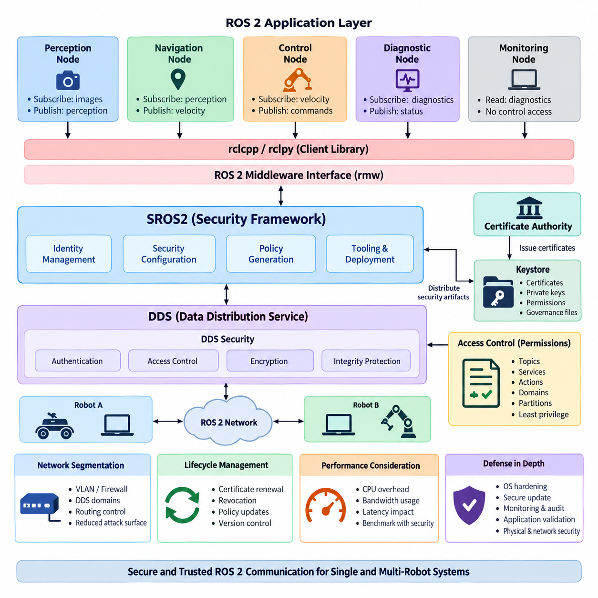
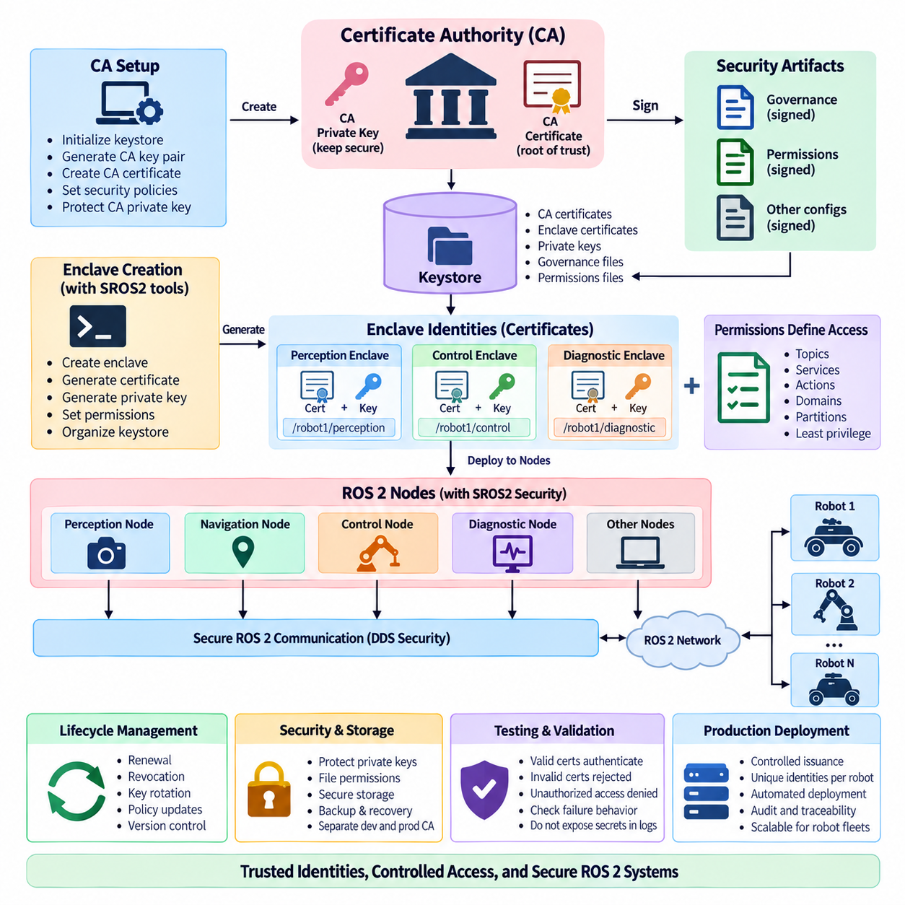
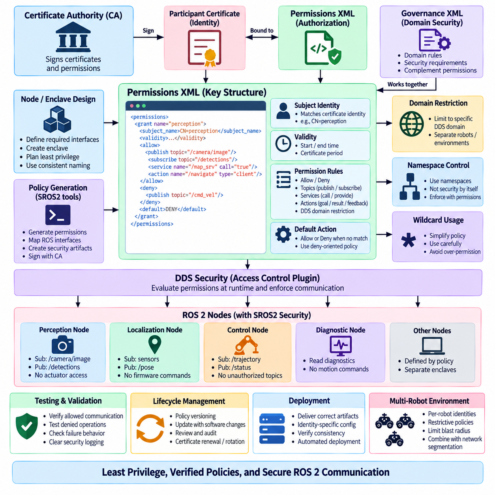
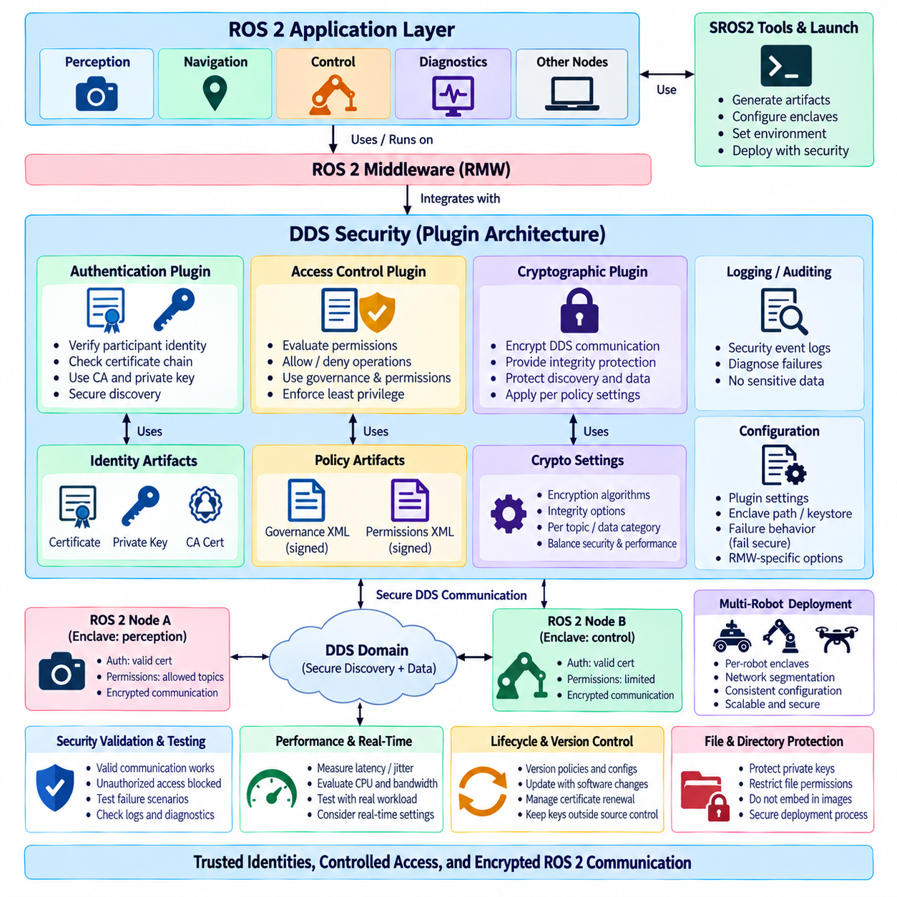
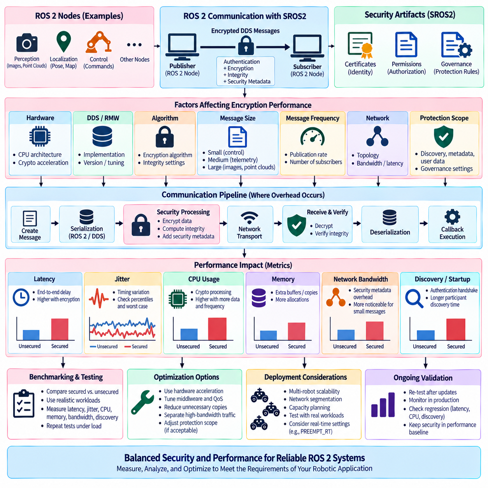
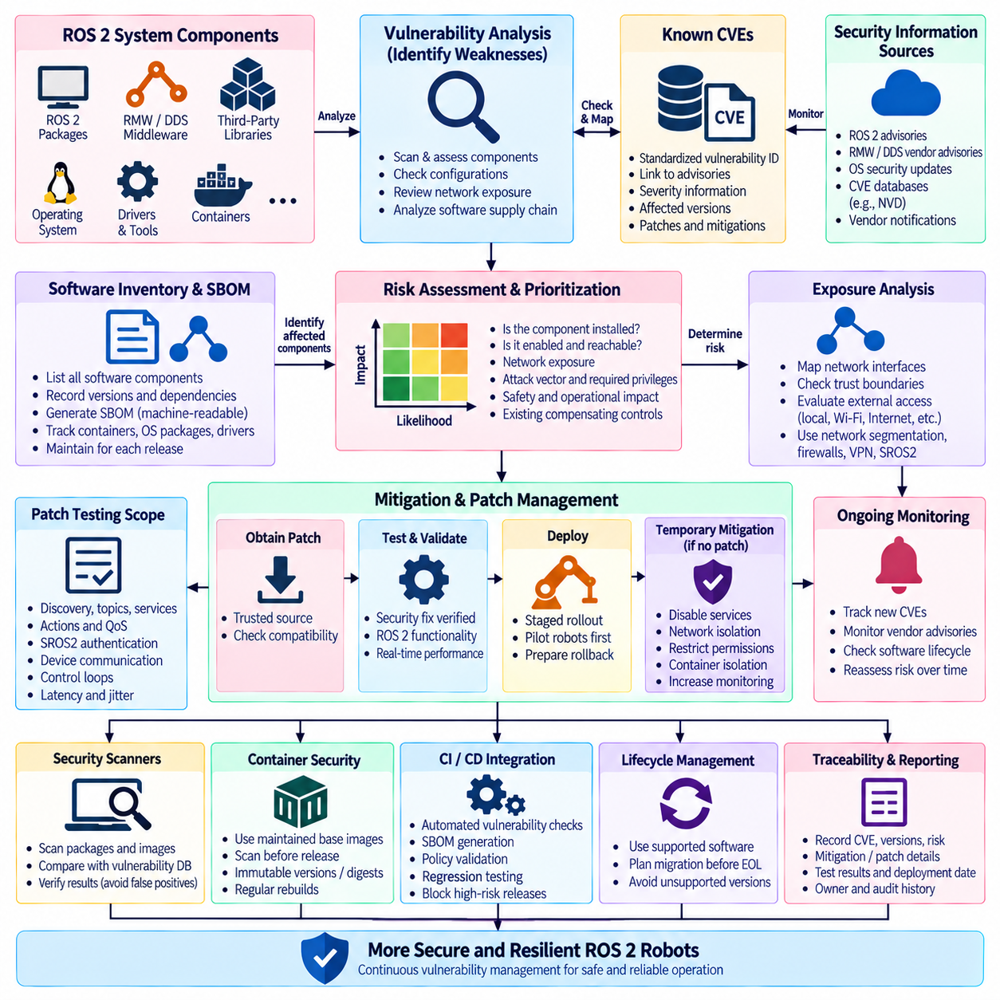
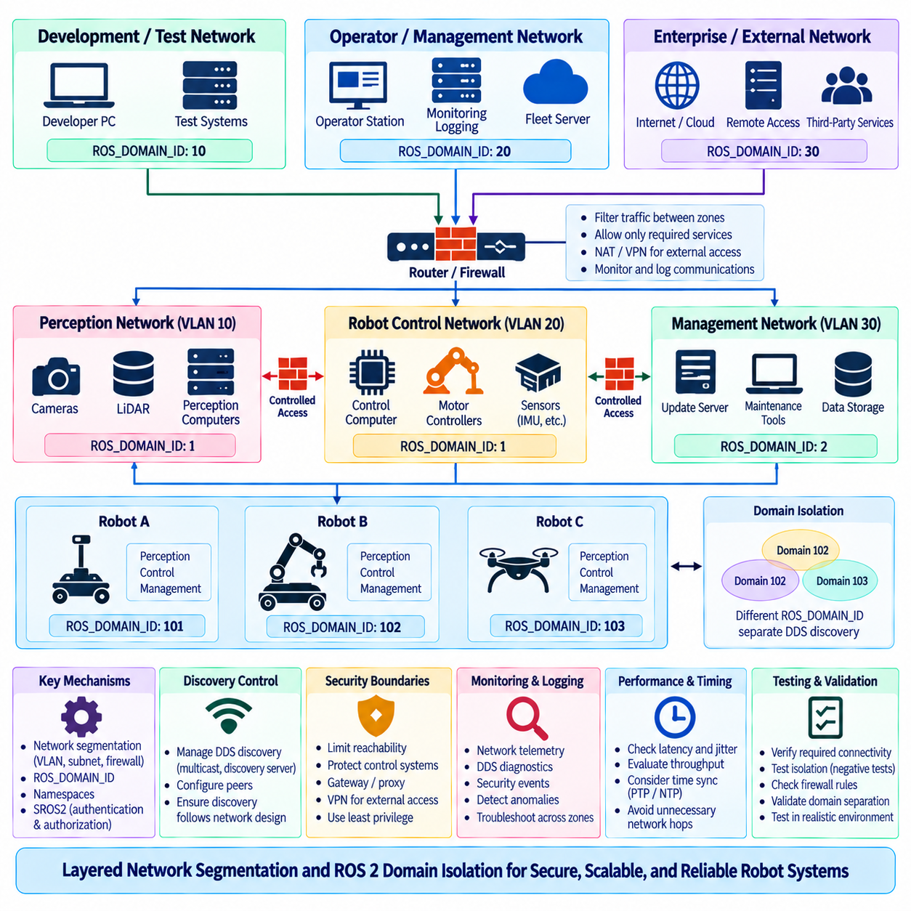
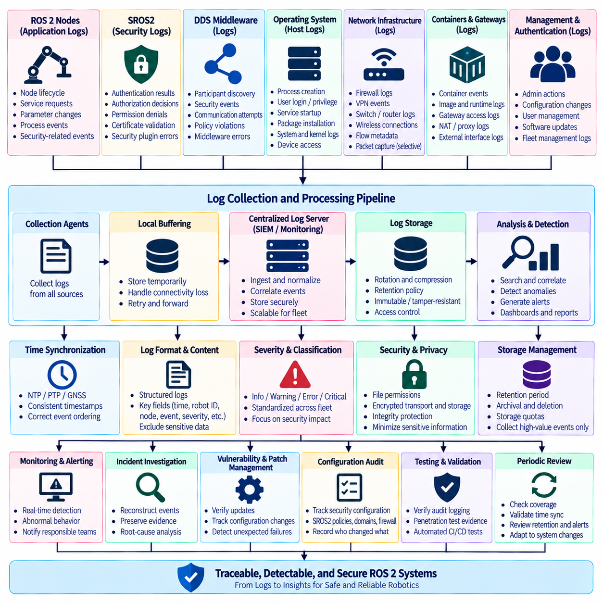
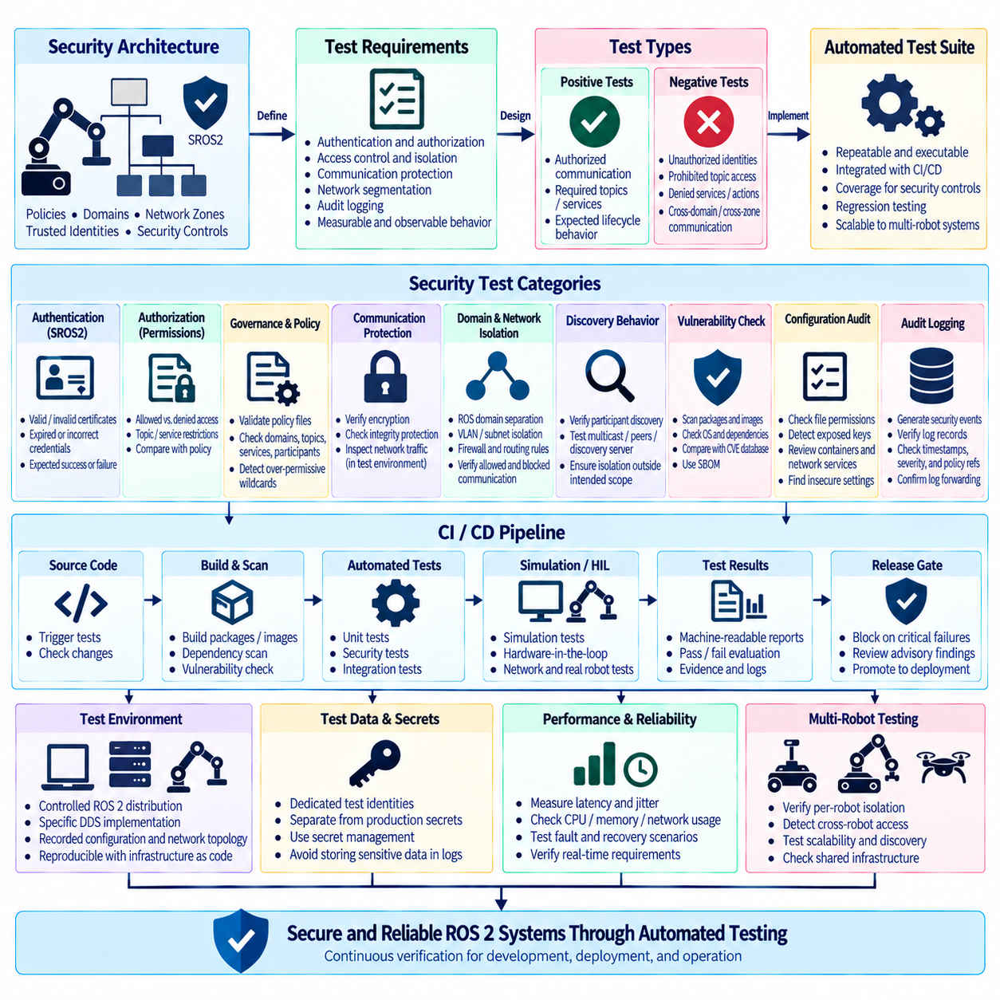
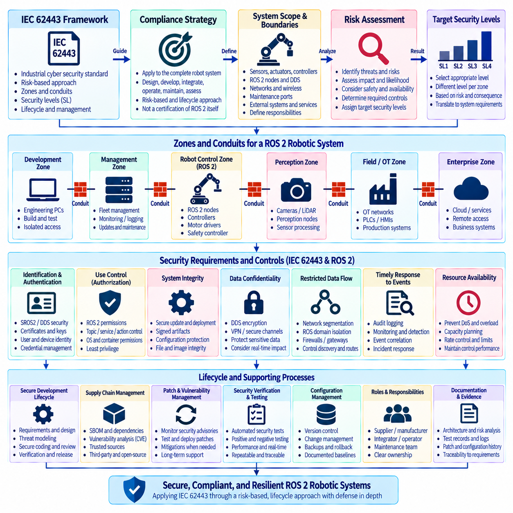

**Volume 05 Robot Middleware and ROS2**

# 06. ROS2 Security

## 06.01 SROS2 Security Architecture Overview

{width="7.268055555555556in" height="7.268055555555556in"}

SROS2 is the security framework used to expose and manage the security capabilities of the ROS 2 communication architecture. Rather than introducing an independent security transport, SROS2 builds on the DDS Security standard beneath ROS 2 and provides ROS-oriented tools for identity creation, security configuration, access-control policy generation, and deployment of security artifacts. Its purpose is to make secure distributed robot communication practical within normal ROS 2 development and operation.

The architectural position of SROS2 is closely related to the layered structure of ROS 2. Application nodes communicate through client libraries such as rclcpp or rclpy, which interact with the ROS middleware interface and an underlying DDS implementation. Security enforcement ultimately occurs within DDS Security mechanisms, while SROS2 provides the tooling and conventions that allow ROS 2 developers to configure those mechanisms using ROS concepts such as nodes, topics, services, and actions.

A fundamental principle of this architecture is that every participating ROS 2 process should possess a verifiable digital identity. Identity is normally represented through certificates and private keys issued within a trusted public key infrastructure. When participants discover one another, authentication mechanisms can verify that they belong to the expected security environment before protected communication is established. This changes ROS 2 discovery from simple participant detection into authenticated distributed-system membership.

The trust foundation is commonly organized around a security enclave structure and a certificate authority. A certificate authority establishes the root of trust from which participant identities and permissions can be derived. Security artifacts are stored in a keystore and distributed to authorized robot computers or processes. Protecting this material is critical because possession of valid credentials may allow software to participate in otherwise protected ROS 2 communication domains.

Authentication alone does not determine what an authenticated participant is permitted to do. SROS2 therefore combines identity with authorization policies implemented through DDS Security access control. Permissions can constrain communication according to domains, topics, partitions, and other DDS entities. At the ROS 2 level, these controls can be mapped to application communication requirements so that a perception node, navigation component, actuator interface, or diagnostic process receives only the privileges required for its intended function.

This architecture supports the principle of least privilege. A camera-processing component, for example, may require permission to receive image data and publish perception results but should not automatically gain permission to publish velocity commands. Similarly, a monitoring application may need read access to diagnostics without authority to modify control parameters. Security policy therefore becomes part of the software architecture rather than merely a network-level mechanism surrounding an otherwise unrestricted ROS 2 graph.

Confidentiality and integrity protection form another major architectural layer. DDS Security cryptographic plugins can protect message exchanges so that unauthorized observers cannot easily inspect protected payloads and malicious modification can be detected. Depending on configuration, protection may be applied to communication data and selected protocol elements. Security design must therefore determine which information requires encryption, authentication, integrity protection, or combinations of these controls instead of treating every communication path identically.

SROS2 security is especially important because ROS 2 discovery creates a dynamic distributed graph. Nodes may start, stop, migrate between computers, or communicate across multiple network interfaces while DDS automatically discovers available participants and endpoints. Without security controls, this flexibility can enlarge the attack surface. With authenticated participants and explicit permissions, discovery remains dynamic while membership and communication privileges are constrained according to the deployed trust model.

A practical SROS2 deployment can therefore be understood as several cooperating security functions rather than a single encryption feature. Identity establishes who a participant is, authentication verifies that identity, access control determines what communication is allowed, cryptographic protection secures selected data exchanges, and governance rules define broader security behavior. Keystores, certificates, permissions, governance files, and runtime environment configuration collectively translate these functions into an operational ROS 2 system.

Security enclaves provide an important abstraction between application architecture and credential management. Instead of assuming that every ROS 2 node must always have an entirely independent security configuration, deployments can organize processes according to security boundaries appropriate to their execution model. The enclave concept is particularly useful when nodes are composed into common processes, deployed in containers, or grouped by subsystem, because the security boundary can reflect the actual operational trust boundary.

This also means that node architecture and process architecture must be considered together. ROS 2 composition can place multiple components inside one process for reduced communication overhead, but components sharing a process may also share security context. A system designer should therefore avoid assuming that logical node separation automatically provides an equivalent security boundary. Performance-oriented composition decisions and security-oriented isolation decisions must be evaluated together during system architecture design.

SROS2 should also be distinguished from complete robot cybersecurity. It protects important ROS 2 and DDS communication paths, but it does not independently secure the operating system, boot chain, container runtime, Ethernet infrastructure, wireless network, cloud API, firmware, physical interfaces, or application logic. A production robot therefore requires defense in depth in which SROS2 operates alongside host hardening, network segmentation, credential protection, secure update mechanisms, monitoring, and application-level validation.

Network segmentation remains valuable even when DDS Security is enabled. Safety controllers, perception computers, operator interfaces, fleet gateways, development machines, and external services may have very different trust requirements. VLANs, firewalls, DDS domain separation, routing controls, and SROS2 permissions can provide complementary boundaries. Network controls reduce reachable attack surfaces, while SROS2 provides identity-aware protection closer to the ROS 2 communication objects themselves.

Operational security also requires lifecycle management of credentials and policies. Certificates eventually require renewal or replacement, compromised credentials may need revocation, and software updates can introduce new topics or services requiring revised permissions. Consequently, SROS2 configuration should be managed as version-controlled deployment material associated with the software release. Security policies that exist only as manually maintained files on individual robots become difficult to audit and unreliable across a large fleet.

Security configuration inevitably interacts with performance. Authentication increases startup and discovery work, while encryption, integrity checking, key management, and protected communication introduce computational and bandwidth overhead. The impact depends on hardware, DDS implementation, payload size, message frequency, network topology, and protection configuration. High-rate cameras, LiDAR streams, control messages, and low-bandwidth diagnostics therefore should not be assumed to experience identical security costs.

For real-time robotic systems, this performance relationship becomes particularly important. SROS2 does not convert ROS 2 into a deterministic safety network, and cryptographic protection can add latency variation to communication paths. Time-critical control loops should therefore be benchmarked with the intended security configuration enabled rather than measured in an unsecured development environment. Security requirements, latency budgets, CPU utilization, message rates, and failure behavior must be evaluated as one integrated system problem.

Failure handling is another architectural consideration. A participant may fail authentication because credentials are missing, expired, corrupted, or inconsistent with the deployed trust chain. Communication may also fail because permissions deny an endpoint that application developers expected to exist. Secure ROS 2 systems should distinguish these failures from ordinary network faults and expose sufficient diagnostics for operators to determine whether communication disappeared because of connectivity, discovery, authorization, or credential problems.

For multi-robot systems, SROS2 becomes part of a broader trust architecture spanning individual robots, fleet infrastructure, and operational networks. Credentials and permissions should prevent one compromised or incorrectly configured participant from automatically obtaining unrestricted access to every robot. Namespace conventions alone are not security boundaries. Identity, authorization, network segmentation, domain architecture, and fleet-level credential management must work together when ROS 2 communication extends beyond a single machine.

The chapter structure places this overview before detailed treatment of certificate-authority setup, permission XML, DDS Security configuration, encryption performance, vulnerability analysis, network segmentation, audit logging, automated security testing, and IEC 62443 strategy. SROS2 architecture should therefore be understood as the foundation connecting these later mechanisms into one security model rather than as an isolated configuration procedure.

Ultimately, SROS2 changes the security question from whether a machine can reach the ROS 2 network to whether a cryptographically identified participant is trusted and explicitly authorized to perform a particular communication operation. This identity-centered model is essential for production robots because modern ROS 2 systems are distributed across processors, containers, networks, edge computers, and fleet services. Secure architecture must preserve ROS 2 flexibility while deliberately limiting trust and communication authority.

## 06.02 CA Setup and Certificate Generation [w/Code]

{width="7.268055555555556in" height="7.268055555555556in"}

In SROS2, Certificate Authority setup establishes the root of trust used to authenticate ROS 2 participants and protect DDS-based communication. The CA issues cryptographic identities that allow nodes or security enclaves to prove their membership in a trusted robotic system. Because ROS 2 security ultimately relies on DDS Security, certificate generation is not merely an administrative task; it defines the identity foundation on which authentication, authorization, encryption, and secure discovery depend.

The SROS2 security environment is normally organized around a keystore that contains the cryptographic material required by secured ROS 2 processes. A keystore provides a structured location for certificates, private keys, governance information, permissions, and enclave-specific security artifacts. During development it may exist on one workstation, while production environments require controlled generation and distribution procedures so that sensitive private keys and signing credentials are not exposed unnecessarily.

Creating the keystore begins the Public Key Infrastructure, or PKI, lifecycle for the ROS 2 deployment. The security administrator defines where the keystore will reside and initializes the trust structure before generating participant identities. This structure should be treated as security-critical configuration rather than ordinary application data. Access permissions, backup procedures, storage protection, and ownership of the keystore must therefore be established before large numbers of robot identities are created.

At the center of this trust structure is the Certificate Authority, or CA. The CA possesses signing credentials that allow it to issue or validate certificates used by security enclaves. A certificate signed by the trusted authority establishes a cryptographic relationship between an identity and the security domain in which it operates. If the CA private key is compromised, an attacker may potentially create identities that appear legitimate, making protection of CA signing material one of the most important operational requirements.

SROS2 tooling simplifies the creation of this security infrastructure by providing ROS-oriented commands for keystore and enclave management. Instead of requiring developers to manually assemble every DDS Security artifact, the tools generate the expected directory structures and cryptographic files. This abstraction reduces configuration complexity while preserving the underlying DDS Security trust model. Developers should nevertheless understand what is generated because automated tooling does not eliminate the need for secure key handling.

A security enclave represents an execution identity within the SROS2 architecture. An enclave may correspond to a particular node, process, container, subsystem, or other operational security boundary depending on system design. When an enclave is created, SROS2 generates the security material necessary for that identity to participate in protected communication. The enclave name therefore becomes an important part of deployment architecture and should follow stable, predictable naming conventions.

Certificate generation typically creates an identity certificate together with an associated private key. The certificate contains information that can be presented to other DDS participants, while the private key must remain confidential to the entity that owns the identity. During authentication, cryptographic operations demonstrate possession of the corresponding private key without transmitting that key across the network. This enables participants to establish trust before application-level ROS 2 communication is accepted.

Identity certificates should not be confused with authorization permissions. A valid certificate answers the question of whether a participant possesses an identity trusted by the security infrastructure, but it does not automatically grant unrestricted communication rights. Permissions determine what the authenticated participant may publish, subscribe to, request, or otherwise access. Secure deployment therefore requires both correctly generated identities and appropriately restrictive authorization policies.

DDS Security also uses governance and permissions information alongside identity credentials. Governance configuration establishes security behavior for DDS domains and communication categories, while permissions documents describe operations available to particular identities. These artifacts are cryptographically signed so that unauthorized modifications can be detected. The resulting architecture creates a chain from the trusted authority through signed security documents to the participant that uses them at runtime.

Certificate generation must therefore be integrated with policy generation rather than treated as an isolated operation. A newly created enclave may possess valid cryptographic credentials but still require permissions corresponding to its ROS 2 interfaces. For example, a localization component may need to subscribe to sensor data and publish pose information, while an actuator controller requires a substantially different policy. Identity naming and communication policy should consequently be designed together.

Runtime configuration connects the generated security artifacts to ROS 2 execution. The system must know that security enforcement is enabled and which enclave or keystore context should be used by the process. If paths, enclave identities, environment settings, or security files are inconsistent, nodes may fail to authenticate or discover one another even though ordinary unsecured ROS 2 communication would have worked. Deployment automation should therefore validate security configuration before starting the complete robot stack.

File-system protection is especially important for private keys. Certificates are designed to be shared as part of authentication, whereas private keys represent secret credentials and should be accessible only to authorized processes and administrators. On production robots, operating-system permissions, protected storage, container isolation, secure boot mechanisms, or hardware-backed key storage may complement SROS2. Copying complete development keystores indiscriminately across robots can undermine otherwise strong cryptographic protection.

A development CA and a production CA should also be considered different operational assets. Development environments frequently require repeated creation and removal of identities, whereas deployed robots need controlled issuance and traceability. Separating these environments reduces the possibility that experimental credentials gain unintended production access. Production signing keys can additionally be maintained on more strongly protected systems rather than being permanently available on every engineering workstation or robot.

Large robot fleets require systematic certificate naming and ownership rules. Identities may need to represent robot units, computing modules, containers, fleet services, operator stations, or functional subsystems. Without a consistent convention, determining which certificate belongs to which operational component becomes difficult. A structured identity model also supports auditing because administrators can associate observed DDS participants with expected software functions and deployment locations.

Certificate lifecycle management continues after initial generation. Credentials can expire, systems can be replaced, private keys can become suspected of compromise, and authorization requirements can change as robot software evolves. Organizations therefore need procedures for certificate renewal, replacement, revocation, and redistribution. Certificate validity periods should reflect operational realities rather than being chosen solely to avoid maintenance, because excessively long-lived credentials increase exposure when keys are lost or compromised.

Key rotation provides another mechanism for limiting long-term credential exposure. New keys and certificates can be issued periodically or after security-sensitive events, while old credentials are removed from active deployment. Rotation procedures must be tested carefully because inconsistent credentials across distributed ROS 2 systems can prevent authenticated discovery. Fleet-scale systems therefore benefit from automated inventory and deployment mechanisms capable of tracking which security artifacts are installed on each robot.

Backup of CA and keystore material requires a different approach from ordinary source-code backup. Losing essential signing material may make future certificate management difficult, but casually replicating private keys creates additional compromise opportunities. Backups should therefore be encrypted, access-controlled, and stored according to the importance of the keys they contain. Recovery procedures should also be tested so that a security infrastructure failure does not leave deployed robots permanently unable to receive valid credentials.

Certificate generation should be reproducible at the process level without making secret keys reproducible themselves. Configuration, naming conventions, policy templates, scripts, and deployment procedures can be maintained under version control, while generated private keys should remain outside ordinary repositories. This separation enables engineers to reconstruct the security environment through controlled procedures without exposing sensitive cryptographic material through Git histories, build artifacts, container images, or shared development directories.

Containerized ROS 2 deployment introduces additional credential-management considerations. Embedding long-lived private keys directly inside reusable container images is undesirable because every image copy may contain the same secret. A stronger pattern is to provide required security artifacts to the container at deployment time through protected mounts or secret-management mechanisms. The container can then remain reproducible while the identity assigned to a particular robot or subsystem remains independently controlled.

Multi-robot systems increase the consequences of poor certificate architecture. Giving every robot identical credentials may simplify deployment, but it reduces the ability to identify, isolate, or revoke an individual compromised unit. Per-robot or appropriately scoped enclave identities provide finer-grained control. A fleet manager, robot controller, perception subsystem, and maintenance workstation can then possess distinguishable identities and permissions while remaining members of the same overall trust infrastructure.

Testing must verify more than successful secure communication. Engineers should confirm that valid participants authenticate correctly, invalid or unknown certificates are rejected, unauthorized operations are denied, corrupted security artifacts cause predictable failures, and missing credentials do not silently disable protection. Negative security tests are essential because a system that works with valid certificates has not yet demonstrated that its trust boundaries resist invalid participants.

Operational diagnostics should make certificate-related failures observable without exposing secret material. Logs can identify failed authentication, invalid permissions, certificate validity problems, enclave configuration errors, or inaccessible keystore files, but private keys and sensitive credential contents must never be written to diagnostic output. Clear error classification becomes especially valuable in fleets where an apparent ROS 2 discovery failure may actually originate from certificate or policy inconsistency.

The CA and certificate infrastructure ultimately establishes who is allowed to present a trusted identity inside the secured ROS 2 environment. Later SROS2 mechanisms build upon this foundation by defining what those identities may access and how their communication is cryptographically protected. A robust implementation therefore combines protected CA operation, controlled certificate generation, carefully scoped enclave identities, secure key distribution, lifecycle management, and systematic testing into one continuous security process.

## 06.03 Node Access Control Policy: Permission XML [w/Code]

{width="7.268055555555556in" height="7.268055555555556in"}

Node-level access control in SROS2 determines which communication operations an authenticated ROS 2 participant is authorized to perform. Authentication establishes identity, while access control limits the authority associated with that identity. Permission policies therefore define whether a security enclave may publish or subscribe to topics, invoke or provide services, use actions, or participate within specified DDS domains. This separation of identity and privilege is fundamental to least-privilege ROS 2 security.

SROS2 access control is built on the DDS Security Access Control Plugin and represents authorization rules through signed permissions documents. At runtime, the DDS implementation evaluates these rules before allowing protected communication endpoints to interact. SROS2 provides ROS-oriented tooling and policy abstractions so developers can describe required communication using familiar ROS concepts while ultimately producing security artifacts compatible with the underlying DDS Security architecture.

The permissions XML document is a central artifact in this mechanism. It associates a participant identity with one or more authorization grants and defines the conditions under which communication is allowed or denied. A grant typically identifies the certificate subject to which it applies, establishes a validity interval, contains permission rules, and specifies a default behavior for operations not explicitly matched. The resulting document expresses a machine-enforceable security contract for the participant.

The subject identity in a permissions grant must correspond to the identity represented by the participant certificate. This binding prevents a permissions document intended for one trusted participant from being arbitrarily reused by another identity. Certificate naming and permission-policy design should therefore be coordinated from the beginning of the security architecture. Inconsistent identity conventions can create difficult deployment failures when certificates authenticate correctly but no appropriate authorization grant matches them.

Permission rules can constrain access according to DDS domains. This is useful when multiple ROS 2 systems, development environments, robots, or operational zones use different domain identifiers. A participant may be authorized to operate only within a designated domain rather than receiving access across the entire DDS environment. Domain restrictions complement network segmentation and ROS domain configuration by adding cryptographically enforced authorization at the middleware security layer.

Publish and subscribe permissions represent the most direct mapping to ROS 2 topic communication. A perception enclave may be allowed to subscribe to camera data and publish detected-object information, while being denied authority to publish actuator commands. Conversely, a motion controller may subscribe to approved trajectory information and publish control status. Designing these rules around actual data flows prevents every authenticated component from becoming an unrestricted publisher or subscriber within the ROS 2 graph.

Services require additional consideration because ROS 2 service communication is implemented using DDS entities beneath the ROS abstraction. Similarly, actions use multiple communication channels for goals, results, feedback, status, and cancellation behavior. Policy authors should therefore avoid assuming that one visible ROS interface always corresponds to one DDS topic. SROS2 tooling helps translate ROS-oriented policies into the underlying communication rules required for topics, services, and actions.

Access-control policy should begin from the intended node interface rather than from an unrestricted ROS graph. Engineers should identify what information a component consumes, what information it produces, which services it calls or provides, and which actions it participates in. These communication requirements can then become an explicit allowlist. Starting with broad permissions and attempting to remove unnecessary access later often leaves privileges that were never required by the software.

This approach implements the principle of least privilege. A localization node needs sensor observations and may publish pose estimates, but it normally has no reason to issue firmware-update commands. A diagnostic process may read system status while requiring no authority over motion commands. An AI inference node may consume images and publish inference results without being permitted to modify navigation parameters. Permission XML turns these architectural distinctions into enforceable middleware rules.

Allow and deny rules provide mechanisms for expressing policy boundaries. An allow rule identifies communication that the participant may perform, whereas a deny rule explicitly prevents matching operations. Policy behavior also depends on the configured default action when no rule matches. Security-sensitive systems generally benefit from a deny-oriented posture in which only required communication is permitted, because newly introduced or unexpected interfaces do not automatically receive authorization.

Wildcard expressions can simplify policy definitions but must be used carefully. A wildcard may conveniently authorize a family of related topics or namespaces, reducing repetitive configuration in large systems. However, overly broad patterns can unintentionally grant access to future topics that happen to match the same expression. Wildcards should therefore represent intentional security groupings rather than merely serving as a shortcut for avoiding detailed interface analysis.

Namespaces are useful for organizing multi-robot ROS 2 graphs, but namespace separation by itself is not an authorization mechanism. Robots such as \`/robot1\` and \`/robot2\` may have logically separated interfaces while still sharing network and DDS infrastructure. Permissions can reinforce this architecture by limiting a robot-specific enclave to communication associated with its intended interfaces. This becomes particularly important when many robots operate within shared fleet infrastructure.

Security enclaves provide the identity context against which these permissions are enforced. Multiple nodes may share an enclave when they intentionally belong to the same trust boundary, while security-sensitive components can be assigned separate enclaves with narrower privileges. The appropriate granularity depends on process composition, deployment architecture, performance, and threat assumptions. Combining unrelated components into one broadly privileged enclave can weaken the isolation that node-level policy is intended to provide.

Permissions documents must be protected against unauthorized modification. DDS Security therefore relies on cryptographic signatures so participants can verify that authorization information originates from a trusted authority and has not been altered. Editing an XML file after it has been signed is not equivalent to updating a valid policy; the modified artifact must pass through the appropriate signing process again. Policy generation and signing should consequently be managed as a controlled deployment workflow.

Governance and permissions play different but complementary roles. Governance configuration defines broader security requirements for DDS domains and communication categories, such as whether authentication or cryptographic protection is required. Permissions define what a particular authenticated identity may do within those constraints. A deployment can therefore have strong domain-level security requirements while assigning different communication privileges to perception, navigation, control, diagnostics, fleet services, and operator interfaces.

Policy versioning becomes important as ROS 2 software evolves. Adding a new topic, changing a namespace, introducing a service, or restructuring an action interface can cause existing permissions to reject communication that previously worked. Security policy should therefore be treated as part of the software interface contract and maintained alongside application changes. Version-controlled policy sources also make it possible to review when privileges were introduced, modified, or removed.

Automated policy generation can reduce manual errors, particularly in systems containing many nodes and interfaces. However, generating policies by observing an application that runs with unrestricted privileges can capture unnecessary or temporary communication. Generated policy should therefore be reviewed against the intended architecture rather than accepted automatically. The objective is not merely to reproduce everything observed during testing, but to authorize only the communication required for legitimate operation.

Testing should verify both permitted and prohibited behavior. Positive tests confirm that authorized publishers, subscribers, services, and actions continue to operate when SROS2 enforcement is enabled. Negative tests deliberately attempt operations that the participant should not perform and confirm that the middleware rejects them. Without negative testing, a policy may appear operationally correct while still containing excessive permissions that significantly weaken the security boundary.

Permission failures can resemble ordinary ROS 2 communication problems. A publisher may exist but fail to communicate with a subscriber, or a service client may be unable to reach an apparently available server because the security policy rejects the required DDS endpoint. Diagnostics should therefore distinguish discovery, network, authentication, and authorization failures. Clear security logging greatly reduces troubleshooting time when deploying complex permission sets across multiple computers or robots.

Access control also affects deployment automation. Each robot or subsystem must receive the correct certificate, private key, permissions, governance information, and enclave configuration as a consistent security package. Mixing credentials from one identity with permissions intended for another can cause authentication or authorization failure. Fleet deployment systems should therefore treat security artifacts as identity-specific configuration and verify their consistency before activating a software release.

In multi-robot environments, carefully scoped policies help contain compromised components. If a perception process on one robot is compromised, its permissions should not automatically allow it to command every robot or access unrelated fleet services. Per-robot, per-subsystem, or function-specific identities combined with restrictive policies reduce this potential blast radius. Network segmentation and DDS domain design can then provide additional layers around the SROS2 authorization boundary.

Permission XML should ultimately be viewed as an executable representation of the robot communication architecture. It translates architectural statements such as "perception may publish detections but cannot command motion" into rules enforced by the middleware. Effective SROS2 access control therefore requires more than correct XML syntax: it requires accurate interface modeling, stable identity conventions, least-privilege design, signed policy artifacts, controlled deployment, version management, and continuous positive and negative security validation.

## 06.04 DDS Security Plugin Configuration [w/Code]

{width="7.268055555555556in" height="7.268055555555556in"}

DDS Security provides the middleware-level security foundation used by SROS2 to protect ROS 2 distributed communication. Instead of implementing authentication, authorization, and encryption directly inside ROS 2 application nodes, DDS Security defines standardized plugin interfaces that operate beneath the ROS middleware layer. Configuring these plugins determines how participants establish trust, enforce permissions, protect messages, and securely discover one another within a DDS domain.

The DDS Security architecture separates security responsibilities into several cooperating plugins. The Authentication Plugin verifies participant identities, the Access Control Plugin determines which DDS operations those identities may perform, and the Cryptographic Plugin protects communication through encryption and integrity mechanisms. Additional logging-related capabilities can support security auditing. SROS2 coordinates the configuration artifacts required by these mechanisms so ROS 2 applications can use them without directly implementing cryptographic protocols.

The Authentication Plugin establishes whether a discovered DDS participant represents a trusted identity. Participants present identity certificates issued by a trusted Certificate Authority and demonstrate possession of the corresponding private keys. The authentication process verifies certificate chains and cryptographic evidence before protected communication proceeds. This mechanism prevents simple network connectivity or DDS discovery alone from being sufficient to participate as a trusted member of the secured ROS 2 system.

Authentication configuration therefore depends on correctly deployed identity artifacts. Each security enclave requires an identity certificate, private key, and trusted CA certificate appropriate to its security environment. These files must correspond to one another and remain accessible to the DDS implementation at runtime. Incorrect paths, mismatched certificates and keys, invalid certificate chains, or expired credentials can cause authentication failure even when the underlying ROS 2 network and DDS discovery mechanisms are otherwise functioning correctly.

The Access Control Plugin operates after identity has been established and evaluates whether the authenticated participant is authorized to perform specific DDS operations. Its behavior is governed primarily by signed governance and permissions documents. Governance defines security requirements that apply broadly to domains and communication categories, while permissions associate participant identities with allowed or denied operations. Together they transform authenticated membership into controlled communication authority.

Governance configuration determines important domain-level security behavior. It can specify whether participant authentication is required and what protection should apply to discovery information or user data. Different communication categories may therefore receive different security treatment depending on operational requirements. Governance should be designed as a system-wide security policy because inconsistent expectations between participants can prevent communication or create unintended differences in protection across the distributed system.

Permissions configuration provides finer-grained authorization for individual identities or enclaves. Rules can restrict publication, subscription, domains, partitions, and communication associated with ROS 2 interfaces. SROS2 translates ROS-oriented policy definitions into artifacts understood by DDS Security. A control enclave can therefore receive authority required for motion interfaces while a diagnostic enclave receives only monitoring-related privileges. This realizes least privilege at the middleware communication boundary.

The Cryptographic Plugin provides confidentiality and integrity protection for DDS communication according to the configured security policy. Encryption can prevent unauthorized observers from interpreting protected payloads, while message authentication and integrity mechanisms help detect unauthorized modification. Cryptographic processing is applied within DDS rather than requiring each ROS 2 node to implement its own encryption scheme, allowing security behavior to remain consistent across compatible middleware participants.

Cryptographic configuration should reflect the sensitivity and timing characteristics of robot data. Control commands, operational credentials, maps, perception information, diagnostic data, and high-bandwidth sensor streams may have different confidentiality and integrity requirements. Applying maximum protection indiscriminately can introduce unnecessary computational and bandwidth cost, while insufficient protection can expose critical information. Security architecture should therefore connect data classification, threat analysis, and performance requirements to DDS protection settings.

DDS discovery also requires careful security treatment because discovery exchanges reveal participants and communication endpoints before normal application traffic begins. Secured discovery allows participants to authenticate one another and establish protected communication relationships dynamically. However, authentication handshakes and cryptographic operations add work to participant startup. Systems containing many nodes or robots should therefore evaluate discovery behavior under realistic secured deployment conditions rather than extrapolating from unsecured ROS 2 tests.

SROS2 runtime configuration connects ROS 2 processes to these DDS Security plugins and their artifacts. The runtime environment must enable ROS security, identify the appropriate keystore or enclave, and specify how failures should be handled. When security enforcement is enabled, missing or invalid artifacts should cause communication to fail rather than silently reverting to unsecured operation. This fail-secure behavior is important because an unnoticed fallback could leave a production robot communicating without the expected protection.

The relationship between SROS2 and the ROS middleware implementation must also be considered. ROS 2 can operate through different DDS-based RMW implementations, and the practical configuration details and supported security behavior may vary between middleware products and versions. Security validation should therefore be performed using the exact RMW implementation intended for deployment. A configuration verified with one DDS implementation should not automatically be assumed to behave identically with another.

Security plugin configuration should be integrated with ROS 2 launch and deployment architecture. Nodes running in separate processes may use distinct security enclaves, while composed nodes can share process-level security context depending on deployment design. Containers introduce another boundary because credentials and security artifacts must be supplied securely at runtime. The selected enclave structure should therefore reflect actual process isolation, application responsibilities, and desired least-privilege boundaries.

File and directory protection remains essential even though DDS Security provides strong communication protection. Identity private keys, CA material, permissions files, and other security artifacts should be readable only by authorized users and processes. Private credentials should not be embedded carelessly into source repositories, generic container images, or shared filesystem locations. Communication encryption cannot compensate for an attacker obtaining the private keys used to establish trusted identities.

Configuration consistency is particularly important in distributed robot systems. Certificates, governance rules, permissions, enclave names, domain identifiers, and runtime settings must form a coherent security configuration across communicating participants. A small mismatch can manifest as discovery failure, rejected endpoints, or apparently missing ROS 2 topics and services. Automated deployment should therefore validate artifact identity, signatures, paths, validity periods, and policy versions before starting secured applications.

Security logging provides the observability required to diagnose these failures. Authentication rejection, permission denial, invalid signatures, certificate expiration, cryptographic negotiation problems, and configuration errors should be distinguishable from ordinary packet loss or network connectivity failures. Logs should contain enough context to identify the security stage that failed while never exposing private keys or other sensitive credential material. Centralized logging becomes especially valuable in multi-robot deployments.

Performance evaluation must be performed with the complete DDS Security configuration enabled. Authentication affects participant startup and discovery, encryption consumes CPU resources, integrity protection adds processing, and security metadata can increase network traffic. The effect varies with message size, publication frequency, processor capability, middleware implementation, and network topology. Camera and LiDAR streams may exhibit different overhead characteristics from low-rate control or diagnostic messages.

Real-time ROS 2 systems require additional attention because average latency alone does not describe security impact. Engineers should measure latency distributions, jitter, CPU utilization, scheduling interference, discovery time, and communication behavior under load. Security operations should be tested together with PREEMPT_RT, executor configuration, memory management, and the intended DDS QoS policies when those mechanisms form part of the production architecture. Security and real-time performance cannot be validated independently.

Failure-mode testing should intentionally exercise incorrect configurations. Tests can use invalid certificates, mismatched keys, expired credentials, modified governance files, unauthorized publishers, incorrect enclave assignments, or incompatible security settings and verify that DDS Security rejects them predictably. These negative tests demonstrate that plugin enforcement actually protects the communication boundary instead of merely confirming that correctly configured participants can communicate successfully.

Multi-robot deployments increase both configuration scale and security consequences. Each robot may contain multiple enclaves while also communicating with fleet managers, operator stations, edge computers, and external gateways. Reusing unrestricted identities across the fleet simplifies configuration but increases the impact of compromise. Per-robot and function-specific identities, restrictive permissions, network segmentation, and appropriate DDS domain boundaries can collectively reduce the accessible attack surface.

Security configuration should therefore be maintained as version-controlled infrastructure associated with each software release. Policy sources, governance definitions, enclave mappings, deployment scripts, and validation procedures can be reviewed and reproduced, while private keys remain outside ordinary source control. Changes to ROS interfaces should trigger corresponding security-policy review because a newly introduced topic, service, or action may require explicit authorization before it can operate in the secured system.

DDS Security Plugin configuration ultimately transforms SROS2 policy and PKI artifacts into active runtime protection. Authentication determines who may establish trusted participation, access control determines what that identity may communicate, and cryptographic mechanisms determine how protected information is exchanged. Reliable ROS 2 security emerges when these plugins are configured as one coordinated system and combined with protected credentials, controlled deployment, diagnostics, performance validation, and continuous security testing.

## 06.05 ROS2 Communication Encryption Performance Impact

{width="7.268055555555556in" height="7.268055555555556in"}

Encryption in ROS 2 communication introduces a measurable performance cost because security processing is added to the normal DDS data path. With SROS2 and DDS Security enabled, participants may authenticate peers, apply cryptographic transformations, calculate integrity information, and process additional security metadata. The resulting overhead affects latency, jitter, CPU utilization, memory activity, network bandwidth, and discovery time, making security performance an architectural concern for real-time robotic systems.

The magnitude of encryption overhead is not represented by a single universal percentage. It depends on processor architecture, DDS implementation, cryptographic algorithm, payload size, publication frequency, number of subscribers, network topology, and enabled protection scope. A benchmark measured on a workstation with small messages cannot be directly applied to an embedded controller transmitting camera or LiDAR streams. Security performance must therefore be characterized under the actual target configuration.

Message size strongly influences the observed cost. For small control messages, fixed cryptographic and middleware processing can represent a significant fraction of total transmission latency even though the absolute processing time is small. For large sensor messages, encryption must process considerably more data, increasing CPU and memory bandwidth consumption. Consequently, command traffic, telemetry, images, point clouds, and maps can exhibit substantially different performance behavior under identical DDS Security settings.

Message frequency is equally important because cryptographic operations accumulate as publication rates increase. A low-rate diagnostic topic may introduce negligible system load, while hundreds or thousands of secured messages per second can create significant processor demand. High-frequency control loops are particularly sensitive because additional processing may consume part of the available timing budget. Benchmarking should therefore reproduce both realistic message sizes and realistic publication frequencies rather than evaluating isolated packets.

End-to-end latency should be measured from the application perspective whenever possible. The relevant value is not simply the execution time of an encryption primitive but the delay from publication through serialization, DDS processing, security transformation, transport, receiving-side verification, deserialization, and callback execution. Comparing secured and unsecured configurations under identical conditions reveals the incremental cost introduced by security while preserving the complete ROS 2 communication path.

Average latency alone is insufficient for real-time analysis. Robotic control systems are frequently more sensitive to latency variation and worst-case behavior than to small changes in the mean. Encryption and integrity operations can interact with thread scheduling, cache activity, memory allocation, middleware queues, and competing workloads. Measurements should therefore include latency distributions, percentiles, maximum observed delay, and jitter so that security-induced timing variability is visible rather than hidden by averages.

CPU utilization provides another important indicator of encryption impact. Cryptographic processing consumes execution resources on both transmitting and receiving systems, and the effect increases with traffic volume and the number of protected endpoints. Modern processors may provide hardware acceleration for common cryptographic operations, substantially reducing overhead. Embedded processors and heavily loaded edge computers may have less available capacity, making the same security configuration more consequential for application scheduling.

Memory behavior can also influence secured communication performance. DDS processing already requires serialization buffers, middleware queues, and transport buffers, while security mechanisms may introduce additional temporary data or transformations. Extra copying and allocation can increase memory bandwidth demand and produce timing variation. Systems designed for deterministic execution should therefore examine allocation behavior and data movement rather than assuming that encryption cost is purely a CPU arithmetic problem.

Network bandwidth may increase because protected DDS communication carries security-related metadata in addition to application payloads. For large messages this overhead can be relatively small compared with the payload, whereas for small frequent messages the proportional increase may be more noticeable. When multiple subscribers receive secured data, network load can increase further. Bandwidth measurements should therefore consider complete packet traffic rather than only the nominal ROS message payload size.

Discovery and startup performance form a separate category from steady-state data transfer. Secure DDS participants must establish identity and negotiate protected relationships before ordinary communication can proceed. Authentication exchanges, certificate verification, and security handshakes can increase participant discovery time. This may be unimportant for continuously operating systems but significant when nodes restart frequently, robots dynamically join a fleet, or recovery requirements demand rapid reconnection after faults.

Protection scope has a direct relationship with performance. DDS Security can apply protection to participant interactions, discovery information, metadata, and user data according to governance configuration. Stronger protection generally performs more security work, although the actual cost depends on implementation. The objective should not be to disable protection for performance alone, but to identify which information requires confidentiality, integrity, or authentication and apply controls consistent with the system threat model.

Different DDS and RMW implementations can produce different performance characteristics even when they support comparable security concepts. Internal buffering, threading models, serialization paths, transport configuration, and cryptographic integration influence measured overhead. Security benchmarking should therefore identify the exact ROS 2 distribution, RMW implementation, DDS vendor and version, operating system, kernel configuration, hardware platform, and security settings so that results are reproducible and meaningful.

DDS Quality of Service settings also interact with encrypted communication. Reliability, history depth, durability, deadline, and other QoS behavior can change queueing, retransmission, memory consumption, and traffic patterns. Encryption overhead measured with best-effort communication may differ from reliable communication under packet loss or congestion. Security performance should consequently be evaluated with the same QoS profiles intended for the production robot rather than with simplified benchmark defaults.

Real-time operating-system configuration further changes the interpretation of results. PREEMPT_RT, CPU affinity, thread priorities, interrupt handling, and executor scheduling can determine whether additional security processing causes unacceptable interference. A cryptographic operation that appears inexpensive in average measurements may still delay a critical callback when scheduled on the same CPU core. Security benchmarking should therefore be integrated with the complete real-time scheduling architecture.

A useful benchmark methodology compares an unsecured baseline against one or more secured configurations while holding all other variables constant. Identical payloads, rates, QoS profiles, network conditions, executors, and hardware should be used. Measurements can then quantify changes in latency, jitter, throughput, CPU utilization, memory usage, network traffic, and discovery time. Repeated trials and sufficiently long test durations are necessary to distinguish persistent security overhead from ordinary system noise.

Benchmark workloads should represent multiple communication classes rather than a single synthetic topic. Small high-rate control messages, medium telemetry data, service interactions, and large camera or point-cloud payloads exercise different parts of the communication stack. Multi-publisher and multi-subscriber tests can reveal contention that point-to-point benchmarks miss. A representative workload provides more useful engineering evidence than one headline number describing "ROS 2 encryption overhead."

System load must also be considered because production robots rarely execute communication benchmarks in isolation. Perception inference, localization, planning, logging, visualization, and device drivers compete for CPU, memory, and network resources. Encryption tests should therefore include both idle-system measurements and realistic concurrent workloads. The difference can reveal whether security processing remains predictable when the robot approaches its expected operational resource utilization.

For high-bandwidth perception pipelines, architecture can sometimes reduce unnecessary security processing without weakening required boundaries. Large sensor streams that remain within a trusted local computing boundary may have different protection requirements from commands transmitted between computers or across external networks. Such decisions must follow threat analysis and deployment assumptions rather than performance convenience. Network segmentation and host isolation may complement communication-level cryptographic protection.

Multi-robot systems amplify encryption cost because the number of secure relationships and communication flows can grow substantially. Fleet managers, edge servers, operator stations, and robots may exchange status, missions, maps, telemetry, and coordination information simultaneously. Testing only one publisher and one subscriber can therefore underestimate production behavior. Fleet-scale benchmarks should increase participant count and traffic concurrency while observing discovery scalability, processor load, bandwidth, and latency stability.

Performance optimization should begin only after measurement identifies the actual bottleneck. Possible improvements may involve hardware cryptographic acceleration, CPU affinity, middleware tuning, QoS adjustment, reducing unnecessary message copies, separating high-bandwidth traffic, or changing protection scope where the threat model permits it. Disabling security globally because one benchmark shows increased latency is rarely a sound engineering response; optimization should preserve required security properties while recovering timing margin.

Security performance must also be incorporated into capacity planning. CPU and network resources should not be sized assuming unsecured ROS 2 behavior if the production system will operate with DDS Security enabled. Sufficient margin should remain for encryption, authentication, transient traffic bursts, software updates, and workload growth. This is particularly important for edge platforms where perception and AI inference may already consume a large fraction of available computational resources.

Regression testing is necessary because encryption performance can change after middleware upgrades, ROS 2 distribution changes, security-policy modifications, operating-system updates, or application restructuring. A benchmark suite integrated into continuous testing can detect unexpected increases in latency, jitter, CPU load, or discovery time. Security configuration should therefore be treated as part of the performance baseline rather than as a feature enabled only after system optimization has been completed.

Ultimately, the performance impact of ROS 2 communication encryption is a system-level tradeoff between required protection and available timing and computational resources. The correct engineering objective is not zero security overhead, but predictable overhead that remains inside defined performance budgets. By measuring realistic secured workloads, analyzing latency and jitter as well as throughput, and validating the complete target platform, SROS2 security can be integrated without sacrificing the operational requirements of the robotic system.

## 06.06 ROS2 Vulnerability Analysis: Known CVEs and Patches

{width="7.268055555555556in" height="7.268055555555556in"}

ROS 2 vulnerability analysis is the systematic process of identifying weaknesses across the software, middleware, operating system, network, and deployment components that form a robotic system. A vulnerability may exist in ROS 2 packages, DDS/RMW implementations, third-party libraries, containers, drivers, or system services. Effective analysis therefore treats the complete software supply chain as the security boundary rather than examining ROS 2 application code in isolation.

A Common Vulnerabilities and Exposures identifier, or CVE, provides a standardized reference for publicly disclosed security vulnerabilities. CVE records help engineering teams correlate affected software versions with vendor advisories, severity information, patches, and mitigation guidance. A CVE identifier alone does not determine actual robot risk, however. Exploitability depends on whether the vulnerable component is installed, enabled, reachable, configured in an affected mode, and exposed to a realistic attacker.

Vulnerability management should begin with an accurate software inventory. The inventory should identify the ROS 2 distribution, package versions, RMW implementation, DDS vendor and version, operating system packages, kernel, device drivers, cryptographic libraries, container images, development tools, and externally exposed services. Without this baseline, teams cannot reliably determine whether a newly disclosed CVE affects deployed robots or only software that is absent from the production configuration.

A Software Bill of Materials, or SBOM, strengthens this process by recording software components and dependencies in a machine-readable form. ROS 2 applications commonly depend on many packages that themselves rely on operating-system and third-party libraries. A vulnerability may therefore enter the robot through a transitive dependency rather than through a directly maintained ROS package. Maintaining an SBOM enables security teams to map vulnerability disclosures to the actual software composition of each release.

ROS 2 itself should be evaluated together with its underlying communication middleware. Because ROS 2 commonly uses DDS through the ROS Middleware interface, vulnerabilities in DDS discovery, serialization, transport, security plugins, or resource handling can affect ROS 2 communication even when application nodes contain no obvious defect. Security assessment should therefore track advisories for the selected ROS 2 distribution as well as the specific RMW and DDS implementation used in production.

Third-party dependencies require similar attention. Libraries for image processing, networking, compression, XML parsing, cryptography, logging, databases, and device communication may contain vulnerabilities independently of ROS 2. A robot that incorporates AI frameworks, web dashboards, remote management tools, or cloud clients expands this dependency surface further. Vulnerability analysis must therefore include all runtime components that can influence confidentiality, integrity, availability, or control behavior.

Known CVEs should be prioritized according to deployment context rather than severity score alone. A high-severity vulnerability in an unused library may present less immediate operational risk than a moderate vulnerability in a remotely reachable service connected to robot control. Prioritization should consider attack vector, required privileges, user interaction, exploit availability, network exposure, affected function, safety consequences, and whether compensating controls already limit access to the vulnerable component.

Network reachability is especially important in robotics. A vulnerability accessible only from localhost has a different threat profile from one exposed through Wi-Fi, Ethernet, VPN, fleet infrastructure, or an Internet-facing gateway. Engineers should map external interfaces and trust boundaries to determine how an attacker could reach vulnerable software. Network segmentation, firewalls, restricted ports, VPNs, and SROS2 authorization can reduce exposure while permanent remediation is being prepared.

Patch management converts vulnerability information into operational risk reduction. When a relevant security update becomes available, teams should identify the affected package, obtain the update from a trusted source, review compatibility requirements, and validate the patched system before deployment. Robot software often combines real-time control, middleware, hardware drivers, and AI workloads, so applying an update without testing can introduce functional or timing regressions even when the patch correctly fixes the security issue.

Patch testing should therefore include both cybersecurity and robotics behavior. Engineers should confirm that the vulnerability is removed or mitigated while also testing ROS 2 discovery, topics, services, actions, QoS behavior, SROS2 authentication, device communication, control loops, and application startup. Real-time systems should additionally measure latency and jitter after security-related updates. A patch that changes middleware or kernel behavior may affect timing even when application interfaces remain unchanged.

Not every vulnerability can be patched immediately. A vendor update may not yet exist, a new version may be incompatible with required hardware, or operational constraints may prevent immediate robot downtime. In these cases, temporary mitigation can reduce exposure through service disabling, network isolation, firewall rules, permission restrictions, feature deactivation, container isolation, or increased monitoring. Such mitigations should be documented as temporary controls and revisited when a permanent fix becomes available.

Security advisories should be monitored continuously because vulnerability status changes after a robot is deployed. Components considered secure at release time may later receive new CVEs, revised severity assessments, or improved exploit information. ROS 2 distributions and operating-system releases also have defined support lifecycles. Production systems should therefore use supported software where practical and establish a process for monitoring relevant ROS, middleware, operating-system, and dependency security announcements.

Vulnerability scanners can automate part of this workflow by comparing installed packages, container layers, or SBOM entries against vulnerability databases. Their results should not be treated as direct proof of exploitability. Scanners can produce false positives when version information is ambiguous or when distributions backport security fixes without changing upstream version numbers in the expected way. Findings therefore require verification against vendor package information and the actual deployment configuration.

Containerized ROS 2 systems introduce both opportunities and additional responsibilities. Container images can provide reproducible software baselines that simplify vulnerability scanning and controlled updates, but outdated base images may retain known vulnerable packages indefinitely. Images should be rebuilt regularly from maintained bases, scanned before release, and identified by immutable versions or digests. Production systems should avoid silently pulling uncontrolled image changes during robot startup.

Vulnerability analysis should distinguish vulnerability, exposure, exploitability, and impact. A CVE indicates a documented weakness, exposure describes whether the affected component is reachable, exploitability describes whether realistic conditions permit abuse, and impact describes the consequences if exploitation succeeds. Maintaining these distinctions prevents vulnerability management from becoming a simple exercise of counting CVEs and instead connects technical findings to meaningful robotic-system risk.

Robotic systems require particular attention to availability and physical consequences. A conventional information-system vulnerability may expose data or interrupt a service, while a compromised robot component can potentially influence navigation, motion, perception, or actuator behavior. Security triage should therefore consider whether exploitation could cross from information technology into operational or physical behavior. Components connected to command paths deserve especially careful review even when their network exposure appears limited.

SROS2 reduces some communication risks but does not eliminate software vulnerabilities. Authentication and access control can prevent unauthorized DDS participants from performing permitted operations, while encryption protects communication confidentiality and integrity. These mechanisms do not repair memory-safety defects, vulnerable parsers, insecure web services, compromised dependencies, or operating-system flaws. Vulnerability management and communication security must therefore operate as complementary layers within a defense-in-depth architecture.

Regression testing is essential after patch deployment. Automated tests should verify application functionality, ROS graph behavior, security policies, network interfaces, resource consumption, and timing-sensitive operations. Negative security tests can confirm that previously blocked communication remains blocked and that security enforcement has not been disabled by configuration changes. Maintaining a repeatable regression suite makes frequent security maintenance considerably safer for production robotic systems.

Patch deployment across a robot fleet requires controlled rollout. Updating every robot simultaneously can amplify the impact of an unexpected compatibility problem. A staged approach can validate updates on development systems, hardware-in-the-loop environments, selected pilot robots, and progressively larger deployment groups. Rollback packages and configuration backups should be prepared before rollout so that operational service can be restored if the patched software introduces unacceptable behavior.

Traceability should connect each vulnerability decision to evidence. A vulnerability record can document the affected component, CVE identifier, installed version, exposure assessment, mitigation, patch version, test results, deployment date, and responsible owner. This creates an auditable history explaining why a finding was patched, temporarily mitigated, accepted, or determined not to affect the system. Such records become increasingly important as robot fleets and software dependencies grow.

Continuous integration and deployment pipelines can incorporate vulnerability scanning, dependency checks, SBOM generation, policy validation, and regression testing before a release reaches robots. Security gates can prevent software containing unacceptable known vulnerabilities from progressing automatically into production. However, automated gates should use defined organizational criteria and verified evidence rather than blindly rejecting every reported CVE, because vulnerability relevance varies significantly with configuration and exposure.

End-of-life software represents a structural vulnerability-management problem because security patches may no longer be provided. Maintaining unsupported ROS distributions, operating systems, middleware versions, or libraries can gradually accumulate unresolved vulnerabilities. Lifecycle planning should therefore include migration strategies before support ends. Long-lived industrial robots require particular attention because their mechanical service life can substantially exceed the supported lifetime of their original software platform.

Ultimately, ROS 2 vulnerability analysis is a continuous engineering process connecting asset inventory, CVE monitoring, exposure assessment, risk prioritization, patch validation, controlled deployment, and regression testing. The objective is not simply to eliminate a numerical list of vulnerabilities, but to maintain a defensible security state throughout the robot lifecycle. Combining SROS2, network segmentation, supported software, timely patches, SBOM-based tracking, and verified operational testing provides a practical foundation for resilient ROS 2 deployment.

## 06.07 Robot Network Segmentation and ROS2 Domain Isolation

{width="7.268055555555556in" height="7.268055555555556in"}

Robot network segmentation is an architectural technique that divides a robotic communication environment into controlled network zones rather than allowing every device to communicate through one unrestricted network. In ROS 2 systems, segmentation can separate robots, sensors, control computers, operator stations, fleet servers, development systems, and external services. This reduces unnecessary connectivity and limits the paths available to faults, misconfiguration, or malicious activity.

ROS 2 communication commonly relies on DDS discovery and data exchange between distributed participants. Without deliberate network boundaries, participants sharing reachable infrastructure may discover communication endpoints beyond their intended operational scope. Network segmentation introduces infrastructure-level boundaries around these communication relationships. ROS 2 domain isolation adds a logical middleware boundary, allowing system designers to organize participants into communication groups according to robot, subsystem, mission, environment, or security function.

A ROS_DOMAIN_ID identifies the DDS domain used by a ROS 2 participant. Nodes configured with different domain identifiers normally participate in different DDS discovery spaces and therefore do not directly discover one another through ordinary DDS communication. This provides a convenient mechanism for separating development systems, robot groups, test environments, or independent applications. Domain IDs should consequently be assigned according to an intentional system architecture rather than selected independently by individual developers.

ROS 2 domain isolation should not be treated as equivalent to a cryptographic security boundary. A domain identifier organizes DDS communication but does not by itself authenticate participants or prevent a capable host from changing its configuration and joining another domain. Stronger isolation requires complementary mechanisms such as network segmentation, firewall policies, SROS2 authentication, access control, protected credentials, and secure routing. Domain separation is therefore one layer within a defense-in-depth architecture.

Physical and logical network segmentation can be implemented using separate interfaces, switches, VLANs, routed subnets, firewalls, wireless networks, or software-defined networking mechanisms. The appropriate technique depends on deployment scale and operational requirements. A small mobile robot may separate internal sensor traffic from external fleet communication, while an industrial robot fleet may use multiple VLANs and routed security zones to isolate control, perception, management, and enterprise connectivity.

A useful segmentation model separates safety- or control-sensitive traffic from less trusted communication. Motor controllers, real-time control computers, localization systems, and critical sensors can occupy a restricted robot-control zone, while operator interfaces, monitoring tools, software repositories, or cloud gateways reside in different zones. Communication between zones then passes through explicitly controlled interfaces. This prevents general-purpose services from automatically gaining unrestricted network access to motion-critical components.

High-bandwidth perception traffic can also benefit from architectural separation. Cameras, LiDARs, depth sensors, and perception computers may generate substantial continuous traffic that is unnecessary outside the local perception network. Keeping these streams within an appropriate segment reduces congestion on control and fleet networks while also limiting data exposure. Selected perception results, rather than all raw sensor data, can cross the boundary when required by navigation, monitoring, or higher-level intelligence.

Multi-robot systems require particularly careful domain planning because robot count increases both discovery traffic and the number of potential communication relationships. One strategy is to assign independent ROS 2 domains to robots or robot groups when direct discovery between them is unnecessary. Another is to share a domain when applications require native DDS interaction while using namespaces and SROS2 permissions for finer control. The correct choice depends on required communication patterns rather than robot count alone.

Namespaces and domain IDs solve different architectural problems. A namespace such as \`/robot1\` or \`/robot2\` organizes ROS graph names and helps applications distinguish interfaces belonging to different robots. A domain ID separates DDS discovery spaces at a lower level. Two robots can use different namespaces while remaining within the same DDS domain, or they can use similar interface names while operating in different domains. These mechanisms should therefore be designed independently and then combined deliberately.

SROS2 complements network and domain isolation by establishing authenticated and authorized communication boundaries. Network segmentation controls which systems can reach one another, domain isolation controls which DDS participants normally share discovery, and SROS2 determines whether authenticated identities are permitted to perform specific communication operations. Combining these layers significantly reduces dependence on any single mechanism and provides stronger protection against unauthorized participation or lateral movement.

Firewalls can enforce explicit traffic policies between robot network zones. Instead of permitting arbitrary communication between subnets, rules can allow only the protocols, addresses, directions, and services required by the architecture. Firewall design for ROS 2 must account for the behavior of the selected DDS implementation, including discovery and transport configuration. Rules should be validated with the production middleware because overly restrictive filtering can appear as unexplained ROS discovery or communication failure.

DDS discovery behavior is an important consideration when traffic crosses segmented networks. Multicast discovery may work naturally within a local network but may not traverse routed boundaries without specific infrastructure or middleware configuration. Large deployments can use controlled discovery mechanisms, discovery servers, configured peers, or other vendor-supported approaches where appropriate. The objective is to make discovery follow intended communication topology rather than simply extending unrestricted multicast across every network segment.

Routing between segments should be treated as an explicit trust transition. A gateway connecting a robot-control network to a fleet network should expose only the information and services required across that boundary. The gateway may perform routing, filtering, protocol mediation, monitoring, or application-level forwarding. Concentrating cross-zone communication through defined paths improves observability and makes it easier to reason about which components can influence safety-critical or operational functions.

Management traffic should be separated from ordinary robot application communication where practical. Software updates, remote administration, SSH access, diagnostics, logging, and configuration management provide powerful capabilities that may not need continuous access to every operational interface. A dedicated management zone or controlled management path reduces exposure while still allowing maintenance. Administrative services should also use strong authentication and should not rely solely on network location as proof of trust.

Development and test environments should normally be separated from production robot networks. Developer laptops frequently contain experimental packages, debugging tools, temporary services, and changing configurations that create a different risk profile from deployed systems. ROS 2 discovery can make accidental interaction particularly disruptive when test nodes use production topic names. Separate network segments and ROS domains help prevent experimental publishers or services from unintentionally affecting operational robots.

External connectivity requires another clearly defined boundary. Robots may communicate with cloud platforms, enterprise systems, remote operators, or third-party services, but these external connections should not provide unrestricted paths into internal ROS 2 networks. Gateways, VPNs, application proxies, firewall rules, and authenticated interfaces can restrict external access. Data leaving or entering the robot should be identified according to operational need and security policy rather than forwarded transparently by default.

Wireless communication introduces additional segmentation requirements because radio connectivity extends beyond physical cabling boundaries. Wi-Fi networks used for fleet communication, maintenance, guest access, or development should not automatically share the same trust level. Appropriate network separation, authentication, encryption, and routing controls can prevent access to one wireless service from providing direct reachability to robot control systems. Wireless failure and roaming behavior should also be tested under realistic operating conditions.

Segmentation architecture should consider failure containment as well as cybersecurity. Excessive broadcast or multicast traffic, malfunctioning devices, incorrect DDS configurations, and software loops can degrade a shared network even without an attacker. Separating traffic domains limits the propagation of such failures. A perception network experiencing abnormal sensor traffic should not necessarily consume the bandwidth required for motion control, safety communication, or fleet coordination.

Performance requirements must therefore be included in segmentation design. Additional routing, firewall inspection, VPN processing, or application gateways can introduce latency and jitter. Critical control paths should avoid unnecessary network transitions, while cross-zone communication should have measurable performance budgets. Engineers should evaluate throughput, latency distribution, packet loss, discovery time, and recovery behavior using the same segmentation and security mechanisms intended for deployment.

Time synchronization traffic also deserves explicit consideration. Distributed robots may rely on PTP, NTP, GNSS-derived time, or hardware timestamping for sensor fusion and coordinated control. Network segmentation can affect how timing information propagates between devices and zones. Switches, routers, VLAN configurations, and boundary clocks should therefore be included in the timing architecture so that security segmentation does not unintentionally degrade synchronization accuracy required by perception or control.

Monitoring should provide visibility across network boundaries without eliminating the boundaries themselves. Logs, network telemetry, DDS diagnostics, security events, and device health information can be forwarded to centralized monitoring systems through controlled paths. Operators should be able to distinguish connectivity failures, firewall rejection, DDS discovery problems, domain mismatches, and SROS2 authorization failures. This observability becomes increasingly important as segmentation complexity grows.

Configuration management is essential because domain IDs, VLAN assignments, IP addressing, firewall rules, DDS discovery settings, namespaces, and SROS2 policies must remain consistent with one another. Manual configuration across a large fleet can easily create accidental connectivity or isolation. Version-controlled network definitions and automated deployment procedures can make segmentation reproducible. Configuration changes should be reviewed as architecture changes rather than treated as isolated networking adjustments.

Testing should verify both intended connectivity and intended isolation. Positive tests confirm that required ROS 2 topics, services, actions, discovery paths, management functions, and fleet communication operate across approved boundaries. Negative tests attempt communication between zones, domains, or identities that should remain isolated. A segmentation design is not fully validated merely because expected communication works; engineers must also demonstrate that prohibited paths remain unavailable.

Robot network segmentation and ROS 2 domain isolation ultimately create structured communication boundaries around distributed robotic intelligence. Network zones control reachability, ROS domains organize DDS discovery, namespaces structure application interfaces, and SROS2 provides identity-based authentication and authorization. When these mechanisms are coordinated with firewalls, gateways, monitoring, timing, and deployment automation, ROS 2 systems gain stronger fault containment, reduced attack surface, predictable communication, and scalable multi-robot isolation.

## 06.08 ROS2 Security Audit Log Collection [w/Code]

{width="7.268055555555556in" height="7.268055555555556in"}

Security audit logging in ROS 2 provides a structured record of events that can explain who or what interacted with the robotic system, when the interaction occurred, and whether security controls accepted or rejected it. Unlike ordinary application logging, security audit logs focus on authentication, authorization, configuration changes, access attempts, communication anomalies, administrative actions, and security-relevant failures. Their purpose is to support detection, investigation, accountability, and post-incident analysis.

A ROS 2 security audit architecture should collect information from multiple layers because no single logging source provides a complete view of system behavior. Relevant evidence may originate from ROS 2 nodes, SROS2 security mechanisms, DDS middleware, the operating system, network infrastructure, containers, gateways, authentication services, and robot management applications. Correlating these sources makes it possible to reconstruct events that would otherwise appear as unrelated local failures.

SROS2 and DDS Security events are particularly important because they describe security decisions occurring around distributed communication. Useful records can include participant authentication results, certificate validation failures, authorization denials, permission mismatches, security plugin errors, and communication attempts that violate configured policies. The exact information available depends on the DDS implementation and logging configuration, so the audit design should document which middleware events are observable in the deployed platform.

Application-level ROS 2 logs provide operational context around security events. A denied DDS communication attempt may become more meaningful when correlated with a node startup, lifecycle transition, configuration reload, service request, or unexpected process restart. Nodes should therefore record security-relevant state changes without exposing secrets. Logging should identify important events and outcomes while avoiding private keys, passwords, tokens, complete credentials, or other sensitive material that could create a new security risk.

Operating-system logs extend visibility below ROS 2. Process creation, user login, privilege changes, service startup, package installation, device access, firewall events, kernel messages, and authentication failures can reveal activity that is invisible at the ROS graph level. On Linux-based robots, system logging and auditing mechanisms can therefore complement ROS 2 and DDS evidence. Host-level records are especially valuable when investigating whether a communication anomaly originated from a compromised or incorrectly configured process.

Network telemetry provides another essential perspective. Firewall logs, VPN events, switch information, wireless association records, flow metadata, and selected packet captures can show where communication originated and which network boundaries it crossed. In segmented robot architectures, these records help distinguish a DDS configuration problem from a blocked route or unauthorized cross-zone connection. Network evidence should be collected according to operational need because unrestricted packet capture can consume substantial storage and expose sensitive data.

Audit records become significantly more useful when timestamps are trustworthy and consistent across distributed components. Robots, operator stations, fleet servers, gateways, and monitoring systems should share an appropriate time synchronization architecture using mechanisms such as NTP, PTP, GNSS-derived time, or other controlled references. Without consistent time, events collected from different machines may appear in the wrong sequence, making it difficult to determine whether authentication failure preceded a restart, network interruption, or control anomaly.

Each security event should contain enough context to support correlation without becoming unnecessarily verbose. Useful fields may include timestamp, robot identifier, host, process or node identity, security enclave, event type, result, source and destination context, severity, and relevant policy reference. Structured logging formats are preferable when logs will be processed automatically. Consistent fields allow centralized systems to search, filter, correlate, aggregate, and generate alerts across many robots and software components.

Log severity should reflect operational meaning rather than simply software implementation details. Routine successful authentication may be informational, repeated authorization failures may justify warning or security-event classification, and failures affecting trusted control communication may require immediate attention. Severity definitions should be standardized across the fleet so that the same type of event does not appear as a minor message on one robot and a critical alarm on another.

Centralized log collection improves visibility in distributed ROS 2 deployments. Instead of relying entirely on files stored on individual robots, selected audit records can be forwarded to an on-premise monitoring server, fleet management platform, security information and event management system, or other protected repository. Central collection preserves evidence when a robot becomes unavailable and enables cross-robot analysis, but local buffering remains necessary when wireless or upstream connectivity is temporarily lost.

A practical logging pipeline should tolerate intermittent communication. Mobile robots may move through areas with unstable Wi-Fi, transition between access points, or operate temporarily without external connectivity. The local logging subsystem should therefore buffer important records and forward them when connectivity returns. Queue limits, storage quotas, prioritization, and retry behavior should be defined so that a network outage does not cause unlimited log growth or consume storage required by robot operation.

Storage management is especially important because ROS 2 systems can generate large quantities of diagnostic information. Logging every topic message or every successful middleware interaction is rarely appropriate for a security audit trail. Collection policies should distinguish high-value security events from high-volume operational telemetry. Rotation, compression, retention periods, archival rules, and deletion policies should be established according to investigation needs, regulatory requirements, available storage, and fleet scale.

Audit logs themselves require protection because an attacker may attempt to delete or modify evidence after gaining access to a system. File permissions, restricted administrative access, protected remote transport, centralized storage, append-oriented mechanisms, integrity verification, or other tamper-resistance measures can improve trustworthiness. Security administrators should also control who can change logging configuration, because silently disabling or reducing audit collection can undermine later investigation.

Confidentiality must be considered at the same time as integrity. Logs can contain robot identifiers, network addresses, software versions, topology information, usernames, operational locations, error details, and application data. These records can be valuable to defenders but also informative to an attacker. Audit systems should therefore minimize unnecessary sensitive information, restrict access according to role, protect logs during transmission and storage, and define retention policies appropriate to the data they contain.

Security monitoring can convert collected logs into actionable detection. Individual events may have little significance, while patterns can indicate abnormal behavior. Repeated authentication failures, access attempts from an unexpected network zone, unusual certificate errors, repeated node restarts, sudden policy denials, or administrative changes outside maintenance periods can trigger investigation. Detection rules should reflect the robot\'s normal operational model rather than relying only on generic enterprise-security assumptions.

ROS 2 graph and middleware observations can also contribute to anomaly detection. Unexpected participants, unfamiliar node identities, unusual discovery behavior, communication attempts outside expected domains, or changes in publisher and subscriber relationships may indicate configuration errors or unauthorized activity. However, dynamic ROS 2 systems naturally create and destroy entities, so monitoring logic should understand expected lifecycle behavior to avoid generating excessive false alarms.

Multi-robot deployments benefit from correlation across the fleet. A certificate error on one robot may indicate a local configuration problem, while the same error appearing simultaneously on many robots could indicate an expired credential, failed deployment, infrastructure problem, or broader security event. Central analysis can identify these patterns more effectively than independent robot logs. Robot identity, software version, deployment group, and configuration revision should therefore be included in searchable audit context.

Audit logging should integrate with vulnerability and patch management. When software is updated to address a CVE, logs can verify that the new version was deployed, services restarted correctly, security policies loaded successfully, and unexpected failures did not follow the update. If an incident later occurs, deployment and configuration records help determine which robots were running affected versions at the relevant time and whether temporary mitigations were active.

Configuration changes deserve dedicated audit treatment. Modifications to SROS2 governance or permissions files, certificates, ROS domain settings, firewall rules, network interfaces, DDS configuration, containers, launch files, and privileged services can significantly alter the security posture of a robot. Records should identify when important configurations changed, which version became active, and which authorized process or administrator initiated the change whenever that information is available.

Audit data is also valuable during penetration testing and security validation. Controlled tests can intentionally generate denied communication, authentication failures, network-policy violations, or abnormal access patterns and then verify that the monitoring architecture records and detects them. This tests more than the security control itself: it confirms that defenders can observe the event. A blocked attack that leaves no usable evidence may still represent an important monitoring weakness.

Automated testing can validate audit functionality during continuous integration and deployment. Test environments can generate representative security events and verify that required fields, timestamps, severity levels, and policy identifiers appear correctly. Changes to middleware versions or logging configurations can otherwise silently remove important evidence. Treating audit behavior as a testable system requirement helps preserve monitoring capability as the ROS 2 software stack evolves.

Incident investigation requires preservation of relevant evidence. When suspicious behavior occurs, teams should retain associated ROS 2 logs, DDS security records, system logs, network events, configuration versions, software inventories, and deployment history. Evidence should be copied and protected according to established procedures rather than modified during troubleshooting. Clear retention and access practices improve the reliability of later root-cause analysis and security review.

Audit dashboards should present information according to operational priorities rather than displaying every collected event equally. Operators may need robot health and immediate security alarms, while security engineers require authentication trends, policy violations, network anomalies, and historical searches. Developers may need detailed middleware diagnostics. Separating these views allows the same audit infrastructure to support operations, cybersecurity, maintenance, and engineering without overwhelming each group with irrelevant data.

The effectiveness of audit logging should be reviewed periodically. Teams should verify that expected sources are still reporting, clocks remain synchronized, storage capacity is adequate, retention policies are functioning, alerts reach responsible personnel, and critical events can be reconstructed from available evidence. New robot functions, network segments, DDS configurations, or external interfaces should trigger corresponding reviews of what security events need to be collected.

Ultimately, ROS 2 security audit log collection transforms distributed security events into traceable operational evidence. ROS 2, SROS2, DDS, operating-system, network, gateway, and management logs should be combined through synchronized timestamps, structured event formats, protected storage, controlled retention, and centralized correlation. When collection is connected to monitoring, alerting, vulnerability management, configuration tracking, and incident response, audit logging becomes a continuous security capability rather than a passive archive.

## 06.09 ROS2 Security Test Automation Methodology

{width="7.268055555555556in" height="7.268055555555556in"}

ROS 2 security test automation provides a repeatable method for verifying that security controls remain effective as robot software, middleware, configuration, and deployment environments evolve. Manual security testing is useful during design reviews and penetration assessments, but it cannot reliably cover every software release. Automated tests convert important security expectations into executable checks that can run during development, continuous integration, system validation, and fleet deployment.

The methodology begins by translating the robot security architecture into explicit test requirements. Each requirement should describe an observable condition such as successful authentication of an authorized node, rejection of an unauthorized participant, denial of prohibited topic access, protection of sensitive communication, or isolation between network zones. Tests should evaluate measurable behavior rather than merely confirm that security configuration files exist.

Security tests should cover positive and negative behavior. Positive tests verify that legitimate ROS 2 nodes can discover required peers, exchange permitted topics, invoke authorized services and actions, and complete expected lifecycle operations. Negative tests intentionally use identities, permissions, domains, or network paths that should not be accepted. A secure system must demonstrate both required communication and reliable rejection of communication that violates policy.

SROS2 authentication can be tested by launching participants with valid and invalid security identities under controlled conditions. Automated scenarios can verify that correctly provisioned nodes establish secure communication while nodes with missing, incorrect, expired, or otherwise unacceptable credentials fail according to the expected policy. Test results should distinguish authentication failure from unrelated DDS discovery, application startup, or network connectivity problems.

Authorization testing focuses on whether authenticated participants are limited to their assigned privileges. A test identity may be permitted to subscribe to a sensor topic but prohibited from publishing commands, or allowed to call a diagnostic service while denied access to a control service. Automated tests should exercise both permitted and prohibited operations and compare observed results with the intended SROS2 permissions policy.

Governance and permissions configurations should be validated as security artifacts rather than treated as static deployment files. Automated checks can confirm that expected domains, topics, services, actions, participants, and protection rules are represented correctly and that unintended wildcard permissions have not expanded access. Syntax validation alone is insufficient because a policy can be structurally valid while still granting broader privileges than the architecture requires.

Communication protection should also be verified. Where the security design requires encrypted or integrity-protected DDS traffic, tests should confirm that protected communication is established using the expected security configuration. Network observation in an isolated test environment can help verify that sensitive application payloads are not unintentionally exposed as ordinary readable traffic. These checks should be performed without recording unnecessary sensitive production information.

ROS 2 domain isolation and network segmentation require dedicated automated scenarios. Test systems can place participants in intended and unintended ROS domains, VLANs, subnets, or security zones and verify expected reachability. Communication that crosses approved boundaries should function through defined routes or gateways, while prohibited cross-zone communication should fail. These tests help detect configuration drift in domain IDs, firewall rules, routing, and DDS discovery settings.

Discovery behavior deserves separate testing because application communication can fail before topic data exchange begins. Automated tests should verify participant discovery under the production DDS configuration, including multicast, configured peers, discovery servers, or other mechanisms used by the system. Tests should also verify that participants outside the intended discovery scope remain isolated, particularly in multi-robot or shared-network environments.

Security automation should include software vulnerability checks in addition to runtime communication tests. Package inventories, container images, operating-system components, ROS dependencies, and SBOM records can be compared with known vulnerability information during the build pipeline. Findings should be evaluated using organizational risk criteria rather than blindly failing every build, because a reported vulnerability may not affect the deployed configuration or may already contain a backported fix.

Static configuration checks can detect insecure deployment choices before runtime. Examples include unexpected privileged containers, excessive file permissions, exposed private keys, insecure credential locations, unnecessary network services, unapproved ports, or security features disabled in production profiles. These checks are particularly valuable because configuration errors can reappear during packaging even when application source code has not changed.

Automated security testing should also verify audit logging. Representative authentication failures, authorization denials, configuration changes, and network-policy violations can be generated in a test environment and matched against expected audit records. Tests can confirm timestamps, robot identifiers, event types, severity, policy references, and forwarding behavior. This ensures that security controls are not only active but also observable by monitoring and incident-response systems.

Continuous integration and continuous deployment pipelines provide a natural execution point for many of these tests. Source changes can trigger policy validation, dependency scanning, unit-level security tests, container checks, and selected ROS 2 integration scenarios. More resource-intensive tests can run on scheduled pipelines, simulation environments, hardware-in-the-loop systems, or dedicated robot testbeds before a release is promoted toward production.

Security tests should be organized into layers because not every check requires physical hardware. Policy syntax, certificate structure, configuration rules, dependency scanning, and many authorization scenarios can run in virtual or containerized environments. Middleware interoperability, network segmentation, real-time effects, hardware interfaces, wireless behavior, and physical safety interactions may require representative hardware. Layering tests improves execution speed while preserving realistic validation where necessary.

A reproducible test environment is essential for meaningful automation. ROS 2 distribution, DDS implementation, operating-system version, container image, security artifacts, network topology, and test identities should be controlled and recorded. Otherwise, identical tests may produce different results because the underlying environment changed. Infrastructure-as-code and version-controlled configuration can help recreate the same security conditions across developer, CI, laboratory, and release environments.

Test data and credentials must themselves be managed securely. Automation should use dedicated test certificates, keys, accounts, and permissions rather than copying production secrets into CI systems. Secrets required by the test infrastructure should be stored through approved secret-management mechanisms and exposed only to authorized jobs. Generated artifacts and logs should also be checked to ensure that private keys or credentials are not accidentally retained.

Security regression testing becomes especially important after middleware, operating-system, DDS, or SROS2 updates. A patch may change discovery behavior, certificate handling, policy interpretation, or transport configuration even when application interfaces remain unchanged. Re-running a stable security test suite after dependency updates provides evidence that previously enforced authentication, authorization, isolation, encryption, and logging behavior remains intact.

Performance regression should accompany functional security testing when robots have real-time requirements. Authentication, encryption, additional firewall processing, logging, or new monitoring agents can consume CPU, memory, network bandwidth, and storage resources. Automated benchmarks can compare latency, jitter, throughput, discovery time, and resource consumption against established limits. Security is operationally effective only when the robot can maintain required control and perception performance.

Fault and recovery scenarios should also be automated where practical. Tests can evaluate behavior after communication interruption, certificate rejection, security-service failure, log-server unavailability, or temporary network isolation. The objective is to verify that the robot transitions into an expected state and recovers predictably when services return. Security failures should not cause uncontrolled resource growth, repeated restart loops, or unexpected loss of critical safety behavior.

Multi-robot environments require tests that examine isolation and scaling simultaneously. Automated scenarios can create multiple robot identities and verify that each robot accesses only the communication resources assigned to it. Tests should detect accidental cross-robot command access, shared credentials, overly broad permissions, or unexpected discovery relationships. Increasing participant count can additionally reveal discovery or security-processing behavior that is not visible in single-robot tests.

Test results should be machine-readable so that pipelines can determine whether a release satisfies defined security criteria. Reports should record the test environment, software version, policy revision, test identity, expected behavior, observed behavior, timestamps, and relevant evidence. Human-readable summaries remain useful for engineers, but structured results make historical comparison, trend analysis, audit review, and release gating significantly easier.

Release gates should distinguish mandatory security requirements from advisory findings. Failure of a critical authentication, authorization, isolation, or credential-protection test may prevent deployment, while lower-risk observations may generate review tasks without automatically blocking a release. Gate criteria should be defined before failures occur so that release decisions remain consistent and are not improvised under schedule pressure.

Automated tests should not replace periodic manual security assessment. Automation is strongest at detecting known conditions and regressions, while architecture review, threat modeling, penetration testing, and expert analysis can identify new attack paths or incorrect assumptions that existing tests do not represent. Findings from manual assessments should feed back into the automated suite so that discovered weaknesses become permanent regression tests whenever technically practical.

The security test suite itself requires lifecycle management. Tests should be reviewed when new nodes, topics, services, actions, DDS configurations, network zones, robot models, external interfaces, or security policies are introduced. Obsolete tests should be updated or retired, and coverage gaps should be tracked. A passing test suite is meaningful only when the tests continue to represent the current architecture and threat model.

Ultimately, ROS 2 security test automation connects security architecture with continuous engineering evidence. Authentication, authorization, communication protection, domain isolation, network segmentation, vulnerability checks, audit logging, performance, recovery, and multi-robot behavior can be verified repeatedly across the development lifecycle. When integrated with CI/CD, controlled test environments, release gates, and periodic expert assessment, automation helps maintain a measurable and reproducible security posture as ROS 2 robotic systems evolve.

## 06.10 ROS2 IEC 62443 Compliance Strategy

{width="7.268055555555556in" height="7.268055555555556in"}

IEC 62443 provides a cybersecurity framework for industrial automation and control systems, making it highly relevant to ROS 2 robots operating in factories, logistics facilities, infrastructure, and other operational technology environments. A ROS 2 compliance strategy should not treat IEC 62443 as a certification of ROS 2 itself. Instead, the standard should guide how the complete robotic system is designed, developed, integrated, operated, maintained, and assessed throughout its lifecycle.

The first step is to define the system under consideration and its operational boundaries. A robot may contain sensors, actuators, motor controllers, embedded computers, ROS 2 nodes, DDS middleware, wireless interfaces, maintenance ports, safety controllers, and external fleet connections. IEC 62443-oriented analysis should identify which components belong to the robotic control system, which external systems interact with it, and where cybersecurity responsibilities change between products, subsystems, integrators, operators, and service providers.

Zones and conduits provide a useful architectural model for ROS 2 deployments. Components with similar security requirements can be grouped into zones such as robot control, perception, safety, management, fleet coordination, development, or enterprise connectivity. Conduits represent controlled communication paths between these zones. ROS 2 domain isolation, VLANs, routed subnets, firewalls, gateways, VPNs, and DDS configuration can support this architecture, although no single mechanism should be considered sufficient by itself.

Risk assessment should determine the cybersecurity requirements assigned to each zone and conduit. Threat scenarios may include unauthorized command publication, manipulation of sensor data, credential theft, denial of service, unauthorized software modification, lateral movement between robots, or compromise through remote maintenance. The analysis should consider not only confidentiality and data integrity but also availability, deterministic operation, safety consequences, production interruption, and potential physical effects.

IEC 62443 security levels provide a structured way to express required resistance against different categories of attackers and attack capability. Security-level selection should result from risk assessment rather than from an assumption that every robot requires the highest level. Different zones may justify different target security levels depending on exposure, consequence, connectivity, and operational role. The resulting requirements should then be translated into concrete system and component controls.

Identification and authentication control is fundamental to a ROS 2 security architecture. SROS2 and DDS Security can provide identity-based authentication for distributed participants using certificates and cryptographic credentials. Administrative users, maintenance systems, gateways, and external services require corresponding identity controls. Credentials should be uniquely provisioned where practical, securely stored, rotated when necessary, and revoked when devices, users, or services should no longer be trusted.

Use control requires authenticated entities to receive only the privileges necessary for their assigned functions. SROS2 permissions can restrict topic, service, and action communication, while operating-system permissions, container controls, firewall rules, and application authorization can enforce restrictions at other layers. A perception node should not automatically obtain control authority merely because it shares the same robot network. Least privilege should be maintained across both ROS 2 communication and supporting infrastructure.

System integrity requires protection against unauthorized modification of software, configuration, messages, and security artifacts. Secure software distribution, trusted update mechanisms, controlled configuration management, file permissions, image integrity, signed artifacts where appropriate, and DDS communication protection can contribute to this objective. Integrity requirements should extend from source and build environments through deployment packages to the software and configuration actually running on each robot.

Data confidentiality should be applied according to risk rather than assumed uniformly for every communication flow. DDS Security encryption can protect selected ROS 2 communication, while VPNs or other protected channels can secure traffic crossing external networks. Sensitive credentials, operational information, maps, diagnostic data, or proprietary sensor information may require stronger protection. Encryption decisions should also consider processing overhead, latency, bandwidth, and real-time requirements.

Restricted data flow aligns closely with robot network segmentation and ROS 2 domain isolation. Communication should follow defined conduits instead of allowing unrestricted connectivity between every device. VLANs, firewalls, ROS_DOMAIN_ID assignments, gateways, DDS discovery controls, and SROS2 permissions can collectively restrict communication paths. Development laptops, enterprise systems, external services, and maintenance networks should not obtain direct access to motion-critical components unless explicitly required and controlled.

Timely response to events requires security-relevant behavior to be observable. ROS 2 application logs, SROS2 events, DDS security records, operating-system logs, firewall events, gateway activity, and fleet management records can contribute to an audit architecture. Consistent timestamps and centralized collection improve correlation. Monitoring should detect meaningful conditions such as repeated authentication failures, policy violations, unexpected participants, configuration changes, or abnormal communication patterns.

Resource availability is especially important for robots because cybersecurity controls must not prevent required operational behavior. Network flooding, excessive discovery traffic, malformed inputs, log exhaustion, or computationally expensive security processing can affect control and perception workloads. Capacity planning, segmentation, resource limits, rate controls, monitoring, and performance testing should demonstrate that critical robotic functions retain sufficient CPU, memory, storage, and communication resources.

IEC 62443 compliance also depends strongly on secure development lifecycle practices. Security requirements should be defined during architecture development and maintained through implementation, verification, release, maintenance, and decommissioning. Threat modeling, secure coding, dependency management, vulnerability analysis, security testing, configuration review, and controlled change management should become repeatable engineering activities rather than security checks performed only before deployment.

Software supply-chain management is therefore an important part of the strategy. ROS 2 systems commonly combine open-source packages, DDS implementations, operating-system components, device drivers, AI frameworks, containers, and vendor software. A Software Bill of Materials, or SBOM, can record these dependencies and support vulnerability tracking. Known CVEs should be evaluated against installed versions, actual exposure, available patches, compensating controls, and operational consequences.

Patch and vulnerability management must continue after deployment. Security advisories for ROS 2, DDS middleware, operating systems, libraries, containers, and hardware-related software should be monitored throughout the supported product lifecycle. Patches should be obtained from trusted sources, tested for cybersecurity effectiveness and robotic compatibility, and deployed through controlled rollout. Where immediate patching is impossible, temporary mitigation and documented risk treatment should be established.

Security verification should provide objective evidence that requirements are implemented correctly. Automated ROS 2 security tests can validate authentication, authorization, communication protection, domain isolation, firewall behavior, audit logging, vulnerability status, and configuration rules. Negative testing is particularly important because successful normal operation does not prove that prohibited communication is blocked. Test results should be repeatable and linked to specific requirement and configuration revisions.

Robotic systems also require verification that security controls do not compromise functional and real-time requirements. Encryption, authentication, firewalls, monitoring agents, gateways, and logging can introduce processing overhead or communication delay. Representative testing should measure latency, jitter, throughput, discovery behavior, CPU utilization, memory consumption, and recovery characteristics. Security requirements and operational performance requirements should therefore be validated together rather than independently.

Configuration management provides the traceability needed to maintain compliance over time. SROS2 governance and permissions files, certificates, DDS configuration, ROS domain assignments, network policies, container definitions, operating-system settings, and software versions should be controlled and versioned. Changes should follow an approved process with identifiable ownership, review, testing, deployment records, and rollback capability so that the security state of each robot can be reconstructed.

Documentation and evidence are essential because IEC 62443 alignment cannot be demonstrated solely by showing that security software is installed. Architecture descriptions, risk assessments, zone-and-conduit models, security requirements, threat models, test records, vulnerability decisions, patch history, configuration baselines, audit records, and lifecycle procedures collectively demonstrate how cybersecurity is managed. Evidence should remain traceable from identified risk through implemented control to verification result.

Roles and responsibilities should be clearly divided among component suppliers, robot manufacturers, system integrators, asset owners, operators, and maintenance organizations. A DDS vendor may maintain middleware security, while the robot manufacturer defines SROS2 policies and the system integrator configures network zones. The asset owner may control user access, patch windows, monitoring, and incident response. Undefined responsibility can leave security requirements unmanaged even when individual components are technically capable.

Incident response should be integrated into the operational security lifecycle. Organizations should define how security events are detected, classified, investigated, contained, recovered, and documented. Robot-specific procedures should consider whether affected systems can continue operating, enter a restricted mode, stop safely, or be isolated from the fleet. Logs, synchronized timestamps, configuration history, software inventory, and network evidence provide the information required for reliable investigation and recovery.

Defense in depth connects these controls into a resilient architecture. ROS_DOMAIN_ID provides logical DDS separation, network segmentation limits reachability, SROS2 authenticates and authorizes communication, encryption protects selected data, operating-system controls restrict processes, monitoring detects abnormal behavior, and lifecycle processes manage vulnerabilities and changes. Failure of one layer should not automatically expose the entire robotic system or fleet.

A practical IEC 62443 strategy should therefore be expressed as a continuous engineering lifecycle rather than a one-time compliance checklist. Define the system, assess risk, establish zones and conduits, determine security requirements, implement layered controls, verify them, collect evidence, monitor operation, manage vulnerabilities, and reassess after significant changes. This approach allows ROS 2 security mechanisms to become part of a broader industrial cybersecurity framework supporting secure, maintainable, and resilient robotic systems.
