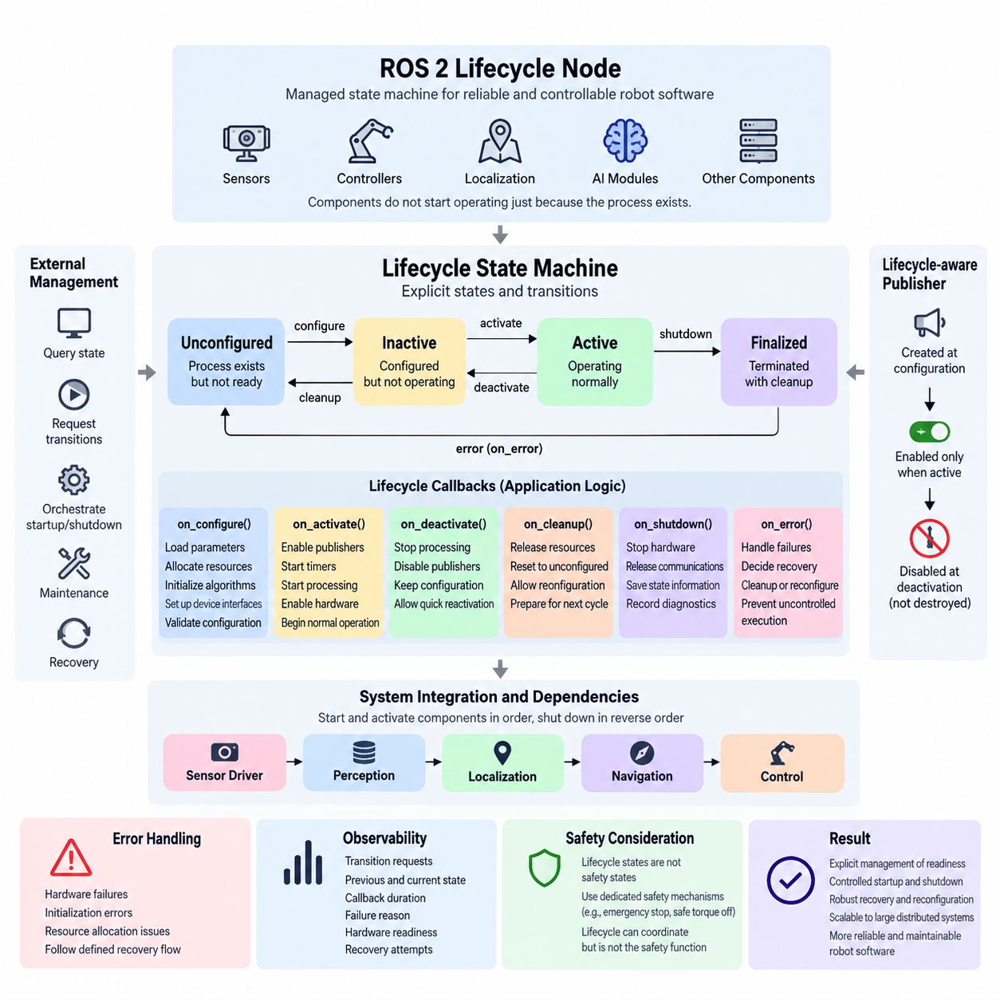
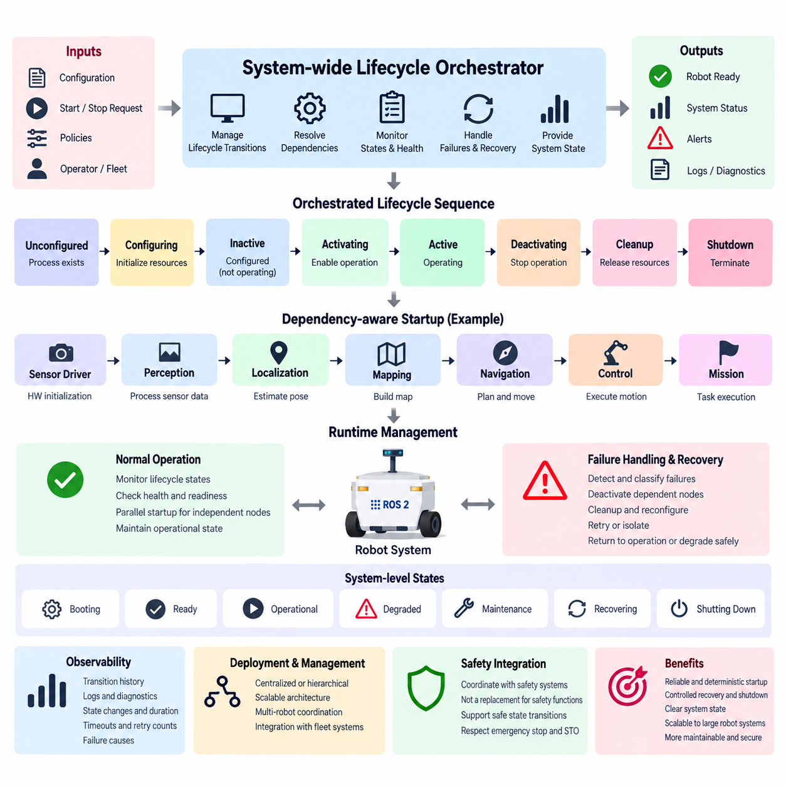
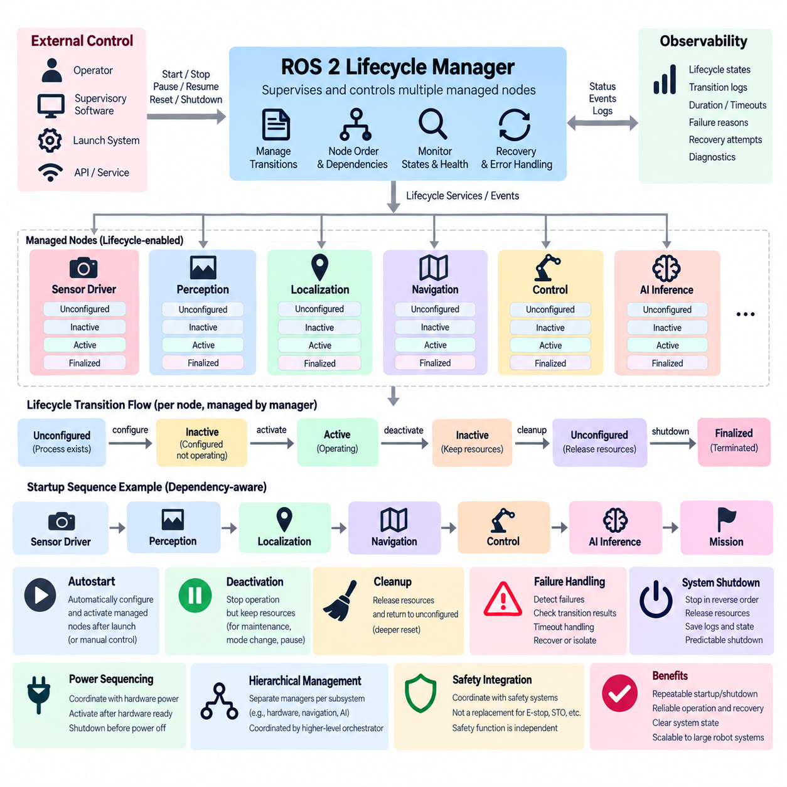
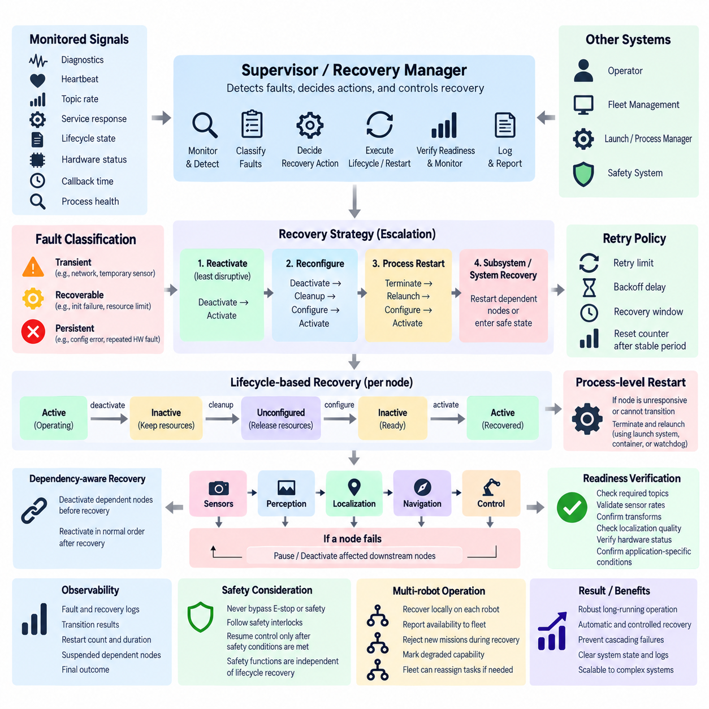
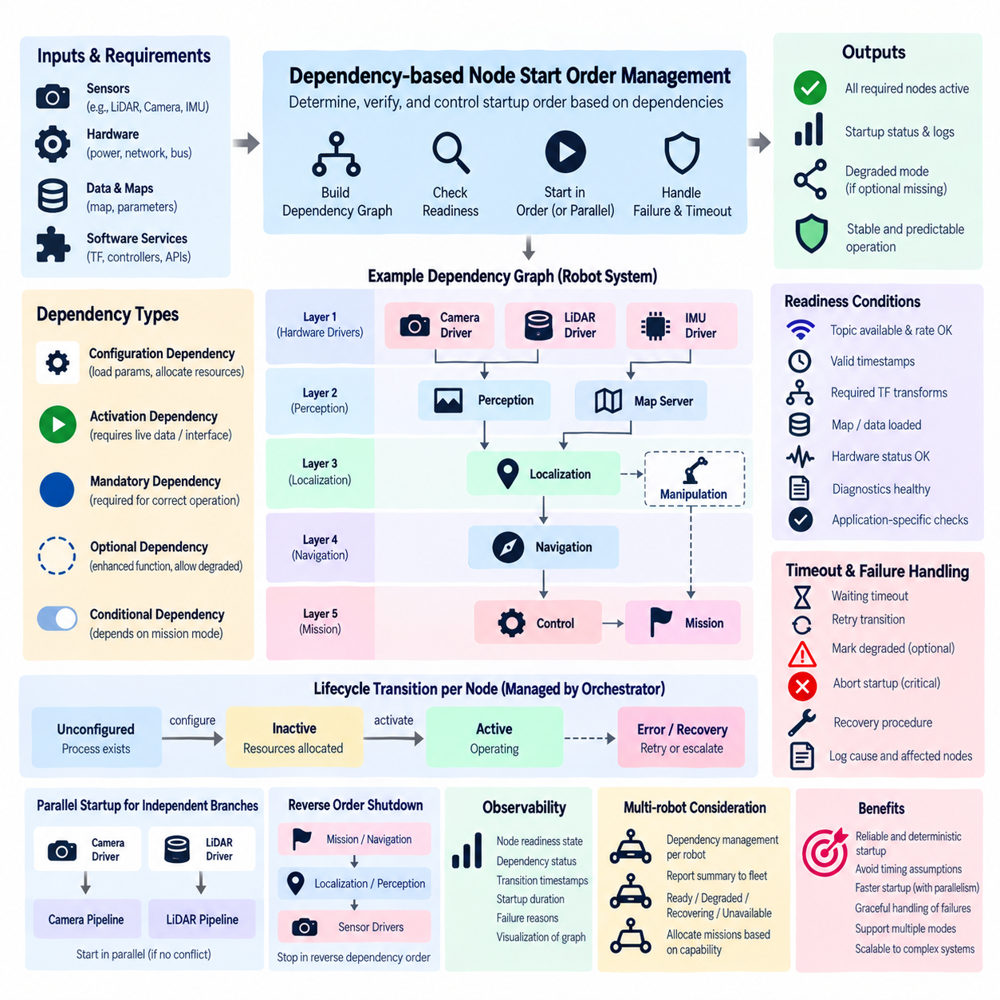
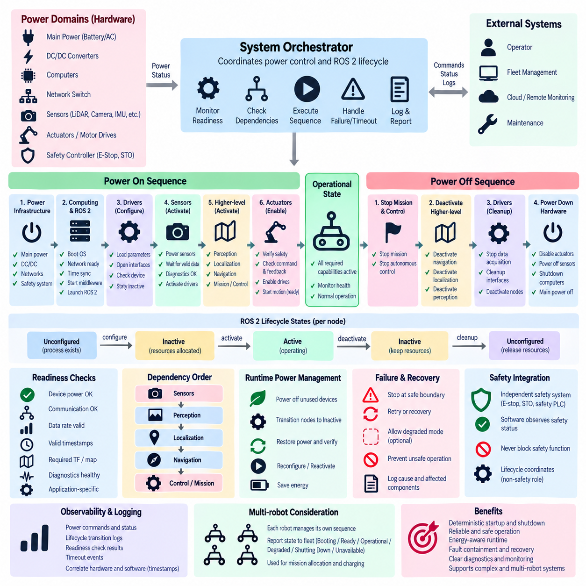
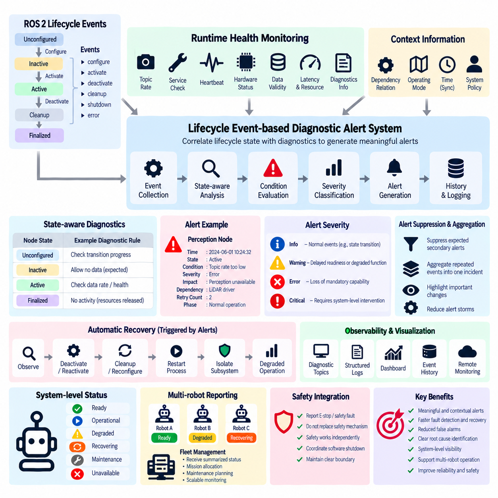
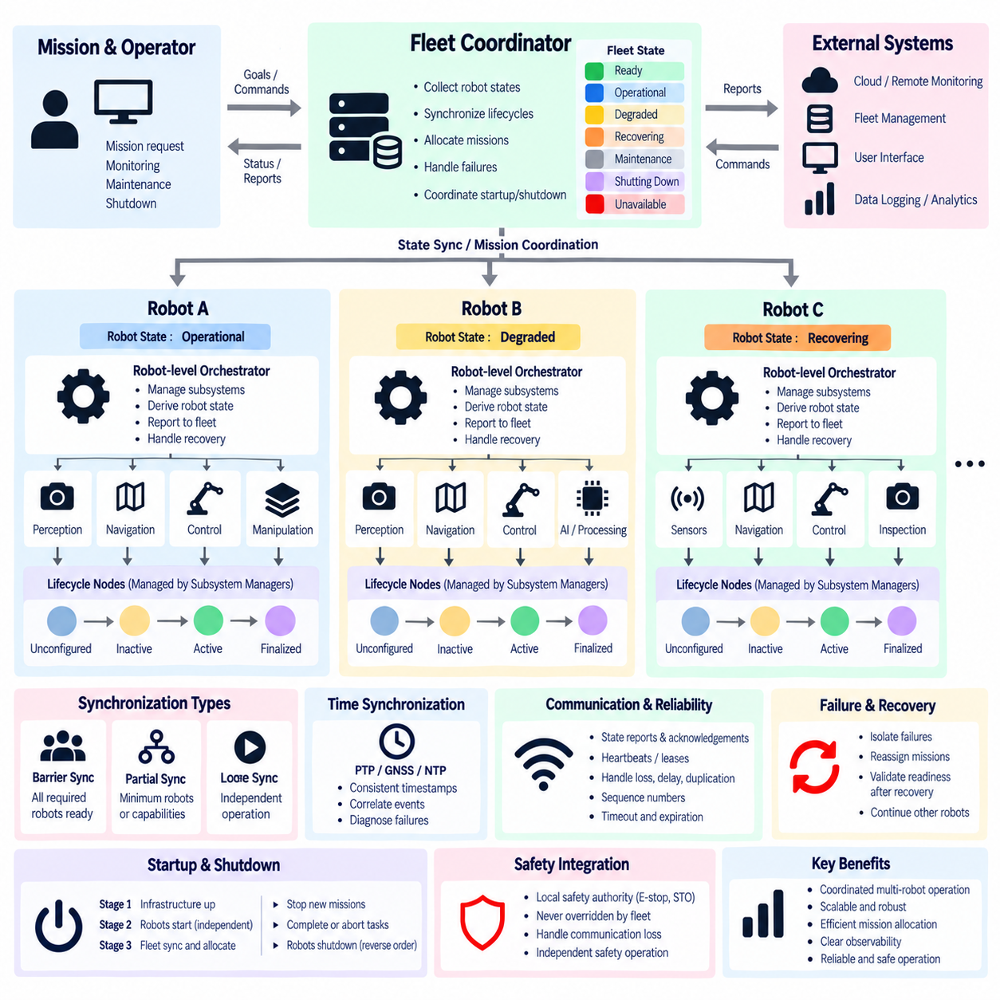
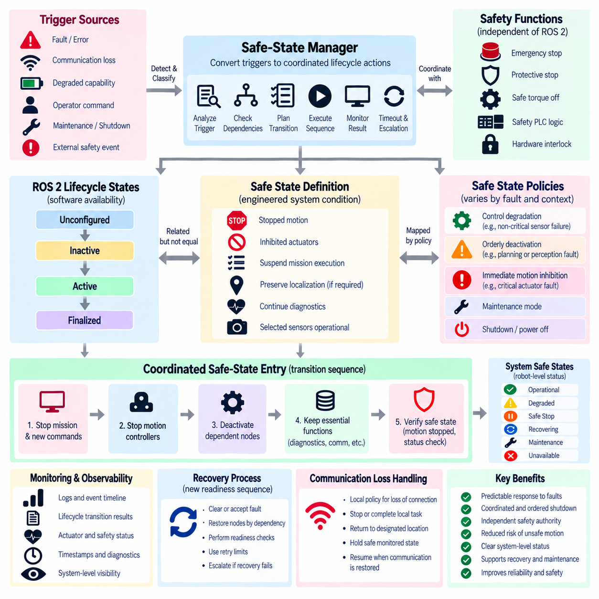
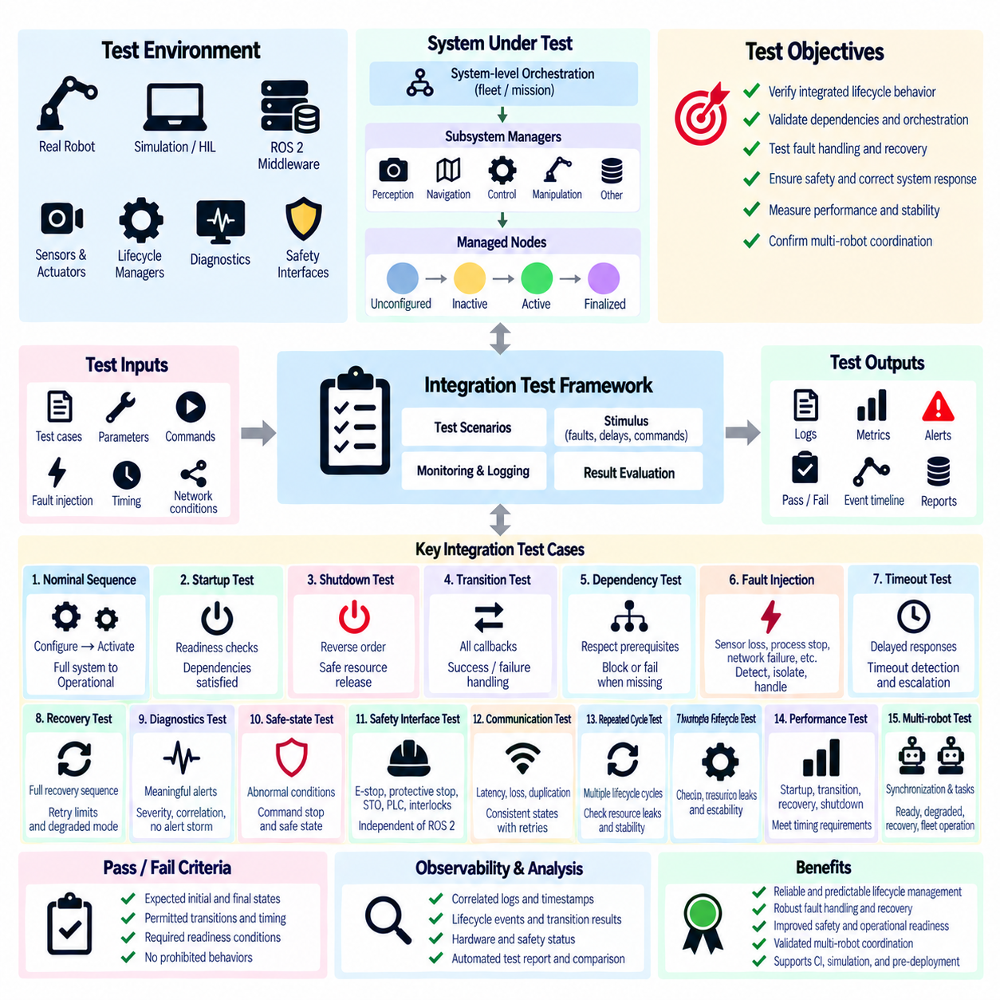

**Volume 05 Robot Middleware and ROS2**

# 07. ROS2 Lifecycle Management

## 07.01 Lifecycle Node State Transition Deep Dive [w/Code]

{width="7.268055555555556in" height="7.268055555555556in"}

A ROS 2 lifecycle node extends the ordinary node model with an explicit managed state machine, allowing software components to separate resource construction, configuration, execution, suspension, cleanup, and shutdown. This model is especially valuable in robots because sensors, controllers, localization modules, and AI components should not begin operating merely because their processes exist.

The lifecycle model distinguishes primary states from transitions between those states. The principal stable states are Unconfigured, Inactive, Active, and Finalized. A node normally starts in Unconfigured, where the process exists but operational resources are not yet expected to be fully prepared. Lifecycle transitions deliberately move the node between these states while invoking application-defined callbacks.

Configuration moves a node from Unconfigured toward Inactive through the configuring transition. During this transition, the node can load parameters, allocate buffers, initialize algorithms, establish device interfaces, create lifecycle-aware publishers, or validate configuration files. Successful execution reaches Inactive, while configuration failure can redirect execution through defined error-handling behavior rather than silently starting an incomplete component.

The Inactive state represents a configured but non-operational component. Resources required for operation may already exist, yet the node should not perform its normal runtime function. This separation is important for deterministic robot startup because an entire subsystem can be configured and checked before data production or actuator-related processing begins. Multiple dependent nodes can therefore be prepared before coordinated activation.

Activation changes an Inactive node into Active through the activating transition. The associated callback is normally used to enable resources that should operate only during runtime, such as lifecycle publishers, timers, processing pipelines, or hardware-facing behavior. After successful activation, the node performs its intended operational role and participates normally in the ROS 2 communication architecture according to its implementation.

Deactivation provides the reverse path from Active to Inactive without requiring complete destruction of the component. The node can stop operational behavior while preserving configuration and resources needed for rapid reactivation. For a robot, this is substantially different from terminating a process: localization, perception, navigation, or device nodes can temporarily stop their active behavior while remaining structurally available for controlled recovery.

Cleanup moves an Inactive node back toward Unconfigured. The cleanup callback should release resources established during configuration and return the component to a condition suitable for another configuration cycle. This enables configuration changes, hardware reconnection, controlled subsystem resets, and repeated initialization without necessarily restarting the operating-system process, making lifecycle management useful for long-running robotic platforms.

Shutdown transitions terminate lifecycle operation and ultimately place the node in Finalized. Finalized is conceptually different from simply killing a process because the transition gives application logic an opportunity to perform controlled shutdown activities. Hardware commands can be stopped, communication resources released, state information preserved, and diagnostic events recorded before the surrounding process is eventually destroyed or restarted.

Lifecycle transitions are therefore more than state labels. Each transition creates a controlled boundary where software can execute specific callback logic and report success or failure. In C++, lifecycle implementations commonly derive from \`rclcpp_lifecycle::LifecycleNode\` and override callbacks such as \`on_configure()\`, \`on_activate()\`, \`on_deactivate()\`, \`on_cleanup()\`, \`on_shutdown()\`, and \`on_error()\` to connect the abstract state machine to application behavior.

A transition callback should be designed as a transaction-like operation rather than an arbitrary collection of initialization commands. If configuration partially succeeds and then fails, the node should avoid exposing an ambiguous operational condition. Resources acquired before failure should be tracked carefully, and callback return values should accurately represent whether the requested state transition completed, failed recoverably, or encountered an unrecoverable condition.

Error processing becomes particularly important when lifecycle nodes interact with physical hardware. A camera may fail to open, a LiDAR may stop responding, a motor interface may reject initialization, or an AI accelerator may fail to allocate required memory. Lifecycle logic provides a structured location for detecting these conditions and deciding whether cleanup, reconfiguration, external recovery, or finalization should follow instead of allowing uncontrolled execution.

Lifecycle-aware publishers reinforce the distinction between configuration and operation. A publisher may be constructed while the node is being configured but enabled only when the node becomes Active. Deactivation can disable publication without destroying the publisher itself. This prevents downstream components from interpreting data from a subsystem that exists technically but has not yet been authorized to participate in normal robot operation.

State transitions can be requested externally, which makes lifecycle nodes suitable for higher-level orchestration. A supervisor can query the current state, request configuration, activate components after dependencies become ready, deactivate them before maintenance, and initiate cleanup during recovery. The lifecycle node therefore becomes a manageable software component rather than an independently starting process whose readiness must be inferred indirectly.

For a complete robot, lifecycle management is most powerful when state transitions reflect subsystem dependencies. A sensor driver may need to become Active before perception, perception before localization, and localization before autonomous navigation. Shutdown may require the reverse relationship. The chapter structure consequently progresses from individual lifecycle transitions toward system-wide orchestration, dependency-based startup, power sequencing, recovery, and safe-state management.

Lifecycle states should not be confused with safety states. Active, Inactive, or Finalized describe software management conditions, whereas emergency stop, safe torque off, protective stop, or other functional-safety conditions belong to dedicated safety mechanisms. Lifecycle management can coordinate with those mechanisms, but a ROS 2 transition alone should not be treated as the safety function responsible for removing hazardous energy or guaranteeing actuator safety.

Good lifecycle design also requires observability. Transition requests, previous and resulting states, callback duration, failure reason, hardware readiness, and recovery attempts should be available to diagnostics and logging infrastructure. In distributed robots, this information allows operators and supervisory software to distinguish a node that has crashed from one that is intentionally Inactive, waiting for configuration, recovering from failure, or refusing activation because a dependency is unavailable.

Lifecycle transitions ultimately provide a disciplined contract between component existence and component readiness. Instead of assuming that process startup means operational readiness, ROS 2 can represent preparation, activation, suspension, reconfiguration, recovery, and termination explicitly. This becomes increasingly important as robotic systems grow from several nodes into distributed stacks containing perception, control, navigation, AI inference, safety supervision, and fleet-connected services.

## 07.02 System-Wide Lifecycle Orchestration [w/Code]

{width="7.268055555555556in" height="7.268055555555556in"}

System-wide lifecycle orchestration extends the ROS 2 managed-node concept from individual components to the coordinated operation of an entire robot software stack. Instead of allowing every process to configure and activate independently, an orchestration layer supervises lifecycle states, transition requests, dependencies, readiness conditions, failures, and shutdown sequences across multiple nodes. This provides an explicit operational structure for complex distributed robotic systems.

A robot rarely consists of components that can safely start in arbitrary order. Sensor drivers may need hardware initialization before perception begins, localization may depend on valid sensor streams and transforms, navigation may require stable localization, and motion control may require verified navigation outputs. System-wide orchestration converts these relationships into controlled lifecycle dependencies rather than relying on timing assumptions or fixed startup delays.

The orchestration process normally begins by discovering or registering managed nodes and determining their expected initial states. Each component can then be queried through its lifecycle interfaces to confirm whether it is Unconfigured, Inactive, Active, or Finalized. The orchestrator maintains a system-level view of these states and uses that information to determine which transitions are currently valid and which nodes must wait for dependencies.

During robot startup, configuration is commonly performed before activation. Sensor interfaces, perception modules, localization services, navigation components, controllers, diagnostics, and AI inference nodes can first move from Unconfigured to Inactive. This allows parameters, memory, hardware interfaces, communication endpoints, and algorithms to be prepared while preventing premature operational behavior. The system can therefore establish readiness before authorizing normal execution.

Activation can then follow a dependency-aware sequence. A camera or LiDAR driver may become Active first, followed by perception processing, localization, mapping or navigation, and finally mission-level or motion-related components. The orchestrator verifies each required transition before advancing to the next dependency stage. If one component fails to activate, downstream nodes can remain Inactive instead of entering an invalid operating configuration.

Dependency modeling should represent actual functional requirements rather than merely reproduce process launch order. A localization node, for example, may require active IMU and LiDAR sources, valid transforms, and an initialized map. Navigation may depend on localization quality and costmap readiness rather than only the existence of node processes. Effective orchestration therefore combines lifecycle state information with application-specific health and readiness conditions.

A system orchestrator can implement transition policies through ROS 2 lifecycle services and events. It can request configure, activate, deactivate, cleanup, or shutdown transitions while monitoring responses and resulting states. Transition events provide additional visibility into state changes, allowing supervisory logic to update the system model asynchronously. Timeouts are important because a transition request that never completes must not block robot startup indefinitely.

Lifecycle orchestration also creates a structured foundation for runtime recovery. If a perception node encounters a recoverable hardware or processing failure, the system may deactivate dependent localization or navigation components before attempting recovery. The affected node can be cleaned up, reconfigured, and reactivated, after which dependent components can return to operation in controlled order. Recovery therefore becomes an orchestrated state sequence instead of an uncontrolled process restart.

Not every failure should trigger the same recovery strategy. A temporary sensor communication problem may justify retrying configuration, while repeated initialization failures may require keeping a subsystem Inactive and reporting degraded operation. A critical controller failure may require broader system deactivation. The orchestrator should classify failures and apply predefined policies such as retry, restart, isolate, degrade, transition to a safe operational mode, or request complete shutdown.

System-wide deactivation is equally important during maintenance, mode changes, docking, software updates, or temporary operational suspension. Active mission and navigation components can be stopped while selected monitoring or communication services remain available. Because lifecycle nodes preserve configured resources in the Inactive state, the robot may resume operation more quickly than if every process were destroyed and recreated after each interruption.

Shutdown should generally respect dependency relationships in reverse. High-level mission execution can stop before navigation, navigation before localization and perception, and hardware-facing components after their consumers no longer require data. This prevents upstream resources from disappearing while downstream components are still executing. The same principle can coordinate actuator disabling, log flushing, persistent-state storage, communication termination, and final hardware release.

The orchestrator itself requires careful architectural treatment because it becomes an important supervisory component. Centralized orchestration offers a clear global state model and straightforward dependency management, while hierarchical orchestration can divide responsibility among perception, navigation, control, AI, and hardware subsystems. Large robots may benefit from local subsystem managers coordinated by a higher-level supervisor rather than placing every lifecycle decision in one monolithic manager.

System state should not be represented simply as the state of one node. A robot may contain dozens of lifecycle components whose combinations correspond to conditions such as Booting, Ready, Operational, Degraded, Maintenance, Recovering, or Shutting Down. These system-level conditions can be derived from multiple node states and health indicators. The orchestrator thus maps distributed component states into an operational state meaningful to mission management and operators.

Observability is essential for diagnosing orchestration behavior. Logs and diagnostics should record requested transitions, transition sources, previous and resulting states, callback duration, timeout events, dependency decisions, retry counts, and failure causes. A timestamped transition history makes it possible to reconstruct why the robot failed to become operational or why a downstream subsystem was automatically deactivated after another component experienced a fault.

Concurrency must also be managed deliberately. Independent branches of the dependency graph may be configured or activated in parallel to reduce startup time, while dependent nodes must preserve ordering constraints. Parallel transitions should therefore be based on explicit dependency analysis rather than launching every component simultaneously. This approach balances startup performance with deterministic behavior and becomes increasingly important as robot software stacks grow larger.

Lifecycle orchestration should coordinate with, but remain distinct from, functional safety mechanisms. The orchestrator may command software components toward Inactive or shutdown states when hazardous conditions are reported, but lifecycle transitions do not replace certified emergency-stop, safe torque off, protective-stop, or safety-controller functions. Safety mechanisms must retain authority independently of the ROS 2 lifecycle management layer.

In multi-robot and fleet environments, the same principles can extend beyond a single machine. Each robot may maintain its own local lifecycle orchestrator while exposing summarized readiness, degraded status, maintenance state, and recovery progress to fleet management. Fleet software can then avoid assigning missions to robots whose required subsystems are unavailable without directly controlling every internal node transition.

System-wide lifecycle orchestration ultimately transforms a collection of ROS 2 processes into a coordinated operational system. Explicit dependencies, ordered transitions, readiness verification, failure containment, recovery policies, observability, and controlled shutdown make startup and runtime behavior reproducible rather than accidental. This provides the foundation for the subsequent lifecycle-management topics of manager implementation, automatic recovery, dependency ordering, robot power sequencing, diagnostics, multi-robot synchronization, and safe-state integration.

## 07.03 ros2.lifecycle.manager Usage [w/Code]

{width="7.268055555555556in" height="7.268055555555556in"}

A ROS 2 lifecycle manager provides a supervisory mechanism for controlling multiple managed nodes through their lifecycle interfaces instead of allowing each component to determine startup and shutdown independently. Within the lifecycle-management structure, its primary role is to request state transitions, observe results, coordinate node ordering, and maintain a predictable operational state across the robot software stack.

The manager operates above individual lifecycle nodes and interacts with their configure, activate, deactivate, cleanup, and shutdown transitions. Each managed node still owns its application-specific callbacks, while the manager decides when those callbacks should be invoked. This separation keeps device initialization, algorithm setup, and resource handling inside the node while centralizing operational sequencing and supervision.

A typical configuration identifies the lifecycle-enabled nodes that belong to the managed group. Their names and expected order become part of the manager configuration so that the system can establish a repeatable startup sequence. Sensor drivers, localization components, navigation modules, controllers, and other managed services can therefore be treated as coordinated members of one operational subsystem rather than unrelated ROS 2 processes.

During startup, the manager first requests configuration transitions for the managed nodes. Each node moves from Unconfigured toward Inactive while executing its \`on_configure()\` logic, which may load parameters, allocate resources, initialize hardware interfaces, or prepare communication objects. The manager should confirm successful transitions before treating the corresponding component as ready for the next stage.

After configuration succeeds, activation requests move nodes from Inactive to Active. The \`on_activate()\` callback enables runtime behavior such as lifecycle publishers, timers, sensor acquisition, processing pipelines, or other operational functions. By controlling activation centrally, the manager can prevent higher-level components from operating before the lower-level services and resources on which they depend have reached the required lifecycle state.

Lifecycle-manager usage becomes particularly useful when startup ordering reflects functional dependencies. A sensor driver may need to activate before perception, perception before localization, and localization before navigation. The manager can encode or follow this sequence so that readiness is established progressively. This is more reliable than inserting arbitrary sleep periods into launch scripts and assuming that elapsed time implies component readiness.

Autostart behavior can simplify deployments in which the robot should automatically configure and activate its managed nodes after launch. When autostart is enabled, the lifecycle manager can initiate the required transitions without waiting for a separate operator command. When disabled, the system can remain prepared for explicit startup control, which is useful during commissioning, debugging, maintenance, testing, or staged system initialization.

External control remains important even when automatic startup is available. Supervisory software, launch infrastructure, operator interfaces, or higher-level orchestration logic can request startup, pause, resume, reset, or shutdown behavior according to the implementation. The lifecycle manager consequently acts as an operational control point through which multiple lifecycle nodes can be manipulated as a coordinated group instead of being controlled individually.

Deactivation allows the manager to suspend active operation without completely destroying node configuration. Managed nodes can transition from Active to Inactive, stopping publishers, timers, processing loops, or hardware-facing activity while preserving resources needed for later reactivation. This behavior is useful when a robot temporarily pauses autonomous operation, enters maintenance, changes operating modes, or prepares for controlled recovery.

Cleanup provides a deeper reset by returning suitable nodes from Inactive toward Unconfigured. Their \`on_cleanup()\` callbacks can release resources created during configuration, close interfaces, reset internal data structures, and prepare for another configuration cycle. A lifecycle manager can use this capability when simple deactivation is insufficient and a subsystem must be reconstructed without necessarily terminating every operating-system process.

The manager should treat transition responses as operational evidence rather than assuming that a request succeeded because it was sent. Configuration may fail because a device is unavailable, activation may fail because required resources are missing, or cleanup may encounter an unexpected condition. Robust management therefore requires checking resulting states, detecting timeouts or failures, and preventing dependent components from continuing through an invalid startup sequence.

Lifecycle management also supports structured recovery when integrated with monitoring logic. If a managed component becomes unhealthy, supervisory software can initiate deactivation, cleanup, reconfiguration, and reactivation according to the recovery policy. Dependent nodes may need to be suspended while recovery occurs. This establishes the foundation for the runtime node restart and automatic recovery mechanisms addressed by subsequent lifecycle-management topics.

A manager must distinguish lifecycle state from component health. A node can technically remain Active while its sensor stream has stopped, its localization estimate has degraded, or its hardware interface is reporting errors. Effective lifecycle-manager usage therefore combines state transitions with diagnostics, heartbeat information, application-specific readiness checks, and timeout monitoring rather than treating the Active state alone as proof of correct robot operation.

Shutdown sequencing should be as deliberate as startup. Higher-level consumers should normally stop before the lower-level services that provide their data or capabilities. Mission execution and navigation can be deactivated before localization and perception, while hardware-facing nodes can be stopped after their dependent software components no longer require them. Controlled ordering reduces inconsistent states and allows resources to be released predictably.

The lifecycle manager can also participate in robot power sequencing. Software components should not activate before their associated sensors, computers, communication networks, or actuators are physically ready, and hardware should not be powered down while dependent software is still issuing commands or expecting data. Lifecycle transitions provide software-visible synchronization points that can be coordinated with broader startup and shutdown procedures.

In larger architectures, a single manager does not necessarily need to control every node in the robot. Separate lifecycle managers can supervise hardware, perception, navigation, manipulation, AI inference, or other subsystems, while a higher-level orchestrator coordinates these groups. Such hierarchical management reduces coupling and allows each subsystem to maintain its own transition logic while still participating in system-wide lifecycle orchestration.

Operational visibility should accompany manager control. Current lifecycle states, requested transitions, transition duration, failed callbacks, recovery attempts, and manager decisions should be exposed through logging and diagnostics. This information allows developers and operators to determine whether a robot is waiting for configuration, partially activated, recovering from failure, intentionally paused, or unable to reach its expected operational state.

Lifecycle-manager usage must remain separate from functional safety authority. A manager may deactivate controllers or request shutdown when a fault is detected, but ROS 2 lifecycle transitions do not replace emergency-stop circuits, safety PLCs, safe torque off, or other dedicated safety mechanisms. Lifecycle management coordinates software behavior around safety events while the actual safety function remains independently enforceable.

Used correctly, a ROS 2 lifecycle manager turns lifecycle-enabled nodes into a manageable operational subsystem. Central transition control, ordered configuration and activation, controlled deactivation and cleanup, failure-aware supervision, and integration with diagnostics create repeatable robot startup and shutdown behavior. This forms the practical management layer connecting individual lifecycle nodes with automatic recovery, dependency-based startup, power sequencing, diagnostic alerts, and system-level lifecycle orchestration.

## 07.04 Runtime Node Restart and Auto Recovery Design [w/Code]

{width="7.268055555555556in" height="7.268055555555556in"}

Runtime node restart and automatic recovery are essential capabilities for long-running ROS 2 robots because software and hardware faults cannot always be eliminated through design-time validation. Sensor communication can disappear, device drivers can become unresponsive, algorithms can enter invalid states, and external resources can temporarily fail. Recovery architecture therefore treats faults as expected operational events that must be detected, isolated, and resolved systematically.

A recovery design should distinguish between node health, lifecycle state, process health, and subsystem readiness. A node may remain Active while its output has stopped, or its process may still exist while an internal hardware connection has failed. Conversely, a process restart may succeed without restoring the complete subsystem. Effective recovery therefore combines lifecycle information with diagnostics, heartbeat monitoring, communication activity, resource status, and application-specific health criteria.

Fault detection is the entry point of the recovery sequence. Supervisory logic can monitor diagnostic messages, heartbeat timestamps, topic publication rates, service responsiveness, lifecycle transition results, hardware status, callback execution time, and process availability. Each monitored condition should have a meaningful timeout or threshold so that transient delays are distinguished from persistent failures without allowing an unhealthy component to remain operational indefinitely.

Detected faults should be classified before recovery is attempted. Recoverable conditions can include temporary network interruption, unavailable sensors, transient initialization failures, or resource exhaustion that can be cleared. Persistent configuration errors, incompatible parameters, corrupted resources, or repeated hardware failures may require operator intervention. Classification prevents an automatic recovery mechanism from repeatedly restarting a component that cannot recover autonomously.

The least disruptive recovery action should normally be attempted first. If an Active node can restore operation by deactivation and reactivation, destroying the process is unnecessary. More serious failures may require deactivate, cleanup, configure, and activate transitions to reconstruct node resources. Only when lifecycle-level recovery cannot restore correct behavior should the supervisory system escalate toward process restart, subsystem restart, or broader system recovery.

Lifecycle-based recovery preserves the advantage of managed nodes because recovery actions remain explicit and observable. A node can transition from Active to Inactive, execute \`on_cleanup()\` to release damaged resources, run \`on_configure()\` to recreate interfaces and internal state, and execute \`on_activate()\` to resume operation. Each transition provides a checkpoint where success, failure, timeout, and diagnostic information can be evaluated before continuing.

Process-level restart is required when the node cannot respond to lifecycle services, the executor is blocked, memory corruption is suspected, or an unrecoverable internal failure prevents normal transitions. In this case an external supervisor must terminate and recreate the process. Launch systems, service managers, containers, or dedicated watchdog processes can provide this capability, while ROS 2 lifecycle management coordinates the logical recovery of the surrounding subsystem.

Restarting one node may affect many dependent components. If a LiDAR driver fails, perception and localization may no longer receive valid data, while navigation may continue temporarily with obsolete information. Recovery logic should therefore use dependency relationships to deactivate or inhibit affected downstream nodes before restarting the failed component. After recovery, dependent nodes can be reactivated in their normal dependency-aware startup order.

Recovery policies should define escalation levels rather than relying on unlimited restart loops. A first failure might trigger lifecycle reactivation, a repeated failure could trigger cleanup and reconfiguration, and subsequent failures might cause a process restart. If failures continue beyond a defined retry limit or time window, the subsystem can be isolated, marked degraded, or transferred to operator control instead of consuming resources through endless recovery attempts.

Retry behavior should include controlled timing. Immediately restarting a failed device hundreds of times can overload hardware, communication networks, logs, or external services. A recovery manager can apply retry intervals, increasing backoff delays, maximum retry counts, and recovery windows. Stable operation for a defined period may reset the failure counter, allowing occasional transient faults to be handled differently from rapidly recurring failures.

State preservation must be considered before restarting components. Some nodes contain only reconstructable runtime state, while others maintain calibration data, maps, mission progress, learned parameters, or hardware configuration. Recovery logic should determine which information must survive a restart and which should be intentionally discarded. Persistent state should be stored outside volatile node memory when losing it would prevent correct recovery or mission continuation.

Automatic recovery also requires readiness verification after restart. A process that has been recreated is not necessarily operational, and an Active lifecycle state alone may not prove correct behavior. The supervisor should verify required topics, sensor rates, transforms, localization quality, hardware status, model availability, or other application-specific conditions before declaring recovery successful and reactivating dependent components.

Recovery should be observable as a sequence of operational events. Logs should record the original fault, detection time, affected node, previous lifecycle state, recovery action, transition results, restart count, elapsed recovery time, dependent nodes that were suspended, and final outcome. These records are essential for distinguishing isolated transient failures from systematic reliability problems that require engineering changes.

Watchdog architecture can be implemented at several levels. An internal watchdog can detect stalled callbacks or missing device data, a subsystem supervisor can monitor multiple lifecycle nodes, and an external process supervisor can detect complete node failure. Higher-level robot management can observe subsystem readiness and mission impact. Layered watchdogs reduce dependence on a single mechanism that might fail together with the component it monitors.

Recovery concurrency requires careful control. Independent failures may be recovered in parallel when their dependencies do not overlap, but simultaneous restarts of tightly coupled nodes can create race conditions or overload shared resources. A recovery coordinator should serialize transitions when required, lock shared recovery domains, and prevent multiple supervisors from issuing conflicting lifecycle commands to the same node or subsystem.

Automatic recovery must avoid hiding serious faults. A component that repeatedly crashes and restarts may appear temporarily operational while reliability is deteriorating. Recovery counters, degraded-state indicators, fault history, and escalation notifications should therefore remain visible even after successful restoration. The objective is operational continuity combined with fault transparency, not simply returning every node to Active regardless of underlying conditions.

Safety-related components require stricter recovery policies. Automatic restart must never bypass an emergency stop, safety interlock, safe torque off, or hardware fault condition. A recovered controller should not resume actuator commands until independent safety conditions permit operation and required readiness checks have succeeded. Lifecycle recovery can coordinate software restoration, but authorization for hazardous motion must remain under the appropriate safety architecture.

In multi-robot systems, recovery should normally remain local to the affected robot while fleet management receives summarized availability information. A robot undergoing recovery can temporarily reject new missions or report degraded capability. If recovery fails, the fleet manager can redistribute tasks to other robots while maintenance is requested, preventing one node failure from unnecessarily disrupting the operation of the entire fleet.

A robust runtime restart and auto-recovery design therefore combines fault detection, classification, lifecycle transitions, process supervision, dependency management, retry limits, state preservation, readiness verification, observability, and escalation. This transforms restart from an ad hoc response into a controlled state-management procedure and provides the foundation for dependency-based node startup, power sequencing, diagnostic alerts, safe-state entry, and lifecycle integration testing.

## 07.05 Dependency-Based Node Start Order Management [w/Code]

{width="7.268055555555556in" height="7.268055555555556in"}

Dependency-based node start order management ensures that ROS 2 components become operational only after the services, data sources, hardware resources, and software capabilities they require are actually ready. In complex robots, process creation order alone is insufficient because a launched node may still be initializing. Explicit dependency management therefore replaces timing assumptions with verifiable readiness relationships between components.

A dependency represents a functional prerequisite rather than merely an earlier process in a launch file. A localization node may require active LiDAR and IMU drivers, valid TF transforms, and a loaded map, while navigation may require localization, costmaps, and controller interfaces. Start-order management should therefore model what each component needs before activation instead of assuming that process existence means operational readiness.

These relationships can be represented as a directed dependency graph in which nodes correspond to managed ROS 2 components and edges describe prerequisite relationships. Components with no unresolved prerequisites form the earliest startup layer, while dependent components occupy later layers. Such a graph makes startup logic explicit, supports validation, and provides a foundation for calculating valid configuration, activation, recovery, and shutdown sequences.

Lifecycle states provide useful synchronization points for dependency management. A component can first transition from Unconfigured to Inactive while allocating resources and validating configuration, but downstream components do not need to become operational yet. Once required prerequisites have successfully reached their expected states and readiness conditions, the orchestrator can request activation of the next dependency layer in a controlled sequence.

Configuration dependencies and activation dependencies should be distinguished when necessary. A node may be configurable before its upstream data source is Active because configuration only loads parameters and allocates memory. Activation, however, may require live sensor data or a functioning hardware interface. Separating these conditions increases startup parallelism while preserving operational correctness and avoids unnecessarily serializing the entire robot software stack.

Independent branches of the dependency graph can be processed concurrently. Camera and LiDAR drivers, for example, may configure in parallel if they share no conflicting resources, while perception components wait for their corresponding inputs. Controlled parallelism reduces total startup time without sacrificing deterministic dependency behavior. The orchestrator should therefore serialize only transitions constrained by actual dependencies or shared-resource requirements.

Readiness must be stronger than lifecycle state alone. An Active sensor driver may still be waiting for its first valid measurement, and an Active localization node may not yet have a trustworthy pose estimate. Dependency conditions can therefore include topic availability, minimum publication rate, valid timestamps, TF availability, hardware status, diagnostic level, map readiness, localization quality, or application-specific confirmation signals.

Timeout handling prevents a dependency from blocking startup indefinitely. Every readiness condition that can fail should have an appropriate waiting policy and timeout. When a prerequisite does not become ready, the orchestrator can retry its transition, initiate recovery, mark the subsystem degraded, skip optional functionality, or abort startup according to system policy. The failure should identify both the unavailable prerequisite and the nodes prevented from starting.

Dependencies may be mandatory or optional. Mandatory dependencies prevent activation when unavailable because correct operation cannot be guaranteed without them. Optional dependencies can enable enhanced functionality while allowing a reduced-capability mode when absent. Explicitly modeling this distinction enables robots to continue operating in defined degraded modes rather than treating every peripheral failure as a complete system startup failure.

Conditional dependencies are useful when the robot supports multiple operating modes. Mapping may be required during map-building operation but unnecessary when navigating with a previously stored map. A manipulator may be required for handling missions but irrelevant during inspection missions. The active dependency graph can therefore be selected or modified according to mission mode, hardware configuration, deployment profile, or available capabilities.

Circular dependencies must be detected before runtime whenever possible. If node A requires node B to become Active while node B simultaneously requires node A, neither can progress. Dependency validation should identify cycles, missing node references, impossible state requirements, and contradictory readiness conditions during configuration or integration testing. Preventing invalid graphs is more reliable than attempting to diagnose startup deadlocks on deployed robots.

Start-order logic should also coordinate with hardware readiness. A ROS 2 driver should not activate before its physical device is powered, communication links are established, and required firmware is responsive. Similarly, higher-level control nodes should not become operational before actuator interfaces are initialized. Software dependencies therefore often extend beyond ROS 2 nodes to power controllers, networks, field buses, sensors, accelerators, and external services.

Failure during startup requires dependency-aware rollback or containment. If perception fails after sensor drivers have activated, localization and navigation should remain inactive, while unrelated subsystems may continue. Depending on policy, already activated prerequisites may remain available for diagnostics or be deactivated in reverse order. This prevents one startup failure from automatically destabilizing every component in the robot.

Runtime recovery uses the same dependency information. When an upstream node fails during operation, downstream consumers can be identified immediately and suspended before they operate on missing or stale information. After the failed node has been recovered and its readiness verified, dependent components can be reactivated according to the original ordering rules. The dependency graph therefore supports both startup and fault recovery.

Shutdown ordering is generally derived by reversing dependency relationships. Mission execution and navigation should stop before localization, perception should stop before its sensor sources are released, and hardware-facing components should remain available until their consumers have completed shutdown. Reverse dependency ordering reduces dangling requests, invalid data access, unfinished commands, and uncontrolled resource removal during robot power-down.

A hierarchical architecture can simplify dependency management in large robots. Local managers may control sensor, perception, navigation, manipulation, control, or AI subsystems, while a system-level orchestrator manages dependencies between these groups. This avoids constructing one excessively detailed global sequence and allows subsystem teams to maintain their internal dependency rules behind well-defined readiness interfaces.

Dependency state should be observable to developers and operators. Diagnostics can expose which prerequisites are Ready, Waiting, Failed, Optional, or Recovering and explain why a particular node has not been activated. Transition timestamps, dependency evaluation results, timeout causes, and startup duration provide valuable information for identifying slow initialization, incorrect configuration, unreliable hardware, and hidden coupling between components.

Dependency-based startup must remain coordinated with functional safety but cannot replace it. A controller may depend on a safety system reporting permission before activation, yet ROS 2 dependency logic itself is not the certified safety mechanism. Emergency stop, safe torque off, protective stop, and other safety functions must retain independent authority even when their status participates in lifecycle readiness decisions.

For multi-robot systems, dependency management should primarily remain local because each robot has its own hardware and software readiness conditions. Fleet management can consume a summarized state such as Ready, Degraded, Recovering, or Unavailable instead of controlling every internal transition. This preserves robot autonomy while allowing mission allocation to reflect the capabilities that have successfully completed their dependency chains.

Dependency-based node start order management ultimately converts robot startup from a sequence of process launches into a verified progression of capabilities. Explicit graphs, lifecycle transitions, readiness checks, parallel independent branches, timeouts, optional dependencies, failure containment, recovery, and reverse-order shutdown create predictable system behavior and provide a direct foundation for robot power-on/off sequencing and lifecycle-based safe operation.

## 07.06 Robot Power On/Off Sequence and ROS2 Integration [w/Code]

{width="7.268055555555556in" height="7.268055555555556in"}

Robot power-on and power-off sequencing coordinates physical energy states with ROS 2 software lifecycle states so that hardware and software become operational in a controlled and predictable order. A robot should not simply energize every device and launch every node simultaneously. Compute systems, networks, sensors, actuators, controllers, and application nodes have different initialization requirements that must be synchronized before autonomous operation begins.

Power sequencing starts below the ROS 2 software layer. Main power distribution, DC/DC converters, embedded computers, network switches, sensor power rails, motor drives, and safety controllers may require different activation delays and readiness checks. The software architecture should therefore recognize physical power domains and expose their status to supervisory logic instead of assuming that a powered device is immediately available for communication or control.

The earliest startup stage should establish the safety and infrastructure foundation. Safety controllers, emergency-stop circuits, power monitoring, communication infrastructure, and essential computing resources should become available before motion-related software is authorized. ROS 2 processes may begin only after the operating system, network interfaces, time synchronization, storage, and required middleware services have reached stable conditions suitable for distributed communication.

Once computing infrastructure is ready, ROS 2 lifecycle nodes can enter their configuration phase. Hardware drivers may transition from Unconfigured to Inactive while loading parameters, allocating buffers, opening communication interfaces, and checking device identity or firmware status. Keeping nodes Inactive during this stage prevents data publication or control behavior from beginning before the physical hardware and its associated software resources have been validated.

Sensor power and software activation should be coordinated through explicit readiness conditions. A LiDAR may require several seconds after power application before producing valid measurements, while cameras, GNSS receivers, IMUs, thermal sensors, or depth sensors may have different initialization characteristics. Their ROS 2 drivers should therefore activate only after communication, diagnostics, timestamps, and required data streams satisfy defined readiness criteria.

Higher-level components should follow dependency-based activation. Perception should begin after required sensor streams are valid, localization after perception or localization sensors and transforms are available, and navigation after a reliable pose and map environment have been established. Mission execution and autonomous control should become Active only after all mandatory capabilities required for the selected operating mode have passed their readiness checks.

Actuator-related activation requires additional control because software readiness does not automatically imply permission for physical motion. Motor controllers and drives may be powered while remaining inhibited, disabled, or in a non-motion state. ROS 2 control components can be configured before motion authorization, but actuator enablement should occur only after control interfaces, command paths, feedback signals, safety conditions, and system-level readiness have been verified.

A system-level orchestrator can connect power states with lifecycle transitions. It may observe power-controller feedback, hardware diagnostics, network connectivity, and lifecycle states before requesting Configure or Activate transitions. Instead of relying on fixed delays, the orchestrator can advance through startup stages when explicit conditions are satisfied, while timeouts detect hardware or software components that fail to become ready within their permitted initialization windows.

Power-on sequencing should support parallel initialization when dependencies permit it. Independent sensor power domains or compute services may start simultaneously, while components sharing constrained power supplies, communication buses, or thermal resources may require staged activation. Controlled parallelism reduces startup time, but current surges, network congestion, initialization traffic, and shared-resource conflicts should be considered when defining which devices can safely start together.

Failure during power-on should stop progression at an appropriate boundary rather than allowing the robot to continue into an incomplete operational state. If a mandatory sensor does not initialize, dependent localization or navigation nodes should remain Inactive. Optional devices may instead be marked unavailable while the robot enters a defined degraded mode. Diagnostic information should clearly identify the failed power domain, hardware component, lifecycle node, and blocked dependencies.

Runtime power management can use the same integration principles. A robot may selectively power down unused sensors, accelerators, payloads, or communication devices to reduce energy consumption while corresponding ROS 2 nodes transition to Inactive or Unconfigured states. When the capability is needed again, hardware power can be restored, readiness verified, and the associated nodes reconfigured or reactivated without restarting the entire robot.

Power-off sequencing should generally reverse functional dependency order rather than simply disconnecting electrical power. Mission execution should stop first, followed by navigation and higher-level autonomous behavior. Perception and localization can then be deactivated, sensor acquisition stopped, and hardware interfaces cleaned up. Only after software consumers have released their dependencies should the corresponding physical devices and power domains be turned off.

Actuators require a particularly controlled shutdown path. Motion commands should cease, the robot should reach the required stopped condition, controllers should transition to appropriate non-operational states, and drive enable signals should be removed according to the system design. ROS 2 nodes can then deactivate and clean up their interfaces. Electrical power removal should occur only after the hardware no longer depends on active software commands for controlled behavior.

Computing platforms should normally remain powered until application shutdown, log flushing, persistent-state storage, lifecycle cleanup, and diagnostic reporting have completed. Abruptly removing power from the main computer can lose fault information, damage incomplete data transactions, or prevent correct hardware shutdown. The final software stages should therefore confirm that persistent operations are complete before the power controller removes nonessential compute power.

Lifecycle callbacks provide useful boundaries for power integration. \`on_configure()\` can verify that required hardware exists, \`on_activate()\` can enable operational communication, \`on_deactivate()\` can stop runtime activity, and \`on_cleanup()\` can close interfaces and release resources. However, lifecycle callbacks should not be assumed to provide hard real-time electrical control or certified safety behavior; they coordinate software state around dedicated hardware mechanisms.

Power sequencing must remain distinct from functional safety. Emergency-stop circuits, safe torque off, safety PLCs, contactors, and other safety mechanisms must be capable of removing or inhibiting hazardous energy independently of ROS 2. Lifecycle orchestration may observe safety status and respond by deactivating software, but software transition completion must never be required before a safety system can perform its protective function.

Observability is critical because startup and shutdown failures often cross hardware and software boundaries. Logs should correlate power commands, voltage or device-ready signals, network availability, ROS 2 lifecycle transitions, readiness checks, timeout events, and failure causes using consistent timestamps. Such correlation allows engineers to determine whether a node failed because of software logic or because its physical device was never correctly powered or initialized.

Recovery after an unexpected power interruption should follow a defined re-entry procedure rather than assuming the previous software state remains valid. Affected nodes may need to deactivate, clean up stale interfaces, wait for hardware power restoration, reconfigure communication, verify device state, and activate again. Dependent components should remain suspended until the restored capability has passed the same readiness checks used during normal startup.

In multi-robot systems, each robot should normally manage its own internal power and lifecycle sequence because power domains and hardware dependencies are local. Fleet management can receive summarized states such as Booting, Ready, Operational, Degraded, Shutting Down, or Unavailable. This allows mission allocation and charging operations to consider robot readiness without exposing every internal power transition to the fleet-level controller.

Integrated robot power sequencing ultimately connects electrical readiness, hardware initialization, ROS 2 lifecycle management, dependency ordering, safety supervision, and application activation into one coordinated operational procedure. A well-designed sequence enables deterministic startup, controlled shutdown, energy-aware runtime operation, fault containment, and reliable recovery while providing the foundation for diagnostic alerts, lifecycle monitoring, multi-robot synchronization, and safe-state integration.

## 07.07 Lifecycle Event-Based Diagnostic Alert System [w/Code]

{width="7.268055555555556in" height="7.268055555555556in"}

A lifecycle event-based diagnostic alert system combines ROS 2 managed-node state information with runtime health monitoring so that abnormal conditions can be detected in operational context. Instead of reporting isolated errors without knowing whether a component is starting, active, recovering, or shutting down, the diagnostic layer correlates faults with lifecycle states and transitions. This makes alerts more meaningful for operators and automated supervisors.

Lifecycle events provide an explicit stream of information about changes between states such as Unconfigured, Inactive, Active, and Finalized. Configure, activate, deactivate, cleanup, shutdown, and error transitions indicate what a node is attempting to do and when its operational role changes. Monitoring these events allows the diagnostic system to distinguish expected state changes from unexpected transitions, failures, incomplete transitions, or abnormal recovery behavior.

Lifecycle state alone is not sufficient to determine component health. A node may remain Active even when sensor data has stopped, processing latency has exceeded its limit, or a hardware interface has become unavailable. Diagnostic monitoring should therefore combine lifecycle events with application-level evidence such as heartbeat status, topic frequency, service responsiveness, hardware diagnostics, resource usage, data validity, and callback execution behavior.

Each diagnostic observation should be interpreted according to the node\'s current lifecycle state. Missing sensor data may be normal while a node is Inactive but critical when the same node is Active. Failure to publish during configuration may be expected, while publication after deactivation may indicate incorrect lifecycle behavior. State-aware interpretation reduces false alarms because diagnostic rules are evaluated within the operational context in which the monitored component currently exists.

An event-based architecture can treat lifecycle transitions as triggers for diagnostic evaluation. When a node enters Active, the monitoring system can begin checking expected data rates, hardware responses, and application health. When it becomes Inactive, runtime checks can be suspended or replaced with resource-retention checks. During configuration or cleanup, transition duration and callback completion can be monitored for timeout or failure conditions.

Diagnostic severity should reflect both the detected condition and its operational impact. Informational events can record expected lifecycle transitions, warnings can identify delayed readiness or degraded optional functions, errors can indicate loss of mandatory capabilities, and critical conditions can represent failures that require system-level intervention. Severity should be derived from defined system policy rather than from lifecycle state alone.

Alert generation should include sufficient context to support immediate diagnosis. A useful alert can contain the node name, timestamp, lifecycle state, requested transition, diagnostic condition, severity, affected capability, retry count, and related dependencies. When possible, it should also identify whether the fault occurred during startup, normal operation, recovery, maintenance, or shutdown, allowing operators to understand the event without reconstructing the entire system history manually.

Transition timeouts are an important source of lifecycle alerts. Configuration may block while waiting for hardware, activation may wait for an unavailable resource, or cleanup may fail to release an interface. The monitoring system should measure transition duration against expected limits and generate alerts when callbacks exceed their permitted time. Timeout events can then trigger recovery logic instead of leaving the system indefinitely in an intermediate condition.

Repeated lifecycle transitions can reveal instability even when individual recovery attempts succeed. A node that repeatedly moves from Active to Inactive and back to Active may indicate intermittent hardware, communication, or software problems. The diagnostic system should therefore track transition frequency, restart count, recovery count, and fault recurrence over time rather than treating each successful return to Active as evidence that the underlying problem has disappeared.

Diagnostic alerts can become inputs to automatic recovery policies. A warning may only require observation, while an error can initiate deactivation and reactivation. More persistent faults may trigger cleanup and reconfiguration, process restart, subsystem isolation, or degraded operation. The alert system should provide structured fault information to the recovery manager so that recovery decisions are based on classified conditions rather than unstructured log messages.

Dependency information improves alert interpretation. If an upstream LiDAR driver fails, downstream perception, localization, and navigation nodes may become unavailable as a consequence rather than because each component independently failed. The diagnostic system should identify the probable originating fault and distinguish primary alerts from propagated dependency effects. This reduces alert storms and helps operators focus on the component that actually requires attention.

Alert suppression and aggregation are necessary in large ROS 2 systems. A single hardware failure may generate hundreds of related warnings across dependent nodes. State-aware rules can suppress expected secondary alerts while a subsystem is intentionally Inactive or Recovering, and aggregation can combine repeated events into a summarized incident. Important changes in severity or recovery outcome should still remain visible rather than being hidden by suppression logic.

Lifecycle-based diagnostics should maintain a timestamped event history. State transitions, diagnostic changes, recovery commands, process restarts, readiness results, and operator actions can be stored as a correlated timeline. This enables post-event analysis of how a fault propagated through the robot and whether automatic recovery behaved correctly. Consistent time synchronization is particularly important when events originate from multiple computers or distributed subsystems.

The diagnostic system should expose both component-level and system-level views. Developers may need detailed information about individual lifecycle callbacks and node diagnostics, while operators require summarized states such as Ready, Operational, Degraded, Recovering, Maintenance, or Unavailable. A supervisory layer can derive these system conditions from multiple lifecycle states, health indicators, dependency relationships, and unresolved alerts.

Observability interfaces can include ROS 2 diagnostic topics, lifecycle transition events, structured logs, dashboards, persistent event storage, and remote monitoring services. The objective is not merely to generate more messages but to preserve the relationship between state, health, time, and operational consequence. Consistent identifiers and timestamps allow information from these different channels to be correlated during debugging and fleet operations.

Diagnostic alert logic should itself be monitored. If the monitoring node stops receiving lifecycle events, loses communication with a subsystem, or becomes overloaded, the absence of alerts must not be interpreted as proof of healthy operation. Heartbeats, watchdogs, redundant supervision, or external process monitoring can verify that the diagnostic infrastructure remains available while the robot is operating.

Safety-related alerts require a clear boundary between diagnostic notification and safety authority. The diagnostic system may report an emergency stop, safety interlock, safe torque off, or safety-controller fault and coordinate software deactivation, but it must not replace the independent safety mechanism. Safety functions should act regardless of whether ROS 2 event processing, alert generation, or lifecycle transition handling is available.

In multi-robot deployments, local diagnostic systems can process detailed lifecycle events while transmitting summarized incidents and robot availability to fleet management. This prevents fleet infrastructure from being overwhelmed by every internal node event. Fleet-level monitoring can identify robots that are Ready, Degraded, Recovering, or Unavailable and use this information for mission allocation, maintenance planning, and operational supervision.

A lifecycle event-based diagnostic alert system ultimately transforms lifecycle transitions and runtime health signals into contextual operational intelligence. State-aware rules, transition monitoring, severity classification, dependency correlation, alert aggregation, event history, recovery integration, and system-level reporting make faults easier to detect and interpret. This provides the foundation for multi-robot lifecycle synchronization, safe-state entry, shutdown recovery, and lifecycle integration testing.

## 07.08 Multi-Robot Lifecycle Synchronization Strategy

{width="7.268055555555556in" height="7.268055555555556in"}

Multi-robot lifecycle synchronization extends ROS 2 lifecycle management from a single robot to a coordinated fleet in which each robot maintains local operational control while sharing selected lifecycle information with higher-level orchestration. The objective is not to force every node across every robot into identical states, but to synchronize readiness, mission participation, recovery, maintenance, and shutdown when coordinated behavior requires a common operational condition.

Each robot should normally maintain its own local lifecycle manager because hardware initialization, sensor readiness, controller activation, and internal dependencies belong to that robot. The fleet layer should avoid directly managing every internal lifecycle node. Instead, each robot can expose a summarized state such as Booting, Ready, Operational, Degraded, Recovering, Maintenance, Shutting Down, or Unavailable to represent its overall mission capability.

A hierarchical architecture provides a practical synchronization structure. Individual lifecycle nodes are managed by subsystem managers for perception, navigation, control, manipulation, or AI processing. These managers report subsystem readiness to a robot-level orchestrator, which derives the robot\'s operational state. A fleet-level coordinator then consumes robot-level states and coordinates only the transitions that affect shared missions, resources, or collective behavior.

Synchronization should be based on capabilities rather than simple process existence. A robot may report Ready only after mandatory sensors, localization, navigation, communication, and safety-related prerequisites satisfy defined readiness criteria. Another robot may remain Degraded because an optional sensor is unavailable while still being capable of performing certain missions. Capability-oriented synchronization therefore allows heterogeneous robots to participate according to what they can actually perform.

Time synchronization is an important foundation for interpreting lifecycle events across multiple robots. Transition timestamps, diagnostic alerts, recovery events, mission commands, and readiness reports should use a sufficiently consistent time reference. PTP, GNSS-derived timing, NTP, or other synchronization mechanisms may be selected according to system requirements. Without consistent timing, reconstructing the order of distributed events and diagnosing coordination failures becomes difficult.

Fleet synchronization should use explicit state reports and acknowledgements rather than fixed waiting periods. When a coordinated mission requires several robots, the fleet manager can request preparation and wait until each required robot reports the necessary readiness condition. Mission execution begins only after the synchronization policy is satisfied. This avoids assuming that all robots are ready simply because a predefined amount of startup time has elapsed.

Not every multi-robot operation requires all robots to reach the same state simultaneously. Some missions may require a barrier-style synchronization point where every participating robot must be Ready before execution begins. Other missions can use partial synchronization in which a minimum number of robots or a required combination of capabilities is sufficient. The synchronization strategy should therefore reflect mission semantics rather than enforcing unnecessary global barriers.

Barrier synchronization is useful for tightly coordinated operations such as cooperative transport, formation movement, synchronized inspection, or shared manipulation. Each participant reaches a defined preparation state and waits at a logical barrier until the required group is ready. The coordinator then releases the group into the next operational phase. Timeouts are essential so that one unavailable robot does not block the entire mission indefinitely.

Loose synchronization is more appropriate for independent or weakly coupled fleet tasks. Robots can become Ready and accept missions at different times while the fleet manager continuously updates resource availability. A robot undergoing recovery or maintenance can temporarily leave the available pool without forcing unrelated robots to change lifecycle state. This model improves scalability because synchronization is applied only where operational dependencies actually exist.

Robot state reports should include more than a single lifecycle label when mission decisions depend on detailed capabilities. A compact status message can contain robot identity, system state, available capabilities, degraded functions, current recovery state, timestamp, active mission, and readiness generation or sequence information. Such metadata helps the fleet coordinator distinguish current information from stale reports and understand whether a robot can satisfy a specific mission requirement.

Communication loss must be handled explicitly because a fleet coordinator cannot assume that the last reported state remains valid indefinitely. Heartbeats, leases, status expiration times, or session mechanisms can define how long a robot\'s reported readiness remains trustworthy. When communication expires, the fleet can mark the robot Unavailable or Unknown while the robot\'s local supervisor independently determines whether its current mission can safely continue.

Synchronization logic should tolerate delayed, duplicated, or reordered distributed messages. State reports and transition requests can include timestamps, sequence numbers, transaction identifiers, or generation counters so that old information does not overwrite newer state. Idempotent commands are particularly valuable because repeated requests should not cause unsafe or inconsistent transitions when network retries occur.

Failure of one robot should normally remain isolated from unrelated robots. If a robot enters Recovering during a loosely coupled inspection mission, the fleet manager may reassign its pending tasks while other robots continue operating. In tightly coupled missions, the affected group may need to pause, reorganize, or return to a defined synchronization point. Recovery policy should therefore depend on the coupling between mission participants.

After recovery, a robot should not immediately rejoin coordinated operation merely because its processes have restarted. Its local lifecycle manager should restore required nodes, verify hardware and software readiness, confirm diagnostics, and then publish an updated robot-level state. The fleet coordinator can reintroduce the robot only after the capabilities required by the current mission have been validated again.

Fleet-wide startup can be organized in stages without requiring direct control of internal nodes. Infrastructure services and communication can become available first, followed by independent robot startup. Each robot performs its own dependency-based lifecycle sequence and reports Ready when complete. The fleet layer then enables mission allocation or collective operation after the required population or capability set has reached the designated synchronization condition.

Coordinated shutdown follows a similar hierarchical principle. The fleet manager can stop assigning new missions, request participating robots to complete or abort current tasks, and command them toward a shutdown-ready condition. Each robot then performs its local reverse dependency sequence, deactivating mission software, navigation, perception, sensors, and hardware interfaces as appropriate before completing its own power-off procedure.

Multi-robot synchronization must avoid creating a single point of operational failure whenever system requirements demand continued local autonomy. Loss of the fleet coordinator should not automatically cause uncontrolled behavior. Robots should have defined policies for communication loss, such as completing a safe local task, stopping mission execution, returning to a waiting state, or entering a predefined safe condition according to the application and safety architecture.

Observability becomes especially important as lifecycle management spans multiple machines. Fleet monitoring should correlate robot-level states, transition requests, acknowledgements, timeouts, communication quality, recovery events, and mission decisions using consistent identifiers and timestamps. Operators should be able to determine which robot blocked synchronization, which capability was unavailable, and how the fleet responded without examining every internal node individually.

Scalability requires limiting unnecessary lifecycle traffic at the fleet level. Detailed node transitions and diagnostics can remain local, while summarized robot states and significant events are transmitted upward. Event-driven updates can report meaningful changes immediately, while periodic heartbeats confirm continued availability. This hierarchical filtering prevents hundreds of robots and thousands of nodes from overwhelming the central coordination infrastructure.

Safety authority must remain local and independent of fleet synchronization. A fleet command must never override emergency stop, safe torque off, protective stop, local obstacle protection, or other dedicated safety functions. Fleet lifecycle coordination can request operational transitions and respond to safety status, but each robot\'s safety mechanisms must retain authority even when network communication or centralized orchestration is unavailable.

Multi-robot lifecycle synchronization ultimately creates a hierarchy from node state to subsystem readiness, robot capability, and fleet coordination. Local lifecycle autonomy, capability-based status, synchronized time, barriers, acknowledgements, communication leases, failure isolation, recovery validation, scalable reporting, and independent safety authority allow coordinated robots to behave predictably without requiring centralized control of every internal component.

## 07.09 Lifecycle-Based Safe State Entry Design [w/Code]

{width="7.268055555555556in" height="7.268055555555556in"}

A lifecycle-based safe-state entry design uses ROS 2 managed-node transitions to coordinate software behavior when a robot must leave normal operation and enter a controlled non-operational condition. The safe state may be requested because of faults, communication loss, degraded capability, operator commands, maintenance, or shutdown. Lifecycle management provides explicit software-state boundaries for coordinating this transition across dependent robot components.

A safe state should be defined as an engineered system condition rather than simply equated with the ROS 2 Inactive state. Depending on the robot, it may require stopped motion, inhibited actuators, suspended mission execution, preserved localization, continued diagnostics, or selected sensors remaining operational. The required condition must therefore be defined at system level before lifecycle transitions are assigned to individual nodes.

Lifecycle states describe software availability, while safety states describe acceptable physical behavior and risk control. These concepts are related but not equivalent. A node entering Inactive may stop publishing or processing data, but this alone does not guarantee that a motor has stopped producing torque. Dedicated safety functions such as emergency stop, protective stop, safe torque off, safety PLC logic, and hardware interlocks must remain independent of ROS 2 lifecycle execution.

Safe-state entry normally begins with a trigger detected by supervisory, diagnostic, operational, or safety-related mechanisms. Examples include loss of localization, repeated controller faults, invalid sensor data, communication timeout, excessive resource usage, mission cancellation, or an external safety event. The trigger should be classified so that the system can determine whether controlled degradation, orderly deactivation, immediate motion inhibition, or independent safety action is required.

A safe-state manager can translate classified triggers into coordinated lifecycle actions. Instead of independently commanding every node, it can use dependency information to determine which capabilities must stop first and which services must remain available. Mission execution and autonomous command generation are commonly suspended early, while monitoring, diagnostics, communication, localization, or selected perception functions may remain active to support supervision and recovery.

Transition ordering is important because deactivating components in the wrong sequence can remove information required to stop the robot correctly. Higher-level planners and mission controllers can first stop generating new commands, followed by motion controllers entering a defined stopped condition. Only after controlled motion has ceased should supporting perception, localization, or hardware interfaces be deactivated when the selected safe-state policy requires their removal.

Actuator handling requires a clear separation between software coordination and physical safety enforcement. Lifecycle transitions can stop command generation, deactivate controllers, and close software interfaces, but hazardous motion must not depend solely on successful callback execution. Safety-rated mechanisms should independently inhibit or remove hazardous energy whenever required, even if ROS 2 nodes are blocked, crashed, overloaded, or unable to complete their requested transitions.

Not every fault requires the same safe state. A navigation sensor failure may permit the robot to stop while keeping communication and diagnostics active. Failure of an optional inspection camera may allow continued motion in a degraded mode. A critical actuator or safety-controller condition may require immediate motion inhibition. Safe-state policies should therefore map fault classes and operational contexts to different target states instead of applying one universal shutdown response.

Lifecycle transition requests should be monitored for completion, timeout, rejection, and failure. If a node does not deactivate within its allowed interval, the safe-state manager must not wait indefinitely. It can escalate to process termination, subsystem isolation, hardware inhibition, or another predefined fallback mechanism. Escalation ensures that failure of the software mechanism intended to enter a safe state does not leave the robot in an uncontrolled intermediate condition.

Dependency-aware safe-state entry also prevents unnecessary cascading shutdowns. If an optional perception component fails, only the capabilities that depend on it may need to become unavailable. Other independent functions can remain operational when permitted by system policy. Conversely, failure of a fundamental capability such as localization may require navigation, autonomous mission execution, and related controllers to transition together into non-operational states.

The system should distinguish safe-state entry from emergency response. Controlled safe-state entry may involve an ordered sequence lasting hundreds of milliseconds or several seconds because components are given time to stop, flush data, or release resources. An emergency safety function may need to react independently and much faster. ROS 2 lifecycle orchestration can subsequently reconcile software states with the physical state established by the safety system.

After entering the target safe state, the robot should continue monitoring the conditions that caused the transition whenever possible. Diagnostic nodes can remain Active, communication with operators or fleet management can continue, and selected sensors can provide environmental or recovery information. Preserving observability helps determine whether the fault has cleared, whether manual intervention is required, and whether automated recovery can safely be attempted.

Safe-state status should be represented explicitly at the system level. States such as Operational, Degraded, Safe Stop, Recovering, Maintenance, and Unavailable can summarize the combined condition of multiple lifecycle nodes and physical subsystems. This prevents external supervisors from inferring robot safety or readiness from individual node states and provides a clearer interface for mission managers, operators, and fleet-level coordination.

Recovery from a safe state should be treated as a new readiness process rather than a simple reversal of deactivation commands. The original fault must first be cleared or accepted under an approved degraded policy. Hardware interfaces, sensors, localization, controllers, and higher-level applications should then be restored according to dependency order, with readiness checks performed before each capability is allowed to participate in normal operation again.

Automatic recovery should use retry limits and escalation policies. Repeatedly cycling a failing component between Inactive and Active can create unstable behavior and obscure persistent faults. The recovery manager should track fault recurrence, transition attempts, elapsed recovery time, and previous outcomes. After defined limits are exceeded, the system can remain in a safe state and request operator or maintenance intervention instead of continuing indefinite retries.

Communication loss requires special treatment because centralized commands may no longer be available during safe-state entry. Each robot should have local policies defining what happens when communication with a fleet manager, remote operator, or external service disappears. Depending on the application, the robot may stop, complete a bounded local action, return to a designated location, or maintain a stationary monitored condition until communication is restored.

In multi-robot operation, one robot entering a safe state should not automatically force every robot to stop unless the mission dependency requires coordinated action. A loosely coupled fleet may isolate the affected robot and reassign its tasks. Cooperative transport or formation operations may require the participating group to stop together. Fleet-level policy should therefore combine robot safe-state reports with mission coupling and capability dependencies.

Observability is essential for validating safe-state behavior. Logs should correlate the initiating trigger, diagnostic severity, lifecycle states, transition requests, callback results, actuator status, safety-system status, timestamps, escalation actions, and final system state. A complete event timeline allows engineers to verify whether the robot stopped for the correct reason and whether software and physical mechanisms reached their intended conditions.

Safe-state design should be tested through fault injection and integration testing rather than validated only under normal operation. Tests can introduce sensor loss, communication interruption, lifecycle callback failure, controller timeout, process crash, delayed transition, and recovery failure. The expected lifecycle sequence, physical response, diagnostic alerts, timeout behavior, and final system state should be checked against predefined acceptance criteria.

Lifecycle-based safe-state entry ultimately provides a structured software coordination mechanism around a broader robot safety architecture. Explicit safe-state definitions, fault classification, dependency-aware transitions, timeout escalation, independent safety authority, continued diagnostics, controlled recovery, and system-level reporting allow ROS 2 components to respond predictably to abnormal conditions without treating lifecycle management itself as the safety function.

## 07.10 Lifecycle Management System Integration Test

{width="7.268055555555556in" height="7.268055555555556in"}

Lifecycle management system integration testing verifies that ROS 2 managed nodes, subsystem managers, hardware interfaces, diagnostics, recovery mechanisms, and system-level orchestration operate correctly as one coordinated robot system. Unit tests can confirm individual callbacks, but integration testing must validate the behavior that emerges when multiple lifecycle components interact through dependencies, asynchronous events, distributed communication, and physical or simulated devices.

The test environment should represent the operational architecture closely enough to expose realistic interactions. It may include actual robot hardware, hardware-in-the-loop systems, simulated sensors and actuators, ROS 2 middleware, lifecycle managers, diagnostic services, safety interfaces, and mission software. Tests should progressively move from deterministic simulation toward representative hardware configurations so that software defects can be separated from device, network, and timing effects.

A baseline integration test should verify the complete nominal lifecycle sequence. Nodes begin in their expected initial states, receive configuration requests, allocate required resources, transition to Inactive, and then activate according to dependency order. The test should confirm that publishers, subscribers, services, hardware interfaces, and controllers become operational only at the intended stage and that the complete robot reaches its defined Ready or Operational state.

Startup testing should verify more than successful state transitions. Each component should satisfy readiness criteria before dependent nodes are activated. Sensor data must become valid, transforms must be available, localization must converge when required, hardware communication must be established, and controllers must report expected status. A node reaching Active without providing its required capability should therefore be treated as an integration failure rather than a successful startup.

Shutdown testing should validate the reverse dependency sequence and confirm that resources are released safely. Mission execution and autonomous command generation should stop before motion-related components are deactivated. Sensor consumers should stop before corresponding hardware interfaces are removed, persistent data should be flushed, and computing resources should remain available until required cleanup is complete. Final states and shutdown timing should be recorded for verification.

Transition callback behavior should be tested under both normal and abnormal conditions. \`on_configure()\`, \`on_activate()\`, \`on_deactivate()\`, \`on_cleanup()\`, \`on_shutdown()\`, and error-processing paths should be exercised with valid resources as well as unavailable devices, invalid parameters, delayed responses, and internal failures. The integration test should verify returned transition results and confirm that surrounding components respond correctly to success, rejection, or failure.

Dependency testing verifies that lifecycle orchestration respects the functional relationships between nodes. If localization depends on sensors and transforms, activation should not proceed when those prerequisites are unavailable. If navigation depends on localization, its transition should remain blocked or fail according to policy. Tests should also confirm that independent branches can start or recover without being unnecessarily delayed by unrelated components.

Fault injection is essential because many lifecycle problems appear only when expected assumptions fail. Tests can disconnect sensors, stop processes, delay messages, corrupt readiness conditions, remove network connectivity, exhaust selected resources, or force lifecycle callbacks to fail. The objective is to verify that faults are detected, propagated, isolated, and handled according to defined policy rather than allowing the system to remain silently in an inconsistent state.

Timeout behavior should be tested explicitly. A lifecycle callback, hardware initialization, readiness check, service request, or acknowledgement can fail to complete even though the process remains alive. The test framework should intentionally introduce delays beyond configured limits and verify that the orchestrator detects the timeout, generates appropriate diagnostics, prevents dependent activation, and performs the defined recovery or escalation action.

Recovery testing should validate complete recovery sequences rather than merely checking whether a failed process restarts. After a fault, affected nodes may need to deactivate, clean up, restart, reconfigure, and pass readiness checks before returning to Active. Dependent components should remain suspended until the recovered capability is trustworthy. Retry counters, escalation thresholds, degraded-mode decisions, and persistent-failure behavior should also be verified.

Diagnostic integration testing confirms that lifecycle events and runtime health information produce meaningful alerts. Tests should verify severity classification, node and subsystem identification, timestamps, transition context, dependency correlation, and root-fault reporting. A single upstream failure should not generate an uncontrolled alert storm, and intentionally Inactive nodes should not produce misleading missing-data alarms when their behavior is consistent with the current lifecycle state.

Safe-state tests should verify that abnormal conditions lead to the intended system-level response. Faults such as localization loss, controller failure, communication interruption, or invalid critical sensor data can be injected while the robot is operating. The test should confirm command suppression, ordered lifecycle transitions, actuator-state handling, continued diagnostics, final system status, and escalation when a requested transition cannot complete within its permitted time.

Safety mechanisms must be tested separately from lifecycle coordination while their interfaces are also verified together. Emergency stop, protective stop, safe torque off, safety PLC logic, and hardware interlocks should remain effective even when ROS 2 nodes are blocked or unavailable. Integration testing should confirm that lifecycle software correctly observes safety status and transitions to appropriate software states without becoming a prerequisite for the safety action itself.

Communication and distributed-system tests should introduce latency, packet loss, temporary disconnection, duplicated requests, and delayed status reports. Lifecycle commands should not produce inconsistent states when messages are retried or reordered. Heartbeats, leases, sequence numbers, acknowledgements, and timeout policies should be validated where used so that stale information cannot incorrectly represent robot readiness or operational availability.

Repeated-cycle testing can expose resource leaks and state corruption that are invisible during a single startup. Configure, activate, deactivate, cleanup, and recovery sequences should be executed many times while monitoring memory, file descriptors, threads, middleware entities, GPU or accelerator resources, hardware handles, and timing. Resource consumption should remain bounded and lifecycle transitions should continue to produce consistent results across repeated cycles.

Performance measurements should accompany functional verification. Important metrics include startup time, transition latency, readiness detection time, recovery duration, shutdown time, diagnostic alert latency, and variation across repeated runs. Distributed systems may also require timestamp accuracy and communication delay measurements. Performance acceptance limits should reflect operational requirements rather than relying only on whether transitions eventually succeed.

Multi-robot integration testing should verify synchronization policies at robot and fleet levels. Tests can combine Ready, Degraded, Recovering, Unavailable, and communication-loss conditions across multiple robots. Barrier synchronization, partial synchronization, mission allocation, task reassignment, fleet startup, coordinated shutdown, and robot re-entry after recovery should behave according to mission dependencies without exposing every internal node transition to fleet control.

Observability should be designed into the test framework so that failures can be reconstructed after execution. Lifecycle events, transition requests and results, diagnostic messages, hardware states, safety states, network conditions, recovery actions, and system-level states should share consistent timestamps and identifiers. Automated test reports can then compare the observed event sequence with the expected sequence and identify the exact stage where behavior diverged.

Integration tests should define explicit pass and fail criteria instead of relying on visual inspection of logs. Expected initial states, permitted transitions, maximum transition times, required readiness conditions, acceptable degraded modes, recovery limits, final states, and prohibited behaviors should be specified before execution. This allows tests to run automatically in continuous integration, simulation laboratories, hardware test benches, and pre-deployment validation environments.

Lifecycle management system integration testing ultimately validates the robot as a coordinated state-managed system rather than as a collection of independently functioning ROS 2 nodes. Nominal sequencing, dependency enforcement, fault injection, timeout handling, diagnostics, recovery, safe-state behavior, distributed communication, repeated cycling, performance measurement, and multi-robot coordination together provide evidence that lifecycle orchestration remains predictable under both expected and abnormal operating conditions.
