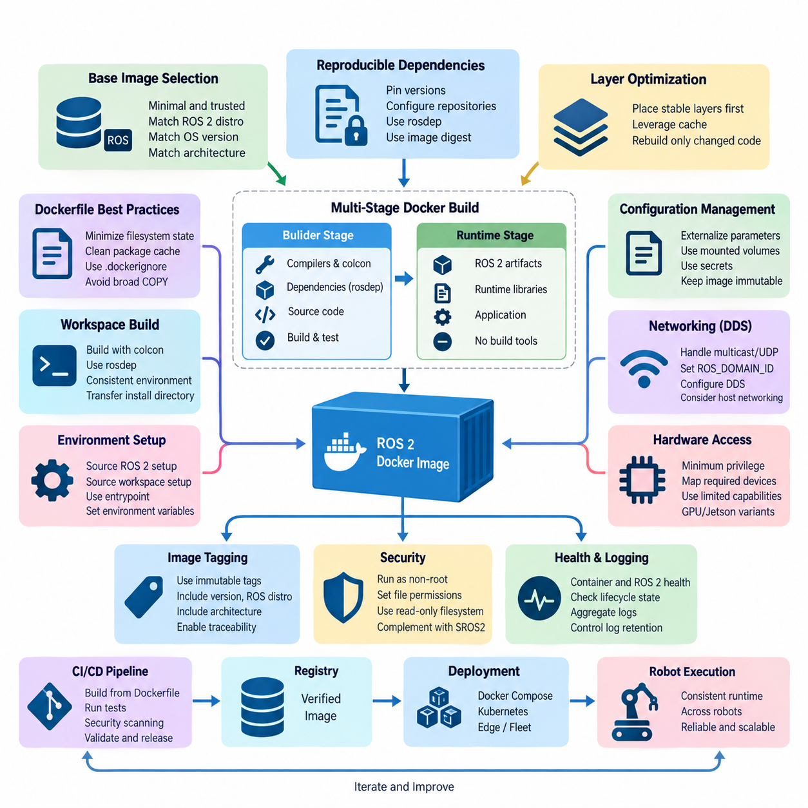
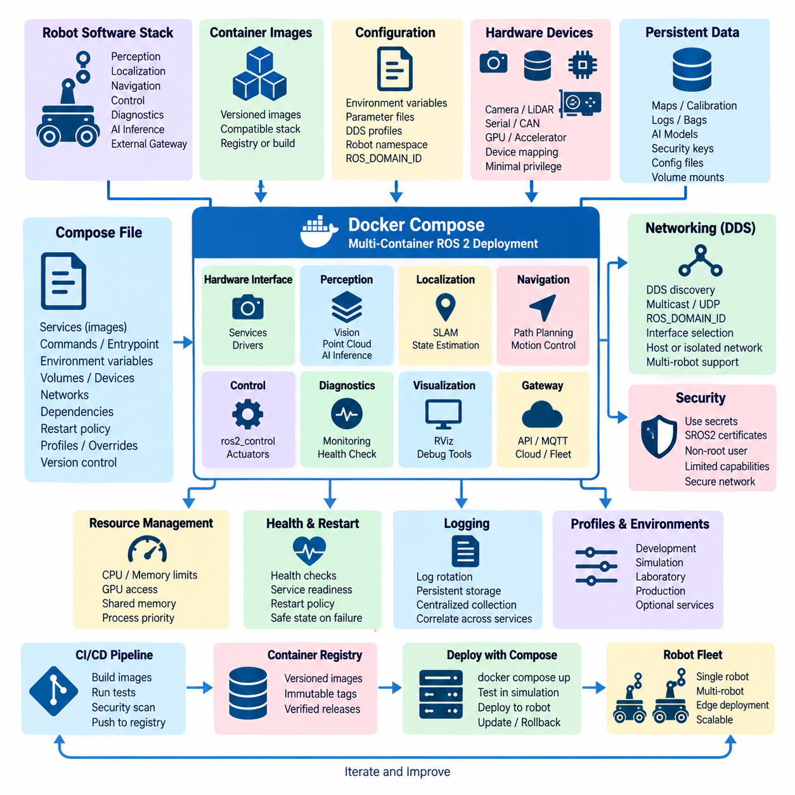
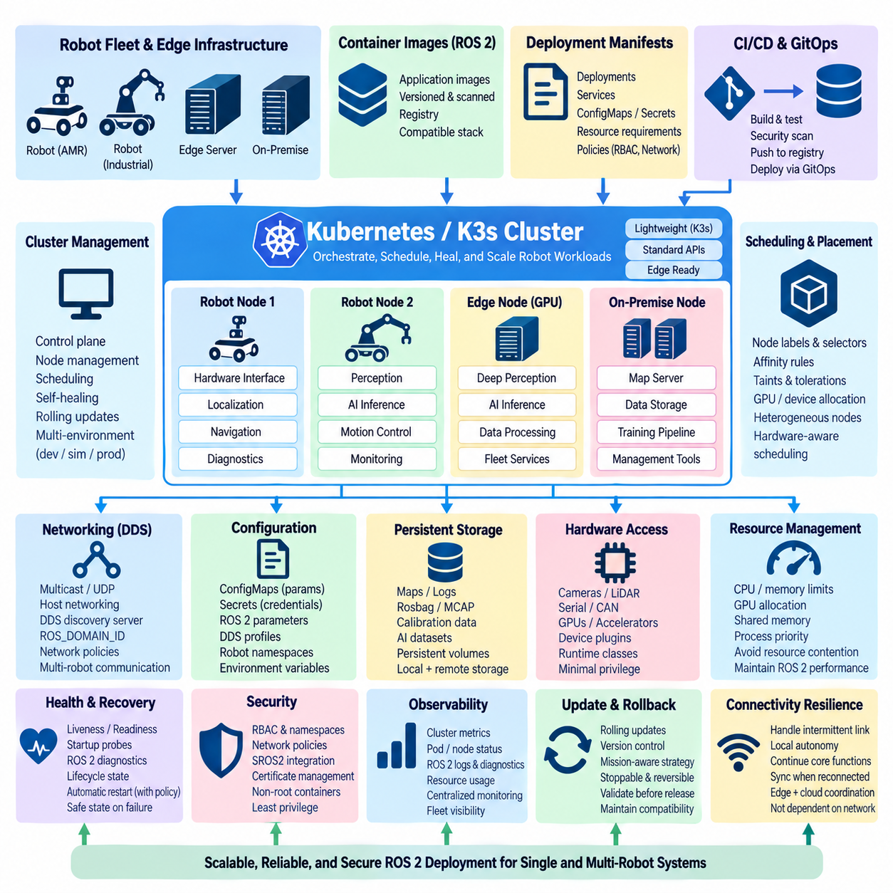
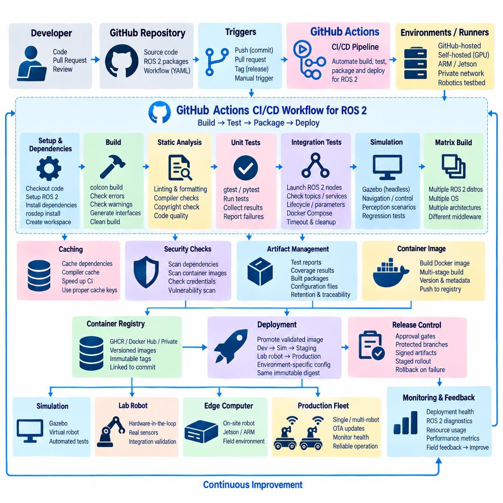
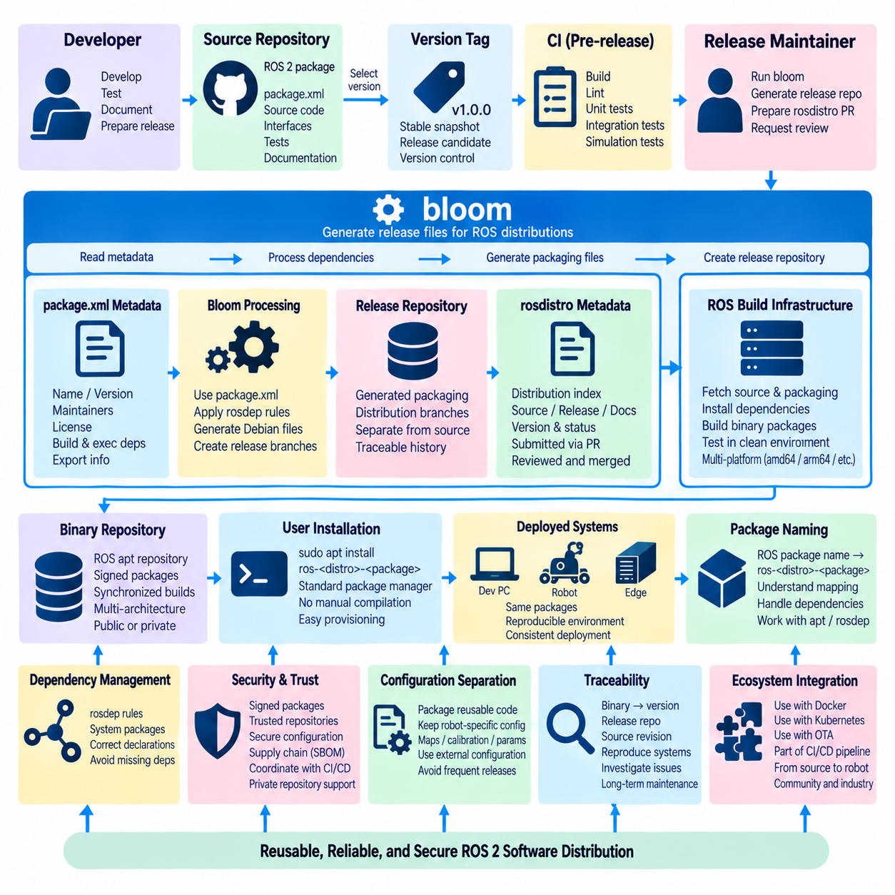
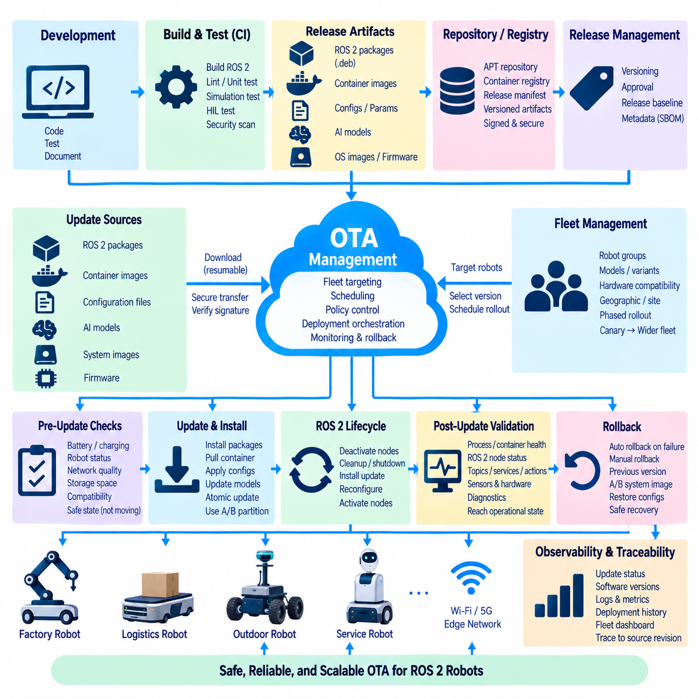
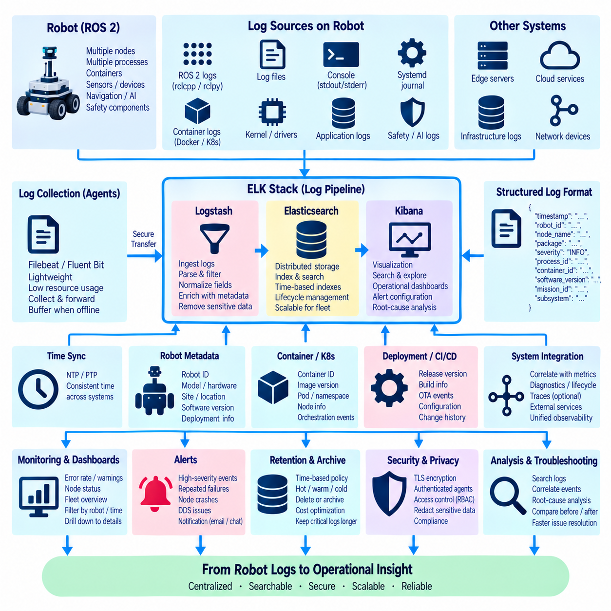
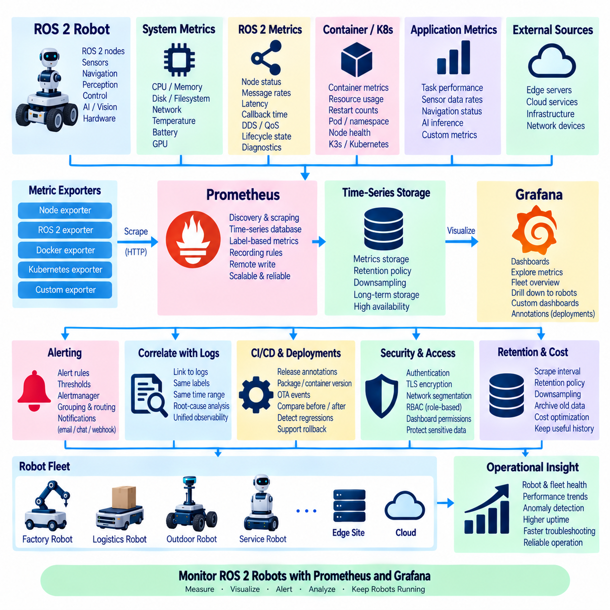
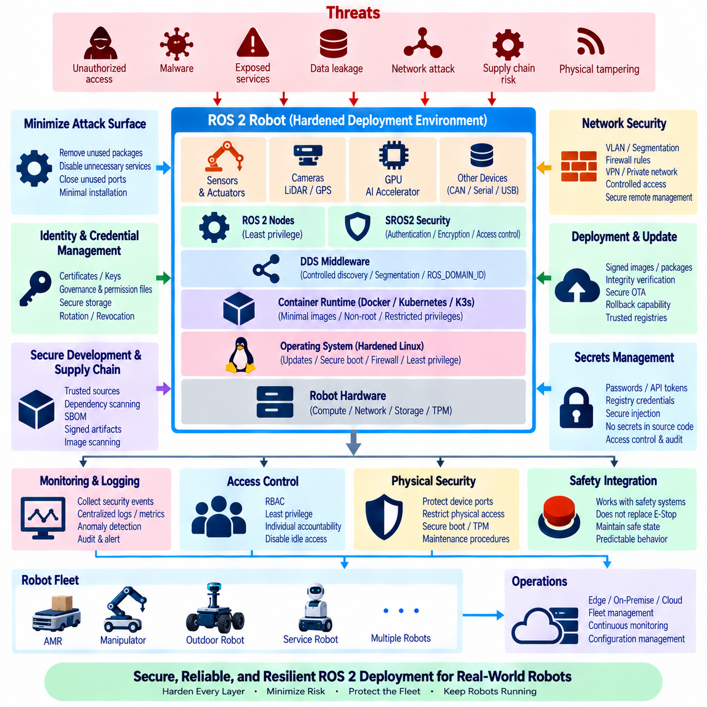
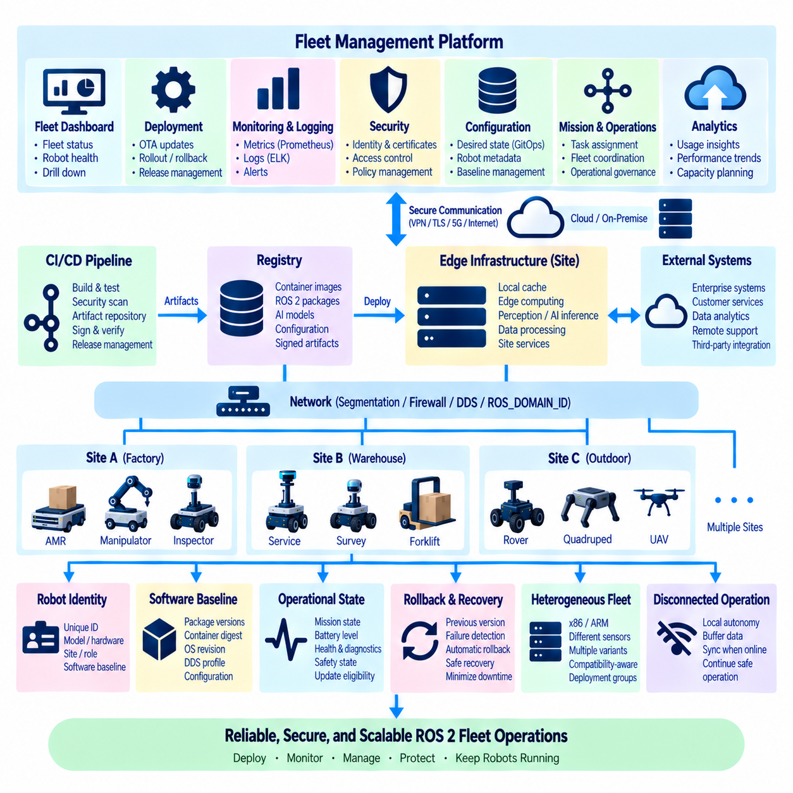

**Volume 05 Robot Middleware and ROS2**

# 08. ROS2 Deployment and DevOps

## 08.01 ROS2 Containerization: Dockerfile Best Practices [w/Code]

{width="7.268055555555556in" height="7.268055555555556in"}

Containerization provides a controlled deployment boundary for ROS 2 software by packaging application binaries, runtime libraries, ROS distributions, and configuration dependencies into reproducible images. In robotics, this reduces differences between developer workstations, CI environments, simulation systems, edge computers, and production robots while preserving a consistent software baseline across deployments.

A ROS 2 Dockerfile should begin from the smallest trustworthy base image that still satisfies the application requirements. The selected image should explicitly match the intended ROS 2 distribution, operating-system release, and processor architecture. Production images should avoid unnecessary development utilities because every additional package increases image size, build time, dependency complexity, and the potential security attack surface.

Reproducibility requires dependency installation to be deterministic rather than dependent on the changing state of external repositories. Package versions should be constrained where practical, repository configuration should be explicit, and rosdep should resolve package dependencies from a well-defined workspace. Docker base images can also be pinned by digest when strict traceability is required for validated robot software releases.

Docker layer organization strongly affects build efficiency. Instructions that change infrequently, such as operating-system and ROS dependency installation, should appear before frequently modified application source code. Docker can then reuse cached dependency layers while rebuilding only the application-specific layers. This becomes particularly important for large ROS 2 workspaces containing perception, navigation, control, and AI packages.

Multi-stage builds provide an effective method for separating compilation from execution. A builder stage may contain compilers, colcon, development headers, testing utilities, and source code, while the final runtime stage receives only the installed ROS 2 artifacts and required runtime libraries. This approach produces smaller production images and prevents build tools and temporary files from unnecessarily becoming part of deployed robot software.

ROS 2 workspaces should normally be built using colcon inside the container so that compilation occurs against exactly the libraries used by the target runtime environment. The source workspace can be copied into a dedicated build stage, dependencies resolved through rosdep, and packages compiled with an appropriate build type. The resulting install directory then becomes the primary software artifact transferred into the runtime image.

Dockerfile instructions should minimize unnecessary filesystem state. Package-manager metadata and temporary files should be removed in the same layer in which they are created, and broad COPY operations should be avoided. A carefully designed .dockerignore file should exclude build, install, log, version-control, dataset, model-cache, and temporary directories unless they are explicitly required by the containerized application.

ROS 2 containers require deliberate handling of environment initialization. The container entrypoint should source the ROS distribution setup script and, when applicable, the workspace install/setup script before executing the requested process. This ensures that package paths, shared libraries, interface definitions, and ROS-specific environment variables are consistently available without requiring every command to repeat environment initialization logic.

Configuration should generally remain separate from immutable application binaries. Robot-specific parameters, calibration data, DDS configuration, security artifacts, maps, and deployment settings may be supplied through mounted volumes, secrets, or environment-specific configuration mechanisms. This separation allows the same tested image to operate across multiple robots without rebuilding an image simply because a robot identifier or deployment parameter changes.

ROS 2 networking requires additional consideration because DDS discovery and data transport interact with container networking. Multicast discovery, UDP traffic, interface selection, ROS_DOMAIN_ID, DDS implementation settings, and host networking behavior must be evaluated for the actual deployment environment. A container that operates correctly on a developer workstation may behave differently across robot computers, VLANs, Wi-Fi networks, or multi-robot systems.

Hardware access should follow the principle of minimum privilege. Cameras, LiDAR interfaces, serial devices, CAN adapters, GPUs, and other accelerators should expose only the devices and permissions required by the ROS 2 process. Running every robot container with privileged mode may simplify initial integration, but it weakens isolation and makes security auditing difficult. Explicit device mappings and narrowly defined Linux capabilities are preferable.

GPU-based ROS 2 workloads introduce another compatibility boundary involving the host driver, container runtime, CUDA libraries, and application framework. Perception and Physical AI containers should therefore separate hardware-dependent runtime requirements from application dependencies wherever possible. Image variants may be maintained for CPU, NVIDIA GPU, or Jetson targets while preserving common ROS 2 interfaces and application-level behavior.

Containers should not automatically imply that every ROS 2 node requires an independent image. Node composition, process boundaries, failure isolation, hardware ownership, communication overhead, update frequency, and lifecycle requirements should determine container boundaries. Closely coupled nodes may reasonably share a container, while perception, navigation, hardware interfaces, AI inference, diagnostics, and fleet gateways may require different deployment units.

Production images should execute ROS 2 applications as non-root users whenever hardware and operating requirements permit. File permissions, mounted volumes, device groups, Linux capabilities, read-only filesystems, and writable runtime directories should be designed explicitly. Container security should complement SROS2 and DDS security rather than replace them, because process isolation and communication authentication address different layers of the robot security architecture.

Health management should distinguish container availability from ROS 2 application readiness. A running container does not guarantee that DDS discovery succeeded, sensors initialized correctly, lifecycle nodes reached the active state, or required dependencies became available. Deployment systems should therefore combine container-level health checks with ROS 2 lifecycle state, diagnostics, topic activity, service readiness, and hardware status where operationally appropriate.

Logging should be designed for persistent operation rather than interactive development. ROS 2 console output, application logs, diagnostics, and container runtime logs need controlled retention and aggregation so that storage does not grow indefinitely on edge computers. Important operational information should remain accessible after container restart, while transient build files and debugging artifacts should not become permanent parts of production images.

Image tagging must support traceability. Mutable labels such as latest are convenient during development but insufficient for controlled fleet deployment. Production releases should identify the application version, ROS distribution, architecture, and relevant build revision through immutable tags, digests, or associated metadata. This allows operators to determine exactly which software image is running on each robot and enables reliable rollback after deployment failures.

CI/CD pipelines should build ROS 2 images from version-controlled Dockerfiles and verify them before fleet deployment. Typical validation can include dependency resolution, colcon compilation, unit tests, integration tests, security scanning, image metadata inspection, and simulation-based startup tests. The same validated artifact should progress through staging and production whenever possible instead of rebuilding nominally identical software at each deployment stage.

Containerization is therefore most effective when treated as part of the ROS 2 deployment architecture rather than merely as a packaging technique. A well-designed Dockerfile establishes reproducible dependencies, controlled runtime privileges, efficient builds, hardware-aware execution, observable health, and traceable releases. These properties create the foundation for subsequent Docker Compose, CI/CD, OTA, monitoring, and large-scale fleet deployment mechanisms.

## 08.02 Docker Compose-Based Robot SW Stack Deployment [w/Code]

{width="7.268055555555556in" height="7.268055555555556in"}

Docker Compose provides a declarative method for deploying a complete ROS 2 robot software stack as a coordinated collection of containers. Instead of manually starting perception, navigation, control, diagnostics, and application processes, a Compose file describes their images, runtime parameters, networks, volumes, devices, and dependencies. This converts robot deployment into a version-controlled system configuration that can be reproduced across development and production platforms.

A robot software stack should be divided into services according to operational responsibility rather than simply assigning one container to every ROS 2 node. Typical boundaries may separate hardware interfaces, perception pipelines, localization, navigation, AI inference, diagnostics, and external gateways. Closely coupled ROS 2 components can remain within one service when composition improves performance, while independently updated or failure-sensitive functions benefit from separate containers.

The Compose YAML file becomes the deployment manifest describing how these services operate together. Each service can reference a prebuilt image or Dockerfile, define its command and entrypoint, specify environment variables, attach volumes, expose hardware devices, and configure restart behavior. Keeping this configuration in version control allows the deployed topology to evolve together with ROS 2 packages while preserving a traceable history of system-level changes.

Image versions should be explicitly controlled because a multi-container robot depends on compatibility among several software components. Mutable tags such as latest can cause different robots to obtain different implementations even when they use the same Compose file. Versioned tags or immutable image digests provide stronger reproducibility and make it possible to reconstruct a fleet configuration, verify a release, and roll back individual services when deployment problems occur.

ROS 2 communication introduces special networking requirements because DDS discovery and transport must operate across service boundaries. Compose networks can isolate application groups, but multicast, UDP communication, interface selection, ROS_DOMAIN_ID, and DDS configuration must remain compatible with the intended topology. Host networking can simplify some robot deployments, although it reduces network isolation and should therefore be selected according to operational requirements rather than used automatically.

Multi-robot systems require deliberate separation of communication domains and naming spaces. Environment variables and external configuration can assign ROS_DOMAIN_ID values, robot namespaces, DDS profiles, and unique robot identifiers without modifying container images. This allows a common software image set to be deployed across many robots while Compose configuration provides robot-specific identity and communication behavior appropriate to each physical platform.

Hardware-facing services require explicit access to physical resources. Compose can map cameras, serial ports, CAN interfaces, LiDAR devices, USB peripherals, GPUs, and other accelerators into selected containers rather than exposing all host hardware to the complete software stack. Device mappings, group permissions, runtime configuration, and Linux capabilities should follow minimum-privilege principles so that a failure in one service does not unnecessarily compromise other robot functions.

Persistent and configurable data should be separated from immutable container images through volumes and bind mounts. Calibration files, maps, ROS 2 parameter files, DDS profiles, security material, AI models, and operational data can therefore survive container replacement or be changed independently from application binaries. Writable directories should be deliberately defined because unrestricted persistence makes deployment behavior difficult to reproduce and complicates rollback between software versions.

Service dependencies require more than specifying a simple startup order. A container may have started while its ROS 2 node is still initializing, waiting for hardware, discovering DDS participants, loading a map, or transitioning through lifecycle states. Consequently, dependency management should combine Compose startup relationships with health checks, ROS 2 lifecycle orchestration, application readiness, and retry mechanisms instead of assuming that a running container represents a ready subsystem.

Health checks provide a bridge between container supervision and robot application state. Basic checks may verify that a process remains alive, while stronger checks can confirm expected services, device availability, application endpoints, or ROS 2 subsystem readiness. Safety-critical decisions should not depend solely on Docker health status, however, because container supervision does not replace dedicated robot diagnostics, safety controllers, watchdogs, or lifecycle-based safe-state mechanisms.

Restart policies can improve availability when processes terminate unexpectedly, but automatic restart must be designed according to subsystem behavior. Restarting a visualization or telemetry service may be straightforward, whereas repeatedly restarting a hardware driver or motion-related component could create undesirable state transitions. Recovery policies should therefore coordinate restart limits, lifecycle initialization, hardware state, dependency recovery, and escalation to a controlled robot safe state when automatic recovery fails.

Environment-specific configuration should be separated from the primary Compose definition whenever practical. A common base configuration can describe the standard ROS 2 stack, while environment files or Compose overrides adapt it for development computers, simulation, laboratory robots, GPU platforms, and production systems. This prevents duplicated deployment manifests from gradually diverging and supports a consistent architecture across heterogeneous robot computing environments.

Resource management becomes increasingly important when perception and Physical AI workloads share an edge computer with navigation and control services. CPU allocation, memory limits, GPU access, shared-memory capacity, process priorities, and storage consumption should be considered explicitly. Containers provide useful isolation boundaries, but inappropriate resource competition can still increase ROS 2 callback latency, degrade sensor processing, or cause AI workloads to interfere with time-sensitive robot functions.

Logging should be coordinated at the stack level because each service produces independent container and ROS 2 logs. Log rotation, maximum file size, persistent diagnostic storage, timestamps, and centralized collection should be configured so that long-running robots do not exhaust local storage. Service names, container versions, robot identifiers, and ROS 2 node information should remain correlated, allowing operators to reconstruct events across perception, navigation, hardware, and application services.

Secrets and security credentials should not be embedded directly into Compose files or container images. SROS2 keystores, certificates, registry credentials, API tokens, and other sensitive material should be injected through controlled secret-management mechanisms or protected mounts. Services should normally execute as non-root users, receive only required devices and capabilities, and expose only necessary network interfaces, reducing the security impact of a compromised container.

Profiles and optional services can make one Compose architecture usable for several operating modes. Development deployments may include visualization, debugging, tracing, and simulation services, while production robots activate only operational components. GPU inference, alternative sensor drivers, or maintenance tools can similarly be enabled selectively. This approach preserves a common deployment model without forcing every robot or development environment to run an identical set of containers.

The Compose deployment process should integrate with CI/CD rather than depend on manually built images. Each service image can be compiled, tested, scanned, versioned, and published to a registry before the Compose manifest references the validated release. Integration testing can then launch the complete stack in simulation or a hardware test environment, verifying communication, dependencies, lifecycle behavior, configuration compatibility, and startup sequencing before deployment to physical robots.

Rollback should be treated as a system-level capability because robot behavior depends on interactions among multiple services. Updating only one image may introduce interface, message, parameter, or behavioral incompatibilities with the remaining stack. A release manifest should therefore record the compatible image versions and configuration revisions forming a validated robot software baseline, enabling the entire deployment or selected compatible components to return to a known operational state.

Docker Compose is particularly suitable for single-robot computers, development systems, laboratory platforms, and moderately complex edge deployments where a lightweight orchestration mechanism is sufficient. As fleet scale and distributed infrastructure requirements increase, Kubernetes or K3s may provide stronger scheduling and cluster-management capabilities. Compose nevertheless remains valuable as a transparent deployment layer for defining and validating the service architecture of an individual ROS 2 robot.

A well-designed Docker Compose architecture therefore transforms ROS 2 deployment from a collection of startup commands into a reproducible robot software system. Container boundaries, networking, hardware mapping, persistent configuration, health supervision, security, resource control, versioning, CI/CD, and rollback become explicit parts of the deployment model. This creates a stable foundation for OTA updates, monitoring, fleet operations, and subsequent large-scale ROS 2 deployment mechanisms.

## 08.03 Kubernetes / K3s-Based Robot Deployment [w/Code]

{width="7.268055555555556in" height="7.268055555555556in"}

Kubernetes provides a declarative orchestration layer for deploying, supervising, and updating containerized ROS 2 software across distributed robot and edge-computing systems. While Docker Compose is effective for managing a stack on an individual robot computer, Kubernetes introduces cluster-level scheduling, service management, recovery, configuration, and rollout mechanisms. K3s provides a lightweight Kubernetes distribution that makes these capabilities practical for resource-constrained robotics environments.

A robot deployment can model each physical robot, edge computer, or on-premise server as a Kubernetes node participating in a common cluster. Workloads are represented as Pods containing one or more closely related containers, while higher-level controllers maintain their desired operating state. This architecture separates application deployment intent from individual host configuration and allows robot software to be managed through a consistent cluster control plane.

K3s is particularly attractive for robotics because it reduces the operational footprint associated with conventional Kubernetes installations. It packages essential cluster components into a compact distribution while retaining standard Kubernetes APIs and deployment concepts. This allows laboratories, AMR fleets, inspection robots, and edge AI platforms to adopt Kubernetes-compatible orchestration without requiring the infrastructure normally associated with large cloud data centers.

The fundamental deployment unit is the Pod, but ROS 2 software boundaries should not automatically correspond to individual ROS 2 nodes. Closely coupled components requiring shared memory or synchronized execution may belong in the same Pod, whereas perception, navigation, AI inference, diagnostics, gateways, and supporting services can be separated according to lifecycle, resource, update, and fault-isolation requirements. Container boundaries should therefore reflect system architecture rather than arbitrary process granularity.

Deployments and other Kubernetes workload controllers describe the desired number and version of application instances. For stateless supporting services, Kubernetes can automatically replace failed Pods and maintain the requested replica count. Robot-specific components require greater caution because hardware drivers, motion controllers, and localization processes are associated with physical devices and state. Automatic rescheduling must respect the relationship between software workloads and the robot hardware they control.

Node labels, selectors, affinity rules, and taints can constrain workloads to appropriate computing platforms. A perception Pod may require an NVIDIA GPU, a hardware-interface Pod may need access to a specific robot computer, and an AI inference workload may be assigned to a high-performance edge server. These scheduling mechanisms allow heterogeneous CPU, GPU, Jetson, and server resources to coexist within a common deployment architecture while maintaining explicit placement policies.

ROS 2 communication over DDS introduces networking considerations that differ from typical web-oriented Kubernetes applications. DDS discovery may depend on multicast, UDP transport, specific network interfaces, and direct connectivity among participants. Overlay networks and network address translation can interfere with expected discovery behavior. Robotics deployments must therefore validate host networking, DDS discovery servers, interface configuration, ROS_DOMAIN_ID, and the selected DDS implementation against the actual cluster topology.

Multi-robot deployments require isolation and identity management beyond basic Kubernetes service discovery. Robot namespaces, ROS_DOMAIN_ID values, DDS profiles, network policies, and robot identifiers can be injected through environment variables and configuration resources. A common container image can therefore support multiple physical robots while deployment manifests determine each robot\'s communication domain, namespace, hardware association, and operational role without rebuilding application software.

ConfigMaps provide a mechanism for separating non-sensitive configuration from container images. ROS 2 parameter files, DDS profiles, application settings, robot identifiers, and environment-specific values can be supplied dynamically to Pods. Sensitive information such as credentials, certificates, API tokens, and SROS2 security material should instead be handled through Kubernetes Secrets or an external secret-management system, with access restricted to only the workloads that require it.

Persistent storage requires special treatment because robot workloads generate maps, logs, rosbag or MCAP recordings, calibration information, AI data, and diagnostic histories. Persistent Volumes and storage classes can separate this data from ephemeral Pod filesystems. Edge deployments must nevertheless account for intermittent connectivity and local storage constraints, ensuring that critical operational data remains available even when robots temporarily lose access to centralized storage infrastructure.

Hardware access is one of the most important differences between conventional Kubernetes workloads and robotic applications. Cameras, LiDAR sensors, CAN interfaces, serial devices, motor controllers, and GPUs are physically attached to particular machines. Device plugins, host device mappings, runtime classes, privileged capabilities, and node placement policies may therefore be required. Access should remain narrowly scoped so that container orchestration does not unnecessarily weaken the host security boundary.

Resource requests and limits allow Kubernetes to describe CPU and memory requirements for each workload, while specialized mechanisms can allocate GPU resources. This is useful when perception, navigation, simulation, diagnostics, and Physical AI inference share heterogeneous computing infrastructure. Resource policies should be validated carefully, however, because excessive CPU contention, memory pressure, or GPU competition can increase ROS 2 latency and degrade time-sensitive robot behavior.

Real-time control should remain separated from assumptions made by general-purpose cluster orchestration. Kubernetes can supervise deployment and availability, but it does not transform ordinary container scheduling into deterministic real-time execution. High-frequency motor control, safety loops, and strict timing functions should remain within appropriately designed real-time processes, controllers, or embedded systems. Kubernetes should primarily orchestrate higher-level ROS 2 workloads around these deterministic control boundaries.

Health management can combine Kubernetes probes with ROS 2 application-level diagnostics. Liveness probes determine whether a workload should be restarted, readiness probes determine whether it is prepared to receive operational traffic, and startup probes accommodate components with long initialization periods. For ROS 2 systems, these mechanisms can be supplemented with lifecycle state, sensor availability, DDS connectivity, diagnostics, and subsystem readiness rather than relying solely on process existence.

Kubernetes self-healing is useful but must be constrained by physical-system semantics. Automatically restarting a telemetry service is fundamentally different from restarting a motor interface or relocating a hardware-dependent Pod to another node. Recovery policies should distinguish stateless services from robot-bound workloads and coordinate restart behavior with lifecycle management, watchdogs, hardware initialization, fault diagnostics, and safe-state transitions when automatic recovery is inappropriate.

Rolling updates allow new software versions to be introduced gradually instead of replacing an entire deployment simultaneously. This is valuable for infrastructure and stateless services, while physical robot software requires additional operational safeguards. Deployment strategies should consider robot mission state, charging status, maintenance windows, hardware compatibility, and validated software baselines. Updates should be stoppable and reversible when health indicators or integration tests reveal unexpected behavior.

Namespaces and role-based access control provide organizational and security boundaries within the cluster. Development, simulation, staging, and production workloads can be separated, while service accounts and RBAC policies restrict which components may modify deployments or access configuration. Network policies can further limit communication paths. These mechanisms complement SROS2 and DDS security, which continue to protect ROS 2 identities, permissions, and communications at the middleware layer.

Observability becomes essential as deployment expands from one robot to a distributed fleet. Kubernetes exposes workload state, restart events, resource utilization, and scheduling information, while ROS 2 contributes node diagnostics, lifecycle states, topic behavior, sensor status, and application logs. Combining infrastructure-level and robot-level telemetry allows operators to distinguish container failures, network problems, resource exhaustion, DDS issues, hardware faults, and application-level degradation.

CI/CD pipelines can generate container images and Kubernetes manifests as version-controlled deployment artifacts. Images should be compiled, tested, security-scanned, tagged, and published to a registry before being referenced by validated manifests. Simulation and hardware-in-the-loop testing can then exercise complete deployments before release. GitOps-style practices can additionally maintain the desired fleet configuration as auditable repository state rather than relying on manual cluster modifications.

K3s can support hierarchical robot infrastructure in which individual robots execute local workloads while edge servers or on-premise computers provide heavier perception, AI inference, data aggregation, and fleet services. Placement policies can determine which computations remain on the robot and which execute on more powerful nodes. This creates a flexible foundation for combining edge intelligence, on-premise AI, and multi-robot coordination within a common deployment framework.

Connectivity loss must be treated as a normal robotics operating condition rather than an exceptional cluster failure. A mobile robot may temporarily lose Wi-Fi, private 5G, or access to the Kubernetes control plane while continuing its mission. Essential navigation, control, perception, and safety functions should therefore remain locally executable. Cluster orchestration should enhance management and recovery without making basic robot autonomy dependent on continuous infrastructure connectivity.

Kubernetes and K3s consequently extend ROS 2 deployment from container management on individual computers toward coordinated orchestration across robots, edge nodes, and shared infrastructure. Their value comes from declarative configuration, controlled scheduling, resource management, health supervision, security boundaries, observable operations, and managed updates. When combined with ROS 2 lifecycle management and robot-aware safety design, they provide a scalable deployment foundation for increasingly distributed robotic systems.

## 08.04 ROS2 CI/CD Pipeline: GitHub Actions [w/Code]

{width="7.268055555555556in" height="7.268055555555556in"}

Continuous Integration and Continuous Delivery establish a repeatable mechanism for validating and releasing ROS 2 software whenever source code changes. GitHub Actions can automate this workflow directly from a repository by reacting to pushes, pull requests, tags, or manually triggered events. For robotics teams, the pipeline becomes a quality gate that verifies software before it reaches simulation, laboratory hardware, edge computers, or production robots.

A ROS 2 CI/CD workflow is normally defined as version-controlled YAML under the repository's GitHub Actions configuration. The workflow specifies triggers, jobs, execution environments, permissions, environment variables, and individual validation steps. Keeping pipeline definitions beside application source code allows build and test procedures to evolve with the software while making changes reviewable through the same pull-request process used for ROS 2 packages.

Pipeline triggers should reflect the development and release strategy. Pull requests can initiate fast compilation, linting, and unit tests before code is merged, while commits to protected branches can execute broader integration tests and container builds. Version tags or approved release events can initiate packaging and deployment stages. Separating validation from release triggers prevents ordinary development activity from unintentionally publishing or deploying production artifacts.

The build environment must reproduce the intended ROS 2 distribution, operating-system version, and architecture as closely as practical. GitHub-hosted runners can provide standardized environments for common builds, while containers can establish a more controlled ROS 2 toolchain. Self-hosted runners become useful when workflows require specialized GPUs, ARM or Jetson platforms, private networks, proprietary dependencies, or direct access to robotics test infrastructure.

Dependency installation should be automated and deterministic. A workflow can create the ROS 2 workspace, import required repositories, update rosdep information, resolve system dependencies, and install packages before invoking colcon. Dependency versions should be constrained where reproducibility matters because uncontrolled external updates can cause a previously successful pipeline to fail even when application source code has not changed.

The primary compilation stage should execute colcon build with options appropriate to the target workspace and development policy. Build failures, compiler warnings, missing dependencies, interface-generation problems, and package-ordering issues can therefore be detected before integration. Clean builds remain important even when caching is enabled because the pipeline must demonstrate that the repository can produce valid ROS 2 artifacts without relying on undeclared state from a developer workstation.

Caching can substantially reduce CI execution time for large ROS 2 projects, but cached data should be selected carefully. Package downloads, compiler caches, or stable dependency layers may provide useful acceleration, whereas blindly caching build and install directories can conceal dependency problems. Cache keys should incorporate relevant operating-system, ROS distribution, compiler, dependency, and source information so that incompatible artifacts are not reused across different build configurations.

Static analysis and formatting checks provide an early quality barrier before computationally expensive tests execute. ROS 2 packages can integrate linters, compiler diagnostics, formatting rules, copyright checks, and language-specific analysis through the ament ecosystem or dedicated tools. Running these checks consistently in CI reduces differences between developers and prevents style, maintainability, and common implementation defects from accumulating unnoticed.

Unit testing should execute automatically after successful compilation. C++ packages can use gtest through ament_cmake_gtest, while Python packages can use appropriate testing frameworks integrated with the ROS 2 build system. Test results generated by colcon should be collected and reported even when failures occur. This gives developers immediate information about which package or component failed rather than presenting the pipeline only as a binary success or failure indicator.

Integration testing verifies behavior that cannot be established from isolated packages. A workflow may launch multiple ROS 2 nodes and validate topic communication, services, actions, parameters, lifecycle transitions, or expected message flows. Test environments can also start Docker Compose stacks or temporary container networks. Timeouts and cleanup procedures are essential because distributed ROS 2 tests can otherwise leave processes running or cause CI jobs to wait indefinitely.

Simulation provides an important intermediate validation layer between software-only testing and physical robot deployment. Headless Gazebo, other simulators, or application-specific test environments can execute navigation, perception, control, and mission scenarios without requiring physical hardware for every commit. Simulation does not replace hardware testing, but it allows major integration failures and behavioral regressions to be detected earlier and at significantly greater execution frequency.

A matrix build can test the same ROS 2 source against multiple distributions, operating systems, middleware implementations, or build configurations. This is particularly useful for reusable libraries and robot platforms that must support heterogeneous deployment targets. Matrix coverage should remain intentional because every additional combination increases CI cost and maintenance effort. Critical production combinations deserve stronger coverage than experimental environments.

Container image generation can follow successful ROS 2 build and test stages. The pipeline can build Docker images using validated Dockerfiles, assign immutable version identifiers, and publish them to an authorized container registry. Multi-stage Docker builds help ensure that development dependencies remain outside production images. Image metadata should connect the deployed artifact to the source commit, release version, architecture, and ROS distribution from which it was produced.

Security checks should be incorporated before artifacts become eligible for deployment. Workflows can scan source dependencies, container images, credentials exposure, and known vulnerabilities while enforcing repository permissions and protected release processes. GitHub Actions permissions should follow least-privilege principles, and long-lived credentials should not be embedded in workflow files. Repository secrets or federated identity mechanisms should provide controlled access to registries and deployment infrastructure.

Artifacts provide traceability between CI execution and robot deployment. Test reports, coverage information, compiled packages, container metadata, configuration manifests, and selected diagnostic outputs can be retained according to project policy. A release should be reconstructable from its source revision and associated artifacts. This becomes especially important when diagnosing a robot failure months after deployment or demonstrating which software baseline was used during validation.

Self-hosted runners extend CI from cloud-based software validation into physical robotics infrastructure. A laboratory runner can access GPUs, Jetson devices, CAN interfaces, sensors, or complete robots that are unavailable to standard hosted environments. Such runners should be isolated and carefully secured because executing repository workflows on machines connected to physical hardware introduces substantially greater operational risk than ordinary software compilation.

Hardware-in-the-loop testing should be positioned after lower-cost validation stages have succeeded. The pipeline can deploy a candidate build to a controlled robot or test bench, initialize required ROS 2 subsystems, execute predefined scenarios, collect diagnostics, and evaluate expected outcomes. Hardware access should be serialized when necessary so that concurrent jobs do not attempt to control the same device, and failures should return the test system to a known safe state.

Deployment should promote previously validated artifacts rather than rebuild source code independently for each environment. A candidate container image can move from development validation to simulation, staging, laboratory robots, and eventually production while retaining the same immutable digest. Environment-specific parameters remain external to the image. This approach reduces uncertainty about whether the software tested in CI is actually identical to the software executing on the robot.

Production deployment requires stronger controls than ordinary CI execution. Protected environments, approval gates, release branches, signed artifacts, maintenance windows, and staged rollout policies can prevent unreviewed changes from reaching operational robots. Deployment workflows should record which software version was delivered to each target and preserve a rollback path to a validated baseline when post-deployment health checks reveal unexpected behavior.

For robot fleets, CI/CD should coordinate software versioning with configuration compatibility. A release may include ROS 2 packages, container images, parameter files, DDS profiles, lifecycle settings, and deployment manifests that have been validated together. Treating these elements as a coherent release baseline prevents partial updates from introducing incompatible interfaces or behavior across perception, navigation, control, AI inference, and fleet-management services.

Observability closes the loop between deployment and subsequent development. CI/CD can verify immediate deployment health, while operational monitoring provides evidence about crashes, resource consumption, ROS 2 diagnostics, communication failures, and application performance after release. These observations can become inputs for regression tests and future pipeline improvements, turning field experience into repeatable validation rather than leaving operational knowledge outside the development process.

A mature GitHub Actions pipeline therefore connects source control, reproducible builds, static analysis, automated testing, simulation, container generation, security validation, hardware testing, release management, and controlled deployment. For ROS 2 robotics, CI/CD is not simply an automation convenience; it becomes part of the software assurance architecture that establishes traceability from a source commit to the exact validated software operating on a physical robot.

## 08.05 ROS2 Package Distribution: bloom / ros.infrastructure

{width="7.268055555555556in" height="7.268055555555556in"}

ROS 2 package distribution transforms source repositories into installable software that users can obtain through standard operating-system package managers. Rather than requiring every robot developer to clone repositories and compile workspaces manually, the ROS infrastructure provides a release process that generates binary packages for supported ROS distributions and platforms. This creates a consistent path from package development to reproducible installation and deployment across robotics systems.

A ROS 2 package normally begins in a source repository containing package.xml, build-system configuration, source code, interfaces, tests, and documentation. The package manifest defines metadata such as package name, version, maintainers, licenses, build dependencies, execution dependencies, and export information. Accurate metadata is essential because the release infrastructure uses this information to resolve dependencies and construct packages for downstream users.

Source development and package release are intentionally separated. Developers can continue normal development in the primary repository while a specific source revision is selected for an official release. This separation prevents the distribution process from depending directly on a changing development branch and provides a stable relationship between a released version, its source tag, generated packaging information, and resulting binary artifacts.

Bloom is the primary ROS release automation tool used to convert ROS package metadata into distribution-specific packaging information. It reads package manifests and repository configuration, processes dependency information, and generates the files required by the target packaging ecosystem. For Ubuntu-based ROS deployments, this typically means generating Debian packaging metadata that can later be built into binary .deb packages by the ROS build infrastructure.

The release process commonly uses a dedicated release repository generated and maintained through bloom. This repository is different from the normal source repository because it contains generated packaging branches and metadata corresponding to released versions. Keeping generated release information separate prevents packaging-specific files from cluttering application development while preserving a traceable history of how each ROS package version was prepared for distribution.

The ROS distribution index, commonly represented through rosdistro metadata, connects package repositories with a particular ROS distribution. Repository entries describe source, release, and documentation information together with version and status data. When maintainers prepare a package for a ROS distribution, the corresponding metadata must eventually be updated so that the central infrastructure recognizes the new release and can schedule the required build operations.

Dependency resolution is a central part of this process. Package dependencies declared in package.xml are mapped to platform-specific system packages through rosdep rules and distribution metadata. Bloom uses this information when producing packaging configuration, while build systems later install the required dependencies before compilation. Incorrect or incomplete dependency declarations can therefore cause failures even when the package builds successfully inside the maintainer\'s existing development workspace.

Package versioning should follow a disciplined release policy because versions become part of the public distribution interface. A release identifies a specific implementation that downstream packages and robot deployments may depend upon. Changing source code without changing the corresponding package version can undermine traceability, while uncontrolled version changes can complicate dependency management. Release tags and package.xml versions should therefore remain synchronized.

When a maintainer initiates a bloom release, the tool processes the selected source version, updates the release repository, and prepares changes required for the ROS distribution metadata. The resulting update is typically submitted for review before becoming part of the distribution index. This review step separates package-maintainer actions from modifications to the shared ROS distribution and provides an opportunity to detect metadata or release problems before automated builds begin.

After release metadata is accepted, ROS build infrastructure can generate platform-specific binary packages. Build jobs obtain the released source and packaging information, install dependencies in controlled environments, compile the software, execute applicable packaging steps, and produce repository artifacts. Building packages centrally reduces dependence on individual developer machines and helps ensure that binaries distributed to users correspond to known source and dependency configurations.

Binary repositories provide the user-facing endpoint of the ROS distribution pipeline. Once successfully built and synchronized, ROS 2 packages can be installed using standard operating-system package-management commands rather than compiling from source. This greatly simplifies provisioning of development computers, CI runners, edge systems, and robot computers because common ROS packages can be installed using the same dependency-management mechanisms as other system software.

Package naming follows conventions that connect the ROS distribution and package identity to the generated operating-system package. A ROS package with a source-level name may therefore appear as a distribution-specific Debian package with a ROS-prefixed name. Understanding this distinction is useful when diagnosing rosdep resolution, apt installation, dependency conflicts, or differences between package names used inside a ROS workspace and names visible to the operating system.

The distribution pipeline must account for multiple supported platforms and architectures. A package that compiles successfully on one developer computer may fail on another operating-system version or processor architecture because of compiler behavior, dependency availability, or platform-specific code. Automated build infrastructure exposes these problems before users encounter them and encourages maintainers to avoid assumptions that exist only in their local development environment.

Package maintainers should treat build failures as release-quality signals rather than merely infrastructure problems. Missing dependencies, undeclared system libraries, incorrect install rules, generated-interface errors, and architecture assumptions frequently become visible only in clean build environments. Reproducing these failures locally with clean containers or CI environments can help identify hidden dependencies and improve the portability of the ROS 2 package.

Release automation works best when integrated with normal CI practices. Source repositories should already pass compilation, linting, unit testing, and integration testing before a version is selected for distribution. Bloom and the ROS build infrastructure then address packaging and distribution rather than replacing software validation. This establishes a layered process in which CI validates source quality and the release infrastructure validates package construction and distribution readiness.

Public ROS distribution is not the only useful application of these concepts. Robotics organizations can maintain internal package repositories for proprietary drivers, robot applications, AI components, and company-specific middleware. The same principles of explicit package metadata, versioning, dependency management, controlled builds, repository publication, and traceable releases can support private ROS 2 distribution even when packages are not submitted to the public ROS ecosystem.

Private distribution is particularly useful for production robots because a complete system often combines public ROS packages with proprietary software. Public dependencies may come from standard ROS repositories while organization-specific packages are delivered through authenticated internal repositories or container images. Release baselines should record both sets of dependencies so that a deployed robot can be reconstructed without relying on an undocumented developer workspace.

Package signing and repository trust are important when binary packages become part of production deployment. Robot computers should obtain software only from authorized repositories using verified repository configuration and package-management security mechanisms. Distribution security must also be coordinated with CI/CD, container security, OTA policies, and software bill of materials practices because package provenance becomes part of the overall robot software supply chain.

ROS 2 distribution should distinguish reusable middleware packages from robot-specific configuration. Libraries, drivers, interfaces, algorithms, and stable application components are suitable candidates for versioned package distribution, while frequently changing maps, calibration files, robot identities, secrets, and environment-specific parameters may require separate configuration mechanisms. This separation prevents unnecessary package releases whenever operational configuration changes.

A release should remain traceable from installed binary back to package version, release repository, and original source revision. This traceability becomes important when investigating field failures, reproducing older robot configurations, managing security vulnerabilities, or determining which fleets contain an affected software version. Package distribution therefore contributes not only installation convenience but also configuration management and long-term maintainability.

The ROS release ecosystem creates a structured chain connecting source repositories, bloom, release repositories, rosdistro metadata, automated build infrastructure, binary repositories, and end-user installation. Each stage has a distinct responsibility, allowing development, packaging, building, and distribution to remain separated while still forming a reproducible pipeline. This modular structure supports both community-scale ROS software sharing and disciplined industrial robot software delivery.

For large robotic systems, package distribution can coexist with Docker, Kubernetes, and OTA mechanisms rather than competing with them. ROS packages may be installed while constructing a container image, containers may then be validated through CI/CD, and validated images may later be deployed to robots or fleets. Bloom and ROS infrastructure therefore occupy the package-release layer within a broader deployment architecture that can extend from source code to production robot operation.

## 08.06 Robot OTA and ROS2 Package Update Integration [w/Code]

{width="7.268055555555556in" height="7.268055555555556in"}

Robot Over-the-Air update architecture provides a controlled mechanism for delivering new ROS 2 software, configuration, security fixes, and system components to deployed robots without requiring direct physical access. OTA becomes especially important when robots operate as fleets across factories, logistics centers, outdoor facilities, or remote sites. The update system must preserve availability, traceability, compatibility, and safe robot behavior throughout the complete deployment lifecycle.

ROS 2 software can be updated at several layers, including Debian packages, application binaries, container images, configuration files, AI models, and complete operating-system images. These mechanisms should not be treated as interchangeable. Package-level updates provide fine-grained changes, containers provide stronger application isolation, while system-image approaches support atomic platform replacement. A practical robot may combine several methods under one coordinated OTA policy.

The update pipeline should begin with a clearly identified software release rather than an arbitrary collection of recently built files. ROS 2 packages, container images, parameter sets, DDS profiles, firmware dependencies, and deployment manifests should be associated with a validated release baseline. This prevents partial deployment of incompatible components and allows operators to determine exactly which software configuration is intended for a particular robot model or fleet group.

ROS 2 package distribution can integrate naturally with OTA by publishing validated packages to controlled public or private repositories. Robot computers can obtain versioned packages through standard package-management mechanisms while the OTA controller determines when and where installation occurs. Package repositories provide dependency resolution and version management, whereas the OTA layer adds fleet targeting, scheduling, policy enforcement, health verification, and recovery around the package installation process.

Container-based robots can instead distribute application updates as immutable container images. CI/CD builds and validates an image, publishes it to an authorized registry, and records its digest in a release manifest. Robots then retrieve exactly that artifact rather than rebuilding software locally. Docker Compose, Kubernetes, or K3s can activate the new image while external configuration remains separated, providing a clear boundary between validated application software and robot-specific operational parameters.

An OTA update should progress through staged deployment rather than immediately reaching every robot. A candidate release may first pass CI, simulation, hardware-in-the-loop testing, laboratory validation, and a limited pilot deployment. After operational health is confirmed, the release can expand to larger fleet groups. Progressive rollout reduces the number of robots exposed to an unexpected defect and provides measurable checkpoints at which deployment can be stopped.

Fleet targeting requires explicit knowledge of robot identity and compatibility. Update policies may consider robot model, hardware revision, processor architecture, ROS 2 distribution, sensor configuration, GPU platform, geographic deployment group, or operational role. A package compiled for an x86 edge computer must not be delivered to an incompatible ARM target, and a configuration intended for one sensor suite should not silently replace parameters on a different robot variant.

Pre-update validation should determine whether the robot is in an appropriate state for software modification. The system may verify battery level, charging state, mission status, network quality, available storage, package compatibility, hardware readiness, and current software version. Motion-related updates should normally occur only when the robot is stopped or placed into a controlled maintenance state. OTA orchestration must therefore understand robot operational state rather than treating the robot as an ordinary unattended server.

Update artifacts must be authenticated and integrity-checked before installation. Signed packages, trusted repositories, secure container registries, checksums, certificates, and verified manifests can establish confidence that downloaded software is authorized and unchanged. Transport encryption protects communication in transit, but artifact verification remains necessary because OTA security depends on both secure delivery and trustworthy software provenance across the entire supply chain.

Download and installation should be designed for unreliable connectivity. Mobile robots may move between access points, operate over private 5G, experience temporary wireless loss, or work in environments with limited bandwidth. Large container images, AI models, or system images should support resumable or cached transfer where the selected update technology permits it. A temporary network interruption should delay deployment rather than leave the robot in an undefined software state.

Atomicity is an important property for critical updates. If several packages or configuration elements must change together, installing only part of the release can create incompatible interfaces or dependencies. Container image replacement naturally provides a stronger immutable unit, while package-based systems require careful transaction and dependency management. System-level A/B partition schemes can provide even stronger atomic rollback by maintaining both current and candidate operating-system environments.

ROS 2 lifecycle management can coordinate application shutdown and restart during an update. Managed nodes may transition from active operation through deactivation, cleanup, and shutdown before their software is replaced. After installation, nodes can be reconfigured and activated in a controlled sequence. This is safer than abruptly terminating processes because hardware interfaces, navigation components, and other stateful subsystems can release resources and preserve expected system transitions.

Post-update validation must verify robot functionality rather than merely confirm successful package installation. The system can check container health, process startup, ROS 2 lifecycle states, DDS discovery, required topics, services, actions, sensor availability, diagnostics, resource utilization, and hardware communication. A deployment should be considered successful only when the robot reaches a defined operational state and satisfies the health criteria associated with the release.

Rollback must be designed before deployment begins. The OTA system should retain sufficient information to restore the previous validated package set, container image digest, configuration revision, or system partition. Automatic rollback can be triggered when startup fails or health checks exceed predefined limits, while manual rollback may be initiated by an operator. The previous state must itself be known and validated rather than reconstructed from uncertain local files.

Configuration updates require particular caution because parameters can change robot behavior without modifying executable software. Velocity limits, navigation parameters, sensor calibration, safety zones, DDS settings, and AI thresholds may significantly influence system operation. Configuration should therefore be versioned, validated, associated with compatible software releases, and included in rollback planning. Secrets and robot identities should remain separated from ordinary configuration packages whenever possible.

AI-enabled robots add model artifacts to the OTA architecture. Perception networks, foundation-model adapters, policy models, embeddings, or other learned components may be much larger than conventional ROS 2 packages and may have strict GPU or runtime compatibility requirements. Model versions should be associated with the application version, expected accelerator, preprocessing pipeline, and validation results so that updating an AI model does not silently invalidate the surrounding ROS 2 software stack.

OTA should distinguish application recovery from functional safety. Restarting a failed container or reverting a package does not itself guarantee that the physical robot is safe. Independent safety controllers, emergency-stop functions, watchdogs, motion limits, and safe-state mechanisms must remain effective during update and recovery operations. Software deployment should never bypass the safety architecture merely because the robot is temporarily operating in maintenance mode.

Observability is essential throughout the OTA process. The management system should record download progress, installation events, software versions, configuration revisions, health results, rollback actions, and final deployment state. ROS 2 diagnostics and infrastructure telemetry can be correlated with update events to determine whether a newly introduced release causes increased crashes, communication failures, latency, CPU load, GPU pressure, or sensor initialization problems.

Fleet-scale deployment requires bandwidth and infrastructure planning. Updating hundreds of robots simultaneously can overload wireless networks, registries, edge servers, or internet connections. Updates can therefore be scheduled in waves, distributed through local caches, or staged on on-premise infrastructure before installation. Edge-local distribution can reduce external bandwidth consumption while preserving centralized release governance and software-version visibility across the fleet.

CI/CD and OTA should form one continuous software-delivery chain. CI validates source code, builds ROS 2 packages or containers, performs security checks, executes simulation and hardware tests, and produces immutable release artifacts. OTA consumes these already validated artifacts and controls their deployment to physical robots. Rebuilding software during the OTA stage should be avoided because it breaks the direct relationship between the artifact that was tested and the artifact that is deployed.

Release metadata should provide end-to-end traceability from a physical robot back to the originating source revision. Operators should be able to identify the installed ROS 2 package versions, container digests, configuration revision, model version, deployment time, and release identifier for each robot. This information supports field troubleshooting, vulnerability response, regulatory evidence, maintenance planning, and reconstruction of historical robot configurations.

A mature OTA architecture therefore combines ROS 2 package management, container deployment, lifecycle coordination, security verification, staged rollout, health monitoring, rollback, configuration control, and fleet-level observability. The objective is not simply to transfer new files to a robot, but to move a physical system safely and reproducibly from one validated software baseline to another while maintaining a complete record of the transition.

## 08.07 ROS2 Log Aggregation: ELK Stack Integration [w/Code]

{width="7.268055555555556in" height="7.268055555555556in"}

ROS 2 log aggregation provides a centralized mechanism for collecting, storing, searching, and analyzing runtime information generated by distributed robot software. A single robot may execute many nodes across several processes or containers, while a fleet may contain hundreds of such systems. Without centralized aggregation, troubleshooting requires manually inspecting individual machines. An ELK-based architecture converts these fragmented records into searchable operational evidence.

ROS 2 applications generate logs through the ROS client libraries and logging infrastructure, typically including timestamps, severity levels, logger names, node context, and application messages. Additional information may come from operating-system services, containers, device drivers, middleware, safety processes, and AI workloads. Effective observability requires these heterogeneous sources to be correlated rather than treating ROS 2 application logs as an isolated diagnostic channel.

The ELK stack traditionally combines Elasticsearch, Logstash, and Kibana. Elasticsearch provides distributed indexing, storage, and search; Logstash performs ingestion, parsing, filtering, and transformation; Kibana provides visualization, exploration, and dashboards. In practical deployments, lightweight collection agents such as Beats or similar forwarders may gather logs on robot computers and transmit them to centralized or edge-hosted ingestion services.

Log collection should begin as close as practical to the source while minimizing interference with robot workloads. ROS 2 console output, log files, systemd journal records, container stdout and stderr streams, kernel messages, and application-specific files can be captured by local agents. The collector should operate with bounded CPU, memory, disk, and network consumption because diagnostic infrastructure must not compete significantly with navigation, perception, control, or safety-related computation.

Structured logging greatly improves aggregation quality. Instead of relying only on free-form text, records can include fields such as timestamp, robot_id, node_name, package, severity, process_id, container_id, software_version, mission_id, and subsystem. Structured fields allow operators to filter and correlate events across large fleets. A message can then be analyzed not merely as text but as an event associated with a particular robot, release, mission, and software component.

Time synchronization is fundamental when logs from multiple computers must be correlated. Robot computers, edge servers, sensors, and centralized infrastructure should maintain sufficiently consistent clocks through mechanisms such as NTP or PTP according to system requirements. Incorrect timestamps can make causal analysis misleading, particularly when investigating DDS communication failures, sensor delays, distributed state transitions, or events that occurred within milliseconds across several ROS 2 processes.

Log severity should be used consistently across packages. DEBUG messages support detailed development analysis, INFO records describe normal operational transitions, WARN indicates abnormal but potentially recoverable conditions, ERROR identifies significant failures, and FATAL represents conditions preventing continued operation of a component. Poor severity discipline produces either excessive noise or insufficient evidence, reducing the effectiveness of automated searching and operational dashboards.

A local forwarding layer should tolerate temporary network loss because mobile robots cannot assume continuous connectivity to centralized logging infrastructure. Logs can be buffered on local storage and transmitted when connectivity returns. Buffer limits and retention policies are necessary to prevent diagnostic data from consuming the robot filesystem indefinitely. Critical events may receive higher retention or transmission priority than verbose debugging information.

Logstash or an equivalent ingestion pipeline can normalize records arriving from different sources. Parsers can extract ROS 2 metadata, convert timestamps, identify robot and subsystem fields, classify events, enrich records with deployment information, and discard unnecessary content. Consistent normalization allows logs from ROS 2 nodes, Docker containers, Kubernetes workloads, operating-system services, and edge applications to be searched using a common operational vocabulary.

Elasticsearch stores normalized events in indexes designed for efficient search and aggregation. Index organization should consider time range, fleet size, robot identity, environment, and retention requirements. High-frequency logs can create substantial storage demand, so index lifecycle policies can move older records, reduce retention, or delete data according to operational value. Logging architecture must therefore balance diagnostic depth against storage, bandwidth, and infrastructure cost.

Kibana provides an interactive layer for investigating robot behavior. Dashboards can summarize error rates, warning counts, node failures, restart events, communication problems, software versions, and fleet-wide event patterns. Operators can begin with a high-level fleet view and then filter to a specific robot, mission, subsystem, container, or time interval. This significantly reduces the time required to locate relevant evidence during field incidents.

ROS 2 logs become more valuable when correlated with diagnostics and lifecycle state. A navigation failure may coincide with a sensor warning, DDS discovery problem, lifecycle transition, CPU overload, or container restart. Recording common identifiers and synchronized timestamps allows these events to be reconstructed as one operational sequence. Central aggregation therefore supports root-cause analysis that would be difficult from isolated node log files.

Containerized ROS 2 deployments require awareness of container logging behavior. Application output may be captured by Docker logging drivers or Kubernetes container-log mechanisms before being forwarded to the aggregation pipeline. Container identity, image version, Pod name, namespace, and node information should be retained because application failures may depend on the deployment environment rather than the ROS 2 node implementation itself.

For Kubernetes or K3s robot infrastructure, collectors can operate on cluster nodes and gather logs from multiple workloads. Kubernetes metadata can enrich each record with Pod, Deployment, namespace, and physical-node identity. This allows an operator to distinguish an application exception from a container restart, scheduling event, resource eviction, or infrastructure failure while still correlating those events with ROS 2 diagnostics and robot behavior.

Fleet-wide logging requires explicit robot identity. Every record should be attributable to the physical system that generated it even when identical container images and ROS 2 packages execute across the fleet. Robot identifiers, hardware variants, site information, and software release versions can be added during collection or ingestion. These dimensions allow comparisons such as whether an error affects one robot, one hardware revision, one site, or an entire software release.

Release metadata should be connected to operational logs so that CI/CD and OTA deployments can be evaluated after installation. When a new ROS 2 package or container version is released, log analysis can reveal whether warning frequency, crashes, initialization failures, or communication errors increase. Deployment events should therefore be searchable alongside application events, enabling operators to compare behavior before and after a software update.

Security and privacy must be considered before centralizing robot logs. Messages can accidentally contain credentials, tokens, network information, user data, or proprietary operational details. Logging policies should prevent sensitive values from being emitted whenever possible, while ingestion filters can redact selected fields. Transport encryption, authenticated agents, role-based access, index permissions, and controlled retention protect centralized diagnostic information.

Log aggregation should complement metrics rather than replace them. Logs provide detailed event context, while metrics efficiently represent continuous numerical behavior such as CPU load, memory usage, latency, message rate, temperature, or GPU utilization. A monitoring dashboard may identify an abnormal metric first and then link the operator to logs from the same robot and time interval. Together they provide stronger observability than either mechanism alone.

Alerts can be generated from recurring or high-severity log patterns, but alert rules should avoid reacting to every isolated message. Useful conditions may include repeated node crashes, persistent DDS discovery failures, sensor initialization errors, excessive restart counts, or a sudden fleet-wide increase in ERROR events after deployment. Alerting should identify actionable conditions while preserving the underlying records for later investigation and correlation.

Retention policies should reflect the operational importance of different data. High-volume DEBUG logs may be retained briefly, while ERROR, FATAL, deployment, security, and safety-related events may require longer storage. Older records can be archived to lower-cost storage when long-term evidence is needed. A deliberate lifecycle policy prevents Elasticsearch from becoming an unlimited data store while preserving information required for maintenance and incident analysis.

A scalable architecture may aggregate logs hierarchically. Robots can buffer locally, site edge servers can receive and preprocess records, and an on-premise or cloud platform can maintain long-term fleet indexes and dashboards. This structure reduces dependence on continuous external connectivity and allows local troubleshooting to continue during network isolation while still providing centralized visibility when communication is available.

A mature ROS 2 logging architecture therefore connects application logs, operating-system events, container records, deployment metadata, robot identity, synchronized time, secure transport, centralized indexing, visualization, and alerting. ELK integration transforms individual diagnostic messages into fleet-level operational knowledge, enabling developers and operators to trace failures from a dashboard back to the exact robot, node, software release, and event sequence that produced them.

## 08.08 ROS2 Metrics Monitoring: Prometheus / Grafana [w/Code]

{width="7.268055555555556in" height="7.268055555555556in"}

ROS 2 metrics monitoring provides continuous numerical visibility into the health and performance of robot software, computing resources, communication paths, and physical subsystems. Unlike logs, which describe individual events in detail, metrics represent behavior over time through measurable values. Prometheus and Grafana can combine these measurements into an operational monitoring architecture suitable for a single robot, distributed edge systems, or large multi-robot fleets.

A useful monitoring architecture begins by defining what must be measured rather than collecting every available value. Robot-level indicators may include CPU and memory utilization, disk usage, network traffic, temperature, battery state, and GPU load. ROS 2 indicators can include node availability, message rates, communication latency, callback execution behavior, DDS status, lifecycle state, and application-specific performance values associated with navigation, perception, control, or AI workloads.

Prometheus is designed around time-series metrics identified by metric names and labels. Each sample represents a numerical value at a particular time, while labels describe dimensions such as robot identity, node, subsystem, software version, site, or deployment environment. This model allows the same metric definition to be reused across many robots while still supporting filtering, aggregation, comparison, and fleet-level analysis without creating separate monitoring logic for every system.

Metrics are commonly exposed through exporters or application endpoints that Prometheus can scrape at configured intervals. Standard exporters can report Linux host and container information, while custom exporters can translate ROS 2 diagnostics or application state into Prometheus-compatible measurements. ROS 2 nodes may also expose selected application metrics directly through a monitoring component, allowing robot-specific information to enter the same time-series infrastructure as operating-system data.

Metric types should reflect the behavior being represented. Gauges are appropriate for values that increase and decrease, such as temperature, battery percentage, memory usage, or queue depth. Counters represent cumulative events such as message errors, node restarts, or failed requests. Histograms and summaries can characterize distributions of latency or execution time, allowing monitoring to capture not only average performance but also slow or abnormal behavior.

Label design requires particular care in large robot deployments. Labels such as robot_id, node_name, subsystem, site, software_version, and hardware_variant can provide valuable operational dimensions. However, labels containing highly variable values such as timestamps, message identifiers, file names, or arbitrary error strings can create excessive time-series cardinality. Uncontrolled cardinality increases memory, storage, and query cost and can destabilize the monitoring infrastructure itself.

ROS 2 communication metrics can reveal problems that ordinary host monitoring cannot detect. Topic publication frequency, subscription behavior, message delay, dropped samples, deadline violations, DDS discovery state, and selected QoS-related events can provide evidence about communication health. These measurements should be interpreted with application context because low message frequency may be normal for an event-driven topic but indicate failure for a high-rate sensor stream.

Node and lifecycle monitoring provide another important dimension. A process may still exist while a ROS 2 component is inactive, unconfigured, degraded, or unable to communicate with required peers. Monitoring should therefore distinguish operating-system process availability from ROS 2 functional readiness. Lifecycle state, diagnostic status, required topic presence, and subsystem-specific readiness indicators can provide a more accurate representation of whether the robot is actually capable of performing its mission.

Infrastructure exporters provide visibility into the computing platform beneath ROS 2. CPU utilization, load average, memory pressure, filesystem capacity, network throughput, process statistics, and thermal information can identify resource limitations before they become application failures. GPU-equipped robots and edge servers should additionally monitor accelerator utilization, memory consumption, temperature, power behavior, and relevant runtime errors for perception and AI inference workloads.

Containerized deployments add container-level dimensions to monitoring. Docker or Kubernetes metrics can expose container CPU and memory usage, restart counts, resource limits, Pod state, scheduling information, and node health. These infrastructure measurements can be correlated with ROS 2 metrics so that an operator can determine whether degraded navigation or perception originated from application behavior, container resource constraints, or the underlying host computer.

Prometheus normally discovers targets and periodically scrapes their metric endpoints. In dynamic Kubernetes or K3s environments, service discovery can automatically identify workloads as they appear or move. Robot fleets operating through intermittent wireless connections require additional design consideration because centralized scraping may not always reach every robot. Edge aggregation, local Prometheus instances, remote-write mechanisms, or gateways can be used where the network architecture requires hierarchical collection.

Grafana provides visualization and exploration over the collected time-series data. Dashboards can show fleet health, individual robot status, resource consumption, ROS 2 subsystem performance, communication behavior, and historical trends. A useful dashboard should move from summary to detail, allowing an operator to identify an abnormal fleet condition and progressively drill down to a particular robot, subsystem, node, container, or metric without navigating unrelated data.

Dashboard design should emphasize operational questions rather than displaying every measurement simultaneously. A fleet overview may show online robots, degraded systems, active missions, battery state, critical alerts, and software versions. A robot-level dashboard can then expose CPU, GPU, memory, network, ROS 2 diagnostics, sensor rates, and navigation state. Specialized dashboards can provide deeper views for perception, localization, motion control, AI inference, or infrastructure engineering.

Alerting converts selected metric conditions into actionable operational signals. Examples include persistent CPU saturation, rapidly decreasing disk capacity, abnormal GPU temperature, missing sensor data, repeated node restarts, excessive communication latency, or a robot remaining in an unexpected lifecycle state. Alert conditions should normally include duration and context so that brief transient behavior does not generate unnecessary notifications while sustained faults receive appropriate attention.

Prometheus alerting can be integrated with an alert-management layer that groups, routes, suppresses, and deduplicates notifications. Fleet-scale systems need this capability because one infrastructure failure can otherwise produce hundreds of nearly identical robot alerts. Grouping related events by site, subsystem, or failure source helps operators recognize a common root cause rather than treating every affected robot as an independent incident.

Metrics and logs provide complementary observability. A Grafana panel may show that navigation latency increased immediately after a software deployment, while centralized logs from the same time interval reveal DDS warnings, container restarts, or sensor errors. Shared dimensions such as robot ID, software version, deployment identifier, and synchronized timestamps allow operators to move between numerical trends and detailed events during root-cause analysis.

Time synchronization remains important even for time-series monitoring. Metrics collected from robot computers, edge servers, and centralized infrastructure must represent sufficiently consistent time to support correlation with logs, traces, deployment events, and physical robot behavior. NTP may be adequate for many infrastructure metrics, while systems requiring precise timing analysis may use PTP or hardware-supported synchronization for measurements associated with sensors and real-time communication.

Retention and sampling policies should reflect the value and cost of metrics. High-frequency measurements may be useful during development but expensive to retain across a large fleet for months. Scrape intervals, aggregation rules, downsampling, and long-term storage can be selected according to operational requirements. Recent high-resolution data can support troubleshooting while older aggregated data supports capacity planning, reliability analysis, and long-term performance comparisons.

Security must protect both metric endpoints and the centralized monitoring platform. Metrics can expose host names, network topology, software versions, hardware information, operational status, or business-sensitive fleet activity. Authentication, transport encryption, network segmentation, access control, and dashboard permissions should therefore be applied according to deployment requirements. Monitoring components should receive only the privileges required to observe their intended resources.

CI/CD and OTA information can enrich monitoring with release context. Dashboards can annotate the time at which a ROS 2 package, container image, configuration revision, or AI model was deployed. Operators can then compare system behavior before and after the change. If error rates, latency, CPU usage, or restart frequency deteriorate following a rollout, monitoring evidence can support deployment suspension or rollback decisions.

Monitoring should also respect the boundary between operational observability and functional safety. Prometheus and Grafana can detect and visualize abnormal behavior, but they are not substitutes for deterministic safety controllers, emergency-stop systems, watchdogs, or certified protection mechanisms. A robot must enter an appropriate safe state through its safety architecture even if the monitoring network, Prometheus server, or visualization system is unavailable.

Fleet-scale monitoring can use a hierarchical architecture in which each robot exposes local metrics, site or edge infrastructure aggregates operational data, and an on-premise or cloud platform provides long-term fleet visibility. Essential robot operation should remain independent of centralized monitoring availability. When connectivity is lost, robots continue their local mission and safety functions while monitoring data can be buffered, aggregated, or synchronized after communication is restored.

A mature ROS 2 metrics architecture therefore connects robot applications, DDS communication, lifecycle state, host resources, containers, GPUs, deployment metadata, Prometheus collection, alert management, and Grafana visualization. Combined with centralized logging, it provides a unified observability foundation that allows developers and operators to detect degradation, analyze trends, compare releases, diagnose failures, and understand the operational behavior of individual robots and entire fleets.

## 08.09 ROS2 Deployment Environment Security Hardening

{width="7.268055555555556in" height="7.268055555555556in"}

A ROS 2 deployment environment must be hardened as a complete operational platform rather than securing only individual ROS nodes. Production robots combine Linux hosts, ROS 2 processes, DDS communication, containers, device interfaces, remote management, update mechanisms, and network services. Weakness in any layer can expose the entire robot. Security hardening therefore applies defense in depth from the operating system and network boundary through middleware, applications, credentials, and deployment infrastructure.

The first principle is to minimize the attack surface. Robot computers should run only the packages, services, ports, protocols, and management interfaces required for their operational role. Development utilities, unused network daemons, unnecessary compilers, debugging interfaces, and obsolete packages should be removed from production systems. A smaller software footprint reduces potential vulnerabilities while also simplifying patch management, configuration auditing, and long-term maintenance.

Operating-system hardening establishes the foundation beneath ROS 2. Production hosts should use supported operating-system releases, security updates, controlled repositories, restricted administrative access, secure boot mechanisms where appropriate, and well-defined user accounts. File permissions, process ownership, system services, kernel configuration, and remote-login policies should follow least-privilege principles so that compromise of one application does not automatically provide control of the entire robot computer.

ROS 2 applications should avoid unnecessary execution with root privileges. Nodes normally require only the permissions needed to access their files, network interfaces, or hardware devices. Dedicated service accounts and carefully configured groups can provide access to cameras, serial ports, CAN interfaces, LiDAR devices, or GPUs without granting unrestricted administrative authority. Privileged execution should be treated as an exceptional requirement and documented whenever it cannot be eliminated.

DDS forms a major communication surface in ROS 2 because discovery and data exchange can expose nodes, topics, services, and actions across reachable networks. Production deployment should therefore control which network interfaces carry DDS traffic and which systems can participate in the communication domain. Network segmentation, firewall rules, ROS_DOMAIN_ID planning, DDS configuration, and controlled discovery mechanisms can reduce unintended communication between development, test, production, and unrelated robot networks.

SROS2 extends ROS 2 with security mechanisms based on DDS Security. It can provide participant authentication, communication encryption, and access control for ROS graph entities. Security enclaves and policy artifacts can define which nodes are permitted to publish, subscribe, provide services, or perform actions. These controls are most effective when generated from an explicit communication architecture rather than applying broad permissions that effectively recreate an unrestricted ROS graph.

Cryptographic identities and security artifacts require lifecycle management. Certificates, private keys, governance files, permission files, and related credentials should be generated, distributed, stored, rotated, and revoked through controlled procedures. Private keys should not be committed to source repositories or embedded directly in container images. Compromise of a robot credential should be recoverable without requiring replacement of the security identity for every robot in the fleet.

Network architecture should separate robot operational traffic from general enterprise or public networks whenever practical. VLANs, dedicated wireless networks, private 5G segments, VPNs, firewalls, gateways, and site-level security zones can limit communication paths. Remote access should enter through controlled management interfaces rather than exposing ROS 2 or DDS services directly to untrusted networks. The robot should remain protected even when connected to infrastructure outside the development laboratory.

Containerization provides useful isolation but does not automatically create a secure deployment. Production ROS 2 containers should use minimal base images, trusted registries, non-root users, read-only filesystems where practical, restricted Linux capabilities, and explicit device mappings. Privileged containers and unrestricted host mounts should be avoided because they can bypass much of the isolation provided by the container runtime and expose the underlying robot computer.

Container images should be treated as immutable and traceable release artifacts. Images can be scanned for known vulnerabilities, unnecessary packages, exposed credentials, and dependency risks before deployment. Version tags should correspond to validated releases, while immutable digests provide stronger identification of the exact image being executed. Production robots should retrieve images only from authorized registries using authenticated and encrypted communication paths.

Kubernetes or K3s deployments introduce additional security boundaries. Namespaces, service accounts, role-based access control, network policies, admission controls, secrets management, Pod security settings, and node permissions should restrict what each workload can access. Robot-specific workloads may require hardware privileges, but these permissions should be limited to the necessary devices and nodes rather than granting cluster-wide administrative capability to an application container.

Secrets must be separated from ordinary application configuration. Passwords, API tokens, private keys, registry credentials, VPN credentials, and SROS2 security material should not appear in source code, public configuration files, container layers, or diagnostic logs. Deployment systems can inject secrets at runtime through controlled mechanisms. Access should be auditable and limited to the specific service requiring the credential, reducing the consequences of accidental disclosure.

Software supply-chain security begins before deployment. ROS 2 packages, third-party libraries, operating-system dependencies, container images, firmware, and AI frameworks may introduce vulnerabilities or compromised components. CI/CD pipelines should use trusted sources, dependency scanning, artifact verification, software bills of materials, and controlled build environments. A production release should identify not only application source code but also the dependencies and build artifacts from which it was constructed.

OTA and package-update mechanisms represent powerful administrative interfaces and therefore require strong protection. Update manifests, ROS 2 packages, container images, configuration revisions, and system images should be authenticated and integrity-checked before activation. The robot should reject unauthorized or corrupted artifacts. Update infrastructure should also preserve rollback capability so that security patches can be deployed without sacrificing operational recovery when an update causes unexpected behavior.

Remote administration should be minimized and strongly authenticated. SSH, web interfaces, fleet-management agents, diagnostic endpoints, and maintenance APIs should be restricted to approved networks and identities. Shared passwords should be avoided, and administrative actions should be attributable to individual operators or services where practical. Idle services and temporary maintenance ports should not remain enabled simply because they were useful during development or commissioning.

Logging and monitoring are essential for detecting security-relevant behavior. Authentication failures, unexpected service starts, privilege changes, configuration modifications, container restarts, network anomalies, software updates, and ROS 2 security events should be collected with appropriate context. Centralized logging and metrics can reveal patterns that are difficult to identify on one robot, particularly when the same abnormal behavior appears across multiple systems after a deployment or network event.

Security monitoring must itself be protected. Logs and metrics may reveal robot identities, network topology, software versions, operational schedules, site information, or security events. Transport encryption, authenticated collectors, access-controlled dashboards, retention policies, and redaction of sensitive fields should be applied. Diagnostic convenience should not create a secondary information channel that exposes details useful to an attacker.

Physical access must also be considered because deployed robots may operate outside controlled data centers. Accessible USB ports, removable storage, exposed Ethernet connectors, recovery consoles, debug headers, and local boot options can bypass network security assumptions. Production designs can restrict unused interfaces, protect service ports, control boot configuration, and define maintenance procedures that distinguish authorized physical servicing from normal robot operation.

Hardening must preserve the functional and real-time requirements of the robot. Aggressive firewall rules, encryption, container restrictions, security monitoring, or endpoint protection can introduce latency, block DDS discovery, interfere with hardware access, or consume resources required by control workloads. Security changes should therefore be validated through performance, communication, hardware-in-the-loop, and operational testing rather than assuming that a configuration suitable for ordinary IT servers is automatically suitable for robotics.

Security and functional safety remain related but distinct concerns. Authentication and encryption can prevent unauthorized communication, but they do not replace emergency-stop circuits, safety controllers, watchdogs, motion limits, or safe-state mechanisms. Conversely, a functionally safe motion controller does not guarantee cybersecurity. Deployment architecture should ensure that security controls cannot disable essential safety functions and that cybersecurity failures lead to predictable operational responses.

Fleet environments require consistent security baselines. Host configuration, firewall rules, ROS 2 security policies, container versions, certificates, access permissions, and monitoring agents should be managed through reproducible deployment mechanisms rather than manual configuration of individual robots. Configuration drift can otherwise create robots with different exposure levels even when they nominally run the same software release.

Security hardening is a continuous lifecycle rather than a one-time commissioning activity. New vulnerabilities, dependency changes, expired certificates, altered network environments, and newly introduced robot capabilities can invalidate earlier assumptions. Asset inventories, vulnerability management, patching, credential rotation, configuration auditing, incident response, and periodic security testing should therefore continue throughout the operational life of the robot fleet.

A mature ROS 2 deployment environment combines hardened hosts, least-privilege processes, controlled DDS communication, SROS2 policies, container isolation, network segmentation, protected credentials, trusted software supply chains, secure OTA, monitoring, and reproducible fleet configuration. The objective is to reduce exposure while preserving robot performance and safety, creating layered protection from the physical robot computer through ROS 2 middleware to edge, on-premise, and fleet-management infrastructure.

## 08.10 Large-Scale Fleet ROS2 Deployment Operations

{width="7.268055555555556in" height="7.268055555555556in"}

Large-scale ROS 2 fleet deployment transforms software delivery from the management of individual robots into the coordinated operation of hundreds or thousands of heterogeneous physical systems. Each robot combines computing hardware, sensors, actuators, ROS 2 nodes, middleware, configuration, and network connectivity. Fleet operations must therefore manage software consistency, robot identity, deployment state, observability, security, and recovery while preserving local autonomy and physical safety.

A scalable fleet architecture separates robot-local execution from centralized management. Navigation, perception, motion control, hardware interfaces, and essential safety-related functions remain on the robot or nearby edge computer. Fleet services provide configuration, mission coordination, software distribution, monitoring, analytics, and operational governance. This separation ensures that temporary loss of connectivity to central infrastructure does not immediately prevent a robot from executing safe local behavior.

Every robot requires a persistent and unique identity that connects the physical machine with its digital configuration. Fleet metadata can include robot_id, model, hardware revision, processor architecture, sensor configuration, site, operational role, ROS 2 distribution, and software baseline. This information enables deployment systems to determine which packages, container images, parameters, AI models, and security credentials are compatible with each physical robot.

Standardized software baselines reduce configuration drift across the fleet. A baseline can define ROS 2 package versions, container digests, operating-system revision, DDS profiles, configuration schemas, AI models, and deployment manifests. Robots may still require individual calibration or site-specific parameters, but these differences should be represented explicitly. Operators must be able to distinguish intentional configuration variation from accidental divergence caused by manual maintenance.

ROS 2 namespaces, ROS_DOMAIN_ID values, DDS configuration, and network segmentation help organize communication across multiple robots. A fleet should not assume that every ROS participant must discover every other participant. Local robot communication, site-level coordination, and centralized fleet services can use controlled communication boundaries. This reduces unnecessary DDS discovery traffic, limits fault propagation, and makes robot-to-robot or robot-to-infrastructure communication easier to secure and diagnose.

Deployment infrastructure may combine ROS 2 packages, Docker containers, Docker Compose, Kubernetes, or K3s according to system scale and operational requirements. Individual robots can run a stable local container stack while edge or on-premise clusters host shared perception, AI inference, mapping, data processing, or fleet services. The deployment architecture should assign workloads according to hardware attachment, latency requirements, accelerator availability, reliability, and connectivity.

Fleet software releases should be immutable and traceable. CI/CD pipelines build and test ROS 2 packages or container images, record source revisions and dependencies, perform security checks, and publish validated artifacts to controlled repositories or registries. Deployment systems should install exactly these artifacts rather than rebuilding software on robots. This maintains a direct relationship between the software that passed validation and the software executing in the field.

Large-scale rollout should use deployment groups rather than updating every robot simultaneously. Robots can be organized by laboratory, pilot group, site, hardware variant, customer environment, or operational role. A release may progress from simulation and hardware-in-the-loop testing to a small canary group before expanding through successive fleet waves. Health evidence from each stage provides a decision point for continuing, pausing, or reversing deployment.

Robot operational state must influence deployment scheduling. Updating a stationary robot in a maintenance area is fundamentally different from modifying software while the robot is carrying material, inspecting infrastructure, or navigating outdoors. Fleet systems should consider mission state, charging condition, battery level, network quality, maintenance windows, and safety state before activation. Deployment orchestration must therefore integrate with robot operations rather than behaving like ordinary server patch management.

OTA mechanisms provide the execution layer for controlled fleet updates. Packages, containers, configuration revisions, AI models, and system images can be downloaded in advance and activated when operational conditions are satisfied. Large artifacts may be cached on site-level edge servers to reduce repeated wide-area transfers. Resumable downloads and local buffering are important because mobile robots frequently operate with intermittent or variable-quality network connectivity.

Rollback capability is essential when deployment affects physical systems. Each robot should retain sufficient information to restore the previous validated package set, container digest, configuration revision, model version, or operating-system image. Rollback criteria may include failed startup, missing ROS 2 nodes, abnormal diagnostics, communication loss, excessive resource usage, or inability to reach the expected operational state after an update.

Fleet health cannot be represented by simple online or offline status. A robot may be connected to the network while navigation is unavailable, a sensor has failed, a lifecycle node remains inactive, or DDS communication is degraded. Operational health should combine infrastructure metrics, ROS 2 lifecycle states, diagnostics, required topic availability, sensor status, mission readiness, battery condition, and application-specific indicators into a meaningful representation of functional readiness.

Centralized observability becomes increasingly important as fleet size grows. Prometheus and Grafana can provide numerical monitoring of computing resources, communication behavior, robot health, and historical trends, while centralized logging systems such as ELK preserve detailed events. Shared robot identifiers, software versions, deployment IDs, and synchronized timestamps allow operators to correlate metrics, logs, updates, and physical behavior across the fleet.

Fleet dashboards should support progressive investigation from system-wide status to individual robot detail. Operators may begin with robot availability, mission state, battery condition, software version, active alerts, and site status. They can then drill down into a particular robot to examine ROS 2 nodes, containers, CPU and GPU utilization, DDS communication, sensors, lifecycle states, recent updates, and logs without manually connecting to the robot computer.

Alert management must account for correlated failures. If a site network fails, hundreds of robots may simultaneously report communication loss. If a faulty software release is deployed, the same node error may appear across an entire rollout group. Fleet monitoring should group and correlate related alerts by site, release, subsystem, or infrastructure dependency so that operators identify common causes instead of processing every robot notification as an independent incident.

Capacity planning includes both robot resources and shared infrastructure. Container registries, package repositories, monitoring systems, log storage, wireless networks, edge servers, databases, and fleet-management services must scale with robot count and telemetry volume. Deployment waves and local caching can prevent software distribution from saturating site networks, while retention and aggregation policies prevent operational data from growing without control.

Security policies must remain consistent across the fleet. Robot certificates, SROS2 identities, VPN credentials, container-registry access, service accounts, firewall rules, and administrative permissions require centralized lifecycle management. Credentials should support rotation and revocation at the level of an individual robot or group. A compromised robot should be isolated without forcing unnecessary credential replacement or operational interruption across the entire fleet.

Configuration management should treat fleet state as declarative whenever practical. Desired software versions, deployment manifests, security policies, robot groups, and environment-specific settings can be maintained in version-controlled repositories. GitOps-style workflows can compare desired state with observed deployment state and provide an auditable history of changes. Manual modification on individual robots should be minimized because it creates undocumented configuration drift.

Heterogeneous fleets require compatibility-aware orchestration. Different robots may use x86 or ARM processors, NVIDIA or other accelerators, different sensor suites, and multiple hardware revisions. Deployment metadata must therefore describe compatibility constraints explicitly. A common application can have several validated artifacts or profiles, while fleet management selects the correct variant according to the physical capabilities and software baseline of each robot.

Shared edge and on-premise computing can extend robot-local intelligence. Computationally expensive perception, map processing, model adaptation, data aggregation, or multi-robot optimization may execute on site infrastructure when latency and connectivity permit. Workload placement should preserve clear boundaries between functions that can migrate to shared infrastructure and functions that must remain local because of real-time, safety, or connectivity requirements.

Fleet operations must be designed for disconnected operation. Loss of Wi-Fi, private 5G, WAN connectivity, an edge server, or the central management platform should not automatically stop essential robot functions. Robots should maintain local navigation, perception, control, and safety capabilities for an appropriate operational period. Telemetry, logs, metrics, and deployment status can be buffered locally and synchronized after connectivity is restored.

Incident response becomes a fleet-level discipline rather than an individual debugging activity. Operators need to identify affected robots, software releases, hardware variants, sites, and time ranges quickly. A problematic deployment may be paused globally, isolated to a group, or rolled back selectively. Complete traceability from robot state to source revision, package version, container digest, configuration, and deployment event substantially reduces the time required to investigate field failures.

Operational procedures should define roles and authority for deployment, rollback, emergency intervention, security response, and maintenance. Automation can execute routine actions consistently, but physical robots still require clear governance because software changes can influence motion and interaction with the environment. High-impact actions should be auditable, attributable, and constrained by appropriate authorization and robot safety state.

Large-scale ROS 2 operations ultimately require a hierarchical management architecture connecting robot-local autonomy, site edge infrastructure, on-premise services, and centralized fleet governance. ROS 2 provides distributed robotic communication, while containers, OTA, CI/CD, monitoring, logging, security, and orchestration provide the operational framework around it. Together these mechanisms enable reproducible software delivery and coordinated lifecycle management without making safe robot operation dependent on continuous central connectivity.

A mature fleet deployment system therefore treats every robot as both an autonomous physical machine and a managed software platform. Identity, configuration, software baselines, staged updates, rollback, observability, security, compatibility, and operational state are managed as connected parts of one lifecycle. The objective is not merely to deploy ROS 2 software at scale, but to maintain a reliable, secure, diagnosable, and continuously evolvable fleet throughout years of real-world operation.
