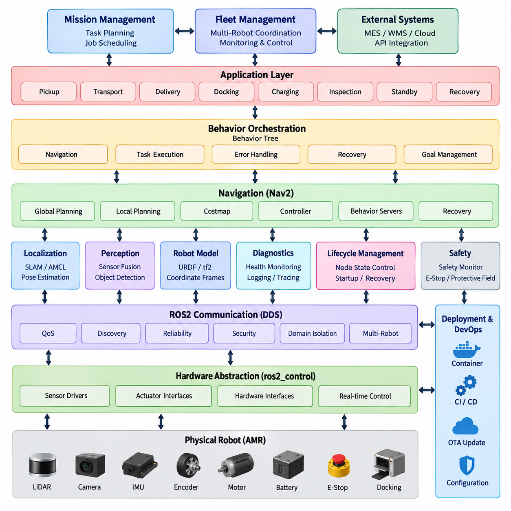
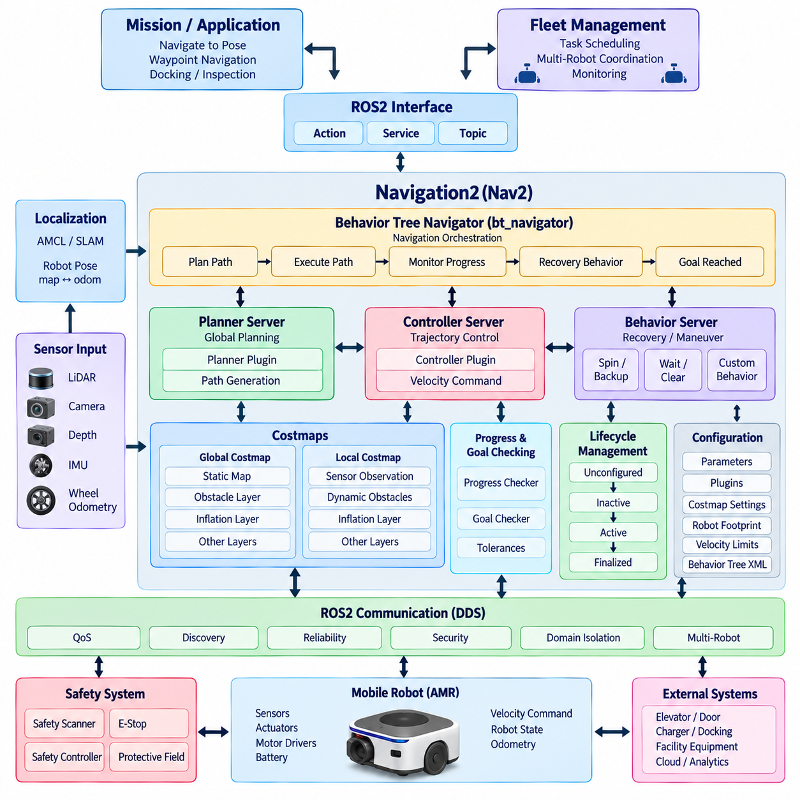
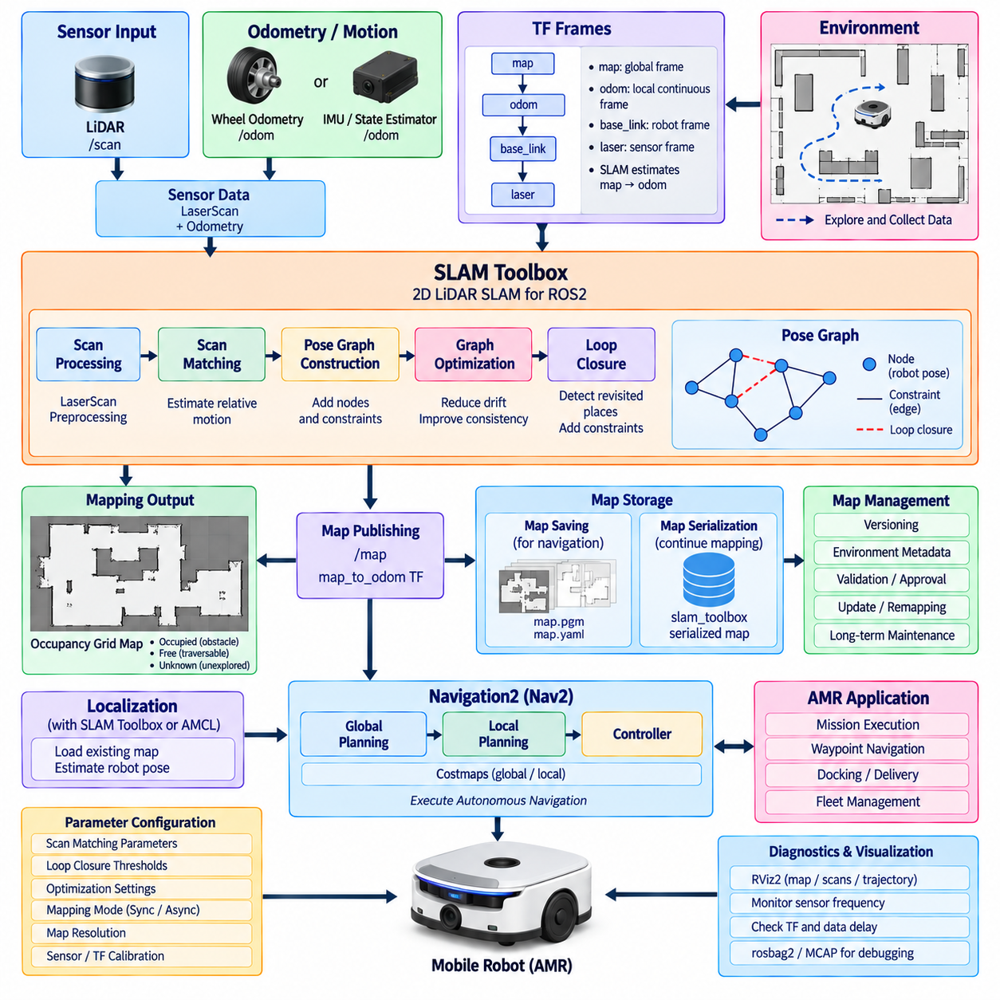
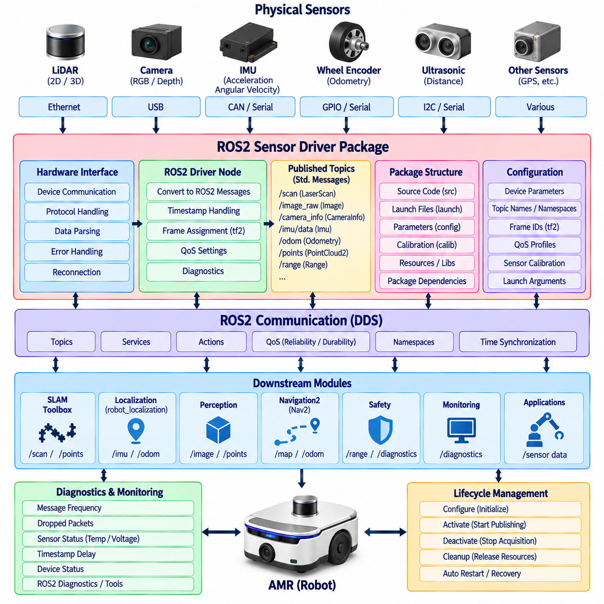
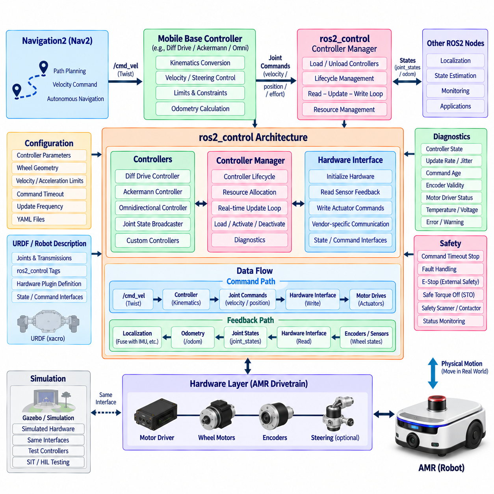
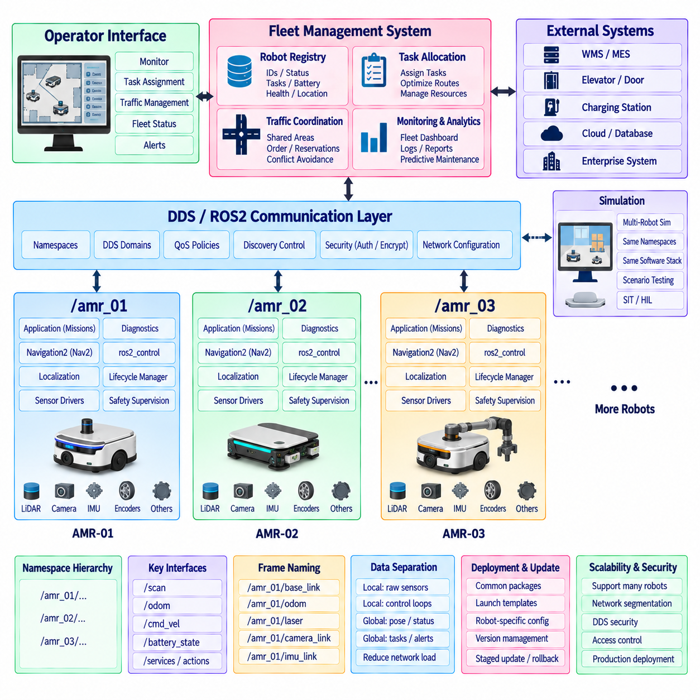
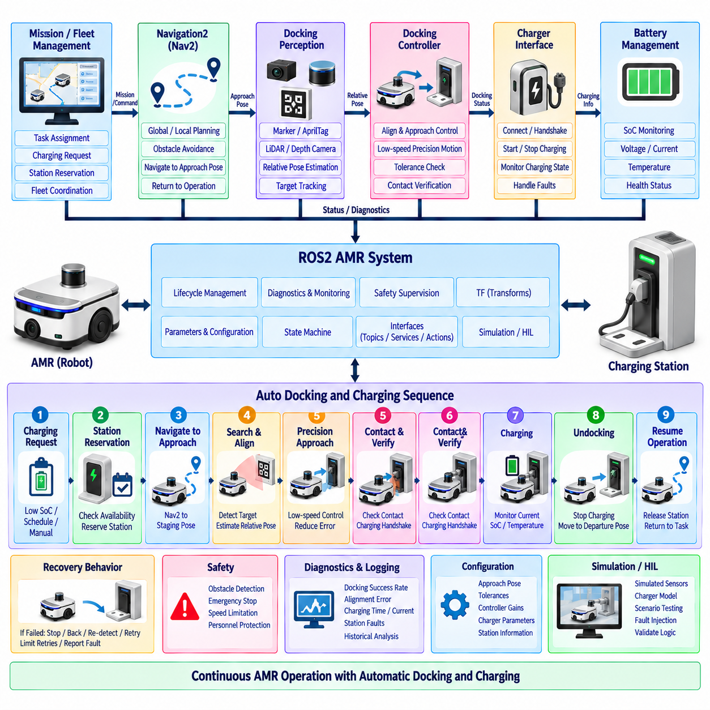
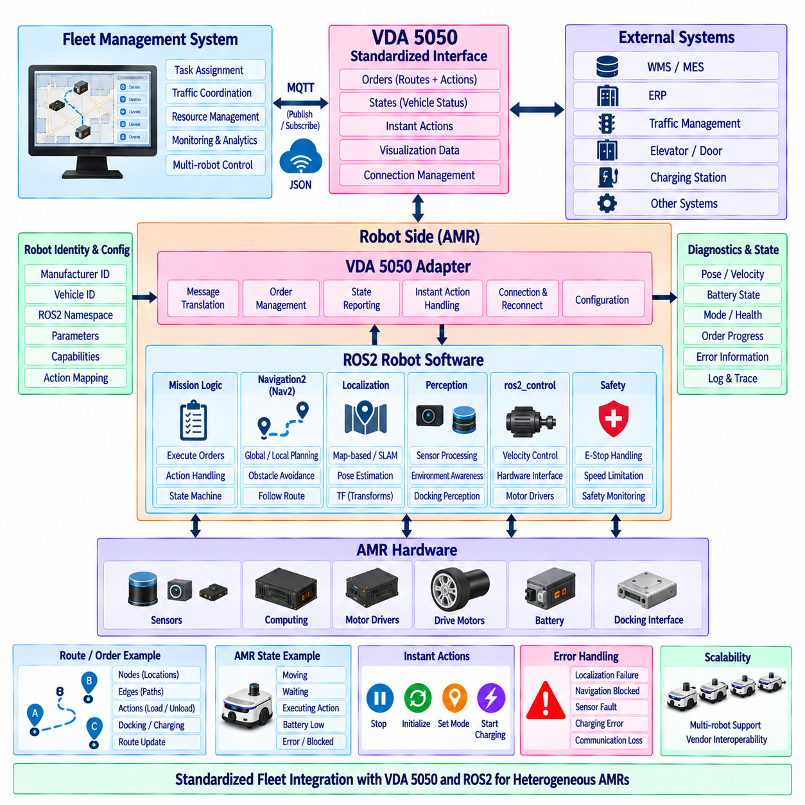
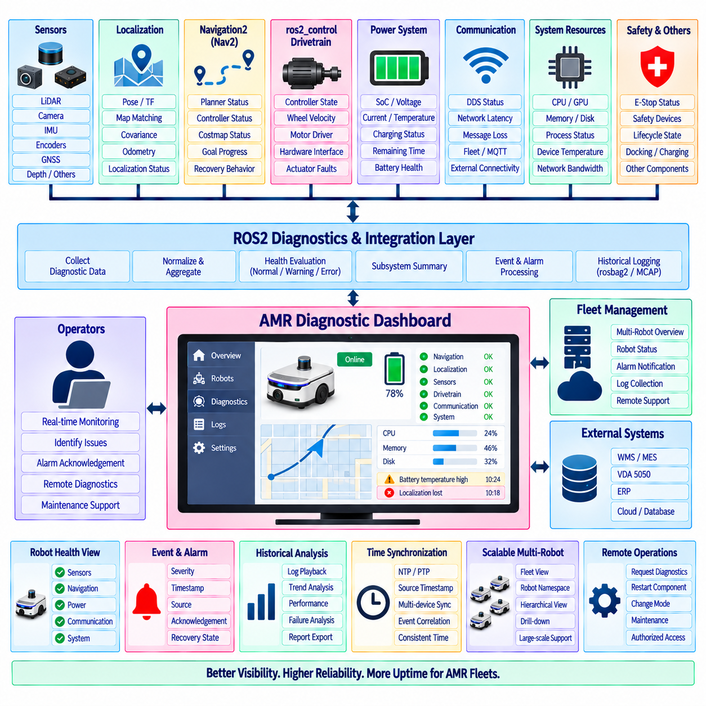
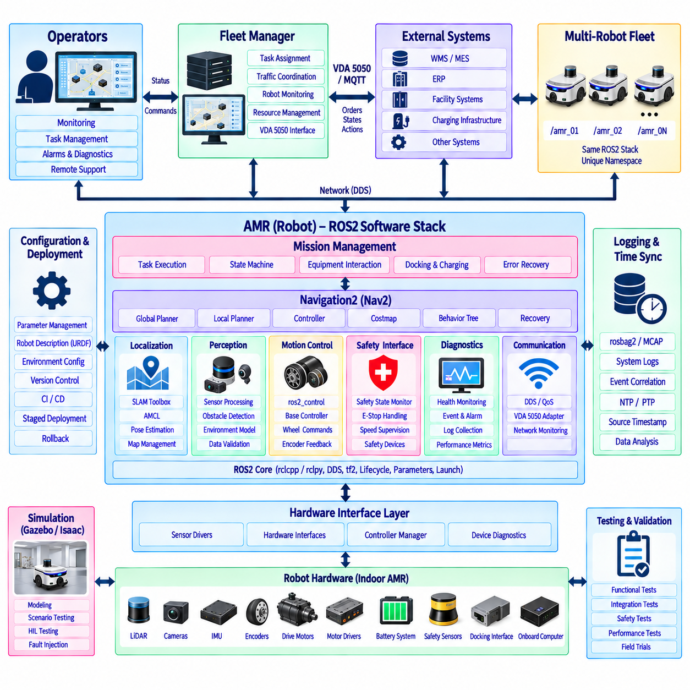

**Volume 05 Robot Middleware and ROS2**

# 09. ROS2 for AMR

## 09.01 AMR ROS2 Software Stack Configuration Overview

{width="7.268055555555556in" height="7.268055555555556in"}

ROS2 기반의 자율이동로봇(Autonomous Mobile Robot, AMR)은 하드웨어 접근(Hardware Access), 센싱(Sensing), 위치추정(Localization), 내비게이션(Navigation), 모션 제어(Motion Control), 안전(Safety), 진단(Diagnostics), 플릿 연동(Fleet Interaction)을 기능적으로 분리하면서 표준화된 ROS2 인터페이스를 통해 통신하는 계층형 소프트웨어 스택(Layered Software Stack)으로 구성하는 것이 바람직하다. 이러한 구조는 개별 구성요소를 독립적으로 발전시킬 수 있게 하며 서로 다른 AMR 제품에 재사용할 수 있는 공통 플랫폼을 구축한다.

가장 하위 계층에서는 하드웨어 추상화(Hardware Abstraction)와 장치 인터페이스(Device Interface) 구성요소가 ROS2를 모터(Motor), 엔코더(Encoder), 브레이크(Brake), 배터리(Battery), 라이다(LiDAR), 카메라(Camera), 관성측정장치(IMU), 안전장치(Safety Device), 보조 입출력(Auxiliary I/O)과 연결한다. 센서 드라이버(Sensor Driver)는 제조사별 프로토콜을 표준 ROS2 메시지로 변환하며, 구동 인터페이스(Drive Interface)는 속도, 휠 상태, 액추에이터 명령을 제공한다. ros2_control은 상위 모션 소프트웨어와 실제 구동 하드웨어 사이에 구조화된 경계를 제공할 수 있다.

로봇 모델(Robot Model)은 전체 AMR 스택에서 요구되는 공통 기하학적 기준(Common Geometric Reference)을 제공한다. URDF 또는 관련 로봇 기술 형식은 차체(Chassis), 휠(Wheel), 센서(Sensor), 좌표 프레임(Coordinate Frame), 구성요소 간 물리적 관계를 정의한다. tf2는 map, odom, base_link, laser, camera, IMU와 같은 프레임 사이의 변환을 관리한다. 위치추정, 장애물 감지, 경로 계획, 시각화, 제어가 모두 일관된 공간 정보에 의존하므로 정확한 프레임 규약(Frame Convention)과 타임스탬프(Timestamp)가 필수적이다.

인지 계층(Perception Layer)은 원시 센서 스트림(Raw Sensor Stream)을 위치추정과 내비게이션에서 사용할 수 있는 정보로 변환한다. 라이다 스캔(LiDAR Scan), 깊이 영상(Depth Image), 포인트 클라우드(Point Cloud), 휠 오도메트리(Wheel Odometry), 관성 측정값(Inertial Measurement)은 상위 구성요소에 전달되기 전에 필터링(Filtering), 시간 동기화(Synchronization), 좌표 변환(Transformation), 센서 융합(Sensor Fusion)을 수행할 수 있다. 고속 센서 트래픽이 제어 및 운용 메시지를 불필요하게 지연시키지 않도록 각 데이터 스트림의 특성에 따라 ROS2 서비스 품질(Quality of Service, QoS) 정책을 설정해야 한다.

위치추정(Localization)은 운용 환경을 기준으로 AMR의 자세와 위치(Pose)를 결정한다. 지도 생성 과정에서는 동시적 위치추정 및 지도작성(Simultaneous Localization and Mapping, SLAM) 소프트웨어가 이동 추정값과 환경 관측 정보를 결합하여 작업 공간의 지속적인 표현을 생성한다. 정상 운용에서는 위치추정 노드(Localization Node)가 기존 지도를 기준으로 로봇 위치를 추정하고 오도메트리(Odometry)는 연속적인 국부 이동 정보를 제공한다. 결과적으로 생성되는 map-to-odom-to-base_link 관계는 자율 내비게이션을 위한 핵심 공간적 기반이 된다.

일반적으로 Nav2라고 부르는 내비게이션2(Navigation2)는 ROS2 AMR 구성에서 핵심적인 자율 내비게이션 프레임워크(Autonomous Navigation Framework)를 형성한다. Nav2는 전역 및 지역 경로 계획(Global and Local Planning), 비용지도(Costmap), 행동 실행(Behavior Execution), 복구 메커니즘(Recovery Mechanism), 제어기 인터페이스(Controller Interface), 수명주기 관리 서버(Lifecycle-Managed Server)를 결합한다. 내비게이션을 하나의 단일 알고리즘으로 처리하지 않고 차량 운동학(Vehicle Kinematics), 환경 구조, 운용 요구사항에 따라 플러그인(Plugin)과 파라미터(Parameter)를 선택할 수 있는 협력형 구성요소로 구성한다.

전역 경로 계획(Global Planning)은 현재 위치에서 임무 목표까지 지도와 비용 정보를 이용하여 실행 가능한 경로를 결정하며, 지역 경로 계획(Local Planning) 또는 궤적 제어(Trajectory Control)는 이러한 의도를 지속적으로 실행 가능한 움직임으로 변환한다. 지역 비용지도(Local Costmap)는 주변 장애물과 갱신된 센서 관측값을 통합하여 로봇이 동적 환경에 대응할 수 있도록 한다. 최종적으로 속도 명령(Velocity Command)이 구동계 인터페이스(Drivetrain Interface)에 전달되면서 임무 요청에서 내비게이션 판단을 거쳐 실제 AMR 이동으로 이어지는 소프트웨어 경로가 완성된다.

행동 트리(Behavior Tree)는 개별 Nav2 기능 위에서 오케스트레이션 메커니즘(Orchestration Mechanism)을 제공한다. 하나의 내비게이션 임무는 모든 운용 판단을 단일 제어기에 포함하지 않고 경로 계산, 경로 추종, 재계획(Replanning), 대기, 복구, 장애물 처리, 목표 검증 등을 포함할 수 있다. 상위 AMR 애플리케이션(Application)은 이러한 개념을 확장하여 픽업(Pickup), 운송(Transport), 배송(Delivery), 도킹(Docking), 충전(Charging), 검사(Inspection), 대기(Standby), 고장 복구(Fault Recovery)와 같은 임무 상태를 관리할 수 있다.

수명주기 관리(Lifecycle Management)는 실제 운용 AMR에서 특히 중요하다. 전원이 켜졌다고 해서 모든 소프트웨어 구성요소가 정상적으로 시작된다고 가정할 수 없기 때문이다. 센서 드라이버, 위치추정, 내비게이션, 제어, 애플리케이션 노드는 명확한 의존관계(Dependency)와 초기화 조건(Initialization Condition)을 가질 수 있다. ROS2 수명주기 노드(Lifecycle Node)는 구성(Configuration), 활성화(Activation), 비활성화(Deactivation), 정리(Cleanup), 종료(Shutdown) 상태를 제어하여 결정론적인 시작 순서와 런타임 장애(Runtime Failure)에 대한 체계적인 복구를 가능하게 한다.

안전 기능(Safety Function)은 일반적인 자율 내비게이션 기능과 구조적으로 분리되어야 한다. 내비게이션 소프트웨어는 장애물을 회피하고 이동을 최적화할 수 있지만, 안전 등급 기능(Safety-Rated Function)은 독립적인 안전 스캐너(Safety Scanner), 안전 제어기(Safety Controller), 비상정지 회로(Emergency-Stop Circuit), 보호 영역(Protective Field), 인증된 통신 경로(Certified Communication Path)를 요구할 수 있다. ROS2는 안전 상태를 전달하고 안전 운용 대응을 조정할 수 있지만 최종 안전 권한(Final Safety Authority)은 하드웨어 구조와 적용되는 기능 안전(Functional Safety) 요구사항에 부합하도록 유지해야 한다.

진단(Diagnostics)과 관측성(Observability)은 AMR 스택 전반에 적용되는 또 다른 공통 계층을 구성한다. 노드는 센서, 위치추정 품질, 내비게이션 상태, 제어기 상태, 배터리 상태, 통신 품질, CPU 및 메모리 사용률, 온도, 소프트웨어 오류에 대한 상태 정보를 제공해야 한다. 로깅(Logging), ros2_diagnostics, 트레이싱(Tracing), 메트릭 수집(Metrics Collection), 운용 대시보드(Operational Dashboard)를 활용하면 알고리즘 문제와 하드웨어, 타이밍, 네트워크, 설정 문제를 구분하여 분석할 수 있다.

실제 운용 AMR은 자율 내비게이션 스택 외부의 시스템과 연결하기 위한 인터페이스도 필요하다. 도킹 소프트웨어(Docking Software)는 위치추정, 정렬(Alignment), 충전기 통신(Charger Communication), 최종 저속 이동을 조정한다. 임무 관리 구성요소(Mission Management Component)는 창고 또는 시설의 작업을 로봇 행동으로 변환하고, 플릿 인터페이스(Fleet Interface)는 외부 관리 시스템과 로봇 상태, 작업 상태, 교통 정보, 명령을 교환한다. 다중 로봇(Multi-Robot) 환경에서는 체계적인 네임스페이스(Namespace), 도메인 구성(Domain Configuration), 통신 정책도 필요하다.

데이터 분산 서비스(Data Distribution Service, DDS)는 ROS2 하위에서 분산 통신 기반(Distributed Communication Foundation)을 제공하므로 AMR 시스템에서 통신 설정은 단순한 네트워크 설정이 아니라 전체 시스템 아키텍처의 일부로 다루어야 한다. 신뢰성(Reliability), 내구성(Durability), 이력 깊이(History Depth), 데드라인(Deadline), 디스커버리 동작(Discovery Behavior), 멀티캐스트(Multicast) 설정, 도메인 격리(Domain Isolation)는 센서, 명령, 상태, 플릿 정보의 전달 특성에 영향을 준다. 따라서 각 데이터 경로의 의미적 요구사항과 시간적 요구사항에 적합한 QoS 프로파일(QoS Profile)을 정의해야 한다.

전체 스택은 시간 결정성이 중요한 제어(Time-Critical Control)와 계산량이 많은 자율 기능(Computationally Intensive Autonomy)을 분리해야 한다. 모터 제어와 안전 핵심 루프(Safety-Critical Loop)는 전용 제어기, 마이크로컨트롤러(MCU), 실시간 환경에서 실행할 수 있으며 ROS2는 상위 제어(Supervisory Control), 내비게이션, 인지, 임무 실행, 시스템 조정을 담당한다. PREEMPT_RT, 실행기 설정(Executor Configuration), 메모리 관리(Memory Management), 콜백 그룹 설계(Callback Group Design), 통제된 통신 구조를 활용하면 지연시간에 민감한 처리에서 ROS2의 결정론적 특성을 향상시킬 수 있다.

배포 구성(Deployment Configuration)은 이러한 소프트웨어 구성요소를 실제 운용 가능한 로봇 제품으로 전환한다. 실행 파일(Launch File), 파라미터 세트(Parameter Set), 수명주기 오케스트레이션(Lifecycle Orchestration), 컨테이너(Container), 환경 변수(Environment Variable), 장치 권한(Device Permission), 네트워크 설정, 보안 정책(Security Policy), 하드웨어별 프로파일을 함께 버전 관리해야 한다. 지속적 통합 및 배포(CI/CD)와 무선 소프트웨어 업데이트(Over-the-Air, OTA)를 이용하면 검증된 구성을 개발 로봇과 양산 플릿에 재현하고 새로운 소프트웨어에서 문제가 발생할 경우 롤백(Rollback)할 수 있다.

따라서 AMR ROS2 스택은 단순한 ROS2 패키지들의 집합이 아니라 통합된 런타임 아키텍처(Integrated Runtime Architecture)로 이해해야 한다. 하드웨어 인터페이스는 물리적 연결을 제공하고, 인지 계층은 센서 정보를 해석하며, 위치추정은 로봇의 위치를 확립하고, Nav2는 자율 이동을 생성한다. 수명주기 관리와 진단은 운용 무결성(Operational Integrity)을 유지하고, 안전 계층은 행동을 제한하며, 임무 및 플릿 계층은 개별 로봇을 더 큰 물류 또는 서비스 프로세스와 연결한다. 이러한 계층형 구조는 미들웨어(Middleware), 내비게이션, 플릿 지능(Fleet Intelligence), 인지, 제어, 배포가 서로 조정되면서도 모듈화된 관심 영역으로 유지되는 전체 로보틱스 소프트웨어 구조와 연결된다.

## 09.02 Navigation2 (Nav2) Architecture Deep Dive [w/Code]

{width="7.268055555555556in" height="7.268055555555556in"}

내비게이션2(Navigation2), 일반적으로 Nav2라고 불리는 프레임워크는 자율이동로봇(Autonomous Mobile Robot, AMR)을 위해 위치추정(Localization), 환경 표현(Environmental Representation), 경로 계획(Path Planning), 궤적 제어(Trajectory Control), 행동 실행(Behavior Execution), 복구(Recovery)를 조정하는 ROS2 내비게이션 프레임워크(Navigation Framework)이다. Nav2는 내비게이션을 하나의 단일 프로세스로 구현하는 대신 이러한 역할을 ROS2 토픽(Topic), 서비스(Service), 액션(Action)을 통해 연결된 수명주기 관리 서버(Lifecycle-Managed Server)에 분산한다. 이러한 모듈형 구조(Modular Structure)를 통해 전체 AMR 소프트웨어 스택을 재설계하지 않고도 개별 내비게이션 기능을 구성하거나 교체할 수 있다.

Nav2의 핵심 아키텍처 원칙은 서버 지향 분해(Server-Oriented Decomposition)이다. 경로 계획(Planning), 제어(Control), 행동(Behavior), 웨이포인트 실행(Waypoint Execution), 내비게이션 오케스트레이션(Navigation Orchestration)과 같은 주요 기능은 독립적인 ROS2 구성요소로 동작한다. 각 서버는 명확하게 정의된 인터페이스를 제공하며 일반적으로 동적으로 로드할 수 있는 플러그인(Plugin)을 지원한다. 따라서 AMR 개발자는 주변 시스템 아키텍처를 유지하면서 차량 운동학(Vehicle Kinematics), 센서 구성, 운용 환경, 계산 자원, 요구되는 내비게이션 성능에 따라 알고리즘을 선택할 수 있다.

행동 트리 내비게이터(Behavior Tree Navigator)는 일반적으로 bt_navigator 구성요소를 통해 구현되며 전체 내비게이션 프로세스를 조정한다. NavigateToPose와 같은 내비게이션 요청은 경로 계산, 경로 실행, 진행 상태 감시, 실패 감지, 복구 행동 호출, 내비게이션 재시도 등의 연속적인 작업으로 변환된다. 행동 트리(Behavior Tree)는 임무 수준의 내비게이션 로직을 개별 경로 계획 및 제어 알고리즘과 분리함으로써 복잡한 내비게이션 작업 흐름을 더욱 쉽게 수정하고 분석할 수 있게 한다.

플래너 서버(Planner Server)는 전역 경로 계획(Global Path Planning) 기능을 제공한다. 플래너 서버는 로봇 위치(Robot Pose), 목적지(Destination), 지도 정보(Map Information), 전역 비용지도(Global Costmap) 정보를 입력받아 설정된 플래너 플러그인(Planner Plugin)을 호출하고 목표까지 충돌을 고려한 경로(Collision-Aware Path)를 생성한다. 서로 다른 로봇 형상과 운용 조건에 따라 다양한 경로 계획 알고리즘을 선택할 수 있다. 생성된 경로는 직접적인 액추에이터 명령이 아니라 기하학적인 내비게이션 의도(Geometric Navigation Intention)를 나타내며 이후 제어 단계에서 사용된다.

컨트롤러 서버(Controller Server)는 계획된 경로를 실제로 실행 가능한 로봇 움직임으로 변환한다. 컨트롤러 플러그인(Controller Plugin)은 로봇 위치, 주변 환경 조건, 운동학적 제약조건(Kinematic Constraint), 기준 경로(Reference Path)를 지속적으로 평가하여 속도 명령(Velocity Command)을 생성한다. 이 과정은 로봇이 움직이는 동안 반복적으로 수행되므로 컨트롤러 성능은 경로 추종(Path Tracking), 장애물 대응, 이동 부드러움(Smoothness), 안정성(Stability)에 직접적인 영향을 준다. 따라서 컨트롤러 설정은 AMR 구동계, 가속도 제한, 최대 속도, 로봇 풋프린트(Footprint), 예상 운용 환경을 반영해야 한다.

비용지도(Costmap)는 경로 계획과 제어에서 사용하는 공간 표현(Spatial Representation)을 제공한다. 전역 비용지도(Global Costmap)는 일반적으로 넓은 운용 영역을 표현하고 전체 경로 생성을 지원하며, 지역 비용지도(Local Costmap)는 이동하는 로봇 주변의 환경을 지속적으로 갱신한다. 비용지도 계층(Costmap Layer)은 정적 지도(Static Map), 장애물 관측(Obstacle Observation), 팽창 영역(Inflation Region), 복셀 정보(Voxel Information), 애플리케이션별 데이터를 포함할 수 있다. 이러한 계층형 구조는 환경 정보의 출처를 분리하면서도 하나의 공통 내비게이션 표현으로 통합한다.

센서 관측 정보(Sensor Observation)는 설정된 ROS2 데이터 소스를 통해 비용지도에 입력된다. 라이다 스캔(LiDAR Scan), 포인트 클라우드(Point Cloud), 깊이 정보에서 생성된 장애물(Depth-Derived Obstacle), 기타 인지 결과가 AMR 주변의 점유 영역(Occupied Region)과 해제 영역(Cleared Region)을 갱신할 수 있다. 관측 정보가 경로 계획에 영향을 주기 전에 올바른 내비게이션 프레임으로 변환되어야 하므로 정확한 타임스탬프(Timestamp)와 tf2 좌표 변환(Transformation)이 중요하다. 따라서 센서 지연시간, 갱신 주기, 관측 지속시간(Observation Persistence), 장애물 제거 동작(Clearing Behavior)은 실제 Nav2 배포에서 중요한 파라미터가 된다.

map, odom, base_link 좌표 프레임(Coordinate Frame)은 Nav2의 기반이 되는 핵심 공간 관계(Spatial Relationship)를 형성한다. map 프레임은 전역적으로 일관된 내비게이션 기준을 제공하고, odom 프레임은 지역적으로 연속적인 이동을 표현하며, base_link는 로봇 본체를 나타낸다. 일반적으로 위치추정 또는 SLAM이 map-to-odom 변환을 생성하고 휠 오도메트리(Wheel Odometry) 또는 상태 추정(State Estimation)이 odom-to-base_link 관계를 지원한다. 이러한 변환 체인(Transform Chain)의 오류나 불연속성은 경로 계획, 비용지도 정렬, 컨트롤러 동작에 직접적으로 영향을 줄 수 있다.

따라서 위치추정(Localization)은 별도의 하위 시스템이지만 Nav2와 밀접하게 연결된다. AMR은 기존에 생성된 지도와 함께 적응형 몬테카를로 위치추정(Adaptive Monte Carlo Localization, AMCL)을 사용할 수도 있고, 지도 작성 또는 위치추정 과정에서 SLAM Toolbox를 사용할 수도 있으며, 필요한 로봇 위치와 좌표 변환을 제공하는 다른 위치추정 시스템을 사용할 수도 있다. Nav2는 기본적으로 충분히 정확하고 적시에 제공되는 로봇 위치 정보에 의존한다. 이러한 분리를 통해 안정적인 내비게이션 인터페이스를 유지하면서 위치추정 기술을 독립적으로 발전시킬 수 있다.

행동 서버(Behavior Server)는 일반적인 경로 실행이 충분하지 않거나 실패했을 때 호출할 수 있는 재사용 가능한 내비게이션 행동을 제공한다. 회전(Spinning), 후진(Backing Up), 대기(Waiting), 기타 제어된 기동(Controlled Maneuver)은 로봇이 일시적인 내비게이션 실패 상태에서 벗어나는 데 도움을 줄 수 있다. 이러한 행동은 단순한 비상 동작이 아니라 행동 트리(Behavior Tree)가 특정 행동의 실행 시점과 이후 내비게이션 재시도 여부를 결정하는 구조화된 고장 처리 전략(Fault-Handling Strategy)의 일부를 구성한다.

진행 상태 검사(Progress Checking)와 목표 검사(Goal Checking)는 내비게이션 프로세스에 명시적인 실행 판단 기준을 추가한다. 진행 상태 검사기(Progress Checker)는 로봇이 목표를 향해 충분히 이동하고 있는지 판단하여 물리적으로 차단되었거나 요청된 경로를 추종할 수 없는 상황을 식별하는 데 도움을 준다. 목표 검사기(Goal Checker)는 위치와 방향 허용오차(Position and Orientation Tolerance)가 충족되었는지 판단한다. 이러한 판단 기준을 컨트롤러와 분리함으로써 서로 다른 AMR 임무에 맞추어 완료 조건과 실패 조건을 독립적으로 조정할 수 있다.

웨이포인트(Waypoint)와 경로 지향 기능(Route-Oriented Function)은 내비게이션을 하나의 목적지를 넘어 확장한다. AMR은 검사 위치, 물류 스테이션, 중간 경유지, 운용 체크포인트를 나타내는 연속적인 위치 정보를 받을 수 있다. 상위 임무 소프트웨어(Higher-Level Mission Software)는 이러한 내비게이션 기능을 적재(Loading), 하역(Unloading), 대기, 스캐닝(Scanning), 도킹(Docking), 설비 상호작용과 같은 행동과 결합할 수 있다. 따라서 Nav2는 보다 상위 수준의 AMR 임무 관리 및 플릿 관리(Fleet Management) 시스템 아래에서 이동 실행 계층(Mobility Execution Layer)의 역할을 수행한다.

수명주기 관리(Lifecycle Management)는 Nav2 아키텍처에 깊이 통합되어 있다. 핵심 서버는 미구성(Unconfigured), 비활성(Inactive), 활성(Active), 종료(Finalized) 상태 사이를 전환할 수 있으며, 필요한 파라미터, 플러그인, 지도, 좌표 변환, 의존 구성요소가 준비된 이후에만 시작되도록 할 수 있다. 수명주기 관리자(Lifecycle Manager)는 이러한 상태 전환을 조정하고 참여 노드를 관리할 수 있다. 이러한 메커니즘은 위치추정, 센서, 제어 인터페이스, 환경 정보가 정상적으로 준비되기 전에 내비게이션이 활성화되는 것을 방지하므로 실제 운용 AMR에서 특히 중요하다.

ROS2 액션(Action)은 내비게이션 명령이 장시간 실행되는 비동기 작업(Long-Running Asynchronous Operation)이기 때문에 Nav2에 특히 적합하다. 액션을 사용하면 클라이언트(Client)가 내비게이션 목표를 전달하고, 지속적인 피드백(Feedback)을 수신하며, 최종 결과를 얻거나 실행 중인 작업을 취소할 수 있다. 토픽(Topic)은 센서 관측과 속도 명령처럼 지속적으로 변화하는 정보를 전달하고, 서비스(Service)는 비교적 짧은 요청-응답(Request-Response) 상호작용을 지원한다. 이러한 통신 패턴을 함께 사용하면 내비게이션 구성요소와 외부 AMR 애플리케이션 사이에 명확한 인터페이스 경계를 형성할 수 있다.

Nav2 구성은 대부분 파라미터 기반(Parameter-Driven)으로 이루어진다. 플래너 및 컨트롤러 플러그인, 비용지도 크기, 로봇 풋프린트, 장애물 계층, 팽창 파라미터(Inflation Parameter), 속도 제한, 좌표 변환 허용오차(Transform Tolerance), 갱신 주기, 진행 상태 조건, 행동 트리 정의가 전체 시스템 동작을 결정한다. 따라서 구성 정보는 단순한 튜닝 데이터(Tuning Data)가 아니라 로봇 소프트웨어 기준선(Software Baseline)의 일부로 관리해야 한다. 파라미터 파일은 버전 관리되어야 하며 각 구동계, 센서 구성, 배포 환경에 대해 검증되어야 한다.

Nav2 성능은 하나의 특정 알고리즘보다 전체 내비게이션 파이프라인(Navigation Pipeline)의 상호작용에 의해 결정된다. 과도한 센서 지연은 오래된 장애물 정보를 생성할 수 있고, 부정확한 위치추정은 경로 추종을 왜곡할 수 있으며, 부적절한 비용지도 팽창은 실제로 통과 가능한 공간의 이동을 방해할 수 있다. 또한 지나치게 공격적인 컨트롤러 파라미터는 불안정한 움직임을 발생시킬 수 있다. 따라서 효과적인 Nav2 엔지니어링은 센싱, 좌표 변환, 위치추정, 비용지도, 경로 계획, 제어, ROS2 통신, 실제 차량 동역학(Physical Vehicle Dynamics)을 통합적으로 평가해야 한다.

실제 운용 AMR에서 내비게이션은 독립적인 안전 메커니즘(Safety Mechanism)과 함께 동작해야 한다. Nav2는 장애물을 감지하고 충돌을 고려한 경로를 생성하며 이동을 제어하고 행동 대응을 실행할 수 있지만, 일반적인 내비게이션 기능을 자동으로 안전 등급 보호 기능(Safety-Rated Protection)으로 간주해서는 안 된다. 비상정지(Emergency Stop), 인증된 안전 스캐너(Certified Safety Scanner), 보호 영역(Protective Field), 안전 제어기(Safety Controller), 구동계 안전 기능은 내비게이션 명령을 독립적으로 무시하거나 중단시킬 수 있다. ROS2 아키텍처는 이러한 장치의 운용 상태를 제공하면서도 전용 안전 경로(Dedicated Safety Path)의 최종 제어 권한을 유지해야 한다.

보다 광범위한 ROS2 AMR 아키텍처에서 Nav2는 공간 지능(Spatial Intelligence)과 실제 물리적 이동(Physical Movement)을 연결하는 핵심 계층을 차지한다. 위치추정과 인지는 로봇 상태와 주변 환경에 대한 정보를 제공하고, 비용지도는 이 정보를 내비게이션 제약조건으로 변환하며, 플래너는 어디로 이동할지를 결정하고, 컨트롤러는 어떻게 이동할지를 결정한다. 행동(Behavior)은 예외 상황을 처리하고 행동 트리는 전체 과정을 조정한다. 이러한 기능 분해를 통해 Nav2는 개별 AMR뿐만 아니라 더 큰 다중 로봇(Multi-Robot) 운용 시스템까지 지원할 수 있는 구성 가능한 내비게이션 프레임워크(Configurable Navigation Framework)를 제공한다.

## 09.03 SLAM Toolbox Integration: Map Generation [w/Code]

{width="7.268055555555556in" height="7.268055555555556in"}

SLAM 툴박스(SLAM Toolbox)는 주로 2차원 라이다(LiDAR) 기반 로봇을 위해 설계된 ROS2 네이티브 동시적 위치추정 및 지도작성(Simultaneous Localization and Mapping, SLAM) 프레임워크이다. AMR 소프트웨어 스택에서 레이저 관측값, 오도메트리(Odometry), 좌표 변환(Coordinate Transformation)을 이용하여 로봇의 이동 궤적을 추정하면서 지속적으로 사용할 수 있는 점유 격자 지도(Occupancy-Grid Map)를 생성한다. 이를 통합하면 위치추정(Localization), 내비게이션2(Navigation2), 시각화(Visualization), 지도 관리(Map Management), 이후의 자율 운용에 필요한 지도작성 기반을 구축할 수 있다.

지도작성 파이프라인(Mapping Pipeline)은 신뢰할 수 있는 센서 및 이동 정보 입력에서 시작된다. 레이저 스캐너(Laser Scanner)는 일반적으로 sensor_msgs/LaserScan 데이터를 발행하고, 휠 오도메트리(Wheel Odometry) 또는 융합 상태 추정기(Fused State Estimator)는 연속적인 국부 이동 정보를 제공한다. tf2는 센서 프레임을 base_link에 연결하고 base_link와 odom 사이의 관계를 유지한다. SLAM Toolbox는 이러한 입력을 결합하여 연속적인 로봇 위치를 추정하고 새로운 레이저 관측값을 점진적으로 생성되는 환경 표현과 정렬한다.

좌표 프레임 일관성(Coordinate-Frame Consistency)은 성공적인 지도 생성의 핵심 요소이다. odom 프레임은 국부적으로 연속적인 이동을 제공하지만 시간이 지나면서 드리프트(Drift)가 누적될 수 있는 반면, map 프레임은 SLAM에 의해 설정되는 전역적으로 보정된 기준을 나타낸다. SLAM Toolbox는 map-to-odom 변환을 추정하고 로봇 플랫폼은 odom-to-base_link를 제공한다. 센서 좌표 변환은 base_link를 laser 또는 기타 관측 프레임에 연결하여 스캔 정합(Scan Matching)에 필요한 전체 공간 변환 체인을 구성한다.

온라인 지도작성(Online Mapping) 과정에서는 입력되는 레이저 스캔을 추정된 로봇 위치와 연결하여 포즈 그래프(Pose Graph)에 통합한다. 선택된 위치는 그래프 노드(Graph Node)가 되고 관측 사이의 공간적 제약조건(Spatial Constraint)은 그래프 에지(Graph Edge)를 형성한다. 스캔 정합은 노드 사이의 관계를 추정하고 그래프 최적화(Graph Optimization)는 더 나은 제약조건이 확보될 때 누적된 이동 궤적을 조정한다. 이 과정은 오도메트리 오차의 누적을 줄이고 생성된 지도의 서로 다른 영역 사이의 일관성을 향상시킨다.

루프 폐쇄(Loop Closure)는 AMR이 이전에 관측했던 위치로 다시 돌아왔을 때 특히 중요하다. 시스템은 현재 센서 관측과 과거에 지도화된 영역 사이의 대응 관계를 인식하고 포즈 그래프에 추가적인 제약조건을 도입하려고 한다. 성공적인 루프 폐쇄는 긴 이동 궤적에서 누적된 드리프트를 보정할 수 있다. 그러나 센서의 기하학적 정보 부족, 반복적인 환경, 이동 물체, 부정확한 오도메트리는 이러한 과정을 어렵게 만들 수 있으므로 지도작성 과정에서 고려해야 한다.

SLAM Toolbox는 서로 다른 처리 전략을 나타내는 동기식 지도작성(Synchronous Mapping)과 비동기식 지도작성(Asynchronous Mapping) 모드를 지원한다. 동기식 처리는 관측 정보를 순차적으로 처리하며 결정론적인 스캔 처리가 중요한 경우 유용할 수 있다. 비동기식 동작은 센서 주기와 사용 가능한 계산 자원이 서로 다른 환경에서 입력 데이터를 보다 유연하게 처리할 수 있다. 적절한 모드는 AMR 속도, LiDAR 주기, 프로세서 성능, 지도 복잡도, 요구되는 지도작성 응답성을 고려하여 선택해야 한다.

지도 품질(Map Quality)은 SLAM 알고리즘 자체뿐만 아니라 실제 로봇 구성과 데이터 품질에 크게 의존한다. 잘못된 LiDAR 장착 좌표 변환, 휠 슬립(Wheel Slip), 부정확한 엔코더 보정(Encoder Calibration), 진동, 부족한 환경 기하학 정보, 타임스탬프 오류는 벽의 중복, 복도의 왜곡, 일관되지 않은 루프를 발생시킬 수 있다. 따라서 고급 SLAM 파라미터를 조정하기 전에 센서 보정, 오도메트리 스케일, 좌표 프레임, 타임스탬프 일관성, 센서 설치의 기계적 안정성을 먼저 확인해야 한다.

지도작성 파라미터(Mapping Parameter)는 스캔을 얼마나 자주 처리하고 후보 제약조건을 어느 정도의 기준으로 허용할 것인지를 결정한다. 스캔 정합 임계값, 검색 범위, 최소 이동 거리, 최소 방향 변화, 루프 폐쇄 기준, 상관관계 파라미터(Correlation Parameter), 최적화 설정은 계산 비용과 지도 일관성 모두에 영향을 준다. 지나치게 허용적인 설정은 잘못된 제약조건을 생성할 수 있고, 지나치게 제한적인 설정은 유용한 보정을 방해할 수 있다. 따라서 대표적인 AMR 운용 환경을 기준으로 파라미터 튜닝(Parameter Tuning)을 검증해야 한다.

SLAM으로 생성되는 점유 격자 표현(Occupancy-Grid Representation)은 ROS2 내비게이션 도구에서 직접 사용할 수 있으며 RViz2를 이용하여 시각화할 수 있다. 점유 셀(Occupied Cell)은 지도작성 과정에서 감지된 구조물이나 장애물을 나타내고, 자유 셀(Free Cell)은 관측된 이동 가능 영역을 나타내며, 미확인 셀(Unknown Cell)은 충분히 관측되지 않은 영역을 의미한다. 지도 해상도(Map Resolution)는 공간 표현의 세밀함을 결정하며 기하학적 상세도, 메모리 사용량, 계산 비용, 내비게이션 요구사항 사이의 절충관계를 형성한다.

지도 생성은 단순히 로봇을 환경 내부에서 주행시키는 것이 아니라 하나의 운용 절차(Operational Procedure)로 관리해야 한다. AMR은 주요 복도, 교차로, 도킹 영역, 좁은 통로, 실제 운용 구역을 충분히 포함하면서 관측 정보 사이에 적절한 중첩(Overlap)이 유지되도록 이동해야 한다. 급격한 가속이나 불필요한 회전보다 부드러운 이동과 구조적 특징이 충분한 영역을 반복적으로 관측하는 것이 일반적으로 더 좋은 제약조건을 제공한다. 장기간 사용할 기준 지도(Reference Map)를 생성할 때는 동적 장애물(Dynamic Obstacle)도 가능한 한 최소화해야 한다.

SLAM Toolbox의 주요 기능 중 하나는 내부 지도작성 상태(Mapping State)의 직렬화(Serialization)이다. 점유 격자 이미지만 저장하면 최종 지도 표현은 보존할 수 있지만, 직렬화를 사용하면 포즈 그래프와 지도작성 세션에 관련된 정보까지 유지할 수 있다. 이를 통해 항상 빈 환경에서 다시 시작하지 않고 기존 지도를 기반으로 지도작성을 계속하거나 수정할 수 있다. 지속적인 지도 워크플로(Persistent Map Workflow)는 시간이 지나면서 점진적으로 변화하는 산업 시설에서 운용되는 AMR에 특히 유용하다.

따라서 시스템 설계에서는 지도 저장(Map Saving)과 지도 직렬화(Map Serialization)를 구분해야 한다. 일반적인 지도는 지도 서버(map_server)와 위치추정 구성요소에서 사용할 수 있도록 내보낼 수 있으며, 직렬화된 SLAM 상태는 지도작성의 연속 수행이나 포즈 그래프 기반 작업을 지원한다. 실제 운용 시스템에서는 오래되었거나 호환되지 않는 지도가 실수로 배포되는 것을 방지하기 위해 이러한 결과물을 명확한 식별자, 버전, 생성 날짜, 환경 메타데이터(Environment Metadata), 로봇 구성 정보와 함께 관리해야 한다.

SLAM Toolbox는 지도 생성 이후 위치추정 워크플로(Localization Workflow)에도 활용할 수 있다. 완전히 새로운 환경 표현을 계속 생성하는 대신 기존에 직렬화된 지도를 이용하여 해당 지도에 대한 로봇의 위치를 추정할 수 있다. 일부 시스템 아키텍처에서는 이것이 적응형 몬테카를로 위치추정(Adaptive Monte Carlo Localization, AMCL)과 같은 위치추정 방식의 대안이 될 수 있다. 선택은 지도 관리 전략, 환경 변화, 위치추정 특성, 계산 자원, AMR 운용 요구사항에 따라 결정해야 한다.

내비게이션2(Navigation2, Nav2)와 통합하려면 지도작성과 자율 내비게이션 사이의 명확한 전환이 필요하다. 지도작성 중에는 SLAM Toolbox가 지도와 map-to-odom 변환을 제공하고 로봇은 환경을 탐색하거나 수동으로 주행할 수 있다. 실제 운용 내비게이션에서는 저장된 지도를 불러오고 적절한 위치추정 방식이 로봇 위치를 제공한다. 이후 Nav2는 이러한 공간 정보를 사용하여 비용지도(Costmap)를 구성하고 경로를 계산하며 움직임을 제어하고 상위 수준의 내비게이션 행동을 실행한다.

수명주기(Lifecycle)와 시작 순서(Startup Sequence)는 필요한 공간 정보가 준비되기 전에 내비게이션 구성요소가 동작하는 것을 방지하도록 설계해야 한다. 센서 드라이버, 오도메트리, tf2 좌표 변환, SLAM 또는 위치추정, 지도 서비스, 비용지도, Nav2 서버는 논리적인 의존관계를 가지며 이러한 관계가 실행 및 수명주기 설정에 반영되어야 한다. 자동 검사를 통해 자율 이동을 활성화하기 전에 레이저 데이터 입력, 좌표 변환의 유효성, 위치추정 수렴, 올바른 지도 로딩 여부를 검증할 수 있다.

진단(Diagnostics)은 지도작성 하위 시스템의 입력 조건과 출력 품질을 모두 감시해야 한다. 엔지니어는 LiDAR 주기, 오도메트리 연속성, 좌표 변환 지연, 메시지 손실, CPU 부하, 스캔 정합 동작, 위치 보정, 지도 일관성을 관찰할 수 있다. RViz2는 레이저 관측값과 생성된 지도 및 로봇 이동 궤적을 시각적으로 비교하는 데 유용하다. 현장에서 지도작성 오류가 발생한 경우 rosbag2 또는 MCAP 기록을 이용하여 센서와 좌표 변환 데이터를 보존하고 오프라인에서 문제를 재현할 수 있다.

다중 세션(Multi-Session) 및 장기 지도 관리(Long-Term Map Management)는 AMR이 실험실 수준의 데모에서 실제 생산 시설로 확대될수록 더욱 중요해진다. 창고와 공장은 랙(Rack), 기계, 벽, 문, 운용 구역이 변경되면서 지속적으로 변화할 수 있다. 견고한 아키텍처는 일시적인 장애물과 구조적 변화를 구분하고, 정상적으로 검증된 내비게이션 기준 지도를 의도치 않게 손상시키지 않으면서 재지도작성(Remapping), 갱신(Update), 검증(Validation), 승인(Approval), 배포(Deployment)를 수행할 수 있는 통제된 절차를 제공해야 한다.

전체 ROS2 AMR 스택에서 SLAM Toolbox는 물리적 센싱(Physical Sensing)을 지속적인 공간 지식(Persistent Spatial Knowledge)으로 연결한다. LiDAR와 오도메트리는 즉각적인 환경 관측과 이동 정보를 제공하고, tf2는 이들 사이의 기하학적 관계를 설정하며, 스캔 정합과 포즈 그래프 최적화는 일관된 이동 궤적을 생성한다. 점유 지도작성(Occupancy Mapping)은 이 궤적을 내비게이션 표현으로 변환하고, 지도 영속성(Map Persistence)은 이후의 위치추정과 Nav2 운용을 가능하게 한다. 이러한 통합을 통해 로봇의 원시 이동 데이터는 자율 AMR 배포를 위한 재사용 가능한 공간적 기반으로 변환된다.

## 09.04 AMR Sensor Driver ROS2 Package Config [w/Code]

{width="7.268055555555556in" height="7.268055555555556in"}

AMR 센서 드라이버 계층(Sensor-Driver Layer)은 물리적 센싱 장치(Physical Sensing Device)와 ROS2 자율주행 스택(Autonomy Stack) 사이의 소프트웨어 경계(Software Boundary)를 제공한다. 주요 역할은 제조사별 인터페이스, 프로토콜, 타임스탬프(Timestamp), 좌표 규약(Coordinate Convention), 측정 데이터 형식을 안정적인 ROS2 인터페이스로 변환하는 것이다. 이를 통해 라이다(LiDAR), 카메라(Camera), 깊이 센서(Depth Sensor), 관성측정장치(IMU), 휠 엔코더(Wheel Encoder), 초음파 센서(Ultrasonic Sensor) 등의 데이터를 위치추정(Localization), 인지(Perception), 지도작성(Mapping), 내비게이션(Navigation), 진단(Diagnostics), 안전 관련 감시 소프트웨어에서 일관되게 사용할 수 있다.

실제 운용을 위한 센서 패키지(Sensor Package)는 하드웨어 통신(Hardware Communication)과 ROS2 데이터 발행(Data Publication)을 분리하여 구성하는 것이 바람직하다. 하드웨어 계층은 이더넷(Ethernet), CAN, USB, 시리얼(Serial) 등의 장치별 전송 메커니즘을 관리하고, ROS2 노드는 수신된 측정값을 표준화된 메시지로 변환한다. 이러한 분리는 특정 제조사에 대한 의존성을 줄이고 센서를 교체할 때 해당 데이터를 사용하는 모든 하위 AMR 구성요소를 수정하지 않아도 되도록 한다.

ROS2 패키지 구성(Package Organization)은 소스 코드(Source Code), 실행 설정(Launch Configuration), 파라미터(Parameter), 보정 정보(Calibration Information), 장치별 리소스(Device-Specific Resource)를 명확하게 분리해야 한다. 센서 패키지는 드라이버 노드(Driver Node), 재사용 가능한 통신 라이브러리, 실행 파일(Launch File), YAML 파라미터 파일, 진단 설정, 지원 스크립트 등을 포함할 수 있다. 패키지 의존성(Package Dependency)은 필요한 ROS2 인터페이스와 외부 라이브러리를 명시적으로 정의하여 개발 컴퓨터, 로봇 컴퓨터, 컨테이너(Container), 지속적 통합 및 배포(CI/CD) 환경에서 재현 가능한 빌드를 유지해야 한다.

센서 출력을 정확하게 표현할 수 있다면 표준 ROS2 메시지 타입(Standard ROS2 Message Type)을 우선적으로 사용해야 한다. 2차원 LiDAR는 일반적으로 sensor_msgs/LaserScan을 발행하고, 3차원 LiDAR는 sensor_msgs/PointCloud2를 사용할 수 있으며, 카메라는 sensor_msgs/Image와 CameraInfo를 발행한다. IMU는 일반적으로 sensor_msgs/Imu를 사용한다. 휠 엔코더 정보는 구동계와 상태 추정(State Estimation) 아키텍처에 따라 nav_msgs/Odometry 또는 조인트 상태(Joint State) 인터페이스에 활용될 수 있다.

토픽 이름(Topic Naming)은 로봇 전체에서 예측 가능한 규칙을 따라야 한다. scan, camera/image_raw, camera/camera_info, imu/data, points, odom과 같은 이름을 사용하면 하위 구성요소를 일관되게 설정할 수 있으며, 네임스페이스(Namespace)를 이용하면 여러 로봇 또는 동일 종류의 복수 센서를 구분할 수 있다. 외부 패키지가 서로 다른 토픽 이름을 요구하는 경우에는 드라이버 소스 코드를 불필요하게 수정하지 않고 AMR 구성 간 이식성을 유지할 수 있도록 리매핑(Remapping)을 사용하는 것이 바람직하다.

좌표 프레임 설정(Coordinate-Frame Configuration)도 중요하다. 센서 측정값은 로봇과 센서 사이의 물리적 관계가 명확하게 정의되어야 유용한 정보가 될 수 있기 때문이다. 각 장치는 laser_frame, camera_link, imu_link, lidar_link와 같이 명확한 프레임을 가져야 하며 tf2를 통해 base_link와 연결되어야 한다. 고정된 장착 관계는 정적 좌표 변환(Static Transform)으로 발행할 수 있고, 동적 좌표 변환(Dynamic Transform)은 해당 물리적 움직임을 추정하는 구성요소에서 제공해야 한다.

센서 보정 파라미터(Sensor Calibration Parameter)는 일반적인 애플리케이션 로직과 분리하여 관리해야 한다. 카메라 내부 파라미터(Camera Intrinsics), LiDAR 장착 위치, IMU 방향 오프셋(Orientation Offset), 엔코더 스케일 계수(Encoder Scale Factor) 등의 보정값은 실제 로봇의 물리적 특성을 나타내며 개별 로봇마다 다를 수 있다. 이러한 값을 관리 가능한 구성 데이터(Configuration Data)로 처리하면 동일한 드라이버 소프트웨어 패키지를 생산 플릿(Production Fleet) 전체에서 재사용하면서 로봇별 보정을 적용할 수 있다.

타임스탬프 무결성(Timestamp Integrity)은 서로 다른 장치에서 발생한 측정값을 위치추정과 센서 융합(Sensor Fusion)에서 결합하기 때문에 AMR에서 매우 중요하다. 센서가 하드웨어에서 생성한 획득 타임스탬프(Hardware-Generated Acquisition Timestamp)를 제공한다면 데이터가 ROS2 프로세스에 도착한 이후에 새로운 시간을 부여하기보다 원래의 타임스탬프를 보존하는 것이 이상적이다. 따라서 정밀하게 동기화된 인지 및 위치추정 파이프라인을 구성할 때는 시계 동기화(Clock Synchronization), 통신 지연, 버퍼링(Buffering), 타임스탬프 출처(Timestamp Provenance)를 명시적으로 고려해야 한다.

서비스 품질(Quality of Service, QoS) 설정은 다양한 계산 및 네트워크 조건에서 센서 메시지가 어떻게 전달되는지를 결정한다. 고주기 측정 데이터는 일반적으로 낮은 지연시간(Low Latency)을 우선하며 일부 샘플 손실을 허용할 수 있지만, 특정 상태 또는 구성 정보는 신뢰성 있는 전송이 필요할 수 있다. 신뢰성(Reliability), 내구성(Durability), 이력 깊이(History Depth), 큐 크기(Queue Size), 데드라인(Deadline)은 모든 장치에 동일한 QoS 프로파일을 적용하기보다 각 센서 스트림의 의미적 특성에 맞추어 설정해야 한다.

LiDAR 설정에는 일반적으로 통신 주소, 스캔 주기(Scan Frequency), 각도 범위, 거리 범위, 프레임 식별자(Frame Identifier), 필터링 옵션, 출력 토픽 이름 등이 포함된다. SLAM과 장애물 감지에 LiDAR를 사용하는 AMR에서는 드라이버가 안정적인 스캔 타이밍과 유효한 기하학적 정보를 제공해야 한다. 하위의 SLAM Toolbox와 Nav2 구성요소는 LaserScan 데이터, 오도메트리, tf2 사이의 대응 관계에 의존하므로 드라이버 수준의 타이밍 또는 프레임 오류는 지도작성과 내비게이션 동작에 직접적으로 영향을 줄 수 있다.

카메라와 깊이 센서 드라이버(Camera and Depth-Sensor Driver)는 추가적인 대역폭 및 동기화 요구사항을 가진다. 영상 해상도(Image Resolution), 픽셀 형식(Pixel Format), 프레임률(Frame Rate), 압축(Compression), 노출(Exposure), 깊이 정렬(Depth Alignment), 카메라 보정은 계산 부하와 인지 품질 모두에 영향을 준다. RGB와 깊이 스트림을 결합할 때는 타임스탬프와 광학 프레임(Optical Frame)의 관계가 정확해야 한다. 특히 자원이 제한된 엣지 컴퓨터(Edge Computer)에서는 하위 인지 시스템에서 실제로 필요한 경우에만 고해상도 데이터를 발행하는 것이 바람직하다.

IMU 통합에서는 좌표축 방향(Coordinate Orientation), 단위(Unit), 공분산(Covariance), 바이어스(Bias), 측정값 유효성(Measurement Validity)을 주의 깊게 처리해야 한다. 각속도(Angular Velocity)와 선형 가속도(Linear Acceleration)는 휠 오도메트리 및 다른 이동 측정값과 함께 robot_localization 또는 다른 상태 추정기(State Estimator)에 입력될 수 있다. 원시 측정값이 정상적으로 보이더라도 잘못된 축 규약이나 공분산 값은 융합된 위치 추정 결과를 저하시킬 수 있다. 따라서 드라이버 검증에는 정지 시험, 제어된 이동 시험, 예상되는 로봇 프레임 동작과의 비교가 포함되어야 한다.

휠 엔코더와 구동계 센싱(Drivetrain Sensing)은 AMR 상태 추정을 위한 또 다른 핵심 입력을 제공한다. 신뢰할 수 있는 오도메트리를 생성하려면 엔코더 카운트(Encoder Count)를 휠 반경, 기어비(Gear Ratio), 엔코더 해상도, 구동계 형상에 따라 변환해야 한다. 차동 구동(Differential Drive), 전방향 구동(Omnidirectional Drive), 조향 기반 플랫폼(Steering-Based Platform)은 서로 다른 운동학적 해석을 요구한다. ros2_control을 사용하는 경우 하드웨어 인터페이스와 컨트롤러는 엔코더 피드백, 조인트 상태, 오도메트리 생성, 이동 명령 사이에 표준화된 경로를 제공할 수 있다.

실행 파일(Launch File)은 개별 센서 패키지를 하나의 완전한 AMR 구성으로 통합한다. 상위 수준의 로봇 실행 프로세스는 여러 드라이버를 시작하고, 파라미터 파일을 로드하며, 정적 좌표 변환을 설정하고, 네임스페이스를 구성하며, 필요한 필터 또는 상태 추정기를 활성화할 수 있다. 하드웨어 변형(Hardware Variant)은 중복된 소스 트리를 만드는 대신 실행 인자(Launch Argument)와 구성 프로파일(Configuration Profile)을 통해 표현하는 것이 바람직하며, 이를 통해 하나의 ROS2 소프트웨어 기준선으로 여러 센서 조합과 로봇 모델을 지원할 수 있다.

수명주기 관리(Lifecycle Management)는 센서의 시작 및 복구 동작을 향상시킬 수 있다. 수명주기를 지원하는 드라이버는 활성화 전에 하드웨어 자원을 구성하고, 초기화가 성공한 이후에만 데이터 발행을 시작하며, 비활성화(Deactivation) 시 데이터 획득을 중지하고 정리(Cleanup) 과정에서 자원을 해제할 수 있다. 상위 오케스트레이션(Orchestration)은 필수 센서가 정상 상태가 된 이후에만 위치추정과 내비게이션을 활성화할 수 있으며, 문제가 발생한 장치를 전체 AMR 소프트웨어 스택을 불필요하게 재시작하지 않고 제어된 방식으로 다시 시작할 수도 있다.

진단(Diagnostics)은 단순히 드라이버 프로세스가 실행되고 있는지 여부보다 더 많은 정보를 제공해야 한다. 유용한 상태 정보에는 메시지 주기(Message Frequency), 통신 오류, 패킷 손실(Dropped Packet), 센서 온도, 전압, 타임스탬프 지연, 유효하지 않은 측정값, 재연결 시도(Reconnect Attempt), 장치 상태 코드(Device Status Code)가 포함된다. 이러한 진단 정보는 ROS2 모니터링 인프라를 통해 통합할 수 있으며, 운영자는 내비게이션 문제를 센서 성능 저하, 네트워크 중단, 보정 문제 또는 드라이버 오류와 구분할 수 있다.

드라이버 견고성(Driver Robustness)은 연결 해제와 복구 상황에서도 예측 가능한 동작을 포함해야 한다. 이더넷 케이블에 문제가 발생하거나 USB 장치가 재설정될 수 있으며, 시리얼 연결이 손상되거나 센서가 일시적으로 데이터 전송을 중단할 수도 있다. 실제 운용 드라이버는 이러한 상태를 감지하고 진단 시스템을 통해 보고하며, 오해를 일으킬 수 있는 오래된 데이터(Stale Data)를 발행하지 않고 명확한 재연결 정책(Reconnection Policy)을 따라야 한다. 누락된 센서가 운용상 중요한 경우 복구 동작은 수명주기, 내비게이션, 안전 감시(Safety Supervision)와도 연계되어야 한다.

센서 구성(Sensor Configuration)은 개별 장치 기능이 아니라 통합된 파이프라인(Integrated Pipeline)으로 최종 검증해야 한다. 엔지니어는 토픽 주기, 타임스탬프, QoS 호환성, tf2 관계, 보정, CPU 사용률, 네트워크 대역폭, SLAM Toolbox, 위치추정, 인지, Nav2에서의 하위 동작을 함께 검증해야 한다. ros2 topic 도구, tf2 유틸리티, RViz2, 진단 시스템, rosbag2, 트레이싱(Tracing)은 실제 배포 전에 통합 문제를 발견하기 위한 상호 보완적인 수단을 제공한다.

전체 AMR 아키텍처에서 ROS2 센서 드라이버 패키지는 서로 다른 물리적 장치(Heterogeneous Physical Device)를 일관된 센싱 인프라(Coherent Sensing Infrastructure)로 변환한다. 표준 메시지는 의미적 호환성(Semantic Compatibility)을 제공하고, tf2는 기하학적 일관성(Geometric Consistency)을 확립하며, 타임스탬프는 시간적 일관성(Temporal Consistency)을 제공한다. QoS는 통신 동작을 제어하고, 수명주기 관리는 운용 상태를 관리하며, 진단은 시스템 상태를 가시화한다. 이러한 메커니즘이 결합됨으로써 지도작성, 위치추정, 인지, 내비게이션, 상위 자율 행동이 안정적으로 동작할 수 있는 견고한 센서 경계(Sensor Boundary)가 형성된다.

## 09.05 ros2.control-Based AMR Drive Interface [w/Code]

{width="7.268055555555556in" height="7.268055555555556in"}

ros2_control은 ROS2 자율주행 소프트웨어(Autonomy Software)를 자율이동로봇(Autonomous Mobile Robot, AMR)의 물리적 구동계(Physical Drivetrain)에 연결하기 위한 표준화된 제어 프레임워크(Standardized Control Framework)를 제공한다. 내비게이션 구성요소가 모터 드라이버(Motor Driver)와 직접 통신하도록 하는 대신, ros2_control은 상위 모션 명령과 액추에이터 사이에 하드웨어 인터페이스(Hardware Interface), 컨트롤러(Controller), 컨트롤러 관리자(Controller Manager)를 배치한다. 이러한 분리는 서로 다른 AMR 플랫폼에서 이식성(Portability), 시험성(Testability), 하드웨어 교체, 시스템 통합을 향상시킨다.

아키텍처의 핵심 구성요소는 하드웨어 자원과 컨트롤러 실행을 조정하는 컨트롤러 관리자(Controller Manager)이다. 컨트롤러 관리자는 설정된 하드웨어 구성요소를 로드하고, 적절한 컨트롤러를 활성화하며, 수명주기(Lifecycle)를 관리하고, 주기적인 읽기-갱신-쓰기(Read-Update-Write) 제어 사이클을 실행한다. 상위 ROS2 소프트웨어 관점에서는 실제 구동계가 CAN, EtherCAT, 이더넷(Ethernet), 시리얼 통신(Serial Communication) 또는 다른 산업용 인터페이스를 사용하더라도 일관된 런타임 환경(Runtime Environment)을 제공한다.

하드웨어 인터페이스(Hardware Interface)는 ros2_control과 실제 구동 시스템 사이의 경계를 나타낸다. 사용자 정의 AMR 하드웨어 플러그인(Custom Hardware Plugin)은 일반적으로 모터 컨트롤러를 초기화하고, 명령 및 상태 인터페이스를 제공하며, 엔코더 또는 구동 피드백을 읽고, 요청된 액추에이터 명령을 출력한다. 따라서 제조사별 통신 기능은 내비게이션이나 애플리케이션 소프트웨어로 확산되지 않고 하드웨어 구현 내부에 격리된다. 결과적으로 모터 컨트롤러를 교체하더라도 변경 범위를 주로 이 인터페이스 계층으로 제한할 수 있다.

상태 인터페이스(State Interface)는 측정된 구동계 정보를 제어 프레임워크에 제공한다. 일반적인 휠 기반 AMR은 엔코더에서 계산된 휠 위치와 속도를 제공하며, 조향각(Steering Angle)이나 액추에이터 상태와 같은 추가 정보를 제공할 수도 있다. 명령 인터페이스(Command Interface)는 휠 속도, 조향 위치, 액추에이터 힘(Effort)처럼 컨트롤러가 요청할 수 있는 물리량을 나타낸다. 이러한 인터페이스를 명확하게 정의하면 컨트롤러와 하드웨어 사이에 명시적인 소프트웨어 계약(Software Contract)이 형성된다.

차동 구동(Differential Drive) AMR에서 차동 구동 컨트롤러(Differential Drive Controller)는 로봇 수준의 선속도(Linear Velocity)와 각속도(Angular Velocity) 명령을 개별 좌우 휠 명령으로 변환한다. 휠 간격(Wheel Separation), 휠 반경(Wheel Radius), 속도 제한, 가속도 제약조건, 오도메트리 파라미터가 이러한 변환을 결정한다. 이후 엔코더 피드백을 이용하여 차량 이동을 추정하고 오도메트리 관련 정보를 발행함으로써 차체 이동 명령, 실제 휠 운동, ROS2 내비게이션 스택 사이에 구조화된 연결을 형성한다.

다른 AMR 구동계 구성은 서로 다른 컨트롤러 전략(Controller Strategy)을 필요로 한다. 전방향 구동(Omnidirectional) 플랫폼은 여러 휠을 독립적으로 제어할 수 있으며, 애커만(Ackermann) 또는 조향 기반 차량은 차량 형상에 따라 조향각과 휠 속도를 조정해야 한다. ros2_control은 모든 이동 로봇이 하나의 운동학 모델(Kinematic Model)을 공유하도록 요구하지 않는다. 대신 하드웨어와 컨트롤러 추상화를 통해 적절한 제어 구현을 선택하면서 공통 시스템 관리 아키텍처를 유지할 수 있도록 한다.

명령 경로(Command Path)는 일반적으로 내비게이션2(Navigation2, Nav2)와 같은 자율주행 구성요소에서 시작된다. Nav2는 원하는 차체 움직임을 나타내는 속도 명령을 생성하고, 설정된 이동 베이스 컨트롤러(Mobile-Base Controller)는 이 명령을 액추에이터 수준의 기준값으로 변환한다. 컨트롤러 관리자는 컨트롤러를 실행하고 하드웨어 인터페이스를 통해 명령을 모터 드라이브로 전달한다. 이를 통해 내비게이션 의도에서 운동학적 변환과 하드웨어 추상화를 거쳐 실제 물리적 이동으로 이어지는 명확한 처리 경로가 형성된다.

피드백 경로(Feedback Path)는 반대 방향으로 동작한다. 엔코더와 모터 드라이브가 측정된 휠 상태를 하드웨어 인터페이스로 전달하면 해당 정보가 ros2_control에 제공된다. 컨트롤러와 상태 브로드캐스터(State Broadcaster)는 조인트 상태(Joint State), 오도메트리 또는 관련 정보를 다른 ROS2 구성요소에 발행할 수 있다. 이후 위치추정 및 상태 추정 소프트웨어는 이러한 이동 추정값을 IMU, LiDAR, GNSS 또는 다른 센서 측정값과 결합하여 더욱 강건한 AMR 상태 추정값을 생성할 수 있다.

URDF 기반 로봇 기술(Robot Description)은 조인트(Joint) 및 인터페이스와 함께 ros2_control 하드웨어 구조를 정의할 수 있다. 각각의 제어 대상 조인트는 물리 시스템이 지원하는 상태 및 명령 인터페이스를 지정하며, 플러그인 정의(Plugin Definition)는 로봇 모델을 해당 하드웨어 구현과 연결한다. 이러한 방식은 AMR의 기계적 표현(Mechanical Representation)을 런타임 제어 아키텍처와 연결하고 시뮬레이션, 시각화, 제어 설정, 실제 하드웨어 배포 사이의 일관성을 유지하는 데 도움을 준다.

컨트롤러 파라미터(Controller Parameter)는 일반적으로 애플리케이션 소스 코드와 분리하여 관리한다. YAML 설정을 통해 컨트롤러 유형, 휠 조인트 이름, 휠 형상, 명령 타임아웃(Command Timeout), 발행 주기, 속도 제한, 가속도 제한, 공분산(Covariance) 값 등의 런타임 설정을 정의할 수 있다. 이러한 값을 분리하면 동일한 소프트웨어 구현으로 서로 다른 크기와 구동계 형태의 AMR을 지원하면서 버전 관리와 배포 관리를 통해 구성 이력(Configuration History)을 유지할 수 있다.

명령 타임아웃(Command Timeout) 처리는 AMR이 오래된 속도 명령을 사용하여 무기한 이동해서는 안 되기 때문에 중요하다. 내비게이션 실패, 프로세스 충돌(Process Crash), 통신 중단 등으로 명령 입력이 중지되면 구동 컨트롤러는 설정에 따라 정의된 정지 상태로 전환해야 한다. 이러한 메커니즘은 중요한 운용 보호 기능(Operational Safeguard)을 제공하지만 독립적으로 설계된 기능 안전 정지(Functional-Safety Stop) 또는 비상정지(Emergency Stop) 기능과 동일한 것으로 간주해서는 안 된다.

실시간 동작(Real-Time Behavior)은 ros2_control의 업데이트 루프(Update Loop)에서 중요해진다. 하드웨어 상태 읽기, 컨트롤러 갱신, 액추에이터 명령 쓰기의 순서는 구동계 동역학에 충분히 안정적인 타이밍으로 실행되어야 한다. 과도한 스케줄링 지터(Scheduling Jitter), 메모리 할당, 블로킹 통신(Blocking Communication), 느린 콜백은 이동 품질을 저하시킬 수 있다. 따라서 더 높은 수준의 시간 결정성(Timing Determinism)이 필요한 경우 PREEMPT_RT, 스레드 우선순위(Thread Priority), CPU 친화도(CPU Affinity), 사전 할당(Pre-Allocation), 신중하게 설계된 하드웨어 통신을 적용할 수 있다.

업데이트 주기(Update Frequency)는 구동계 응답, 모터 컨트롤러 동작, 엔코더 해상도, 통신 지연시간, AMR의 동적 요구사항에 따라 선택해야 한다. 제어 루프를 불필요하게 빠르게 실행하면 CPU 및 통신 부하가 증가하고, 지나치게 느리게 실행하면 응답성이 감소하고 궤적 추종(Trajectory Tracking) 성능이 저하될 수 있다. 따라서 성능 평가는 설정된 명목 주기(Nominal Frequency)에만 의존하지 않고 실제 루프 주기, 지터, 명령 지연시간, 피드백 데이터의 경과시간(Feedback Age), 실제 물리적 움직임을 측정해야 한다.

수명주기와 시작 순서(Startup Sequencing) 역시 실제 운용용 구동 인터페이스에서 중요하다. 모션 컨트롤러가 활성화되기 전에 하드웨어를 초기화하고 정상 여부를 검증해야 하며, 필요한 인터페이스가 준비되기 전에는 컨트롤러가 운용 명령을 받아서는 안 된다. 종료 또는 고장 복구 과정에서는 하드웨어 자원을 해제하기 전에 명령 생성을 비활성화해야 한다. ros2_control을 전체 ROS2 수명주기 아키텍처와 연계하면 결정론적인 전원 켜기, 재시작, 유지보수, 전원 종료 동작을 구성할 수 있다.

진단(Diagnostics)은 소프트웨어와 구동 하드웨어 모두의 상태를 제공해야 한다. 유용한 정보에는 컨트롤러 상태, 업데이트 주기, 명령 경과시간(Command Age), 엔코더 유효성, 통신 오류, 모터 드라이버 고장, 온도, 전류, 전압, 구동 시스템에서 보고되는 비상 상태 등이 포함된다. 이러한 값을 모니터링하면 운영자는 내비게이션 실패와 기계적 문제, 통신 장애, 컨트롤러 설정 오류, 액추에이터 성능 저하를 구분할 수 있다.

안전 아키텍처(Safety Architecture)는 일반적인 ros2_control 모션 제어와 명확하게 구분되어야 한다. ros2_control은 고장이 발생하면 모션 명령 발행을 중단하거나 속도 0을 명령할 수 있지만, 안전 등급 비상정지(Safety-Rated Emergency Stop)를 위해서는 독립적인 안전 컨트롤러(Safety Controller), 안전 토크 차단(Safe Torque Off, STO), 안전 스캐너(Safety Scanner), 접촉기(Contactor), 인증된 필드버스(Certified Fieldbus) 기능이 필요할 수 있다. 일반 ROS2 제어 경로는 이러한 시스템과 상태 정보를 교환할 수 있지만 소프트웨어 모션 제어가 위험한 움직임 방지를 위한 유일한 제어 권한이 되어서는 안 된다.

시뮬레이션(Simulation)에서는 실제 하드웨어가 준비되기 전에도 동일한 제어 지향 아키텍처(Control-Oriented Architecture)를 사용할 수 있다. 시뮬레이션 하드웨어 구성요소(Simulated Hardware Component)는 실제 시스템과 동일한 상태 및 명령 인터페이스를 제공하고 시뮬레이터는 휠 운동과 로봇 동역학을 모델링할 수 있다. 따라서 컨트롤러와 상위 Nav2 소프트웨어는 실제 AMR에서 사용하는 것과 유사한 인터페이스를 통해 동작할 수 있다. 이러한 인터페이스 일관성을 유지하면 소프트웨어 인 더 루프(Software-in-the-Loop), 시뮬레이션, 하드웨어 인 더 루프(Hardware-in-the-Loop), 실제 로봇 시험 사이의 차이를 줄일 수 있다.

통합 시험(Integration Testing)은 개별 컨트롤러만 시험하는 것이 아니라 전체 명령 및 피드백 체인(Command and Feedback Chain)을 검증해야 한다. 시험에서는 속도 명령 수신, 휠 명령 변환, 엔코더 피드백, 오도메트리 방향, 좌표 규약, 타임아웃 동작, 컨트롤러 활성화, 통신 손실 처리, 복구 기능을 확인해야 한다. 잘못된 휠 방향, 기하학적 파라미터, 스케일링 계수(Scaling Factor), 프레임 규약을 안전하게 발견할 수 있도록 최대 성능 운용 전에 저속 시험(Low-Speed Test)을 수행하는 것이 바람직하다.

전체 AMR ROS2 스택에서 ros2_control은 자율 내비게이션과 구동 하드웨어 사이를 연결하는 구조화된 브리지(Structured Bridge)를 형성한다. Nav2는 원하는 로봇 움직임을 표현하고, 컨트롤러는 이를 구동계 명령으로 변환하며, 하드웨어 인터페이스는 액추에이터 및 센서와 통신하고, 피드백은 상태 인터페이스를 통해 오도메트리와 위치추정으로 되돌아간다. 이러한 아키텍처는 내비게이션 지능(Navigation Intelligence)을 하드웨어별 제어에서 분리하면서 시뮬레이션, 시험, 배포, 진단, 실제 AMR 운용을 위한 재사용 가능한 기반을 제공한다.

## 09.06 AMR Fleet Namespace: Multi-Robot Architecture [w/Code]

{width="7.268055555555556in" height="7.268055555555556in"}

다중 로봇(Multi-Robot) AMR 시스템에서는 여러 로봇이 토픽(Topic), 서비스(Service), 액션(Action), 좌표 프레임(Coordinate Frame), 파라미터(Parameter), 수명주기 인터페이스(Lifecycle Interface) 사이에서 충돌하지 않으면서 동일한 ROS2 소프트웨어를 실행할 수 있는 통신 아키텍처(Communication Architecture)가 필요하다. ROS2 네임스페이스(Namespace)는 이러한 논리적 격리(Logical Isolation)를 위한 핵심 메커니즘을 제공한다. 각 AMR에 고유한 네임스페이스를 부여하면서 내부 소프트웨어 구조는 공통으로 유지함으로써 하나의 검증된 로봇 소프트웨어 기준선(Software Baseline)을 전체 플릿(Fleet)에 반복적으로 적용할 수 있다.

일반적인 네임스페이스 계층(Namespace Hierarchy)은 개별 로봇에 /amr_01, /amr_02, /amr_03과 같은 식별자를 할당한다. 전역적으로 사용하면 /scan, /odom, /cmd_vel, /battery_state와 같이 나타나는 토픽은 /amr_01/scan, /amr_01/odom과 같은 로봇별 인터페이스로 구성된다. 동일한 원칙은 서비스와 액션에도 적용되며, 이를 통해 동일한 노드 이름과 소프트웨어 패키지를 사용하는 여러 로봇이 통신 종단점(Communication Endpoint)의 모호성 없이 동시에 동작할 수 있다.

네임스페이스 설계(Namespace Design)는 개별 패키지 개발이 완료된 이후에 추가하는 것이 아니라 시스템 아키텍처 수준에서 수립해야 한다. 센서 드라이버(Sensor Driver), ros2_control 구성요소, 위치추정(Localization) 노드, Nav2 서버, 진단(Diagnostics), 도킹(Docking) 모듈, 임무 애플리케이션(Mission Application)은 모두 네임스페이스를 고려한 배포를 지원해야 한다. 하드코딩된 절대 토픽 이름(Hard-Coded Absolute Topic Name)은 네임스페이스 구성을 우회하고 동일한 패키지를 여러 로봇, 시뮬레이션 환경, 플릿 구성에서 재사용하기 어렵게 만들기 때문에 최소화해야 한다.

실행 아키텍처(Launch Architecture)는 여러 로봇 인스턴스(Robot Instance)를 생성하기 위한 실질적인 메커니즘을 제공한다. 재사용 가능한 로봇 실행 기술(Robot Launch Description)은 robot_id, namespace, parameter profile, map assignment, network configuration, hardware variant와 같은 인자를 받을 수 있다. 이후 플릿 수준 실행 프로세스(Fleet-Level Launch Process)는 서로 다른 식별자를 이용하여 동일한 소프트웨어 구조를 반복적으로 생성할 수 있다. 이를 통해 중복된 설정을 줄이면서 서로 다른 센서, 구동계, 운용 역할을 가진 AMR 사이의 제어된 차이를 유지할 수 있다.

좌표 프레임 이름 지정(Coordinate-Frame Naming)은 다중 로봇 시스템에서 특별한 주의가 필요하다. 각 AMR은 base_link, odom, laser, camera_link, imu_link와 같은 프레임으로 구성된 명확한 좌표 변환 트리(Transform Tree)를 가져야 한다. 여러 로봇의 정보가 동일한 ROS2 환경에서 사용되는 경우 프레임 접두어(Frame Prefix) 또는 로봇별 프레임 이름을 사용하면 tf2의 모호성을 방지할 수 있다. 여러 로봇이 시설 수준의 공간 정보를 공유하는 경우 전역 지도 규약(Global Map Convention)도 명확하게 설계해야 한다.

내비게이션2(Navigation2, Nav2) 인스턴스는 일반적으로 해당 로봇과 논리적으로 연결된 상태를 유지해야 한다. 각 AMR은 자체 네임스페이스 내부에서 플래너(Planner), 컨트롤러(Controller), 비용지도(Costmap), 행동 서버(Behavior Server), 수명주기 관리자(Lifecycle Manager), 행동 트리 내비게이터(Behavior Tree Navigator)를 실행할 수 있다. 따라서 플릿 수준 통신이 일시적으로 저하되더라도 로컬 내비게이션(Local Navigation)은 계속 동작할 수 있다. 플릿 소프트웨어는 임무와 조정 제약조건을 제공하고 각 로봇은 자체 센서 및 제어 루프를 이용하여 안전하고 신속한 로컬 내비게이션을 수행한다.

플릿 관리 계층(Fleet-Management Layer)은 개별 내비게이션 스택보다 상위에서 동작한다. 이 계층은 로봇 식별 정보, 운용 상태, 현재 작업, 위치(Pose), 배터리 수준, 가용성(Availability), 고장 상태, 임무 진행 상황 등의 정보를 유지한다. 플릿 관리자(Fleet Manager)는 이러한 정보를 기반으로 적절한 로봇에 운송 또는 서비스 작업을 할당할 수 있다. 생성된 임무는 선택된 AMR로 전달되고 로봇 내부의 로컬 소프트웨어가 플릿 수준 요청을 내비게이션 및 애플리케이션 행동으로 변환한다.

작업 할당(Task Allocation)은 저수준 모션 제어(Low-Level Motion Control)와 분리되어야 한다. 플릿 시스템은 AMR-07이 스테이션 A에서 스테이션 B까지 자재를 운송해야 한다고 결정할 수 있지만 일반적으로 해당 로봇의 개별 휠 명령까지 생성해서는 안 된다. 로컬 Nav2와 ros2_control 스택이 경로 실행과 구동계 제어를 담당해야 한다. 이러한 분리는 네트워크 의존성을 줄이고 집단 조정(Collective Coordination)과 실시간 물리 제어(Real-Time Physical Control) 사이의 명확한 책임 경계를 유지한다.

여러 AMR이 복도, 교차로, 엘리베이터, 출입문, 충전 스테이션, 좁은 통로를 공유하면 다중 로봇 교통 관리(Multi-Robot Traffic Management)가 필요하다. 플릿 조정(Fleet Coordination)은 공유 자원을 예약하고 로봇의 접근 순서를 결정하거나 충돌 가능성을 사전에 줄이는 경로 제약조건(Route Constraint)을 제공할 수 있다. 로컬 Nav2 장애물 회피(Local Obstacle Avoidance)도 중요하지만 많은 로봇이 동일한 제한된 인프라를 경쟁적으로 사용하는 환경에서는 반응형 장애물 회피만으로 효율적인 플릿 수준 교통 조정을 구현하기 어렵다.

DDS 설정(DDS Configuration)은 네임스페이스 아키텍처 하위에서 ROS2 통신이 동작하는 방식을 결정한다. 네임스페이스는 논리적 분리를 제공하지만 그 자체로 네트워크 디스커버리(Network Discovery), 대역폭 사용량, 보안 경계(Security Boundary)를 제어하지는 않는다. 따라서 DDS 도메인(Domain), 디스커버리 설정, 멀티캐스트(Multicast) 동작, 서비스 품질(Quality of Service, QoS) 정책, 네트워크 인터페이스는 플릿 규모와 배포 토폴로지(Deployment Topology)에 따라 설계해야 한다. 대규모 환경에서는 불필요한 로봇 간 디스커버리 트래픽을 방지하기 위한 명확한 전략이 필요할 수 있다.

서비스 품질(Quality of Service, QoS) 정책은 플릿 통신 데이터의 의미적 특성을 반영해야 한다. LiDAR와 카메라 데이터와 같은 고주기 센서 스트림은 원격 사용이 필요한 경우가 아니라면 일반적으로 로봇 내부에 유지하고, 플릿 수준 상태 정보는 훨씬 낮은 주기로 전송할 수 있다. 임무 명령, 작업 결과, 경보, 운용 상태에는 연속적으로 갱신되는 텔레메트리(Telemetry)보다 높은 신뢰성이 요구될 수 있다. 불필요한 고대역폭 트래픽을 제한하는 것은 확장 가능한 다중 로봇 통신을 유지하기 위한 핵심 요소이다.

확장 가능한 아키텍처(Scalable Architecture)는 로봇 로컬 데이터(Robot-Local Data)와 플릿 전역 데이터(Fleet-Global Data)를 구분해야 한다. 원시 영상, 포인트 클라우드(Point Cloud), 제어 루프 상태, 상세 인지 결과는 일반적으로 개별 AMR 내부 영역에 속한다. 반면 로봇 위치, 임무 상태, 배터리 상태, 상태 요약(Health Summary), 가용성, 선택된 진단 정보는 플릿 수준에서 교환하기에 더 적합하다. 이러한 데이터 경계(Data Boundary) 설계는 네트워크 부하를 줄이고 중앙 시스템이 개별 로봇의 내부 구현 세부사항에 불필요하게 의존하는 것을 방지한다.

수명주기 관리(Lifecycle Management)는 로봇 수준과 플릿 수준 모두에서 동작해야 한다. 각 AMR 내부에서는 수명주기 관리자가 센서, 위치추정, Nav2, 애플리케이션의 시작 과정을 조정한다. 플릿 수준에서는 필요한 로컬 구성요소가 정상적으로 동작하는지에 따라 로봇의 가용 상태를 판단해야 한다. 유지보수, 초기화, 위치추정 복구(Localization Recovery), 충전, 고장 처리 중인 AMR은 정의된 준비 조건(Readiness Criteria)을 충족하기 전까지 일반적인 임무 할당 대상으로 처리해서는 안 된다.

진단(Diagnostics)은 플릿 배포 환경에서 계층적으로 집계되어야 한다. 개별 노드는 상세한 구성요소 상태 정보를 생성하고, 각 로봇은 이러한 신호를 로봇 수준 상태(Robot-Level Health State)로 집계하며, 플릿 계층은 선택된 요약 정보와 경보를 수신한다. 이를 통해 모든 내부 진단 메시지를 지속적으로 전송하지 않고도 운영자가 어느 AMR에 문제가 발생했는지 식별할 수 있다. 보다 상세한 문제 분석이 필요한 경우 해당 로봇의 로컬 정보를 추가로 조회할 수 있다.

로봇 식별자(Robot Identity)는 소프트웨어, 네트워크, 설정, 플릿 데이터베이스 전체에서 안정적으로 유지되어야 한다. 고유 로봇 식별자(Unique Robot Identifier)는 ROS2 네임스페이스, 구성 프로파일(Configuration Profile), 보정 데이터(Calibration Data), 하드웨어 목록(Hardware Inventory), 운용 기록, 플릿 관리 식별 정보와 일관되게 연결되어야 한다. 일시적인 네트워크 주소만 사용하면 하드웨어가 교체되거나 네트워크 할당이 변경될 때 모호성이 발생할 수 있다. 안정적인 식별 체계는 로깅, 텔레메트리 연계, 유지보수 이력, 소프트웨어 배포 추적성(Deployment Traceability)도 향상시킨다.

플릿 규모가 증가할수록 보안 경계(Security Boundary)의 중요성도 커진다. ROS2 통신은 인증(Authentication), 암호화(Encryption), 접근 제어(Access Control)를 위해 DDS 보안 기능을 사용할 수 있으며, 네트워크 분할(Network Segmentation)을 통해 로봇, 인프라, 유지보수, 기업 시스템을 추가로 분리할 수 있다. 각 로봇에는 해당 운용 역할에 필요한 권한만 부여해야 한다. 네임스페이스 규약은 통신을 체계적으로 구성하는 데 도움을 주지만 이름 지정 자체는 보안 격리(Security Isolation)를 제공하지 않으므로 인증 메커니즘으로 간주해서는 안 된다.

시뮬레이션(Simulation)은 실제 AMR에서 사용하는 것과 동일한 네임스페이스 및 다중 로봇 규약을 재현해야 한다. 여러 시뮬레이션 로봇을 고유한 네임스페이스, 좌표 변환 트리, Nav2 인스턴스, 센서 토픽, 제어 인터페이스와 함께 생성할 수 있다. 플릿 관리 소프트웨어는 실제 배포 환경과 동일한 논리적 계약(Logical Contract)을 통해 시뮬레이션 로봇과 상호작용할 수 있다. 이를 통해 대규모 실제 플릿을 운용하기 전에 작업 할당, 교통 조정, 로봇 고장, 통신 중단, 확장성 동작을 시험할 수 있다.

배포 및 업데이트 메커니즘(Deployment and Update Mechanism)은 플릿 전체의 일관성을 유지하면서 로봇별 차이를 제어된 방식으로 지원해야 한다. 공통 ROS2 패키지, 실행 템플릿(Launch Template), 컨테이너 이미지(Container Image), 파라미터 스키마(Parameter Schema)는 공유 소프트웨어 기준선을 구성하고, 로봇별 설정은 보정 및 하드웨어 차이를 저장할 수 있다. 버전 정보는 플릿 수준에서 확인할 수 있어야 하며, 이를 통해 운영자는 호환되지 않는 소프트웨어 조합을 식별하고 단계적 업데이트(Staged Update), 검증, 롤백(Rollback), 유지보수를 수행할 수 있다.

최종적으로 이러한 구조는 하나의 중앙집중형 로봇 컨트롤러(Centralized Robot Controller)가 아니라 자율성의 계층 구조(Hierarchy of Autonomy)를 형성한다. 각 AMR은 자체 센싱(Sensing), 위치추정, Nav2, ros2_control, 안전 감시(Safety Supervision), 진단 기능을 보유하고, 플릿 계층은 작업, 교통, 공유 자원, 운용 상태를 조정한다. 네임스페이스는 논리적 식별과 분리를 제공하고, DDS는 분산 통신(Distributed Communication)을 제공하며, 명확하게 정의된 로컬-전역 데이터 경계(Local-Global Data Boundary)는 확장성을 유지한다. 이러한 메커니즘을 통해 공통 ROS2 AMR 아키텍처를 단일 로봇에서 상호 조정되는 다중 로봇 플릿으로 확장할 수 있다.

## 09.07 AMR Auto Docking and Charging ROS2 [w/Code]

{width="7.268055555555556in" height="7.268055555555556in"}

자동 도킹 및 충전(Automatic Docking and Charging)은 자율이동로봇(Autonomous Mobile Robot, AMR)이 사람의 개입 없이 에너지를 보충할 수 있도록 하며, 지속적인 플릿 운용(Fleet Operation)을 위해 필수적인 기능이다. ROS2 아키텍처에서 도킹은 하나의 단순한 내비게이션 목표가 아니라 여러 기능이 협력하는 로봇 행동으로 다루어야 한다. 내비게이션, 위치추정(Localization), 도킹 인지(Docking Perception), 정밀 모션 제어(Precision Motion Control), 충전기 통신(Charger Communication), 배터리 모니터링, 안전 감시(Safety Supervision), 임무 관리(Mission Management)가 명확하게 정의된 인터페이스와 운용 상태를 통해 협력해야 한다.

도킹 프로세스는 일반적으로 임무 관리 또는 플릿 관리 시스템(Fleet-Management System)이 충전이 필요하다고 판단하면서 시작된다. 이러한 판단은 배터리 충전 상태(State of Charge, SoC), 예상 임무 에너지 소비량, 예약된 충전, 유휴 시간 또는 운영자 명령에 의해 시작될 수 있다. 충전 요청은 선택된 충전 스테이션까지 안전하게 도달할 수 있는 충분한 에너지가 남아 있는지를 고려해야 하며, 이를 통해 AMR이 충전기에 도달할 수 없게 만드는 추가 임무를 수락하는 것을 방지해야 한다.

충전 스테이션(Charging Station)은 단순한 지도 좌표가 아니라 관리되는 운용 자원(Operational Resource)으로 표현해야 한다. 충전 스테이션 설정에는 스테이션 식별자, 접근 위치(Approach Pose), 최종 도킹 위치(Final Docking Pose), 도킹 방향, 호환 가능한 로봇 유형, 충전 인터페이스, 점유 상태(Occupancy State) 등이 포함될 수 있다. 다중 로봇 환경에서는 플릿 계층이 충전 스테이션을 예약하고 여러 AMR이 동일한 도킹 영역에 동시에 진입하려는 상황을 방지할 수 있다.

첫 번째 단계는 충전기 근처에 미리 정의된 대기 또는 접근 위치(Staging or Approach Pose)까지의 일반 내비게이션이다. 내비게이션2(Navigation2, Nav2)는 일반적인 지도, 위치추정, 전역 플래너(Global Planner), 로컬 컨트롤러(Local Controller), 장애물 회피 기능을 이용하여 이러한 이동을 수행할 수 있다. 접근 위치는 이후의 정밀 도킹 동작을 수행하기에 충분한 공간과 방향을 제공해야 한다. 이 단계에서는 일반적인 자율 내비게이션이 도킹 영역까지 이동하는 역할을 담당하므로 센티미터 수준의 충전기 정렬은 일반적으로 필요하지 않다.

접근 영역에 도착한 이후에는 제어가 일반 내비게이션에서 정밀 도킹(Precision Docking)으로 전환된다. 이러한 제어권 전환(Handover)은 Nav2와 도킹 컨트롤러가 동시에 서로 충돌하는 속도 명령을 생성하지 않도록 명시적으로 수행해야 한다. 도킹 관리자(Docking Manager) 또는 행동 상태 머신(Behavior State Machine)은 모션 제어 권한을 조정하고 일반적인 경로 추종을 중지하며 도킹 센서 입력을 검증한 이후 최종 접근을 담당하는 저속 정렬 컨트롤러(Low-Speed Alignment Controller)를 활성화할 수 있다.

정밀 도킹에서는 일반적으로 AMR과 도킹 스테이션 사이의 상대 위치(Relative Pose) 측정이 필요하다. 플랫폼에 따라 이 정보는 에이프릴태그(AprilTag) 또는 기준 마커 감지(Fiducial Detection), LiDAR 기하학 정보, 반사 마커(Reflective Marker), 깊이 카메라(Depth Camera), 적외선 센서(Infrared Sensor), 자기 유도(Magnetic Guidance), 기계적 정렬 구조(Mechanical Alignment Feature) 또는 이들의 조합으로 얻을 수 있다. 인지 구성요소는 폐루프 최종 위치 제어에 충분한 안정성을 갖는 상대 거리, 횡방향 변위(Lateral Displacement), 각도 오차(Angular Error)를 추정해야 한다.

좌표 변환(Coordinate Transform)은 정밀 도킹 단계에서 매우 중요하다. 감지된 도킹 목표는 처음에는 카메라, LiDAR 또는 전용 도킹 센서 프레임으로 표현될 수 있으며 tf2를 통해 로봇 기준 프레임으로 변환해야 한다. 센서와 base_link 사이의 보정 오류는 직접적으로 도킹 정렬 오차로 이어진다. 따라서 잘못된 좌표 변환을 컨트롤러 튜닝으로 보상하려 하기보다 센서 장착, 프레임 규약(Frame Convention), 타임스탬프(Timestamp), 목표물 형상을 함께 검증해야 한다.

최종 접근 컨트롤러(Final Approach Controller)는 상대적인 도킹 오차를 저속의 선속도 및 각속도 명령으로 변환한다. 제어 게인(Control Gain)과 속도 제한은 내비게이션 속도보다 안정성과 반복성(Repeatability)을 우선하도록 설정해야 한다. AMR이 스테이션에 접근할수록 허용 속도를 점진적으로 감소시키면 작은 인지 오차로 인해 과도한 움직임이 발생하는 것을 방지할 수 있다. 최대 접근 거리, 횡방향 허용오차, 각도 허용오차, 최종 접촉 속도는 명시적인 설정 파라미터로 정의해야 한다.

견고한 도킹 절차는 명령된 움직임이 예상한 물리적 결과를 생성한다고 가정하지 않고 진행 상태(Progress)를 지속적으로 검증해야 한다. 시스템은 거리와 방향 오차가 감소하고 있는지, 휠 움직임이 오도메트리(Odometry)와 일치하는지, 도킹 목표물이 계속 관측되고 있는지를 감시할 수 있다. 진행이 멈추거나 목표물을 잃어버린 경우 오래된 인지 데이터(Stale Perception Data)를 이용하여 계속 이동하는 대신 AMR을 정지시키고 정의된 복구 절차(Recovery Procedure)로 전환해야 한다.

도킹 완료는 추정된 로봇 위치가 단순히 기하학적 허용오차 내부에 들어왔다는 이유만으로 선언해서는 안 된다. 실제 접촉 여부는 충전기 접촉 신호(Contact Signal), 도킹 스위치(Docking Switch), 충전 전압, 충전 전류, 통신 핸드셰이크(Communication Handshake), 스테이션 상태 등을 이용하여 확인할 수 있다. 기하학적 정렬과 전기적 또는 기계적 확인을 결합하면 로봇이 충전기에 물리적으로 가까이 있지만 실제 충전 접점이 연결되지 않은 상태를 성공적인 도킹으로 잘못 판단하는 것을 방지할 수 있다.

접촉이 확인되면 시스템은 도킹 상태에서 충전 상태(Charging State)로 전환한다. 구동계는 적절한 정지 상태를 유지해야 하며 충전 인터페이스는 하드웨어 설계에 따라 에너지 전달을 협상하거나 활성화할 수 있다. 배터리 팩 전압, 충전 전류, 온도, 충전 상태(SoC), 충전기 상태, 고장 표시 등의 배터리 관리 정보는 충전 세션 전체에서 지속적으로 모니터링되어야 하며 ROS2 진단과 상위 임무 소프트웨어에 제공되어야 한다.

충전 통신(Charging Communication)은 물리적 접점, CAN, 시리얼 통신(Serial Communication), 이더넷(Ethernet), 무선 통신 또는 충전기 전용 프로토콜을 통해 수행될 수 있다. ROS2 충전기 인터페이스(Charger Interface)는 이러한 하드웨어별 세부사항을 임무 소프트웨어로부터 분리해야 한다. 상위 계층은 제조사별 레지스터 주소나 저수준 통신 패킷에 직접 의존하지 않고 사용 가능(Available), 도킹 중(Docking), 연결됨(Connected), 충전 중(Charging), 완료(Completed), 고장(Fault)과 같은 의미적 상태(Semantic State)를 통해 상호작용해야 한다.

전체 절차는 명시적인 도킹 상태 머신(Docking State Machine)으로 표현할 수 있다. 일반적인 상태에는 요청(Request), 스테이션 예약(Station Reservation), 접근 위치까지 내비게이션, 목표물 탐색(Search for Target), 정렬(Align), 접근(Approach), 접촉 확인(Contact Verification), 충전, 완료, 언도킹(Undocking)이 포함된다. 적절한 상태에서는 고장 및 복구 전환(Fault and Recovery Transition)이 가능해야 한다. 명시적인 상태 표현은 진단 기능을 향상시키고 운영자와 플릿 시스템이 도킹 작업이 어느 단계에서 중단되었는지를 정확하게 파악할 수 있도록 한다.

복구 행동(Recovery Behavior)은 도킹이 제한된 물리적 공간에서 수행되기 때문에 특히 중요하다. 정렬 오차가 허용범위를 초과하면 AMR은 정지하고 안전한 복구 위치까지 후진한 다음 도킹 목표를 다시 인식하여 접근을 재시도할 수 있다. 재시도 횟수는 설정 가능한 한계로 제한해야 한다. 반복적인 실패가 발생하면 무한 재시도 루프를 생성하지 않고 명확한 고장 상태를 생성하며 운용 정책에 따라 충전 스테이션 예약을 해제하거나 유지해야 한다.

언도킹(Undocking) 역시 제어된 자율 운용 과정이다. 요구되는 SoC 또는 충전 조건에 도달하면 AMR이 이동을 시작하기 전에 충전 인터페이스가 에너지 전달을 적절하게 종료해야 한다. 이후 로봇은 스테이션에서 분리되고 정의된 출발 위치(Departure Pose)까지 이동하며 도킹 영역을 완전히 벗어났는지 확인한 다음 모션 제어 권한을 Nav2로 반환할 수 있다. 이후 플릿 관리 시스템은 충전 자원을 해제하고 새로운 임무를 할당할 수 있다.

수명주기 관리(Lifecycle Management)는 도킹에 참여하는 소프트웨어 구성요소를 조정하는 데 도움을 준다. 도킹 인지, 충전기 통신, 정밀 제어, 지원 센서 노드는 필요한 의존 구성요소가 준비된 경우에만 구성되고 활성화될 수 있다. 고장 또는 유지보수 중에는 개별 구성요소를 제어된 방식으로 비활성화하고 다시 시작할 수 있다. 또한 도킹 하위 시스템은 준비 상태(Readiness)를 제공하여 필요한 하드웨어를 사용할 수 없는 상황에서 임무 소프트웨어가 자율 충전을 요청하지 않도록 해야 한다.

안전 감시(Safety Supervision)는 접근, 접촉, 충전, 출발의 전체 과정에서 지속적으로 활성화되어야 한다. 정밀 도킹 과정에서 AMR이 의도적으로 고정 설비에 가까이 이동하더라도 장애물 감지, 비상정지(Emergency Stop), 속도 제한, 작업자 보호 요구사항이 제거되는 것은 아니다. 안전 등급 장치(Safety-Rated Device)와 독립적인 안전 로직은 모션에 대한 최종 제어 권한을 유지해야 하며 ROS2 도킹 애플리케이션은 허용된 안전 범위(Safety Envelope) 내에서 운용 행동을 조정해야 한다.

진단(Diagnostics)은 개별 도킹 시도뿐만 아니라 장기간의 운용 성능도 기록해야 한다. 유용한 정보에는 목표 감지 품질(Target-Detection Quality), 정렬 오차, 접근 소요시간, 재시도 횟수, 접촉 확인 시간, 충전 전류, 충전 시간, 스테이션 고장, 최종 SoC 등이 포함된다. 장기간 축적된 데이터는 충전 접점의 성능 저하, 센서 오염, 보정 드리프트(Calibration Drift), 기계적 마모, 예상보다 반복적인 도킹 시도를 요구하는 충전 스테이션 등을 발견하는 데 활용할 수 있다.

시뮬레이션(Simulation)과 하드웨어 인 더 루프 시험(Hardware-in-the-Loop Testing)은 광범위한 실제 로봇 시험을 수행하기 전에 도킹 로직을 검증하는 데 활용할 수 있다. 동일한 ROS2 상태 머신, 인터페이스, 컨트롤러 구조를 시뮬레이션 센서, 로봇 움직임, 배터리 상태, 충전기 응답에 연결할 수 있다. 고장 주입(Fault Injection)을 이용하면 목표물 손실, 점유된 스테이션, 통신 장애, 접촉 실패, 배터리 부족, 비상정지 등을 시험하여 복구 로직을 체계적으로 검증할 수 있다.

전체 ROS2 AMR 아키텍처에서 자동 도킹 및 충전은 에너지 관리(Energy Management)와 자율 이동(Autonomous Mobility)을 연결하는 폐쇄형 운용 사이클(Closed Operational Cycle)을 형성한다. 플릿 또는 임무 로직이 충전을 시작하고, Nav2가 충전 스테이션 영역까지 이동하며, 도킹 인지가 상대적 기하학 관계를 설정하고, 정밀 제어가 최종 정렬을 수행하며, 충전기 인터페이스가 에너지 전달을 확인하고, 진단 시스템이 전체 과정을 감시한다. 성공적인 언도킹 이후 AMR은 다시 자율 운용 상태로 복귀하며, 이를 통해 최소한의 사람 개입으로 반복적이고 장시간의 연속 운용이 가능해진다.

## 09.08 VDA 5050 Fleet Manager Integration [w/Code]

{width="7.268055555555556in" height="7.268055555555556in"}

VDA 5050은 서로 다른 제조사의 무인운반차(Automated Guided Vehicle, AGV) 또는 자율이동로봇(Autonomous Mobile Robot, AMR)과 플릿 관리 시스템(Fleet Management System) 사이의 표준화된 통신 인터페이스를 제공한다. ROS2 기반 AMR 아키텍처에서 VDA 5050은 로봇 로컬 내비게이션(Robot-Local Navigation)과 모션 제어(Motion Control)의 상위 계층에 배치해야 한다. 외부 플릿 관리자가 로봇의 저수준 구동계나 내부 내비게이션 알고리즘을 직접 제어하지 않고도 각 차량과 주문(Order), 상태(State), 액션(Action), 운용 정보를 교환하는 방법을 정의한다.

기본적인 통합 원칙은 플릿 수준 오케스트레이션(Fleet-Level Orchestration)과 로봇 수준 자율성(Robot-Level Autonomy)을 분리하는 것이다. 플릿 관리자는 어떤 AMR이 운송 또는 서비스 임무를 수행할 것인지 결정하고, 해당 임무를 VDA 5050 호환 메시지로 표현한다. 로봇 측 통합 계층(Robot-Side Integration Layer)은 요청을 해석하여 ROS2 동작으로 변환한다. Nav2, 위치추정(Localization), 인지(Perception), ros2_control, 안전 기능은 로봇 내부에서 실제 물리적 이동을 실행하는 역할을 계속 담당한다.

따라서 VDA 5050 어댑터(Adapter)는 외부 플릿 통신 영역과 내부 ROS2 소프트웨어 영역을 연결하는 아키텍처 브리지(Architectural Bridge)를 형성한다. 한쪽에서는 플릿 관리자가 요구하는 메시지 구조와 전송 규약을 이용하여 통신하고, 다른 쪽에서는 ROS2 토픽(Topic), 서비스(Service), 액션(Action), 수명주기 구성요소(Lifecycle Component), 임무 소프트웨어와 상호작용한다. 이러한 어댑터는 VDA 5050 전용 통신 세부사항이 전체 AMR 소프트웨어 스택으로 확산되는 것을 방지한다.

통신 모델(Communication Model)은 차량과 플릿 관리 시스템 사이의 비동기 운용 메시지 교환(Asynchronous Operational Message Exchange)을 기반으로 한다. 주문(Order)은 차량의 의도된 이동과 관련 작업을 기술하고, 상태 메시지(State Message)는 로봇의 현재 실행 상태를 보고한다. 추가 통신을 통해 시각화 정보(Visualization Information), 즉시 액션(Instant Action), 연결 상태(Connection Status), 기타 조정 데이터를 표현할 수 있다. 통합 계층은 이러한 메시지 흐름 전체에서 식별자, 타임스탬프(Timestamp), 순서 정보(Sequence Information), 실행 상태를 일관되게 유지해야 한다.

주문(Order)은 일반적으로 연속적인 속도 명령 스트림이 아니라 구조화된 경로(Structured Route)를 나타낸다. 관련 위치를 나타내는 노드(Node)와 해당 위치 사이에서 허용되는 이동을 나타내는 에지(Edge)를 기술할 수 있다. 대기, 적재, 하역, 도킹, 충전 또는 장비와의 상호작용과 같은 작업을 표현하기 위해 적절한 주문 요소에 액션(Action)을 연결할 수 있다. AMR은 이러한 의미적 임무 표현(Semantic Mission Representation)을 로봇 내부에서 실행 가능한 행동으로 변환한다.

VDA 5050 경로와 Nav2 사이의 관계에는 명시적인 변환 계층(Translation Layer)이 필요하다. 플릿 수준의 노드와 에지는 시설 좌표, 미리 정의된 스테이션, 경로 구간 또는 운용 영역에 대응할 수 있는 반면, Nav2는 로봇 위치(Robot Pose), 지도(Map), 비용지도(Costmap), 플래너(Planner), 컨트롤러(Controller)를 이용하여 동작한다. 통합 구성요소는 플릿 수준 주문에 정의된 제약조건과 액션 의미를 유지하면서 할당된 경로를 내비게이션 목표 또는 경로 추종 동작으로 변환한다.

주문 실행(Order Execution)은 결정론적인 임무 상태 머신(Deterministic Mission State Machine)을 통해 관리해야 한다. 주문을 수신하고 검증한 이후 AMR은 적절한 경로 구간을 수락하고 내비게이션을 시작하며 진행 상태를 모니터링하고 관련 액션을 실행한 다음 상태 전환을 플릿 관리자에게 보고할 수 있다. 내부 ROS2 이벤트는 외부에 표시되는 VDA 5050 상태와 일관되게 매핑되어야 하며, 이를 통해 플릿 시스템은 로봇이 대기 중인지, 이동 중인지, 액션을 실행 중인지, 차단되었는지, 완료되었는지 또는 오류가 발생했는지를 판단할 수 있다.

플릿 조정 상태는 로봇이 이미 임무를 수행하는 동안에도 변경될 수 있으므로 주문 업데이트(Order Update)는 신중하게 처리해야 한다. 새로운 경로 정보는 수락되기 전에 현재 활성 주문과 로봇의 실행 진행 상태를 기준으로 검증해야 한다. 어댑터는 일관되지 않은 업데이트가 활성 임무를 손상시키는 것을 방지해야 한다. 플릿 수준의 경로 확장 또는 수정은 명확하게 정의된 전환 규칙에 따라 반영되어야 하며, 그 과정에서도 로봇 로컬 모션은 예측 가능한 상태를 유지해야 한다.

즉시 액션(Instant Action)은 일반적인 주문 진행 과정 외부에서 작업을 요청하기 위한 메커니즘을 제공한다. 지원되는 구현과 운용 정책에 따라 이러한 요청은 정지, 초기화, 운용 조건 변경 또는 기타 즉각적인 행동을 시작할 수 있다. ROS2 어댑터는 지원되는 각각의 즉시 액션을 명시적인 내부 동작으로 매핑하고 의미 있는 실행 결과를 반환해야 하며, 임의의 로봇 기능에 제한 없이 접근할 수 있도록 해서는 안 된다.

플릿 관리자가 각 AMR의 정확한 상태를 파악해야 하므로 상태 보고(State Reporting)는 필수적이다. VDA 5050 통합 계층은 ROS2 구성요소에서 로봇 위치, 속도, 배터리 상태, 주문 진행 상황, 노드 및 에지 상태, 액션 상태, 운용 모드(Operating Mode), 안전 관련 상태, 오류 정보를 수집할 수 있다. 이러한 내부 신호는 외부 상태 표현으로 정규화되어 서로 다른 종류의 로봇을 공통 플릿 관리 인터페이스를 통해 감시할 수 있도록 한다.

로봇 식별자(Robot Identity)는 VDA 5050, ROS2 네임스페이스(Namespace), 네트워크 설정, 플릿 데이터베이스, 배포 기록 전체에서 일관되게 유지되어야 한다. 제조사 식별 정보와 차량별 고유 식별자는 해당 ROS2 로봇 네임스페이스 및 구성 프로파일(Configuration Profile)에 결정론적으로 매핑되어야 한다. 안정적인 식별 체계는 플릿 명령이 잘못된 AMR과 연결되는 것을 방지하며 임무 로그, 진단, 유지보수 기록, 소프트웨어 버전, 운용 분석 전체의 추적성(Traceability)을 향상시킨다.

MQTT는 VDA 5050 배포 환경에서 일반적으로 사용되는 통신 전송 방식이다. 로봇 측 어댑터는 브로커 연결(Broker Connectivity), 메시지 발행(Publication)과 구독(Subscription), 재연결 동작, 통신 상태를 관리하면서 이러한 메커니즘을 ROS2 내비게이션 경로와 분리한다. 플릿 통신이 손실되면 예측할 수 없는 동작이 아니라 정의된 운용 응답이 발생해야 하며, 적절한 대응 방식은 임무 정책, 로컬 자율성(Local Autonomy), 시스템 안전 요구사항에 따라 결정되어야 한다.

네트워크 중단(Network Interruption)이 반드시 저수준 로봇 제어의 즉각적인 중단을 의미하는 것은 아니다. AMR 내부에는 로컬 위치추정, Nav2, ros2_control, 장애물 감지, 안전 감시(Safety Supervision)가 계속 존재할 수 있다. 아키텍처는 플릿 연결이 손실된 경우 활성 임무를 계속 수행할지, 일시 정지할지 또는 종료할지를 명확하게 정의해야 한다. 이러한 정책은 통신 장애의 우발적인 결과가 아니라 운용 환경과 위험 평가(Risk Assessment)를 기반으로 결정되어야 한다.

여러 AMR이 제한된 인프라를 공유하는 경우 교통 조정(Traffic Coordination)은 주로 플릿 관리 시스템의 책임으로 유지된다. 플릿 관리자는 교차로, 좁은 통로, 출입문, 엘리베이터 및 기타 공유 자원을 통과하는 경로를 조정하고, VDA 5050은 그 결과로 결정된 경로 의도(Route Intent)를 각 차량에 전달할 수 있다. 로봇 로컬 Nav2는 즉각적인 환경 변화에 계속 대응하지만, 명확한 조정 전략 없이 로컬 장애물 회피가 플릿 수준의 교통 가정을 독립적으로 무시해서는 안 된다.

오류 처리(Error Handling)에서는 상세한 ROS2 진단 정보와 플릿 관리에 필요한 정보 사이의 변환이 요구된다. 로봇 내부에서는 위치추정 성능 저하, 내비게이션 차단, 센서 고장, 컨트롤러 오류, 충전 문제 또는 통신 오류 등을 감지할 수 있다. 어댑터는 모든 저수준 진단 세부사항을 불필요하게 전송하지 않으면서 적절한 오류 정보를 분류하여 외부에 제공해야 한다. 이를 통해 운영자는 문제가 발생한 차량을 식별하고, 상세한 문제 분석은 로봇 로컬 진단 시스템에서 수행할 수 있다.

안전 정보(Safety Information)는 VDA 5050을 기능 안전 제어 경로(Functional-Safety Control Path)로 만들지 않으면서 통합해야 한다. 플릿 관리자는 비상정지(Emergency Stop)가 활성화되었거나 로봇이 제한된 조건에서 동작하고 있다는 사실을 알아야 할 수 있지만, 안전 등급 정지(Safety-Rated Stopping)가 필요한 경우에는 전용 안전 하드웨어와 안전 로직이 이를 담당해야 한다. 플릿 통신은 운용상의 후속 조치를 조정할 수 있지만 독립적인 안전 메커니즘이 위험한 물리적 움직임에 대한 최종 제어 권한을 유지한다.

수명주기 관리(Lifecycle Management)는 VDA 5050 어댑터와 이에 의존하는 ROS2 구성요소의 견고성을 향상시킨다. 어댑터는 로봇 식별 정보, 통신 설정, 임무 인터페이스, 필요한 로봇 상태 정보원이 준비된 이후에만 운용 상태가 되어야 한다. 종료, 유지보수 또는 고장 상황에서는 메시지 교환 상태가 예측 가능하게 전환되어야 한다. 준비 상태(Readiness Information)를 이용하면 내비게이션 또는 임무 실행 구성요소를 사용할 수 없는 AMR에 플릿 관리자가 일반 작업을 할당하는 것을 방지할 수 있다.

설정(Configuration)은 VDA 5050 프로토콜 파라미터와 로봇별 내비게이션 구현을 분리해야 한다. 브로커 정보, 차량 식별 정보, 지원되는 액션, 인터페이스 설정, 토픽 규약, 프로토콜 관련 옵션은 Nav2 파라미터, 센서 보정(Sensor Calibration), 구동계 설정과 독립적으로 관리할 수 있다. 이러한 분리를 통해 동일한 VDA 5050 통합 소프트웨어를 여러 AMR 변형 모델에서 재사용하면서 각 로봇의 고유한 물리적 특성과 내비게이션 특성을 유지할 수 있다.

시험(Testing)은 프로토콜 적합성(Protocol Compliance)과 종단간 로봇 동작(End-to-End Robotic Behavior)을 모두 포함해야 한다. 메시지 검증만으로는 플릿 주문이 실제 AMR에서 올바르게 실행되는지를 확인할 수 없다. 통합 시험에서는 주문 수신, 경로 변환, Nav2 실행, 액션 처리, 상태 보고, 주문 업데이트, 통신 손실, 오류, 복구, 취소, 임무 완료까지 검증해야 한다. 시뮬레이션을 통해 여러 VDA 5050 제어 로봇을 재현한 이후 동일한 인터페이스를 실제 차량에 배포할 수 있다.

전체 ROS2 AMR 아키텍처에서 VDA 5050은 표준화된 플릿 측 계약(Fleet-Facing Contract)을 제공하고 ROS2는 로봇 측 실행 환경(Robot-Facing Execution Environment)을 제공한다. 플릿 관리자는 작업과 교통을 조정하고, VDA 5050 어댑터는 주문과 상태를 변환하며, 임무 로직(Mission Logic)은 로봇 행동을 조정하고, Nav2는 이동을 실행하며, ros2_control은 움직임을 실제 구동계에 연결한다. 이러한 계층적 분리를 통해 서로 다른 종류의 AMR이 공통 플릿에 참여하면서도 모듈화된 로봇 로컬 자율성을 유지할 수 있다.

## 09.09 AMR Diagnostic Dashboard ROS2 Integration [w/Code]

{width="7.268055555555556in" height="7.268055555555556in"}

AMR 진단 대시보드(AMR Diagnostic Dashboard)는 로봇 상태, 소프트웨어 상태, 내비게이션 성능, 통신 품질, 하드웨어 상태를 통합하여 보여주는 운용 관측 환경을 제공한다. ROS2 아키텍처에서 대시보드는 또 하나의 제어 하위 시스템(Control Subsystem)이 되어서는 안 된다. 주요 역할은 분산된 로봇 구성요소가 생성하는 정보를 수집, 집계, 해석, 시각화하여 운영자가 현재 상태를 신속하게 파악하고 비정상적인 동작을 식별할 수 있도록 하는 것이다.

ROS2는 본질적으로 여러 노드와 인터페이스에 진단 정보를 분산시킨다. 센서 드라이버(Sensor Driver)는 장치 온도와 통신 오류를 보고하고, 위치추정(Localization) 노드는 위치 품질을 제공하며, Nav2는 내비게이션 상태를 노출하고, ros2_control은 컨트롤러와 하드웨어 상태를 보고하며, 배터리 시스템은 에너지 정보를 발행할 수 있다. 진단 통합 계층(Diagnostic Integration Layer)은 운영자가 개별 토픽을 직접 검사하지 않아도 되도록 이러한 이질적인 신호를 일관된 로봇 수준 상태 모델(Robot-Level Health Model)로 통합한다.

ROS2 진단 프레임워크(Diagnostics Framework)는 표준화된 상태 보고를 위한 유용한 기반을 제공한다. 구성요소는 구성요소 이름, 상태 수준(Health Level), 설명 메시지, 키-값 정보(Key-Value Information)를 포함하는 진단 상태를 발행할 수 있다. 이러한 보고는 계층적으로 집계되어 상세한 장치 상태를 센싱(Sensing), 위치추정, 내비게이션, 구동계(Drivetrain), 전원(Power), 통신, 안전 관련 운용 상태와 같은 하위 시스템 요약으로 변환할 수 있다.

실용적인 대시보드는 원시 텔레메트리(Raw Telemetry)와 해석된 상태(Interpreted Health)를 구분해야 한다. 휠 속도, CPU 사용률, 배터리 전압, 위치추정 공분산(Localization Covariance), 네트워크 지연시간, 센서 주파수는 측정값인 반면 정상(Normal), 경고(Warning), 오류(Error), 오프라인(Offline), 성능 저하(Degraded)는 해석된 상태를 나타낸다. 이러한 개념을 분리하면 기본 데이터 수집 인터페이스를 변경하지 않고도 임계값과 상태 판단 규칙을 발전시킬 수 있으며, 운영자가 특정 경고가 발생한 원인을 이해하는 데 도움이 된다.

센서 모니터링(Sensor Monitoring)은 단순히 ROS2 토픽의 존재 여부만 확인해서는 안 된다. LiDAR 토픽이 존재하더라도 데이터 주기가 불안정해지거나 타임스탬프(Timestamp)가 오래되거나 측정값에 이상이 발생할 수 있다. 따라서 카메라, IMU, 엔코더(Encoder), GNSS, 깊이 센서(Depth Sensor), 기타 센서 인터페이스는 메시지 주기, 타임스탬프 경과시간, 통신 상태, 데이터 유효성, 보정 상태(Calibration State), 사용 가능한 장치별 상태 지표를 이용하여 모니터링해야 한다.

내비게이션 진단(Navigation Diagnostics)은 전체 이동성 파이프라인(Mobility Pipeline)의 상태를 표현해야 한다. 유용한 정보에는 위치추정 상태, 현재 위치(Pose), 활성 내비게이션 목표, 전역 및 로컬 계획 상태, 컨트롤러 동작, 비용지도(Costmap) 상태, 복구 행동(Recovery Behavior), 목표 진행 상태, 장애물 조건, 내비게이션 실패 등이 포함된다. 대시보드는 의도적으로 대기 중인 로봇과 위치추정, 경로 계획 또는 제어 성능 저하로 인해 정지한 로봇을 구분할 수 있어야 한다.

위치추정 상태(Localization Health)는 단순히 좌표를 표시하는 것이 아니라 해석이 필요하다. 모니터링 계층은 좌표 변환(Transform)의 가용성, 위치 갱신 주기, 공분산, 지도 연계(Map Association), 오도메트리 연속성(Odometry Continuity), 위치추정 모드를 관찰할 수 있다. 갑작스러운 위치 점프, 누락된 map-to-odom 좌표 변환, 과도한 불확실성 또는 오래된 위치추정 데이터는 명시적인 진단 상태를 생성해야 한다. 수치적으로 유효해 보이는 좌표도 실제로는 신뢰할 수 없는 위치추정을 나타낼 수 있기 때문이다.

ros2_control 및 구동계 진단(Drivetrain Diagnostics)은 실제 물리적 모션 체인(Motion Chain)에 대한 가시성을 제공한다. 컨트롤러 상태, 명령 주기, 엔코더 피드백, 휠 속도, 모터 드라이버 통신, 하드웨어 인터페이스 상태, 명령 타임아웃(Command Timeout), 액추에이터 고장(Actuator Fault)을 함께 모니터링할 수 있다. 명령된 움직임과 측정된 움직임을 비교하면 휠 정지, 엔코더 연결 해제, 구동계 고장 또는 명령이 실제 하드웨어에 정상적으로 전달되지 않는 상태를 식별하는 데 도움이 된다.

전원 시스템 모니터링(Power-System Monitoring)은 자율 플릿 운용에서 특히 중요하다. 배터리 충전 상태(State of Charge, SoC), 팩 전압, 전류, 온도, 충전 상태, 예상 잔여 운용시간, 배터리 관리 시스템 고장을 함께 표시할 수 있다. 도킹 및 충전 상태도 통합하여 운영자가 정상 충전, 충전기 대기, 도킹 실패, 충전 중단, 유지보수가 필요한 배터리 상태를 구분할 수 있도록 해야 한다.

통신 진단(Communication Diagnostics)은 내부 ROS2 통신과 외부 연결성을 모두 포함해야 한다. DDS 디스커버리 상태(Discovery State), 선택된 토픽 주기, 메시지 손실 지표, 네트워크 인터페이스 상태, 지연시간 측정, 플릿 관리자 연결 상태, VDA 5050 또는 MQTT 연결 상태, 원격 서비스 가용성 등이 운용 상태 판단에 사용될 수 있다. 가능한 경우 대시보드는 로봇 내부의 로컬 장애와 인프라 또는 플릿 네트워크 장애를 구분해야 한다.

시스템 자원 모니터링(System-Resource Monitoring)은 또 다른 중요한 진단 영역을 제공한다. CPU 부하, GPU 사용률, 메모리 소비량, 디스크 사용량, 프로세스 상태, 장치 온도, 네트워크 대역폭은 로봇 동작에 명확한 장애가 나타나기 전에 성능 저하를 발견하는 데 활용할 수 있다. 예를 들어 GPU 포화와 동시에 인지 지연시간이 증가하거나 저장 공간이 한계에 가까워지면서 로깅 오류가 발생하는 경우처럼 시스템 자원 정보를 ROS2 이벤트와 연계하면 특히 유용하다.

ROS2 관리형 노드(Managed Node) 동작을 사용하는 구성요소의 경우 수명주기 상태(Lifecycle State)가 표시되어야 한다. 운영자는 구현된 수명주기 모델에 따라 주요 노드가 미설정(Unconfigured), 비활성(Inactive), 활성(Active), 종료 진행(Finalizing) 또는 사용 불가능 상태인지 판단할 수 있어야 한다. 예상하지 못한 수명주기 전환을 시작 실패 또는 복구 동작과 연계하여 분석할 수 있다. 다만 모든 ROS2 노드가 반드시 수명주기 관리를 구현한다고 가정해서는 안 된다.

로봇 수준 상태 집계기(Robot-Level Health Aggregator)는 수백 개의 상세 측정값을 관리 가능한 운용 요약으로 축소할 수 있다. 개별 구성요소 상태를 평가하여 하위 시스템 상태(Subsystem Health)로 그룹화하고, 각 하위 시스템 상태를 종합하여 전체 AMR 상태를 결정한다. 집계 규칙은 최초 고장 원인을 보존해야 하므로 전체 오류(Error) 표시를 확장하면 해당 문제를 발생시킨 센서, 내비게이션, 구동계, 전원 또는 통신 구성요소까지 추적할 수 있어야 한다.

이벤트 및 경보 관리(Event and Alarm Management)는 빠르게 반복되는 메시지로 인해 운영자가 과도한 정보에 노출되는 것을 방지해야 한다. 진단 이벤트에는 심각도(Severity), 발생원(Source), 타임스탬프, 지속시간, 확인 상태(Acknowledgement State), 복구 상태 등이 포함될 수 있다. 반복되는 이벤트는 그룹화하면서 중요한 상태 전환은 보존할 수 있다. 또한 작은 값의 변동으로 정상과 경고 상태가 지속적으로 전환되지 않도록 경고 임계값에는 적절한 히스테리시스(Hysteresis) 또는 지속 조건(Persistence Rule)을 적용해야 한다.

이력 로깅(Historical Logging)은 대시보드를 실시간 표시 장치에서 엔지니어링 및 유지보수 도구로 확장한다. ROS2 데이터, 진단 이벤트, 시스템 메트릭(System Metric), 임무 정보, 선택된 센서 스트림은 rosbag2 또는 MCAP 기반 워크플로와 같은 적절한 로깅 메커니즘을 이용하여 기록할 수 있다. 시간적으로 연계된 기록을 이용하면 내비게이션 실패, 도킹 문제, 통신 중단 또는 예상하지 못한 로봇 정지의 전후 상황을 엔지니어가 재구성할 수 있다.

여러 컴퓨팅 장치와 센서에서 진단 정보가 생성되는 경우 시간 동기화(Time Synchronization)가 필수적이다. 일관된 타임스탬프를 사용하면 내비게이션 이벤트, 하드웨어 고장, 네트워크 상태, 센서 측정값, 플릿 명령을 정확하게 연계할 수 있다. 시스템 요구사항에 따라 NTP, 정밀 시간 프로토콜(Precision Time Protocol, PTP), 하드웨어 타임스탬프(Hardware Timestamp) 또는 기타 동기화 메커니즘을 사용할 수 있다. 대시보드는 모든 이벤트를 단순히 화면에 도착한 시간으로 대체하지 않고 원본 타임스탬프(Source Timestamp)를 보존해야 한다.

다중 로봇 대시보드(Multi-Robot Dashboard)는 플릿 규모가 증가하더라도 사용성을 유지하기 위해 계층적으로 구성해야 한다. 플릿 화면(Fleet View)은 모든 AMR의 로봇 식별자, 가용성, 임무 상태, 위치, 배터리 수준, 요약 상태를 보여줄 수 있다. 특정 로봇을 선택하면 하위 시스템 상태를 확인하고, 추가적인 상세 조회(Drill-Down)를 통해 노드 또는 장치 수준의 정보를 확인할 수 있다. 이러한 계층 구조는 대규모 플릿에서 모든 로봇의 모든 토픽과 진단 값을 하나의 화면에 표시하여 가독성을 잃는 문제를 방지한다.

ROS2 네임스페이스(Namespace)는 로봇별 진단 정보를 분리하는 자연스러운 메커니즘을 제공한다. /amr_01, /amr_02 등의 네임스페이스에 포함된 데이터를 안정적인 플릿 식별 정보와 연결하여 독립적으로 집계할 수 있다. 선택된 요약 정보만 지속적으로 로봇 외부로 전송하고 상세한 고주기 텔레메트리는 요청되기 전까지 로봇 내부에 유지할 수 있다. 이러한 아키텍처는 네트워크 트래픽을 줄이고 점차 규모가 증가하는 AMR 배포 환경에서 확장 가능한 모니터링을 지원한다.

대시보드는 원격 운용 명령(Remote Operational Command)을 지원할 수 있지만 모니터링과 제어는 아키텍처적으로 분리되어야 한다. 진단 요청, 비안전 애플리케이션 구성요소의 재시작, 운용 모드 변경 또는 유지보수 절차 시작과 같은 기능은 인증(Authentication)되고 명시적으로 권한이 부여된 인터페이스를 사용해야 한다. 안전 기능, 비상정지(Emergency Stop), 안전 등급 모션 제어(Safety-Rated Motion Control)는 대시보드에 의존하지 않고 지정된 안전 아키텍처에서 계속 관리되어야 한다.

시험(Testing)은 대표적인 고장을 의도적으로 발생시켜 진단 동작을 검증해야 한다. 센서 연결 해제, 오래된 타임스탬프, 위치추정 손실, 내비게이션 차단, 모터 통신 장애, 배터리 부족, 충전기 고장, 네트워크 중단, 과도한 CPU 부하, ROS2 노드 종료 등을 시뮬레이션 또는 통제된 시험 환경에서 주입할 수 있다. 이후 예상되는 진단 상태, 경보, 로깅 기록, 복구 표시, 플릿 수준 요약이 종단간(End-to-End)으로 올바르게 생성되는지 검증해야 한다.

전체 ROS2 AMR 스택에서 진단 대시보드는 분산된 소프트웨어 및 하드웨어 상태를 사람 운영자와 플릿 감시에 연결하는 관측성 계층(Observability Layer)이 된다. 센서, 위치추정, Nav2, ros2_control, 전원, 네트워크, 수명주기, 시스템 자원은 로봇 동작을 설명하는 근거를 생성하고, 집계 기능은 이러한 근거를 상태 정보로 변환하며, 로깅은 이력을 보존하고, 시각화는 실행 가능한 운용 맥락(Actionable Context)을 제공한다. 이러한 구조는 효율적인 문제 해결, 예방 정비(Preventive Maintenance), 플릿 규모 모니터링, 보다 신뢰성 높은 장기간 AMR 운용을 가능하게 한다.

## 09.10 Indoor AMR Full ROS2 Stack Integration Case

{width="7.268055555555556in" height="7.268055555555556in"}

실내 AMR 전체 ROS2 스택(Indoor AMR Full ROS2 Stack)은 센싱(Sensing), 위치추정(Localization), 내비게이션(Navigation), 모션 제어(Motion Control), 안전 감시(Safety Supervision), 임무 실행(Mission Execution), 플릿 통신(Fleet Communication), 진단(Diagnostics), 배포(Deployment)를 하나의 조정된 런타임 아키텍처(Runtime Architecture)로 통합한다. 목표는 단순히 독립적인 ROS2 패키지를 연결하는 것이 아니라 명확한 인터페이스, 책임 경계, 시작 의존성, 시간 동작, 고장 대응을 정의하여 전체 로봇이 하나의 일관된 자율 시스템으로 동작하도록 하는 것이다.

물리 계층(Physical Layer)에서 AMR은 구동 모터, 모터 드라이버, 휠 엔코더(Wheel Encoder), LiDAR, 카메라, IMU, 안전 센서, 배터리 시스템, 도킹 인터페이스(Docking Interface), 온보드 컴퓨팅(Onboard Computing)으로 구성된다. ROS2 하드웨어 연계 패키지는 이러한 장치를 상위 자율 소프트웨어로부터 분리한다. 센서 드라이버는 표준화된 측정 데이터를 발행하고, ros2_control은 모바일 베이스 컨트롤러와 실제 구동계 사이에 구조화된 상태 및 명령 인터페이스를 제공한다.

로봇 기술(Robot Description)은 전체 스택이 공유하는 공통 기하학적 기준을 설정한다. URDF 또는 이에 상응하는 로봇 모델 정보는 링크(Link), 조인트(Joint), 센서 장착 위치, 휠 형상, 관련 물리적 관계를 정의한다. tf2는 map, odom, base_link, laser, camera_link, imu_link와 같은 프레임 사이의 좌표 변환을 관리한다. 보정 오류가 위치추정, 인지, 내비게이션, 도킹에 직접 전파되므로 정확한 보정(Calibration)과 일관된 프레임 규약(Frame Convention)이 필수적이다.

인지 및 센싱 계층(Perception and Sensing Layer)은 물리적 측정값을 자율 기능에서 사용할 수 있는 정보로 변환한다. LiDAR는 장애물 형상과 지도작성 관측값을 제공하고, 카메라 또는 깊이 센서(Depth Sensor)는 환경 인지에 기여하며, IMU 측정값은 모션 추정(Motion Estimation)을 지원하고, 휠 엔코더는 오도메트리(Odometry)를 제공한다. 상위 구성요소가 이러한 데이터에 의존하기 전에 각 데이터 소스의 메시지 주기, 타임스탬프(Timestamp), 좌표 프레임, 보정, 서비스 품질(Quality of Service, QoS)을 검증해야 한다.

위치추정(Localization)은 운용 지도 내에서 AMR의 위치를 결정한다. 초기 배포 과정에서는 SLAM Toolbox를 이용하여 2차원 점유 지도(Occupancy Map)를 생성하고 이후 사용에 필요한 지도작성 정보를 보존할 수 있다. 정상 운용 중에는 위치추정 구성요소가 지도 정보와 LiDAR 관측값 및 오도메트리를 결합하여 로봇 위치를 추정한다. 그 결과 생성되는 map-to-odom 좌표 변환은 시설 수준 좌표와 지속적으로 변화하는 로컬 모션 추정값을 연결한다.

내비게이션2(Navigation2, Nav2)는 핵심 자율 이동 계층(Autonomous Mobility Layer)을 제공한다. 임무 요청은 내비게이션 목표로 변환되고, 이후 플래너(Planner)가 전역 경로를 결정하며 컨트롤러(Controller)는 로컬 모션 명령을 생성하고 비용지도(Costmap)는 장애물과 주행 가능성을 표현한다. 행동 트리(Behavior Tree) 오케스트레이션은 내비게이션 액션과 복구 행동을 조정한다. Nav2는 플릿 전체의 작업 할당이나 안전 등급 모션 정지가 아니라 로봇 로컬 내비게이션을 담당한다.

내비게이션 계층에서 생성된 속도 명령은 모바일 베이스 제어 아키텍처를 거쳐 ros2_control로 전달된다. 선택된 컨트롤러는 로봇 몸체 수준의 속도 명령을 구동계별 휠 명령으로 변환하고, 하드웨어 인터페이스(Hardware Interface)는 모터 드라이버와 명령 및 피드백을 교환한다. 엔코더 측정값은 동일한 제어 구조를 통해 반환되어 오도메트리 생성에 기여하며, 이를 통해 명령된 움직임과 측정된 실제 움직임 사이에 폐루프 정보 구조(Closed Information Loop)가 형성된다.

기능 안전(Functional Safety)은 일반적인 ROS2 자율 기능과 아키텍처적으로 분리된 상태를 유지해야 한다. 시스템 안전 설계에서 요구되는 경우 비상정지(Emergency Stop), 안전 스캐너(Safety Scanner), 보호 영역(Protective Field), 속도 감시(Speed Supervision), 안전 등급 드라이브 기능(Safety-Rated Drive Function)은 독립적인 제어 권한을 유지해야 한다. ROS2는 안전 상태를 관찰하고 운용 대응을 조정할 수 있지만 Nav2, 임무 소프트웨어, 대시보드 또는 일반적인 DDS 통신을 필요한 안전 등급 하드웨어 및 로직의 대체 수단으로 간주해서는 안 된다.

임무 관리(Mission Management)는 내비게이션 스택 상위에서 동작하며 운용 작업을 일련의 로봇 행동으로 변환한다. 운송 임무에는 픽업 스테이션까지의 내비게이션, 장비 대기, 적재 전달 확인, 목적지까지 이동, 하역, 완료 보고 등이 포함될 수 있다. 명시적인 임무 상태(Mission State)를 사용하면 로봇은 정상 대기, 활성 내비게이션, 장비 상호작용, 복구, 취소, 충전, 고장 처리 상태를 명확하게 구분할 수 있다.

플릿 배포(Fleet Deployment) 환경에서는 모든 AMR이 /amr_01 또는 /amr_02와 같은 고유한 네임스페이스(Namespace) 아래에서 동일한 내부 ROS2 아키텍처를 실행할 수 있다. 로봇 로컬 센서 스트림, Nav2 인스턴스, 컨트롤러, 진단, 수명주기 구성요소는 논리적으로 격리된 상태를 유지한다. 플릿 수준 소프트웨어는 식별 정보, 위치, 배터리 상태, 가용성, 임무 진행 상태, 상태 요약, 선택된 운용 이벤트와 같이 조정에 필요한 정보만 교환한다.

플릿 관리자(Fleet Manager)는 작업을 할당하고 공유 자원을 조정함으로써 개별 로봇의 자율 기능보다 상위에서 동작한다. 필요한 경우 VDA 5050은 표준화된 플릿 측 인터페이스(Fleet-Facing Interface)를 제공할 수 있으며, 로봇 측 어댑터는 주문(Order), 상태(State), 액션(Action), 통신 이벤트를 내부 ROS2 동작으로 변환한다. 이를 통해 플릿 계층은 임무와 교통을 조정하고 로컬 ROS2 스택은 인지, 내비게이션, 제어, 도킹, 물리적 행동을 실행하는 명확한 책임 경계를 유지한다.

자동 도킹 및 충전(Automatic Docking and Charging)은 자율 운용 사이클을 완성한다. 배터리 상태 또는 임무 정책에 따라 충전이 필요하면 AMR은 충전 요청을 수신하거나 자체적으로 생성하고 사용 가능한 스테이션을 예약한 후 Nav2를 이용하여 접근 위치(Approach Pose)까지 이동한다. 이후 도킹 인지(Docking Perception)가 충전기와의 상대 기하 관계를 추정하고 정밀 컨트롤러(Precision Controller)가 저속 정렬을 수행하며, 물리적 또는 전기적 확인을 통해 충전 시작 전에 성공적인 접촉 여부를 검증한다.

수명주기 관리(Lifecycle Management)는 통합 스택 전체의 시작 및 종료 의존성을 조정한다. 위치추정이 하드웨어 인터페이스와 센서 데이터에 의존하기 전에 이들이 준비되어야 하며, 자율 내비게이션을 시작하기 전에 위치추정에서 유효한 좌표 변환을 제공해야 한다. 또한 필요한 하위 시스템이 준비 상태(Readiness)를 보고하기 전에는 임무 실행 계층이 일반 작업을 수락해서는 안 된다. 제어된 활성화는 전체 로봇을 임의로 재시작하지 않고 고장 난 구성요소를 재시작하거나 재설정할 수 있도록 하여 복구 성능도 향상시킨다.

ROS2 통신은 모든 인터페이스에 동일한 설정을 적용하는 대신 데이터의 의미적 특성(Data Semantics)에 따라 설계해야 한다. 고주기 센서 데이터, 신뢰성이 필요한 임무 명령, 내비게이션 액션, 진단 정보, 일시적 설정 정보는 서로 다른 통신 요구사항을 가진다. 따라서 DDS 디스커버리(Discovery), 네임스페이스, 서비스 품질(QoS) 정책, 네트워크 인터페이스, 대역폭 할당을 개별 패키지의 기본 설정이 아니라 통합 시스템 아키텍처의 일부로 구성해야 한다.

진단 계층(Diagnostic Layer)은 모든 주요 하위 시스템을 관찰하고 분산된 측정값을 이해 가능한 AMR 상태로 변환한다. 센서 가용성, 위치추정 품질, Nav2 상태, 컨트롤러 상태, 구동계 피드백, 배터리 정보, 도킹 상태, 네트워크 연결성, CPU 및 GPU 사용률, 수명주기 상태, 소프트웨어 고장을 집계할 수 있다. 운영자에게는 간결한 요약 정보를 제공하면서 상세한 근거 데이터는 엔지니어링 분석을 위해 유지한다.

로깅(Logging)과 시간 동기화(Time Synchronization)는 고장을 단순한 경험적 현상이 아니라 재현하고 분석할 수 있는 사건으로 만든다. rosbag2 또는 MCAP 기반 기록을 통해 선택된 ROS2 트래픽을 보존하고 시스템 로그는 프로세스 및 하드웨어 이벤트를 기록할 수 있다. 일관된 소스 타임스탬프(Source Timestamp)를 이용하면 센서 이상, 위치추정 변화, 내비게이션 실패, 모터 고장, 플릿 명령, 안전 이벤트를 시간적으로 연계할 수 있다. 필요한 시간 정확도에 따라 NTP, 정밀 시간 프로토콜(Precision Time Protocol, PTP) 또는 하드웨어 타임스탬프(Hardware Timestamp)를 선택할 수 있다.

전체 스택에는 서로 상호작용하는 많은 파라미터가 포함되므로 설정 관리(Configuration Management)가 매우 중요하다. 로봇 형상, 센서 보정, Nav2 설정, 컨트롤러 파라미터, 도킹 허용오차, 네트워크 설정, 플릿 식별 정보, 진단 임계값을 제어 가능한 설정 영역으로 분리해야 한다. 공통 소프트웨어 패키지는 플릿 전체에서 동일하게 유지하면서 로봇별 프로파일(Robot-Specific Profile)을 통해 별도의 소프트웨어 브랜치를 생성하지 않고 하드웨어 차이와 보정값을 관리할 수 있다.

배포(Deployment)는 명시적인 패키지, 컨테이너(Container), 펌웨어(Firmware), 파라미터, 인터페이스 버전을 포함하는 재현 가능한 소프트웨어 기준선(Software Baseline)을 사용해야 한다. 지속적 통합(Continuous Integration, CI)은 ROS2 워크스페이스를 빌드하고 시험하며, 단계적 배포(Staged Deployment)를 통해 검증된 릴리스를 전체 플릿에 적용하기 전에 선택된 로봇에 우선 배포할 수 있다. AMR 고장은 소프트웨어, 설정, 펌웨어, 지도 또는 외부 인터페이스의 호환되지 않는 조합으로 발생할 수 있으므로 버전 가시성과 롤백(Rollback) 기능이 중요하다.

시뮬레이션(Simulation)은 광범위한 실제 로봇 시험에 앞서 통합 아키텍처를 검증하기 위한 첫 번째 환경을 제공한다. 동일한 네임스페이스, 로봇 기술, Nav2 설정, 임무 인터페이스, 플릿 계약(Fleet Contract), 도킹 로직을 시뮬레이션 AMR에서 시험할 수 있다. 하드웨어 인 더 루프 시험(Hardware-in-the-Loop Testing, HIL)은 반복 가능한 시나리오와 고장 주입(Fault Injection) 환경을 유지하면서 실제 컨트롤러, 컴퓨팅 하드웨어, 센서 또는 통신 인터페이스를 단계적으로 통합할 수 있도록 한다.

시스템 통합 시험(System Integration Testing)은 개별 ROS2 노드만 검증하는 것이 아니라 완전한 운용 흐름을 검증해야 한다. 대표적인 시험에는 시스템 시작, 위치추정 초기화, 자율 내비게이션, 장애물 대응, 임무 실행, 도킹, 충전, 언도킹(Undocking), 플릿 작업 할당, 통신 손실, 센서 고장, 위치추정 성능 저하, 내비게이션 차단, 배터리 부족, 비상정지, 소프트웨어 재시작, 복구가 포함된다. 각각의 시험 사례에는 관찰 가능한 성공 및 실패 기준을 명확하게 정의해야 한다.

완성된 실내 AMR 아키텍처는 물리적 하드웨어에서 플릿 수준 오케스트레이션(Fleet-Level Orchestration)에 이르는 계층 구조를 형성한다. 센서와 액추에이터는 ROS2 드라이버 및 ros2_control을 통해 연결되고, 위치추정과 인지는 환경 이해를 형성하며, Nav2는 자율 이동을 생성하고, 임무 로직은 작업을 조정하며, 도킹은 에너지 지속성을 제공하고, 플릿 인터페이스는 여러 로봇을 조정한다. 진단, 수명주기, 보안(Security), 로깅, 배포는 신뢰성 높은 운용을 지원한다. 전체 ROS2 스택의 가치는 이러한 구성요소들이 규율화된 인터페이스를 통해 하나의 통합된 자율 시스템으로 동작할 때 실현된다.
