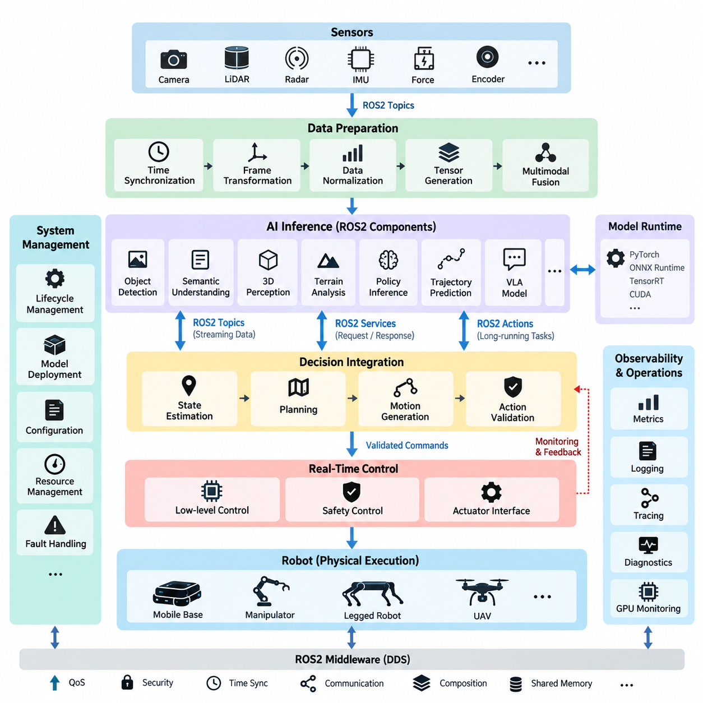
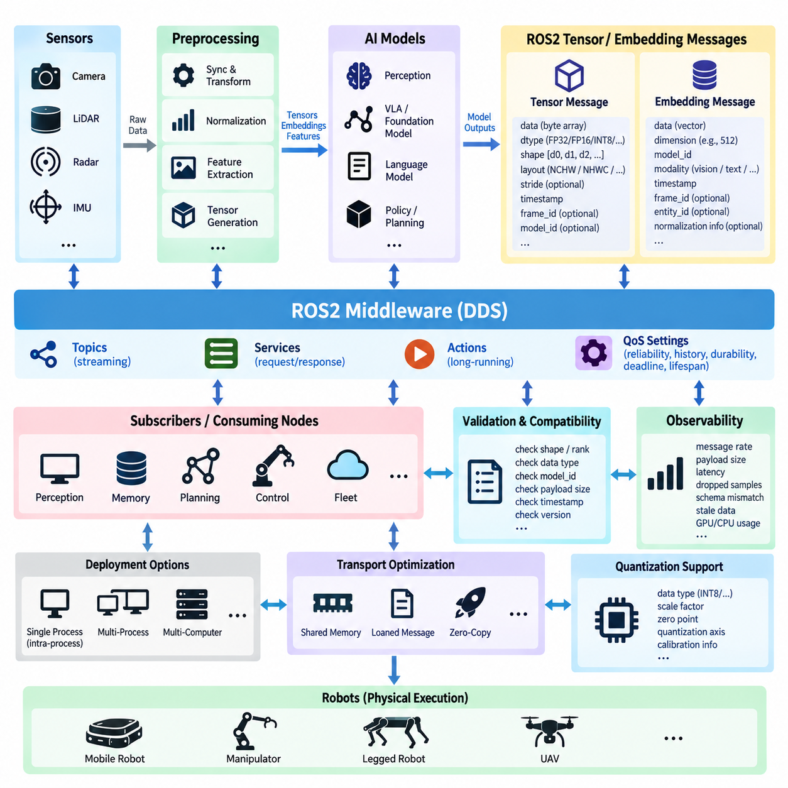
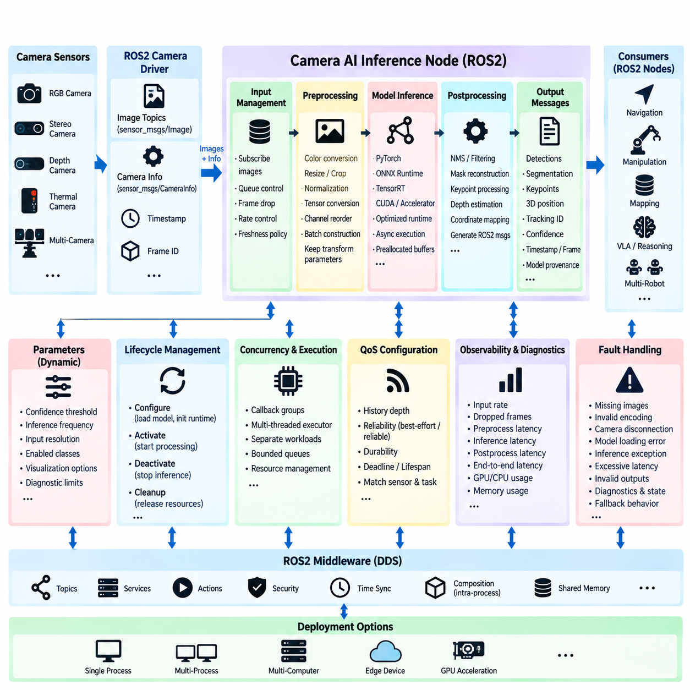
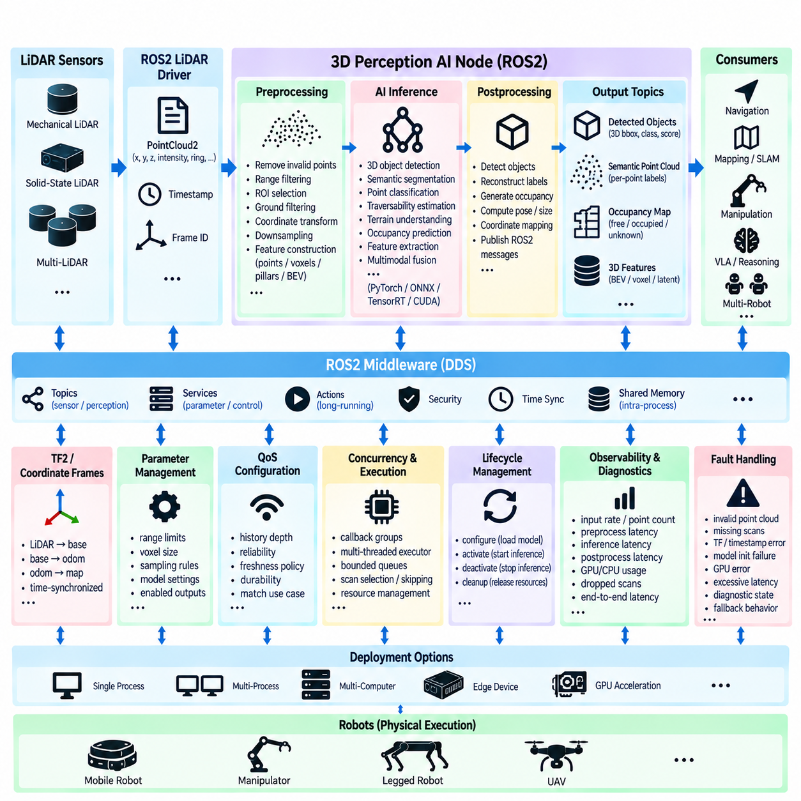
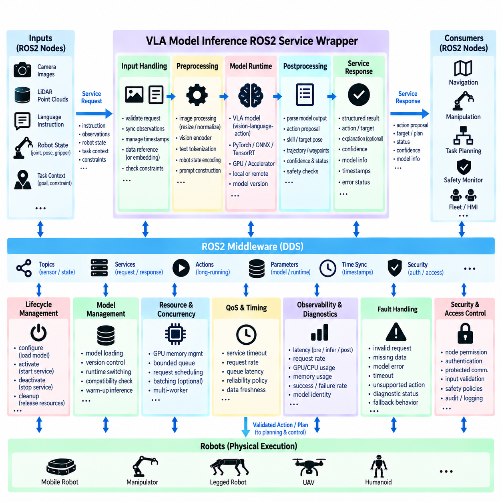
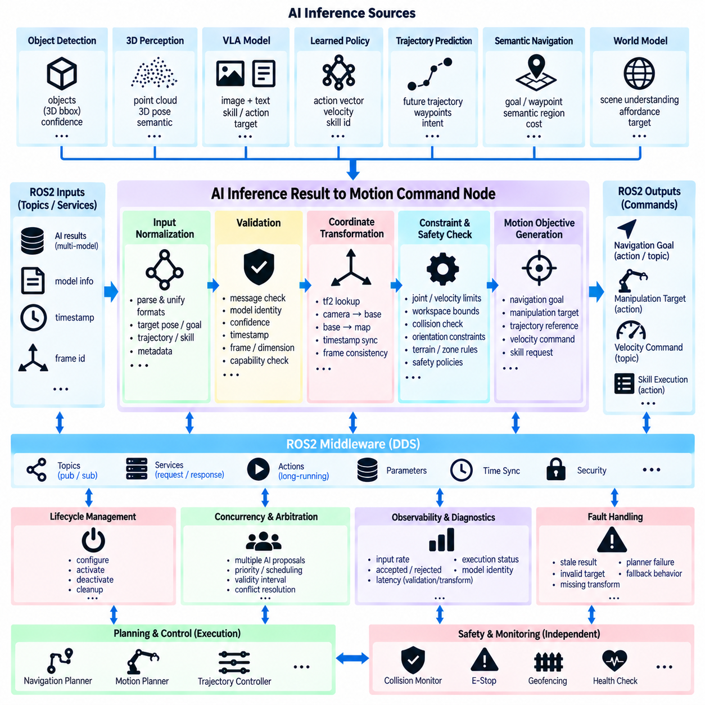
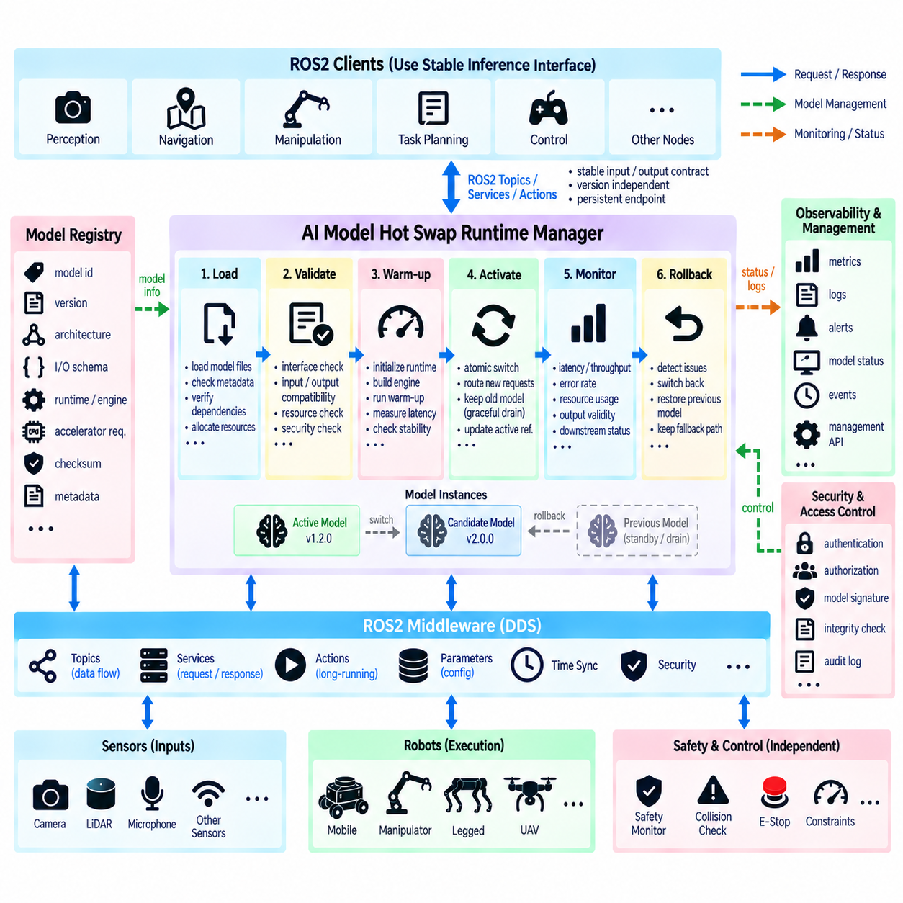
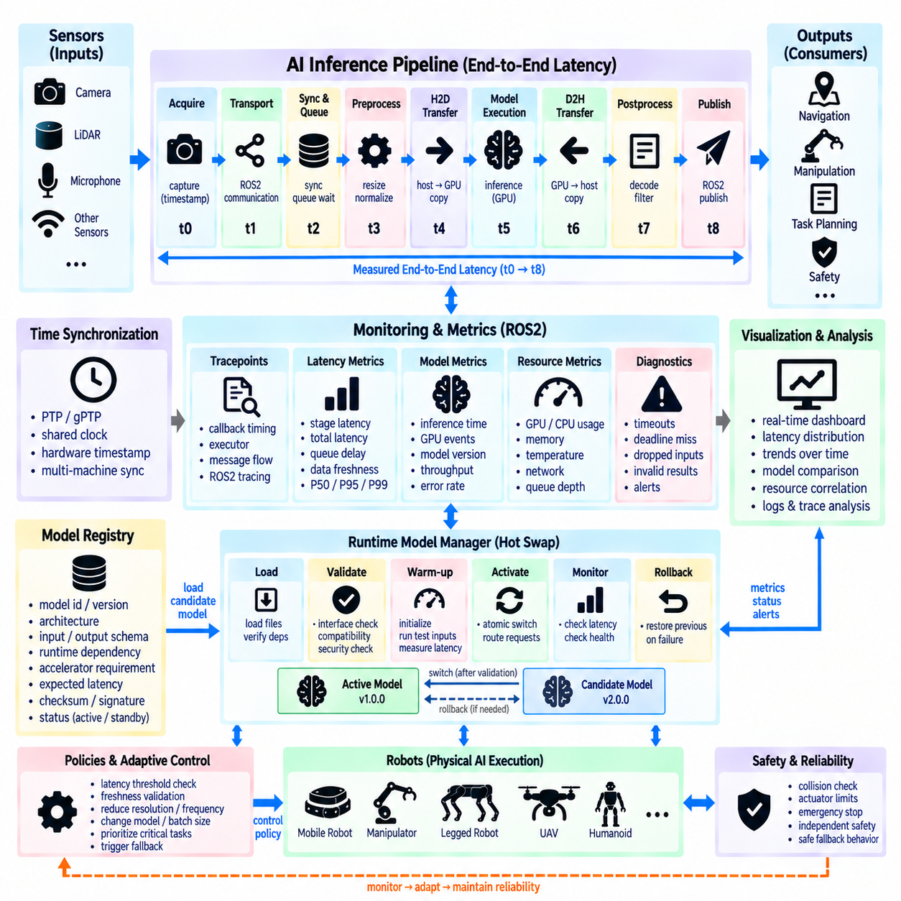
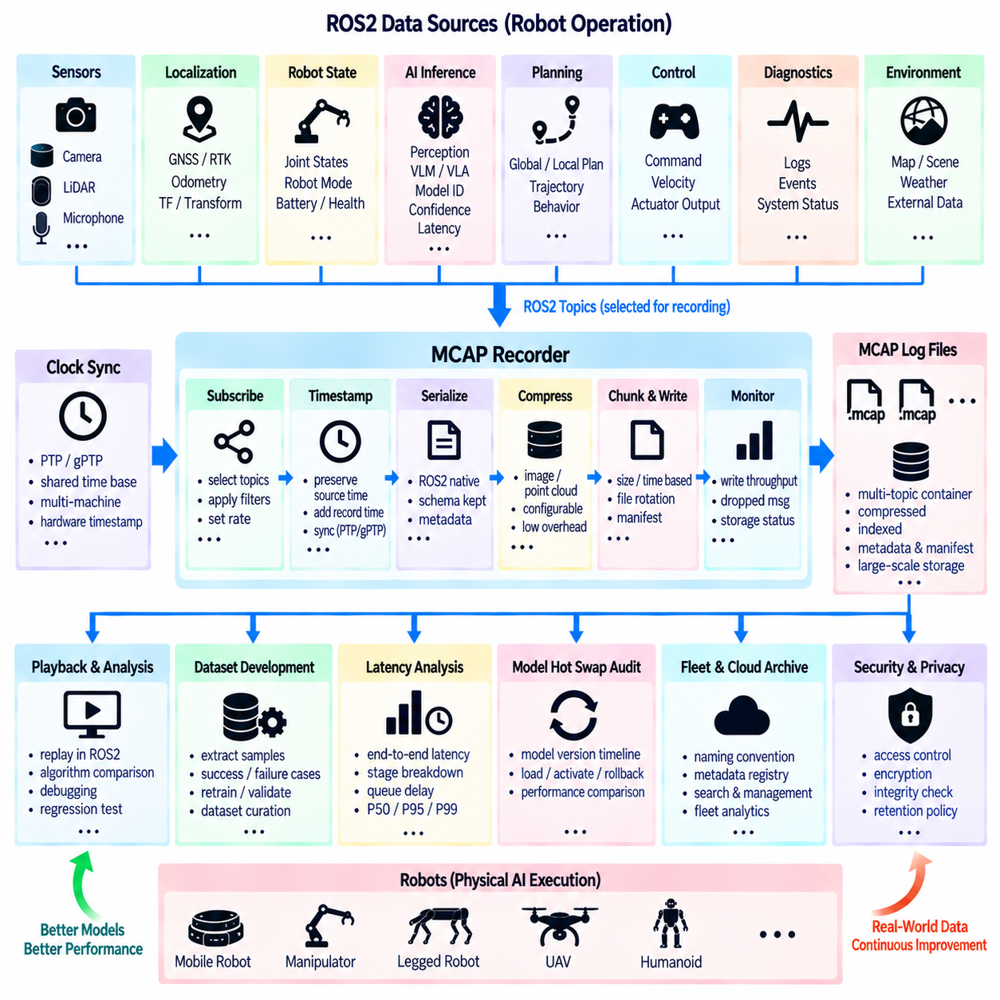
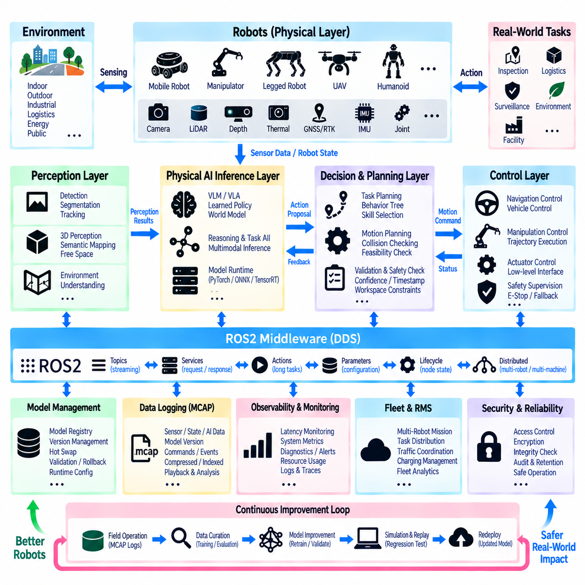

**Volume 05 Robot Middleware and ROS2**

# 10. ROS2 for Physical AI

## 10.01 Physical AI Inference and ROS2 Integration Architecture

{width="7.268055555555556in" height="7.268055555555556in"}

Physical AI extends conventional robotic software by introducing learned models that interpret multimodal observations, reason about the physical environment, and generate actions that affect the real world. Within the ROS2 structure, this intelligence should not replace the middleware or deterministic control layers. Instead, AI inference becomes a modular computational layer connected to sensing, state estimation, planning, motion generation, and control through explicit ROS2 interfaces.

A practical architecture separates the system into sensing, data preparation, AI inference, decision integration, and physical execution. Cameras, LiDAR, radar, IMU, force sensors, joint encoders, and other devices publish observations through ROS2 topics. Preprocessing nodes synchronize timestamps, transform coordinate frames, normalize measurements, generate tensors, and construct the multimodal context required by perception networks, policies, world models, or Vision-Language-Action models.

The inference layer should be treated as a collection of specialized ROS2 components rather than a single monolithic AI node. Separate inference nodes may perform object detection, semantic understanding, 3D perception, terrain analysis, policy inference, trajectory prediction, or language-conditioned action generation. This decomposition follows the broader ROS2 node architecture while allowing individual models to use different accelerators, execution frequencies, lifecycle policies, and computational resources.

ROS2 provides several communication patterns that map naturally to Physical AI workloads. Topics are appropriate for continuous streams such as images, point clouds, embeddings, detections, and predicted states. Services can expose request-response inference operations when immediate streaming is unnecessary, while actions are useful for longer AI-driven operations that require feedback, cancellation, and completion status. The interface should therefore be selected according to inference semantics rather than model implementation convenience.

Large AI payloads require particular architectural attention. Raw images, point clouds, tensor representations, and high-dimensional embeddings can create substantial serialization, memory-copy, and network overhead. Physical AI systems should minimize unnecessary conversions between ROS2 messages, CPU memory, pinned memory, and accelerator memory. Intra-process communication, composition, shared-memory mechanisms, preallocated buffers, and accelerator-aware pipelines can reduce data movement when several processing stages execute on the same edge computer.

Time consistency is equally important because multimodal inference depends on observations representing approximately the same physical state. Sensor timestamps should retain their provenance through preprocessing and inference instead of being replaced by the time at which an AI node finishes processing. ROS2 time synchronization, tf2 transformations, hardware timestamps, and synchronized sensor acquisition allow inference outputs to remain associated with the physical observations that generated them, which is essential for moving robots.

AI inference and real-time control should remain architecturally separated. Neural models can produce semantic states, target poses, navigation objectives, policy outputs, or motion references, but safety-critical actuator loops normally require predictable timing beyond what general-purpose inference pipelines can guarantee. ROS2 can connect these domains through bounded interfaces in which AI proposes an action and deterministic control software validates, constrains, interpolates, or rejects it before commands reach motors and actuators.

This separation becomes particularly important when inference latency varies because of GPU scheduling, model complexity, thermal throttling, memory pressure, or concurrent workloads. Every AI output should therefore carry enough metadata to determine whether it is still valid, including observation timestamps, inference timestamps, model identity, confidence information, and potentially sequence identifiers. Downstream nodes can then detect stale results and apply timeout, fallback, hold, stop, or conventional-control behavior instead of blindly executing delayed predictions.

Lifecycle management provides another important connection between ROS2 and Physical AI. An inference node may need to load model weights, allocate accelerator memory, initialize TensorRT or another runtime, validate device availability, and perform warm-up inference before becoming operational. ROS2 Lifecycle Nodes provide a systematic mechanism for separating configuration from activation. Failure during model initialization can therefore prevent the inference component from entering the active system state.

Model deployment should also be independent from the logical ROS2 interface wherever possible. A perception node may internally use PyTorch, ONNX Runtime, TensorRT, CUDA, or another accelerator runtime while publishing the same stable ROS2 message contract. This abstraction allows model optimization and hardware migration without forcing changes across navigation, manipulation, fleet, or control software. The architecture therefore separates the model implementation lifecycle from the robot interface lifecycle.

Physical AI frequently combines several inference rates within one robot. Camera perception may execute at tens of frames per second, a large multimodal model at a lower frequency, a world model at another update rate, and low-level control at hundreds or thousands of cycles per second. ROS2 nodes should not artificially force these workloads into one timing domain. Instead, asynchronous communication, timestamped state caches, QoS configuration, and explicit freshness policies coordinate information across heterogeneous execution rates.

QoS design becomes a system-level decision in this environment. High-rate sensor streams may favor best-effort delivery and shallow histories to prevent old data from accumulating, while critical state transitions or compact inference results may require reliable delivery. Deadline, lifespan, history, durability, and reliability settings should reflect the physical meaning of each data flow. The objective is not maximum communication reliability everywhere, but delivery behavior consistent with the temporal value of robotic information.

Physical AI integration must also include observability. Inference latency, preprocessing time, queue delay, GPU utilization, memory consumption, input frequency, output frequency, dropped samples, confidence distributions, and timeout events should be measurable alongside conventional ROS2 diagnostics. This enables engineers to distinguish whether degraded robot behavior originates in sensing, middleware communication, inference execution, decision logic, or control, rather than treating the AI model as an opaque component.

Safety supervision should remain outside the authority of a learned inference model. AI-generated motion requests can be checked against velocity limits, collision constraints, operational zones, actuator limits, robot state, and independent safety signals before execution. When inference becomes unavailable or uncertain, the robot should transition according to predefined degradation behavior. Such architecture preserves the flexibility of learned intelligence while maintaining a controlled boundary between probabilistic reasoning and physical actuation.

The resulting ROS2 architecture forms an integration fabric between conventional robotics and learned intelligence. Sensors create timestamped physical observations; preprocessing converts them into model-ready representations; inference nodes produce semantic or action-level information; decision and motion nodes interpret those outputs; and deterministic control executes validated commands. Diagnostics, lifecycle management, QoS, security, logging, and deployment mechanisms surround the complete path rather than being added only after AI functionality is implemented.

This positioning is consistent with the broader software structure in which ROS2 middleware connects control software, edge computing, perception, Physical AI foundation models, robot learning, VLA systems, data architecture, and fleet intelligence as separate but interoperable domains. Physical AI inference therefore becomes one participant in a larger software-defined robot architecture, allowing intelligence to evolve without collapsing perception, reasoning, middleware, safety, and control into an inseparable stack.

## 10.02 ROS2 Message Type Extension: Tensor / Embedding [w/Code]

{width="7.268055555555556in" height="7.268055555555556in"}

In Physical AI systems, conventional ROS2 message definitions are often insufficient for representing neural-network data such as tensors, embeddings, feature maps, latent states, and model outputs. Extending the ROS2 interface layer for these representations allows AI components to participate in the same distributed communication architecture as sensors, planners, controllers, and diagnostics while preserving explicit data contracts between independently developed nodes.

A tensor message must describe not only numerical values but also the structure required to interpret them correctly. Important metadata includes element data type, dimensionality, shape, memory layout, and optionally stride information. A sequence of floating-point values without this context is ambiguous because the receiver cannot determine whether it represents an image feature map, action vector, point feature tensor, language embedding, or another multidimensional representation.

Tensor dimensions should therefore be represented explicitly rather than being embedded in node-specific assumptions. For example, an image tensor may follow batch, channel, height, and width dimensions, whereas another model may use batch, height, width, and channel ordering. Publishing shape and layout metadata enables subscribers to validate compatibility before inference and prevents silent interpretation errors when AI models or preprocessing pipelines are replaced.

The element type is another essential part of the interface contract. Physical AI inference pipelines may exchange FP32, FP16, BF16, INT8, signed or unsigned integer values depending on model architecture and accelerator optimization. The ROS2 message definition should identify the data representation independently of the byte payload so that receiving components can reject unsupported formats or perform deliberate conversion rather than interpreting raw memory incorrectly.

Embeddings require a related but semantically different interface design. An embedding is normally a learned vector representation encoding visual, linguistic, spatial, object-level, or multimodal information. Although it can technically be transmitted as a one-dimensional tensor, a practical ROS2 message should associate the vector with semantic metadata such as embedding dimension, model identifier, source modality, timestamp, reference frame when applicable, and the entity or observation from which it was generated.

Model identity is especially important because equal-sized embeddings from different models are not necessarily compatible. A 512-dimensional visual embedding generated by one encoder cannot automatically be compared with a 512-dimensional vector generated by another model. Message metadata should therefore provide sufficient model and representation information for downstream nodes to determine whether similarity calculation, retrieval, fusion, or policy inference is semantically valid.

Timestamp information should represent the physical observation associated with the tensor rather than merely the publication time of the ROS2 message. A feature tensor generated from a camera frame should preserve the acquisition timestamp of that frame, while derived multimodal embeddings should maintain traceability to their contributing observations. This allows synchronization, latency analysis, state reconstruction, and stale-data detection across asynchronous Physical AI pipelines.

Coordinate-frame information remains relevant when learned representations correspond to physical geometry. Point-cloud features, occupancy tensors, voxel embeddings, object features, and spatial latent representations may be associated with sensor, robot, odometry, or map frames. Integrating standard ROS2 header conventions and tf2-compatible frame identifiers helps maintain the relationship between learned representations and the physical coordinate system in which robotic decisions are executed.

A general tensor message can be designed around a compact metadata section followed by a contiguous payload. However, transmitting large numerical arrays through ordinary serialized ROS2 messages may introduce memory copies and serialization overhead. This becomes significant for high-resolution feature maps or high-frequency perception pipelines. Message-type design must therefore be considered together with intra-process communication, shared-memory transport, node composition, and accelerator-oriented data movement.

For nodes executing inside the same process, ROS2 composition can reduce unnecessary communication overhead, but application architecture should avoid assuming that every AI component will always remain colocated. A well-defined tensor interface preserves logical interoperability even when deployment changes from one process to several processes or computers. Transport optimization should consequently be separated from the semantic definition of the tensor whenever practical.

Direct GPU-to-GPU communication presents a more complex problem because a conventional ROS2 byte array normally represents host-accessible data rather than accelerator memory. High-performance implementations may introduce handles, shared buffers, loaned data, or middleware-specific zero-copy mechanisms. Such optimization should remain behind a controlled interface boundary so that the system can distinguish portable ROS2 data contracts from deployment-specific accelerator transport mechanisms.

Tensor messages also require validation at subscriber boundaries. Before consuming incoming data, a node can verify rank, shape, element type, expected model identity, payload size, timestamp freshness, and representation version. These checks are particularly valuable in Physical AI because an apparently valid numerical array may produce a plausible but incorrect neural-network result when dimensions or preprocessing conventions do not match the receiving model.

Version management becomes necessary as tensor and embedding interfaces evolve. Adding quantization parameters, model provenance, normalization metadata, semantic labels, or new element types can affect compatibility across deployed robots. Stable message definitions and explicit representation versions help prevent model upgrades from silently breaking downstream components. Interface evolution should therefore be managed independently from individual model releases whenever the underlying semantic contract remains unchanged.

Quantized inference introduces additional metadata requirements. INT8 or other compressed representations may require scale factors, zero points, quantization axes, or calibration conventions to reconstruct their intended numerical meaning. If these parameters are omitted, the raw tensor values cannot be reliably interpreted outside the originating runtime. A reusable ROS2 tensor representation should either carry the required quantization description or explicitly define it through a referenced model contract.

Embedding communication also enables higher-level Physical AI functions beyond direct perception. Visual and language embeddings can support semantic retrieval, object memory, scene association, multimodal grounding, task planning, and robot knowledge sharing. ROS2 provides the communication fabric through which these representations can move between perception, memory, reasoning, VLA, and fleet-level components without requiring every subsystem to consume raw sensor streams.

Care is required when embeddings are distributed across multiple robots because their compact size can make them attractive as shared semantic representations. Compatibility still depends on common encoder versions, preprocessing rules, normalization conventions, and semantic definitions. A fleet architecture should therefore treat embedding schema and model provenance as part of the distributed interface contract rather than assuming that vector dimensionality alone establishes interoperability.

Tensor and embedding topics also require appropriate ROS2 QoS configuration. High-frequency intermediate tensors may have little value once newer data arrives and can therefore use shallow queues and freshness-oriented delivery behavior. Compact semantic embeddings or important inference states may require different reliability characteristics. QoS should reflect the lifetime and operational significance of the learned representation instead of applying identical settings to every AI message.

Observability should accompany these extended message types. Diagnostics can track tensor dimensions, payload sizes, publication rates, serialization time, transport latency, dropped samples, incompatible schema events, and stale embeddings. Combined with inference latency measurements, these metrics make it possible to determine whether Physical AI performance degradation originates from model execution or from the communication and representation pipeline surrounding the model.

ROS2 tensor and embedding extensions ultimately establish a typed boundary between neural computation and distributed robotic software. The objective is not simply to transport arrays of numbers, but to preserve shape, type, time, provenance, semantics, compatibility, and physical context as learned representations move through the robot. This enables Physical AI models to evolve as modular components while maintaining predictable integration with perception, reasoning, planning, control, data logging, and multi-robot systems.

## 10.03 Camera AI Inference Node Pipeline Design [w/Code]

{width="7.268055555555556in" height="7.268055555555556in"}

A camera AI inference node in ROS2 forms the bridge between continuous visual sensing and higher-level robotic intelligence. Its primary responsibility is not simply to execute a neural network, but to manage the complete path from camera acquisition through preprocessing, inference, postprocessing, and publication of structured results. Designing this path as an explicit pipeline makes visual intelligence modular, observable, replaceable, and compatible with the broader Physical AI software architecture.

The pipeline normally begins with a ROS2 camera driver that publishes image data together with camera calibration information. Depending on the hardware, the source may be an RGB camera, stereo camera, depth camera, thermal camera, or synchronized multi-camera system. The inference node should consume standard ROS2 image interfaces whenever practical, preserving timestamps and frame identifiers so that visual results remain traceable to the physical observation from which they were generated.

Image acquisition and AI inference frequently operate at different rates. A camera may produce thirty or sixty frames per second while a large neural model processes considerably fewer frames. The node should therefore avoid allowing an unlimited callback queue to accumulate outdated images. Queue depth, callback scheduling, frame dropping, and freshness policies should be explicitly designed so that the model normally processes the most operationally relevant observations instead of increasingly stale frames.

Preprocessing converts ROS2 image data into the representation expected by the model. Typical operations include color-space conversion, resizing, cropping, normalization, tensor conversion, channel reordering, and batch construction. These operations must exactly match the model\'s training and deployment assumptions. Differences in RGB/BGR ordering, normalization constants, image resolution, aspect-ratio handling, or tensor layout can significantly degrade inference even when the neural-network execution itself is correct.

Geometric preprocessing requires special attention because inference results often need to be mapped back to the original camera image. If an image is resized, cropped, padded, or letterboxed before inference, the corresponding transformation parameters should remain available during postprocessing. Bounding boxes, segmentation masks, keypoints, depth estimates, or other predictions can then be transformed accurately into the coordinate system of the original sensor image and subsequently associated with robot geometry.

The inference stage should be isolated behind a model-runtime abstraction whenever possible. The same ROS2 node architecture may execute a model using PyTorch, ONNX Runtime, TensorRT, CUDA-based libraries, or hardware-specific accelerators without changing the external ROS2 interface. Separating model execution from communication allows the deployment platform and optimization method to evolve while downstream perception, planning, and control nodes continue to consume stable message contracts.

GPU execution introduces additional pipeline considerations. Host-to-device transfer, tensor allocation, kernel execution, synchronization, and device-to-host transfer can collectively consume substantial time beyond the neural-network computation itself. Reusable buffers, pinned memory, asynchronous execution, preallocated tensors, optimized CUDA streams, and accelerator-specific runtimes can reduce overhead. Performance analysis should therefore measure end-to-end inference-node latency rather than reporting only the model\'s kernel execution time.

Postprocessing converts raw neural-network outputs into information meaningful to the robot. Detection networks may require confidence filtering and non-maximum suppression, segmentation models require mask reconstruction, and pose models may generate keypoints or geometric estimates. The resulting ROS2 messages should represent operational semantics such as object class, confidence, image coordinates, physical position, segmentation region, tracking identity, or model provenance rather than exposing undocumented model-specific arrays.

Visual inference results should retain both temporal and spatial context. The output should preserve the original observation timestamp and appropriate frame identifier, while also recording the inference completion time when latency measurement is required. This distinction allows downstream nodes to determine when the physical scene was observed and how long processing required. When geometric information is available, tf2 can relate camera-frame detections to robot, odometry, or map coordinate frames.

ROS2 composition can improve performance when the camera driver, preprocessing stage, and inference component execute on the same computer. Intra-process communication may reduce serialization and memory-copy overhead, particularly for large image messages. However, the logical interfaces between stages should remain clearly defined so that the system can later separate components across processes or computers without redesigning the entire perception architecture.

QoS configuration should reflect the temporal characteristics of camera inference. High-rate images generally benefit from limited history because old frames rapidly lose value on a moving robot. Best-effort communication may be appropriate for some sensor streams, while compact inference outputs may use reliable delivery when their operational significance justifies it. QoS settings should be selected according to sensor behavior, network conditions, processing rate, and downstream requirements rather than using one universal configuration.

Concurrency must also be controlled deliberately. Image reception, preprocessing, GPU inference, result publication, diagnostics, and parameter updates can otherwise interfere with one another through callback scheduling or shared resources. ROS2 callback groups and executors can separate workloads, while bounded queues prevent overload. For GPU pipelines, allowing uncontrolled simultaneous inference requests may increase memory consumption and latency instead of increasing useful throughput.

Lifecycle management provides a structured method for initializing camera AI nodes. During configuration, the node can load model files, initialize the inference runtime, allocate GPU memory, validate parameters, and establish subscriptions and publishers. Activation can begin actual image processing only after these resources are ready. Deactivation can stop inference without destroying configuration, while cleanup can release accelerator resources, supporting controlled startup, restart, model replacement, and fault recovery.

Runtime parameters should expose operational settings that can safely change without rebuilding the node. Examples include confidence thresholds, inference frequency, input resolution selections, enabled output classes, visualization options, and diagnostic limits. Parameters affecting the model\'s fundamental tensor structure or safety behavior require stronger validation. Dynamic configurability is useful only when parameter changes cannot silently violate the assumptions of the inference pipeline.

Observability is essential because camera AI performance depends on more than model accuracy. The node should measure camera input rate, accepted and dropped frames, preprocessing latency, inference latency, postprocessing latency, total end-to-end latency, output rate, queue occupancy, GPU utilization, and memory consumption. Timestamped measurements make it possible to identify whether degradation originates in sensor delivery, ROS2 scheduling, data movement, model execution, or downstream communication.

Fault handling should define behavior for missing images, invalid encodings, camera disconnection, GPU allocation failure, model loading errors, inference exceptions, excessive latency, and invalid outputs. A camera AI node should report these conditions through diagnostics and lifecycle state transitions instead of continuing to publish apparently normal results. Downstream components can then distinguish valid perception from degraded or unavailable AI capability and select appropriate fallback behavior.

For multi-camera robots, the architecture should avoid creating ambiguous relationships between images and inference outputs. Namespaces, camera identifiers, frame identifiers, timestamps, and model instances should clearly identify each processing path. Some systems may use independent inference nodes for each camera, while others may batch synchronized images into a multimodal model. The interface design should preserve sensor provenance regardless of the internal inference strategy.

The complete camera AI pipeline therefore connects sensing, preprocessing, accelerated inference, postprocessing, ROS2 communication, diagnostics, and lifecycle management as one controlled data path. Its architectural objective is predictable integration rather than merely maximum neural-network throughput. When time, geometry, model provenance, resource use, and failure behavior remain explicit, camera-based Physical AI can operate as a reliable modular subsystem supporting perception, navigation, manipulation, VLA reasoning, and autonomous robot behavior.

## 10.04 LiDAR 3D Perception AI Node Integration [w/Code]

{width="7.268055555555556in" height="7.268055555555556in"}

LiDAR-based 3D perception provides a robot with direct geometric observations of the surrounding physical environment and is therefore a fundamental component of autonomous navigation and Physical AI. In a ROS2 architecture, a 3D perception AI node transforms raw point-cloud streams into structured representations such as objects, surfaces, obstacles, semantic regions, occupancy information, or learned spatial features that higher-level robot software can consume.

The processing pipeline normally begins with a LiDAR driver publishing point clouds through standard ROS2 interfaces such as PointCloud2. Each measurement contains three-dimensional coordinates and may additionally include intensity, reflectivity, ring index, return information, or sensor-specific attributes. Preserving the original timestamp and frame identifier is essential because subsequent perception results must remain associated with the physical observation and coordinate system from which they were generated.

Raw LiDAR data usually requires preprocessing before neural-network inference. Typical operations include invalid-point removal, range filtering, region-of-interest selection, ground filtering, coordinate transformation, downsampling, and feature construction. Depending on the AI architecture, the point cloud may then be represented as raw points, pillars, voxels, range images, sparse tensors, or bird\'s-eye-view features before being transferred to the inference runtime.

Preprocessing design directly influences both accuracy and computational cost. Aggressive downsampling can reduce latency and GPU memory consumption but may remove small or distant objects, while dense representations preserve geometric detail at greater computational expense. The preprocessing node should therefore expose explicit spatial ranges, voxel resolution, sampling rules, and feature definitions so that runtime behavior remains consistent with the assumptions used during model training.

Coordinate-frame management is particularly important for 3D perception because every prediction has physical spatial meaning. Sensor measurements may originate in a LiDAR frame while navigation and planning operate in base, odometry, or map frames. ROS2 tf2 transformations should be applied with the correct timestamps so that detections are transformed using the robot pose corresponding to the original scan rather than a newer pose obtained after inference has completed.

The AI inference stage can support several classes of 3D perception models. A node may perform 3D object detection, semantic segmentation, point classification, traversability estimation, terrain understanding, occupancy prediction, or learned feature extraction. More advanced Physical AI systems can combine LiDAR features with camera, radar, or language-conditioned representations, allowing geometric measurements to contribute to multimodal scene understanding and downstream reasoning.

Inference execution should remain separated from the external ROS2 message contract. The internal implementation may use PyTorch, ONNX Runtime, TensorRT, CUDA, sparse convolution libraries, or dedicated accelerator frameworks while publishing consistent outputs to downstream nodes. This separation allows models, inference engines, precision modes, and computing hardware to change without forcing navigation, mapping, planning, or fleet software to be redesigned.

Large point clouds create substantial memory and communication overhead. Repeated serialization, deserialization, and copying of PointCloud2 data can become a significant part of end-to-end latency, particularly with high-channel-count LiDAR sensors. ROS2 composition, intra-process communication, shared-memory mechanisms, reusable buffers, and carefully designed data ownership can reduce unnecessary movement when preprocessing and inference execute on the same edge computer.

GPU-oriented pipelines should minimize conversions between point-cloud representations. A poorly designed path may deserialize ROS2 data into CPU structures, copy it into another preprocessing buffer, generate a tensor, transfer that tensor to GPU memory, and then repeat similar copies during postprocessing. Efficient implementations attempt to reuse memory, batch transformations where appropriate, preallocate tensors, and keep intermediate representations close to the accelerator whenever deployment constraints permit.

Postprocessing converts model-specific outputs into robot-level spatial information. A 3D detector may produce object classes, confidence values, centers, dimensions, orientations, and velocities, while segmentation networks may assign semantic labels to points or voxels. Occupancy-oriented models can generate free, occupied, unknown, or semantic spatial states. ROS2 output interfaces should expose these operational meanings rather than requiring every subscriber to understand internal neural-network tensor formats.

Temporal consistency becomes challenging when the robot or surrounding objects move during inference. The timestamp of a published detection should therefore identify the observation time, while an additional processing timestamp can indicate when inference finished. Downstream systems can use this information to compensate for ego-motion, reject stale predictions, associate detections across scans, or determine whether an AI result remains sufficiently current for navigation and control.

Multi-sensor fusion requires even stricter synchronization. Camera images, LiDAR scans, radar measurements, and IMU data may arrive at different frequencies and with different transport delays. Fusion nodes should associate measurements according to acquisition time and calibrated transformations rather than ROS2 callback arrival order. Hardware timestamps, synchronized clocks, tf2 history, and explicit temporal tolerances help maintain physically meaningful correspondence between modalities.

ROS2 QoS settings should reflect the high-volume and time-sensitive nature of LiDAR streams. Deep queues can be harmful because old point clouds may continue to consume processing resources after they have lost operational relevance. Sensor streams may favor shallow histories and freshness-oriented behavior, whereas compact detection or occupancy outputs can use different reliability policies according to downstream requirements. QoS should therefore be designed per interface.

Concurrency should prevent high-rate point-cloud reception from blocking inference, diagnostics, or control-related communication. Callback groups and appropriate ROS2 executors can isolate responsibilities, while bounded processing queues prevent uncontrolled backlog. When inference cannot maintain the LiDAR acquisition rate, explicit scan selection or frame-skipping policies are preferable to silently accumulating latency because predictable freshness is often more valuable than processing every scan.

Lifecycle management is useful for controlling expensive 3D perception resources. During configuration, the node can load model weights, initialize sparse-convolution or TensorRT engines, allocate GPU memory, validate LiDAR parameters, and establish publishers and subscribers. Activation begins actual perception only after initialization succeeds, while deactivation and cleanup provide controlled mechanisms for stopping inference, releasing resources, recovering from failures, or replacing models.

Observability should cover the complete LiDAR AI pipeline rather than only neural-network execution. Useful measurements include point-cloud input rate, point count, filtered point count, preprocessing latency, host-to-device transfer time, inference latency, postprocessing latency, output rate, queue occupancy, GPU utilization, memory consumption, dropped scans, and end-to-end age of published results. These measurements make bottlenecks visible across sensing, middleware, preprocessing, inference, and publication.

Fault handling must account for malformed point clouds, missing scans, incorrect frame transformations, timestamp discontinuities, model initialization failures, GPU errors, excessive inference latency, and invalid outputs. Diagnostic states should clearly indicate whether perception is healthy, degraded, or unavailable. Navigation and control components can then select conservative fallback behavior rather than treating missing or stale AI perception as valid information about free space.

For multi-LiDAR robots, namespaces and frame identifiers should clearly preserve sensor provenance. Separate sensors may cover front, rear, side, or elevated fields of view, and their streams may be processed independently or fused into a common representation. Calibration, synchronization, overlap handling, and duplicate-object management become part of the integration architecture when multiple point clouds contribute to a shared 3D environmental model.

The complete ROS2 LiDAR 3D perception architecture therefore connects physical sensing, spatial preprocessing, accelerator-based AI inference, geometric postprocessing, coordinate transformation, middleware communication, diagnostics, and lifecycle management into a controlled pipeline. By preserving time, geometry, model provenance, data freshness, and failure state, the perception node can provide reliable spatial intelligence to SLAM, navigation, manipulation, world models, VLA systems, and autonomous Physical AI behaviors.

## 10.05 VLA Model Inference: ROS2 Service Wrapper [w/Code]

{width="7.268055555555556in" height="7.268055555555556in"}

A Vision-Language-Action model connects visual perception and natural-language instructions directly to robot-oriented actions, making it an important component of Physical AI systems. In ROS2, a VLA model should normally be isolated behind a well-defined software interface rather than tightly coupled to navigation or control nodes. A ROS2 service wrapper provides this boundary by converting robot requests into model inputs and translating inference results into structured responses.

The service wrapper acts as an adaptation layer between ROS2 semantics and the internal representation required by the VLA runtime. A requesting node should not need to understand tokenizers, vision encoders, tensor layouts, GPU memory, or model-specific APIs. Instead, it sends a clearly defined request containing information such as an instruction, observation reference, robot state, task context, or execution constraints and receives an explicitly typed result.

Service-based communication is appropriate when VLA inference behaves as a bounded request-response operation. A planner may request an interpretation of the current scene, a manipulation target, or a high-level action and wait for the result before continuing. However, ROS2 services are not intended to represent every VLA interaction. Long-running tasks requiring continuous feedback, cancellation, or intermediate progress are generally better represented through ROS2 actions or higher-level task orchestration.

The service request should preserve sufficient context for physically meaningful inference. Visual observations may include RGB or depth images, references to recently acquired sensor data, object information, or embeddings generated by perception nodes. Language input can represent operator commands, mission descriptions, or task constraints. Robot-state information may include pose, joint state, gripper state, available capabilities, and environmental context needed to prevent the model from reasoning about actions the robot cannot perform.

Large visual inputs require careful interface design. Embedding complete high-resolution images directly inside every service request can create unnecessary serialization and memory-copy overhead. Depending on the deployment architecture, the wrapper may instead use synchronized topic data, cached observations, shared-memory references, or compact learned embeddings. The chosen mechanism should preserve the relationship between the request and the exact observation used for inference.

Timestamp and provenance information are essential because VLA reasoning is grounded in a changing physical environment. The wrapper should know when the visual observation was acquired, which sensor produced it, and which robot state corresponds to that observation. If inference requires significant time, the response should distinguish observation time from inference completion time so that downstream components can determine whether the result remains valid for execution.

Inside the wrapper, preprocessing converts ROS2-level inputs into the model-specific multimodal representation. Images may require resizing, normalization, tensor conversion, or vision-encoder processing, while language instructions may require tokenization and prompt construction. Robot states may be normalized or encoded into structured tokens. These transformations should remain internal to the wrapper so that changes in model implementation do not propagate throughout the ROS2 software stack.

The model-runtime interface should similarly be abstracted from the ROS2 service definition. A VLA implementation may use PyTorch, ONNX Runtime, TensorRT, accelerator-specific libraries, or a remote inference backend. The service contract can remain stable while the internal model, runtime, precision mode, or computing platform changes. This separation supports model upgrades and hardware migration without forcing every requesting ROS2 node to change.

VLA outputs require explicit semantic interpretation before they are exposed to the robot. A model may internally generate action tokens, textual descriptions, discrete skill identifiers, target poses, waypoint sequences, or continuous action vectors. The wrapper should convert these model-specific outputs into well-defined ROS2 representations that communicate what the robot is being asked to do rather than exposing undocumented neural-network output formats.

Direct conversion from VLA inference to actuator commands should generally be avoided. The service response is better interpreted as an action proposal, task decision, target state, skill selection, or motion objective that downstream planning and control components can validate. Deterministic software can then apply kinematic constraints, collision checking, workspace limits, velocity restrictions, and safety policies before physical execution, preserving a controlled boundary between learned reasoning and actuation.

Confidence and validity information should accompany VLA results when the model or application can provide meaningful measures. The response can identify whether inference succeeded, which model produced the result, what observation was used, and whether parsing or validation detected an unsupported action. A structured status field is preferable to treating every completed service call as a valid command because successful computation does not necessarily imply a physically executable result.

Timeout handling is particularly important because VLA models can have substantially higher and more variable latency than conventional ROS2 functions. The service client should define how long a result remains useful, while the wrapper should detect overloaded inference queues or stalled runtimes. If the response arrives after the relevant scene has changed, downstream software should be able to reject it rather than executing an action derived from obsolete environmental information.

Concurrency policies should be explicit when multiple ROS2 nodes request VLA inference simultaneously. Uncontrolled parallel requests can exhaust GPU memory or create unpredictable latency, especially for large multimodal models. The wrapper can serialize requests, maintain a bounded queue, support controlled batching, or route requests among multiple inference workers. The selected strategy should reflect whether the primary requirement is response latency, throughput, fairness, or resource isolation.

Lifecycle management provides a useful mechanism for controlling the VLA service. During configuration, the wrapper can load model weights, initialize tokenizers and vision encoders, allocate accelerator memory, validate model files, and perform warm-up inference. Only after these operations succeed should the service become operational. Deactivation can stop accepting inference requests, while cleanup releases model and accelerator resources for controlled restart or replacement.

Runtime model replacement can be supported without changing the service-facing ROS2 architecture. A new VLA model can be loaded and validated while clients continue to use the same logical request and response definitions, provided the semantic contract remains compatible. Model identifiers and interface versions should be recorded so that results can be traced to the exact model configuration that produced them and incompatible representations can be detected.

Observability should cover the entire service path. Useful measurements include request rate, queue waiting time, preprocessing latency, model inference latency, postprocessing time, total response latency, timeout count, failure rate, GPU utilization, memory consumption, and model identity. These metrics allow engineers to distinguish whether slow VLA behavior originates from ROS2 communication, scheduling, preprocessing, accelerator execution, or output interpretation.

Fault handling should address malformed requests, missing observations, invalid language inputs, unavailable model files, GPU allocation failures, inference exceptions, unsupported action outputs, and excessive latency. The wrapper should return explicit error states and publish diagnostic information instead of producing partially valid action data. Higher-level orchestration can then retry, choose another model, invoke a conventional planner, request operator assistance, or enter a predefined safe behavior.

Security also becomes important when language instructions can influence physical behavior. ROS2 access control should restrict which nodes are permitted to invoke the VLA service, while requests and responses may require authentication and protected communication in distributed deployments. The wrapper should treat language input as untrusted task data and ensure that model-generated outputs still pass through robot capability, operational, and safety validation before execution.

The VLA ROS2 service wrapper therefore creates a controlled boundary between multimodal foundation-model inference and conventional robotic software. It encapsulates preprocessing, model runtime, resource management, validation, timing, diagnostics, and failure handling while exposing stable ROS2 semantics. This allows VLA intelligence to evolve independently while navigation, manipulation, task planning, safety, and control remain modular components of a dependable Physical AI architecture.

## 10.06 AI Inference Result to Motion Command Node [w/Code]

{width="7.268055555555556in" height="7.268055555555556in"}

An AI inference result-to-motion command node forms a critical transition point between probabilistic Physical AI reasoning and deterministic robot motion. Its purpose is not to forward neural-network outputs directly to actuators, but to interpret, validate, constrain, and transform AI-generated results into motion objectives that conventional ROS2 planning and control components can safely execute. This boundary preserves modularity between learned intelligence and physical control.

Inputs to the node may originate from object detection, 3D perception, VLA models, learned policies, trajectory prediction, semantic navigation, or world-model inference. These upstream components can produce target poses, object locations, waypoints, velocity suggestions, skill identifiers, grasp candidates, or continuous action vectors. The conversion node must understand the semantic meaning of each accepted representation before generating any downstream motion request.

A normalized intermediate representation is useful when several AI models feed the same motion architecture. Instead of implementing a separate control interface for every model, the node can convert heterogeneous outputs into common concepts such as target pose, target velocity, trajectory reference, manipulation goal, navigation waypoint, or skill request. This abstraction reduces coupling between rapidly changing AI models and relatively stable robot planning and control software.

Every inference result should be validated before motion conversion begins. Validation can include message integrity, model identity, confidence, timestamp freshness, coordinate frame, dimensional consistency, allowed action type, and required robot state. A numerically valid output may still be operationally invalid if it refers to an outdated observation, an unknown coordinate frame, an unsupported robot capability, or a target outside the permitted workspace.

Temporal validity is particularly important because AI inference introduces variable latency. The node should preserve the timestamp of the observation that produced the inference result and compare it with the current robot state. If the robot or target has moved significantly during inference, the proposed action may no longer correspond to the current physical situation. Age limits, timeout policies, state reconciliation, or re-inference can prevent stale predictions from becoming motion commands.

Coordinate transformation is required whenever AI outputs and control components operate in different frames. A camera model may predict an object location in a camera frame, while a manipulator requires a target in its base frame and a mobile robot planner may require map coordinates. ROS2 tf2 can transform targets using timestamp-consistent transforms, allowing the command node to preserve the geometric relationship between perception results and physical execution.

Confidence values can contribute to decision logic, but they should not be interpreted as universal safety guarantees. Different models produce confidence measures with different meanings and calibration characteristics. The node can apply model-specific acceptance thresholds or uncertainty policies while still subjecting accepted results to independent geometric, operational, and safety checks. Low-confidence outputs may trigger rejection, re-observation, slower behavior, or escalation to another decision mechanism.

The conversion from an AI result to a motion objective depends on robot type. For a mobile robot, semantic inference may become a navigation goal, local waypoint, heading reference, or bounded velocity suggestion. For a manipulator, the output may become an end-effector pose, grasp candidate, joint-space objective, or named skill. Legged robots and UAVs may require body poses, foothold targets, trajectories, or flight objectives rather than direct actuator-level commands.

Motion constraints should be applied before forwarding the converted objective downstream. These constraints can include velocity and acceleration limits, joint limits, workspace boundaries, minimum obstacle clearance, orientation restrictions, terrain constraints, payload conditions, and mission-specific operational zones. The AI output should be interpreted as a proposal within these boundaries rather than as an authority capable of overriding the physical limitations of the robot.

The node should normally interface with established motion-generation components instead of generating low-level actuator signals itself. Navigation goals can be passed to navigation planners, manipulation targets to motion planners, and trajectory references to controllers through appropriate ROS2 topics, services, or actions. This architecture allows conventional algorithms to perform path generation, inverse kinematics, collision checking, trajectory optimization, and feedback control after AI-based decision making.

ROS2 actions are particularly useful when an AI-derived motion request initiates a process that takes significant time. The command node can submit a navigation, manipulation, docking, or inspection goal and receive feedback about execution progress. Cancellation and preemption then remain available when new perception invalidates the original decision. Short-lived references such as bounded velocity commands may instead use topics when continuous streaming behavior is appropriate.

Safety supervision should remain independent from the AI-to-motion conversion path. Even after semantic and geometric validation, motion requests may need to pass through collision monitors, safety controllers, speed-and-separation logic, geofencing, actuator protection, or emergency-stop mechanisms. The command node should never interpret successful AI inference as permission to bypass these layers. Learned intelligence proposes behavior, while safety mechanisms retain authority over physical execution.

Rate mismatch must also be considered. AI inference may update at a few hertz while a motion controller operates at hundreds or thousands of hertz. The conversion node should not attempt to replace the high-frequency feedback loop with low-frequency neural predictions unless the complete control architecture was explicitly designed for that purpose. Instead, AI results can establish references or objectives that deterministic controllers continuously track using current sensor feedback.

State machines or behavior orchestration can provide additional control over how inference results become executable commands. A target may be accepted only when the robot is in an appropriate operational state, relevant sensors are healthy, localization is valid, and no conflicting mission is active. Explicit states such as waiting, validating, commanding, executing, completed, rejected, and faulted make the interaction between AI reasoning and robot behavior easier to understand and diagnose.

Concurrency becomes important when several AI components generate competing motion proposals. A perception model may request obstacle avoidance while a VLA system proposes manipulation and a mission planner requests navigation. The architecture needs arbitration or prioritization outside uncontrolled callback order. The conversion node can participate in this process by identifying command source, priority, validity interval, requested capability, and execution status for each proposed action.

Lifecycle management can ensure that motion conversion becomes active only after required dependencies are available. During configuration, the node can validate coordinate frames, parameters, robot limits, downstream action servers, and safety interfaces. Activation enables command generation, while deactivation prevents new AI-derived motion requests from being forwarded. This provides a controlled mechanism for startup, maintenance, model replacement, and recovery from system faults.

Observability should span the complete transition from inference result to physical command. Useful measurements include input result rate, accepted and rejected proposals, inference age, validation time, transformation latency, command generation time, downstream acceptance, execution completion, cancellation frequency, and safety rejection events. Recording model identity and source timestamps enables engineers to reconstruct why a particular motion objective was generated.

Fault handling should explicitly address missing transformations, stale inference, malformed messages, invalid targets, unreachable poses, unavailable planners, controller faults, and safety-system rejection. The node should return or publish clear status information rather than silently discarding problematic results or repeatedly issuing invalid commands. Depending on the robot state, fallback behavior may include holding position, stopping, requesting new perception, selecting another planner, or escalating to supervisory logic.

The resulting architecture creates a controlled semantic bridge from AI perception and reasoning to robot movement. AI models provide learned interpretations and proposed actions; the conversion node establishes temporal, geometric, operational, and capability validity; planning components generate feasible motion; deterministic controllers execute trajectories; and independent safety mechanisms supervise the physical system. ROS2 provides the interfaces that keep these responsibilities separate while allowing them to operate as one Physical AI pipeline.

## 10.07 AI Model Hot Swap: Runtime Model Replacement [w/Code]

{width="7.268055555555556in" height="7.268055555555556in"}

AI model hot swap is the capability to replace an inference model while a ROS2-based Physical AI system remains operational. Instead of stopping the entire robot software stack, the architecture isolates model loading, validation, activation, and retirement inside a controlled runtime boundary. This allows perception, reasoning, or policy models to evolve independently while stable ROS2 interfaces continue serving the surrounding robotic components.

Runtime model replacement is valuable because Physical AI models change more frequently than conventional robot interfaces. A new detector may improve environmental recognition, a VLA model may gain additional skills, or an optimized TensorRT engine may reduce inference latency. If every model update requires restarting navigation, control, sensing, and middleware components, deployment becomes disruptive. Hot swapping separates model evolution from overall system availability.

The fundamental design principle is to distinguish the logical inference interface from the active model implementation. ROS2 topics, services, or actions should expose stable input and output contracts while an internal model manager determines which model instance processes each request. Clients therefore communicate with a persistent inference endpoint rather than directly addressing a specific neural-network object, runtime engine, or model file.

A model registry provides the information required to manage multiple model versions. Each registered model can include a unique identifier, semantic version, architecture type, input and output schema, precision mode, runtime dependency, accelerator requirement, checksum, and deployment status. Additional metadata can describe training provenance, supported sensor configuration, preprocessing profile, expected latency, and compatibility with specific robot capabilities.

Hot swapping should begin with a controlled loading phase rather than immediately replacing the active model. The candidate model can be loaded into CPU or accelerator memory while the existing model continues serving inference requests. Model files, metadata, runtime libraries, tensor dimensions, preprocessing configuration, and required hardware resources should be verified before the candidate becomes eligible for activation.

A warm-up phase is important for accelerator-based inference. CUDA initialization, TensorRT engine preparation, kernel selection, memory allocation, graph compilation, and cache construction can make the first inference significantly slower than subsequent executions. Running representative warm-up inputs before activation allows these initialization costs to occur outside the operational inference path and provides an opportunity to detect runtime failures before traffic is redirected.

Compatibility validation must extend beyond checking whether the model file can be loaded. The candidate should be evaluated against the existing ROS2 semantic contract, including input resolution, tensor layout, output classes, coordinate conventions, embedding dimensions, action representations, normalization rules, and required metadata. A model that executes successfully can still be incompatible with downstream nodes if its output meaning has changed.

Resource validation is equally important when old and new models temporarily coexist. Large models can consume substantial GPU memory, and loading a candidate beside the active model may exceed accelerator capacity. The model manager should evaluate memory availability, compute requirements, runtime dependencies, and expected concurrency before beginning replacement. Systems with limited resources may require staged unloading or a temporary fallback inference path.

The actual switchover should occur through an atomic or logically atomic transition. New inference requests are directed to the candidate only after validation succeeds, while requests already being processed by the previous model are allowed to complete or are handled according to an explicit cancellation policy. This prevents a single request from being partially processed by different model versions and preserves clear model provenance for every published result.

A double-buffer or active-standby architecture can minimize interruption. One model instance remains active while a second slot prepares the candidate. After validation and warm-up, the model manager changes an active-model reference or routing table so that subsequent requests use the new instance. The previous model remains temporarily available until in-flight work completes and rollback confidence is established, after which its resources can be released.

Model provenance should accompany inference outputs during and after replacement. Each result should identify the model version or deployment identifier that generated it, particularly when downstream behavior depends on learned representations. Without this information, logs may contain outputs from several models that appear identical at the ROS2 interface level, making performance analysis, debugging, incident reconstruction, and regression investigation significantly more difficult.

Stateful AI models require additional migration logic. Recurrent policies, temporal perception networks, world models, trackers, and memory-augmented systems may maintain hidden states that cannot simply be transferred to a new model. Replacement may require resetting state, translating compatible state representations, reconstructing context from recent observations, or temporarily withholding outputs until the new model has accumulated sufficient temporal history.

Lifecycle management can coordinate runtime replacement with the broader ROS2 system. A lifecycle-aware model manager may configure a candidate, validate dependencies, activate it, deactivate the previous instance, and finally clean up unused resources. These transitions should be separated from the lifecycle of unrelated sensing or control nodes so that changing an AI model does not unnecessarily restart components that remain healthy and operational.

Inference traffic must be controlled during transition. High-rate camera or LiDAR pipelines may continue generating requests while the candidate model is loading, and VLA services may have long-running calls already in progress. Bounded queues, admission control, request draining, or temporary routing policies can prevent uncontrolled backlog. The transition mechanism should explicitly define how requests arriving before, during, and immediately after activation are handled.

Rollback is a fundamental requirement rather than an optional recovery feature. If the new model produces invalid outputs, excessive latency, memory pressure, runtime exceptions, or unacceptable diagnostic conditions, the system should be able to restore the previous validated model. Maintaining the previous instance for a defined stabilization period enables rapid rollback without repeating the entire model loading and initialization process.

Health monitoring should continue after the candidate becomes active. Successful loading does not prove that the model performs correctly under real sensor inputs and operational workload. The system can monitor inference latency, output rate, invalid-result frequency, GPU memory, accelerator utilization, queue depth, timeout rate, and downstream rejection events. These measurements provide evidence for deciding whether the replacement remains operationally healthy.

Safety-sensitive systems require an additional separation between model activation and authority to influence physical motion. A newly activated perception or policy model should still pass through the same validation, planning, constraint, and safety layers used by the previous model. Hot swapping changes the source of learned inference but should not automatically modify collision checking, actuator limits, emergency-stop behavior, or independent safety supervision.

Security and integrity controls are also necessary because runtime replacement introduces a path for executable AI artifacts to enter the robot. Model packages should be authenticated or otherwise verified according to the deployment security architecture, while checksums can detect corruption. Access to model registration, activation, rollback, and removal operations should be restricted so that ordinary ROS2 clients cannot arbitrarily replace operational intelligence.

Observability should capture the complete replacement process. Useful events include candidate registration, loading start and completion, validation results, warm-up latency, memory allocation, activation time, previous-model retirement, rollback events, and failure reasons. Correlating these events with inference metrics and robot behavior makes it possible to determine whether an operational change was caused by software conditions, hardware resources, or the newly deployed model.

The resulting architecture treats AI models as replaceable runtime resources rather than permanently embedded components. A stable ROS2 inference contract surrounds a managed model runtime containing registry, loading, validation, warm-up, routing, monitoring, rollback, and cleanup mechanisms. This enables Physical AI systems to update learned capabilities with minimal disruption while preserving traceability, resource control, deterministic integration boundaries, and independent robot safety mechanisms.

## 10.08 AI Inference Latency Monitoring Integration [w/Code]

{width="7.268055555555556in" height="7.268055555555556in"}

AI inference latency is a critical runtime property in Physical AI because an inference result is useful only when it arrives early enough to represent the current physical situation. A highly accurate perception or policy model can become operationally ineffective when excessive delay causes its output to describe an outdated scene. ROS2 latency monitoring should therefore treat inference timing as part of system behavior rather than merely as a model-performance benchmark.

End-to-end latency should be decomposed into measurable stages instead of represented by a single inference-time value. A typical pipeline includes sensor acquisition, ROS2 transport, input synchronization, preprocessing, queue waiting, host-to-device transfer, model execution, device-to-host transfer, postprocessing, result publication, and downstream consumption. Measuring these stages separately allows engineers to identify whether delays originate from the neural model, middleware, scheduling, memory movement, or surrounding software.

Timestamp design is fundamental to meaningful measurement. Sensor messages should preserve acquisition timestamps, while additional timestamps can identify preprocessing start, inference submission, inference completion, result publication, and downstream reception. These timing points create a traceable latency path from physical observation to AI output. Without consistent timestamps, measurements may confuse model execution time with queueing, communication, or callback scheduling delays.

Clock synchronization becomes necessary when latency is measured across multiple computers or accelerator systems. ROS2 nodes running on separate edge computers, on-premise servers, or robot controllers may otherwise compare timestamps generated by clocks with different offsets. PTP, gPTP, or another appropriate synchronization mechanism can establish a shared time reference. Hardware timestamps are especially valuable when sensor acquisition timing must be correlated precisely with AI processing.

The monitoring architecture should distinguish model inference latency from pipeline latency. Model latency measures the execution interval of the neural network itself, while pipeline latency includes preprocessing, scheduling, data transfer, inference, postprocessing, and ROS2 communication. A model may execute in 20 milliseconds while the complete result takes 80 milliseconds to reach a consumer. Optimizing only the model would therefore overlook most of the operational delay.

Queueing latency is another important measurement because overloaded inference nodes may remain computationally fast while requests wait before execution. Camera streams, LiDAR frames, or multiple robot clients can generate work faster than an accelerator can process it. Monitoring queue depth, request age, dropped inputs, and waiting time reveals saturation conditions that average model execution time alone cannot expose.

GPU timing requires care because accelerator execution is frequently asynchronous. Measuring only CPU time around an inference API call can report misleadingly short durations if the call returns before GPU computation finishes. CUDA events, runtime-specific profiling mechanisms, or explicit synchronization points can measure accelerator execution more accurately. Instrumentation should nevertheless avoid unnecessary synchronization that alters the timing behavior being observed.

Latency statistics should represent variability as well as average performance. Mean latency can hide occasional long delays that are operationally important for robots. Monitoring median values together with upper percentiles such as P95 and P99, maximum latency, jitter, timeout frequency, and deadline misses provides a more complete view. Tail latency is particularly important when rare delays can cause stale perception or delayed motion decisions.

Different AI workloads require different latency budgets. Object detection used for obstacle response may have a tighter deadline than semantic mapping, while a VLA model used for high-level task reasoning may tolerate substantially longer inference. The monitoring system should therefore associate measurements with workload identity, model version, robot function, and expected deadline rather than applying one universal latency threshold to every AI component.

Data freshness should be monitored independently from processing duration. An inference request may execute quickly but operate on an observation that spent excessive time in a queue or synchronization buffer. The age of the source observation at the moment the result is consumed can be more important than inference duration itself. A freshness metric links the AI result to the physical time at which its supporting sensor information was captured.

ROS2 tracing can provide detailed visibility into software-side timing. Tracepoints can reveal callback scheduling, executor behavior, message publication, message reception, and communication paths around the inference node. When combined with model-runtime timing, this information helps separate ROS2 scheduling latency from accelerator latency. Such correlation is useful when inference performance changes even though the neural model and input dimensions remain unchanged.

Monitoring should also correlate latency with resource utilization. GPU utilization, GPU memory consumption, CPU load, memory pressure, temperature, power state, network traffic, and inference queue depth can explain timing changes that would otherwise appear random. For example, increased latency may result from GPU contention between multiple models, CPU preprocessing saturation, thermal throttling, or network congestion rather than from a change in model computation.

A dedicated ROS2 monitoring node can collect timing information without tightly coupling diagnostics to the inference implementation. Inference nodes may publish structured latency metrics or diagnostic messages containing model identity, timestamps, queue delay, preprocessing time, execution time, and total latency. The monitoring node can aggregate these values across multiple models and robots while the inference nodes remain focused on their primary computational responsibilities.

Thresholds and deadline policies can transform passive measurements into operational supervision. When latency exceeds an acceptable range, the system may publish a warning, mark an inference result as stale, reject a delayed output, reduce request frequency, change model configuration, or activate a fallback path. Thresholds should reflect the physical consequences of delay rather than being selected only from nominal benchmark performance.

Adaptive behavior can use latency feedback to maintain system responsiveness. If the inference pipeline becomes overloaded, the system may reduce image resolution, lower sensor processing frequency, select a lighter model, change batch size, move inference to another accelerator, or prioritize safety-critical workloads. Such adaptation should be governed by explicit policies so that performance optimization does not silently change the semantic behavior expected by downstream robot components.

Model hot swapping should be integrated with latency monitoring because a replacement model can alter runtime characteristics even when its ROS2 interface remains unchanged. Before activation, the candidate model can be benchmarked during warm-up and validation. After activation, its latency distribution should be compared with operational limits. Excessive inference or queue latency can become one of the conditions that triggers rollback to a previously validated model.

Distributed Physical AI systems require correlation across edge, on-premise, and network boundaries. A sensor frame may originate on the robot, be preprocessed on an edge computer, processed by a larger accelerator, and return as a ROS2 result. Monitoring should preserve a request or trace identifier across these stages so that engineers can reconstruct one end-to-end transaction rather than examining unrelated local timing measurements.

Logging every timing event at maximum detail can itself create overhead, particularly in high-rate perception pipelines. The monitoring design should balance diagnostic resolution with runtime cost through sampling, aggregation, configurable trace levels, or event-triggered detailed recording. Normal operation may retain compact statistics, while abnormal latency conditions can activate more detailed tracing for diagnosis without permanently burdening the inference pipeline.

Visualization and historical analysis convert raw timing measurements into engineering evidence. Dashboards can display latency distributions, deadline misses, queue depth, throughput, model version, and hardware utilization over time. Stored measurements also support regression analysis after software, model, driver, ROS2 configuration, or hardware changes. This makes latency monitoring part of continuous validation rather than a one-time optimization activity.

An integrated latency-monitoring architecture therefore connects synchronized timestamps, ROS2 tracing, accelerator measurements, queue statistics, resource telemetry, deadline policies, and model identity into one observable inference path. It allows engineers to determine not only how long a model computes, but how old the information is when a robot receives the result. This distinction is essential for dependable Physical AI, where timing directly affects the validity of perception, reasoning, planning, and physical action.

## 10.09 Physical AI Data Logging: MCAP Format [w/Code]

{width="7.268055555555556in" height="7.268055555555556in"}

Physical AI systems generate heterogeneous data that must be preserved together if engineers are to reconstruct what a robot perceived, inferred, decided, and executed. ROS2 topics may contain camera images, LiDAR point clouds, transforms, localization, joint states, AI inference outputs, commands, diagnostics, and timing information. MCAP provides a structured logging container suitable for recording these synchronized multimodal streams as reusable robotic datasets.

MCAP should be viewed as more than a storage format for sensor messages. In a Physical AI architecture, the log becomes an evidence record connecting observations to model outputs and physical actions. A useful recording therefore preserves not only raw sensor data but also derived perception, model identity, robot state, task context, planning results, control commands, safety events, and system diagnostics required to explain why the robot behaved in a particular way.

ROS2 integration allows MCAP recording to operate close to the existing communication graph. Topics selected for recording can retain their ROS2 message schemas and timestamps so that recorded information remains interpretable during later playback and analysis. This reduces the need to create separate logging interfaces for every subsystem and allows sensing, AI inference, planning, control, and monitoring components to contribute data through their normal ROS2 communication paths.

Timestamp integrity is fundamental because Physical AI data represents relationships between events occurring in the physical world. Camera frames, LiDAR scans, IMU measurements, transforms, AI outputs, and motion commands must be temporally correlated. Logs should preserve source timestamps where available and distinguish them from recording or reception time. When multiple computers participate, synchronized clocks provide the common temporal reference required for meaningful reconstruction.

Sensor provenance should also remain identifiable. A recorded image should be associated with the camera that produced it, its calibration and coordinate frame, while a point cloud should retain the relevant LiDAR frame and timing information. Transform data connects these observations to robot, odometry, and map frames. Preserving this context prevents logged sensor values from becoming isolated arrays whose physical meaning cannot be reliably recovered.

AI inference results require additional metadata beyond conventional sensor recording. Each result should identify the model or deployment version that generated it and, where practical, the observation or request from which it was derived. Confidence, inference timestamps, latency, preprocessing profile, runtime configuration, and output semantics can also be recorded. These fields make it possible to compare model behavior and reproduce inference conditions after deployment.

Logging model inputs and outputs creates a valuable foundation for dataset development. Engineers can extract examples where perception succeeded or failed, identify difficult environmental conditions, and create new training or evaluation subsets. Instead of treating field operation and AI development as separate activities, MCAP recordings can form a continuous data loop in which robot operation produces evidence for model analysis, retraining, validation, and future deployment.

Data volume must be managed carefully because high-resolution cameras and dense LiDAR streams can generate very large logs. Recording every topic at maximum rate may exceed storage bandwidth or create unnecessary archives. The logging policy can select essential topics, reduce rates for noncritical streams, use appropriate compression, divide recordings into manageable files, and apply retention rules according to the value of each data category.

Compression should balance storage reduction against computational overhead and future accessibility. Large image and point-cloud streams often dominate recording volume, while state, command, and diagnostic messages are comparatively small. The selected compression strategy should therefore consider available CPU resources, disk throughput, recording frequency, and later analysis requirements. Logging must not consume enough compute capacity to interfere with real-time robot operation.

Chunking and file rotation improve operational robustness during long missions. Rather than creating one extremely large recording, the system can divide data by duration, size, mission phase, robot identifier, or operational event. Smaller segments simplify transfer, indexing, retention, and recovery when a recording is interrupted. A manifest can associate these segments with mission metadata so that the complete operational sequence remains discoverable.

Event-triggered recording can complement continuous logging. A robot may maintain a rolling buffer of recent observations and permanently save detailed data when an important condition occurs, such as an obstacle encounter, inference failure, safety intervention, localization anomaly, operator override, or unexpected motion. This approach preserves high-value context around rare events without requiring every high-bandwidth stream to be stored indefinitely.

A Physical AI log should include both successful and unsuccessful behavior. Datasets containing only normal operation are insufficient for diagnosing failures or improving robustness. Rejected AI proposals, planner failures, stale inference results, emergency stops, degraded sensors, timeout events, and fallback actions can provide particularly valuable training and validation examples. Recording the reason for rejection is often as important as recording the original model output.

MCAP playback enables recorded robot operation to be reused for development and testing. Sensor streams can be replayed into perception and AI nodes so that alternative algorithms process the same observations. Engineers can compare model versions, reproduce defects, evaluate parameter changes, and test downstream behavior without repeating the physical mission. Playback therefore transforms field data into a repeatable software-integration and regression-testing resource.

Deterministic reproduction requires attention to more than message content. Software versions, model versions, parameters, calibration, coordinate frames, runtime configuration, and relevant environment information should be associated with the recording. Exact execution may still vary because of asynchronous scheduling or hardware behavior, but comprehensive metadata significantly improves the ability to understand and reproduce the conditions under which a result was generated.

Logging should be integrated with AI inference latency monitoring. The recording can preserve observation timestamps, queue delay, preprocessing time, model execution time, postprocessing time, and publication time alongside the inference result. During offline analysis, engineers can then determine whether an incorrect robot response resulted from poor model reasoning or from a correct result that arrived too late to remain valid in the changing environment.

Model hot-swap events should also appear in the operational log. Registration, candidate loading, validation, activation, rollback, and retirement events establish which model was active during each interval. When multiple model versions operate during one mission, this timeline allows every inference result to be associated with the correct runtime configuration and prevents performance measurements from being incorrectly aggregated across different deployments.

Security and privacy policies should govern recorded information throughout its lifecycle. Physical AI logs may contain images of people, facility layouts, operational commands, location information, or proprietary industrial processes. Access control, encryption where appropriate, integrity verification, retention periods, and controlled export procedures should therefore be considered part of the logging architecture rather than added only after data has already been collected.

Observability of the recorder itself is necessary because a logging failure can silently remove the evidence needed for later diagnosis. The system should monitor recording status, storage capacity, write throughput, dropped messages, compression load, file rotation, and recording errors. Diagnostic information can alert supervisory software before storage exhaustion or performance degradation causes important operational data to be lost.

A scalable deployment can organize MCAP recordings through consistent naming, metadata, manifests, and dataset registries. Robot identifier, mission identifier, date, environment, software release, model version, sensor configuration, and event tags provide searchable dimensions for large archives. This organization becomes increasingly important when data from many robots is collected for fleet analytics, collective learning, simulation, and foundation-model development.

The resulting MCAP-based logging architecture provides a persistent bridge between robot operation and Physical AI development. By preserving synchronized sensor observations, robot state, AI inference, model provenance, planning decisions, commands, safety events, diagnostics, and timing information, it creates a reconstructable record of embodied behavior. These records support debugging, replay, benchmarking, dataset curation, model improvement, validation, and continuous learning across the complete Physical AI lifecycle.

## 10.10 Robotics Physical AI ROS2 Integration Architecture

{width="7.268055555555556in" height="7.268055555555556in"}

Hills Robotics Physical AI ROS2 integration architecture can be organized as a layered robotic intelligence framework connecting physical sensing, real-time robot functions, AI inference, mission-level intelligence, and fleet operation. ROS2 provides the common software communication foundation across these layers, allowing perception, navigation, manipulation, learned intelligence, safety, and system management to remain modular while participating in one integrated Physical AI execution environment.

At the physical layer, heterogeneous robots interact with the environment through cameras, LiDAR, depth sensors, thermal sensors, GNSS/RTK, IMUs, joint sensors, and other platform-specific devices. Mobile robots, manipulators, legged platforms, and future aerial systems may expose different hardware interfaces, but ROS2 device nodes can normalize their observations and states into standardized communication paths that higher software layers can consume without direct hardware dependency.

The robot-control layer contains deterministic functions that must remain dependable regardless of changes in AI models. Localization, mapping, navigation, trajectory generation, kinematics, actuator control, vehicle control, and safety-related supervision belong primarily to this layer. AI components can provide semantic information or motion objectives, but established planners and controllers retain responsibility for converting those objectives into physically feasible trajectories and closed-loop execution.

ROS2 middleware forms the communication backbone between sensing, control, and intelligence. Topics support continuous sensor and state streams, services provide bounded request-response operations, and actions support longer operations requiring feedback, cancellation, or preemption. Parameters and lifecycle mechanisms provide configuration and operational-state management, while DDS communication enables distributed nodes to operate across robot computers and supporting edge systems.

The perception layer transforms raw physical observations into structured environmental information. Camera and LiDAR pipelines can perform object detection, segmentation, tracking, 3D perception, free-space estimation, semantic mapping, and environmental understanding. Traditional geometric algorithms and learned perception models can coexist behind ROS2 interfaces, allowing downstream components to consume objects, poses, maps, embeddings, and semantic information without depending on the internal inference implementation.

The Physical AI inference layer extends this perception architecture with multimodal and learned intelligence. Vision-language-action models, learned policies, world models, semantic reasoning models, and task-oriented inference services can interpret sensor observations together with language instructions and robot context. Model runtimes should remain encapsulated behind stable ROS2 interfaces so that PyTorch, ONNX, TensorRT, accelerator-specific implementations, or future inference engines can evolve independently.

AI outputs should enter a controlled decision boundary before they influence physical motion. Inference results can be normalized into action proposals, target poses, navigation goals, manipulation targets, skill requests, or trajectory objectives. Validation then checks confidence, timestamps, coordinate frames, robot capability, workspace constraints, and operational state. This prevents undocumented neural-network outputs from being treated directly as actuator commands.

Motion execution remains separated from AI reasoning through planning and control interfaces. Navigation objectives can be forwarded to mobile-robot planners, manipulation objectives to motion-planning systems, and platform-specific references to appropriate trajectory controllers. Collision checking, kinematic feasibility, velocity and acceleration constraints, geofencing, and independent safety supervision remain active after AI inference, preserving a deterministic execution boundary around learned behavior.

Mission-level orchestration coordinates individual intelligence functions into complete robot tasks. A mission manager can combine navigation, inspection, manipulation, perception, VLA reasoning, recovery behavior, and operator interaction according to task state. Rather than embedding complete mission logic inside individual AI nodes, orchestration maintains explicit task progression and determines when particular capabilities should be invoked, cancelled, retried, replaced, or escalated.

The same architecture can extend from a single robot toward multi-robot operation. Fleet and RMS components can distribute missions, monitor robot state, coordinate traffic, manage charging, and supervise operational availability. Higher-level intelligence can use information collected from multiple robots to support shared maps, distributed observations, workload allocation, and collective decision support while each robot retains local control and safety functions required for immediate physical execution.

Model management should be treated as an operational subsystem rather than a development-only function. A model registry can track model identity, version, input and output contracts, runtime requirements, accelerator compatibility, and deployment status. Runtime hot swapping allows candidate models to be loaded, validated, warmed up, activated, monitored, and rolled back while stable ROS2 inference interfaces continue operating and unrelated robot functions remain available.

Latency monitoring provides the temporal evidence required to determine whether AI results remain useful for physical action. Sensor acquisition time, ROS2 transport, synchronization, preprocessing, queue delay, GPU execution, postprocessing, and publication can be measured as separate stages. PTP or another shared time infrastructure can correlate events across distributed computers, allowing end-to-end data freshness to be evaluated rather than considering model inference time alone.

Observability should connect ROS2 behavior, AI runtime performance, and robot execution. Metrics can include message rates, callback latency, inference latency, queue depth, GPU and CPU utilization, memory consumption, model identity, rejected AI outputs, planner status, controller state, and safety events. Unified diagnostics allow engineers to determine whether degraded behavior originates from sensors, middleware, AI models, computing resources, planning, communication, or physical execution.

MCAP-based logging provides a persistent operational record across these layers. Sensor observations, transforms, robot states, AI inputs and outputs, model versions, mission decisions, motion commands, diagnostics, latency measurements, and safety events can be recorded with synchronized timing. Playback allows the same observations to be reused for debugging, regression testing, model comparison, dataset curation, and reconstruction of important field events.

Recorded operational data can establish a continuous Physical AI improvement loop. Field logs provide examples of successful operation, difficult environments, rejected actions, perception failures, safety interventions, and unusual robot behavior. Selected data can be curated into training and evaluation datasets, used to improve perception or reasoning models, validated through simulation and replay, and then redeployed through controlled model-management procedures.

Security must span communication, model deployment, operational commands, and recorded data. ROS2 security mechanisms can restrict node communication, while model packages require integrity and authorization checks before activation. Mission commands and AI services should be accessible only to permitted components, and operational logs may require controlled access, encryption, retention policies, and auditability because they can contain sensitive environmental and robot information.

Safety remains an independent authority throughout the architecture. AI models may improve perception, reasoning, adaptation, and autonomy, but they should not bypass collision protection, actuator limits, emergency-stop functions, operational constraints, or platform-specific safety mechanisms. When AI confidence decreases, data becomes stale, inference fails, or communication is lost, deterministic fallback behavior should maintain or transition the robot toward a defined safe operational condition.

Deployment across edge and on-premise computing should preserve the same logical ROS2 contracts while allowing workloads to be placed according to latency and compute requirements. Time-critical perception and control can remain close to the robot, while heavier model adaptation, fleet analytics, dataset processing, simulation, or collective intelligence can use larger computing resources. Explicit interfaces prevent physical robot operation from becoming dependent on a single computing location.

The resulting Hills Robotics architecture integrates ROS2 middleware, deterministic robot software, Physical AI inference, model lifecycle management, synchronized timing, observability, MCAP data logging, mission orchestration, and fleet-level intelligence into one extensible framework. Its central principle is controlled separation: learned intelligence can evolve rapidly, while stable interfaces, planning, control, safety, and operational evidence preserve dependable physical execution across increasingly capable autonomous robotic systems.
