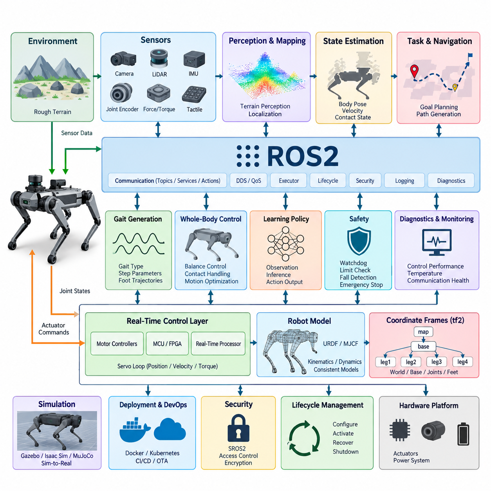
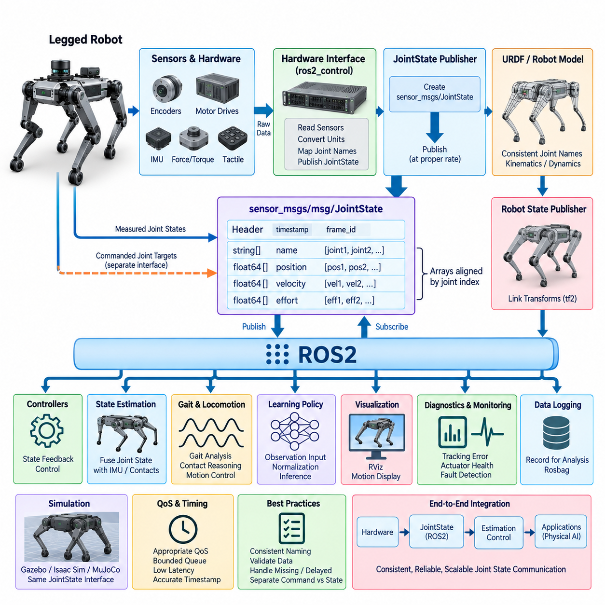
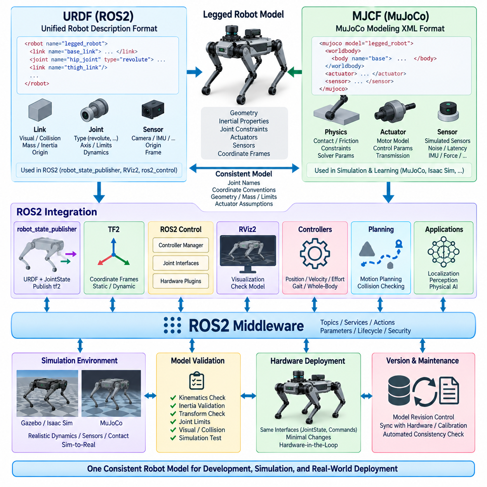
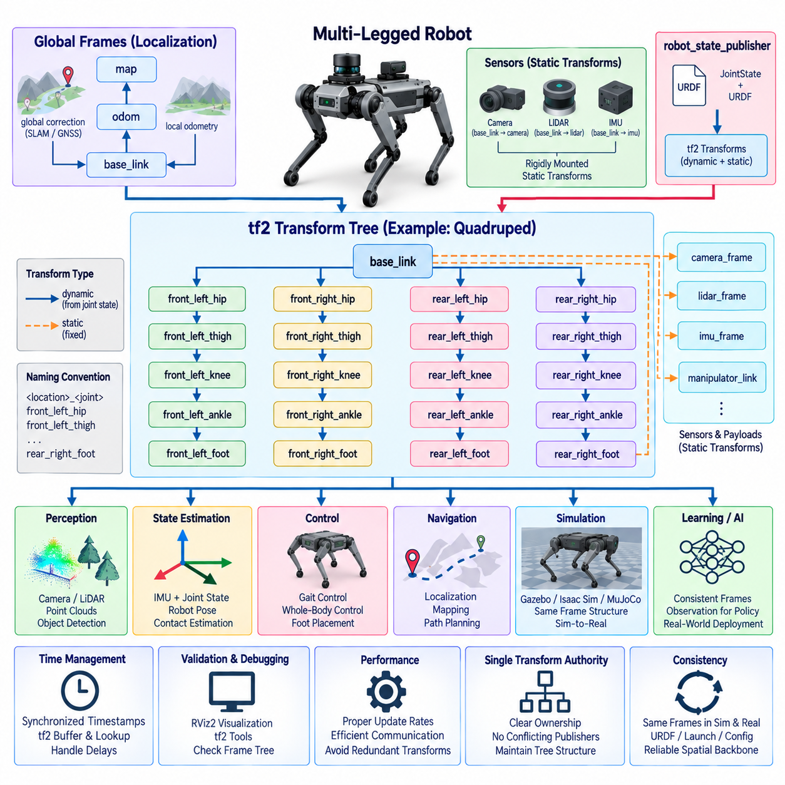
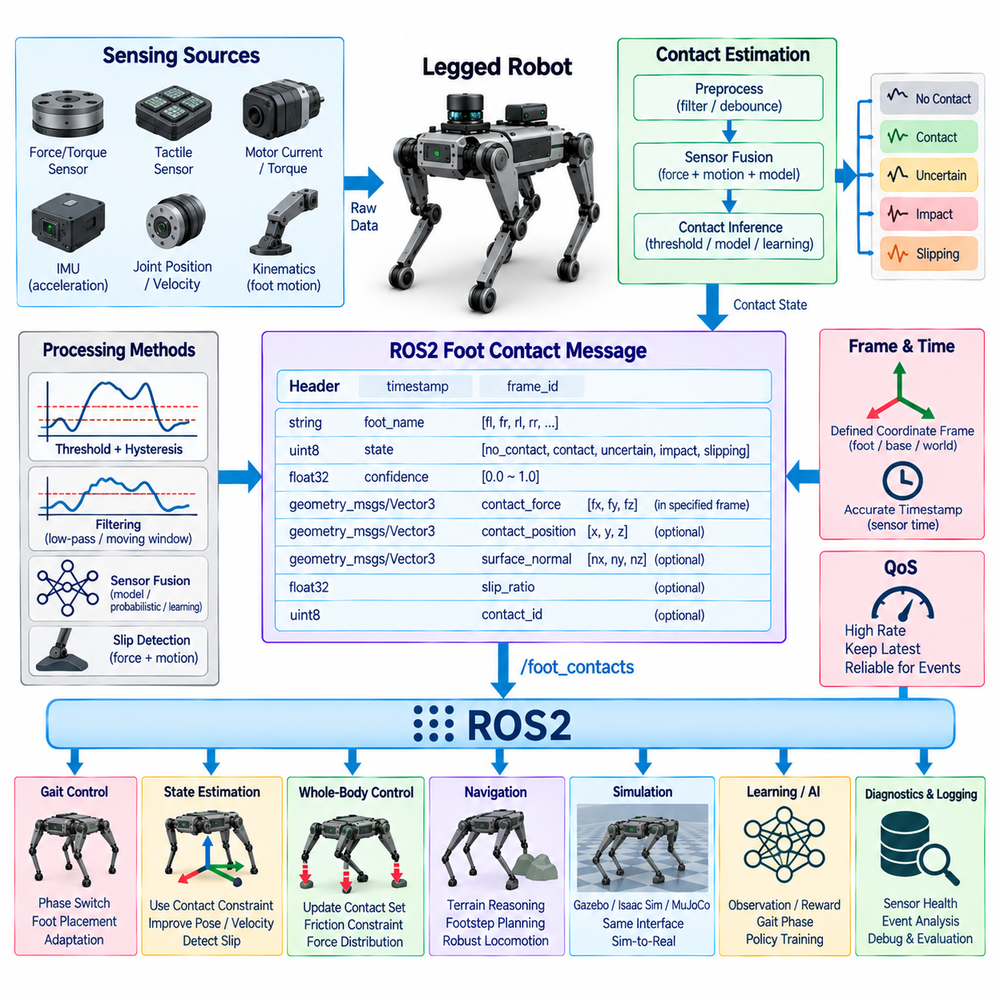
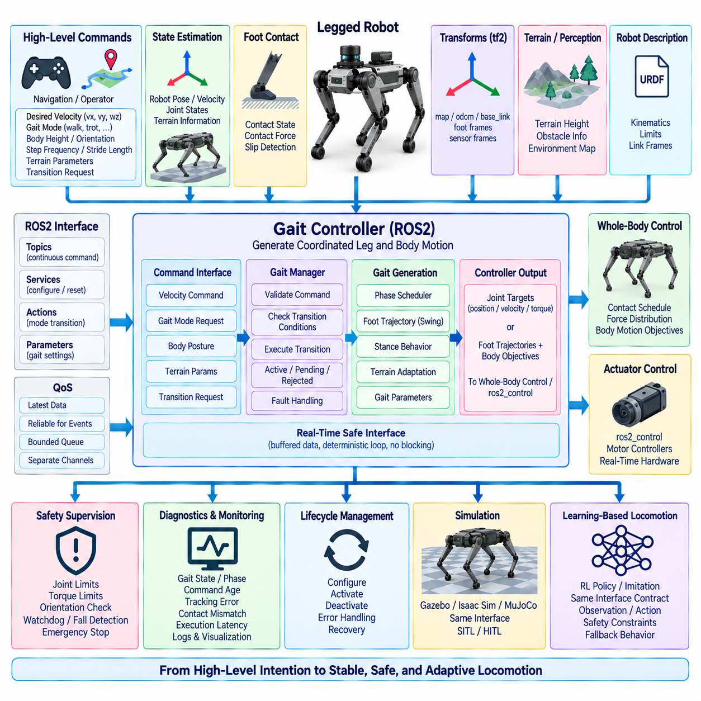
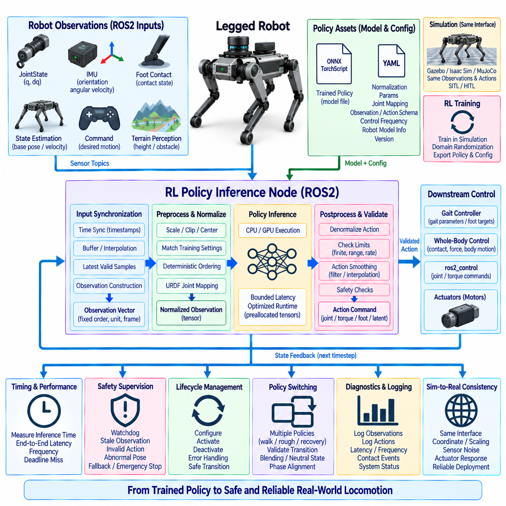
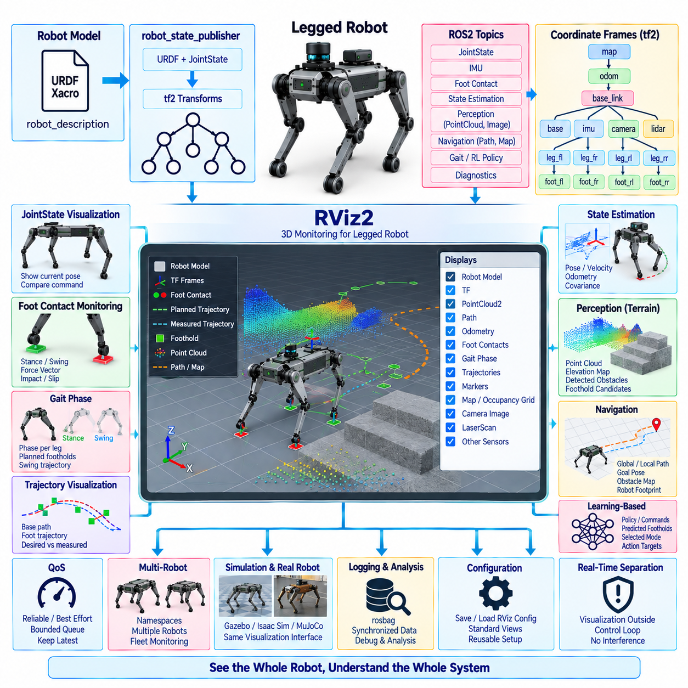
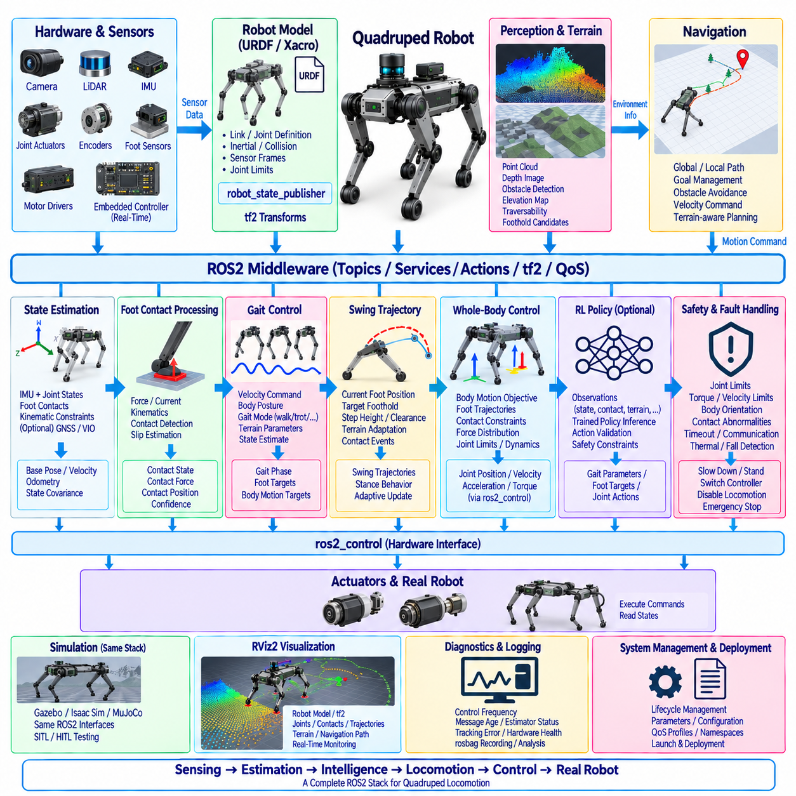
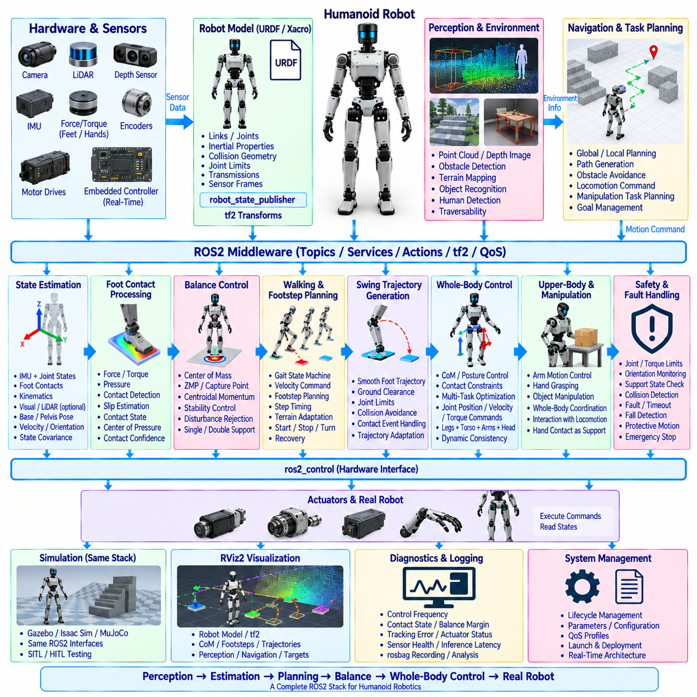

**Volume 05 Robot Middleware and ROS2**

# 11. ROS2 for Legged Robots

## 11.01 Legged Robot ROS2 SW Stack Special Requirements

{width="7.268055555555556in" height="7.268055555555556in"}

Legged robots impose software requirements that differ fundamentally from those of wheeled mobile robots because locomotion depends on continuous interaction between the body, multiple articulated legs, and an uncertain environment. A ROS2 software stack for such systems must therefore combine distributed middleware flexibility with deterministic low-level control, synchronized sensing, rapid state estimation, and explicit management of contact-dependent behaviors.

The architecture is normally divided according to control criticality rather than treating every function as an equivalent ROS2 node. Motor current, torque, position, and joint-level servo loops may execute on dedicated motor controllers, MCUs, FPGAs, or real-time processors, while ROS2 coordinates higher-level functions such as gait generation, state estimation, perception, navigation, diagnostics, and policy inference. This separation prevents middleware timing variability from directly destabilizing locomotion.

Legged locomotion requires substantially higher update rates and tighter timing consistency than ordinary navigation workloads. Joint sensing, inertial measurements, actuator feedback, foot contact states, and estimated body motion must represent nearly the same physical instant. Timestamp provenance is therefore critical. Hardware timestamps, synchronized clocks, bounded communication latency, and carefully designed sensor acquisition pipelines are required so that controllers do not calculate balance corrections from temporally inconsistent observations.

Joint-state communication forms one of the central data paths of the stack. Position, velocity, effort, temperature, actuator status, and commanded references may be exchanged between hardware interfaces and higher-level controllers. Standard ROS2 interfaces such as sensor_msgs/JointState provide interoperability, but high-frequency control often requires optimized internal representations, shared memory, or real-time-safe buffers to avoid unnecessary serialization, allocation, copying, and scheduling jitter.

The robot model is another fundamental requirement because nearly every locomotion subsystem depends on consistent kinematic and dynamic relationships. URDF can describe links, joints, inertial parameters, collision geometry, sensors, and ROS2 integration, while complementary representations such as MJCF may support physics simulation and learning environments. The software architecture should maintain controlled correspondence among simulation models, controller models, visualization models, and the physical robot configuration.

Coordinate-frame management becomes particularly demanding because a legged robot contains a moving floating base and multiple simultaneously moving contact chains. The tf2 tree typically relates world, map, odometry, base, torso, hip, knee, ankle, foot, sensor, and payload frames. Transform publication rates and timestamps must be selected carefully, because stale or inconsistent transforms can corrupt terrain perception, foot placement, localization, manipulation, and whole-body motion calculations.

Foot contact is not merely another sensor signal but a discrete physical condition that changes the robot\'s dynamic constraints. Contact estimation may combine force or torque sensing, joint information, motor current, IMU observations, tactile sensing, and model-based estimators. ROS2 interfaces should represent contact state, confidence, contact location, force information, and timing so that gait controllers, state estimators, terrain adaptation modules, and safety functions share a consistent interpretation of support conditions.

The gait subsystem requires interfaces that express more than conventional linear and angular velocity commands. A controller may need gait type, commanded body velocity, body height, stance parameters, step frequency, swing duration, foot trajectory targets, terrain adaptation parameters, and transition requests. ROS2 should provide a stable supervisory interface while keeping high-bandwidth trajectory generation and feedback control close to the deterministic execution layer.

State estimation is especially important because the robot base is generally unactuated with respect to the world and its pose must be inferred from multiple sources. IMU data, joint encoders, contact constraints, visual odometry, LiDAR odometry, GNSS, and other observations may contribute to an estimate of position, orientation, velocity, and support state. The resulting estimate must remain temporally coherent with the controller inputs, particularly during contact transitions, impacts, slipping, and rapid body motion.

ROS2 executor configuration must reflect the different criticalities of callbacks. High-priority state updates and controller interfaces should not be delayed by visualization, logging, diagnostics, or computationally expensive perception callbacks. Callback groups, dedicated executors, CPU affinity, thread priorities, PREEMPT_RT, memory locking, and pre-allocation can be combined where appropriate. The objective is bounded latency and jitter for critical paths rather than an unrealistic assumption that every ROS2 operation is hard real-time.

DDS QoS policies should similarly be selected according to the semantics of each data stream. High-rate sensor or state topics may prioritize freshness and bounded queues, whereas configuration, mode changes, safety events, and lifecycle information may require stronger reliability. Large camera and point-cloud streams must not congest communication paths carrying control-relevant information. Network segmentation, process composition, intra-process transport, and shared-memory mechanisms can reduce interference.

Learning-based locomotion introduces an additional execution path. Reinforcement-learning policies may consume joint states, estimated base motion, previous actions, contact information, terrain observations, and user commands before producing joint targets or latent locomotion commands. ROS2 provides a practical integration boundary for inference, monitoring, and policy management, but inference latency, observation ordering, normalization, action limits, and missed-deadline behavior must be explicitly controlled.

Safety mechanisms must remain effective even when high-level ROS2 nodes, AI policies, perception modules, or network connections fail. Command watchdogs, actuator limits, joint-limit protection, torque and velocity constraints, fall detection, communication timeout handling, emergency states, and controlled shutdown behaviors should be implemented across appropriate hardware and software layers. A learned policy should therefore operate inside an independently enforced safety envelope rather than becoming the sole authority over actuators.

Lifecycle management is also more complex than simply starting all nodes simultaneously. Hardware interfaces, time synchronization, sensors, state estimation, controllers, perception, locomotion policies, and navigation functions have dependencies that determine safe activation order. ROS2 lifecycle mechanisms can coordinate configuration, activation, deactivation, recovery, and shutdown, while health checks ensure that locomotion is enabled only after required sensors, transforms, estimators, and actuator interfaces become valid.

Diagnostics must capture locomotion-specific conditions in addition to conventional CPU, memory, network, and node health. Useful observations include control-loop frequency, deadline misses, joint tracking error, actuator saturation, motor temperature, contact consistency, estimator confidence, inference latency, communication jitter, battery condition, and abnormal impacts. Logging should preserve synchronized information so that failures can later be reconstructed across perception, estimation, policy, control, and hardware layers.

Simulation and hardware deployment should expose compatible ROS2 interfaces wherever practical. Gazebo, Isaac Sim, MuJoCo-based environments, or other physics platforms can emulate sensors, joints, contacts, and actuator behavior while maintaining interfaces similar to the physical robot. This enables controller, gait, perception, and learning components to progress from simulation through software-in-the-loop and hardware-in-the-loop testing toward deployment with fewer architectural changes.

Ultimately, ROS2 serves most effectively as the integration and orchestration fabric surrounding the time-critical locomotion core rather than as a replacement for every deterministic control mechanism. A robust legged-robot stack combines real-time hardware control, synchronized sensing, contact-aware estimation, gait and whole-body control, perception, learning-based policies, diagnostics, lifecycle management, and safety supervision through clearly defined interfaces. This layered approach also aligns legged-robot middleware with the broader robotics software architecture in which ROS2 occupies the middleware layer between embedded control, Physical AI, navigation, and system-level intelligence.

## 11.02 Joint State Publish / Subscribe: JointState Usage [w/Code]

{width="7.268055555555556in" height="7.268055555555556in"}

In ROS2-based legged robots, joint-state communication provides the fundamental software interface between physical actuators, sensing hardware, robot models, controllers, visualization systems, and higher-level intelligence. The standard sensor_msgs/msg/JointState message represents the instantaneous state of multiple joints using synchronized arrays of joint names, positions, velocities, and efforts, allowing heterogeneous components to exchange a common description of articulated motion.

A JointState message contains a standard header together with name, position, velocity, and effort arrays. The header timestamp identifies when the represented joint measurements were valid, while the name array associates each numerical element with a specific robot joint. Position values normally describe joint displacement, velocity expresses its rate of change, and effort represents force or torque according to the physical characteristics of the corresponding joint.

Correct correspondence between arrays is essential because a subscriber interprets position, velocity, and effort values according to the joint names at matching indices. For example, values associated with a left knee joint must remain consistently aligned across all populated arrays. Implementations should therefore derive joint ordering from controlled configuration or hardware mappings rather than relying on accidental ordering produced by drivers, containers, or discovery mechanisms.

The timestamp has particular importance in legged robotics because joint measurements are frequently fused with IMU, force, tactile, camera, and LiDAR observations. A timestamp should represent the measurement time as accurately as the hardware architecture permits rather than simply the moment at which a ROS2 publisher executes. Hardware-derived timestamps and synchronized clocks improve temporal alignment for state estimation, contact detection, body-motion reconstruction, and control.

A typical joint-state publisher obtains raw measurements from encoders, motor drives, or a ros2_control hardware interface, converts hardware units into the conventions expected by the robot model, constructs the JointState message, and publishes it on a designated topic. Subscribers can include robot_state_publisher, monitoring tools, controllers, estimators, data loggers, diagnostic nodes, learning-policy interfaces, and application-specific components that require articulated robot state.

For a legged robot, publication frequency must be selected according to the consuming function. Visualization may tolerate relatively moderate update rates, while state estimation, gait analysis, contact reasoning, or policy inference can require much fresher information. Publishing at a high rate does not by itself guarantee useful real-time behavior; end-to-end latency, scheduling jitter, timestamp accuracy, DDS transport, callback execution, and data freshness must be considered together.

ROS2 Quality of Service settings should reflect the continuous and time-sensitive nature of joint states. In many applications, receiving the newest state is more valuable than recovering every historical sample. Queue depth can therefore remain bounded to prevent old measurements from accumulating when subscribers temporarily fall behind. Reliability requirements should be selected according to network conditions, computational architecture, and whether occasional sample loss is preferable to delayed state delivery.

JointState is especially useful as a standardized observation interface, but it should not automatically become the transport mechanism for every internal high-frequency servo operation. Torque, current, or position loops operating at hundreds of hertz or kilohertz may require deterministic shared memory, real-time buffers, fieldbus communication, or direct hardware interfaces. ROS2 JointState publication can expose the resulting state externally without forcing the lowest-level control loop through ordinary middleware paths.

The distinction between measured state and commanded state should remain explicit. JointState normally communicates observations of the physical or simulated robot, whereas desired positions, velocities, torques, trajectories, or controller references belong to appropriate command interfaces. Mixing measured and commanded quantities under ambiguous topic semantics can make debugging difficult and may cause estimators, monitors, or learning components to interpret desired motion as actual physical motion.

In ros2_control architectures, hardware components expose state interfaces that controllers and broadcasters can access through the controller manager. A joint state broadcaster can publish these state interfaces as standard JointState information, creating a clean boundary between hardware-specific acquisition and ROS2-level consumers. This arrangement reduces duplicated driver logic and allows controllers, visualization tools, logging systems, and application nodes to share a consistent representation of joint measurements.

Robot modeling and joint-state communication are closely related. Joint names published by the runtime system should correspond to the joints defined in the URDF and associated control configuration. robot_state_publisher can combine joint positions with the robot\'s kinematic model to calculate link transforms and publish the resulting transform tree through tf2. Incorrect names, missing joints, invalid values, or inconsistent models can consequently propagate into visualization, perception, localization, and motion computation.

Legged robots add further complexity because many joints participate simultaneously in supporting and moving the body. A quadruped may contain hip, thigh, and knee joints for each leg, while humanoids can include legs, torso, arms, hands, neck, and additional mechanisms. Joint-state interfaces must therefore remain scalable and systematic, with naming conventions that clearly encode physical identity without creating unnecessary dependencies on one particular robot configuration.

Subscribers should also handle incomplete, delayed, or abnormal data defensively. A robust component can verify expected joint names, check array dimensions, detect NaN or invalid numerical values, monitor timestamp age, and identify joints that have stopped updating. These checks are particularly important for balance and locomotion systems because stale measurements may appear numerically plausible while no longer representing the current mechanical configuration of the robot.

JointState data can support diagnostics beyond ordinary motion reconstruction. Differences between commanded and measured position can reveal tracking error, while velocity and effort trends can expose abnormal resistance, impacts, actuator saturation, or mechanical degradation. When combined with motor temperature, current, fault codes, and contact information, joint-state monitoring becomes part of a broader health-management architecture rather than merely a visualization data source.

Learning-based locomotion also depends heavily on reliable joint observations. Reinforcement-learning policies commonly use joint positions and velocities as part of their observation vector together with IMU measurements, previous actions, contact states, and command information. A ROS2 adaptation node may transform JointState data into the ordering, normalization, scaling, and tensor representation required by an inference model while preserving timestamps and validating observation completeness.

Simulation should reproduce the same joint-state semantics expected from the physical platform. Gazebo, Isaac Sim, MuJoCo-based environments, or custom simulators can publish simulated joint measurements through interfaces compatible with the real robot. Maintaining consistent names, units, coordinate conventions, publication behavior, and controller interfaces reduces changes required when moving algorithms from simulation toward hardware and supports systematic software-in-the-loop and hardware-in-the-loop validation.

Multi-threaded execution requires additional attention because a JointState subscriber may update information that is simultaneously consumed by controllers, estimators, or inference callbacks. Shared data should be protected using appropriate synchronization or real-time-safe exchange patterns while avoiding unnecessary blocking of critical execution paths. For time-sensitive systems, preallocated buffers and latest-sample exchange mechanisms can provide predictable behavior without retaining obsolete messages.

Logging joint states is essential for post-run analysis of locomotion behavior. Recording JointState together with IMU, contact, controller commands, transforms, diagnostics, perception outputs, and policy actions enables reconstruction of events such as slipping, unstable contact transitions, unexpected impacts, or falls. Accurate timestamps make it possible to determine whether an observed failure originated from sensing, estimation, inference, communication, control, or mechanical response.

The most effective JointState architecture therefore treats the message as a standardized boundary for articulated robot state while preserving deterministic mechanisms beneath that boundary where required. Consistent naming, accurate timestamps, controlled publication rates, appropriate QoS, validated subscribers, ros2_control integration, model consistency, and synchronized logging allow JointState communication to connect hardware control with estimation, gait control, visualization, diagnostics, simulation, and Physical AI applications.

## 11.03 Robot URDF / MJCF Modeling and ROS2 Integration [w/Code]

{width="7.268055555555556in" height="7.268055555555556in"}

Robot modeling provides the structural foundation that connects mechanical design, control, simulation, visualization, and ROS2 software integration. For legged robots, the model must describe not only the geometry of links and joints but also inertial properties, joint constraints, actuator relationships, collision geometry, sensors, and coordinate frames. URDF and MJCF address overlapping parts of this problem while serving different roles within the robotics software ecosystem.

URDF, the Unified Robot Description Format, is the standard robot-description mechanism widely used throughout ROS and ROS2. A URDF model represents a robot as a tree composed of links connected by joints. Each link can contain visual geometry, collision geometry, mass, center of mass, and inertia information, while each joint specifies its parent and child links, origin, axis, motion type, limits, dynamics, and other properties required by ROS2 components.

For a legged robot, the URDF hierarchy normally begins with a base or torso link and expands through multiple kinematic chains. A quadruped may define hip, thigh, calf, and foot links for four legs, while a humanoid can additionally contain pelvis, torso, neck, arms, hands, and articulated feet. Consistent naming and hierarchy are important because controllers, JointState messages, tf2 transforms, visualization, and configuration files frequently reference these identifiers directly.

Visual and collision representations should be treated as related but distinct model components. Detailed meshes can provide realistic visualization in RViz2 or simulation, whereas simplified collision shapes can reduce computational cost for contact detection, planning, and physics calculations. Separating these representations allows the robot to retain an accurate visual appearance without forcing every collision or dynamics operation to process unnecessarily complex geometric meshes.

Accurate inertial parameters are especially important for legged locomotion because balance, contact forces, whole-body control, and dynamic simulation depend on the distribution of mass throughout the robot. Each link should therefore contain appropriate mass, center-of-mass location, and inertia tensor information. Incorrect inertia values may produce a model that looks geometrically correct but behaves unrealistically during simulation or generates inaccurate results in model-based controllers.

Joint definitions establish the robot\'s degrees of freedom and kinematic relationships. Revolute, continuous, prismatic, fixed, and other supported joint types describe how adjacent links can move relative to each other. For actuated leg joints, limits on position, velocity, and effort should correspond to physical mechanisms and actuator capabilities. Joint axes and origins must also follow consistent coordinate conventions because small modeling errors can propagate through forward and inverse kinematics.

URDF is strongly integrated with the ROS2 transform ecosystem. robot_state_publisher combines the robot description with measured joint positions to calculate the pose of individual links and publish their coordinate relationships through tf2. Fixed joints can be published as static transforms, while moving joints are continuously updated according to current joint states. This creates a common spatial reference used by perception, visualization, localization, planning, and control components.

The robot_description parameter commonly provides the URDF representation to ROS2 nodes that require knowledge of the robot model. Rather than maintaining separate descriptions inside individual components, a controlled model source helps ensure that visualization, controllers, planners, and other software use consistent geometry and joint definitions. Xacro is frequently used to generate URDF systematically, particularly for robots containing repeated structures such as four similar legs.

Xacro-based modeling improves maintainability by allowing macros, parameters, expressions, and reusable components to generate repetitive robot structures. A leg definition, for example, can be written once and instantiated for front-left, front-right, rear-left, and rear-right configurations with appropriate origins and naming prefixes. This reduces duplicated XML and makes mechanical revisions easier to propagate consistently across the complete robot model.

ros2_control adds another important integration layer between the robot description and physical actuation. Control-related descriptions can associate joints with command and state interfaces such as position, velocity, and effort. Hardware plugins then connect these abstract interfaces to motor drives, fieldbus devices, simulation systems, or custom electronics. Controllers can consequently operate through standardized interfaces while remaining relatively independent of specific actuator implementations.

MJCF, the MuJoCo Modeling XML Format, is particularly useful for physics simulation, contact-rich dynamics, and learning-based robotics. It can describe articulated bodies, joints, inertial properties, actuators, sensors, constraints, contacts, and simulation-specific parameters in a form closely aligned with MuJoCo\'s physics engine. These capabilities make MJCF valuable for legged locomotion research, reinforcement learning, dynamic behavior development, and large-scale simulation experiments.

URDF and MJCF should not necessarily be viewed as competing formats. In a practical ROS2 legged-robot workflow, URDF may serve as the principal integration representation for robot_state_publisher, tf2, RViz2, ros2_control, and ROS2 packages, while MJCF supports high-fidelity dynamics and learning environments. The engineering challenge is to maintain consistent joint names, coordinate conventions, geometry, mass properties, limits, and actuator assumptions across both representations.

Maintaining two robot descriptions independently can create model drift. A mechanical change to link dimensions, joint locations, mass distribution, or actuator limits may be applied to one representation while being forgotten in another. A robust development process therefore defines authoritative model parameters and generates or validates downstream representations from controlled sources whenever practical. Automated consistency checks can detect discrepancies before they affect simulation or hardware experiments.

Coordinate conventions deserve particular attention during conversion or synchronization between model formats. Differences in body orientation, joint-axis definitions, reference frames, quaternion conventions, and base-frame assumptions can create errors that are difficult to diagnose visually. Model validation should therefore include known joint configurations, transform comparisons, center-of-mass checks, forward-kinematics verification, and controlled motion tests rather than relying only on whether the rendered robot appears correct.

Simulation integration requires more than loading geometry into a physics engine. Actuator behavior, joint damping, friction, contact parameters, sensor noise, latency, control frequency, and ground interaction influence whether simulated locomotion resembles the physical platform. For reinforcement-learning applications, unrealistic dynamics can produce policies that perform well in simulation but fail during deployment, making model calibration and domain randomization important parts of the Sim-to-Real pipeline.

ROS2 can provide a stable software boundary between simulation and hardware by exposing equivalent joint-state, command, sensor, transform, and controller interfaces. Algorithms consuming these interfaces should require minimal architectural changes when the underlying implementation moves from Gazebo, Isaac Sim, MuJoCo, or another simulator to a physical robot. This interface consistency supports software-in-the-loop, hardware-in-the-loop, controller validation, and progressive deployment.

Model validation should occur before complex locomotion algorithms are introduced. Joint names and directions, link transforms, motion ranges, collision geometry, inertial parameters, controller interfaces, and sensor frames should be verified systematically. RViz2 can reveal structural and transform errors, while physics simulation can expose unstable inertial or contact configurations. Automated tests can further compare expected poses, transforms, joint limits, and model metadata during continuous integration.

Version management is equally important because the robot description effectively becomes an interface contract between mechanical engineering and software. Model revisions should be associated with hardware configurations, actuator versions, sensor placements, calibration data, controller parameters, and simulation assets. A software release should therefore identify the compatible robot-model revision so that deployed ROS2 nodes do not unknowingly operate against outdated mechanical assumptions.

For Physical AI and learning-based systems, robot models can also provide structured information beyond traditional visualization and control. Joint topology, limits, kinematic relationships, contact locations, and body geometry can support observation construction, policy adaptation, motion retargeting, simulation generation, and cross-robot learning. Maintaining a well-defined model layer consequently becomes increasingly important as ROS2 systems integrate classical robotics algorithms with learned policies and foundation-model-based intelligence.

An effective legged-robot modeling architecture therefore treats URDF, MJCF, ROS2 interfaces, control configuration, and physical hardware as synchronized representations of the same embodied system. URDF anchors ROS2 integration and kinematic structure, MJCF supports contact-rich simulation and learning, ros2_control connects model joints to actuation, and tf2 distributes spatial relationships. Consistent parameters, automated validation, controlled versioning, and equivalent simulation-to-hardware interfaces transform the robot model from a static description file into a central system-level contract.

## 11.04 tf2 Transform Tree Design for Multi-Legged Robot [w/Code]

{width="7.268055555555556in" height="7.268055555555556in"}

The tf2 transform tree is a fundamental spatial infrastructure for a ROS2-based multi-legged robot because nearly every perception, estimation, control, and navigation function depends on consistent relationships among coordinate frames. Unlike a simple mobile base, a legged robot contains a floating body and multiple articulated kinematic chains whose transforms continuously change as joints move and feet establish or release contact with the environment.

A well-designed transform tree begins with a clear hierarchy of global, local, body, limb, and sensor frames. Typical global frames include map and odom, while base_link represents the principal body reference. From base_link, separate kinematic branches extend through hip, thigh, knee, ankle, and foot frames. Cameras, LiDARs, IMUs, manipulators, and other payload sensors are attached to appropriate body links through their own calibrated transforms.

The map, odom, and base_link relationship should follow clearly defined localization semantics. The map frame normally represents a globally consistent reference used for navigation, while odom provides a locally continuous reference suitable for short-term motion estimation. The transform from odom to base_link represents locally estimated robot motion, whereas map to odom can compensate for accumulated drift using SLAM, GNSS, visual localization, or other global corrections.

For legged robots, base_link should represent a stable and explicitly documented body reference rather than being selected simply for visualization convenience. Depending on the platform, additional frames such as base, pelvis, torso, base_footprint, or base_stabilized may be introduced. Their meanings must remain unambiguous because controllers, state estimators, planners, perception pipelines, and learning policies may interpret body position and orientation differently if frame semantics are inconsistent.

Each leg forms an articulated transform chain derived from the robot model and current joint configuration. A quadruped can contain front-left, front-right, rear-left, and rear-right branches, with each branch progressing from the body through hip and knee joints toward a foot frame. Humanoid robots extend the same concept to two articulated legs while also incorporating torso, head, arms, hands, and potentially additional end-effector frames.

Consistent frame naming becomes increasingly important as the number of links grows. Names should identify both the physical component and its location without relying on ambiguous abbreviations. For example, systematic prefixes or suffixes can distinguish left and right or front and rear limbs. The naming scheme should correspond with URDF joint and link names, controller configurations, sensor definitions, logging tools, and simulation models to prevent translation layers from proliferating.

robot_state_publisher provides the primary bridge between the robot model and the dynamic tf2 tree. It receives joint positions, interprets the kinematic relationships defined by URDF, calculates link poses, and publishes the corresponding transforms. Fixed relationships between rigidly mounted components can be distributed as static transforms, while articulated relationships change continuously according to the measured JointState information supplied by the physical robot or simulator.

Static and dynamic transforms should be separated according to physical meaning. A camera rigidly mounted to the torso normally has a static transform determined through mechanical design and calibration, whereas a foot connected through several actuated joints has a dynamic transform. Publishing a physically changing relationship as static can produce incorrect geometry, while unnecessarily broadcasting constant transforms dynamically increases communication and computation without adding useful information.

Time consistency is one of the most critical requirements in a legged-robot tf2 architecture. A transform represents a spatial relationship at a particular instant, and high-speed body or limb motion can make even relatively small timestamp errors significant. Joint states, IMU measurements, perception data, and transforms should therefore use synchronized time references so that downstream algorithms can reconstruct the robot configuration corresponding to the actual sensor measurement time.

tf2 maintains a time-buffered history of transforms, allowing software to request spatial relationships corresponding to specific timestamps. This is particularly valuable when camera images, LiDAR scans, joint measurements, and state estimates arrive with different communication and processing delays. Instead of applying only the newest transform to older sensor observations, perception software can query the transform associated with the observation timestamp and thereby reduce motion-induced spatial errors.

Transform availability must also be treated as a runtime dependency. A perception or control node should not assume that every required frame is immediately available after startup. Hardware initialization, JointState publication, localization, and lifecycle transitions may occur at different times. Nodes should therefore handle missing transforms, lookup timeouts, delayed initialization, and temporary frame discontinuities without blocking critical execution paths indefinitely or generating uncontrolled commands.

Foot frames have special significance because contact with the environment creates temporary physical constraints. During stance, a foot may be approximately stationary relative to the ground while the body moves around it; during swing, that same foot moves rapidly through space. State estimators and locomotion controllers can exploit these relationships, but tf2 itself should represent spatial transforms rather than being overloaded with assumptions about whether a foot is currently supporting the robot.

Contact state should therefore be communicated through dedicated messages or state interfaces and interpreted together with foot transforms. A controller can combine a foot frame pose with force sensing or contact estimation to determine the active support geometry. This separation keeps coordinate representation independent from contact semantics and allows different contact-estimation methods to evolve without changing the fundamental transform hierarchy.

Sensor frames must accurately reflect physical mounting and calibration. An IMU frame should describe the orientation and position of the inertial sensor relative to the robot body, while camera and LiDAR frames must follow the coordinate conventions expected by their ROS2 interfaces. Calibration errors in these transforms can appear downstream as localization drift, distorted point clouds, incorrect terrain geometry, or systematic errors in foot-placement planning.

High-frequency transform publication requires careful performance design. Publishing every transform at unnecessarily high rates can increase CPU utilization, serialization overhead, and DDS traffic, especially for humanoids with many joints. Update rates should therefore correspond to actual motion dynamics and consumer requirements. Intra-process communication, composition, executor configuration, and efficient JointState handling can further reduce latency and computational overhead in dense transform trees.

The tf2 tree must remain a tree rather than becoming a collection of competing transform authorities. Multiple nodes should not independently publish different transforms for the same parent-child relationship because conflicting authorities can produce unstable or unpredictable spatial results. Responsibility for each transform should be assigned explicitly among robot_state_publisher, localization systems, state estimators, static transform publishers, sensor drivers, and other components.

Simulation and physical hardware should preserve the same fundamental frame hierarchy wherever possible. Gazebo, Isaac Sim, MuJoCo-based environments, and hardware interfaces should expose compatible base, joint, foot, and sensor frames. Maintaining this correspondence enables perception, control, visualization, navigation, and learning software to move between simulation and the real robot without requiring different assumptions about spatial structure.

Transform validation should be integrated into development and testing. RViz2 can visually reveal reversed axes, misplaced sensors, incorrect joint origins, or unexpected frame motion, while tf2 diagnostic tools can identify missing frames, excessive delays, or disconnected branches. Automated tests can verify expected parent-child relationships, known transforms, frame naming conventions, publication timing, and consistency with the corresponding URDF model.

For learning-based locomotion and Physical AI, frame consistency becomes even more important because observations may be transformed among world, body, sensor, and local terrain coordinates before entering an inference model. Policies trained with one frame convention can behave incorrectly if deployed with another. Explicit frame definitions and controlled transformation pipelines therefore become part of the interface contract between ROS2 perception, classical control, simulation, and learned intelligence.

A robust multi-legged robot tf2 architecture ultimately provides a single coherent spatial representation shared across the entire software stack. Global localization establishes map and odom relationships, state estimation determines body motion, URDF and JointState define articulated link transforms, calibrated static transforms locate sensors, and foot frames describe limb geometry. Clear ownership, synchronized timestamps, systematic naming, validation, and simulation-to-hardware consistency make this transform tree a dependable spatial backbone for locomotion, perception, navigation, whole-body control, and Physical AI.

## 11.05 Foot Contact Detection Message Design [w/Code]

{width="7.268055555555556in" height="7.268055555555556in"}

Foot contact detection is a fundamental capability in legged robotics because locomotion dynamics change whenever a foot establishes, maintains, slips, or releases contact with the environment. In a ROS2 architecture, contact information should be represented through a clear interface that separates raw sensing from estimated contact state, allowing gait control, state estimation, whole-body control, diagnostics, and learning-based policies to consume consistent contact information.

Contact detection can originate from several sensing mechanisms depending on the robot hardware. Foot force sensors, six-axis force/torque sensors, tactile arrays, joint torque measurements, motor current, actuator load estimates, and kinematic observations can all provide evidence of ground interaction. IMU measurements may provide additional information by detecting impacts or unexpected body acceleration, while model-based estimators can infer contact even when dedicated foot sensors are unavailable.

Raw sensor measurements should generally remain distinct from the interpreted contact state. A force sensor may publish measured forces continuously, while a contact-estimation node determines whether those measurements correspond to stable support, uncertain contact, impact, slipping, or no contact. This separation allows sensor drivers to remain hardware-oriented while contact algorithms evolve independently according to robot morphology, terrain, controller design, and operational requirements.

A useful ROS2 foot-contact message should identify the corresponding foot and record when the contact observation was valid. The message may include a standard header with timestamp and frame identifier together with contact status, confidence, contact force, contact position, surface normal, and other quantities required by downstream components. Not every robot needs every field, so the interface should distinguish essential contact semantics from optional detailed measurements.

Timestamp accuracy is particularly important because contact transitions occur rapidly and directly influence locomotion control. A message generated significantly after the physical event may cause the controller or estimator to operate using an incorrect support configuration. Whenever possible, the timestamp should represent the original sensor measurement or detected contact event rather than simply the time at which a ROS2 callback publishes the resulting message.

The frame identifier defines the coordinate system in which vector quantities such as force, contact position, or surface normal are expressed. A foot frame can be convenient for local contact measurements, while base or world coordinates may be useful for whole-body dynamics and terrain reasoning. The selected convention must be explicitly documented, and tf2 should be used when downstream software requires the same information in another coordinate frame.

Binary contact states are simple but may be insufficient for real-world locomotion. Instead of representing contact only as true or false, the system can maintain additional confidence or contact-quality information. This becomes valuable around touchdown and liftoff, during low-force contact, on compliant surfaces, or when sensor measurements are noisy. Controllers can then distinguish strong support evidence from uncertain transitions rather than reacting to every threshold crossing identically.

Threshold-based detection provides a straightforward implementation when direct force measurements are available. Contact can be declared when measured normal force exceeds a configured threshold and released when it falls below another threshold. Using separate activation and release thresholds introduces hysteresis, which reduces rapid oscillation between contact and non-contact states when measurements fluctuate around a single decision boundary.

Filtering may also be necessary because foot impacts and actuator vibration can generate short-duration measurement spikes. Low-pass filters, moving windows, persistence conditions, or debounce logic can prevent transient noise from being interpreted as meaningful contact transitions. Filtering must nevertheless remain bounded because excessive smoothing introduces delay, and delayed touchdown or liftoff detection can degrade gait timing, state estimation, and balance control.

More advanced systems can fuse several observations to improve robustness. Force measurements can be combined with joint position, joint velocity, motor torque, foot velocity, IMU acceleration, and expected gait phase. A model-based or probabilistic estimator can then calculate contact likelihood rather than relying on one sensor threshold. Such approaches are useful when operating on irregular terrain where impacts, partial contacts, slipping, and compliance make simple detection assumptions unreliable.

Contact state is closely coupled with the gait controller. During planned stance phases, the controller expects specific feet to support the body, while swing feet should normally remain free of significant external force until touchdown. Comparing expected and measured contact can reveal early touchdown, late touchdown, unexpected collision, or loss of support. These events can trigger gait adaptation, trajectory modification, recovery behavior, or a transition to a safer operating mode.

State estimation also depends heavily on reliable contact information. When a foot is confidently stationary on the ground, an estimator can use that contact as a kinematic constraint to improve estimation of body velocity and pose. If the foot slips while the estimator continues treating it as fixed, significant state-estimation errors can accumulate. Contact messages should therefore make uncertainty and potentially abnormal conditions available instead of presenting unreliable measurements as absolute truth.

Whole-body control uses contact information to determine which environmental constraints and forces should be included in its optimization problem. The active contact set changes as the robot transitions among gait phases, requiring the controller to update support constraints, allowable contact forces, friction conditions, and body objectives. Accurate contact timing helps avoid commanding forces through a foot that is no longer supporting the robot or prematurely loading a foot that has not yet established stable contact.

Slip detection can extend the contact message beyond simple support recognition. A foot may remain loaded while moving relative to the ground, meaning that contact exists but is not stable. Comparing estimated foot motion, tangential force, normal force, friction assumptions, and body movement can identify possible slip. A message may therefore distinguish contact presence from contact quality so that locomotion software can react appropriately to unstable terrain interaction.

For quadrupeds and humanoids, contact information should scale naturally across multiple limbs. Each foot can publish an independent contact state, or an aggregated message can represent all feet using consistently ordered structures. Independent messages simplify modular processing, whereas aggregation can provide a synchronized snapshot of the complete support configuration. The selected approach should preserve unambiguous foot identity and consistent timestamps.

ROS2 Quality of Service settings should reflect the fact that contact state is both time-sensitive and operationally important. High-rate contact observations normally favor fresh data and bounded queues because obsolete contact states can be more harmful than occasional sample loss. Important discrete transitions or safety-related events may require stronger delivery guarantees or separate event channels so that critical state changes are not hidden within high-frequency telemetry.

Diagnostics should monitor both contact-estimation quality and the underlying sensing chain. Useful indicators include sensor availability, message age, contact transition frequency, force saturation, invalid numerical values, disagreement between expected and measured contacts, persistent slipping, and inconsistent states between redundant sensors. These diagnostics can help distinguish mechanical problems, sensor failures, calibration errors, communication delays, and algorithmic estimation failures.

Simulation should expose contact information using semantics compatible with the physical robot. Gazebo, Isaac Sim, MuJoCo, or other physics environments can provide contact forces and collision information that are converted into the same ROS2 contact representation used by hardware. Maintaining this interface consistency allows gait controllers, estimators, learning policies, diagnostics, and logging components to operate across simulation and real deployment with minimal software changes.

Learning-based locomotion frequently uses contact states as observations or training signals. Reinforcement-learning policies may receive current or recent contact information together with joint states, IMU measurements, commands, and previous actions. Contact events can also contribute to reward functions, gait-phase estimation, terrain adaptation, or policy evaluation. The ROS2 integration layer should preserve ordering, timing, confidence, and frame semantics when converting contact information into model inputs.

Logging contact information together with JointState, IMU, actuator commands, tf2 transforms, controller states, and policy outputs enables detailed reconstruction of locomotion failures. Engineers can determine whether instability began with an unexpected impact, missed touchdown, slipping foot, delayed message, incorrect state estimate, or inappropriate controller response. Accurate synchronized logs therefore make the contact interface valuable for both runtime operation and post-event analysis.

A robust foot-contact message design ultimately treats contact as a time-dependent physical state rather than a simple Boolean sensor output. Clear foot identity, accurate timestamps, defined coordinate frames, confidence information, force and contact metadata, filtering, diagnostics, and consistent simulation interfaces allow ROS2 components to share a reliable representation of robot-environment interaction. This interface becomes a critical connection among sensing, state estimation, gait control, whole-body control, safety supervision, simulation, and Physical AI.

## 11.06 Gait Controller ROS2 Interface Design [w/Code]

{width="7.268055555555556in" height="7.268055555555556in"}

A gait controller is the central locomotion component that converts high-level motion intentions into coordinated leg and body behavior. In a ROS2-based legged robot, its interface must connect navigation, operator commands, state estimation, contact detection, trajectory generation, whole-body control, and actuator control without placing non-deterministic middleware operations directly inside the most time-critical feedback loops.

The interface should separate supervisory commands from high-frequency control signals. ROS2 topics, services, and actions can communicate desired velocity, gait mode, body posture, locomotion state, and transition requests, while deterministic control processes generate joint or actuator references at substantially higher rates. This separation preserves ROS2 flexibility while protecting locomotion stability from communication latency and executor jitter.

A basic command interface can extend the conventional linear and angular velocity representation used by mobile robots. Desired forward, lateral, and yaw velocities provide intuitive motion commands, but legged locomotion may additionally require body height, roll and pitch targets, stance width, step frequency, stride length, and terrain-related parameters. These values should be represented with explicit units, coordinate frames, limits, and timestamp semantics.

Gait selection requires a clearly defined mode interface. A quadruped may support stand, walk, trot, pace, bound, crawl, recovery, and specialized terrain modes, while humanoid systems may expose standing, walking, stepping, turning, and recovery behaviors. The interface should distinguish a requested gait from the currently active gait because transitions may require synchronization with contact phases before the requested mode can safely become active.

Gait transitions should therefore be treated as controlled state changes rather than instantaneous parameter substitutions. Switching from standing to trotting, changing speed ranges, or entering a recovery behavior can require intermediate phases that preserve support stability. A gait manager can validate the request, determine whether transition conditions are satisfied, execute the transition sequence, and report active, pending, rejected, or faulted states to supervisory ROS2 components.

The gait controller depends strongly on state-estimation inputs. Estimated body position, orientation, linear and angular velocity, joint states, and potentially terrain-relative information provide the feedback required to generate stable locomotion. Input messages should contain accurate timestamps and documented coordinate frames so that the controller can distinguish actual robot motion from stale or spatially inconsistent measurements before calculating new locomotion commands.

Foot-contact information provides another essential interface. The controller must know which feet are expected to be in stance and which contacts are actually detected. Comparing planned and measured contact states allows detection of early touchdown, delayed touchdown, unexpected impact, loss of support, or slipping. These events can modify phase timing, swing trajectories, body stabilization, or the complete gait mode when terrain conditions differ from the original plan.

Internally, gait generation commonly maintains a phase representation for each leg. The phase determines whether a leg is in stance, swing, transition, or another locomotion-specific state and provides timing information for trajectory generation. ROS2 diagnostic or monitoring interfaces may expose these phases, but the high-frequency phase update itself should normally remain inside the real-time locomotion process rather than depend on network message delivery.

Swing-foot trajectory generation converts gait timing and desired motion into spatial foot trajectories. Inputs can include current foot pose, desired foothold, terrain height, obstacle information, swing duration, and clearance requirements. Outputs typically define position, velocity, and possibly acceleration references over time. The trajectory should support adaptation after unexpected contact while maintaining smoothness and respecting kinematic and actuator constraints.

Stance-leg behavior has different requirements because supporting feet interact directly with the environment. The gait controller may provide desired contact locations, support forces, body motion objectives, or constraints to a whole-body controller. For model predictive control or optimization-based locomotion, the interface may additionally communicate contact schedules, friction assumptions, predicted body trajectories, and force distributions over a finite planning horizon.

The boundary between gait control and whole-body control should remain explicit. The gait layer determines locomotion structure, phase timing, desired footholds, and body objectives, while the whole-body controller converts those objectives into dynamically consistent joint accelerations, torques, or other actuator-level references. Maintaining this separation allows different gait planners, optimization methods, and actuator controllers to evolve without tightly coupling every subsystem.

Command validity must be continuously supervised. Velocity requests can become stale when an operator connection, navigation node, or network link fails. The gait controller should monitor command timestamps and apply defined timeout behavior such as reducing velocity, transitioning to stand, or requesting a safe stop. Invalid numerical values, commands outside configured limits, and unsupported gait requests should be rejected or constrained before reaching the locomotion core.

ROS2 Quality of Service settings should reflect the semantics of each interface. Continuous velocity commands and locomotion states generally favor recent data and bounded queues, while discrete mode transitions, configuration changes, or safety-related requests may require reliable delivery. High-rate telemetry should not congest channels carrying important transition or safety information, particularly when perception data and locomotion traffic share the same computing network.

Real-time execution requires careful separation between ROS2 callbacks and deterministic controller updates. Subscriber callbacks can place the latest validated commands or state estimates into real-time-safe buffers, while the locomotion loop reads those buffers without blocking. Dynamic memory allocation, long mutex waits, logging operations, and expensive serialization should be avoided inside critical loops. CPU affinity and real-time scheduling can further improve timing predictability.

Controller output interfaces depend on the architecture beneath the gait layer. Some systems produce joint position or velocity targets, while torque-controlled robots may generate desired torques through whole-body control. Other architectures pass foot trajectories and body objectives to an intermediate controller. ros2_control can provide standardized command and state interfaces, but the final servo loop may remain on dedicated real-time processors, motor controllers, or fieldbus hardware.

Safety supervision should remain independent of the gait algorithm itself. Joint limits, torque limits, velocity constraints, body orientation thresholds, communication watchdogs, actuator faults, and fall detection should be able to override locomotion commands when necessary. A gait controller may request aggressive motion, but independently enforced safety mechanisms should determine whether the resulting commands remain inside the robot\'s permitted operating envelope.

Lifecycle management provides a structured method for controlling gait-controller availability. The controller should not enter an active locomotion state until required joint interfaces, state estimation, contact sensing, transforms, and actuator systems are valid. Configuration, activation, deactivation, error processing, and recovery can be coordinated through ROS2 lifecycle concepts so that locomotion does not begin from an incomplete or inconsistent system state.

Diagnostics should expose enough information to understand locomotion behavior without interfering with the control loop. Useful data includes requested and active gait, phase state, command age, controller frequency, execution latency, contact mismatches, foothold adjustments, saturation conditions, tracking errors, and transition status. Timestamped diagnostics become especially valuable when correlated with JointState, IMU, contact, tf2, actuator, and perception logs.

Simulation should expose the same supervisory gait interface used by physical hardware. Gazebo, Isaac Sim, MuJoCo, or other environments can receive identical gait and velocity commands while providing compatible state, contact, and joint interfaces. This consistency enables software-in-the-loop and hardware-in-the-loop validation and allows locomotion algorithms to move toward physical deployment without redesigning the ROS2-facing control architecture.

Learning-based locomotion can be integrated behind the same interface contract. A reinforcement-learning policy may replace or augment conventional gait generation by producing joint targets, latent actions, foot-placement adjustments, or locomotion parameters. ROS2 can manage policy selection, commands, monitoring, and diagnostics while deterministic adapters validate observation timing, normalize inputs, constrain actions, and enforce fallback behavior when inference deadlines are missed.

A robust ROS2 gait-controller interface therefore acts as a controlled boundary between high-level locomotion intent and time-critical physical execution. Clear command semantics, gait-state management, synchronized estimation and contact inputs, real-time-safe data exchange, explicit whole-body-control boundaries, safety supervision, lifecycle management, diagnostics, and simulation compatibility allow the same architecture to support classical gait algorithms, optimization-based control, and learning-based Physical AI.

## 11.07 RL Policy Inference Node Integration [w/Code]

{width="7.268055555555556in" height="7.268055555555556in"}

An RL policy inference node provides the runtime bridge between a trained reinforcement-learning policy and the ROS2 locomotion architecture of a legged robot. Its primary responsibility is to acquire synchronized robot observations, transform them into the representation expected by the learned model, execute inference within a bounded time budget, validate the resulting actions, and deliver safe commands to downstream gait, whole-body, or actuator-control components.

The inference node should be positioned between ROS2-facing perception and state interfaces and the deterministic locomotion execution layer. Inputs may arrive through JointState, IMU, foot-contact, state-estimation, command, and terrain-perception topics, while outputs may represent joint positions, joint velocities, torques, desired foot locations, gait parameters, or latent actions. The exact boundary depends on how much locomotion intelligence is embedded inside the learned policy.

Observation construction is one of the most important integration responsibilities. A policy may require joint positions and velocities, base orientation, angular velocity, projected gravity, commanded motion, previous actions, contact states, terrain features, or proprioceptive history. ROS2 messages must therefore be converted into a fixed observation vector whose ordering, dimensions, units, coordinate frames, normalization rules, and temporal interpretation exactly match those used during policy training.

Observation ordering must remain deterministic because neural networks interpret each input dimension according to its training-time meaning. A change in URDF joint ordering, JointState publication order, sensor configuration, or robot version must not silently rearrange the policy input. The inference node should use explicit mappings between ROS2 joint names and policy indices, validate expected inputs during initialization, and reject incompatible configurations before locomotion becomes active.

Normalization parameters are part of the deployed policy interface rather than optional preprocessing details. Joint positions, velocities, commands, terrain observations, and other quantities may have been scaled, clipped, centered, or transformed during training. The runtime node must reproduce these operations consistently. Means, standard deviations, scaling factors, clipping ranges, and observation conventions should therefore be versioned together with the trained model and deployment configuration.

Temporal consistency becomes especially important when observations originate from multiple ROS2 sources. Joint states, IMU data, contact estimates, commands, and terrain information may arrive at different frequencies and with different communication delays. The inference node should construct observations representing a sufficiently coherent physical instant by using timestamps, synchronized buffers, latest-valid-sample policies, or explicit interpolation rather than simply combining whichever messages happen to be available when inference begins.

The policy execution rate should be distinguished from lower-level servo frequency. A learned locomotion policy may execute at tens or hundreds of hertz, while motor current, torque, or position loops can operate at much higher frequencies on real-time controllers. Between policy updates, downstream controllers can hold, interpolate, filter, or track the most recent valid action. This layered design prevents neural-network inference timing from becoming the direct timing source for every actuator servo operation.

Inference latency must be measured as an end-to-end quantity rather than only as neural-network execution time. Observation acquisition, preprocessing, tensor conversion, CPU-to-GPU transfer, model execution, output transfer, post-processing, and command publication all contribute to the effective delay. Runtime diagnostics should therefore record policy execution time, total pipeline latency, deadline misses, observation age, action age, and inference frequency under realistic concurrent system workloads.

GPU acceleration can significantly improve inference performance, but data movement and scheduling overhead must be considered. Repeated memory allocation and unnecessary host-device copies can consume a substantial fraction of the available time budget. Preallocated tensors, persistent buffers, pinned memory where appropriate, optimized inference runtimes, and careful device placement can reduce overhead. The optimal implementation depends on policy size, observation dimensions, update rate, and available edge-computing hardware.

The inference callback should not directly perform uncontrolled operations inside a critical real-time path. ROS2 callbacks can update real-time-safe observation buffers, while a dedicated inference loop consumes validated snapshots according to a defined schedule. The resulting action can then be placed into another bounded buffer for downstream control. This structure isolates middleware scheduling variability from the controller while avoiding long mutex waits, dynamic allocation, and blocking operations in critical paths.

Policy outputs require validation before they are applied to the robot. Neural-network outputs may be normalized actions that must first be scaled into physical joint or locomotion commands. The integration layer should verify finite numerical values, dimensional consistency, configured ranges, rate limits, joint limits, torque constraints, and other safety conditions. Invalid or extreme outputs should never be forwarded directly to actuators merely because they originated from a successfully executed model.

Action smoothing may be necessary when successive policy outputs contain discontinuities or high-frequency variation that the physical mechanism cannot safely follow. Rate limiting, interpolation, low-pass filtering, or downstream trajectory tracking can provide smoother actuator references. However, excessive filtering can change the behavior learned during training, so the deployment pipeline should preserve the policy\'s intended dynamics while enforcing only the physical constraints required by the real platform.

Previous actions are frequently included in reinforcement-learning observation vectors. The inference node must clearly define whether this field represents the raw policy output, the clipped action, the filtered command, or the action actually accepted by the downstream controller. Using a different interpretation from training can introduce an observation mismatch. The selected action representation should therefore be documented and maintained consistently across simulation, training, evaluation, and hardware deployment.

Policy lifecycle management should coordinate model loading and locomotion activation. During configuration, the node can load the model, normalization parameters, joint mappings, device configuration, and metadata before validating compatibility with the robot. Activation should occur only after required state, contact, command, and transform inputs become available. Deactivation should stop action generation safely, while error handling should transition the system toward a predefined fallback rather than leaving the last action active indefinitely.

Model versioning is critical because the neural-network file alone does not completely define a deployable policy. A policy package should identify its observation schema, action schema, joint ordering, normalization parameters, control frequency, expected robot model, training environment, software dependencies, and relevant safety limits. Runtime software can compare this metadata with the current robot configuration and prevent deployment when incompatible model and hardware versions are detected.

Safety supervision should remain independent of the learned policy. Watchdogs can detect missed inference deadlines, stale observations, communication loss, invalid actions, abnormal body orientation, actuator faults, or excessive tracking error. When these conditions occur, the system may hold a safe command, transition to a conventional controller, enter a standing mode, reduce actuator authority, or initiate an emergency response according to the robot\'s safety architecture.

Policy switching requires controlled state management when multiple learned behaviors are available. A robot may contain policies for walking, rough terrain, recovery, stairs, or specialized maneuvers. Switching models instantaneously can create discontinuous actions because the policies may assume different internal states or observation histories. A policy manager should therefore validate transition conditions and coordinate blending, neutral states, gait-phase alignment, or other transition mechanisms where required.

Simulation and hardware should expose the same policy-facing interface whenever practical. MuJoCo, Isaac Sim, Gazebo, or another environment can provide JointState, IMU, contact, command, and terrain observations using the same semantics expected by the hardware inference node. The policy can consequently progress through simulation, software-in-the-loop, hardware-in-the-loop, and physical deployment without changing its fundamental ROS2 observation and action contracts.

Sim-to-Real deployment requires more than preserving message types. Coordinate conventions, sensor scaling, actuator response, control frequency, latency, contact semantics, observation noise, and action interpretation must correspond sufficiently to training conditions. Domain randomization can improve robustness to modeling uncertainty, but the runtime integration layer must still prevent avoidable interface differences from becoming an additional source of policy failure.

Diagnostics and synchronized logging are essential for evaluating learned locomotion. Observation vectors, policy actions, raw ROS2 inputs, processed states, inference latency, controller outputs, contact events, and safety interventions should be recorded with compatible timestamps. These records allow engineers to determine whether unexpected behavior originated from the learned policy itself, an observation mismatch, stale data, inference delay, action processing, downstream control, or physical interaction.

A robust RL policy inference node therefore functions as a controlled adaptation layer rather than simply a wrapper around a neural-network model. Deterministic observation construction, synchronized inputs, faithful normalization, bounded inference latency, explicit action semantics, real-time-safe buffering, output validation, lifecycle control, model versioning, independent safety supervision, and simulation-to-hardware consistency allow reinforcement-learning policies to become dependable components of a ROS2-based Physical AI locomotion stack.

## 11.08 RViz2-Based Legged Robot Monitoring [w/Code]

{width="7.268055555555556in" height="7.268055555555556in"}

RViz2 provides a graphical monitoring environment for understanding the spatial state and behavior of a ROS2-based legged robot. Unlike a conventional dashboard that primarily displays numerical values, RViz2 combines the robot model, coordinate frames, sensor observations, trajectories, contacts, and navigation information in a common three-dimensional scene. This makes it especially useful for diagnosing complex relationships among locomotion, perception, estimation, and control.

The visualization normally begins with the robot model defined by URDF or Xacro. The robot_description parameter is consumed by robot_state_publisher, which combines the kinematic model with incoming JointState data and publishes the corresponding tf2 transforms. RViz2 can then reconstruct the current configuration of the complete robot, allowing engineers to visually inspect joint motion, link orientation, limb geometry, and the relationship between the body and supporting legs.

A correct fixed frame is essential for meaningful visualization. Depending on the monitoring objective, RViz2 may use map, odom, or base_link as its fixed reference. The map frame is useful for global navigation and environment inspection, odom supports locally continuous motion analysis, and base_link emphasizes robot-relative behavior. Incorrect frame selection can make valid data appear unstable, disconnected, or incorrectly positioned even when the underlying controller is functioning properly.

The tf2 transform tree provides the spatial backbone of the monitoring system. Frames for the base, joints, feet, IMU, cameras, LiDARs, and other sensors can be inspected together to verify their geometric relationships. RViz2 helps reveal missing transforms, incorrect parent-child relationships, reversed axes, calibration errors, or unexpected frame motion. These problems are particularly important in legged robots because small spatial inconsistencies can propagate into contact estimation and locomotion control.

JointState visualization provides an immediate view of the commanded and measured posture of the robot. When joint positions are published correctly, the displayed URDF model follows the physical or simulated mechanism. Comparing this visualization with commanded configurations can expose joint-name mismatches, incorrect sign conventions, offset errors, or stale data. Joint velocity and effort values can additionally be monitored through complementary diagnostic tools when numerical inspection is required.

Foot-contact monitoring can be represented using RViz2 markers placed at each foot frame or estimated contact position. Marker color, shape, size, or text can distinguish stance, swing, uncertain contact, impact, and slipping states. Contact forces may be visualized as vectors whose direction and magnitude represent the estimated ground reaction force. This spatial representation makes discrepancies between planned contact schedules and measured physical interaction much easier to recognize.

Gait phase information can also be integrated into the visualization. Each leg may expose its current stance or swing phase, while markers can indicate planned footholds, current foot positions, and future swing trajectories. For quadrupeds, the visualization can reveal diagonal support patterns during trotting or sequential contact patterns during walking. For humanoids, it can help examine single-support, double-support, foot-placement, and step-transition behavior.

Trajectory visualization is valuable for both body motion and individual limbs. Planned base trajectories can be displayed using Path messages, while swing-foot trajectories and desired footholds can be represented through Marker or MarkerArray messages. Comparing desired and measured trajectories provides an intuitive indication of tracking quality. Large spatial deviations can point toward state-estimation errors, actuator limitations, controller saturation, or incorrect terrain assumptions.

State-estimation results should be visualized together with raw or independently derived information whenever possible. Estimated base pose, velocity direction, orientation, and odometry trajectory can be compared with sensor observations or external localization references. Covariance information may also be displayed where supported. Sudden jumps, orientation drift, inconsistent velocity direction, or frame discontinuities can then be detected visually before they cause more severe locomotion problems.

IMU monitoring is particularly useful because body orientation and angular motion strongly influence balance control. RViz2 can visualize the orientation associated with the IMU frame and its relationship to base_link. When combined with tf2 inspection, this helps verify sensor mounting orientation and coordinate conventions. Incorrect axis mapping or transform calibration can otherwise produce plausible numerical measurements that generate fundamentally incorrect state estimates.

Perception information can be integrated into the same scene using PointCloud2, LaserScan, Image, occupancy maps, elevation maps, and other ROS2-compatible representations. A legged robot operating on uneven terrain may display nearby geometry together with candidate footholds and body trajectories. Engineers can therefore determine whether locomotion decisions correspond correctly to perceived obstacles, slopes, steps, gaps, or other terrain structures.

Navigation monitoring extends the visualization beyond individual gait cycles. Global paths, local trajectories, goal poses, obstacle maps, and robot footprints can be shown relative to the map and odom frames. This provides a direct connection between navigation-level intentions and locomotion-level execution. When the robot fails to follow a route, RViz2 helps determine whether the discrepancy originates from localization, path planning, local motion generation, or lower-level gait execution.

Learning-based locomotion can use the same visualization infrastructure without exposing the internal neural network directly. Policy commands, selected locomotion modes, predicted footholds, action-derived targets, or selected observation features can be converted into visualization markers. The objective is not to display every neural-network value, but to expose physically interpretable quantities that help engineers understand how learned decisions influence robot motion and interaction.

RViz2 should remain outside the deterministic real-time control path. Visualization traffic can be bandwidth intensive, particularly when large point clouds, images, dense markers, and high-frequency transforms are displayed simultaneously. Control nodes should publish only the information required for operation and diagnostics, while visualization adapters can convert internal data into RViz2-friendly representations at appropriate rates. Monitoring must never determine whether a control deadline is satisfied.

Quality of Service configuration influences whether visualization remains responsive under load. High-rate state and sensor streams often benefit from bounded queues and freshness-oriented behavior, while static or slowly changing configuration information may use more reliable delivery. Visualization subscribers should avoid accumulating obsolete data when processing cannot keep pace. Displaying the newest meaningful state is generally more useful than replaying a long backlog during live locomotion monitoring.

RViz2 configurations should be treated as reusable engineering assets rather than temporary user-interface settings. Display selections, fixed frames, topics, marker namespaces, camera viewpoints, grid parameters, and visualization scales can be stored in RViz configuration files. Standard configurations for locomotion development, contact debugging, perception integration, navigation testing, and field diagnostics allow different engineers to observe the robot using a consistent monitoring environment.

Namespaces become important when monitoring multiple legged robots. Each robot should have clearly separated topics, transforms, markers, diagnostics, and robot descriptions so that RViz2 can distinguish their data. Multi-robot visualization may show individual trajectories, local maps, contact states, and task information in a shared environment. Consistent naming prevents frame collisions and enables fleet-level monitoring without modifying the fundamental visualization architecture.

Simulation and physical hardware should use compatible RViz2 monitoring configurations whenever possible. A robot operating in Gazebo, Isaac Sim, MuJoCo, or another simulation environment can publish the same robot state, transforms, contacts, trajectories, and perception representations used by the real system. Engineers can consequently compare simulated and physical behavior through a common visual interface, making differences in calibration, dynamics, timing, and control responses easier to identify.

RViz2 is most effective when combined with timestamped diagnostics, rosbag recording, and quantitative analysis rather than treated as the sole debugging mechanism. A visual anomaly can identify when and where a problem occurred, while recorded JointState, tf2, IMU, contact, controller, policy, and actuator data can explain its numerical cause. This combination creates a practical workflow from visual detection to reproducible engineering analysis.

A well-designed RViz2 monitoring architecture therefore becomes an observability layer for the complete ROS2 legged-robot stack. By integrating the robot model, tf2 frames, joint states, contacts, gait phases, trajectories, state estimation, perception, navigation, and learning-based outputs into one spatial context, it allows engineers to connect software states with physical behavior while keeping visualization isolated from deterministic control and safety-critical execution.

## 11.09 Quadruped Full ROS2 Stack Configuration Case [w/Code]

{width="7.268055555555556in" height="7.268055555555556in"}

A complete quadruped ROS2 stack integrates locomotion control, state estimation, perception, navigation, hardware interfaces, safety, diagnostics, and system management around a consistent set of ROS2 interfaces. The objective is not simply to connect individual nodes, but to create a layered architecture in which high-level autonomy can evolve independently while deterministic low-level control remains protected from middleware latency and computational variability.

At the hardware layer, the robot contains joint actuators, motor drives, encoders, an IMU, foot-contact sensors, cameras, LiDAR, and potentially GNSS or additional environmental sensors. Dedicated embedded controllers or real-time processors execute the fastest motor and safety loops. ROS2 interfaces expose validated joint states, sensor measurements, actuator status, and command channels without requiring the highest-frequency servo loops to depend directly on DDS communication.

The robot model provides the common geometric definition for the entire stack. URDF or Xacro describes the base, four leg chains, joint limits, inertial properties, collision geometry, and sensor frames. robot_state_publisher combines this model with JointState data to generate the tf2 tree. Consistent names such as front-left, front-right, rear-left, and rear-right must be maintained across URDF, controllers, contact messages, policy mappings, diagnostics, and visualization.

A typical transform hierarchy connects map, odom, and base_link before branching toward individual legs and sensors. Static transforms describe fixed sensor mounting relationships, while dynamic transforms represent joint motion and estimated robot pose. Correct timestamps and clearly assigned transform authorities are essential because state estimation, terrain perception, navigation, foot placement, and RViz2 all depend on spatially consistent data referenced to the same physical robot.

State estimation combines IMU measurements, joint states, kinematic constraints, foot contacts, and optional external localization to estimate base orientation, position, velocity, and motion relative to the environment. During stance, trusted foot contacts can provide useful constraints on body motion, while slipping or uncertain contacts must be treated differently. The estimator publishes a coherent robot state that becomes a fundamental input to gait generation, whole-body control, navigation, and learned policies.

Foot-contact processing forms a dedicated subsystem between raw sensing and locomotion logic. Force sensors, motor currents, joint dynamics, kinematics, or learned estimators may contribute to contact detection. The resulting interface identifies contact state, confidence, force, position, and potentially slip information for each foot. Comparing expected and measured contacts allows the controller to react to early touchdown, delayed contact, impact, or loss of support.

The gait-control layer converts desired robot motion into coordinated four-leg behavior. Velocity commands, body posture requests, gait mode, terrain parameters, and state estimates enter the gait controller, which maintains stance and swing phases for each leg. Walking, trotting, pacing, bounding, crawling, standing, and recovery behaviors can share the same supervisory interface while different internal algorithms generate their timing, footholds, and body-motion objectives.

Swing trajectory generation produces smooth references from the current foot location toward the next foothold while considering step height, terrain clearance, velocity, and contact events. Stance behavior defines support constraints and contributes to body stabilization. Unexpected terrain interaction can modify the planned trajectory or gait phase. This enables the quadruped to adapt locomotion continuously instead of treating the original contact schedule as an immutable sequence.

A whole-body controller converts gait objectives into dynamically consistent commands for the complete mechanism. It can combine desired body motion, foot trajectories, contact constraints, force distribution, joint limits, and actuator capabilities to calculate joint-level references. Depending on the robot, these outputs may be joint positions, velocities, accelerations, or torques. ros2_control can provide standardized state and command interfaces between this layer and hardware.

The complete stack should maintain a strict boundary between supervisory ROS2 processing and deterministic control execution. Navigation, perception, visualization, logging, and configuration may run as conventional ROS2 nodes, while high-rate gait, whole-body, and actuator loops use real-time-safe execution patterns. Shared buffers, preallocated memory, bounded computation, thread priorities, and carefully designed executor structures prevent noncritical ROS2 workloads from disturbing locomotion timing.

Perception provides information about the environment beyond proprioceptive sensing. Cameras and LiDAR can generate point clouds, depth information, obstacle representations, semantic observations, or elevation maps. Terrain processing converts these measurements into structures useful for locomotion, including surface height, slope, traversability, and candidate footholds. The gait or footstep planner can then adapt step placement and body motion to the local terrain.

Navigation operates above the locomotion layer and should command desired motion rather than individual joints or feet. A navigation component may generate global paths and local velocity references based on maps, goals, obstacles, and robot capabilities. The locomotion stack converts these references into physically achievable quadruped motion. Feedback about stability, terrain difficulty, velocity limits, or locomotion faults can be returned upward so navigation can modify its behavior.

Reinforcement-learning policies can be inserted into the same stack without replacing the surrounding ROS2 architecture. A policy inference node constructs deterministic observations from JointState, IMU, contacts, state estimates, commands, and terrain information before executing the trained model. Its outputs may modify gait parameters, generate foot targets, or provide joint-level actions, while independent validation and safety layers constrain the policy before commands reach hardware.

Safety supervision must span the complete stack rather than exist only inside the motor controller. Joint limits, torque and velocity constraints, body orientation, contact abnormalities, command timeouts, communication health, actuator faults, thermal conditions, and fall detection can contribute to safety decisions. Depending on severity, the system may reduce speed, transition to stand, switch controllers, disable locomotion, or execute an emergency stop through an independently protected path.

Lifecycle management coordinates startup and shutdown dependencies among the nodes. Hardware interfaces should become valid before joint-state processing, transforms, estimation, gait control, or policy inference are activated. Locomotion should begin only when required sensors, transforms, state estimates, contacts, and actuator interfaces pass defined checks. Controlled deactivation and recovery sequences are equally important because abruptly stopping a controller can destabilize a standing robot.

ROS2 Quality of Service must be selected according to data semantics rather than applied uniformly. High-rate JointState, IMU, contact, and perception streams generally emphasize freshness and bounded queues, whereas configuration changes, lifecycle events, and important mode transitions may require reliable delivery. Separating large sensor traffic from time-sensitive control information through network configuration or communication policies improves predictable system behavior.

Diagnostics should provide an integrated view of the complete quadruped rather than isolated node health. Useful information includes control frequency, message age, estimator status, transform availability, contact consistency, gait phase, tracking error, actuator saturation, policy latency, sensor health, CPU or GPU load, communication state, and safety events. Timestamped diagnostics and rosbag recording allow failures to be reconstructed across multiple layers after field testing.

RViz2 provides the spatial observability layer for the stack. The URDF model, tf2 frames, joint configuration, foot contacts, force vectors, gait phases, planned footholds, body trajectory, terrain point clouds, elevation maps, navigation paths, and policy-derived targets can be visualized in one environment. RViz2 should remain outside the real-time control path so that visualization complexity or rendering load cannot affect locomotion deadlines.

Simulation should reproduce the same ROS2-facing interfaces used by physical hardware. Gazebo, Isaac Sim, MuJoCo, or another simulator can supply compatible joint, IMU, contact, perception, and transform information while accepting the same locomotion commands. Maintaining interface equivalence supports software-in-the-loop and hardware-in-the-loop testing and allows classical controllers and learned policies to progress toward deployment with fewer architecture-specific changes.

Deployment configuration should describe more than executable node names. Robot model version, controller parameters, joint mappings, sensor calibration, QoS profiles, policy versions, safety limits, namespaces, frame definitions, network settings, and launch dependencies should be maintained as controlled configuration artifacts. A reproducible launch structure allows the same quadruped software stack to be deployed consistently across development computers, edge systems, simulation, and physical robots.

The resulting architecture forms a closed Physical AI loop in which sensing describes the robot and environment, estimation creates a coherent physical state, intelligence selects motion, locomotion converts intention into contact-aware behavior, control produces actuator commands, and the physical robot generates the next observations. ROS2 provides the integration and observability framework around this loop while deterministic control and independent safety mechanisms protect physical execution.

## 11.10 Humanoid ROS2 Stack Configuration Case

{width="7.268055555555556in" height="7.268055555555556in"}

A complete humanoid ROS2 stack must coordinate perception, state estimation, balance, walking, whole-body motion, manipulation, hardware control, safety, and system supervision within a unified architecture. Compared with a quadruped, a humanoid introduces higher degrees of freedom, smaller support regions, frequent transitions between single and double support, and stronger coupling between locomotion and upper-body motion, making interface consistency and timing discipline especially important.

The hardware layer typically contains actuated joints for the legs, torso, arms, neck, and hands together with encoders, motor drives, IMUs, foot force or torque sensors, cameras, depth sensors, and LiDAR. Embedded controllers execute high-frequency motor current, torque, position, and protection loops. ROS2 exposes validated state and command interfaces above these deterministic loops so that middleware timing variability does not directly determine actuator stability.

URDF or Xacro provides the common geometric and kinematic description of the humanoid. The model defines links, joints, inertial properties, collision geometry, joint limits, transmissions, and sensor mounting frames. robot_state_publisher combines the model with JointState information to generate tf2 transforms. Consistent joint naming and ordering must be maintained across robot description, controllers, state estimation, motion planning, learned policies, diagnostics, and visualization.

The transform architecture normally connects map, odom, and base or pelvis frames before branching into the left and right legs, torso, arms, head, and sensor frames. Foot and hand frames are particularly important because they define physical interaction points with the environment. Accurate timestamps, calibrated static transforms, and clearly assigned transform authorities allow locomotion, manipulation, perception, and visualization components to interpret the same robot configuration consistently.

Humanoid state estimation combines IMU measurements, joint states, kinematics, foot contacts, and optional visual, LiDAR, or external localization. The estimator determines pelvis or base orientation, position, linear and angular velocity, and the relationship between the robot and its environment. Contact information becomes especially important during walking because the estimator must correctly interpret transitions between left support, right support, and double-support conditions.

Foot-contact processing converts force or torque measurements, pressure information, motor signals, and kinematic evidence into stable contact states. The system should distinguish expected support from uncertain or slipping contact and estimate quantities such as contact force, center of pressure, and contact confidence when available. These outputs support balance estimation, walking-phase transitions, whole-body control, fall prevention, and adaptation to uneven surfaces.

Balance control is a fundamental layer of the humanoid stack because the center of mass must remain dynamically compatible with the available support region. Controllers may use center of mass, zero moment point, capture point, divergent component of motion, centroidal momentum, or related representations. ROS2 can distribute reference and diagnostic information, while the most time-sensitive balance computations should execute within deterministic control processes.

The walking controller transforms desired velocity, direction, body orientation, and navigation commands into coordinated stepping behavior. It manages standing, walking initiation, single-support, double-support, stopping, turning, and recovery transitions. Footstep timing and placement must remain consistent with balance constraints and current contact conditions. The controller should therefore treat walking as a controlled state machine rather than a sequence of independent leg trajectories.

A footstep planner determines future support locations based on commanded motion, kinematic reachability, terrain geometry, collision constraints, and balance requirements. On flat ground, regular step patterns may be sufficient, while stairs, slopes, obstacles, and irregular surfaces require perception-aware placement. Planned footsteps can be represented in appropriate world or local frames and passed to trajectory and balance components through explicitly defined ROS2 interfaces.

Swing-foot trajectory generation converts each planned step into a smooth motion from the current support configuration to the target foothold. The trajectory must provide sufficient ground clearance while respecting joint limits, velocity constraints, and collision avoidance. Early touchdown, delayed contact, or unexpected terrain height should trigger controlled adaptation rather than forcing execution of an obsolete trajectory that no longer matches physical conditions.

Whole-body control coordinates the legs, pelvis, torso, arms, and head while satisfying multiple simultaneous objectives. During walking, the controller may track center-of-mass motion, foot poses, torso orientation, arm posture, contact constraints, and joint limits. Optimization-based approaches can prioritize tasks and distribute forces across active contacts. This layer converts higher-level motion objectives into dynamically consistent joint accelerations, positions, velocities, or torques.

Upper-body control should be integrated with locomotion rather than treated as completely independent. Arm motion can compensate angular momentum during walking, stabilize carried objects, perform manipulation, or intentionally change whole-body dynamics. Manipulation tasks may introduce hand contacts that enlarge or alter the support structure. A unified whole-body interface enables locomotion and manipulation objectives to share robot resources without producing incompatible joint commands.

ros2_control can provide standardized hardware state and command interfaces between whole-body control and actuator hardware. Different joint groups may use position, velocity, or torque interfaces according to mechanical design and controller requirements. The highest-frequency servo loops can remain on dedicated real-time hardware, while ROS2 manages controller configuration, state publication, mode changes, diagnostics, and supervisory command flow at appropriate rates.

Perception supports both locomotion and manipulation. Cameras, depth sensors, and LiDAR can generate point clouds, obstacle representations, semantic information, terrain maps, object poses, and human-related observations. Locomotion components use this information to identify traversable regions and footsteps, while manipulation components use it to locate objects and interaction targets. Shared spatial frames allow both functions to reason about the same environment.

Navigation should command achievable body motion or locomotion goals rather than directly controlling humanoid joints. Global planning determines routes through the environment, while local planning considers obstacles, terrain, available walking directions, and robot stability limits. The walking and footstep layers translate these intentions into dynamically feasible steps. Feedback about balance, blocked footholds, recovery states, or reduced mobility can modify navigation behavior.

Learning-based policies may augment conventional humanoid control at several levels. An RL policy can generate locomotion actions, residual corrections, footstep adjustments, whole-body references, or recovery behaviors from synchronized observations. A ROS2 inference node manages observation construction, normalization, policy execution, and action validation, while deterministic controllers and independent safety mechanisms constrain learned outputs before they influence physical actuators.

Safety supervision must address the consequences of losing balance in a tall, high-degree-of-freedom mechanism. Joint and torque limits, body orientation, support state, center-of-mass behavior, actuator faults, communication timeouts, thermal conditions, collision information, and fall detection should be continuously evaluated. The response may include reducing motion, widening support, stopping, entering a protective posture, switching controllers, or executing an emergency shutdown.

Lifecycle management coordinates the many dependencies required before humanoid motion becomes safe. Hardware interfaces, robot description, transforms, sensors, state estimation, contact detection, balance control, and actuator controllers should become valid before walking is activated. Manipulation or learned-policy nodes may have additional dependencies. Controlled activation, deactivation, fault handling, and recovery prevent partially initialized components from generating physically inconsistent commands.

Real-time architecture should isolate deterministic balance, whole-body, and actuator-control loops from visualization, logging, perception processing, and other variable workloads. Real-time-safe buffers, preallocated memory, bounded computations, CPU scheduling, and carefully separated executors reduce timing interference. ROS2 remains the integration framework, but control stability should not depend on unpredictable callback execution or large sensor-message processing.

Diagnostics and RViz2 provide complementary observability. Numerical diagnostics can report control frequency, contact state, balance margins, tracking error, actuator saturation, inference latency, sensor health, and safety events. RViz2 can simultaneously display the humanoid model, tf2 frames, support feet, center-of-mass trajectory, planned footsteps, swing trajectories, perception data, navigation paths, and manipulation targets within a common spatial context.

Simulation should reproduce the same ROS2-facing interfaces used by the physical humanoid. Gazebo, Isaac Sim, MuJoCo, or another dynamics environment can provide compatible joint, IMU, contact, perception, and transform data while receiving identical supervisory commands. Software-in-the-loop and hardware-in-the-loop testing can then validate walking, balance, whole-body control, learned policies, lifecycle transitions, and failure handling before risky physical experiments.

A complete humanoid ROS2 configuration ultimately forms a closed Physical AI system in which perception interprets the environment, estimation reconstructs physical state, planning selects footsteps and tasks, balance and whole-body intelligence coordinate the mechanism, and deterministic control executes safe actuator commands. ROS2 connects these capabilities through explicit interfaces while observability, lifecycle management, simulation, and independent safety mechanisms support reliable evolution from autonomous walking toward integrated mobile manipulation.
