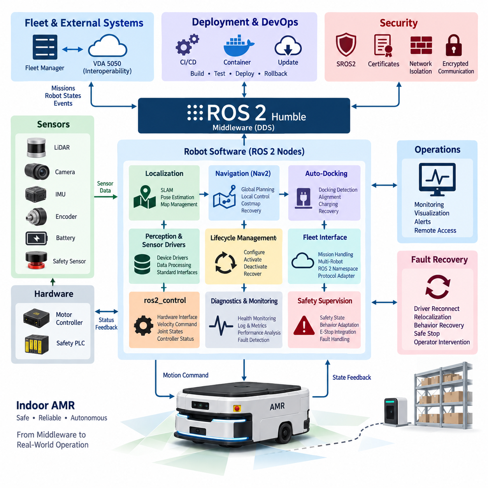
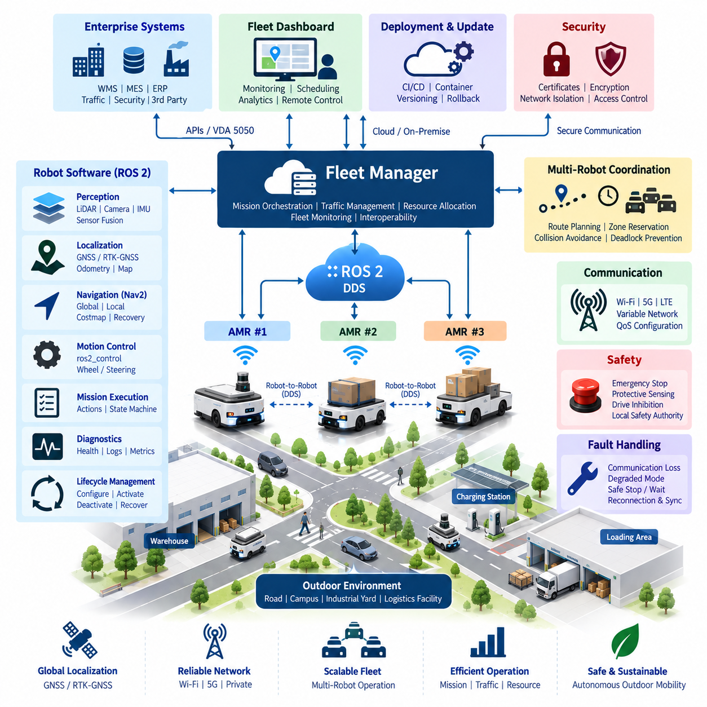
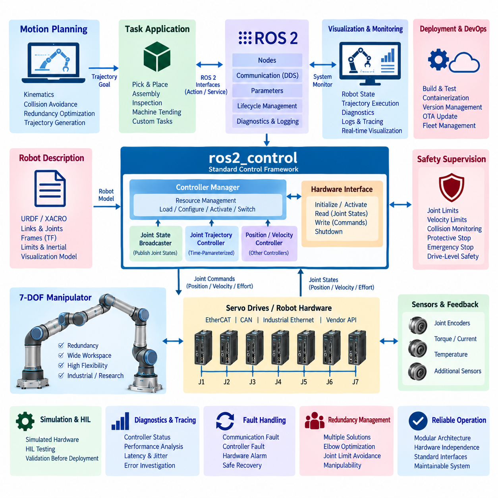
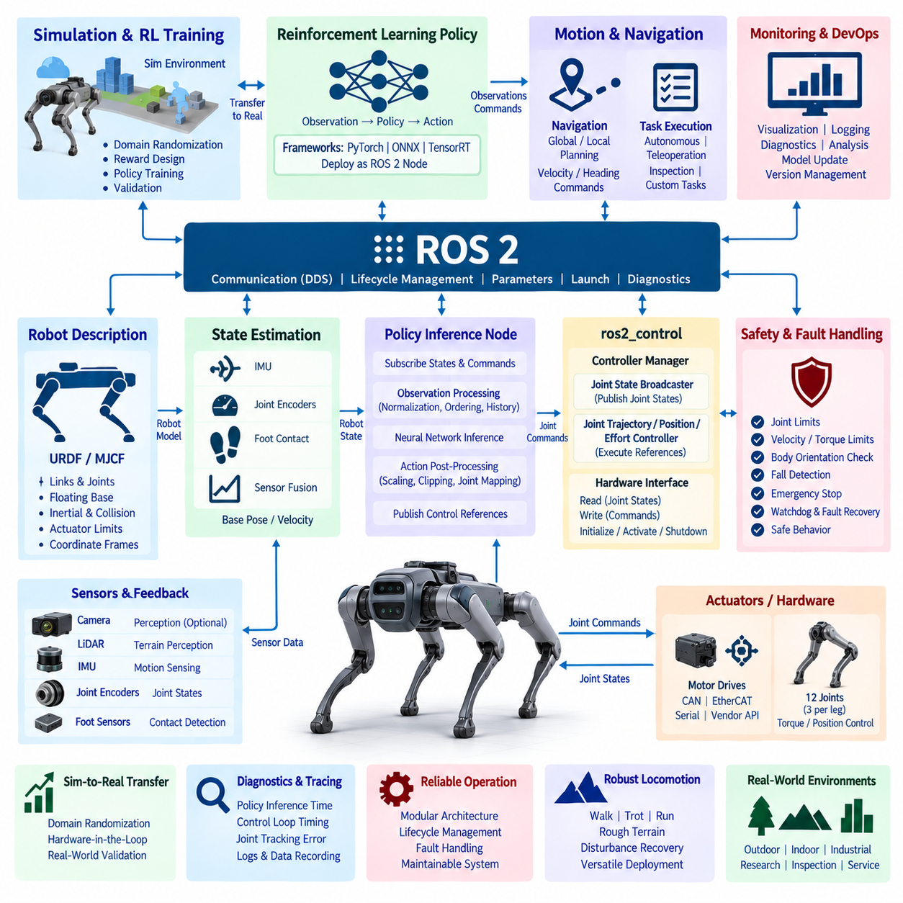
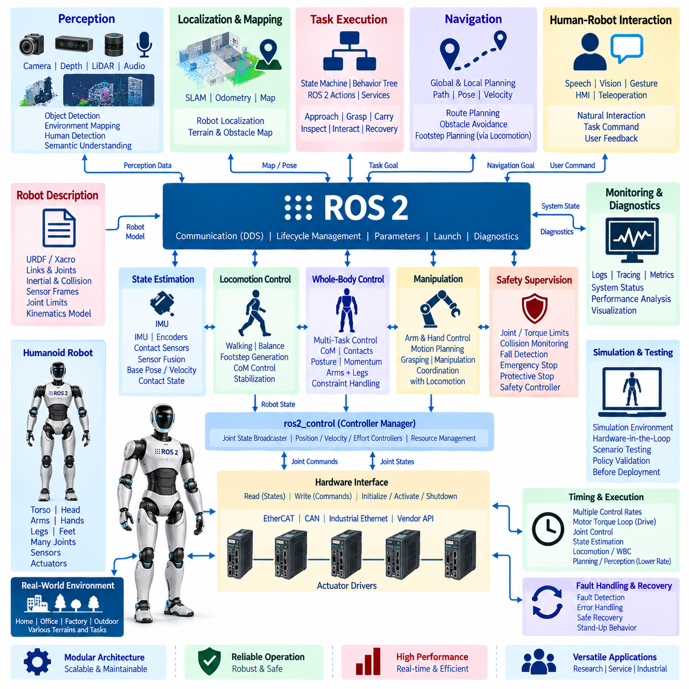
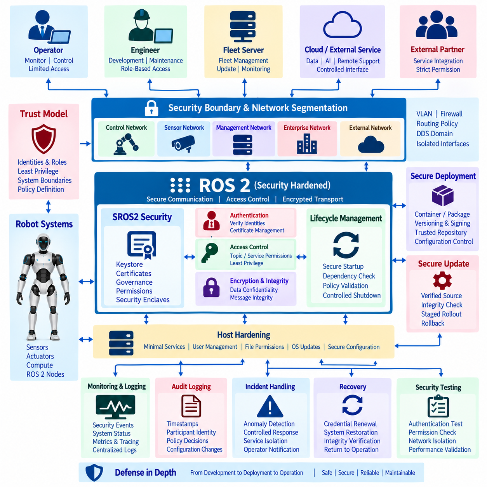
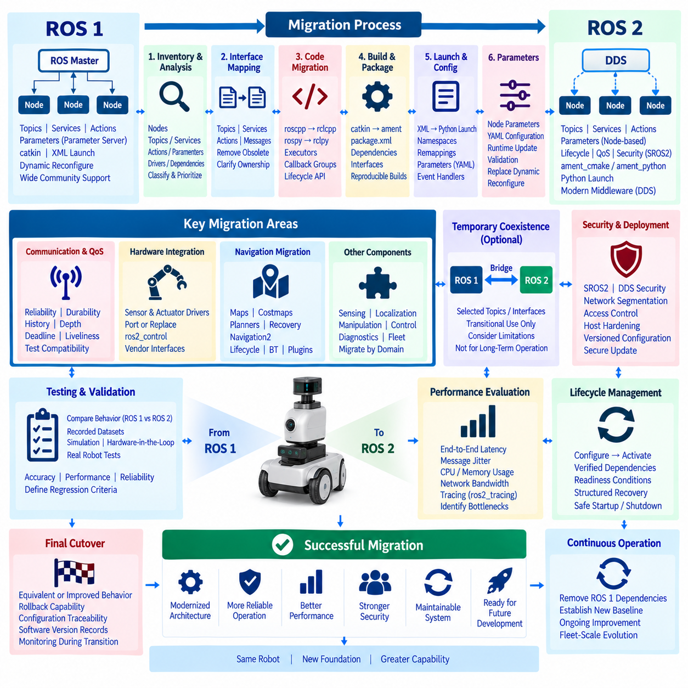
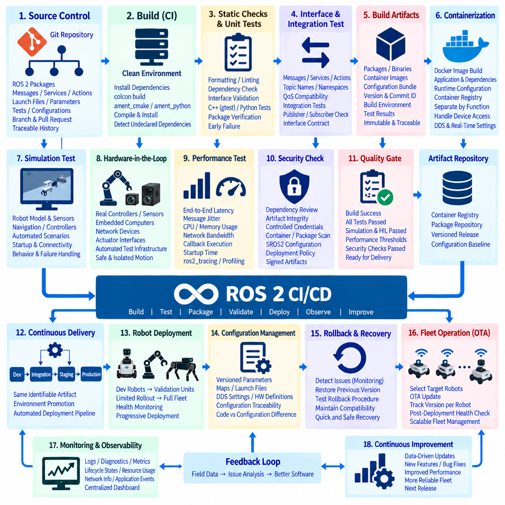
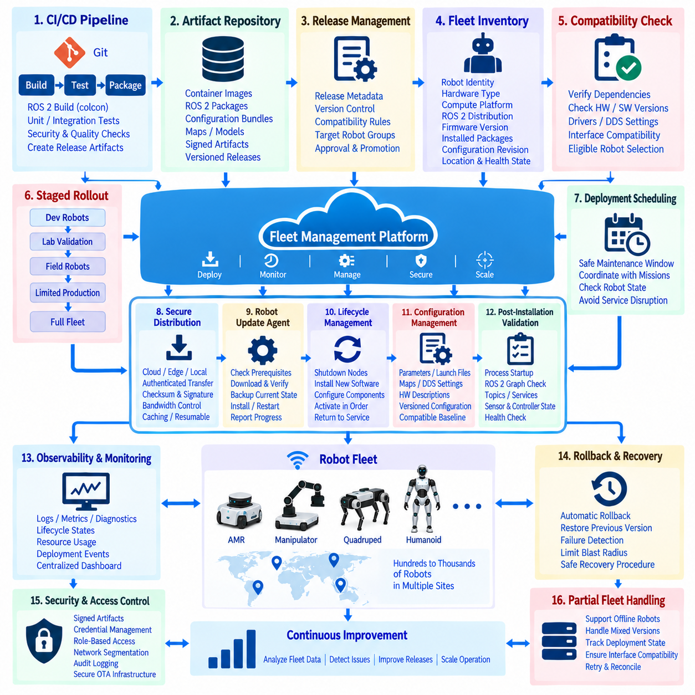
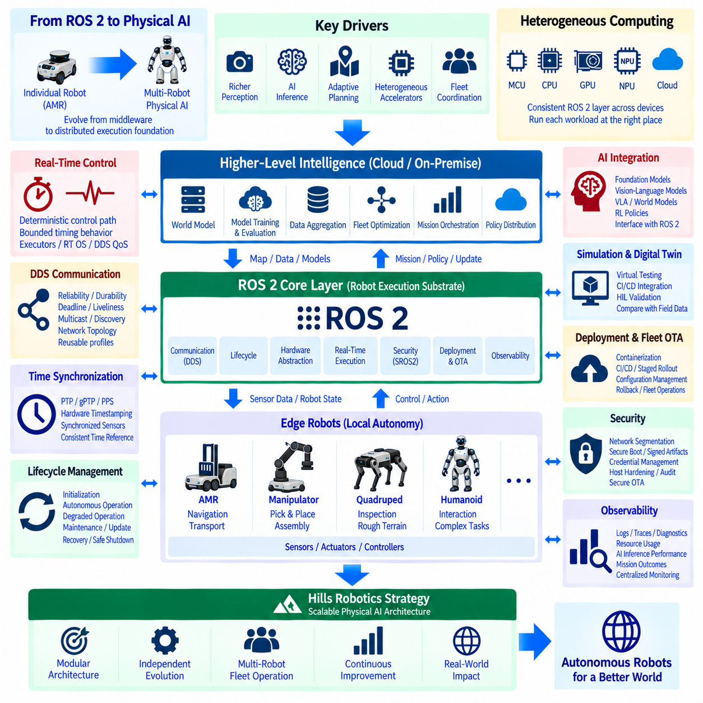

**Volume 05 Robot Middleware and ROS2**

# 12. ROS2 Case Studies

## 12.01 Indoor AMR Production Robot: ROS2 Humble Case

{width="7.268055555555556in" height="7.268055555555556in"}

A production indoor AMR built on ROS 2 Humble demonstrates how a general robotics middleware can be transformed into a stable industrial runtime rather than remaining a collection of research-oriented nodes. The Humble distribution provides a long-term support baseline for Ubuntu-based deployments, while the production architecture organizes sensing, localization, navigation, drive control, safety supervision, diagnostics, and fleet connectivity as explicitly managed subsystems.

The robot software is typically divided according to execution responsibility. Hardware-facing nodes acquire LiDAR, camera, encoder, IMU, battery, motor-controller, and safety-controller information, while higher layers consume normalized ROS 2 interfaces rather than vendor-specific protocols. This separation allows sensors or controllers to be replaced without redesigning navigation logic and provides a clear boundary between device integration and autonomous behavior.

At the mobility layer, ros2_control can provide a standardized connection between the ROS 2 software environment and the physical drive system. Wheel velocity commands, encoder feedback, joint states, and controller status are exchanged through hardware interfaces, while deterministic motor regulation remains inside the motor controller or lower-level real-time subsystem. ROS 2 therefore coordinates motion without unnecessarily moving hard real-time electrical control into middleware processes.

Localization combines wheel odometry, inertial measurements, and environmental observations to maintain the robot pose within the operating map. A production implementation must handle more than nominal localization accuracy: initialization, temporary sensor degradation, localization confidence, map changes, and recovery after pose loss must be explicitly managed. The resulting map-to-odom and odom-to-base transforms form a dependable spatial reference for navigation and monitoring components.

Navigation2 provides the principal autonomous navigation framework, integrating global planning, local trajectory generation, costmaps, behavior execution, recovery mechanisms, and goal management. Production configuration emphasizes predictable behavior rather than maximum algorithmic complexity. Planner and controller parameters are validated against vehicle geometry, payload, stopping distance, aisle width, pedestrian interaction, floor conditions, and operational speed limits before deployment.

ROS 2 communication is configured according to the semantics of each data stream. High-rate sensor information may favor best-effort delivery where freshness is more valuable than retransmission, whereas commands, operational states, alarms, and selected control information can require reliable delivery. Queue depth, history, durability, deadline, and liveliness settings are treated as architectural parameters because inappropriate DDS QoS configuration can create latency, stale data, or unnecessary network load.

Lifecycle management is particularly important when the AMR transitions from boot to autonomous service. Sensor drivers, localization, map services, navigation components, docking functions, and fleet interfaces should not become operational in an arbitrary order. Managed nodes can be configured, activated, deactivated, cleaned up, or restarted according to dependencies, allowing startup orchestration to verify prerequisites before motion capability is enabled and to isolate failed components during recovery.

Safety remains independent from ordinary navigation decisions. Emergency stop circuits, protective scanners, safety PLCs, drive enable signals, and certified safety functions should retain authority even when ROS 2 software fails. ROS 2 receives safety state information and adapts autonomous behavior accordingly, but middleware communication does not replace the safety-rated control chain. This separation prevents a navigation or application failure from becoming the sole mechanism responsible for stopping the machine.

Auto-docking extends navigation into a precision terminal behavior. A typical sequence moves the AMR to a staging pose, acquires the docking reference, performs low-speed alignment, verifies physical contact or charging conditions, and confirms successful charging before completing the mission. Each transition requires timeout handling and recovery logic so that failed detection, blocked access, charger faults, or alignment errors result in controlled retries or escalation instead of indefinite execution.

Production AMRs also require communication beyond the individual robot. Robot namespaces isolate topics, services, actions, parameters, and transforms when multiple units share a ROS 2 environment, while fleet-level interfaces exchange mission requests, robot states, traffic information, and operational events. Where interoperability is required, an adapter can translate between internal ROS 2 representations and external fleet protocols such as VDA 5050 without exposing internal node topology directly.

Diagnostics convert distributed software into an observable operational system. Nodes continuously report sensor availability, localization quality, controller state, CPU and memory utilization, network health, battery condition, navigation failures, and communication anomalies. Diagnostic aggregation allows these signals to be converted into robot-level health states, while logs, metrics, and recorded ROS 2 data provide evidence for troubleshooting intermittent failures that cannot be reproduced easily in laboratory testing.

Deployment configuration should be reproducible across the production fleet. ROS 2 packages, parameter files, launch configurations, firmware dependencies, maps, security policies, and application versions are managed as controlled software artifacts. CI/CD testing can validate builds and interfaces before release, while staged deployment and rollback mechanisms reduce the operational risk of updates. This connects the AMR runtime to the broader ROS 2 deployment and DevOps structure defined for the middleware volume.

Security hardening becomes increasingly important when robots communicate through factory networks or fleet servers. DDS domain separation, host firewalls, restricted service exposure, authenticated update mechanisms, and SROS2/DDS Security can reduce unauthorized access paths. Security configuration must nevertheless be benchmarked because encryption, authentication, discovery behavior, and certificate management can influence startup time, bandwidth, CPU consumption, and communication latency on embedded computers.

Fault recovery is designed as a hierarchy rather than a universal process restart. A temporary sensor communication problem may require driver reconnection, localization degradation may trigger controlled relocalization, and navigation failure may invoke behavior-tree recovery. More serious faults can deactivate autonomous motion and request operator intervention. This layered strategy prevents minor faults from unnecessarily stopping the entire robot while ensuring that uncertain system states do not silently continue autonomous operation.

The resulting ROS 2 Humble production AMR is therefore a coordinated cyber-physical software system rather than merely a Nav2-equipped mobile platform. ROS 2 supplies standardized communication, lifecycle control, hardware abstraction, diagnostics, and extensibility, while industrial engineering adds deterministic boundaries, safety independence, deployment governance, recovery policies, cybersecurity, and fleet observability. Together these elements create a maintainable architecture capable of continuous operation across multiple production robots.

## 12.02 Outdoor AMR ROS2 Multi-Robot Fleet Operation

{width="7.268055555555556in" height="7.268055555555556in"}

Outdoor AMR fleet operation extends ROS 2 from a single-robot middleware environment into a distributed mobility infrastructure in which multiple autonomous robots must coordinate missions, routes, resources, safety states, and operational information. The architecture separates robot-local autonomy from fleet-level intelligence so that each AMR can continue essential navigation and safety functions even when communication with the central fleet system is temporarily degraded.

Each outdoor AMR operates an independent ROS 2 software stack containing sensor drivers, localization, perception, navigation, motion control, diagnostics, and mission execution components. Robot-local processing minimizes dependence on continuous server connectivity and keeps latency-sensitive decisions close to the physical platform. Fleet services therefore supervise and coordinate robots without becoming responsible for every low-level control decision executed during motion.

Outdoor localization requires a broader sensor architecture than typical indoor navigation because robots may operate across roads, industrial yards, campuses, logistics facilities, and other geographically distributed spaces. GNSS or RTK-GNSS can provide global positioning while IMU, wheel odometry, LiDAR, and camera information support local motion estimation and environmental alignment. ROS 2 coordinates these sources through timestamped messages and consistent coordinate-frame relationships.

The transform architecture must represent both globally referenced and robot-relative coordinate systems. Each AMR maintains its own base, odometry, sensor, and local map frames while fleet applications require a common spatial reference for interpreting robot positions. Correct namespace and tf2 design prevents transform collisions when many robots publish similar frame names and enables monitoring systems to visualize the entire fleet without confusing coordinate trees belonging to different vehicles.

Navigation2 can remain responsible for robot-local path execution while the fleet layer manages higher-level traffic and mission constraints. A fleet system may assign destinations, corridors, work zones, or route segments, after which the individual AMR generates and executes feasible trajectories using its local costmaps and obstacle information. This division preserves rapid local obstacle avoidance while allowing global traffic coordination to consider the movement of many robots simultaneously.

Multi-robot namespace design is fundamental to fleet scalability. Topics, services, actions, parameters, lifecycle interfaces, diagnostics, and transforms are organized beneath robot-specific identities so that identical software packages can execute across many vehicles without interface collisions. Standardized naming also simplifies automated deployment because fleet tools can derive communication endpoints from the robot identifier instead of maintaining unique software configurations for every vehicle.

DDS communication must be engineered for outdoor network conditions rather than assuming stable wired connectivity. Wi-Fi, private 5G, industrial wireless networks, or mixed communication environments can introduce variable latency, packet loss, handovers, and temporary disconnection. ROS 2 QoS policies are therefore selected according to message purpose, distinguishing high-rate transient sensor traffic from mission commands, robot states, alarms, and other operational information that requires stronger delivery guarantees.

Fleet communication should avoid transmitting every internal ROS 2 topic across the wireless infrastructure. High-bandwidth camera streams, point clouds, and raw sensor messages normally remain inside the robot unless remote diagnostics specifically require them. The fleet interface instead publishes compact operational information such as pose, velocity, battery state, mission progress, navigation status, safety condition, fault codes, and connectivity quality, reducing bandwidth while preserving fleet observability.

Mission orchestration converts external operational requests into robot-executable work. The fleet manager evaluates robot availability, location, battery condition, payload capability, current assignments, and operational restrictions before dispatching missions. The selected robot receives a structured task that can be translated into ROS 2 actions or state-machine transitions, while progress and completion events are returned to the fleet layer for subsequent scheduling and enterprise-system integration.

Traffic management becomes essential when several AMRs share narrow passages, intersections, charging stations, gates, loading areas, or other constrained resources. Fleet-level coordination can reserve route segments or operational zones while local navigation continues to detect pedestrians, vehicles, and unexpected obstacles. This hierarchical approach prevents global scheduling logic from replacing immediate collision avoidance and prevents purely local navigation from creating fleet-wide deadlocks or resource conflicts.

Outdoor fleet operation must explicitly tolerate communication loss. A robot that loses its fleet connection should enter a predefined degraded operating mode rather than immediately becoming uncontrolled or indefinitely continuing an outdated mission. Depending on operational policy, it may safely stop, complete a limited route segment, move to a designated waiting location, or continue local autonomy for a bounded period while attempting reconnection. Recovered communication requires state reconciliation before new commands are accepted.

Lifecycle management provides a systematic mechanism for controlling distributed robot software during startup, shutdown, maintenance, and fault recovery. Sensor nodes, localization, navigation, fleet adapters, and mission managers can transition through managed states according to dependency rules. At fleet scale, lifecycle status also becomes operational telemetry, allowing remote systems to distinguish a robot that is intentionally inactive from one whose navigation or hardware interface has unexpectedly failed.

Safety authority remains local to each physical AMR even when fleet coordination is centralized. Emergency stopping, protective sensing, drive inhibition, and other safety-related functions must not depend exclusively on a remote ROS 2 node or wireless network connection. Fleet systems can observe safety states, suspend missions, reroute other robots, and request controlled behavior, but the physical robot retains the ability to enter a safe condition independently of fleet connectivity.

Diagnostics and observability aggregate robot-local information into a fleet-wide operational picture. Health status, localization quality, CPU and memory utilization, network quality, battery condition, sensor availability, navigation failures, and mission events can be collected using standardized diagnostic interfaces. Historical logs and ROS 2 data recordings allow engineers to correlate software behavior with environmental conditions and identify recurring problems that appear only during large-scale field operation.

Interoperability becomes important when outdoor AMRs must communicate with warehouse management, manufacturing execution, traffic control, security, or third-party fleet systems. A protocol adapter can isolate internal ROS 2 interfaces from external APIs and interoperability standards, including fleet-oriented mechanisms such as VDA 5050 where applicable. This boundary allows the internal robot architecture to evolve while maintaining a stable integration contract with external operational systems.

Deployment and update management must treat the fleet as a controlled population rather than upgrading every robot simultaneously. Software packages, containers, configuration parameters, maps, security credentials, and firmware dependencies are versioned and validated before release. Updates can progress through development robots, validation units, limited production groups, and finally the broader fleet, with health monitoring and rollback capability reducing the risk that a software defect disables many robots at once.

A mature outdoor multi-robot ROS 2 architecture therefore combines decentralized physical autonomy with centralized or distributed fleet intelligence. Individual AMRs maintain perception, localization, navigation, control, and safety capabilities, while the fleet layer manages missions, traffic, resources, deployment, and collective operational awareness. This division creates a scalable foundation for expanding ROS 2 from autonomous mobile robots into larger multi-robot and fleet-intelligence systems represented elsewhere in the robotics software architecture.

## 12.03 7-DOF Manipulator ros2.control Integration Case

{width="7.268055555555556in" height="7.268055555555556in"}

A 7-DOF manipulator integrated with ROS 2 through ros2_control illustrates how high-level robotic applications can be separated from deterministic actuator control while retaining a standardized software interface. The seven joints provide kinematic redundancy, allowing the manipulator to reach a desired end-effector pose with multiple possible joint configurations. ROS 2 coordinates planning, supervision, sensing, diagnostics, and command delivery, while lower-level hardware executes time-critical servo functions.

The manipulator is represented through a robot description containing links, joints, coordinate frames, limits, inertial properties, and actuator-related information. URDF and associated configuration files provide a common structural model for visualization, kinematics, planning, and control integration. For a seven-axis arm, accurate joint limits and transform relationships are particularly important because planning algorithms must exploit redundancy without generating configurations that violate mechanical or operational constraints.

The ros2_control framework establishes the principal abstraction boundary between ROS 2 software and the physical manipulator. A hardware interface exposes joint command and state interfaces through a standardized resource model rather than requiring application nodes to communicate directly with servo drives. Position, velocity, or effort commands can therefore be mapped to vendor-specific hardware protocols while measured joint positions, velocities, and other available feedback are returned through consistent ROS 2 control interfaces.

A typical hardware plugin implements initialization, activation, read, write, and shutdown behavior for the manipulator interface. During each control cycle, the read operation obtains actuator feedback and converts hardware-specific values into ROS 2 joint states, while the write operation converts controller outputs into commands understood by the robot hardware. This architecture isolates communication details such as EtherCAT, CAN, industrial Ethernet, or proprietary servo APIs from higher-level manipulation software.

Controller Manager coordinates hardware resources and dynamically manages controllers operating on those resources. A Joint State Broadcaster publishes measured joint information for the rest of the ROS 2 system, while trajectory or position controllers claim the required command interfaces. Resource ownership prevents incompatible controllers from simultaneously commanding the same joints and provides a controlled mechanism for loading, configuring, activating, deactivating, and switching controllers during operation.

For coordinated seven-joint motion, a Joint Trajectory Controller can receive time-parameterized trajectories containing desired joint positions and related motion information. Rather than commanding each actuator independently from application software, the controller interpolates the trajectory and produces synchronized commands across the manipulator. This is essential for maintaining smooth multi-axis motion and provides a standard execution interface between motion-planning systems and the physical robot.

Higher-level manipulation planning can generate collision-aware trajectories without directly depending on the servo implementation. A planning component uses the robot model, current joint state, target pose, environmental representation, and kinematic constraints to compute a feasible trajectory. The resulting joint-space trajectory is passed through the ROS 2 control interface, preserving a clear separation between motion planning, trajectory execution, and hardware-level servo regulation.

Seven degrees of freedom introduce redundancy management as an important integration concern. Multiple joint configurations may satisfy the same Cartesian end-effector pose, allowing planners to optimize elbow position, joint-limit avoidance, collision clearance, manipulability, or task-specific posture. The control architecture must preserve this planned joint configuration during execution rather than reducing the command to an ambiguous Cartesian target that could produce an undesirable alternative posture.

The control update path should be designed with real-time behavior in mind. Memory allocation, blocking operations, excessive logging, unpredictable callbacks, and non-deterministic communication should be kept outside latency-sensitive control loops whenever possible. ROS 2 and ros2_control can coordinate real-time-oriented execution, but hard servo loops may remain inside dedicated drives, robot controllers, or real-time computing layers where deterministic timing can be guaranteed more directly.

Feedback flows continuously from the manipulator into the broader ROS 2 system. Joint positions and velocities support state estimation and visualization, while controller status, trajectory execution state, hardware faults, temperatures, currents, or other available signals contribute to diagnostics. This bidirectional architecture allows application software to reason about actual robot behavior rather than assuming that every commanded trajectory has been executed successfully.

Lifecycle and controller state management provide structured startup and shutdown behavior. Hardware interfaces should become active only after communication, joint-state validity, configuration, and required safety conditions have been verified. Controllers can then be activated in a defined sequence. During shutdown or failure recovery, motion commands are disabled before hardware resources are released, reducing the possibility of uncontrolled transitions between software states.

Safety supervision remains distinct from normal trajectory control. Joint limits, velocity limits, workspace restrictions, collision monitoring, protective stops, emergency stops, and drive-level safety functions may operate at different architectural layers. ROS 2 can monitor safety status and suspend trajectory execution, but safety-rated functions should not depend solely on ordinary middleware messages. The manipulator must retain an independent mechanism for preventing or stopping hazardous motion when higher-level software fails.

Fault handling should distinguish communication faults, controller faults, trajectory failures, hardware alarms, and safety events. A transient communication problem may permit reconnection or controller reactivation, whereas encoder inconsistency, drive faults, unexpected joint motion, or protective-stop activation may require motion inhibition and operator intervention. Explicit fault-state transitions prevent automatic recovery logic from restarting the manipulator when the physical system is not known to be safe.

Diagnostics and tracing are important during integration because failures can originate from planning, ROS 2 communication, controller scheduling, hardware interfaces, or servo systems. Engineers can correlate trajectory commands, controller updates, joint feedback, execution errors, and timing information to locate the source of abnormal motion. Latency and jitter measurements are particularly useful for determining whether performance limitations arise inside ROS 2 or below the middleware boundary.

Simulation and hardware-in-the-loop testing reduce risk before deployment on the physical arm. The same robot description and controller configuration can be exercised against simulated hardware interfaces to validate joint naming, controller ownership, trajectory interfaces, limits, and application behavior. Hardware-in-the-loop environments can then introduce actual controllers or communication devices before full mechanical operation, allowing progressively more realistic validation of the integration architecture.

In production, the complete system therefore forms a layered manipulation stack: task applications and motion planning generate desired behavior, ROS 2 distributes state and commands, ros2_control standardizes controller and hardware access, and dedicated servo hardware executes deterministic actuator regulation. This architecture allows the 7-DOF manipulator to combine redundant kinematics, reusable ROS 2 software, hardware independence, controlled lifecycle behavior, diagnostics, and industrial safety boundaries within one maintainable integration framework.

## 12.04 Quadruped ROS2 RL Policy Integration Case

{width="7.268055555555556in" height="7.268055555555556in"}

A quadruped robot integrating a reinforcement learning policy with ROS 2 requires a layered architecture that separates learned locomotion from middleware communication, hardware control, perception, and safety supervision. The RL policy generates motion behavior from robot observations, while ROS 2 coordinates commands, state information, lifecycle management, diagnostics, and higher-level navigation. This separation allows learned control to become one component of a maintainable robot software stack rather than an isolated inference program.

The physical robot is represented through URDF or MJCF models describing links, joints, inertial properties, collision geometry, actuator limits, and coordinate frames. Quadruped systems additionally require consistent representations of the floating base, hips, thighs, lower legs, and feet. The model connects simulation, visualization, state estimation, control, and reinforcement learning environments so that joint ordering and coordinate conventions remain consistent from training to physical deployment.

Robot observations form the input interface of the RL policy. Typical observations include joint positions, joint velocities, base orientation, angular velocity, estimated linear velocity, commanded motion, and previous actions, while some policies incorporate foot contacts or terrain information. ROS 2 nodes collect or estimate these signals, but the policy input must follow exactly the normalization, ordering, units, reference frames, and history representation used during training.

The policy inference node acts as the principal bridge between ROS 2 and the learned locomotion controller. It subscribes to the required robot state and command information, constructs the observation vector, performs neural-network inference, and converts policy outputs into control references. The model may be deployed through frameworks such as PyTorch, ONNX Runtime, or an optimized inference runtime, provided that execution latency remains compatible with the locomotion control architecture.

Policy outputs must be interpreted according to the action representation used during training. A policy may produce desired joint positions, position offsets, joint velocities, torques, or parameters consumed by a lower-level controller. The inference node therefore cannot simply forward arbitrary neural-network values to the actuators. Output scaling, clipping, joint mapping, sign conventions, and command limits must reproduce the training environment before commands enter the physical control path.

ros2_control can provide the standardized interface between the locomotion software and the quadruped hardware. Hardware interfaces expose joint states and command resources while controllers manage access to the actuators. The learned policy can feed references to an appropriate controller without depending directly on CAN, EtherCAT, serial communication, or vendor-specific motor APIs, preserving hardware abstraction and allowing control components to be replaced or tested independently.

A practical quadruped architecture often uses multiple timing layers. Motor current or torque regulation executes at the highest frequency inside servo drives or embedded controllers, while joint-level control and state estimation operate at another deterministic rate. RL policy inference may run at a lower frequency, with actions held or interpolated between inference steps. ROS 2 handles system integration around these loops without requiring every middleware callback to participate in the fastest servo cycle.

State estimation is critical because the learned policy depends on an accurate representation of body motion. IMU measurements, joint encoders, contact information, and kinematic relationships can be fused to estimate base orientation, velocity, and other states that cannot be measured directly. Estimator latency and noise characteristics should resemble the assumptions used during policy training because systematic differences between simulated observations and physical estimates can significantly change locomotion behavior.

Foot contact information provides an important connection between physical interaction and locomotion control. Contact states may be estimated from force sensors, joint torque, motor current, kinematics, or combinations of these signals. ROS 2 interfaces can distribute contact information to monitoring and higher-level modules, while the real-time control path provides the policy or estimator with sufficiently fresh contact information for gait stabilization and terrain interaction.

Higher-level navigation should remain separated from the RL locomotion policy. Navigation components determine where the robot should move and generate velocity, heading, or local motion commands, while the locomotion policy determines how the quadruped coordinates its legs and body to realize those commands. This hierarchy allows the same locomotion controller to support autonomous navigation, teleoperation, inspection missions, or task-level planning without retraining the policy for every mission system.

Simulation-to-real transfer is one of the central challenges in RL policy deployment. Training environments typically use domain randomization for mass, friction, actuator response, sensor noise, latency, terrain, and external disturbances so that the policy does not depend on one idealized simulator configuration. Deployment then verifies whether observation preprocessing, action scaling, controller dynamics, and physical parameters remain within the operating distribution encountered during training.

Safety supervision must surround the learned controller rather than assuming that policy outputs are inherently safe. Joint position and velocity limits, torque limits, body orientation thresholds, communication watchdogs, thermal constraints, and emergency-stop conditions can be evaluated independently of policy inference. Commands that exceed acceptable boundaries may be clipped, rejected, or replaced by a controlled safe behavior before they reach the actuators.

Lifecycle management is useful for preventing an RL controller from becoming active before the robot is ready. Sensor interfaces, state estimation, hardware communication, policy loading, and controller configuration can be initialized and validated before locomotion is enabled. During shutdown or fault recovery, the policy can be deactivated before actuator interfaces are released, producing a controlled transition from active locomotion toward a stationary or otherwise defined safe state.

Fault handling must consider failures specific to learned control as well as conventional robotic faults. Missing observations, stale timestamps, inference overruns, invalid numerical outputs, model-loading failures, estimator divergence, actuator faults, and unexpected body attitudes require different responses. Watchdogs and validity checks can prevent a corrupted observation or delayed policy result from being interpreted as a legitimate actuator command and propagated through the control system.

Diagnostics and tracing make the RL integration observable during development and field operation. Policy inference time, observation age, action values, control-loop timing, joint tracking error, contact state, estimator quality, and hardware status can be recorded alongside ROS 2 messages. These synchronized records help engineers distinguish whether unstable behavior originates from the neural policy, state estimation, middleware latency, actuator dynamics, environmental conditions, or interface configuration.

Validation should progress from simulation through increasingly realistic hardware stages. The policy can first execute against the training simulator, then through ROS 2 using simulated hardware interfaces, followed by hardware-in-the-loop testing and restrained physical experiments. Only after timing, command limits, emergency behavior, state estimation, and recovery mechanisms have been verified should testing expand toward unrestricted locomotion and more complex terrain.

The resulting system treats reinforcement learning as one controlled intelligence component within the broader quadruped ROS 2 stack described by the volume structure. ROS 2 supplies communication, lifecycle, diagnostics, navigation integration, and hardware abstraction, while the RL policy supplies learned locomotion behavior. Real-time control, state estimation, safety supervision, simulation validation, and fault handling surround the policy to create a deployable architecture capable of transferring learned locomotion from simulation into reliable physical robot operation.

## 12.05 Humanoid ROS2 Full Stack System Integration Case

{width="7.268055555555556in" height="7.268055555555556in"}

A humanoid robot integrated as a full ROS 2 system represents one of the most demanding middleware architectures because locomotion, balance, manipulation, perception, planning, interaction, and safety must operate as one coordinated physical system. Unlike a mobile base or fixed manipulator, a humanoid continuously changes contact conditions while controlling many coupled joints. ROS 2 therefore serves as the integration backbone connecting heterogeneous real-time and non-real-time subsystems through explicit interfaces and lifecycle boundaries.

The robot description provides the structural foundation for the entire software stack. URDF, Xacro, or complementary robot models describe the torso, pelvis, head, arms, hands, legs, feet, joints, inertial properties, collision geometry, limits, and sensor frames. Consistent joint naming and coordinate conventions are essential because the same model is consumed by visualization, kinematics, state estimation, motion planning, collision checking, ros2_control, and higher-level humanoid applications.

Hardware abstraction separates the humanoid software from individual actuators and embedded devices. ros2_control hardware interfaces can expose joint positions, velocities, efforts, temperatures, currents, and command resources through standardized interfaces. Vendor-specific communication such as EtherCAT, CAN, industrial Ethernet, or proprietary actuator protocols remains below this boundary, allowing upper control layers to operate without embedding device-specific communication logic throughout the robot software.

Humanoid control normally uses multiple timing domains rather than a single ROS 2 execution frequency. Motor current and torque loops may execute inside drives or embedded controllers, while joint control, state estimation, balance control, and whole-body control operate at deterministic rates appropriate to their functions. Planning, perception, task reasoning, and user interaction can execute more slowly. ROS 2 coordinates information exchange between these timing domains without forcing every subsystem into one control loop.

State estimation creates the dynamic representation required for stable whole-body behavior. IMU measurements, joint encoders, foot contact information, force or torque sensing, and kinematic constraints can be fused to estimate base orientation, velocity, contact state, and body configuration. Timestamp consistency is particularly important because delayed or misaligned measurements can corrupt the estimated relationship between the floating base, supporting feet, center of mass, and surrounding environment.

Locomotion control converts desired robot motion into coordinated leg and body behavior. Walking systems may generate footsteps, center-of-mass trajectories, swing-foot trajectories, and balance references while continuously adapting to measured state. ROS 2 provides commands and monitoring interfaces around the locomotion subsystem, whereas latency-sensitive stabilization remains inside an appropriately deterministic control layer. This preserves both modularity and the response speed required to maintain dynamic balance.

Whole-body control coordinates the humanoid\'s many degrees of freedom under simultaneous objectives and constraints. The controller may regulate center-of-mass motion, foot contacts, torso orientation, hand targets, joint posture, and momentum while respecting joint, torque, friction, and contact constraints. Instead of treating arms and legs as independent mechanisms, whole-body control resolves competing objectives so that manipulation or upper-body motion does not unintentionally destabilize locomotion.

Manipulation adds another coordinated subsystem to the full stack. Motion planning can generate arm, hand, or whole-body trajectories using the current robot state and environmental representation, while ros2_control or dedicated joint controllers execute the resulting references. For tasks performed while standing or walking, manipulation commands must remain compatible with balance and contact constraints, requiring coordination between task-level planning, arm control, locomotion, and whole-body control.

Perception supplies the environmental context required by navigation and manipulation. Cameras, depth sensors, LiDAR, force sensors, and other devices can be integrated through ROS 2 drivers and processing nodes to provide object information, terrain geometry, obstacles, human locations, and semantic observations. The perception architecture should distinguish high-bandwidth sensor processing from compact world-state representations so that every subsystem does not need to consume raw sensor streams.

Navigation operates above the locomotion controller by determining where the humanoid should move rather than directly commanding individual leg joints. Global and local planning can generate paths, target poses, or velocity references, while the locomotion subsystem translates these objectives into feasible footsteps and body motion. This hierarchy permits navigation algorithms to evolve independently from gait generation and allows different locomotion controllers to share the same mission-level navigation architecture.

Task execution coordinates locomotion, manipulation, perception, and interaction into complete robot behaviors. State machines, behavior trees, ROS 2 actions, services, and topics can represent long-running operations such as approaching a workstation, locating an object, grasping it, transporting it, and interacting with equipment. Explicit success, failure, cancellation, timeout, and recovery states are important because a humanoid task often spans multiple subsystems whose failures must be handled coherently.

Lifecycle management establishes controlled startup and shutdown of the full stack. Hardware interfaces, sensors, state estimation, perception, controllers, locomotion, planning, and task components should become active according to dependency relationships rather than arbitrary process order. Before enabling motion, the system can verify communication, joint states, sensor validity, controller readiness, and safety conditions. Shutdown reverses these dependencies so that motion capability is removed before underlying resources disappear.

Safety supervision must remain capable of overriding normal autonomous behavior. Joint and torque limits, collision monitoring, fall detection, body-orientation thresholds, thermal conditions, communication watchdogs, protective stops, and emergency stops can be evaluated at different architectural levels. ROS 2 communicates safety states and coordinates behavioral responses, but safety-critical stopping mechanisms should retain independent authority when middleware, perception, planning, or AI components fail.

Fall management requires special treatment because loss of balance cannot always be handled as an ordinary controller error. The system may detect instability through orientation, angular velocity, contact state, or support conditions and transition from normal control toward a protective response. After a fall, hardware integrity, joint state, sensor validity, environmental clearance, and controller conditions must be evaluated before recovery or stand-up behavior is permitted.

Diagnostics and tracing provide visibility across this highly coupled system. Joint tracking error, control-loop timing, state-estimator quality, contact states, perception latency, planning results, CPU and GPU utilization, actuator conditions, network behavior, and lifecycle transitions can be recorded with synchronized timestamps. Correlating these signals is essential because a visible locomotion or manipulation failure may originate from another subsystem several stages earlier in the processing chain.

Simulation provides the safest environment for integrating the humanoid stack before unrestricted physical operation. Robot models, controllers, perception pipelines, navigation, manipulation, and task behaviors can first be validated with simulated hardware and environments. Hardware-in-the-loop testing then introduces real controllers or computing devices, while progressively constrained physical experiments verify timing, limits, balance behavior, emergency handling, and recovery before more complex autonomous tasks are attempted.

The completed architecture therefore treats the humanoid as a distributed cyber-physical system rather than a single controller attached to many joints. ROS 2 provides communication, hardware abstraction, lifecycle coordination, diagnostics, and modular integration, while specialized layers provide perception, state estimation, locomotion, whole-body control, manipulation, navigation, and task intelligence. Safety, real-time boundaries, simulation, and fault recovery surround these capabilities, creating a scalable foundation for increasingly autonomous humanoid systems within the broader robot middleware architecture.

## 12.06 ROS2 Security Hardened Operation Case

{width="7.268055555555556in" height="7.268055555555556in"}

A security-hardened ROS 2 operation transforms the middleware from an implicitly trusted robot network into a controlled distributed system where identities, permissions, communication paths, software versions, and operational events are explicitly governed. Security must cover the complete robot lifecycle rather than only encrypting DDS traffic. The architecture therefore combines SROS2, DDS Security, network segmentation, host hardening, secure deployment, monitoring, and recovery as coordinated protection layers.

The security architecture begins with a defined trust model for robots, operators, fleet servers, engineering computers, and external services. Each participant should have an explicit identity and a limited operational role instead of receiving unrestricted access to the ROS 2 graph. Security boundaries are established according to system function, allowing navigation, control, diagnostics, fleet management, development, and external integration environments to be separated according to their actual communication requirements.

SROS2 provides ROS 2 tooling for applying DDS Security capabilities to nodes and communication endpoints. A security keystore contains governance information, permissions, certificates, private keys, and related artifacts required to establish authenticated communication. Nodes operate with assigned security enclaves so that credentials and policies can correspond to functional boundaries rather than treating every process on the robot as one universally trusted participant.

Authentication verifies the identity of DDS participants before trusted communication is established. Certificate-based credentials allow nodes to prove their identities and reduce the possibility that an unauthorized process can simply join the ROS 2 domain. Certificate issuance, distribution, renewal, revocation, expiration, and secure private-key storage consequently become operational responsibilities that must be managed throughout the lifetime of production robots.

Access control determines what an authenticated participant is actually permitted to do. Permission policies can restrict publishing, subscribing, service interaction, and other DDS communication according to topic or domain requirements. A perception node, for example, does not automatically require authority to publish motion commands merely because it belongs to the same robot. Least-privilege policies reduce the impact of a compromised or incorrectly configured component.

DDS Security can protect data in transit using cryptographic mechanisms for confidentiality and integrity. Encryption reduces exposure of sensitive robot information to passive network observation, while integrity protection helps detect unauthorized modification. However, cryptographic processing introduces computational and communication overhead, so security configurations should be benchmarked under realistic message rates, payload sizes, processor loads, and network conditions before production deployment.

Network segmentation complements middleware-level security by limiting where communication can physically or logically travel. Robot control networks, sensor networks, fleet communication, maintenance interfaces, enterprise systems, and external connectivity can be separated using VLANs, firewalls, routing policies, or dedicated interfaces. DDS domains can provide additional logical separation, but domain identifiers alone should not be treated as equivalent to an enforceable cybersecurity boundary.

DDS discovery requires particular attention because automatic participant discovery can expose system structure or generate communication across unintended network segments. Multicast behavior, discovery servers, interface binding, routing, and allowed peer relationships should be configured according to the deployment topology. Production systems benefit from predictable communication paths rather than permitting every reachable device to participate freely in discovery across the entire operational network.

Host hardening protects the computing platform beneath ROS 2. Unnecessary services and ports should be disabled, software privileges minimized, administrative access controlled, and operating-system packages maintained according to an update policy. File permissions must protect security artifacts and configuration data, while application processes should operate with only the privileges required for their functions. Middleware security cannot compensate for a host that permits unrestricted local compromise.

Containerized or packaged deployment introduces another security boundary. ROS 2 applications, dependencies, configuration files, and runtime permissions should be built from controlled sources and distributed as identifiable software artifacts. Versioning, checksums or signatures, software inventory, and controlled repositories help establish what software is actually running on each robot. Deployment pipelines should prevent unreviewed binaries or configuration changes from silently entering production systems.

Secure update mechanisms are essential because long-lived robots inevitably require vulnerability patches and software changes. An update process should authenticate the update source, verify artifact integrity, preserve compatible configuration, and provide rollback when deployment fails. Staged rollout limits operational exposure by validating a release on development or selected production robots before applying it across an entire fleet, reducing the consequences of defective or compromised updates.

Lifecycle management can reinforce security by controlling when protected components become operational. Security credentials, communication dependencies, hardware interfaces, and required services can be verified before nodes transition into active states. If authentication fails, policy files are invalid, or required secure services are unavailable, the system can prevent autonomous operation rather than allowing partially configured nodes to communicate with uncontrolled assumptions.

Security monitoring converts protection mechanisms into an observable operational process. Authentication failures, denied permissions, unexpected participants, configuration changes, repeated connection attempts, node restarts, network anomalies, and update events can be collected alongside ordinary ROS 2 diagnostics. Centralized logs and metrics allow operators to distinguish routine software failures from behavior that may indicate configuration errors, unauthorized activity, or attempted intrusion.

Audit logging should preserve sufficient context to reconstruct significant security events without overwhelming storage or exposing unnecessary sensitive information. Relevant records may include timestamps, participant identities, policy decisions, software versions, administrative actions, and communication failures. Time synchronization across robots and infrastructure is important because events collected from multiple hosts cannot be reliably correlated when their clocks differ significantly.

Security incident handling must coexist with physical safety. Immediately terminating every process after detecting a cybersecurity anomaly may be inappropriate if a robot is moving, carrying a payload, or operating near people. The system should define controlled responses such as restricting external communication, rejecting new missions, entering degraded operation, completing a safe stop, isolating affected services, or requesting operator intervention while preserving safety-critical control functions.

Recovery requires more than restarting ROS 2 nodes after an incident. Credentials may need revocation or replacement, compromised software may require restoration from trusted artifacts, network access may need isolation, and configuration integrity must be revalidated. Before autonomous operation resumes, the system should verify hardware state, software version, security policy, communication trust, lifecycle state, and relevant safety conditions so that recovery does not restore the original vulnerability.

Security testing should be incorporated into system integration and release validation. Tests can verify authentication behavior, denied communication, certificate failures, expired credentials, network isolation, policy enforcement, secure startup, logging, and update rollback. Performance testing should additionally measure the effects of security mechanisms on discovery time, CPU load, bandwidth, message latency, and real-time-sensitive communication so that protection does not create unrecognized operational failures.

A production security-hardened ROS 2 system therefore applies defense in depth rather than depending on a single security mechanism. SROS2 and DDS Security protect middleware identities and communication, network controls restrict connectivity, host and deployment hardening protect execution environments, and monitoring provides operational visibility. Lifecycle management, incident response, recovery, and continuous validation complete the architecture, aligning the security case with the broader ROS 2 security and deployment structure defined in the volume.

## 12.07 ROS1 to ROS2 Migration Project Case

{width="7.268055555555556in" height="7.268055555555556in"}

Migrating a production robot from ROS 1 to ROS 2 is not simply a source-code conversion exercise. It is an architectural transition from a ROS Master-centered communication model toward a DDS-based distributed middleware environment with different node APIs, Quality of Service semantics, lifecycle capabilities, security mechanisms, launch systems, and deployment practices. A successful migration therefore begins by understanding the complete operational behavior of the existing robot before replacing individual software components.

The first activity is an inventory of the ROS 1 system. Nodes, topics, services, actions, parameters, launch files, message definitions, device drivers, third-party packages, dynamic reconfigure interfaces, diagnostics, and external applications are mapped together with their dependencies. Components are classified according to business importance, real-time sensitivity, hardware dependency, replacement difficulty, and ROS 2 availability so that migration priorities reflect operational risk rather than package count alone.

The communication graph should then be analyzed as an explicit interface contract. ROS 1 publishers and subscribers must be mapped to ROS 2 topics, while services and actions are reviewed according to their interaction patterns and timing requirements. Custom message packages require compatible ROS 2 interface definitions and build configuration. This stage is also an opportunity to remove obsolete interfaces and clarify ownership instead of reproducing every historical ROS 1 communication dependency unchanged.

DDS introduces communication behavior that requires deliberate Quality of Service configuration. ROS 1 communication assumptions cannot always be transferred directly because ROS 2 supports reliability, durability, history, depth, deadline, and liveliness policies. Sensor streams may prioritize freshness through best-effort delivery, whereas commands or important state information may require reliable delivery. QoS compatibility must therefore be tested between communicating nodes rather than treated as a final deployment adjustment.

Source migration requires changes to node initialization, publishers, subscribers, services, timers, parameters, executors, logging, and shutdown behavior. C++ applications move from roscpp concepts toward rclcpp, while Python nodes migrate from rospy toward rclpy. Instead of mechanically translating API calls line by line, developers should identify where ROS 2 concepts such as callback groups, executors, composition, and lifecycle management can simplify or strengthen the original architecture.

The build and package infrastructure also changes substantially. ROS 1 catkin packages are migrated toward ROS 2 packages using ament_cmake or ament_python, while package manifests, dependency declarations, interface generation, installation rules, and workspace procedures are updated accordingly. The migration project should preserve reproducible builds throughout this transition so that developers can distinguish software conversion problems from dependency or environment inconsistencies.

Launch configuration requires redesign because ROS 2 launch provides a different execution model and Python-based capabilities. Existing ROS 1 XML launch files should first be analyzed for node dependencies, namespaces, remappings, parameters, machine assumptions, and startup ordering. The ROS 2 launch architecture can then reproduce required behavior while improving modularity through reusable launch descriptions, conditional execution, namespaces, event handlers, and structured configuration.

Parameter handling is another architectural difference. ROS 1 commonly relies on a centralized parameter server, whereas ROS 2 parameters belong to individual nodes and are accessed through node interfaces. Parameter namespaces, YAML files, runtime updates, validation, and ownership must therefore be redesigned. Dynamic configuration behavior should be implemented through appropriate ROS 2 parameter callbacks or application interfaces instead of assuming that the ROS 1 dynamic_reconfigure mechanism will remain unchanged.

Hardware integration is often one of the highest-risk migration areas because existing drivers may contain years of device-specific knowledge. Sensor and actuator drivers should be evaluated individually to determine whether a maintained ROS 2 implementation exists, whether the ROS 1 driver should be ported, or whether the hardware interface should be redesigned. For controllable hardware, ros2_control can provide a standardized boundary between application-level control and vendor-specific communication.

A staged migration is generally safer than replacing the complete production stack at once. Components can be grouped into functional domains such as sensing, localization, navigation, manipulation, control, diagnostics, and fleet integration. Each domain is migrated and validated against defined interfaces before the next dependency is converted. This approach creates measurable intermediate states and reduces the number of simultaneous variables when unexpected behavior appears during system integration.

Temporary coexistence between ROS 1 and ROS 2 may be necessary during a staged project. Where technically appropriate and supported by the selected distributions, bridging can exchange selected topics or interfaces between the two environments. The bridge should be treated as a migration mechanism rather than the desired final architecture because additional translation, deployment complexity, interface limitations, and troubleshooting boundaries can make long-term mixed operation difficult to maintain.

Navigation migration requires more than replacing one package name with another. A ROS 1 navigation stack may contain years of tuned maps, costmap parameters, planners, recovery behaviors, localization settings, and robot-specific modifications. Migration to Navigation2 should preserve the intended operational behavior while translating configuration into ROS 2 concepts such as lifecycle-managed servers, actions, plugins, behavior trees, and revised parameter structures.

Lifecycle management provides an opportunity to improve startup and recovery behavior that may previously have been implemented through scripts or implicit launch ordering. Sensors, localization, navigation, controllers, and application components can transition through configured and active states according to verified dependencies. A migrated system can therefore establish explicit readiness conditions before enabling autonomous motion and provide more structured recovery when individual subsystems fail.

Testing must compare behavior rather than merely confirm that migrated nodes execute without errors. Recorded datasets, simulation scenarios, hardware-in-the-loop environments, and physical robot tests can compare localization accuracy, navigation completion, control response, CPU usage, network behavior, startup time, and failure recovery between the ROS 1 baseline and ROS 2 implementation. Regression criteria should be established before retiring the original system so that functional differences are visible and measurable.

Performance validation is particularly important because middleware behavior, executors, serialization, DDS configuration, and node composition differ from ROS 1. End-to-end latency, message jitter, CPU consumption, memory utilization, network bandwidth, and callback execution should be measured under representative workloads. ros2_tracing and related observability mechanisms can help identify whether unexpected timing originates from application code, executor scheduling, DDS communication, or hardware interfaces.

Security and deployment practices can also be modernized during migration. ROS 2 systems can incorporate SROS2 and DDS Security together with network segmentation, controlled permissions, host hardening, versioned configuration, and secure update procedures. These capabilities should be introduced according to an explicit deployment strategy because enabling security without evaluating certificate management, discovery behavior, computational overhead, and operational recovery can create new integration problems.

The final cutover should occur only after the ROS 2 system demonstrates equivalent or intentionally improved operational behavior across normal missions and defined failure scenarios. Deployment should retain rollback capability, configuration traceability, software version records, and monitoring during the transition period. Once the ROS 1 dependencies and temporary bridges are removed, the resulting ROS 2 architecture becomes the new controlled baseline for subsequent development, deployment, security hardening, and fleet-scale evolution.

## 12.08 ROS2 CI/CD Build and Operation Case

{width="7.268055555555556in" height="7.268055555555556in"}

A ROS 2 CI/CD build and operation case establishes a controlled software delivery path from source-code change to validated robot deployment. In robotics, continuous integration and continuous delivery must address more than application compilation because middleware interfaces, hardware dependencies, configuration files, containers, maps, security artifacts, and runtime behavior can all affect the physical system. The pipeline therefore becomes part of the operational architecture rather than only a developer convenience.

The workflow begins with version-controlled ROS 2 source repositories containing packages, interface definitions, launch files, parameters, tests, deployment manifests, and related configuration. Developers work through branches or controlled change requests while the repository maintains a traceable relationship between source revisions and released robot software. A commit identifier can consequently become the starting reference for reproducing a build, investigating a field problem, or determining exactly which software entered a production robot.

Continuous integration is triggered whenever relevant source or configuration changes are submitted. The CI environment creates a clean workspace, installs declared dependencies, and executes the ROS 2 build using colcon and the package build system. Packages based on ament_cmake or ament_python are compiled and installed according to their manifests. Building from a clean environment helps detect undeclared dependencies that may remain hidden on a developer workstation but fail on another computer or robot.

Static checks and package-level tests should execute before expensive system validation begins. Formatting, linting, dependency checks, interface validation, C++ unit tests, Python tests, and package-specific verification can reject obvious defects quickly. ROS 2 packages using gtest and ament_cmake_gtest can integrate unit testing into this process. Early failure reduces the cost of discovering simple software defects during later simulation, hardware-in-the-loop, or physical robot testing.

Interface compatibility is particularly important in a distributed ROS 2 system. Changes to messages, services, actions, parameters, topic names, namespaces, or QoS policies may compile correctly while breaking another node at runtime. CI should therefore validate interface contracts between dependent packages and execute integration tests that confirm expected publisher, subscriber, service, and action behavior. Compatibility checks become increasingly important when independently maintained robot subsystems share the same middleware environment.

A successful build should produce immutable and identifiable artifacts rather than relying on a developer workspace as the deployment source. Depending on the deployment strategy, these artifacts may include ROS 2 packages, binary archives, container images, configuration bundles, or complete robot software releases. Each artifact should be associated with a version, source revision, build environment, dependency set, and test result so that the deployed system can later be reconstructed and audited.

Containerization can improve reproducibility by packaging ROS 2 applications together with required user-space dependencies and runtime configuration. Docker images may be built automatically after CI validation and stored in a controlled registry. Container boundaries can separate application groups such as perception, navigation, fleet connectivity, or monitoring, although hardware access, DDS networking, real-time requirements, and device permissions must be explicitly engineered rather than assuming containers automatically provide correct robot behavior.

Simulation provides the first system-level environment in which multiple ROS 2 components can execute together. Automated scenarios can start the robot model, controllers, sensors, navigation components, and application nodes, then verify expected behavior under repeatable conditions. Simulation cannot replace physical validation, but it allows the pipeline to test startup dependencies, topic connectivity, parameter configurations, navigation behavior, and failure handling before scarce robot hardware is allocated to a candidate release.

Hardware-in-the-loop testing extends CI toward the physical interfaces that simulation cannot fully reproduce. Real controllers, embedded computers, sensors, network devices, or actuator interfaces can be connected to automated test infrastructure while hazardous mechanical motion remains limited or isolated. This stage is valuable for detecting timing problems, driver incompatibilities, firmware dependencies, communication failures, and hardware-specific behavior before software is authorized for unrestricted robot operation.

Performance regression testing prevents a functionally correct release from silently degrading real-time behavior. End-to-end latency, message jitter, CPU and memory utilization, network bandwidth, callback execution, startup time, and selected control-loop metrics can be compared with accepted baselines. ROS 2 tracing and monitoring mechanisms provide evidence for identifying whether a change has introduced middleware, scheduling, communication, or application-level performance degradation.

Security checks should operate within the delivery pipeline rather than being postponed until deployment. Dependency review, artifact integrity verification, controlled credentials, container or package inspection, and deployment-policy validation can be combined with ROS 2 security configuration. Production artifacts should be obtained from trusted build outputs, while signing or equivalent integrity mechanisms can help prevent modified software from being introduced between the CI environment and robot deployment.

Continuous delivery begins only after the candidate satisfies defined quality gates. Passing compilation alone is insufficient; the release may require unit tests, integration tests, simulation scenarios, security checks, performance thresholds, and hardware validation. Promotion between development, integration, staging, and production environments should preserve the same identifiable artifact wherever possible so that software is not rebuilt differently immediately before deployment.

Robot deployment requires more conservative control than conventional web-service deployment because a failed release can affect physical motion. A candidate may first be installed on development robots, then validation units, followed by a limited production group before broader fleet rollout. Health indicators and mission results are observed at each stage. This progressive deployment strategy limits the number of robots exposed to a defect while still allowing realistic operational validation.

Configuration must be versioned together with software because identical binaries can behave differently when parameters, maps, DDS settings, launch files, or hardware definitions change. A production release should therefore identify not only executable software but also the configuration baseline expected by that software. Configuration traceability allows operators to distinguish a code regression from an incorrect parameter or environment change when robots exhibit different behavior.

Rollback is a required operational capability rather than an exceptional recovery procedure. If monitoring identifies increased faults, degraded navigation, abnormal resource usage, startup failures, or other release-related problems, the deployment system should be able to restore a previously validated software and configuration baseline. Rollback procedures themselves must be tested because a theoretical previous version provides little protection if dependencies or data formats prevent it from restarting correctly.

Observability closes the feedback loop between deployment and development. ROS 2 logs, diagnostics, system metrics, lifecycle states, resource utilization, network information, and application events can be aggregated after release. The deployment chapter structure explicitly connects CI/CD with log aggregation, metrics monitoring, environment hardening, OTA updates, and large-scale fleet operations, making production telemetry an input to subsequent software improvement rather than an isolated maintenance function.

At fleet scale, CI/CD becomes a mechanism for maintaining software consistency across many robots with different operational states. The deployment system must know which robots are eligible for an update, which version each robot currently runs, whether installation succeeded, and whether post-deployment health checks passed. Combined with OTA mechanisms, staged release groups, monitoring, and rollback, this creates a controlled path for continuously evolving deployed ROS 2 systems without treating every robot as a manually maintained computer.

The resulting ROS 2 CI/CD architecture forms a continuous engineering loop: source changes are built, tested, packaged, validated, promoted, deployed, observed, and either accepted or rolled back. Automated software delivery is combined with simulation, hardware validation, security, configuration management, telemetry, and operational controls appropriate to physical robots. This connects ROS 2 middleware development with the broader robot DevOps discipline represented in the software architecture, where CI/CD, containerization, observability, OTA, and fleet operation form complementary lifecycle capabilities.

## 12.09 Large-Scale Fleet ROS2 OTA Deployment Case

{width="7.268055555555556in" height="7.268055555555556in"}

Large-scale fleet ROS 2 OTA deployment extends ordinary software delivery into a coordinated operational system for hundreds or thousands of robots. The objective is not merely to transfer packages remotely, but to control which robot receives which software, when installation occurs, how compatibility is verified, and how failures are contained. OTA therefore combines ROS 2 deployment, fleet management, observability, security, lifecycle control, and recovery into one managed process.

The architecture begins with a centralized release-management service connected to CI/CD pipelines and trusted artifact repositories. Validated ROS 2 packages, container images, configuration bundles, maps, and related deployment artifacts are assigned immutable versions and release metadata. The fleet platform maintains the relationship between these releases and individual robots, allowing operators to identify the exact software and configuration baseline running on every deployed unit.

A fleet inventory provides the foundation for controlled deployment. Each robot should be represented by a stable identity together with hardware type, compute platform, ROS 2 distribution, firmware versions, installed packages, configuration revision, operational site, and current health state. Deployment decisions can then use explicit eligibility rules instead of broadcasting the same update blindly to every reachable robot, which is particularly important when a fleet contains multiple hardware or software generations.

Release compatibility must be evaluated before an update is offered to a robot. A package may depend on specific sensor drivers, firmware revisions, kernel features, DDS settings, message definitions, or hardware interfaces. The deployment service should therefore compare release requirements against the robot inventory and reject incompatible combinations before installation. Compatibility metadata transforms OTA from remote file copying into controlled configuration and dependency management.

Large-scale deployment should use staged rollout groups rather than immediate fleet-wide distribution. A release can progress from development robots to laboratory validation units, selected field robots, a limited production group, and finally the wider fleet. Health metrics are evaluated after each stage before promotion continues. This limits the operational impact of defects and creates opportunities to detect environment-specific problems that were not visible during CI, simulation, or laboratory testing.

Deployment scheduling must consider the physical operating state of each robot. Installing software while a robot is navigating, manipulating an object, charging under critical conditions, or executing an important mission can create unacceptable disruption. Fleet orchestration should therefore identify safe maintenance windows and coordinate OTA actions with mission management. Robots can complete active tasks, enter a controlled state, and confirm readiness before installation begins.

ROS 2 lifecycle management provides a structured mechanism for preparing application components for an update. Managed nodes can transition from active operation toward inactive or finalized states while dependencies are shut down in a controlled order. After installation, components can be configured and activated according to verified startup dependencies. Lifecycle-based orchestration reduces reliance on uncontrolled process termination and supports predictable return to service after an update.

OTA transport should be separated from artifact verification. Whether packages are delivered through a cloud service, local edge server, site repository, or other network mechanism, the robot should verify the identity and integrity of received artifacts before installation. Checksums, signatures, trusted repositories, authenticated communication, and controlled credentials help prevent corrupted or unauthorized software from becoming executable robot code.

Network conditions strongly influence fleet OTA design. Robots may operate through Ethernet, Wi-Fi, private cellular networks, or intermittent external links with different bandwidth and reliability. Large container images or software bundles should not unnecessarily compete with navigation, telemetry, or safety-related traffic. Download throttling, caching, local mirrors, resumable transfers, and scheduled distribution can reduce network congestion while allowing deployment to continue across geographically distributed sites.

A robust robot-side update agent manages the local installation transaction. It verifies prerequisites, checks available storage, downloads or receives the artifact, validates integrity, prepares the new software, records the previous state, and performs installation according to the deployment policy. The agent must report detailed progress to fleet management so that a robot is never represented simply as "updated" when downloading, verification, installation, restart, and validation are separate operational states.

Configuration management must accompany software deployment because ROS 2 behavior depends heavily on parameters, launch files, maps, DDS settings, hardware descriptions, and security policies. Software and configuration versions should be independently identifiable but released through a compatible baseline. This allows a fleet operator to update configuration without unnecessarily replacing binaries while still preventing combinations that have not been validated together.

Post-installation validation determines whether the update actually produced an operational robot. The system can verify process startup, lifecycle states, ROS 2 graph connectivity, required topics and services, sensor availability, controller state, localization readiness, resource usage, and diagnostic status. A successful package installation is therefore not equivalent to successful deployment; the robot should pass defined health checks before it becomes eligible for autonomous missions again.

Canary deployment provides an additional layer of risk control by selecting a small number of representative robots for early production exposure. These robots should represent meaningful combinations of hardware, operating environments, and workload rather than being chosen only for convenience. Their telemetry can reveal increased CPU consumption, communication failures, navigation regressions, restart loops, or application errors before the release reaches a larger fleet population.

Observability is essential because deployment at scale cannot depend on manually inspecting individual robots. Centralized log aggregation, metrics collection, deployment events, ROS 2 diagnostics, lifecycle transitions, network status, resource utilization, and mission outcomes provide a fleet-wide operational view. The deployment structure of the volume explicitly connects OTA with log aggregation, Prometheus/Grafana-style monitoring, environment hardening, and large-scale fleet operations.

Rollback should be designed as a normal state transition in the deployment process. If installation fails or post-deployment health indicators exceed defined limits, the robot should restore a previously validated software and configuration baseline. At fleet level, the release manager may halt further rollout and initiate rollback for affected groups. Automated rollback must still respect robot safety and operational state rather than abruptly replacing software while physical actions are in progress.

Partial fleet failure requires explicit handling because large deployments rarely behave as a single atomic transaction. Some robots may be offline, charging, executing missions, disconnected from the network, or temporarily unhealthy when a release is distributed. The fleet system must therefore track deployment state per robot and tolerate mixed software versions during controlled transition periods, while maintaining interface compatibility wherever robots or infrastructure components continue to communicate.

Security becomes increasingly important as deployment scale grows because a compromised OTA mechanism could distribute unauthorized software across the fleet. Release authorization, artifact signing, credential protection, role-based administrative access, audit logging, network segmentation, and deployment-environment hardening should protect the entire path from build infrastructure to robot installation. OTA security consequently forms part of the broader ROS 2 deployment and cybersecurity architecture rather than an isolated transfer feature.

The completed large-scale ROS 2 OTA architecture creates a closed operational loop in which validated releases are selected, distributed, installed, verified, observed, and either retained or rolled back according to measurable fleet health. Combined with CI/CD, lifecycle management, monitoring, security, configuration control, and fleet orchestration, OTA enables robot software to evolve continuously while preserving traceability and controlled operational risk. This represents the fleet-scale deployment capability defined within the volume's ROS 2 Deployment and DevOps structure.

## 12.10 Future ROS2 Evolution and Robotics Strategy

{width="7.268055555555556in" height="7.268055555555556in"}

The future evolution of ROS 2 should be understood as the transition from a robot middleware framework toward a distributed execution foundation for increasingly autonomous physical systems. As robots incorporate richer perception, AI inference, adaptive planning, heterogeneous accelerators, and fleet-level coordination, ROS 2 must connect deterministic device control with data-intensive intelligence. For Hills Robotics, this evolution provides the software foundation for expanding from individual AMRs toward integrated Physical AI systems.

ROS 2 will increasingly operate across heterogeneous computing environments rather than within a single onboard computer. Robot architectures may combine microcontrollers, real-time processors, CPUs, GPUs, NPUs, and dedicated AI accelerators distributed between sensors, edge computers, on-premise infrastructure, and cloud services. ROS 2 should provide a consistent communication and lifecycle layer across these resources while allowing time-critical control and computationally intensive AI workloads to execute where they are most appropriate.

Real-time capability will remain fundamental as AI becomes more deeply connected to physical control. Perception models and reasoning systems may tolerate variable execution time, while motor control, safety monitoring, localization updates, and synchronized sensing require bounded timing behavior. Future architectures should therefore separate deterministic fast paths from computationally flexible intelligence paths, using ROS 2 executors, real-time operating environments, DDS QoS, hardware interfaces, and synchronized clocks to maintain predictable interaction.

DDS will continue to provide an important distributed communication foundation, but large robot systems will require increasingly deliberate communication engineering. Reliability, durability, deadline, liveliness, multicast behavior, discovery, and network topology must be configured according to workload characteristics rather than using uniform defaults. Hills Robotics can treat communication profiles as reusable architectural assets for sensors, control, diagnostics, AI inference, fleet coordination, and infrastructure communication.

Time synchronization will become more important as robots integrate multiple cameras, LiDARs, IMUs, actuators, distributed computers, and AI pipelines. Software timestamps alone are insufficient for applications requiring accurate temporal correlation between sensing and physical events. ROS 2 architectures should therefore evolve alongside PTP, gPTP, PPS, hardware timestamping, and hardware triggering so that distributed observations and actions can be associated with a consistent physical time reference.

ROS 2 lifecycle management can evolve from node startup control into a broader operational state-management mechanism. Perception, localization, navigation, manipulation, AI policy execution, communication, and mission services can be activated according to verified dependencies and robot readiness. Hills Robotics can use lifecycle-based orchestration to establish explicit transitions between initialization, autonomous operation, degraded operation, maintenance, software update, recovery, and safe shutdown.

The boundary between ROS 2 and AI frameworks will also become increasingly important. Foundation models, vision-language models, vision-language-action models, world models, reinforcement-learning policies, and learned perception systems should not replace the middleware and control architecture. Instead, they can operate as intelligence components connected through defined interfaces to sensing, state estimation, planning, control, and safety functions, allowing learned intelligence to evolve without destabilizing the complete robot software stack.

World models can provide an important higher-level intelligence layer by maintaining predictive representations of the robot, environment, objects, tasks, and possible future states. ROS 2 can supply synchronized observations and robot state while receiving goals, predictions, or policy outputs through controlled interfaces. This separation allows deterministic robot functions to coexist with adaptive intelligence and creates a practical path from conventional autonomy toward Physical AI without requiring every subsystem to become an end-to-end learned model.

Multi-robot operation extends this architecture beyond individual intelligence. Robots can share mission state, environmental information, resource availability, task progress, and selected learned knowledge through fleet and on-premise services. Hills Robotics can position ROS 2 as the robot-level execution substrate while higher-level orchestration coordinates collective behavior. The resulting architecture separates local autonomy from fleet intelligence while maintaining explicit interfaces between the two levels.

The on-premise intelligence layer can become increasingly important when multiple robots operate within factories, logistics facilities, industrial sites, or public infrastructure. Compute-intensive world-model adaptation, fleet optimization, data aggregation, simulation, model evaluation, and policy distribution can execute on shared GPU infrastructure rather than being duplicated on every robot. ROS 2 gateways and service interfaces can connect this collective intelligence with edge robots while preserving local control autonomy.

Edge computing remains essential because physical robots cannot depend entirely on remote infrastructure for immediate perception and control. Hills Robotics can maintain a layered architecture in which safety-critical control, localization, obstacle avoidance, and essential autonomy remain available locally, while heavier AI reasoning and collective optimization are distributed according to latency, bandwidth, compute availability, and operational risk. This creates graceful degradation when external connectivity becomes limited or unavailable.

Simulation and digital-twin environments will become integral parts of the ROS 2 engineering lifecycle. Robot models, sensors, controllers, navigation software, AI policies, and fleet behavior can be evaluated before physical deployment and then compared with field telemetry. Simulation should therefore connect directly with CI/CD, regression testing, hardware-in-the-loop validation, and operational data so that development becomes a continuous loop between virtual environments and deployed robots.

Deployment architecture must evolve together with increasingly complex robot intelligence. Containerization, reproducible builds, configuration management, CI/CD, OTA updates, staged rollout, rollback, and fleet observability should become standard capabilities rather than project-specific additions. As models become part of robot software, model versions, calibration data, inference configuration, and policy artifacts must receive the same traceability and compatibility management as conventional ROS 2 packages.

Security will become a system-level requirement as robots become more connected and software-defined. SROS2 and DDS Security can protect middleware identities and communication, while network segmentation, secure boot chains, signed artifacts, controlled credentials, host hardening, audit logging, and secure OTA protect the broader execution environment. Hills Robotics should integrate these mechanisms with operational lifecycle management so that security remains enforceable from development through fleet deployment.

Observability will provide the evidence required to operate increasingly autonomous systems responsibly. ROS 2 logs, traces, diagnostics, lifecycle states, network metrics, AI inference performance, mission outcomes, safety events, and hardware health can be aggregated across robots. This information supports debugging and maintenance while also creating structured operational data for simulation improvement, model evaluation, fleet optimization, and future learning pipelines.

Hills Robotics can therefore treat ROS 2 not as the final intelligence layer but as the distributed nervous system connecting physical devices, deterministic control, autonomous functions, AI components, and fleet infrastructure. Robot-level execution can remain modular and hardware-aware, while on-premise and higher-level intelligence coordinate learning and collective operation. This architectural separation reduces coupling and allows compute platforms, AI models, sensors, and robot types to evolve independently.

The long-term strategy is a progression from ROS 2-enabled autonomous robots toward a scalable Physical AI architecture in which edge intelligence, shared on-premise intelligence, and fleet orchestration cooperate through explicit interfaces. ROS 2 provides communication, lifecycle, hardware abstraction, deployment, security, and observability foundations, while higher intelligence layers provide adaptation, prediction, reasoning, and collective behavior. For Hills Robotics, this creates a practical evolutionary path from AMR software toward multi-robot Physical AI systems.
